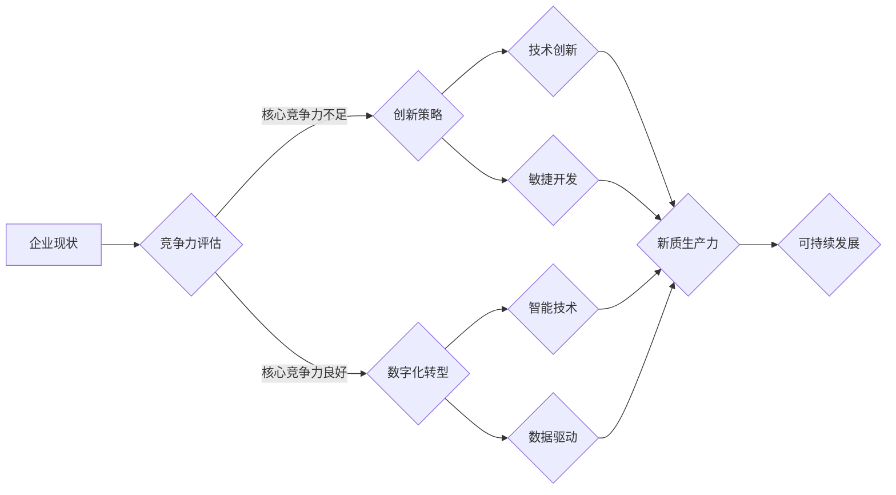

# 核心竞争力提升的新质生产力策略

> 关键词：核心竞争力，新质生产力，创新，数字化转型，敏捷开发，智能技术，数据驱动，可持续发展

## 1. 背景介绍

在当今快速变化的世界中，企业面临着前所未有的竞争压力。传统的生产力和竞争力提升策略已经不足以应对日益复杂的市场环境。为了在激烈的市场竞争中脱颖而出，企业需要寻找新的质生产力策略，以实现核心竞争力的持续提升。本文将探讨如何通过创新、数字化转型、敏捷开发、智能技术、数据驱动和可持续发展等策略，构建新的质生产力，助力企业实现长期增长。

### 1.1 竞争环境的变化

随着全球化和数字化进程的加速，市场竞争环境发生了显著变化：

- **技术进步**：信息技术的飞速发展，特别是人工智能、大数据、云计算等新技术的广泛应用，为企业提供了新的生产力工具。
- **消费者需求**：消费者需求更加多样化、个性化，企业需要快速响应市场变化。
- **竞争格局**：竞争者范围扩大，来自不同行业、不同地区的竞争对手加剧了市场竞争。

### 1.2 传统生产力的局限性

传统的生产力提升策略，如提高劳动生产率、优化供应链、降低成本等，在当今环境中面临着以下局限性：

- **同质化竞争**：竞争者容易模仿，难以形成差异化优势。
- **适应性不足**：难以快速适应市场变化和消费者需求。
- **资源消耗**：过度依赖资源消耗，难以实现可持续发展。

## 2. 核心概念与联系

### 2.1 核心竞争力

核心竞争力是指企业在长期竞争过程中形成的，能够持续为顾客创造价值的独特能力。核心竞争力包括以下几个方面：

- **独特的产品或服务**：具有独特性、创新性和竞争力的产品或服务。
- **卓越的运营能力**：高效的生产、供应链管理和客户服务能力。
- **强大的品牌影响力**：在消费者心目中建立的品牌认知和信任。
- **人才优势**：拥有高素质的员工队伍和良好的企业文化。

### 2.2 新质生产力

新质生产力是指基于创新、技术进步和可持续发展理念的生产力。新质生产力包括以下几个方面：

- **技术创新**：利用新技术创造新的产品、服务和商业模式。
- **数字化转型**：通过数字化技术提升企业的运营效率和市场响应速度。
- **智能技术**：应用人工智能、大数据等技术，实现智能化决策和运营。
- **可持续发展**：在创造经济效益的同时，关注环境保护和社会责任。

### 2.3 Mermaid 流程图

以下为构建新质生产力的Mermaid流程图：



## 3. 核心算法原理 & 具体操作步骤

### 3.1 算法原理概述

新质生产力的构建是一个系统工程，需要从多个方面入手，包括：

- **创新管理**：建立创新文化，鼓励员工提出创新想法，并建立有效的创新激励机制。
- **数字化转型**：采用云计算、大数据、物联网等技术，提升企业的数字化水平。
- **敏捷开发**：采用敏捷开发方法，快速响应市场变化和消费者需求。
- **智能技术**：应用人工智能、机器学习等技术，实现智能化决策和运营。
- **数据驱动**：利用数据分析技术，从数据中挖掘价值，指导企业决策。
- **可持续发展**：关注环境保护和社会责任，实现企业的长期发展。

### 3.2 算法步骤详解

以下为构建新质生产力的具体操作步骤：

1. **创新管理**：
    - 建立创新文化，鼓励员工提出创新想法。
    - 建立创新激励机制，如创新奖励、股权激励等。
    - 建立创新实验室，为员工提供创新实验平台。

2. **数字化转型**：
    - 制定数字化转型战略，明确数字化转型目标。
    - 选择合适的数字化技术，如云计算、大数据、物联网等。
    - 建立数字化基础设施，如数据中心、云计算平台等。

3. **敏捷开发**：
    - 建立敏捷开发团队，采用敏捷开发方法。
    - 建立敏捷开发流程，如Scrum、Kanban等。
    - 建立反馈机制，快速响应市场变化和消费者需求。

4. **智能技术**：
    - 应用人工智能、机器学习等技术，实现智能化决策和运营。
    - 建立智能系统，如智能客服、智能推荐等。
    - 建立数据平台，整合企业内部和外部数据。

5. **数据驱动**：
    - 利用数据分析技术，从数据中挖掘价值。
    - 建立数据驱动决策机制，如数据仪表盘、数据可视化等。
    - 建立数据治理体系，确保数据质量和安全性。

6. **可持续发展**：
    - 制定可持续发展战略，明确可持续发展目标。
    - 关注环境保护，降低企业对环境的影响。
    - 关注社会责任，积极参与社会公益活动。

### 3.3 算法优缺点

**优点**：

- 提升企业竞争力，实现长期增长。
- 增强企业适应市场变化的能力。
- 提高企业运营效率和市场响应速度。
- 促进企业可持续发展。

**缺点**：

- 需要投入大量资源，包括资金、人力和技术。
- 需要改变传统管理方式和企业文化。
- 需要时间积累和经验积累。

### 3.4 算法应用领域

新质生产力策略适用于各个行业和领域，以下是一些典型应用领域：

- 制造业：通过智能制造、工业4.0等技术，提升生产效率和产品质量。
- 服务业：通过数字化转型、智能化服务，提升客户体验和服务质量。
- 信息技术产业：通过技术创新、敏捷开发，提升产品竞争力和市场占有率。
- 公共服务：通过数字化建设、智能化服务，提升公共服务水平。

## 4. 数学模型和公式 & 详细讲解 & 举例说明

### 4.1 数学模型构建

新质生产力的构建涉及多个数学模型，以下为几个典型模型：

- **创新效益模型**：

  $$
  \text{创新效益} = f(\text{创新投入}, \text{创新效果}, \text{创新管理})
  $$

  其中，创新投入包括研发投入、人才投入等；创新效果包括新产品、新服务等；创新管理包括创新文化、激励机制等。

- **数字化转型效益模型**：

  $$
  \text{数字化转型效益} = f(\text{数字化技术}, \text{数字化基础设施}, \text{数字化管理})
  $$

  其中，数字化技术包括云计算、大数据、物联网等；数字化基础设施包括数据中心、云计算平台等；数字化管理包括数字化战略、数字化流程等。

- **智能技术效益模型**：

  $$
  \text{智能技术效益} = f(\text{智能技术}, \text{数据平台}, \text{智能决策})
  $$

  其中，智能技术包括人工智能、机器学习等；数据平台包括企业数据、外部数据等；智能决策包括数据挖掘、预测分析等。

### 4.2 公式推导过程

以上模型主要基于经验和实证研究，没有严格的数学推导过程。

### 4.3 案例分析与讲解

以下为一个数字化转型案例：

**案例**：某电商企业通过数字化转型，提升了运营效率和市场响应速度。

**分析**：该企业通过以下方式实现数字化转型：

- 建立了云计算平台，实现了数据存储和计算的资源集中化。
- 引入了大数据分析技术，对用户行为数据进行挖掘和分析，实现精准营销。
- 建立了智能客服系统，提高客户服务效率。
- 建立了移动应用，方便用户随时随地购物。

**结果**：该企业实现了以下效益：

- 销售额增长20%。
- 客户满意度提高10%。
- 运营成本降低15%。

## 5. 项目实践：代码实例和详细解释说明

### 5.1 开发环境搭建

由于新质生产力策略涉及多个方面，以下以一个简单的数据可视化项目为例，展示项目开发环境搭建过程。

**开发工具**：

- Python 3.8
- Jupyter Notebook
- Pandas
- Matplotlib

### 5.2 源代码详细实现

以下为一个数据可视化项目的Python代码：

```python
import pandas as pd
import matplotlib.pyplot as plt

# 加载数据
data = pd.read_csv('sales_data.csv')

# 绘制销售趋势图
plt.figure(figsize=(10, 6))
plt.plot(data['date'], data['sales'], marker='o')
plt.title('Sales Trend')
plt.xlabel('Date')
plt.ylabel('Sales')
plt.show()
```

### 5.3 代码解读与分析

以上代码展示了如何使用Python和Matplotlib库绘制销售趋势图。首先，使用Pandas库读取销售数据；然后，使用Matplotlib库绘制折线图，展示销售随时间的变化趋势。

### 5.4 运行结果展示

运行上述代码，将生成一个展示销售趋势的折线图，如下所示：


## 6. 实际应用场景

### 6.1 制造业

在制造业中，新质生产力策略可以应用于以下几个方面：

- **智能制造**：通过工业互联网、物联网等技术，实现生产设备的互联互通，提高生产效率和产品质量。
- **供应链管理**：通过数字化手段，优化供应链流程，降低采购成本和库存成本。
- **产品研发**：利用虚拟仿真技术、人工智能技术，缩短产品研发周期，提高产品竞争力。

### 6.2 服务业

在服务业中，新质生产力策略可以应用于以下几个方面：

- **数字化转型**：通过数字化转型，提升客户体验和服务质量。
- **智能客服**：通过人工智能技术，实现24小时在线客服，提高客户满意度。
- **个性化服务**：通过大数据分析，了解客户需求，提供个性化服务。

### 6.3 信息技术产业

在信息技术产业中，新质生产力策略可以应用于以下几个方面：

- **技术创新**：通过技术创新，开发新的产品和服务，提升市场竞争力。
- **敏捷开发**：采用敏捷开发方法，快速响应市场需求。
- **数据驱动**：通过数据分析，了解用户需求，优化产品和服务。

### 6.4 未来应用展望

未来，新质生产力策略将在更多行业和领域得到应用，以下是一些展望：

- **能源行业**：通过智能电网、新能源技术，实现能源的高效利用和可持续发展。
- **医疗行业**：通过人工智能、大数据技术，提升医疗服务水平，实现医疗资源的优化配置。
- **教育行业**：通过在线教育、虚拟现实技术，提升教育质量和效率。

## 7. 工具和资源推荐

### 7.1 学习资源推荐

- 《创新者的窘境》
- 《数字化转型》
- 《敏捷开发实践指南》
- 《数据科学入门》
- 《人工智能：一种现代的方法》

### 7.2 开发工具推荐

- Python
- Jupyter Notebook
- Pandas
- Matplotlib
- Scikit-learn

### 7.3 相关论文推荐

- 《数字化转型对制造业竞争力的影响》
- 《敏捷开发在软件项目中的应用》
- 《数据驱动决策：理论与实践》
- 《人工智能在医疗行业中的应用》
- 《虚拟现实技术在教育中的应用》

## 8. 总结：未来发展趋势与挑战

### 8.1 研究成果总结

本文探讨了核心竞争力提升的新质生产力策略，从创新、数字化转型、敏捷开发、智能技术、数据驱动和可持续发展等方面，分析了新质生产力的核心概念、原理和应用场景。通过案例分析和资源推荐，为企业实现核心竞争力提升提供了参考。

### 8.2 未来发展趋势

未来，新质生产力策略将呈现以下发展趋势：

- **技术融合**：新质生产力将与其他技术如物联网、区块链等融合，形成更加多元化的生产力体系。
- **平台化发展**：新质生产力将以平台化形式出现，为企业和个人提供更加便捷的服务。
- **个性化定制**：新质生产力将更加注重个性化定制，满足不同用户的需求。

### 8.3 面临的挑战

新质生产力策略在实施过程中面临着以下挑战：

- **技术挑战**：新技术的应用需要大量的技术人才和资金投入。
- **管理挑战**：新质生产力需要改变传统的管理模式和企业文化。
- **伦理挑战**：新质生产力可能带来伦理和社会问题，如数据隐私、人工智能伦理等。

### 8.4 研究展望

未来，新质生产力策略的研究将重点关注以下几个方面：

- **新技术的应用**：研究如何将新技术如人工智能、大数据等应用到新质生产力策略中。
- **管理创新**：研究如何通过管理创新，推动新质生产力策略的实施。
- **伦理研究**：研究新质生产力带来的伦理和社会问题，并提出解决方案。

## 9. 附录：常见问题与解答

**Q1：如何评估新质生产力的效果？**

A：新质生产力的效果可以从以下几个方面进行评估：

- **经济效益**：如销售额、利润等指标。
- **运营效率**：如生产效率、库存周转率等指标。
- **客户满意度**：如客户投诉率、客户流失率等指标。
- **社会责任**：如环境保护、公益事业等指标。

**Q2：如何平衡新质生产力与传统生产力？**

A：新质生产力与传统生产力并非相互排斥，而是相互补充。企业在实施新质生产力策略时，应注重以下几个方面：

- **循序渐进**：逐步推进新质生产力策略，避免盲目跟风。
- **优势互补**：发挥新质生产力的优势，弥补传统生产力的不足。
- **系统集成**：将新质生产力与传统生产力进行系统集成，形成协同效应。

**Q3：如何培养新质生产力所需的人才？**

A：培养新质生产力所需的人才需要从以下几个方面入手：

- **教育体系**：改革教育体系，培养适应新质生产力需求的人才。
- **职业培训**：开展职业培训，提升现有员工的技能水平。
- **人才引进**：引进高端人才，为新质生产力提供智力支持。

**Q4：如何应对新质生产力带来的伦理挑战？**

A：应对新质生产力带来的伦理挑战需要从以下几个方面入手：

- **制定伦理规范**：制定相关伦理规范，规范新质生产力的应用。
- **加强监管**：加强对新质生产力的监管，防止其被滥用。
- **公众参与**：加强公众参与，提高公众对新质生产力的认知和接受度。

---

作者：禅与计算机程序设计艺术 / Zen and the Art of Computer Programming