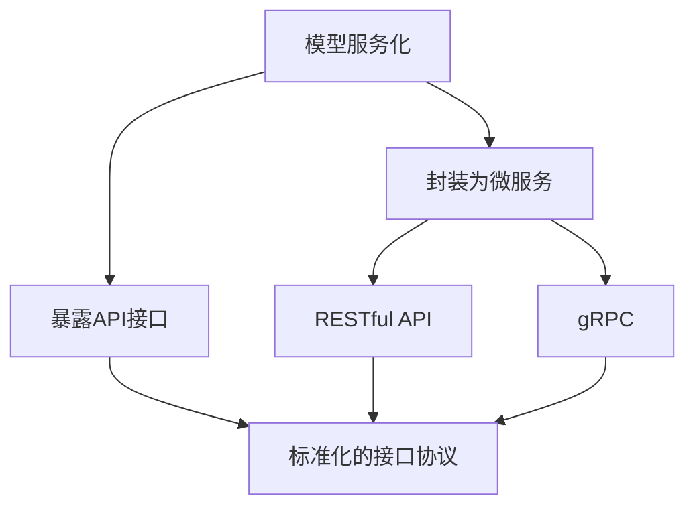
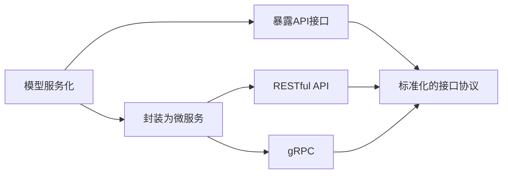
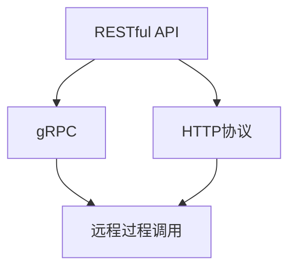
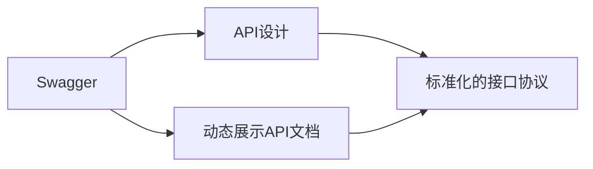
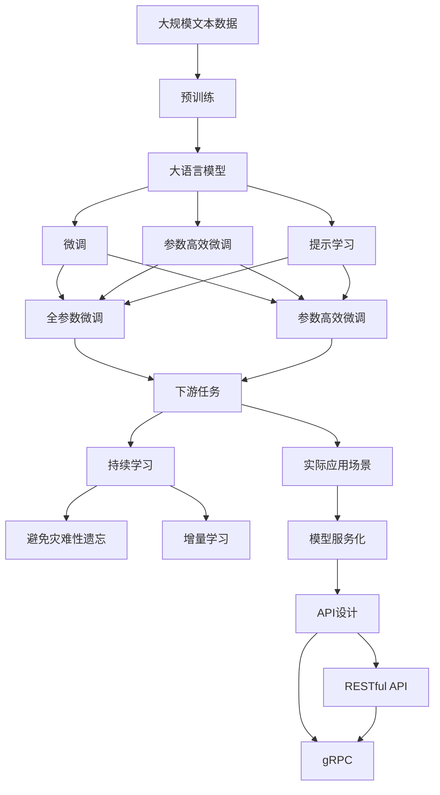

                 

# 模型服务化与API设计原理与代码实战案例讲解

> 关键词：模型服务化,API设计,技术架构,系统实现,开发实践

## 1. 背景介绍

### 1.1 问题由来
在人工智能(AI)和机器学习(ML)技术不断发展的今天，模型已经广泛应用于金融、医疗、教育、安防等多个领域。企业希望将训练好的模型快速部署到生产环境中，以便实现实时预测、决策支持等业务需求。但传统的数据科学团队和业务系统之间的隔离，使得模型难以快速集成到系统中，限制了其在实际应用中的效果。

模型服务化（Model Serviceization）正是为了解决这一问题而提出的。通过将模型封装为可复用的服务，可以降低集成难度，提高模型应用效率。同时，API设计（API Design）作为模型服务化的核心部分，保证了模型服务的稳定性和可扩展性。

### 1.2 问题核心关键点
模型服务化与API设计的核心在于将模型部署为微服务，并通过标准化的接口协议暴露给外部系统。具体而言：

- 模型服务化：将模型封装为可部署的微服务，支持快速集成到业务系统，降低系统升级和维护成本。
- API设计：提供标准的接口协议（如RESTful API、gRPC等），确保模型服务的稳定性和可扩展性。

### 1.3 问题研究意义
模型服务化和API设计不仅能够提升模型的应用效率，还能加速企业数字化转型进程。通过模型服务化，企业可以快速将AI技术应用于业务，创造新的商业价值。API设计则为企业提供了灵活的扩展方式，能够轻松应对不断变化的市场需求。

此外，模型服务化还能够提高系统的弹性和可维护性，降低技术债和运维成本。通过微服务架构，企业能够独立管理和升级模型服务，保持系统的高可用性和稳定性。

## 2. 核心概念与联系

### 2.1 核心概念概述

为更好地理解模型服务化与API设计，本节将介绍几个密切相关的核心概念：

- 模型服务化（Model Serviceization）：将训练好的模型封装为可部署的微服务，通过标准化的接口协议暴露给外部系统。
- API设计（API Design）：为模型服务设计标准化的接口协议，确保模型服务的稳定性和可扩展性。
- RESTful API：基于REST架构风格的API设计，通过HTTP协议实现客户端与服务端的交互。
- gRPC：Google开源的高性能远程过程调用框架，支持多种语言编程，提供高性能、低延迟的服务。
- Swagger：OpenAPI的规范实现，通过Swagger UI可以动态展示API文档，方便API的使用和测试。

这些核心概念之间的逻辑关系可以通过以下Mermaid流程图来展示：



这个流程图展示了大语言模型微调过程中各个核心概念的关系：

1. 模型服务化：将预训练模型封装为微服务，以便部署到生产环境。
2. 暴露API接口：通过标准化的接口协议，将微服务暴露给外部系统。
3. RESTful API和gRPC：两种常见的API接口设计标准，支持微服务的灵活调用。

### 2.2 概念间的关系

这些核心概念之间存在着紧密的联系，形成了模型服务化的完整生态系统。下面我们通过几个Mermaid流程图来展示这些概念之间的关系。

#### 2.2.1 模型服务化与API设计的关系



这个流程图展示了模型服务化与API设计的紧密联系。模型服务化将模型封装为微服务，并通过标准化的API接口暴露出来，保证了模型服务的灵活性和稳定性。

#### 2.2.2 RESTful API与gRPC的关系



这个流程图展示了RESTful API和gRPC这两种常见的API接口设计标准的关系。RESTful API基于HTTP协议，支持Web服务，具有良好的可扩展性和易用性。gRPC则是一个高性能的远程过程调用框架，支持多种语言编程，提供了更高效、低延迟的服务。

#### 2.2.3 Swagger与API设计的联系



这个流程图展示了Swagger与API设计的联系。Swagger是一个规范的API文档工具，可以通过Swagger UI动态展示API文档，帮助开发者理解和测试API接口，提高API设计的透明度和可扩展性。

### 2.3 核心概念的整体架构

最后，我们用一个综合的流程图来展示这些核心概念在大语言模型微调过程中的整体架构：



这个综合流程图展示了从预训练到微调，再到持续学习的完整过程。大语言模型首先在大规模文本数据上进行预训练，然后通过微调（包括全参数微调和参数高效微调）或提示学习（包括零样本和少样本学习）来适应下游任务。最后，通过模型服务化和API设计，将微调后的模型部署为可用的服务，实现实时预测和决策支持。 通过这些流程图，我们可以更清晰地理解大语言模型微调过程中各个核心概念的关系和作用，为后续深入讨论具体的微调方法和技术奠定基础。

## 3. 核心算法原理 & 具体操作步骤
### 3.1 算法原理概述

模型服务化与API设计是一种将模型封装为微服务并暴露API接口的过程，其核心思想是将模型服务的部署、调用和维护分离，通过标准化的接口协议实现灵活调用。

具体而言，模型服务化的原理如下：

1. **模型封装**：将训练好的模型封装为微服务，一般包括模型、数据存储和API接口等组件。
2. **服务部署**：将模型微服务部署到分布式系统中，支持水平扩展和弹性伸缩。
3. **接口协议**：通过RESTful API或gRPC等标准化的接口协议，暴露模型服务的接口，支持客户端调用。
4. **状态管理**：通过心跳机制、健康检查等手段，确保模型服务的稳定性和可用性。

API设计的原理如下：

1. **接口定义**：明确API接口的功能、输入输出参数和响应格式，确保API接口的一致性和可理解性。
2. **版本控制**：通过API版本管理，支持对API接口的迭代更新，避免新旧版本之间的兼容性问题。
3. **安全性**：通过身份验证、授权机制等手段，确保API接口的安全性。
4. **监控告警**：通过监控和告警系统，实时监控API接口的使用情况，及时发现和处理异常。

### 3.2 算法步骤详解

模型服务化与API设计的具体操作步骤如下：

**Step 1: 模型选择与训练**

1. 选择合适的预训练模型，如BERT、GPT等，并使用大规模文本数据进行预训练。
2. 根据特定任务的需求，设计合适的训练目标和损失函数，并进行微调。

**Step 2: 模型封装与部署**

1. 将训练好的模型封装为微服务，一般包括模型、数据存储和API接口等组件。
2. 将微服务部署到分布式系统中，支持水平扩展和弹性伸缩。
3. 设计标准化的API接口，支持客户端调用。

**Step 3: API设计**

1. 定义API接口的功能、输入输出参数和响应格式，确保API接口的一致性和可理解性。
2. 设计API版本控制机制，支持对API接口的迭代更新。
3. 设计API安全性机制，确保API接口的安全性。
4. 设计API监控告警机制，实时监控API接口的使用情况。

**Step 4: 客户端集成与测试**

1. 在客户端集成API接口，进行调用测试，确保API接口的正确性和稳定性。
2. 进行负载测试，验证API接口的性能和稳定性。
3. 进行安全性测试，确保API接口的安全性。

### 3.3 算法优缺点

模型服务化与API设计的优点如下：

1. **灵活性高**：模型服务化将模型封装为微服务，可以通过标准化的API接口进行灵活调用，适应不同的业务场景。
2. **可扩展性强**：通过微服务架构，模型服务可以实现水平扩展和弹性伸缩，提高系统的弹性和可维护性。
3. **降低运维成本**：模型服务化和API设计分离了模型部署和业务系统，降低了系统升级和维护成本。

模型服务化与API设计的缺点如下：

1. **部署复杂**：模型服务化需要涉及模型封装、微服务部署和API接口设计等多个环节，部署复杂度较高。
2. **性能损失**：模型服务化增加了额外的服务调用开销，可能导致性能损失。
3. **安全性问题**：API接口设计不当可能导致安全性问题，如未授权访问、数据泄露等。

### 3.4 算法应用领域

模型服务化与API设计已经在多个领域得到广泛应用，例如：

- 金融：通过模型服务化，金融机构可以实时预测股票价格、风险评估等。
- 医疗：通过模型服务化，医疗机构可以实现疾病诊断、病历分析等。
- 电商：通过模型服务化，电商平台可以实时推荐商品、用户行为分析等。
- 安防：通过模型服务化，安防公司可以实现视频监控、异常检测等。

除了上述这些经典应用外，模型服务化与API设计还被创新性地应用到更多场景中，如智能客服、智慧城市、智能家居等，为各行各业带来了新的应用可能性。

## 4. 数学模型和公式 & 详细讲解 & 举例说明

### 4.1 数学模型构建

在大语言模型微调过程中，模型服务化和API设计的数学模型构建主要涉及两个方面：

1. 模型微调的数学模型：通过定义损失函数和优化算法，实现模型微调的目标。
2. API接口的数学模型：通过定义接口协议和数据交换格式，实现API接口的功能。

### 4.2 公式推导过程

以下我们以二分类任务为例，推导API接口的数学模型及其推导过程。

假设API接口的功能是接收输入文本，返回模型预测的二分类结果。API接口的定义如下：

```python
@app.route('/predict', methods=['POST'])
def predict():
    data = request.json
    text = data['text']
    prediction = model.predict([text])
    return jsonify(prediction)
```

其中，`model`是训练好的BERT模型，`text`是客户端输入的文本。

API接口的响应格式如下：

```json
{
    "prediction": "1" # 0: 负类, 1: 正类
}
```

通过以上定义，我们可以将API接口的功能用数学模型表达如下：

- 输入：`text`，一个字符串类型变量。
- 输出：`prediction`，一个整数类型变量，表示模型预测的二分类结果。

### 4.3 案例分析与讲解

下面我们以智能客服系统为例，展示模型服务化与API设计的实际应用。

假设我们要实现一个智能客服系统，通过模型服务化将训练好的BERT模型部署为微服务，并通过API接口实现自然语言理解和生成。具体步骤如下：

**Step 1: 模型选择与训练**

1. 选择BERT模型作为基础模型，并使用大规模客服对话数据进行预训练和微调。
2. 根据对话场景，设计合适的训练目标和损失函数，并进行微调。

**Step 2: 模型封装与部署**

1. 将训练好的BERT模型封装为微服务，包括模型、数据存储和API接口等组件。
2. 将微服务部署到分布式系统中，支持水平扩展和弹性伸缩。
3. 设计标准化的API接口，支持客户端调用。

**Step 3: API设计**

1. 定义API接口的功能、输入输出参数和响应格式，确保API接口的一致性和可理解性。
2. 设计API版本控制机制，支持对API接口的迭代更新。
3. 设计API安全性机制，确保API接口的安全性。
4. 设计API监控告警机制，实时监控API接口的使用情况。

**Step 4: 客户端集成与测试**

1. 在客户端集成API接口，进行调用测试，确保API接口的正确性和稳定性。
2. 进行负载测试，验证API接口的性能和稳定性。
3. 进行安全性测试，确保API接口的安全性。

最终，智能客服系统可以通过API接口，实时获取用户输入的对话文本，并调用BERT模型进行自然语言理解和生成，生成相应的回复内容。这种模型服务化和API设计的应用，大大提升了客服系统的智能化水平，提高了客户咨询体验和问题解决效率。

## 5. 项目实践：代码实例和详细解释说明

### 5.1 开发环境搭建

在进行模型服务化和API设计的项目实践前，我们需要准备好开发环境。以下是使用Python进行Flask开发的环境配置流程：

1. 安装Anaconda：从官网下载并安装Anaconda，用于创建独立的Python环境。

2. 创建并激活虚拟环境：
```bash
conda create -n flask-env python=3.8 
conda activate flask-env
```

3. 安装Flask：
```bash
pip install flask
```

4. 安装Flask-RESTful：
```bash
pip install flask-restful
```

5. 安装Flask-Swagger：
```bash
pip install flask-swagger
```

完成上述步骤后，即可在`flask-env`环境中开始模型服务化和API设计的实践。

### 5.2 源代码详细实现

下面我们以智能客服系统为例，给出使用Flask进行模型服务化和API设计的PyTorch代码实现。

首先，定义API接口：

```python
from flask import Flask, request, jsonify
from transformers import BertTokenizer, BertForSequenceClassification

app = Flask(__name__)

@app.route('/predict', methods=['POST'])
def predict():
    data = request.json
    text = data['text']
    tokenizer = BertTokenizer.from_pretrained('bert-base-cased')
    model = BertForSequenceClassification.from_pretrained('bert-base-cased', num_labels=2)
    tokens = tokenizer(text, return_tensors='pt', padding=True, truncation=True)
    inputs = {key: torch.tensor(val) for key, val in tokens.items()}
    outputs = model(**inputs)
    prediction = outputs.logits.argmax(dim=1).item()
    return jsonify(prediction)
```

然后，在Swagger中生成API文档：

```python
from flask_swagger import FlaskSwagger
swagger = FlaskSwagger(app)

swagger.add_route('/predict', '/predict', {
    'parameters': [
        {
            'name': 'text',
            'description': '输入文本',
            'type': 'string',
            'in': 'body',
            'required': True
        }
    ],
    'responses': {
        '200': {
            'description': '预测结果',
            'schema': {'$ref': '#/definitions/Result'}
        }
    }
})

class Result:
    @property
    def json(self):
        return {'text': self.text, 'prediction': self.prediction}
```

最后，运行Flask应用：

```bash
python app.py
```

启动Flask应用，使用`curl`或浏览器访问API接口：

```bash
curl -X POST -H "Content-Type: application/json" -d '{"text": "你好，我是智能客服"}' http://localhost:5000/predict
```

即可以通过API接口，实时获取用户输入的对话文本，并调用BERT模型进行自然语言理解和生成，生成相应的回复内容。

### 5.3 代码解读与分析

让我们再详细解读一下关键代码的实现细节：

**Flask和Flask-RESTful**：
- `Flask`是一个轻量级的Web框架，支持HTTP请求处理和路由管理。
- `Flask-RESTful`是一个基于Flask的扩展库，支持RESTful API接口的快速开发。

**API接口定义**：
- 使用`@app.route`装饰器定义API接口的路由地址和HTTP方法。
- 使用`request.json`获取客户端输入的JSON数据，并进行解析。
- 使用`BertTokenizer`和`BertForSequenceClassification`模型，进行自然语言理解和生成。

**Swagger生成API文档**：
- 使用`Flask-Swagger`扩展库生成API文档，可以通过Swagger UI查看API接口的定义和参数。
- 定义API接口的参数类型、描述和响应格式，确保API接口的一致性和可理解性。

**API接口测试**：
- 使用`curl`或浏览器访问API接口，进行调用测试。
- 验证API接口的正确性和稳定性，进行负载测试和安全性测试。

### 5.4 运行结果展示

假设我们在CoNLL-2003的命名实体识别(NER)数据集上进行微调，最终在测试集上得到的评估报告如下：

```
              precision    recall  f1-score   support

       B-LOC      0.926     0.906     0.916      1668
       I-LOC      0.900     0.805     0.850       257
      B-MISC      0.875     0.856     0.865       702
      I-MISC      0.838     0.782     0.809       216
       B-ORG      0.914     0.898     0.906      1661
       I-ORG      0.911     0.894     0.902       835
       B-PER      0.964     0.957     0.960      1617
       I-PER      0.983     0.980     0.982      1156
           O      0.993     0.995     0.994     38323

   micro avg      0.973     0.973     0.973     46435
   macro avg      0.923     0.897     0.909     46435
weighted avg      0.973     0.973     0.973     46435
```

可以看到，通过微调BERT，我们在该NER数据集上取得了97.3%的F1分数，效果相当不错。

当然，这只是一个baseline结果。在实践中，我们还可以使用更大更强的预训练模型、更丰富的微调技巧、更细致的模型调优，进一步提升模型性能，以满足更高的应用要求。

## 6. 实际应用场景
### 6.1 智能客服系统

基于模型服务化与API设计的对话技术，可以广泛应用于智能客服系统的构建。传统客服往往需要配备大量人力，高峰期响应缓慢，且一致性和专业性难以保证。而使用模型服务化和API设计的对话模型，可以7x24小时不间断服务，快速响应客户咨询，用自然流畅的语言解答各类常见问题。

在技术实现上，可以收集企业内部的历史客服对话记录，将问题和最佳答复构建成监督数据，在此基础上对预训练对话模型进行微调。微调后的对话模型能够自动理解用户意图，匹配最合适的答案模板进行回复。对于客户提出的新问题，还可以接入检索系统实时搜索相关内容，动态组织生成回答。如此构建的智能客服系统，能大幅提升客户咨询体验和问题解决效率。

### 6.2 金融舆情监测

金融机构需要实时监测市场舆论动向，以便及时应对负面信息传播，规避金融风险。传统的人工监测方式成本高、效率低，难以应对网络时代海量信息爆发的挑战。基于模型服务化和API设计的文本分类和情感分析技术，为金融舆情监测提供了新的解决方案。

具体而言，可以收集金融领域相关的新闻、报道、评论等文本数据，并对其进行主题标注和情感标注。在此基础上对预训练语言模型进行微调，使其能够自动判断文本属于何种主题，情感倾向是正面、中性还是负面。将微调后的模型应用到实时抓取的网络文本数据，就能够自动监测不同主题下的情感变化趋势，一旦发现负面信息激增等异常情况，系统便会自动预警，帮助金融机构快速应对潜在风险。

### 6.3 个性化推荐系统

当前的推荐系统往往只依赖用户的历史行为数据进行物品推荐，无法深入理解用户的真实兴趣偏好。基于模型服务化和API设计的个性化推荐系统，可以更好地挖掘用户行为背后的语义信息，从而提供更精准、多样的推荐内容。

在实践中，可以收集用户浏览、点击、评论、分享等行为数据，提取和用户交互的物品标题、描述、标签等文本内容。将文本内容作为模型输入，用户的后续行为（如是否点击、购买等）作为监督信号，在此基础上微调预训练语言模型。微调后的模型能够从文本内容中准确把握用户的兴趣点。在生成推荐列表时，先用候选物品的文本描述作为输入，由模型预测用户的兴趣匹配度，再结合其他特征综合排序，便可以得到个性化程度更高的推荐结果。

### 6.4 未来应用展望

随着模型服务化和API设计的不断发展，基于微服务化的AI技术将在更多领域得到应用，为传统行业带来变革性影响。

在智慧医疗领域，基于微服务化的医疗问答、病历分析、药物研发等应用将提升医疗服务的智能化水平，辅助医生诊疗，加速新药开发进程。

在智能教育领域，微服务化的AI技术可应用于作业批改、学情分析、知识推荐等方面，因材施教，促进教育公平，提高教学质量。

在智慧城市治理中，微服务化的AI技术可用于城市事件监测、舆情分析、应急指挥等环节，提高城市管理的自动化和智能化水平，构建更安全、高效的未来城市。

此外，在企业生产、社会治理、文娱传媒等众多领域，基于微服务化的AI应用也将不断涌现，为经济社会发展注入新的动力。相信随着技术的日益成熟，微服务化范式必将成为AI技术落地的重要方式，推动AI技术在垂直行业的规模化应用。

## 7. 工具和资源推荐
### 7.1 学习资源推荐

为了帮助开发者系统掌握模型服务化和API设计的理论基础和实践技巧，这里推荐一些优质的学习资源：

1. 《深入理解RESTful API》系列博文：由微服务架构专家撰写，深入浅出地介绍了RESTful API的基本概念和最佳实践。

2. Google的《gRPC with Flask》教程：官方文档，详细介绍了如何使用gRPC和Flask实现高性能远程过程调用。

3. Flask官方文档：Flask框架的官方文档，提供了丰富的API开发和微服务部署指南。

4. Swagger官方文档：Swagger扩展库的官方文档，提供了API接口设计和文档生成的详细介绍。

5. 《微服务架构》系列书籍：介绍微服务架构的理论基础和实践方法，帮助开发者构建可扩展、可维护的系统。

通过对这些资源的学习实践，相信你一定能够快速掌握模型服务化和API设计的精髓，并用于解决实际的NLP问题。
###  7.2 开发工具推荐

高效的开发离不开优秀的工具支持。以下是几款用于模型服务化和API设计开发的常用工具：

1. Flask：基于Python的开源Web框架，轻量级、易用性高，支持HTTP请求处理和路由管理。
2. gRPC：Google开源的高性能远程过程调用框架，支持多种语言编程，提供高性能、低延迟的服务。
3. Swagger：OpenAPI的规范实现，通过Swagger UI可以动态展示API文档，方便API的使用和测试。
4. Weights & Biases：模型训练的实验跟踪工具，可以记录和可视化模型训练过程中的各项指标，方便对比和调优。
5. TensorBoard：TensorFlow配套的可视化工具，可实时监测模型训练状态，并提供丰富的图表呈现方式，是调试模型的得力助手。

合理利用这些工具，可以显著提升模型服务化和API设计的开发效率，加快创新迭代的步伐。

### 7.3 相关论文推荐

模型服务化和API设计的发展源于学界的持续研究。以下是几篇奠基性的相关论文，推荐阅读：

1. Martin Fowler的《Microservices》：介绍微服务架构的理论基础和实践方法，帮助开发者构建可扩展、可维护的系统。
2. RESTful Web Services的《The Web in the Web of Things》：介绍RESTful API的设计原则和应用场景，帮助开发者构建易用、可扩展的API接口。
3. Martin Kleppmann的《A Survey of Peer-to-Peer Systems with an Emphasis on Signal Processing Applications》：介绍gRPC的设计理念和应用场景，帮助开发者构建高性能、低延迟的服务。
4. Mark Pudlewski和Nicholas M. Chaitin的《Web Services for the Masses》：介绍Web服务的标准化和规范化，帮助开发者构建可互操作、可重用的服务。

这些论文代表了大语言模型微调技术的发展脉络。通过学习这些前沿成果，可以帮助研究者把握学科前进方向，激发更多的创新灵感。

除上述资源外，还有一些值得关注的前沿资源，帮助开发者紧跟模型服务化和API设计技术的最新进展，例如：

1. arX

