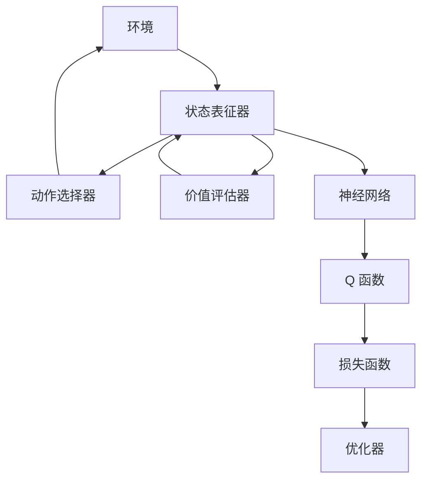

                 

# 深度 Q-learning：未来人工智能法规的挑战

## 1. 背景介绍

随着深度学习和强化学习的快速发展，人工智能在众多领域的应用越来越广泛。其中，深度 Q-learning（Deep Q-Learning, DQN）作为强化学习的一个分支，通过构建神经网络模型来近似Q函数，已经在自动控制、游戏AI、机器人等领域取得了显著的成果。然而，深度 Q-learning 在实际应用中也面临一系列的伦理、法律和监管挑战，这些问题不仅影响其应用前景，还可能引发社会对人工智能技术的不信任和担忧。本文旨在探讨深度 Q-learning 的未来人工智能法规挑战，并提出相应的解决方案。

## 2. 核心概念与联系

### 2.1 核心概念概述

深度 Q-learning 是一种基于神经网络的强化学习算法，用于学习智能体在环境中的最优策略。其核心思想是通过与环境交互，收集状态、动作和奖励信息，利用神经网络逼近 Q 函数，从而指导智能体进行最优策略的选择。

深度 Q-learning 模型主要由三个核心组件组成：状态表征器、动作选择器和价值评估器。状态表征器负责将环境状态映射为模型可以处理的形式；动作选择器根据当前状态和模型预测的 Q 值，选择最优动作；价值评估器则通过蒙特卡罗方法或其他方式，评估 Q 函数的值。

### 2.2 概念间的关系

深度 Q-learning 与传统的强化学习算法（如Q-learning）有着密切的关系，其主要区别在于使用深度神经网络逼近 Q 函数，从而能够处理更加复杂的环境状态。深度 Q-learning 也在很大程度上受益于深度学习领域的发展，如数据增强、迁移学习等技术。同时，深度 Q-learning 的应用也面临着与深度学习相同的伦理和法律问题，如数据隐私、算法透明度等。

以下 Mermaid 流程图展示了深度 Q-learning 的训练过程和与环境交互的基本逻辑：



这个流程图展示了深度 Q-learning 的基本流程：

1. 环境输出当前状态。
2. 状态表征器将状态转换为模型可处理的向量。
3. 动作选择器根据当前状态和模型预测的 Q 值，选择最优动作。
4. 环境根据动作输出奖励和下一状态。
5. 价值评估器使用蒙特卡罗方法或其他方式，评估 Q 函数的值。
6. 损失函数计算预测 Q 值与真实 Q 值之间的差距。
7. 优化器根据损失函数更新模型参数。

## 3. 核心算法原理 & 具体操作步骤

### 3.1 算法原理概述

深度 Q-learning 通过构建神经网络模型来近似 Q 函数，从而实现智能体的最优策略学习。其主要流程如下：

1. 初始化神经网络模型，将神经网络的权重设置为随机值。
2. 从环境中随机选择一个初始状态，并根据模型预测的 Q 值选择动作。
3. 根据动作和环境交互的结果，计算下一个状态、奖励和下一轮状态的 Q 值。
4. 使用蒙特卡罗方法或经验回放等技术，计算出动作的 Q 值，并使用损失函数更新模型参数。
5. 重复步骤 2-4，直到智能体达到目标状态或达到预设的迭代次数。

### 3.2 算法步骤详解

以下是深度 Q-learning 的具体操作步骤：

**Step 1: 模型初始化**

- 定义神经网络模型，选择合适的激活函数、损失函数和优化器。
- 初始化模型参数，设置学习率等超参数。

**Step 2: 选择动作**

- 将当前状态输入模型，得到各个动作对应的 Q 值。
- 根据 Q 值选择一个动作。

**Step 3: 与环境交互**

- 执行所选动作，观察环境状态和奖励。
- 根据奖励更新状态，计算下一个状态。

**Step 4: 计算 Q 值**

- 使用蒙特卡罗方法或其他方式计算下一个状态的 Q 值。
- 根据 Q 值更新模型参数。

**Step 5: 训练结束**

- 重复步骤 2-4，直到达到预设的迭代次数或智能体达到目标状态。

### 3.3 算法优缺点

深度 Q-learning 的优点包括：

1. 能够处理高维状态空间和连续动作空间，具有很强的泛化能力。
2. 能够处理复杂的环境状态，适用于动态变化的场景。
3. 可以使用深度神经网络逼近 Q 函数，降低特征工程的工作量。

深度 Q-learning 的缺点包括：

1. 需要大量的标注数据和计算资源，训练成本较高。
2. 模型难以解释，难以理解其决策过程。
3. 容易陷入局部最优解，难以达到全局最优。

### 3.4 算法应用领域

深度 Q-learning 在自动控制、游戏AI、机器人等领域有着广泛的应用，具体应用场景包括：

- 自动驾驶：通过训练智能体在模拟环境中学习驾驶策略，提升自动驾驶的稳定性和安全性。
- 游戏AI：用于训练游戏中的智能体，使其具备高水平的策略和决策能力。
- 机器人控制：通过深度 Q-learning 训练机器人，使其能够在复杂环境中完成特定任务。

## 4. 数学模型和公式 & 详细讲解 & 举例说明

### 4.1 数学模型构建

深度 Q-learning 模型的数学模型如下：

- 状态表征器：$\phi: S \rightarrow \mathbb{R}^d$
- 动作选择器：$\pi: S \rightarrow A$
- Q 函数：$Q: S \times A \rightarrow \mathbb{R}$
- 损失函数：$L: \mathbb{R} \rightarrow \mathbb{R}$
- 优化器：$O: \mathbb{R} \rightarrow \Delta \theta$

其中，$S$ 表示状态空间，$A$ 表示动作空间，$d$ 表示状态表征器的输出维度，$\theta$ 表示模型参数。

### 4.2 公式推导过程

深度 Q-learning 的核心公式为 Bellman 方程：

$$
Q(s, a) = r + \gamma \mathbb{E}_Q[Q(s', a')]
$$

其中，$r$ 表示当前状态的奖励，$\gamma$ 表示折扣因子，$s'$ 和 $a'$ 分别表示下一个状态和动作。

在深度 Q-learning 中，通过神经网络逼近 Q 函数，可以使用如下公式进行更新：

$$
\theta \leftarrow \theta - \eta \nabla_{\theta} \mathcal{L}(\theta)
$$

其中，$\eta$ 表示学习率，$\nabla_{\theta} \mathcal{L}(\theta)$ 表示损失函数对模型参数的梯度。

### 4.3 案例分析与讲解

假设有一个简单的智能体，需要在迷宫中找到出口。通过深度 Q-learning 训练，智能体能够在迷宫中学习到最优的行动策略。

- 初始化神经网络模型，设置状态表征器、动作选择器和价值评估器的结构。
- 将迷宫的每个状态转换为模型可以处理的向量。
- 通过训练数据集，使用蒙特卡罗方法计算 Q 值，更新模型参数。
- 在测试数据集上，观察智能体的表现，评估其行动策略的有效性。

## 5. 项目实践：代码实例和详细解释说明

### 5.1 开发环境搭建

进行深度 Q-learning 的实践，需要安装 PyTorch、TensorFlow 或 Keras 等深度学习框架，以及相应的库和工具。

### 5.2 源代码详细实现

以下是一个简单的深度 Q-learning 示例代码，用于在迷宫中找到出口：

```python
import torch
import torch.nn as nn
import torch.optim as optim
import numpy as np
import gym

# 定义神经网络模型
class QNetwork(nn.Module):
    def __init__(self, input_size, output_size):
        super(QNetwork, self).__init__()
        self.fc1 = nn.Linear(input_size, 64)
        self.fc2 = nn.Linear(64, 32)
        self.fc3 = nn.Linear(32, output_size)
        
    def forward(self, x):
        x = self.fc1(x)
        x = nn.functional.relu(x)
        x = self.fc2(x)
        x = nn.functional.relu(x)
        x = self.fc3(x)
        return x

# 定义智能体的动作选择策略
def choose_action(state, model):
    state = torch.from_numpy(state).float()
    with torch.no_grad():
        q_values = model(state)
    action = np.argmax(q_values.numpy()[0])
    return action

# 定义迷宫环境
env = gym.make('CartPole-v1')

# 定义训练参数
learning_rate = 0.01
discount_factor = 0.99
batch_size = 32
num_episodes = 500

# 初始化模型和优化器
model = QNetwork(env.observation_space.shape[0], env.action_space.n)
optimizer = optim.Adam(model.parameters(), lr=learning_rate)

# 训练过程
for episode in range(num_episodes):
    state = env.reset()
    state = np.expand_dims(state, 0)
    done = False
    total_reward = 0
    while not done:
        action = choose_action(state, model)
        next_state, reward, done, _ = env.step(action)
        next_state = np.expand_dims(next_state, 0)
        q_values_next = model(next_state)
        q_values_next[0][action] += (reward + discount_factor * torch.max(q_values_next).item())
        loss = nn.functional.mse_loss(torch.tensor([q_values_next[0][action]], device='cuda'), model(torch.tensor([state], device='cuda')))
        optimizer.zero_grad()
        loss.backward()
        optimizer.step()
        total_reward += reward
        state = next_state
    print(f'Episode {episode+1}, reward: {total_reward}')
```

### 5.3 代码解读与分析

在这个示例代码中，我们定义了一个简单的神经网络模型，用于逼近 Q 函数。智能体的动作选择策略通过神经网络的输出值来选择最优动作。

在训练过程中，我们通过蒙特卡罗方法计算 Q 值，并使用均方误差损失函数更新模型参数。最终在迷宫环境中测试智能体的表现。

## 6. 实际应用场景

深度 Q-learning 在实际应用中有着广泛的前景，以下是一些典型应用场景：

### 6.4 未来应用展望

未来，深度 Q-learning 将在更多领域发挥重要作用，包括但不限于：

- 医疗：用于训练医疗机器人，帮助医生进行复杂手术。
- 金融：用于训练金融交易系统，进行自动投资和风险管理。
- 制造业：用于训练机器人，优化生产流程和资源分配。
- 教育：用于训练智能辅导系统，提供个性化学习方案。

## 7. 工具和资源推荐

### 7.1 学习资源推荐

深度 Q-learning 的学习资源丰富，以下是一些推荐的资源：

1. Deep Q-Learning: 书籍《Deep Q-Learning》，由 Ian Osband 和 Pieter Abbeel 撰写。
2. 在线课程：《Deep Reinforcement Learning Specialization》，由 David Silver 和 Ian Osband 等人授课。
3. GitHub 仓库：https://github.com/openai/baselines，包含深度 Q-learning 的代码和论文。
4. 论文《Playing Atari with Deep Reinforcement Learning》，由 Volodymyr Mnih 等人发表。

### 7.2 开发工具推荐

进行深度 Q-learning 的开发，需要以下工具：

1. PyTorch：深度学习框架，支持动态计算图和 GPU 加速。
2. TensorFlow：深度学习框架，支持分布式计算和 GPU 加速。
3. Keras：深度学习框架，支持快速的模型定义和训练。
4. OpenAI Gym：环境库，用于模拟和测试深度 Q-learning 模型。

### 7.3 相关论文推荐

深度 Q-learning 的相关论文众多，以下是一些推荐的论文：

1. Deep Q-Learning for Artificial Intelligence Research：由 David Silver 等人发表，介绍了深度 Q-learning 的基本原理和应用。
2. Continuous Control with Deep Reinforcement Learning：由 Volodymyr Mnih 等人发表，介绍了深度 Q-learning 在连续控制中的应用。
3. Human-Level Control through Deep Reinforcement Learning：由 Volodymyr Mnih 等人发表，介绍了深度 Q-learning 在控制问题中的效果。

## 8. 总结：未来发展趋势与挑战

### 8.1 研究成果总结

深度 Q-learning 在自动控制、游戏AI、机器人等领域取得了显著的进展，但仍然面临诸多挑战。未来需要进一步研究如何提升模型的鲁棒性和泛化能力，降低训练成本，提高算法的可解释性。

### 8.2 未来发展趋势

未来，深度 Q-learning 将向以下几个方向发展：

1. 多智能体系统：在多智能体环境中训练深度 Q-learning 模型，实现更复杂的合作和竞争。
2. 强化学习与深度学习融合：将深度学习与强化学习相结合，提升模型的学习能力和适应性。
3. 分布式训练：通过分布式计算，加速深度 Q-learning 的训练过程。
4. 深度 Q-learning 在机器人控制中的应用：深度 Q-learning 在机器人控制中的应用将进一步扩展。
5. 深度 Q-learning 在自然语言处理中的应用：深度 Q-learning 将应用于自然语言处理领域，提升模型的推理和生成能力。

### 8.3 面临的挑战

深度 Q-learning 面临的挑战包括：

1. 训练成本高：深度 Q-learning 需要大量的标注数据和计算资源，训练成本较高。
2. 模型难以解释：深度 Q-learning 模型复杂，难以理解其决策过程。
3. 容易陷入局部最优解：深度 Q-learning 模型容易陷入局部最优解，难以达到全局最优。
4. 算法透明度不足：深度 Q-learning 模型的决策过程难以透明化，难以进行监管和审计。

### 8.4 研究展望

未来，深度 Q-learning 的研究方向包括：

1. 研究更好的模型结构和训练方法：通过改进神经网络结构和训练方法，提升深度 Q-learning 模型的性能和泛化能力。
2. 研究更好的数据生成方法：通过数据生成技术，降低深度 Q-learning 对标注数据的依赖。
3. 研究更好的优化方法：通过优化算法，提升深度 Q-learning 模型的训练速度和效果。
4. 研究更好的算法监管方法：通过算法监管技术，提升深度 Q-learning 模型的透明度和可解释性。

## 9. 附录：常见问题与解答

**Q1: 深度 Q-learning 的优缺点是什么？**

A: 深度 Q-learning 的优点包括：

1. 能够处理高维状态空间和连续动作空间，具有很强的泛化能力。
2. 能够处理复杂的环境状态，适用于动态变化的场景。
3. 可以使用深度神经网络逼近 Q 函数，降低特征工程的工作量。

深度 Q-learning 的缺点包括：

1. 需要大量的标注数据和计算资源，训练成本较高。
2. 模型难以解释，难以理解其决策过程。
3. 容易陷入局部最优解，难以达到全局最优。

**Q2: 如何优化深度 Q-learning 模型的训练过程？**

A: 优化深度 Q-learning 模型的训练过程，可以考虑以下方法：

1. 使用更好的数据生成技术：通过数据生成技术，如数据增强、迁移学习等，降低深度 Q-learning 对标注数据的依赖。
2. 使用更好的优化算法：通过优化算法，如 Adam、RMSprop 等，提升深度 Q-learning 模型的训练速度和效果。
3. 使用更好的神经网络结构：通过改进神经网络结构，如残差网络、注意力机制等，提升深度 Q-learning 模型的性能和泛化能力。

**Q3: 深度 Q-learning 在实际应用中面临哪些挑战？**

A: 深度 Q-learning 在实际应用中面临以下挑战：

1. 训练成本高：深度 Q-learning 需要大量的标注数据和计算资源，训练成本较高。
2. 模型难以解释：深度 Q-learning 模型复杂，难以理解其决策过程。
3. 容易陷入局部最优解：深度 Q-learning 模型容易陷入局部最优解，难以达到全局最优。
4. 算法透明度不足：深度 Q-learning 模型的决策过程难以透明化，难以进行监管和审计。

**Q4: 如何提升深度 Q-learning 模型的泛化能力？**

A: 提升深度 Q-learning 模型的泛化能力，可以考虑以下方法：

1. 使用更好的数据生成技术：通过数据生成技术，如数据增强、迁移学习等，降低深度 Q-learning 对标注数据的依赖。
2. 使用更好的优化算法：通过优化算法，如 Adam、RMSprop 等，提升深度 Q-learning 模型的训练速度和效果。
3. 使用更好的神经网络结构：通过改进神经网络结构，如残差网络、注意力机制等，提升深度 Q-learning 模型的性能和泛化能力。

---

作者：禅与计算机程序设计艺术 / Zen and the Art of Computer Programming

