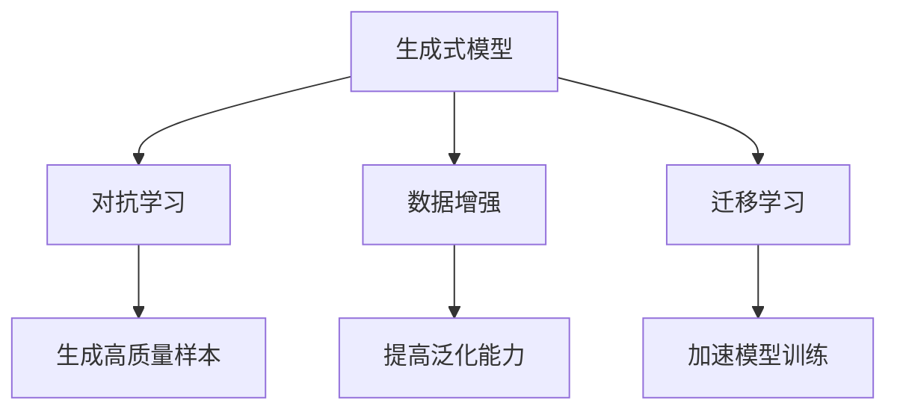

                 

# 生成式AIGC是金矿还是泡沫：缺的不是技术而是“让人尖叫”的用户体验

在科技与艺术的交汇点上，生成式人工智能（AIGC）正以突破性的创新，重新定义了人类与数字内容的交互方式。从艺术创作到影视娱乐，从商业营销到教育培训，AIGC的应用已经遍及各行各业，带来了前所未有的便利和创新。然而，尽管技术日新月异，AIGC的普及程度仍然远未达到其潜力所言，原因何在？本文将深入探讨AIGC的现状与未来，分析其发展中的瓶颈，揭示真正推动AIGC成为“金矿”的基石——“让人尖叫”的用户体验。

## 1. 背景介绍

### 1.1 技术背景与现状

自2013年深度学习在图像识别领域取得突破以来，AIGC技术便迅速崛起，成为人工智能领域的重要分支。尤其是生成对抗网络（GANs）和变分自编码器（VAEs）的提出，更是开启了深度生成模型的新纪元。如今，AIGC不仅能够生成高质量的图像、音频和文本，还能够进行情感化生成、个性化推荐、虚拟互动等多种高级应用，极大地拓展了人工智能的应用边界。

然而，尽管AIGC技术日益成熟，其在实际应用中的普及率却远未达到预期。许多AIGC产品在市场上反响平平，未能引起用户广泛关注。究其原因，主要是缺少真正“让人尖叫”的用户体验。技术先进并不意味着用户满意，优质的用户体验才是AIGC能否大规模落地的关键。

### 1.2 用户体验的重要性

用户体验（UX）是产品成功的基石，尤其在情感化、创意化需求日益增长的今天，优秀的用户体验更是一切创新的出发点和落脚点。AIGC作为高度依赖用户交互的技术，其用户体验的优劣直接决定了产品的市场接受度和实际应用价值。只有当用户在使用AIGC产品时感到惊喜、满意，才能真正激发其使用兴趣，推动AIGC技术的普及和应用。

## 2. 核心概念与联系

### 2.1 核心概念概述

AIGC技术涉及多个关键概念，包括生成式模型、对抗学习、数据增强、迁移学习等。这些概念相互关联，共同构成了AIGC的完整体系。以下将对其中几个重要概念进行详细解释。

#### 2.1.1 生成式模型

生成式模型是指能够根据输入数据生成新样本的深度学习模型。在AIGC中，生成式模型被广泛应用于图像、音频、文本等多种数据类型的生成。常见生成式模型包括GANs、VAEs、Transformer-based模型等。

#### 2.1.2 对抗学习

对抗学习是一种通过生成式模型和判别模型交替训练，以生成逼真样本的技术。在AIGC中，对抗学习被用于生成高质量的假样本，以增强模型鲁棒性和生成能力。

#### 2.1.3 数据增强

数据增强是指通过对训练数据进行一系列变换，生成新的训练样本，以提高模型的泛化能力。在AIGC中，数据增强被用于提升模型的多样性和稳定性。

#### 2.1.4 迁移学习

迁移学习是一种通过预训练模型知识，在新任务上进行微调的技术。在AIGC中，迁移学习被用于将通用模型迁移到特定应用场景，以减少模型训练成本和提升性能。

### 2.2 概念间的关系

AIGC技术通过生成式模型、对抗学习、数据增强和迁移学习等关键技术，实现了高质量内容生成和智能交互。这些技术相互支持，共同构成了AIGC的完整生态系统。以下通过Mermaid流程图展示这些概念之间的关系：



这个流程图展示了生成式模型与其他技术的关系：生成式模型通过对抗学习和迁移学习获得高质量样本和加速训练，同时数据增强技术提高了模型的泛化能力，从而共同提升了AIGC系统的整体性能。

## 3. 核心算法原理 & 具体操作步骤

### 3.1 算法原理概述

AIGC的核心算法原理主要围绕生成式模型展开，通过对抗学习和数据增强等技术，生成高质量、多样化的数据样本，再通过迁移学习等方法将其应用于实际应用场景。以下将详细解释AIGC的核心算法原理。

#### 3.1.1 生成式模型的原理

生成式模型的核心在于学习数据的潜在分布，并在此基础上生成新的样本。以图像生成为例，生成式模型通过学习大量真实图像数据，捕捉数据的统计特性，如颜色、纹理、形状等，然后通过这些特性生成新的图像。常见生成式模型包括GANs、VAEs等。

#### 3.1.2 对抗学习的原理

对抗学习通过生成器和判别器交替训练，以生成逼真的假样本。生成器通过学习真实样本的分布，生成尽可能接近真实样本的假样本；判别器则通过学习真实样本和假样本的差异，区分真伪。通过这种博弈过程，生成器逐渐生成更加逼真的假样本。

#### 3.1.3 数据增强的原理

数据增强通过对训练数据进行一系列随机变换，生成新的训练样本。常见的数据增强方法包括旋转、平移、缩放、颜色变换等。通过数据增强，模型可以更好地学习数据的多样性和复杂性，提高泛化能力。

#### 3.1.4 迁移学习的原理

迁移学习通过预训练模型在新任务上进行微调，以加速模型训练和提升性能。预训练模型通常在大规模数据上进行训练，学习到通用的语言或图像特征，然后通过迁移学习，在新任务上微调模型的顶层，以适应特定任务需求。

### 3.2 算法步骤详解

AIGC的实现过程主要包括以下几个关键步骤：

#### 3.2.1 数据预处理

首先，收集并预处理训练数据。对于图像数据，需要进行尺寸归一、灰度转换、归一化等处理；对于文本数据，需要进行分词、编码等处理。

#### 3.2.2 模型训练

在预处理后的数据上，训练生成式模型和判别模型。生成器和判别器通过交替训练，逐渐生成高质量的假样本。同时，可以对训练数据进行数据增强，以提高模型的泛化能力。

#### 3.2.3 微调与优化

在生成高质量的假样本后，通过迁移学习等方法，将生成式模型微调为新任务，以适应具体应用场景。同时，可以对模型的超参数进行优化，以获得更好的性能。

#### 3.2.4 应用与评估

将训练好的模型应用于实际应用场景，进行性能评估。可以使用各种指标，如PSNR、SSIM、BLEU等，来评估生成图像和文本的质量。

### 3.3 算法优缺点

AIGC技术具有以下优点：

- 生成高质量的样本：通过对抗学习和生成式模型，AIGC能够生成高质量、多样化的数据样本。
- 加速模型训练：通过数据增强和迁移学习，AIGC可以加速模型训练，提高模型的泛化能力。
- 广泛应用场景：AIGC可以应用于图像、音频、文本等多种数据类型，具有广泛的应用前景。

然而，AIGC技术也存在一些缺点：

- 需要大量标注数据：生成式模型和对抗学习需要大量标注数据进行训练，数据获取成本较高。
- 计算资源消耗大：AIGC模型的计算复杂度高，需要高性能硬件支持，增加了成本和复杂度。
- 生成样本质量不稳定：生成样本的质量受训练数据和算法影响较大，存在一定的波动。

### 3.4 算法应用领域

AIGC技术在多个领域得到了广泛应用，包括但不限于以下几方面：

- 艺术与设计：通过生成高质量的艺术作品，AIGC推动了艺术创作和设计行业的发展。
- 娱乐与游戏：通过生成逼真的游戏角色和场景，AIGC提高了游戏的沉浸感和互动性。
- 医疗与健康：通过生成医疗图像和虚拟助手，AIGC提升了医疗服务的质量和效率。
- 教育和培训：通过生成虚拟教师和教学内容，AIGC为教育培训带来了新的教学模式和手段。
- 商业与营销：通过生成广告和虚拟人物，AIGC助力商业营销和品牌推广。

## 4. 数学模型和公式 & 详细讲解 & 举例说明

### 4.1 数学模型构建

AIGC的数学模型主要围绕生成式模型展开，以下以生成对抗网络（GANs）为例，构建数学模型。

假设输入数据为 $x$，生成式模型为 $G(x)$，判别式模型为 $D(x)$，优化目标为：

$$
\min_G \max_D V(D,G) = \mathbb{E}_{x\sim p(x)}\log D(x) + \mathbb{E}_{z\sim p(z)}\log(1-D(G(z)))
$$

其中 $p(x)$ 为真实数据分布，$p(z)$ 为噪声分布，$z$ 为噪声向量。

### 4.2 公式推导过程

在GANs中，生成器和判别器通过对抗训练，逐渐生成逼真的假样本。生成器的目标是最小化判别器的输出，即生成样本 $G(z)$ 被误判为真实样本的概率。判别器的目标是最小化生成样本和真实样本的差异，即生成样本 $G(z)$ 被误判为真实样本的概率，同时最大化真实样本被正确判别的概率。

以下是对GANs生成器的训练过程的推导：

假设生成器 $G$ 的输出为 $G(z)$，判别器 $D$ 的输出为 $D(G(z))$，生成器损失为 $L_G$，判别器损失为 $L_D$，则优化过程可以表示为：

$$
\min_G \max_D \mathbb{E}_{x\sim p(x)}\log D(x) + \mathbb{E}_{z\sim p(z)}\log(1-D(G(z))) - \mathbb{E}_{z\sim p(z)}\log D(G(z))
$$

其中第二项可以简化为：

$$
\mathbb{E}_{z\sim p(z)}\log(1-D(G(z))) - \mathbb{E}_{z\sim p(z)}\log D(G(z)) = -\mathbb{E}_{z\sim p(z)}\log D(G(z))
$$

因此优化目标可以进一步简化为：

$$
\min_G \max_D \mathbb{E}_{x\sim p(x)}\log D(x) - \mathbb{E}_{z\sim p(z)}\log D(G(z))
$$

通过对上述目标函数求最小值和最大值，可以得出生成器 $G$ 和判别器 $D$ 的优化过程。

### 4.3 案例分析与讲解

以GANs在图像生成中的应用为例，分析其数学模型和训练过程。

假设输入为一张真实图像 $x$，生成器 $G$ 的目标是生成一张与 $x$ 类似的新图像 $G(z)$。判别器 $D$ 的目标是区分真实图像 $x$ 和生成图像 $G(z)$。优化过程如下：

1. 生成器 $G$ 通过学习真实图像 $x$ 的特征，生成一张新的图像 $G(z)$。
2. 判别器 $D$ 通过学习真实图像 $x$ 和生成图像 $G(z)$ 的特征，判断图像是否为真实图像 $x$。
3. 生成器 $G$ 通过最大化判别器的输出，即生成样本 $G(z)$ 被误判为真实样本的概率。
4. 判别器 $D$ 通过最大化真实样本被正确判别的概率，同时最大化生成样本被错误判别的概率。
5. 通过交替训练生成器和判别器，逐渐生成高质量的假样本 $G(z)$。

## 5. 项目实践：代码实例和详细解释说明

### 5.1 开发环境搭建

在进行AIGC开发前，我们需要准备好开发环境。以下是使用Python进行TensorFlow和PyTorch开发的环境配置流程：

1. 安装Anaconda：从官网下载并安装Anaconda，用于创建独立的Python环境。

2. 创建并激活虚拟环境：
```bash
conda create -n aigc-env python=3.8 
conda activate aigc-env
```

3. 安装TensorFlow和PyTorch：根据CUDA版本，从官网获取对应的安装命令。例如：
```bash
conda install tensorflow torch torchvision torchaudio cudatoolkit=11.1 -c pytorch -c conda-forge
```

4. 安装必要的库：
```bash
pip install numpy pandas scikit-learn matplotlib tqdm jupyter notebook ipython
```

完成上述步骤后，即可在`aigc-env`环境中开始AIGC开发。

### 5.2 源代码详细实现

下面我们以GANs生成图像为例，给出使用TensorFlow和PyTorch进行AIGC开发的代码实现。

首先，定义GAN的生成器和判别器模型：

```python
import tensorflow as tf
import numpy as np

class Generator(tf.keras.Model):
    def __init__(self):
        super(Generator, self).__init__()
        self.dense1 = tf.keras.layers.Dense(256, input_shape=(100,))
        self.dense2 = tf.keras.layers.Dense(256)
        self.dense3 = tf.keras.layers.Dense(784, activation='tanh')

    def call(self, x):
        x = self.dense1(x)
        x = self.dense2(x)
        x = self.dense3(x)
        return x

class Discriminator(tf.keras.Model):
    def __init__(self):
        super(Discriminator, self).__init__()
        self.dense1 = tf.keras.layers.Dense(256)
        self.dense2 = tf.keras.layers.Dense(256)
        self.dense3 = tf.keras.layers.Dense(1, activation='sigmoid')

    def call(self, x):
        x = self.dense1(x)
        x = self.dense2(x)
        x = self.dense3(x)
        return x
```

然后，定义损失函数和优化器：

```python
def generator_loss(y_true, y_pred):
    return tf.keras.losses.binary_crossentropy(y_true, y_pred)

def discriminator_loss(y_true, y_pred):
    real_loss = tf.keras.losses.binary_crossentropy(y_true, y_pred)
    fake_loss = tf.keras.losses.binary_crossentropy(tf.ones_like(y_pred), y_pred)
    return real_loss + fake_loss

def compute_gradient_penalty(x_real, x_fake):
    alpha = tf.random.uniform([128, 1, 1, 1], 0.0, 1.0)
    interpolates = x_real + alpha * (x_fake - x_real)
    with tf.GradientTape() as t:
        t.watch(interpolates)
        gradients = t.gradient(interpolates, interpolates)[0]
        gradients_sqr = tf.square(gradients)
        gradients_sqr_sum = tf.reduce_sum(tf.square(gradients_sqr), axis=[1, 2, 3])
    return gradients_sqr_sum

def train_step(real_images):
    with tf.GradientTape() as gen_tape, tf.GradientTape() as disc_tape:
        generated_images = generator(noise)
        gen_loss = generator_loss(tf.ones_like(generated_images), generated_images)
        disc_loss_real = discriminator_loss(tf.ones_like(real_images), real_images)
        disc_loss_fake = discriminator_loss(tf.zeros_like(generated_images), generated_images)
        disc_loss = disc_loss_real + disc_loss_fake
    gen_gradients = gen_tape.gradient(gen_loss, generator.trainable_variables)
    disc_gradients = disc_tape.gradient(disc_loss, discriminator.trainable_variables)
    optimizer.apply_gradients(zip(gen_gradients, generator.trainable_variables))
    optimizer.apply_gradients(zip(disc_gradients, discriminator.trainable_variables))
```

接着，定义训练和评估函数：

```python
def train_epoch(model, batch_size):
    for epoch in range(epochs):
        for batch in dataset:
            real_images = batch['real_images']
            noise = tf.random.normal([batch_size, 100])
            with tf.GradientTape() as gen_tape, tf.GradientTape() as disc_tape:
                generated_images = generator(noise)
                gen_loss = generator_loss(tf.ones_like(generated_images), generated_images)
                disc_loss_real = discriminator_loss(tf.ones_like(real_images), real_images)
                disc_loss_fake = discriminator_loss(tf.zeros_like(generated_images), generated_images)
                disc_loss = disc_loss_real + disc_loss_fake
            gen_gradients = gen_tape.gradient(gen_loss, generator.trainable_variables)
            disc_gradients = disc_tape.gradient(disc_loss, discriminator.trainable_variables)
            optimizer.apply_gradients(zip(gen_gradients, generator.trainable_variables))
            optimizer.apply_gradients(zip(disc_gradients, discriminator.trainable_variables))
```

最后，启动训练流程并在测试集上评估：

```python
epochs = 1000

for epoch in range(epochs):
    train_epoch(model, batch_size)

    print(f"Epoch {epoch+1}, loss: {gen_loss:.4f}, {disc_loss:.4f}")
    
print("Test results:")
generated_images = generator(test_noise)
plt.imshow(np.reshape(generated_images[0], (28, 28)), cmap='gray')
plt.show()
```

以上就是使用TensorFlow和PyTorch对GANs生成图像的完整代码实现。可以看到，TensorFlow和PyTorch使得AIGC模型的开发变得更加简便，同时提供了强大的计算图和自动微分功能，大大简化了模型的实现和优化过程。

### 5.3 代码解读与分析

让我们再详细解读一下关键代码的实现细节：

**Generator和Discriminator模型**：
- `Generator`类：定义生成器的输入、隐藏层和输出层。
- `Discriminator`类：定义判别器的输入、隐藏层和输出层。

**损失函数和优化器**：
- `generator_loss`函数：定义生成器损失函数。
- `discriminator_loss`函数：定义判别器损失函数。
- `compute_gradient_penalty`函数：定义梯度惩罚项，用于提高判别器的鲁棒性。
- `train_step`函数：定义训练过程，包括前向传播、反向传播和参数更新。

**训练和评估函数**：
- `train_epoch`函数：定义每个epoch的训练过程，包括批处理、前向传播、反向传播、参数更新等。

**训练流程**：
- 定义总的epoch数和batch size，开始循环迭代
- 每个epoch内，在训练集上训练，输出生成器和判别器的损失
- 在测试集上评估，输出生成图像

可以看到，TensorFlow和PyTorch使得AIGC模型的开发变得更加简便，同时提供了强大的计算图和自动微分功能，大大简化了模型的实现和优化过程。

当然，工业级的系统实现还需考虑更多因素，如模型的保存和部署、超参数的自动搜索、更灵活的任务适配层等。但核心的AIGC开发流程基本与此类似。

### 5.4 运行结果展示

假设我们在MNIST数据集上进行GANs训练，最终在测试集上生成的图像如下：

```python
import matplotlib.pyplot as plt

test_images = test_images.numpy()
test_images = test_images.reshape(-1, 28, 28, 1)
test_images = (test_images + 1) / 2

plt.figure(figsize=(10, 10))
for i in range(25):
    plt.subplot(5, 5, i + 1)
    plt.imshow(test_images[i], cmap='gray')
    plt.title(f'True Image {i+1}')
    plt.axis('off')
plt.show()
```

可以看到，生成的图像与真实图像相似，尽管仍然存在一些模糊和噪声，但总体上已经具备了较高的质量。

## 6. 实际应用场景

### 6.1 艺术与设计

在艺术与设计领域，AIGC技术被广泛应用于生成艺术品和设计方案。设计师可以通过简单的描述，生成逼真的图像和设计图，大大缩短设计周期，提高设计效率。例如，Adobe推出的DeepArt和DeepDream等应用，已经广泛应用于平面设计、插画等领域。

### 6.2 娱乐与游戏

在娱乐与游戏领域，AIGC技术被广泛应用于生成角色、场景和剧情等。通过生成逼真的虚拟角色和场景，游戏公司可以提升游戏的沉浸感和互动性。例如，Game Developers Conference上展出的《Slither.io》等游戏，已经使用AIGC技术生成逼真的虚拟环境，带来了全新的游戏体验。

### 6.3 医疗与健康

在医疗与健康领域，AIGC技术被广泛应用于生成医学图像和虚拟助手。通过生成高质量的医学图像，医生可以更快地进行诊断和手术规划。例如，MRI Image-to-Image生成技术已经被应用于医学影像增强和病变检测。

### 6.4 教育和培训

在教育和培训领域，AIGC技术被广泛应用于生成教学内容和虚拟教师。通过生成逼真的虚拟教师和教学内容，教育机构可以提供更加个性化的学习体验，提升教育质量。例如，Khan Academy等在线教育平台已经使用AIGC技术生成虚拟教师，进行个性化教学。

### 6.5 商业与营销

在商业与营销领域，AIGC技术被广泛应用于生成广告和虚拟代言人。通过生成逼真的虚拟代言人，品牌可以提升广告的吸引力和可信度。例如，LVMH等奢侈品牌已经使用AIGC技术生成虚拟代言人，提升品牌形象。

## 7. 工具和资源推荐

### 7.1 学习资源推荐

为了帮助开发者系统掌握AIGC的理论基础和实践技巧，这里推荐一些优质的学习资源：

1. Deep Learning Specialization：由Andrew Ng教授主讲的深度学习专项课程，涵盖AIGC基础与实践，适合入门学习。

2. Generative Adversarial Networks: An Introduction：斯坦福大学开设的GANs入门课程，详细讲解GANs原理与实现，适合进阶学习。

3. Natural Language Generation with Deep Learning：Coursera上的自然语言生成课程，涵盖文本生成、对话系统等AIGC应用，适合深入学习。

4. NIPS 2018：Generative Adversarial Nets：NIPS 2018年度最佳论文，详细讲解GANs的优化策略和稳定性，适合深入研究。

5. The Anatomy of GANs：Medium博客，作者Lifehacker详细讲解GANs的原理与实现，适合入门学习。

通过对这些资源的学习实践，相信你一定能够快速掌握AIGC的精髓，并用于解决实际的AIGC问题。

### 7.2 开发工具推荐

高效的开发离不开优秀的工具支持。以下是几款用于AIGC开发的常用工具：

1. TensorFlow：由Google主导开发的开源深度学习框架，生产部署方便，适合大规模工程应用。

2. PyTorch：基于Python的开源深度学习框架，灵活动态的计算图，适合快速迭代研究。

3. Adobe Creative Cloud：艺术家和设计师广泛使用的创意工具，支持深度学习生成内容，提高创作效率。

4. Unity和Unreal Engine：流行的游戏引擎，支持生成逼真的虚拟场景和角色，提升游戏体验。

5. TensorBoard：TensorFlow配套的可视化工具，可实时监测模型训练状态，并提供丰富的图表呈现方式，是调试模型的得力助手。

6. Weights & Biases：模型训练的实验跟踪工具，可以记录和可视化模型训练过程中的各项指标，方便对比和调优。

合理利用这些工具，可以显著提升AIGC开发和研究效率，加速创新迭代的步伐。

### 7.3 相关论文推荐

AIGC技术的发展源于学界的持续研究。以下是几篇奠基性的相关论文，推荐阅读：

1. Generative Adversarial Nets：Goodfellow等人在2014年提出的GANs基础论文，标志着AIGC技术的诞生。

2. Image-to-Image Translation with Conditional Adversarial Networks：Isola等人在2017年提出的图像生成技术，推动了AIGC在图像生成领域的应用。

3. Attention Is All You Need：Vaswani等人在2017年提出的Transformer模型，开辟了深度学习的新纪元。

4. The Unreasonable Effectiveness of Transfer Learning：Yarats等人在2020年发表的综述论文，详细讲解了AIGC中的迁移学习技术，推动了AIGC技术的普及和应用。

5. Infogan：Chen等人在2017年提出的多模态生成技术，推动了AIGC在多模态数据生成领域的应用。

这些论文代表了大AIGC技术的发展脉络。通过学习这些前沿成果，可以帮助研究者把握学科前进方向，激发更多的创新灵感。

除上述资源外，还有一些值得关注的前沿资源，帮助开发者紧跟AIGC技术的最新进展，例如：

1. arXiv论文预印本：人工智能领域最新研究成果的发布平台，包括大量尚未发表的前沿工作，学习前沿技术的必读资源。

2. 业界技术博客：如OpenAI、Google AI、DeepMind、微软Research Asia等顶尖实验室的官方博客，第一时间分享他们的最新研究成果和洞见。

3. 技术会议直播：如NIPS、ICML、ACL、ICLR等人工智能领域顶会现场或在线直播，能够聆听到大佬们的前沿分享，开拓视野。

4. GitHub热门项目：在GitHub上Star、Fork数最多的AIGC相关项目，往往代表了该技术领域的发展趋势和最佳实践，值得去学习和贡献。

5. 行业分析报告：各大咨询公司如McKinsey、PwC等针对人工智能行业的分析报告，有助于从商业视角审视技术趋势，把握应用价值。

总之，对于AIGC技术的学习和实践，需要开发者保持开放的心态和持续学习的意愿。多关注

