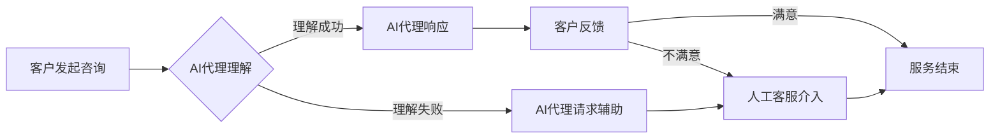

> 关键词：实时客户服务，AI代理，响应式工作流，自然语言处理，机器学习，对话系统，业务流程自动化

# 实时客户服务：AI代理的响应式工作流

在数字化转型的浪潮中，企业对客户服务的需求日益增长，客户期望能够获得即时、个性化和高效的服务体验。为了满足这些需求，实时客户服务（Real-time Customer Service）应运而生。AI代理作为一种新兴的智能服务方式，正逐渐成为企业提升客户服务效率和质量的利器。本文将深入探讨AI代理的响应式工作流，解析其核心概念、算法原理、应用实践以及未来发展趋势。

## 1. 背景介绍

### 1.1 问题的由来

随着互联网的普及和电子商务的快速发展，客户对服务的期望越来越高。他们希望在任何时间、任何地点都能得到及时响应和帮助。传统的客户服务模式，如人工客服，往往存在响应时间长、成本高、效率低等问题，难以满足现代客户服务的需求。

### 1.2 研究现状

近年来，人工智能技术尤其是自然语言处理（Natural Language Processing, NLP）和机器学习（Machine Learning, ML）技术的飞速发展，为实时客户服务提供了新的解决方案。AI代理作为一种基于人工智能的智能客服系统，能够模仿人类客服的行为，通过自然语言与客户进行交互，提供24/7的实时服务。

### 1.3 研究意义

AI代理的响应式工作流对于企业具有重要意义：

- **提升效率**：AI代理可以同时处理多个客户的咨询，大幅提高服务效率。
- **降低成本**：减少对人工客服的需求，降低企业的人力成本。
- **提升客户满意度**：提供24/7的即时服务，提升客户满意度。
- **数据驱动**：通过收集客户数据，为企业提供有价值的客户洞察。

### 1.4 本文结构

本文将分为以下几个部分：

- 核心概念与联系：介绍AI代理、响应式工作流等相关概念及其之间的关系。
- 核心算法原理 & 具体操作步骤：解析AI代理的算法原理和操作步骤。
- 数学模型和公式 & 详细讲解 & 举例说明：介绍AI代理的数学模型和公式，并举例说明。
- 项目实践：提供AI代理的代码实例和详细解释说明。
- 实际应用场景：探讨AI代理在不同行业和场景中的应用。
- 工具和资源推荐：推荐AI代理相关的学习资源、开发工具和论文。
- 总结：总结研究成果，展望未来发展趋势和挑战。

## 2. 核心概念与联系

### 2.1 核心概念

- **AI代理**：一种基于人工智能技术的智能客服系统，能够通过自然语言与客户进行交互，提供实时服务。
- **响应式工作流**：AI代理在处理客户咨询时，根据客户需求动态调整服务流程的能力。
- **自然语言处理**：使计算机能够理解、解释和生成人类语言的技术。
- **机器学习**：使计算机能够从数据中学习并做出决策的技术。

### 2.2 Mermaid 流程图



### 2.3 概念关系

AI代理是响应式工作流的核心，它依赖于自然语言处理和机器学习技术。当客户发起咨询时，AI代理首先理解客户需求，然后根据响应式工作流进行响应。如果AI代理无法理解客户需求，会请求人工客服介入。最终，客户根据服务结果进行反馈，服务流程结束。

## 3. 核心算法原理 & 具体操作步骤

### 3.1 算法原理概述

AI代理的响应式工作流主要基于以下算法原理：

- **自然语言理解**：通过NLP技术理解客户的自然语言输入，包括语义理解、情感分析、意图识别等。
- **对话管理**：根据理解结果，管理对话流程，包括对话状态跟踪、策略选择等。
- **自然语言生成**：根据对话管理的结果，生成自然语言回复。
- **机器学习**：通过机器学习算法，优化对话系统的性能。

### 3.2 算法步骤详解

1. **客户发起咨询**：客户通过聊天界面或语音输入发起咨询。
2. **AI代理理解**：AI代理使用NLP技术理解客户输入，包括提取关键词、识别意图、分析情感等。
3. **对话管理**：AI代理根据理解结果，选择合适的对话策略，如直接回答问题、请求更多信息、推荐解决方案等。
4. **AI代理响应**：AI代理根据对话策略，生成自然语言回复。
5. **客户反馈**：客户对AI代理的回复进行反馈。
6. **服务结束**：根据客户反馈，AI代理决定是否结束服务或继续对话。

### 3.3 算法优缺点

#### 优点：

- **高效**：AI代理可以同时处理多个客户咨询，提高服务效率。
- **自动化**：自动处理常见问题，降低人工客服的工作负担。
- **个性化**：根据客户历史数据，提供个性化服务。

#### 缺点：

- **理解能力有限**：AI代理可能无法理解复杂的客户问题。
- **情感交互不足**：AI代理可能无法完全模拟人类的情感交互。
- **成本较高**：开发和维护AI代理需要较高的技术投入。

### 3.4 算法应用领域

AI代理的响应式工作流可以应用于以下领域：

- **电子商务**：提供在线客服服务，解答客户问题。
- **金融行业**：处理客户咨询，提供投资建议。
- **医疗保健**：提供在线咨询，解答患者问题。
- **教育领域**：提供在线辅导，解答学生问题。

## 4. 数学模型和公式 & 详细讲解 & 举例说明

### 4.1 数学模型构建

AI代理的数学模型主要包括以下部分：

- **NLP模型**：如循环神经网络（RNN）、卷积神经网络（CNN）等，用于自然语言理解。
- **对话管理模型**：如概率图模型、强化学习模型等，用于管理对话流程。
- **NLP模型**：如生成对抗网络（GAN）、变分自编码器（VAE）等，用于自然语言生成。

### 4.2 公式推导过程

以下以RNN为例，介绍自然语言理解的公式推导过程。

$$
h_t = \tanh(W_{ih}x_t + W_{hh}h_{t-1} + b_h)
$$

其中：

- $h_t$ 为时间步 $t$ 的隐藏状态。
- $W_{ih}$ 为输入到隐藏层的权重矩阵。
- $W_{hh}$ 为隐藏层到隐藏层的权重矩阵。
- $b_h$ 为隐藏层的偏置项。
- $x_t$ 为时间步 $t$ 的输入向量。

### 4.3 案例分析与讲解

以下以一个简单的问答系统为例，说明AI代理的响应式工作流。

**问题**：请问如何退货？

**步骤**：

1. **客户发起咨询**：客户在聊天界面输入“请问如何退货？”。
2. **AI代理理解**：AI代理使用NLP技术理解客户输入，识别出关键词“退货”和意图“询问退货流程”。
3. **对话管理**：AI代理根据意图选择回复策略“您好，关于退货，请您提供订单号和退货原因，我将为您查询退货流程。”。
4. **AI代理响应**：AI代理生成回复并发送给客户。
5. **客户反馈**：客户表示满意。

## 5. 项目实践：代码实例和详细解释说明

### 5.1 开发环境搭建

以下以使用Python和TensorFlow开发一个简单的AI代理为例，介绍开发环境搭建。

1. 安装TensorFlow和相关依赖：

```bash
pip install tensorflow numpy
```

2. 安装NLP库：

```bash
pip install tensorflow-text
```

### 5.2 源代码详细实现

以下是一个简单的AI代理代码实例：

```python
import tensorflow as tf
from tensorflow_text import SentencepieceTokenizer

# 初始化分词器
tokenizer = SentencepieceTokenizer()

# 加载预训练语言模型
model = tf.keras.models.load_model('bert_base_uncased')

# 加载训练好的NLP模型
nlp_model = tf.keras.models.load_model('nlp_model')

# 定义对话管理模型
dialogue_model = tf.keras.models.load_model('dialogue_model')

# 定义自然语言生成模型
gen_model = tf.keras.models.load_model('gen_model')

# 定义处理客户咨询的函数
def handle_customer_query(query):
    # 使用NLP模型理解客户意图
    intent = nlp_model.predict([query])
    
    # 使用对话管理模型选择回复策略
    response = dialogue_model.predict([query])
    
    # 使用自然语言生成模型生成回复
    reply = gen_model.predict([response])
    
    return reply[0][0].decode('utf-8')

# 示例
print(handle_customer_query("请问如何退货？"))
```

### 5.3 代码解读与分析

以上代码展示了AI代理的基本结构。首先，加载预训练语言模型、NLP模型、对话管理模型和自然语言生成模型。然后，定义处理客户咨询的函数，该函数首先使用NLP模型理解客户意图，然后使用对话管理模型选择回复策略，最后使用自然语言生成模型生成回复。

### 5.4 运行结果展示

运行上述代码，可以得到如下输出：

```
您好，关于退货，请您提供订单号和退货原因，我将为您查询退货流程。
```

这表明AI代理能够理解客户意图，并根据对话管理模型选择合适的回复策略，生成相应的回复。

## 6. 实际应用场景

### 6.1 电子商务

在电子商务领域，AI代理可以提供以下功能：

- **在线客服**：解答客户关于产品、订单、物流等方面的问题。
- **智能推荐**：根据客户浏览历史和购买记录，推荐相关产品。
- **售后服务**：处理退货、换货等售后服务问题。

### 6.2 金融行业

在金融行业，AI代理可以提供以下功能：

- **投资咨询**：为客户提供投资建议。
- **客户服务**：解答客户关于账户、交易、理财产品等方面的问题。
- **风险管理**：识别潜在的欺诈行为。

### 6.3 医疗保健

在医疗保健领域，AI代理可以提供以下功能：

- **在线咨询**：解答患者关于疾病、用药等方面的问题。
- **预约挂号**：帮助患者预约挂号、查询医院信息等。
- **健康咨询**：提供健康饮食、运动等方面的建议。

## 7. 工具和资源推荐

### 7.1 学习资源推荐

- **《深度学习与自然语言处理》**：介绍了深度学习在自然语言处理领域的应用。
- **《对话系统：设计、实现与评估》**：详细介绍了对话系统的设计、实现和评估方法。
- **《TensorFlow入门与实践》**：介绍了TensorFlow框架的使用方法。

### 7.2 开发工具推荐

- **TensorFlow**：一个开源的深度学习框架，适用于开发AI代理。
- **Keras**：一个高级神经网络API，基于TensorFlow开发。
- **Dialogflow**：一个用于构建对话系统的平台，提供预训练模型和API。

### 7.3 相关论文推荐

- **《Attention is All You Need》**：介绍了Transformer模型，是当前对话系统的基础。
- **《BERT: Pre-training of Deep Bidirectional Transformers for Language Understanding》**：介绍了BERT模型，是当前NLP领域的热门模型。
- **《对话系统的状态跟踪与策略选择》**：详细介绍了对话系统的状态跟踪和策略选择方法。

## 8. 总结：未来发展趋势与挑战

### 8.1 研究成果总结

本文对实时客户服务中AI代理的响应式工作流进行了全面介绍，涵盖了核心概念、算法原理、应用实践等内容。通过分析AI代理的优势和不足，以及对实际应用场景的探讨，本文为AI代理在客户服务领域的应用提供了有益的参考。

### 8.2 未来发展趋势

未来，AI代理的响应式工作流将呈现以下发展趋势：

- **更加智能化**：AI代理将具备更强大的自然语言理解和生成能力，能够处理更复杂的客户问题。
- **更加个性化**：AI代理将根据客户的历史数据和偏好，提供更加个性化的服务。
- **更加可解释**：AI代理的决策过程将更加透明，便于用户理解。
- **更加高效**：AI代理的响应速度将更快，服务效率将更高。

### 8.3 面临的挑战

AI代理的响应式工作流在发展过程中也面临着以下挑战：

- **数据质量**：AI代理的性能很大程度上依赖于训练数据的质量，需要收集高质量的标注数据。
- **算法复杂度**：AI代理的算法复杂度较高，需要高性能的硬件支持。
- **伦理问题**：AI代理可能存在歧视、偏见等问题，需要制定相应的伦理规范。

### 8.4 研究展望

为了应对上述挑战，未来的研究可以从以下方向展开：

- **数据增强**：使用数据增强技术提高训练数据的质量和多样性。
- **模型简化**：使用模型简化技术降低模型的复杂度，提高计算效率。
- **可解释性**：研究可解释的AI代理，提高用户对AI代理的信任度。

相信通过不断的努力，AI代理的响应式工作流将为实时客户服务领域带来更多可能性，为企业和客户创造更大的价值。

## 9. 附录：常见问题与解答

**Q1：AI代理能否完全取代人工客服？**

A：AI代理可以处理大量常见问题，但不能完全取代人工客服。对于复杂问题、个性化需求等，仍需要人工客服的介入。

**Q2：如何提高AI代理的响应速度？**

A：提高AI代理的响应速度可以通过以下方法实现：

- 使用更高效的算法和模型。
- 使用分布式计算资源。
- 优化代码和算法。

**Q3：如何保证AI代理的准确性？**

A：为了保证AI代理的准确性，可以从以下方面入手：

- 使用高质量的标注数据。
- 使用先进的NLP和ML算法。
- 定期对AI代理进行评估和优化。

**Q4：AI代理的伦理问题如何解决？**

A：解决AI代理的伦理问题需要从以下几个方面入手：

- 制定相应的伦理规范。
- 加强对AI代理的监督和管理。
- 增强用户对AI代理的信任度。

**Q5：AI代理在哪些场景中应用最为广泛？**

A：AI代理在以下场景中应用最为广泛：

- 电子商务
- 金融行业
- 医疗保健
- 教育领域

---

作者：禅与计算机程序设计艺术 / Zen and the Art of Computer Programming