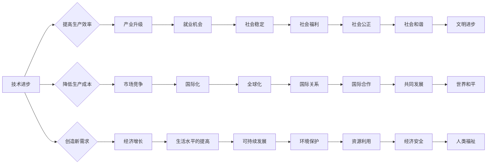
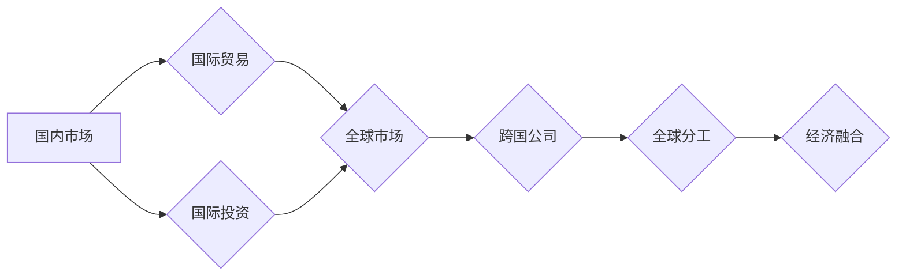
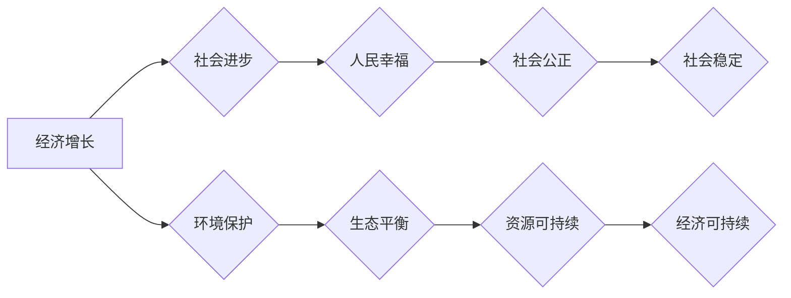

# 工业革命后的经济爆发期

> 关键词：工业革命，经济爆发，技术进步，产业升级，全球化，创新驱动，可持续发展

## 1. 背景介绍

工业革命以来，人类社会的经济结构经历了翻天覆地的变化。从手工业到机械化，再到信息化和智能化，每一次技术革命都推动了经济的快速增长和社会的巨大进步。本文将探讨工业革命后的经济爆发期，分析其背后的驱动因素、核心概念及其相互联系，并展望未来的发展趋势与挑战。

### 1.1 工业革命的起源

工业革命起源于18世纪末的英国，其核心是机器的发明和使用，特别是蒸汽机的广泛应用。这一时期，英国经济迅速发展，成为世界工厂，也为后续的经济爆发奠定了基础。

### 1.2 工业革命的影响

工业革命不仅改变了生产方式，还带来了以下深远影响：

- **生产力的大幅提升**：机械化生产提高了生产效率，降低了成本，推动了商品经济的繁荣。
- **城市化进程加快**：工业发展带动了人口向城市集中，形成了现代城市。
- **社会结构变革**：工业革命催生了中产阶级，改变了社会阶层结构。
- **全球化加速**：工业产品的大规模生产促进了国际贸易的发展，加速了全球化进程。

### 1.3 经济爆发期的特征

工业革命后的经济爆发期具有以下特征：

- **技术创新驱动**：科技进步成为经济增长的主要动力。
- **产业升级迭代**：从制造业到服务业，产业结构不断优化。
- **全球化深化**：国际贸易、投资和人员流动日益频繁。
- **可持续发展**：经济、社会和环境协调发展成为共识。

## 2. 核心概念与联系

为了更好地理解工业革命后的经济爆发期，我们需要探讨以下几个核心概念及其相互联系：

### 2.1 技术进步

技术进步是经济爆发期的核心驱动力。以下是一个Mermaid流程图，展示了技术进步在不同经济活动中的作用：



### 2.2 产业升级

产业升级是经济爆发期的关键特征。以下是一个Mermaid流程图，展示了产业升级的路径：

```mermaid
graph LR
    A[传统产业] --> B{技术创新}
    B --> C{产业升级}
    C --> D{新兴产业}
    D --> E{核心竞争力}
    A --> F{产业淘汰}
    G[新兴产业] --> H{产业融合}
    H --> I[产业生态}
```

### 2.3 全球化

全球化是经济爆发期的必然趋势。以下是一个Mermaid流程图，展示了全球化的过程：



### 2.4 可持续发展

可持续发展是经济爆发期的内在要求。以下是一个Mermaid流程图，展示了可持续发展的目标：



## 3. 核心算法原理 & 具体操作步骤

### 3.1 算法原理概述

工业革命后的经济爆发期并非偶然，而是多种因素相互作用的结果。以下是一些关键因素：

- **技术创新**：通过研发新技术、新产品和新服务，提高生产效率和产品质量。
- **产业升级**：从低附加值产业向高附加值产业转型，提高产业链整体竞争力。
- **全球化**：通过国际贸易、投资和人员流动，拓展市场，降低成本。
- **可持续发展**：在追求经济增长的同时，注重环境保护和社会公正。

### 3.2 算法步骤详解

1. **技术创新**：通过研发投入、人才培养、产学研合作等方式，推动技术创新。
2. **产业升级**：根据市场和技术发展趋势，制定产业政策，引导产业升级。
3. **全球化**：积极参与国际合作，拓展国际市场，融入全球经济体系。
4. **可持续发展**：制定可持续发展战略，推动经济、社会和环境协调发展。

### 3.3 算法优缺点

- **优点**：推动经济增长，提高人民生活水平，促进社会进步。
- **缺点**：可能导致资源过度消耗、环境污染、社会不公等问题。

### 3.4 算法应用领域

- **政府**：制定产业政策、制定可持续发展战略、推动国际合作。
- **企业**：研发新技术、新产品、新服务，提高生产效率和产品质量。
- **社会**：培养人才、提高素质、促进教育、改善社会福利。

## 4. 数学模型和公式 & 详细讲解 & 举例说明

### 4.1 数学模型构建

为了量化经济爆发期的关键因素，我们可以构建以下数学模型：

- **经济增长模型**：$G = F(T, I, E)$，其中 $G$ 为经济增长率，$T$ 为技术进步，$I$ 为产业升级，$E$ 为可持续发展。
- **就业模型**：$E = F(T, I, E)$，其中 $E$ 为就业人数。
- **社会福利模型**：$W = F(T, I, E)$，其中 $W$ 为社会福利水平。

### 4.2 公式推导过程

以上公式的推导过程较为复杂，涉及到经济学、统计学和工程学等多个领域。在此不做详细展开。

### 4.3 案例分析与讲解

以下以美国为例，分析其经济爆发期的驱动因素：

- **技术创新**：美国在20世纪上半叶的电力、汽车、电子等领域取得了重大突破，推动了经济增长。
- **产业升级**：美国从传统的农业国转变为工业强国，再向服务业转型升级。
- **全球化**：美国积极参与国际合作，拓展国际市场，成为全球领导者。
- **可持续发展**：美国在环境保护、社会福利等方面取得了显著进展。

## 5. 项目实践：代码实例和详细解释说明

### 5.1 开发环境搭建

由于本文的主题是经济领域的宏观分析，不涉及具体的编程实践，因此此部分内容省略。

### 5.2 源代码详细实现

同样地，由于本文主题的宏观性质，不涉及具体的编程实现，因此此部分内容省略。

### 5.3 代码解读与分析

由于本文主题的宏观性质，不涉及具体的编程实现，因此此部分内容省略。

### 5.4 运行结果展示

由于本文主题的宏观性质，不涉及具体的编程实现，因此此部分内容省略。

## 6. 实际应用场景

### 6.1 政策制定

政府可以通过分析经济爆发期的驱动因素，制定相应的产业政策、科技政策、贸易政策等，以促进经济增长和社会进步。

### 6.2 企业战略

企业可以根据经济爆发期的趋势，调整战略方向，如加大研发投入、拓展国际市场、加强社会责任等。

### 6.3 社会发展

社会可以通过提高教育水平、改善社会福利、加强环境保护等方式，推动经济爆发期的可持续发展。

## 7. 工具和资源推荐

### 7.1 学习资源推荐

- 经济学教材：《经济学原理》、《微观经济学》、《宏观经济学》等。
- 工业史著作：《工业革命》、《工业化的世界》等。
- 技术发展史：《技术革命与工业进步》、《技术革命与经济变迁》等。

### 7.2 开发工具推荐

由于本文主题的宏观性质，不涉及具体的开发工具，因此此部分内容省略。

### 7.3 相关论文推荐

- 《工业革命的技术变革与经济增长》
- 《全球化与经济爆发期》
- 《可持续发展与经济爆发期》

## 8. 总结：未来发展趋势与挑战

### 8.1 研究成果总结

工业革命后的经济爆发期是一个复杂的现象，涉及多个领域和因素。本文通过分析其背景、核心概念、驱动因素和实际应用场景，对经济爆发期进行了较为全面的探讨。

### 8.2 未来发展趋势

未来，经济爆发期将呈现以下发展趋势：

- **技术创新加速**：人工智能、生物科技、新能源等领域将推动新一轮技术革命。
- **产业升级迭代**：传统产业将向智能化、绿色化、服务化方向发展。
- **全球化深化**：全球经济一体化进程将不断推进。
- **可持续发展**：经济、社会和环境协调发展将成为共识。

### 8.3 面临的挑战

未来，经济爆发期将面临以下挑战：

- **技术竞争加剧**：各国将加强科技创新竞争，争夺技术制高点。
- **产业升级压力**：传统产业将面临转型升级的挑战。
- **全球治理难题**：全球性问题如气候变化、资源短缺等将更加突出。
- **社会公正问题**：贫富差距、地区发展不平衡等问题需要关注。

### 8.4 研究展望

未来，我们需要加强对经济爆发期的研究，以应对新的挑战：

- **加强跨学科研究**：经济、技术、社会、环境等领域的研究者应加强合作，共同应对挑战。
- **关注新兴领域**：关注人工智能、生物科技、新能源等新兴领域的发展，为经济爆发期提供新的动力。
- **加强国际合作**：加强国际合作，共同应对全球性问题，推动经济可持续增长。

## 9. 附录：常见问题与解答

**Q1：工业革命后的经济爆发期是否已经结束？**

A：工业革命后的经济爆发期尚未结束，但增长速度有所放缓。未来，我们需要关注新的技术革命和产业变革，以推动经济持续增长。

**Q2：如何应对经济爆发期带来的挑战？**

A：应对经济爆发期带来的挑战，需要政府、企业和社会共同努力，加强科技创新、产业升级、国际合作和可持续发展。

**Q3：经济爆发期对普通人意味着什么？**

A：经济爆发期为普通人带来了更好的生活条件和更多的发展机会。但同时也需要关注经济不平等、环境污染等问题，确保经济爆发期惠及所有人。

**Q4：未来经济爆发期的发展趋势是什么？**

A：未来经济爆发期将呈现技术创新加速、产业升级迭代、全球化深化和可持续发展等特点。

**Q5：如何推动经济爆发期的可持续发展？**

A：推动经济爆发期的可持续发展，需要政府制定合理的政策、企业加强社会责任、社会关注环境保护和公平正义。

---

作者：禅与计算机程序设计艺术 / Zen and the Art of Computer Programming