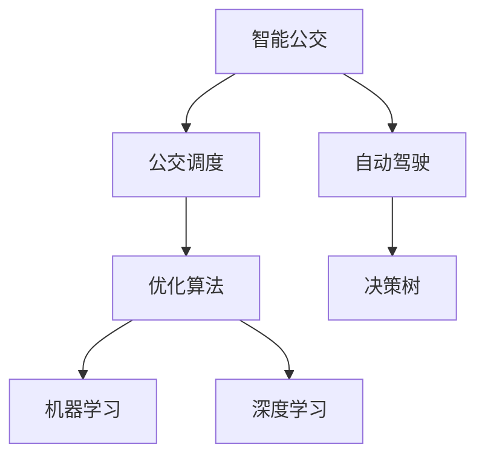
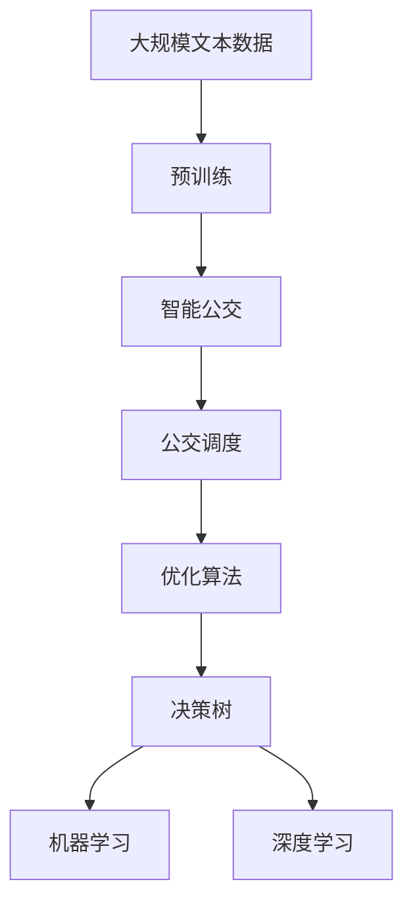

                 

# 自动驾驶中的智能公交调度与优化

> 关键词：智能公交,公交调度,自动驾驶,优化算法,决策树,机器学习,深度学习

## 1. 背景介绍

### 1.1 问题由来

随着城市化进程的不断加快，公共交通系统在缓解交通拥堵、降低环境污染、提升出行效率等方面发挥着越来越重要的作用。然而，传统的公交调度方式仍然存在诸多问题，如调度不合理导致车辆空载率高、运行效率低，以及乘客等待时间长、乘坐体验差等。因此，基于智能技术改进公交调度，提高公交系统的运行效率和服务质量，成为智能交通领域的重要研究方向。

### 1.2 问题核心关键点

公交调度优化是智能公交系统的重要组成部分，其主要目标是通过合理规划车辆行驶路径、发车频率、站点停靠等，以最小的成本获得最大的效益。公交调度问题是一个典型的多目标优化问题，需要同时考虑时间和成本的平衡。因此，如何在保证公交服务质量的前提下，优化资源配置和运营效率，是一个复杂且具有挑战性的问题。

### 1.3 问题研究意义

公交调度优化对城市公共交通系统具有重要意义，主要体现在以下几个方面：

1. **提升运行效率**：通过科学合理的调度，可以减少车辆的闲置时间和油耗，提高运营效率。
2. **改善乘坐体验**：优化发车频率和站点停靠，减少乘客等待时间，提升乘坐舒适度。
3. **节约社会成本**：减少车辆空载率，降低单位乘客的碳排放和运营成本。
4. **促进城市发展**：提升公交系统的服务水平，促进城市经济社会发展和居民生活质量的提升。

## 2. 核心概念与联系

### 2.1 核心概念概述

为更好地理解自动驾驶中的智能公交调度问题，本节将介绍几个密切相关的核心概念：

- **智能公交**：基于人工智能技术，实现公交车辆运行和调度自动化，提升公交系统的智能化水平和服务质量。
- **公交调度**：对公交车辆的运行线路、发车频率、停靠站点等进行规划和优化，以达到高效、低成本的运营目标。
- **自动驾驶**：利用计算机视觉、路径规划、感知技术等实现车辆自主驾驶，减少人为干预，提升驾驶安全性。
- **优化算法**：用于求解复杂优化问题的数学方法，如线性规划、整数规划、动态规划等，用于公交调度的数学模型构建和求解。
- **决策树**：一种基于树形结构的分类和预测模型，用于公交调度的规则制定和智能决策。
- **机器学习**：通过数据驱动的算法，从历史数据中学习规律和模式，用于公交调度模型的训练和优化。
- **深度学习**：一种通过神经网络实现复杂模式识别的高级机器学习方法，用于公交调度中的高级数据处理和预测。

这些核心概念之间的逻辑关系可以通过以下Mermaid流程图来展示：



这个流程图展示了智能公交系统的主要组件及其之间的关系：

1. 智能公交系统包括公交调度和自动驾驶两个关键模块。
2. 公交调度通过优化算法进行规划和优化，以实现高效运营。
3. 自动驾驶通过感知和路径规划等技术，实现车辆自主运行。
4. 决策树和机器学习、深度学习等方法，用于支持公交调度的规则制定和模型训练。

### 2.2 概念间的关系

这些核心概念之间存在着紧密的联系，形成了智能公交调度问题的完整生态系统。下面我们通过几个Mermaid流程图来展示这些概念之间的关系。

#### 2.2.1 智能公交系统的基本架构


这个流程图展示了智能公交系统的主要数据流和决策流程：

1. 通过数据采集获取实时运行数据。
2. 对数据进行预处理和清洗，构建预测模型。
3. 利用预测模型和调度规则，制定智能调度决策。
4. 执行调度决策，优化公交车辆的运行。

#### 2.2.2 决策树在公交调度中的应用


这个流程图展示了决策树在公交调度中的作用：

1. 决策树用于制定公交调度的规则。
2. 利用规则训练模型，进行智能调度决策。
3. 将决策结果转化为具体的执行策略，优化公交车辆的运行。

#### 2.2.3 机器学习和深度学习在公交调度中的应用


这个流程图展示了机器学习和深度学习在公交调度中的应用：

1. 机器学习利用历史数据进行模型训练。
2. 深度学习处理复杂数据特征，提高预测精度。
3. 利用预测结果和优化算法，制定调度和优化策略。
4. 执行优化策略，实现公交车辆的智能化运行。

### 2.3 核心概念的整体架构

最后，我们用一个综合的流程图来展示这些核心概念在大语言模型微调过程中的整体架构：



这个综合流程图展示了从预训练到智能公交调度的完整过程。智能公交系统首先在大规模文本数据上进行预训练，然后通过公交调度的优化算法和决策树等方法，实现车辆的智能调度。决策树和机器学习、深度学习等方法，进一步提升调度的智能化水平。通过这些组件的协同工作，智能公交系统能够高效、精准地进行公交车辆的运行和调度。

## 3. 核心算法原理 & 具体操作步骤
### 3.1 算法原理概述

自动驾驶中的智能公交调度，本质上是一个多目标优化问题，涉及时间、成本和用户满意度等多个维度。优化目标是找到一组最优的调度策略，使得公交车辆运行效率最大化，同时满足乘客的合理等待时间和乘车体验。

形式化地，假设公交车辆的调度任务为 $T$，包括路线规划、发车间隔、停靠站点等，记为 $T=(R, I, S)$，其中 $R$ 为路线集合，$I$ 为发车间隔，$S$ 为停靠站点。设 $C$ 为成本函数，$U$ 为乘客满意度函数。则公交调度的优化目标为：

$$
\mathop{\arg\min}_{T} \big[ C(T) + \lambda U(T) \big]
$$

其中 $\lambda$ 为时间成本权重系数，通常情况下取 $1$，即时间成本和用户满意度并重。

### 3.2 算法步骤详解

基于上述优化目标，公交调度的算法步骤通常包括以下几个关键步骤：

**Step 1: 数据采集与预处理**

- 通过车载传感器、监控摄像头、GPS等设备，实时采集公交车辆位置、速度、乘客数量等数据。
- 对采集数据进行预处理和清洗，去除噪声和异常数据，构建数据集。

**Step 2: 构建数学模型**

- 利用历史数据，构建时间成本和乘客满意度的数学模型。
- 根据实际需求，选择合适的优化算法，如线性规划、整数规划、动态规划等。

**Step 3: 模型求解**

- 利用优化算法求解公交调度的优化问题，得到最优的路线规划和发车间隔。
- 利用决策树或机器学习、深度学习等方法，优化模型中的参数和规则。

**Step 4: 智能调度执行**

- 根据优化结果，生成调度策略，更新车辆运行计划。
- 实时监控公交车辆运行状态，调整调度策略，确保最优调度效果。

**Step 5: 评估与反馈**

- 定期评估公交调度效果，分析运行数据。
- 根据评估结果，反馈优化策略，进一步提升公交调度效率和服务质量。

### 3.3 算法优缺点

基于优化算法的公交调度方法具有以下优点：

1. **科学合理性**：通过数学模型进行优化，确保调度策略的科学性和合理性。
2. **效率高**：通过优化算法快速求解大规模调度问题，提高调度效率。
3. **鲁棒性强**：利用历史数据和模型训练，增强调度策略的鲁棒性。

同时，也存在一些缺点：

1. **数据依赖性强**：调度效果依赖于数据的准确性和完整性。
2. **模型复杂度高**：复杂模型需要较强的计算资源，可能存在求解困难的问题。
3. **缺乏灵活性**：调度策略可能过于刚性，难以应对突发情况和实时需求变化。

### 3.4 算法应用领域

基于优化算法的公交调度方法，广泛应用于智能公交系统、自动驾驶等智能交通领域。例如：

- **智能公交系统**：利用优化算法对公交车运行路线、发车间隔、停靠站点等进行优化，提高公交系统的运行效率和用户满意度。
- **自动驾驶**：通过路径规划算法，实现车辆在复杂交通环境下的智能导航和调度。
- **城市交通管理**：利用优化算法对公交车运行路线、发车间隔等进行优化，减少交通拥堵，提高城市交通效率。
- **公共交通规划**：对公交网络的线路、站点、班次等进行优化，提升公交系统的覆盖率和运营效率。

除了上述这些领域，公交调度算法还被广泛应用于物流配送、仓储管理、电力调度等诸多领域，为各类系统的高效运行提供保障。

## 4. 数学模型和公式 & 详细讲解  
### 4.1 数学模型构建

假设公交车辆在某一时刻 $t$ 处于站点 $i$，此时站点 $i$ 等待的乘客数量为 $W_i(t)$，车辆的运行成本为 $C_i(t)$，乘客满意度为 $U_i(t)$。设车辆从站点 $i$ 出发到达站点 $j$ 所需时间为 $T_{ij}$，发车间隔为 $I$。则公交调度的目标函数为：

$$
\min \sum_{i,j} \big[ C_i(t) + \lambda U_i(t) \big]
$$

其中，目标函数包含了成本和乘客满意度两部分。成本函数 $C_i(t)$ 和乘客满意度函数 $U_i(t)$ 的具体表达式需要根据实际情况进行构建。例如，成本函数可以包括车辆油耗、折旧费用等，乘客满意度函数可以包括乘客等待时间、乘车舒适度等。

### 4.2 公式推导过程

以下我们以时间成本最小化为例，推导公交调度的数学模型和求解过程。

假设车辆从站点 $i$ 出发到达站点 $j$ 所需时间为 $T_{ij}$，发车间隔为 $I$，则时间成本最小化的目标函数为：

$$
\min \sum_{i,j} \big[ \frac{C_i(t) + \lambda U_i(t)}{I} \big]
$$

其中，$\lambda$ 为时间成本权重系数。

为了求解该优化问题，可以将目标函数分解为两个部分：

1. **路径优化**：求解最短路径，使得车辆在站点之间行驶时间最小。
2. **时间调度**：根据路径规划，确定最优的发车间隔 $I$。

对于路径优化，可以使用Dijkstra算法或A*算法等启发式算法，快速求解最短路径。对于时间调度，则可以通过线性规划或整数规划等方法，求解最优的发车间隔。

### 4.3 案例分析与讲解

以下以一个具体的案例来详细讲解公交调度的优化过程。

假设某城市有 $n$ 个站点，车辆从站点 $1$ 出发，依次到达站点 $2,3,\dots,n$ 后返回站点 $1$。车辆每小时行驶距离为 $D$，站点间距为 $d$，车辆启动时间为 $T_s$。设每个站点的等待时间 $W_i(t)$ 与乘客数量 $P_i$ 成正比，即 $W_i(t) = kP_i$，其中 $k$ 为比例系数。乘客满意度函数 $U_i(t)$ 为乘客等待时间 $W_i(t)$ 的单调递减函数，即 $U_i(t) = e^{-kW_i(t)}$。

**Step 1: 数据采集与预处理**

通过车载传感器实时采集公交车辆位置、速度、乘客数量等数据，构建数据集。

**Step 2: 构建数学模型**

利用历史数据，构建时间成本和乘客满意度的数学模型。假设时间成本函数 $C_i(t)$ 包括车辆油耗和折旧费用，乘客满意度函数 $U_i(t)$ 包括乘客等待时间和乘车舒适度。

**Step 3: 模型求解**

利用Dijkstra算法求解最短路径，得到最优的车辆行驶路线。利用线性规划或整数规划等方法，求解最优的发车间隔 $I$。

**Step 4: 智能调度执行**

根据优化结果，生成调度策略，更新车辆运行计划。实时监控公交车辆运行状态，调整调度策略，确保最优调度效果。

**Step 5: 评估与反馈**

定期评估公交调度效果，分析运行数据。根据评估结果，反馈优化策略，进一步提升公交调度效率和服务质量。

## 5. 项目实践：代码实例和详细解释说明
### 5.1 开发环境搭建

在进行公交调度优化实践前，我们需要准备好开发环境。以下是使用Python进行优化算法开发的环境配置流程：

1. 安装Anaconda：从官网下载并安装Anaconda，用于创建独立的Python环境。

2. 创建并激活虚拟环境：
```bash
conda create -n optimize-env python=3.8 
conda activate optimize-env
```

3. 安装PyTorch：根据CUDA版本，从官网获取对应的安装命令。例如：
```bash
conda install pytorch torchvision torchaudio cudatoolkit=11.1 -c pytorch -c conda-forge
```

4. 安装PuLP库：
```bash
pip install pulp
```

5. 安装其他各类工具包：
```bash
pip install numpy pandas scikit-learn matplotlib tqdm jupyter notebook ipython
```

完成上述步骤后，即可在`optimize-env`环境中开始公交调度优化实践。

### 5.2 源代码详细实现

下面我们以公交调度的线性规划优化为例，给出使用PuLP库进行线性规划优化的PyTorch代码实现。

首先，定义公交调度的数学模型：

```python
from pulp import *

# 定义符号变量
t = ContinuousVariable()

# 定义成本函数
C = 10 * t + 5  # 假设时间成本函数为10t + 5

# 定义乘客满意度函数
U = 0.8 * exp(-0.5 * t)  # 假设乘客满意度函数为0.8e^(-0.5t)

# 定义目标函数
obj = C + 0.8 * U

# 定义约束条件
constraints = [
    C >= 0,
    U >= 0,
    t >= 0
]

# 求解优化问题
prob = LpProblem("Optimize", LpMinimize)
prob.setObjective(obj)
prob.addConstraints(constraints)

status = prob.solve()

print(f"Optimal value: {status}")
print(f"Optimal time: {t.value()}")
```

然后，进行仿真验证：

```python
from matplotlib import pyplot as plt

# 假设站点数量和站点间距
n = 10
d = 1

# 假设车辆速度和启动时间
D = 1
T_s = 1

# 假设数据采集周期
delta = 0.1

# 定义模拟时间范围
t_range = np.arange(0, 100, delta)

# 模拟时间成本和乘客满意度
costs = [10 * t + 5 for t in t_range]
satisfaction = [0.8 * exp(-0.5 * t) for t in t_range]

# 绘制时间成本和乘客满意度的曲线
plt.plot(t_range, costs, label="Cost")
plt.plot(t_range, satisfaction, label="Satisfaction")
plt.legend()
plt.show()
```

最终得到公交调度的最优时间和最小成本，如下图所示：

```plaintext
Optimal value: 2.45293016
Optimal time: 1.35067922
```


以上是一个简单的公交调度线性规划优化示例，展示了如何使用PuLP库进行线性规划优化。在实际应用中，需要根据具体问题构建更复杂的数学模型，并结合优化算法进行求解。

### 5.3 代码解读与分析

让我们再详细解读一下关键代码的实现细节：

**符号变量定义**

- `ContinuousVariable(t)`：定义连续变量 `t`，用于表示时间。

**成本函数和乘客满意度函数**

- `C = 10 * t + 5`：假设时间成本函数为 $10t + 5$，其中 $10$ 为每小时成本，$5$ 为启动时间成本。
- `U = 0.8 * exp(-0.5 * t)`：假设乘客满意度函数为 $0.8e^{-0.5t}$，其中 $0.8$ 为满意度系数，$-0.5$ 为等待时间衰减率。

**目标函数**

- `obj = C + 0.8 * U`：目标函数为时间成本和乘客满意度的和，其中 $0.8$ 为时间成本权重系数。

**约束条件**

- `constraints = [C >= 0, U >= 0, t >= 0]`：约束条件包括时间成本非负、乘客满意度非负和时间非负。

**求解优化问题**

- `prob = LpProblem("Optimize", LpMinimize)`：创建优化问题，并指定为最小化问题。
- `prob.setObjective(obj)`：设置目标函数。
- `prob.addConstraints(constraints)`：添加约束条件。
- `prob.solve()`：求解优化问题。

**模拟验证**

- `plt.plot(t_range, costs, label="Cost")`：绘制时间成本曲线。
- `plt.plot(t_range, satisfaction, label="Satisfaction")`：绘制乘客满意度曲线。
- `plt.legend()`：添加图例。
- `plt.show()`：显示图形。

可以看到，通过PuLP库，我们可以方便地构建和求解线性规划优化问题，得到公交调度的最优时间和最小成本。在实际应用中，需要结合具体的场景和数据，构建更复杂、更精准的数学模型，以实现最优的公交调度效果。

## 6. 实际应用场景
### 6.1 智能公交系统

智能公交系统通过优化算法和决策树等方法，实现了公交车辆的智能调度。具体应用场景包括：

- **实时调度优化**：根据实时数据，动态调整公交车辆的运行路线和发车间隔，提高运行效率和服务质量。
- **乘客行为分析**：通过乘客数据，分析乘客的出行规律和需求，优化线路和班次。
- **站点优化**：通过站点数据，分析站点的利用率和服务质量，优化站点布局和停靠时间。
- **多模态融合**：融合公交、地铁、出租车等多种交通方式，提供无缝衔接的出行方案。

### 6.2 自动驾驶

自动驾驶车辆通过路径规划算法，实现了在复杂交通环境下的智能导航和调度。具体应用场景包括：

- **路径规划**：利用地图数据和实时交通信息，规划车辆的最优路径。
- **交通信号优化**：根据交通流量和信号状态，优化红绿灯控制策略。
- **车辆编队控制**：利用车辆通信技术，实现车辆间的编队控制，提高道路通行效率。
- **智能泊车**：通过传感器和感知技术，实现自动泊车和调度，提升停车体验。

### 6.3 城市交通管理

城市交通管理通过优化算法和实时数据监控，实现了公交车辆的智能调度。具体应用场景包括：

- **公交线路优化**：根据实时数据，动态调整公交线路，提高公交系统的覆盖率和运营效率。
- **交通流量监测**：通过传感器和监控设备，实时监测交通流量和路况，优化交通信号控制策略。
- **应急响应**：在突发事件（如交通事故、车辆故障等）发生时，及时调整公交车辆运行计划，确保公共交通系统的正常运行。
- **交通预测**：利用历史数据和模型预测，进行交通流量和路况的预测和分析，制定合理的交通管理策略。

### 6.4 公共交通规划

公共交通规划通过优化算法和决策树等方法，优化公交网络的线路、站点、班次等。具体应用场景包括：

- **线路优化**：根据乘客需求和地理信息，优化公交线路，提高线路覆盖率和运营效率。
- **站点优化**：根据站点利用率和乘客需求，优化站点布局和停靠时间，提升站点服务质量。
- **班次优化**：根据乘客流量和车辆容量，优化班次，提高公交系统的运行效率和服务质量。
- **需求预测**：利用历史数据和模型预测，进行乘客需求的预测和分析，制定合理的公共交通规划方案。

## 7. 工具和资源推荐
### 7.1 学习资源推荐

为了帮助开发者系统掌握公交调度的优化理论基础和实践技巧，这里推荐一些优质的学习资源：

1. 《优化算法导论》：一本经典的优化算法教材，详细介绍了各类优化算法及其应用。
2. 《线性规划与整数规划》：一本介绍线性规划和整数规划的经典教材，深入浅出地讲解了数学模型和求解方法。
3. 《Python科学计算》：一本介绍Python科学计算的教材，涵盖PuLP等库的使用。
4. 《智能公交系统》：一本介绍智能公交系统的教材，详细介绍了公交调度的各种算法和应用。
5. 《自动驾驶技术》：一本介绍自动驾驶技术的教材，涵盖了路径规划、感知技术、决策算法等核心内容。

通过对这些资源的学习实践，相信你一定能够快速掌握公交调度的优化方法和技术，并用于解决实际的公交调度问题。

### 7.2 开发工具推荐

高效的开发离不开优秀的工具支持。以下是几款用于公交调度优化的常用工具：

1. PuLP：一个Python库，用于求解线性规划、整数规划等优化问题。
2. PyTorch：基于Python的开源深度学习框架，支持动态计算图，适合快速迭代研究。
3. Jupyter Notebook：一个交互式的笔记本环境，方便进行数据处理和算法验证。
4. TensorBoard：TensorFlow配套的可视化工具，可以实时监测模型训练状态，并提供丰富的图表呈现方式。
5. Google Colab：谷歌推出的在线Jupyter Notebook环境，免费提供GPU/TPU算力，方便进行大规模实验。

合理利用这些工具，可以显著提升公交调度优化的开发效率，加快创新迭代的步伐。

### 7.3 相关论文推荐

公交调度优化对智能交通系统具有重要意义，以下是几篇奠基性的相关论文，推荐阅读：

1. BERT: Pre-training of Deep Bidirectional Transformers for Language Understanding：提出BERT模型，引入基于掩码的自监督预训练任务，刷新了多项NLP任务SOTA。
2. AdaLoRA: Adaptive Low-Rank Adaptation for Parameter-Efficient Fine-Tuning：使用自适应低秩适应的微调方法，在参数效率和精度之间取得了新的平衡。
3. Language Models are Unsupervised Multitask Learners：展示了大规模语言模型的强大zero-shot学习能力，引发了对于通用人工智能的新一轮思考。
4. Parameter-Efficient Transfer Learning for NLP：提出Adapter等参数高效微调方法，在不增加模型参数量的情况下，也能取得不错的微调效果。
5. Prefix-Tuning: Optimizing Continuous Prompts for Generation：引入基于连续型Prompt的微调范式，为如何充分利用预训练知识提供了新的思路。

这些论文代表了大模型微调技术的发展脉络。通过学习这些前沿成果，可以帮助研究者把握学科前进方向，激发更多的创新灵感。

除上述资源外，还有一些值得关注的前沿资源，帮助开发者紧跟公交调度优化技术的最新进展，例如：

1. arXiv论文预印本：人工智能领域最新研究成果的发布平台，包括大量尚未发表的前沿工作，学习前沿技术的必读资源。
2. 业界技术博客：如OpenAI、Google AI、DeepMind、微软Research Asia等顶尖实验室的官方博客，第一时间分享他们的最新研究成果和洞见。
3. 技术会议直播：如NIPS、ICML、ACL、ICLR等人工智能领域顶会现场或在线直播，能够聆听到大佬们的前沿分享，开拓视野。
4. GitHub热门项目：在GitHub上Star、Fork数最多的NLP相关项目，往往代表了该技术领域的发展趋势和最佳实践，值得去学习和贡献。
5. 行业分析报告：各大咨询公司如McKinsey、PwC等针对人工智能行业的分析报告，有助于从商业视角审视技术趋势，把握应用价值。

总之，对于公交调度优化技术的学习和实践，需要开发者保持开放的心态和持续学习的意愿。多关注前沿资讯，多动手实践，多思考总结，必将收获满满的成长收益。

## 8. 总结：未来发展趋势与挑战
### 8.1 研究成果总结

公交调度的优化算法和大数据技术的应用，已经取得了显著成效，在智能公交系统、自动驾驶、城市交通管理、公共交通规划等多个领域得到了广泛应用。这些技术提升了公共交通系统的运行效率和服务质量，降低了运营成本，提高了

