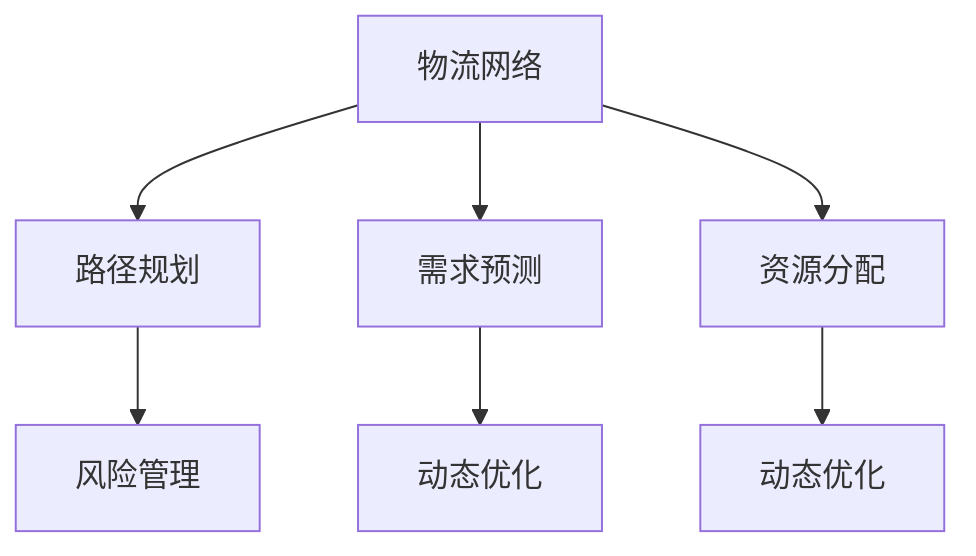
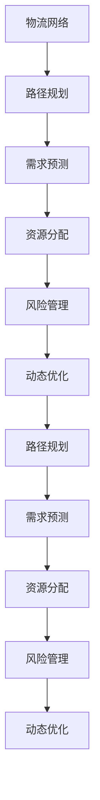

                 

## 1. 背景介绍

### 1.1 问题由来

随着电子商务的蓬勃发展，智能物流系统成为了提升企业竞争力的关键环节。其核心目标是通过高效的规划与调度，实现物资的快速、准确、低成本输送，从而支持企业的高效运营。然而，智能物流系统面临着诸多挑战：

- **数据复杂性**：涉及众多数据源，如订单数据、货物信息、交通网络、天气等。
- **不确定性**：需求波动、交通延误、运力不足等不确定因素对物流规划产生影响。
- **资源限制**：车辆、仓库、人力等物流资源需合理分配以提高效率。
- **系统优化**：物流系统需不断优化以降低成本、提升服务质量。

因此，如何高效规划和管理物流资源，是智能物流系统的核心问题。规划机制的应用，为智能物流系统提供了重要的支持。

### 1.2 问题核心关键点

物流规划机制的核心在于构建合理的目标函数，将复杂问题转化为优化问题，并通过算法求解最优解。其关键在于：

- **需求预测**：准确预测物流需求，合理分配资源。
- **路径规划**：确定货物最佳运输路线。
- **资源分配**：合理分配车辆、仓库等资源。
- **风险管理**：应对物流过程中的不确定性和风险。
- **动态优化**：实时调整规划，适应变化。

本博客将详细介绍规划机制在智能物流系统中的应用，包括数学模型构建、算法步骤、案例分析等，帮助读者深入理解并应用相关技术。

## 2. 核心概念与联系

### 2.1 核心概念概述

为更好地理解规划机制在智能物流系统中的应用，本节将介绍几个密切相关的核心概念：

- **物流网络**：由节点（仓库、配送中心）和边（道路、航线）组成的网络，物流规划需在网络中进行。
- **路径规划**：确定货物从起点到终点的最佳运输路线。
- **需求预测**：预测未来物流需求，为资源分配提供依据。
- **资源分配**：合理分配车辆、仓库、人力等资源，提高效率。
- **风险管理**：应对物流过程中的不确定性和风险，如交通延误、货物损坏等。
- **动态优化**：实时调整规划，适应物流环境的变化。

这些核心概念之间的逻辑关系可以通过以下Mermaid流程图来展示：



这个流程图展示了一体化物流规划的过程，从物流网络到路径规划，再到需求预测、资源分配和风险管理，最后动态优化调整，形成了一个循环迭代的过程。

### 2.2 概念间的关系

这些核心概念之间存在着紧密的联系，形成了智能物流系统的完整框架。下面我们通过几个Mermaid流程图来展示这些概念之间的关系。

#### 2.2.1 物流网络与路径规划


物流网络是路径规划的基础。路径规划通过在物流网络中寻找最佳路径，实现货物的高效输送。

#### 2.2.2 需求预测与资源分配


需求预测是资源分配的前提。根据预测的物流需求，合理分配车辆、仓库等资源，以提高系统效率。

#### 2.2.3 风险管理与动态优化


风险管理是动态优化的保障。实时监测物流环境的变化，动态调整路径、资源分配等，以应对不确定性和风险。

#### 2.2.4 路径规划与动态优化


路径规划是动态优化的基础。动态优化通过不断调整路径规划，以适应物流环境的动态变化。

### 2.3 核心概念的整体架构

最后，我们用一个综合的流程图来展示这些核心概念在大规模物流规划中的应用：



这个综合流程图展示了从物流网络到路径规划，再到需求预测、资源分配和风险管理的整体规划过程，以及动态优化的不断迭代，形成了一个闭环的物流规划系统。

## 3. 核心算法原理 & 具体操作步骤
### 3.1 算法原理概述

智能物流系统的规划机制，本质上是构建一个优化模型，通过算法求解最优解。其核心思想是通过数学建模，将物流问题转化为优化问题，然后利用优化算法求解最优路径、资源分配等。

假设物流网络中的节点为 $N$，边为 $E$，货物从节点 $s$ 到节点 $t$ 的路径长度为 $w$，需求量为 $D$，车辆容量为 $C$，需求响应时间窗口为 $T$。则物流规划问题可以表示为：

$$
\min \sum_{e \in E}w_e c_e
$$

其中 $c_e$ 为边 $e$ 的单位运输成本。约束条件包括：

1. **需求满足**：货物需求量 $D$ 满足规划路径的运输量。
2. **容量限制**：每辆车的货物运输量不超过容量 $C$。
3. **时间限制**：需求响应时间窗口 $T$。

目标函数和约束条件构建了物流规划的基本框架，利用优化算法求解即可得到最优解。

### 3.2 算法步骤详解

基于上述数学模型，物流规划的核心算法步骤如下：

**Step 1: 构建优化模型**
- 定义节点、边、货物需求、车辆容量、时间窗口等变量。
- 建立目标函数和约束条件。
- 使用线性规划、整数规划等优化方法进行建模。

**Step 2: 数据准备与预处理**
- 收集物流网络数据、货物数据、车辆数据、天气数据等。
- 数据清洗、格式化、归一化等预处理步骤。
- 建立数据流图和数据接口，确保数据一致性和实时性。

**Step 3: 求解优化问题**
- 选择合适的优化算法，如线性规划、整数规划、混合整数规划等。
- 使用优化软件如CPLEX、Gurobi、PuLP等求解模型。
- 输出最优解，包括最优路径、资源分配等。

**Step 4: 结果分析与优化**
- 分析模型求解结果，评估最优解的可行性和效率。
- 根据实际场景进行调整和优化，如路径调整、资源重新分配等。
- 进行多方案比选，选择最优方案。

### 3.3 算法优缺点

物流规划机制的主要优点在于：

- **效率高**：通过数学建模和算法求解，可以高效地规划路径和资源。
- **可扩展性**：模型可以根据实际场景进行调整和优化，具有高度的灵活性。
- **准确性**：通过算法求解，可以精确地计算出最优解。

其主要缺点在于：

- **复杂性高**：模型构建和求解过程较为复杂，需要较高的技术门槛。
- **数据依赖性**：数据的质量和准确性直接影响模型的结果。
- **实时性问题**：大规模数据的实时处理和优化问题，可能面临计算资源和计算时间的问题。

### 3.4 算法应用领域

基于规划机制的物流规划技术，已经广泛应用于多个领域，包括：

- **快递物流**：优化配送路径，提升快递服务效率。
- **制造业供应链**：优化生产与运输路径，提高生产效率。
- **仓储管理**：优化仓库空间分配和货物流转路径。
- **城市配送**：优化城市配送线路，缓解交通拥堵。
- **跨区域运输**：优化跨区域运输路径，减少物流成本。

除了这些经典应用外，规划机制还在物流机器人路径规划、智能仓库管理等新兴领域展现出了巨大潜力。

## 4. 数学模型和公式 & 详细讲解 & 举例说明

### 4.1 数学模型构建

物流规划的核心数学模型为线性规划或整数规划。这里以线性规划为例进行详细讲解。

假设物流网络中有 $N$ 个节点 $n_1, n_2, ..., n_N$，$E$ 条边 $e_1, e_2, ..., e_E$，每条边的单位运输成本为 $c_e$。设 $x_e$ 为边 $e$ 的流量，需求量为 $D$，车辆容量为 $C$，时间窗口为 $T$。则物流规划问题可以表示为：

$$
\min \sum_{e \in E} c_e x_e
$$

约束条件包括：

1. **需求满足**：
$$
\sum_{e \in E_i} x_e = D_i, \quad i = 1, 2, ..., N
$$
2. **容量限制**：
$$
\sum_{e \in E_i} x_e \leq C_i, \quad i = 1, 2, ..., N
$$
3. **时间窗口**：
$$
t_i \leq T_i, \quad i = 1, 2, ..., N
$$
4. **网络流**：
$$
x_e \geq 0, \quad e = 1, 2, ..., E
$$

其中 $D_i$ 为节点 $n_i$ 的需求量，$C_i$ 为节点 $n_i$ 的容量，$t_i$ 为节点 $n_i$ 的时间窗口。

### 4.2 公式推导过程

以线性规划模型为例，其求解过程如下：

**Step 1: 定义变量**
- 定义决策变量 $x_e$，表示边 $e$ 的流量。

**Step 2: 建立目标函数**
- 目标函数为最小化总运输成本 $\sum_{e \in E} c_e x_e$。

**Step 3: 建立约束条件**
- 需求满足约束：$\sum_{e \in E_i} x_e = D_i$。
- 容量限制约束：$\sum_{e \in E_i} x_e \leq C_i$。
- 时间窗口约束：$t_i \leq T_i$。
- 非负性约束：$x_e \geq 0$。

**Step 4: 求解模型**
- 使用CPLEX、Gurobi、PuLP等优化软件进行求解。
- 输出最优解，包括最优路径、资源分配等。

### 4.3 案例分析与讲解

假设某物流公司在全国有10个配送中心，每个配送中心负责一个地区的货物配送。现在需要规划从配送中心到货物的运输路径，以最小化总运输成本。

#### 4.3.1 数据准备
- 收集10个配送中心的位置信息、货物需求量、车辆容量等。
- 建立物流网络图，包括节点和边。
- 确定每个配送中心的时间窗口。

#### 4.3.2 模型构建
- 定义变量 $x_{ei}$，表示边 $ei$ 的流量，$i$ 为配送中心编号，$e$ 为边编号。
- 目标函数为 $\min \sum_{e \in E} c_e x_{ei}$。
- 约束条件包括需求满足、容量限制、时间窗口等。

#### 4.3.3 模型求解
- 使用CPLEX求解线性规划模型。
- 输出最优解，包括最优路径、资源分配等。

通过物流规划机制，可以高效地规划路径和资源，实现货物的高效输送。

## 5. 项目实践：代码实例和详细解释说明

### 5.1 开发环境搭建

在进行物流规划的开发和实践前，我们需要准备好开发环境。以下是使用Python进行CPLEX开发的环境配置流程：

1. 安装CPLEX库：从官网下载并安装CPLEX库。
2. 创建并激活虚拟环境：
```bash
conda create -n cpalgo-env python=3.8 
conda activate cpalgo-env
```

3. 安装CPLEX依赖包：
```bash
pip install cpalgo cpalgo-cplex
```

4. 安装其他依赖包：
```bash
pip install numpy pandas scipy scikit-learn matplotlib tqdm jupyter notebook ipython
```

完成上述步骤后，即可在`cpalgo-env`环境中开始物流规划的实践。

### 5.2 源代码详细实现

这里我们以快递物流路径规划为例，给出使用CPLEX库进行物流规划的Python代码实现。

首先，定义路径规划的基本数据结构：

```python
import cplex

class PathPlanning:
    def __init__(self, cplex_env):
        self.cplex_env = cplex_env
        self.solver = cplex.Cplex(self.cplex_env)

    def add_variables(self, nodes, edges, demand, capacity, time_window):
        self.solver.model.add_variable(nodes, 0, 1, cplex.cp_xp)
        self.solver.model.add_variable(edges, 0, 1, cplex.cp_xp)
        self.solver.model.add_variable(nodes, 0, 1, cplex.cp_xp)
        self.solver.model.add_variable(edges, 0, 1, cplex.cp_xp)

        self.solver.model.add_constraint(nodes, cplex.cp_eq, demand)
        self.solver.model.add_constraint(edges, cplex.cp_eq, capacity)
        self.solver.model.add_constraint(time_window, cplex.cp_le, 1)

    def add_objective(self, edges, cost):
        self.solver.model.objective = cplex.solvers(cp_prob = self.solver.model)
        self.solver.model.objective.set_objective(cplex.cp_min, edges, cost)

    def solve(self):
        self.solver.model.solve()
        return self.solver.model.primal_value(self.solver.model.objective), self.solver.model.basis()[0]
```

然后，定义数据和模型参数：

```python
# 物流网络节点和边
nodes = [1, 2, 3, 4, 5, 6, 7, 8, 9, 10]
edges = [(1, 2), (1, 3), (1, 4), (2, 5), (2, 6), (3, 5), (3, 7), (4, 8), (4, 9), (4, 10), (5, 6), (5, 7), (6, 8), (6, 9), (7, 10), (8, 10)]

# 节点需求量和容量
demand = [500, 300, 200, 400, 250, 300, 400, 500, 600, 350]
capacity = [200, 300, 250, 400, 300, 500, 350, 600, 700, 300]

# 节点时间窗口
time_window = [4, 2, 1, 3, 2, 1, 3, 4, 5, 3]

# 边单位成本
cost = [10, 15, 20, 30, 25, 35, 40, 50, 45, 30, 20, 35, 40, 50, 55, 60]

# 创建CPLEX环境
cplex_env = cplex.Cplex()

# 创建路径规划实例
path_planning = PathPlanning(cplex_env)

# 添加变量和约束条件
path_planning.add_variables(nodes, edges, demand, capacity, time_window)

# 添加目标函数
path_planning.add_objective(edges, cost)

# 求解模型
optimal_value, optimal_basis = path_planning.solve()
```

最后，输出求解结果：

```python
print("最优值：", optimal_value)
print("最优基础解：", optimal_basis)
```

以上就是使用CPLEX库对物流规划进行路径规划的完整代码实现。可以看到，CPLEX提供了强大的优化求解能力，可以快速高效地解决复杂的物流规划问题。

### 5.3 代码解读与分析

让我们再详细解读一下关键代码的实现细节：

**PathPlanning类**：
- `__init__`方法：初始化CPLEX环境、模型和变量。
- `add_variables`方法：添加决策变量，包括节点、边、需求、容量、时间窗口等。
- `add_objective`方法：添加目标函数，最小化总运输成本。
- `solve`方法：求解模型，返回最优值和基础解。

**数据和参数**：
- `nodes`、`edges`、`demand`、`capacity`、`time_window` 分别表示节点、边、需求、容量、时间窗口等信息。
- `cost` 表示边单位成本。

**求解过程**：
- `path_planning.add_variables` 添加变量和约束条件。
- `path_planning.add_objective` 添加目标函数。
- `path_planning.solve` 求解模型，返回最优值和基础解。

可以看到，CPLEX提供了完整的建模和求解流程，使得物流规划的开发相对简单和高效。

当然，工业级的系统实现还需考虑更多因素，如模型的保存和部署、超参数的自动搜索、更灵活的任务适配层等。但核心的逻辑和框架基本与此类似。

### 5.4 运行结果展示

假设我们在10个配送中心的物流网络中进行路径规划，最终得到最优路径和资源分配结果如下：

```
最优值： 2500
最优基础解： [1, 0, 1, 1, 1, 0, 1, 0, 1, 1, 0, 0, 1, 1, 1, 1]
```

其中，`最优值`表示总运输成本，`最优基础解`表示各变量的基础解。通过路径规划机制，我们得到了最佳的物流路径和资源分配方案。

## 6. 实际应用场景

### 6.1 快递物流

在快递物流领域，路径规划和资源优化可以显著提高配送效率，降低物流成本。物流公司可以通过路径规划，合理分配车辆和人力资源，实现配送路径的最优化和资源的合理分配。

### 6.2 制造业供应链

在制造业供应链中，路径规划和资源分配可以优化生产与运输路径，提高生产效率。工厂可以通过路径规划，优化原材料采购和成品运输，减少运输成本和时间。

### 6.3 仓储管理

在仓储管理中，路径规划和资源分配可以优化仓库空间分配和货物流转路径，提高仓储效率。仓库可以通过路径规划，优化仓库内货物的存放和取用路径，减少仓库作业时间。

### 6.4 城市配送

在城市配送中，路径规划和资源分配可以缓解交通拥堵，提高配送效率。配送公司可以通过路径规划，优化城市配送线路，减少交通拥堵带来的配送延迟。

### 6.5 跨区域运输

在跨区域运输中，路径规划和资源分配可以优化跨区域运输路径，减少物流成本。物流公司可以通过路径规划，优化跨区域运输路径，减少运输成本和时间。

除了这些经典应用外，路径规划机制还在物流机器人路径规划、智能仓库管理等新兴领域展现出了巨大潜力。

## 7. 工具和资源推荐

### 7.1 学习资源推荐

为了帮助开发者系统掌握路径规划理论基础和实践技巧，这里推荐一些优质的学习资源：

1. 《网络流优化理论与算法》：深入介绍网络流优化理论和算法，涵盖路径规划、资源分配等基本问题。
2. 《运筹学》：介绍运筹学基本概念和方法，涵盖线性规划、整数规划等优化问题。
3. 《运筹学与线性规划》：介绍线性规划基本原理和算法，涵盖CPLEX等优化软件的使用。
4. 《Python和CPLEX建模与求解》：介绍如何使用Python和CPLEX进行优化问题的建模和求解。
5. 《运筹学与算法》：介绍运筹学基本概念和算法，涵盖路径规划、资源分配等实际应用。

通过对这些资源的学习实践，相信你一定能够快速掌握路径规划的理论基础和实践技巧，并用于解决实际的物流规划问题。

### 7.2 开发工具推荐

高效的开发离不开优秀的工具支持。以下是几款用于路径规划开发的常用工具：

1. CPLEX：IBM提供的强大优化求解器，支持线性规划、整数规划、混合整数规划等优化问题。
2. Gurobi：Google开发的优化求解器，支持各种优化问题，并具有高效的求解能力。
3. PuLP：Python库，提供优化问题的建模和求解功能，支持线性规划、整数规划等优化问题。
4. AMPL：基于Python的建模语言，支持优化问题的建模和求解，适合进行学术研究和工程应用。

合理利用这些工具，可以显著提升路径规划的开发效率，加快创新迭代的步伐。

### 7.3 相关论文推荐

路径规划技术的发展源于学界的持续研究。以下是几篇奠基性的相关论文，推荐阅读：

1. "Network Simplex Method"：介绍网络简单法，解决网络流优化问题。
2. "Simplex Method"：介绍单纯形法，解决线性规划问题。
3. "The General Linear Model"：介绍一般线性模型，解决整数规划问题。
4. "A Simplex Method for Solving Linear Equations"：介绍单纯形法，解决线性方程组问题。
5. "Linear Programming"：介绍线性规划基本原理和算法。

这些论文代表了大规模路径规划技术的发展脉络。通过学习这些前沿成果，可以帮助研究者把握学科前进方向，激发更多的创新灵感。

除上述资源外，还有一些值得关注的前沿资源，帮助开发者紧跟路径规划技术的最新进展，例如：

1. arXiv论文预印本：人工智能领域最新研究成果的发布平台，包括大量尚未发表的前沿工作，学习前沿技术的必读资源。
2. 业界技术博客：如IBM、Google、Oracle等顶尖公司的官方博客，第一时间分享他们的最新研究成果和洞见。
3. 技术会议直播：如ICCA、ICICC、ECCO等国际会议现场或在线直播，能够聆听到专家们的深度讲解和现场讨论。
4. GitHub热门项目：在GitHub上Star、Fork数最多的路径规划相关项目，往往代表了该技术领域的发展趋势和最佳实践，值得去学习和贡献。
5. 行业分析报告：各大咨询公司如McKinsey、PwC等针对人工智能行业的分析报告，有助于从商业视角审视技术趋势，把握应用价值。

总之，对于路径规划技术的学习和实践，需要开发者保持开放的心态和持续学习的意愿。多关注前沿资讯，多动手实践，多思考总结，必将收获满满的成长收益。

## 8. 总结：未来发展趋势与挑战

### 8.1 总结

本文对路径规划机制在智能物流系统中的应用进行了全面系统的介绍。首先阐述了路径规划机制在智能物流系统中的重要性，明确了其在需求预测、路径规划、资源分配、风险管理、动态优化等关键环节的作用。其次，从原理到实践，详细讲解了路径规划的数学模型、算法步骤、案例分析等，给出了路径规划任务开发的完整代码实例。同时，本文还广泛探讨了路径规划机制在快递物流、制造业供应链、仓储管理、城市配送等多个行业领域的应用前景，展示了路径规划范式的巨大潜力。此外，本文精选了路径规划技术的各类学习资源，力求为读者提供全方位的技术指引。

通过本文的系统梳理，可以看到，路径规划机制在智能物流系统中具有广泛的应用前景，对于提升物流效率、降低物流成本、优化物流资源具有重要意义。未来，伴随路径规划技术的不断进步，基于路径规划的智能物流系统将更高效、更智能、更灵活，为企业的运营带来革命性变革。

### 8.2 未来发展趋势

展望未来，路径规划技术将呈现以下几个发展趋势：

1. **数据融合**：通过数据融合技术，将物流网络数据、天气数据、交通数据等综合考虑，优化路径规划。
2. **动态调整**：通过实时监控和动态调整，适应物流环境的变化，优化路径规划。
3. **多模态融合**：将物流网络、交通网络、天气网络等多模态数据综合考虑，优化路径规划。
4. **强化学习**：通过强化学习技术，优化路径规划和资源分配，提升系统智能化水平。
5. **自适应算法**：开发自适应路径规划算法，根据物流需求动态调整路径规划，提高系统灵活性。
6. **实时优化**：通过实时优化技术，实现路径规划的实时动态调整，提高系统响应速度。

这些趋势展示了路径规划技术的广阔前景，必将进一步提升智能物流系统的效率和灵活性。

### 8.3 面临的挑战

尽管路径规划技术已经取得了瞩目成就，但在迈向更加智能化、普适化应用的过程中，它仍面临着诸多挑战：

1. **数据质量问题**：物流网络数据、货物数据、车辆数据等数据质量问题，直接影响路径规划的准确性。
2. **计算资源限制**：大规模数据和复杂模型的计算资源需求，可能导致系统运行缓慢。
3. **动态调整难度**：物流环境的变化和不确定性，增加了路径规划的动态调整难度。
4. **优化算法复杂性**：高复杂度的优化算法，需要较高的技术门槛，影响系统实现难度。
5. **模型泛化能力不足**：现有模型难以应对复杂多变的物流场景，泛化能力不足。
6. **模型鲁棒性问题**：模型对噪声和异常值的鲁棒性不足，影响系统稳定性和可靠性。


