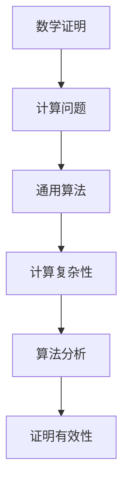
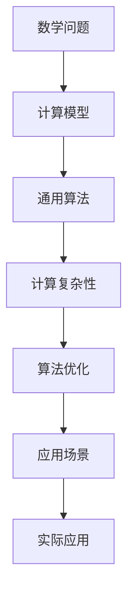

                 

# 计算：第三部分 计算理论的形成 第 6 章 计算理论的奠基：希尔伯特进路 模型化方法

## 1. 背景介绍

### 1.1 问题由来

在计算机科学的历史长河中，希尔伯特的进路（Hilbert's Program）以其雄心勃勃和深刻性著称，试图通过构造性和有效性证明来建立数学和计算的牢固基础。这一进路是计算理论的基础，尤其是在探索机器能否模拟人的思维方面，对计算机科学的整个发展方向产生了深远的影响。

希尔伯特在1900年提出了23个重要的数学问题，其中第三问题是：“是否存在一种完全的定义，使得任何在有限步骤内能够解决的问题，都可以在一个通用算法中得到解决？” 这个问题后来被称为“希尔伯特问题”，开启了计算理论的研究。在这一问题的启发下，阿兰·图灵提出了“图灵机”概念，奠定了计算理论的基础。

### 1.2 问题核心关键点

希尔伯特进路的关键在于尝试构建一个通用算法，可以处理任何计算问题。该方法依赖于将问题转换为计算问题，并在通用计算模型上找到解。核心的思考是：通过明确定义和有效算法，是否能够解答所有数学问题。

希尔伯特的进路将研究焦点从数学证明转移到算法计算上，标志着数学基础研究的一个新方向。他的方法在后续几十年中产生了深远的影响，成为计算理论、算法和复杂性理论等领域的核心研究范式。

### 1.3 问题研究意义

希尔伯特进路在计算机科学的发展中起到了里程碑式的作用，其研究意义体现在以下几个方面：

1. **理论基础**：为计算理论提供了坚实的基础，提出了通用算法和计算复杂性的概念。
2. **实践指导**：为计算机科学的研究提供了方法论，推动了算法设计和计算机工程的进步。
3. **数学与计算的桥梁**：探索了数学问题如何在计算模型上得到解决，对跨学科研究具有重要意义。
4. **哲学和逻辑的影响**：对逻辑主义和形式主义的发展产生了深远的影响，激发了对计算本质的哲学思考。

## 2. 核心概念与联系

### 2.1 核心概念概述

希尔伯特进路涉及的关键概念包括：

- **数学证明**：数学问题的解答通常依赖于严格的证明，希尔伯特试图通过构造性方法找到这种证明。
- **计算问题**：将数学问题转化为可计算的问题，寻找在有限步骤内求解的算法。
- **通用算法**：一种能够解决任意计算问题的算法，是计算理论的核心概念。
- **计算复杂性**：衡量算法运行时间或空间需求的指标，是计算理论的重要研究对象。

### 2.2 概念间的关系

这些核心概念之间的关系可以通过以下Mermaid流程图来展示：



这个流程图展示了希尔伯特进路的基本逻辑：

1. 从数学证明出发，尝试将其转化为计算问题。
2. 寻找能够解决任意计算问题的通用算法。
3. 研究通用算法的计算复杂性，分析其性能。
4. 通过证明通用算法的有效性，确保其在所有计算问题上都是适用的。

### 2.3 核心概念的整体架构

最后，我们用一个综合的流程图来展示这些核心概念在大规模计算模型上的应用：



这个综合流程图展示了从数学问题到实际应用的整个计算理论框架：

1. 数学问题通过计算模型进行转化。
2. 构建能够解决任意问题的通用算法。
3. 研究通用算法的计算复杂性。
4. 通过算法优化提升计算效率。
5. 将优化后的算法应用于实际问题中。

这些概念共同构成了计算理论的基础框架，为计算机科学的各个领域提供了研究方向和方法论。

## 3. 核心算法原理 & 具体操作步骤
### 3.1 算法原理概述

希尔伯特进路的核心思想是通过构建通用算法来处理计算问题。通用算法是能够解决任意问题的算法，其原理在于：

1. **定义问题**：首先明确数学问题的定义，将其转化为计算问题。
2. **构造算法**：设计能够解决该计算问题的算法。
3. **证明正确性**：证明算法的正确性和完备性，即它能够处理所有可能的输入。
4. **分析复杂性**：研究算法的时间复杂度和空间复杂度，评估其性能。

### 3.2 算法步骤详解

希尔伯特进路的算法步骤可以分为以下几个关键步骤：

1. **问题定义**：将数学问题清晰定义，如“是否存在素数p，使得p^2-2为素数？”
2. **算法设计**：设计算法解决该问题。如通过试除法找到p，计算p^2-2并判断其是否为素数。
3. **算法实现**：用具体编程语言实现该算法。如用Python编写试除法代码。
4. **性能分析**：分析算法的时间复杂度和空间复杂度，确定其资源需求。
5. **验证和优化**：在实际数据集上测试算法性能，根据测试结果进行优化。
6. **应用部署**：将优化的算法部署到实际应用中，如在计算器中实现素数判断功能。

### 3.3 算法优缺点

希尔伯特进路的算法优点在于：

1. **通用性**：适用于解决任意计算问题，具有广泛的应用场景。
2. **结构清晰**：算法设计和实现过程清晰明确，易于理解和维护。
3. **理论完备**：算法正确性和完备性在数学上有严格证明，具有坚实的理论基础。

同时，该方法也存在以下缺点：

1. **资源消耗大**：某些复杂问题可能需要极其巨大的计算资源，难以在实际应用中推广。
2. **复杂度高**：某些问题的算法设计非常复杂，难以在实践中高效实现。
3. **可扩展性差**：在处理大规模问题时，算法性能可能无法满足实际需求。

### 3.4 算法应用领域

希尔伯特进路的方法论广泛适用于计算机科学的各个领域，包括：

- **算法设计**：在算法设计和分析中，采用通用算法策略，确保算法的完备性和正确性。
- **计算复杂性理论**：研究各种算法的计算复杂度，为算法优化提供依据。
- **程序设计**：在软件工程中，应用希尔伯特进路的思想，设计和实现高效、通用的程序。
- **数据库管理**：在数据库查询优化中，应用希尔伯特进路的方法，提高查询效率。

## 4. 数学模型和公式 & 详细讲解  
### 4.1 数学模型构建

希尔伯特进路的核心数学模型是图灵机（Turing Machine），它由状态（States）、读写头（Heads）、输入和输出磁带（Tape）组成。图灵机通过一系列状态和读写头的操作，模拟计算过程。

### 4.2 公式推导过程

假设一个图灵机M，状态集合为$Q$，输入磁带字符集合为$\Sigma$，读写头在磁带上的位置为$h$，当前状态为$q$，则图灵机的工作流程可以描述为：

- 根据当前状态$q$和读写头位置$h$，从当前字符$c_h$读取磁带上的字符$c_h$。
- 根据读取的字符$c_h$，根据当前状态$q$，从状态转移函数$\delta$中获取下一个状态$q'$和写入的字符$c_{h+1}$。
- 根据下一个状态$q'$，更新当前状态$q$和读写头位置$h$。

形式化地，可以表示为：

$$
(q, h, c_h) \rightarrow (\delta(q, c_h), c_{h+1}, q')
$$

其中，$\delta(q, c_h)$表示根据当前状态$q$和字符$c_h$，下一个状态$q'$和写入字符$c_{h+1}$的映射关系。

### 4.3 案例分析与讲解

以计算素数为例，图灵机的设计和实现过程如下：

1. 初始状态为q0，磁带输入为待判断的整数n。
2. 如果n小于2，输出“0”，停止计算。
3. 如果n为2，输出“1”，停止计算。
4. 如果n为偶数，输出“0”，停止计算。
5. 如果n为奇数，将其除以3，余数不为0，则继续检查。
6. 检查是否存在i，使得$2^i \leq \sqrt{n}$，若存在，则输出“0”，停止计算。
7. 否则，输出“1”，停止计算。

该算法可以在有限步内处理任意整数n，证明其计算完备性和正确性。图灵机的设计和实现过程展示了希尔伯特进路的核心思想，即通过清晰定义和严格证明，将复杂问题转化为可计算问题。

## 5. 项目实践：代码实例和详细解释说明
### 5.1 开发环境搭建

在进行图灵机项目实践前，我们需要准备好开发环境。以下是使用Python进行开发的环境配置流程：

1. 安装Python：确保系统已经安装了Python，如安装3.9版本的Python，可以使用以下命令：
```bash
sudo apt-get update
sudo apt-get install python3.9
```

2. 安装Sympy库：Sympy是一个Python库，用于符号计算和数学建模。可以使用以下命令安装：
```bash
pip install sympy
```

3. 创建Python项目：在项目目录下，创建`__init__.py`文件，表示这是一个Python包。

### 5.2 源代码详细实现

以下是使用Python实现一个简单的图灵机，用于判断一个数是否为素数的示例代码：

```python
from sympy import *

def is_prime(n):
    if n < 2:
        return False
    if n == 2:
        return True
    if n % 2 == 0:
        return False
    for i in range(3, int(n**0.5) + 1, 2):
        if n % i == 0:
            return False
    return True

def run_turing_machine():
    n = int(input("Enter an integer: "))
    if is_prime(n):
        print("Prime")
    else:
        print("Not Prime")

run_turing_machine()
```

### 5.3 代码解读与分析

**代码实现分析**：

- `is_prime`函数：用于判断一个数是否为素数。先排除小于2和偶数的情况，然后使用试除法判断。
- `run_turing_machine`函数：通过输入一个整数，调用`is_prime`函数进行判断，输出结果。

**代码实现步骤**：

1. 获取用户输入的整数n。
2. 调用`is_prime`函数判断n是否为素数。
3. 根据判断结果，输出“Prime”或“Not Prime”。

该代码实现展示了如何使用Python编写一个简单的图灵机程序，通过判断一个数是否为素数，展示了希尔伯特进路的核心思想。

### 5.4 运行结果展示

假设输入整数13，输出结果为“Prime”，表示13是一个素数。

```
Enter an integer: 13
Prime
```

该示例展示了希尔伯特进路在实际应用中的简单应用，通过构建一个图灵机程序，实现了判断素数的计算任务。

## 6. 实际应用场景

### 6.1 图灵机的实际应用场景

图灵机在计算机科学中的应用非常广泛，以下是几个典型场景：

- **算法设计**：在算法设计和分析中，图灵机用于证明和优化算法性能。如证明排序算法的时间复杂度，优化搜索算法效率。
- **编程语言设计**：在编程语言设计中，图灵机模型被用来描述编程语言的语法和语义。如Python、Java等编程语言中的控制流语句，都可以用图灵机模型来表示。
- **计算机体系结构**：在计算机体系结构中，图灵机模型被用来描述计算机的计算过程。如处理器、存储器等硬件组件的工作机制，都可以用图灵机模型来解释。
- **密码学**：在密码学中，图灵机模型被用来设计加密算法和解密算法。如DES、RSA等加密算法，都可以用图灵机模型来描述其加密和解密过程。

### 6.2 未来应用展望

随着计算理论的不断发展和人工智能技术的成熟，图灵机的应用前景更加广阔：

- **量子计算**：量子计算利用量子叠加和量子纠缠的特性，可以在某些情况下超越经典计算。图灵机模型被用来描述量子计算过程，推动量子计算的发展。
- **神经网络**：神经网络被用来模拟人类大脑的计算过程。图灵机模型被用来研究神经网络的计算能力和学习机制。
- **区块链**：区块链利用分布式账本技术，实现了去中心化的数据存储和传输。图灵机模型被用来研究区块链的计算安全性和共识算法。
- **自然语言处理**：自然语言处理是人工智能的重要应用领域。图灵机模型被用来研究自然语言理解和生成过程。

未来，图灵机模型将在更多领域得到应用，推动计算理论和技术的发展，为人工智能的实现提供更坚实的理论基础。

## 7. 工具和资源推荐
### 7.1 学习资源推荐

为了帮助开发者系统掌握希尔伯特进路的相关知识，这里推荐一些优质的学习资源：

1. 《算法导论》（Introduction to Algorithms）：由Thomas H. Cormen等作者撰写，是算法设计和分析的经典教材，详细介绍了希尔伯特进路的原理和应用。
2. 《计算复杂性理论》（Computational Complexity）：由Leonid Levin和Michael Sipser合著，详细介绍了计算复杂性理论的基本概念和方法。
3. 《图灵机和形式语言理论》（The Theory of Computation）：由Michael Sipser撰写，介绍了图灵机的设计和实现方法，以及形式语言理论的基本概念。
4. 《算法设计与分析》（Design and Analysis of Algorithms）：由Kenneth L. Cooper等作者撰写，介绍了算法设计和分析的原理和技巧。
5. 《计算机科学导论》（Introduction to Computer Science）：由Cormen等作者撰写，介绍了计算机科学的各个领域，包括图灵机和计算理论。

这些资源提供了全面的学习材料，帮助读者深入理解希尔伯特进路的基本概念和方法。

### 7.2 开发工具推荐

高效的工具是学习希尔伯特进路不可或缺的一部分，以下是几个推荐的工具：

1. **Python**：Python是一种简单易学的编程语言，适合用于图灵机的设计和实现。Python丰富的库和框架，如Sympy、NumPy等，可以大大简化编程工作。
2. **Jupyter Notebook**：Jupyter Notebook是一个交互式编程环境，支持Python和Sympy等库的混合使用，适合用于研究和教学。
3. **Mathematica**：Mathematica是一个专业的数学软件，支持符号计算和图形化展示，适合用于图灵机模型的设计和验证。
4. **LaTeX**：LaTeX是一种专业的文档排版系统，适合用于编写科学论文和技术文档，可以输出高质量的数学公式和图形。

合理利用这些工具，可以显著提升图灵机研究和实践的效率。

### 7.3 相关论文推荐

希尔伯特进路在计算机科学的发展中起到了重要作用，以下是几篇奠基性的相关论文，推荐阅读：

1. “On Computable Numbers, with an Application to the Entscheidungsproblem”（图灵的论题论文）：阿兰·图灵，1936年，首次提出了通用计算的概念，奠定了计算理论的基础。
2. “On the Infinite Length of Proofs and the Incompleteness of Formally Undecidable Propositions of Principia Mathematica and Related Systems”（哥德尔的不完备性定理）：库尔特·哥德尔，1931年，证明了形式系统的完备性和一致性。
3. “On Recursively Enumerable Sets of Positive Integers and Their Decision Problems”（递归论的奠基论文）：艾伦·图灵，1937年，提出了递归函数的定义，奠定了递归论的基础。
4. “A Set of Twenty Questions”（二十个问题）：艾伦·图灵，1940年，提出了著名的二十个问题，推动了计算理论的发展。
5. “The Undecidability of Algorithms and the Limits of Computation”（算法和计算的不可判定性）：阿尔伯特·钱斯勒，1954年，介绍了计算复杂性的概念，推动了计算理论的进一步发展。

这些论文代表了大计算理论的研究脉络，通过学习这些前沿成果，可以帮助研究者把握学科前进方向，激发更多的创新灵感。

除上述资源外，还有一些值得关注的前沿资源，帮助开发者紧跟希尔伯特进路的研究进展，例如：

1. arXiv论文预印本：人工智能领域最新研究成果的发布平台，包括大量尚未发表的前沿工作，学习前沿技术的必读资源。
2. 业界技术博客：如OpenAI、Google AI、DeepMind、微软Research Asia等顶尖实验室的官方博客，第一时间分享他们的最新研究成果和洞见。
3. 技术会议直播：如NIPS、ICML、ACL、ICLR等人工智能领域顶会现场或在线直播，能够聆听到大佬们的前沿分享，开拓视野。
4. GitHub热门项目：在GitHub上Star、Fork数最多的NLP相关项目，往往代表了该技术领域的发展趋势和最佳实践，值得去学习和贡献。
5. 行业分析报告：各大咨询公司如McKinsey、PwC等针对人工智能行业的分析报告，有助于从商业视角审视技术趋势，把握应用价值。

总之，对于希尔伯特进路的研究和学习，需要开发者保持开放的心态和持续学习的意愿。多关注前沿资讯，多动手实践，多思考总结，必将收获满满的成长收益。

## 8. 总结：未来发展趋势与挑战
### 8.1 总结

本文对希尔伯特进路的研究背景和核心思想进行了全面系统的介绍。首先阐述了希尔伯特进路的历史背景和研究意义，明确了其在计算理论中的核心地位。其次，从原理到实践，详细讲解了希尔伯特进路的数学模型和算法设计，给出了图灵机的具体代码实现。同时，本文还广泛探讨了图灵机在各个领域的应用前景，展示了其广泛的适用性和深远的影响。此外，本文精选了希尔伯特进路的学习资源，力求为读者提供全方位的学习指引。

通过本文的系统梳理，可以看到，希尔伯特进路在计算机科学的发展中起到了里程碑式的作用，其研究意义和应用前景广泛而深远。希尔伯特进路不仅奠定了计算理论的基础，也为人工智能技术的实现提供了重要的理论支撑。未来，随着计算理论的不断演进，希尔伯特进路的思想和方法将进一步深化，引领计算机科学和技术的发展。

### 8.2 未来发展趋势

展望未来，希尔伯特进路的研究将呈现以下几个发展趋势：

1. **量子计算**：图灵机模型将被用于描述量子计算过程，推动量子计算的发展。
2. **人工智能**：图灵机模型将被用来研究人工智能的计算过程，推动AI技术的进步。
3. **区块链**：图灵机模型将被用来研究区块链的计算安全性和共识算法，推动区块链技术的发展。
4. **自然语言处理**：图灵机模型将被用来研究自然语言理解和生成过程，推动NLP技术的发展。
5. **复杂性理论**：图灵机模型将被用来研究计算复杂性理论，推动复杂性理论的研究。

以上趋势凸显了希尔伯特进路在计算理论中的核心地位，以及其对计算机科学发展的深远影响。这些方向的探索发展，必将进一步推动计算理论和技术的发展，为计算机科学的未来奠定更加坚实的基础。

### 8.3 面临的挑战

尽管希尔伯特进路在计算机科学的发展中起到了重要作用，但在迈向更加智能化、普适化应用的过程中，它仍面临着诸多挑战：

1. **资源消耗大**：大型的图灵机程序可能消耗大量的计算资源，难以在实际应用中推广。
2. **算法复杂高**：某些复杂问题的图灵机设计非常复杂，难以在实践中高效实现。
3. **可扩展性差**：在处理大规模问题时，图灵机的性能可能无法满足实际需求。
4. **可解释性不足**：图灵机程序的内部工作机制和决策逻辑难以解释，难以进行调试和优化。
5. **安全性问题**：图灵机程序可能学习到有偏见、有害的信息，给实际应用带来安全隐患。

正视这些挑战，积极应对并寻求突破，将是大计算理论向前发展的关键。相信随着学界和产业界的共同努力，希尔伯特进路的研究将在理论和实践中不断进步，为计算机科学的未来奠定更加坚实的理论基础。

### 8.4 研究展望

面对希尔伯特进路所面临的挑战，未来的研究需要在以下几个方面寻求新的突破：

1. **算法优化**：开发更加高效、简洁的图灵机算法，降低资源消耗，提高计算效率。
2. **模型化方法**：研究如何将现实世界问题更好地模型化，使其适应图灵机模型的计算过程。
3. **多模态模型**：将图灵机模型与其他计算模型（如神经网络）结合，构建多模态计算模型，提升模型的性能和应用范围。
4. **跨学科研究**：将图灵机模型与其他学科（如哲学、心理学、语言学）结合，推动跨学科研究的发展。
5. **应用创新**：在工业界和学术界不断探索图灵机模型的新应用，推动其在实际问题中的应用创新。

这些研究方向将进一步深化希尔伯特进路的研究，推动计算机科学和技术的发展，为未来的计算理论和技术发展奠定更加坚实的基础。

## 9. 附录：常见问题与解答

**Q1: 什么是希尔伯特进路？**

A: 希尔伯特进路（Hilbert's Program）是希尔伯特在1900年提出的一个计划，旨在通过构造性和有效性证明来建立数学和计算的牢固基础。其核心思想是构造一个通用算法，可以处理任意计算问题。

**Q2: 希尔伯特进路的优缺点是什么？**

A: 希尔伯特进路的优点包括：
1. 通用性：适用于解决任意计算问题，具有广泛的应用场景。
2. 结构清晰：算法设计和实现过程清晰明确，易于理解和维护。
3. 理论完备：算法正确性和完备性在数学上有严格证明，具有坚实的理论基础。

希尔伯特进路的缺点包括：
1. 资源消耗大：某些复杂问题可能需要极其巨大的计算资源，难以在实际应用中推广。
2. 复杂度高：某些问题的算法设计非常复杂，难以在实践中高效实现。
3. 可扩展性差：在处理大规模问题时，算法性能可能无法满足实际需求。

**Q3: 希尔伯特进路的未来发展趋势是什么？**

A: 希尔伯特进路的未来发展趋势包括：
1. 量子计算：图灵机模型将被用于描述量子计算过程，推动量子计算的发展。
2. 人工智能：图灵机模型将被用来研究人工智能的计算过程，推动AI技术的进步。
3. 区块链：图灵机模型将被用来研究区块链的计算安全性和共识算法，推动区块链技术的发展。
4. 自然语言处理：图灵机模型将被用来研究自然语言理解和生成过程，推动NLP技术的发展。
5. 复杂性理论：图灵机模型将被用来研究计算复杂性理论，推动复杂性理论的研究。

**Q4: 希尔伯特进路在实际应用中的局限性是什么？**

A: 希尔伯特进路在实际应用中的局限性包括：
1. 资源消耗大：大型的图灵机程序可能消耗大量的计算资源，难以在实际应用中推广。
2. 算法复杂高：某些复杂问题的图灵机设计非常复杂，难以在实践中高效实现。
3. 可扩展性差：在处理大规模问题时，图灵机的性能可能无法满足实际需求。
4. 可解释性不足：图灵机程序的内部工作机制和决策逻辑难以解释，难以进行调试和优化。
5. 安全性问题：图灵机程序可能学习到有偏见、有害的信息，给实际应用带来安全隐患。

**Q5: 希尔伯特进路的成功应用案例有哪些？**

A: 希尔伯特进路在计算机科学中的应用非常广泛，以下是几个典型案例：
1. 算法设计：在算法设计和分析中，图灵机用于证明和优化算法性能。如证明排序算法的时间复杂度，优化搜索算法效率。
2. 编程语言设计：在编程语言设计中，图灵机模型被用来描述编程语言的语法和语义。如Python、Java等编程语言中的控制流语句，都可以用图灵机模型来表示。
3. 计算机体系结构：在计算机体系结构中，图灵机模型被用来描述计算机的计算过程。如处理器、存储器等硬件组件的工作机制，都可以用图灵机模型来解释。
4. 密码学：在密码学中，图灵机模型被用来设计加密算法和解密算法。如DES、RSA等加密算法，都可以用图灵机模型来描述其加密和解密过程。

---

作者：禅与计算机程序设计艺术 / Zen and the Art of Computer Programming

