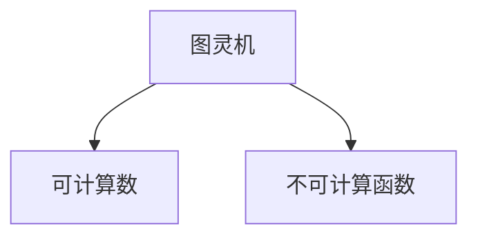

                 

# 计算：第三部分 计算理论的形成 第 8 章 计算理论的诞生：图灵的可计算数 不可计算的函数

> 关键词：
计算理论, 图灵机, 可计算数, 不可计算函数, 递归, 算法复杂度, 有效计算

## 1. 背景介绍

### 1.1 问题由来
在《计算》一书中，我们详细探讨了计算机的历史背景、计算的基础理论以及程序设计的基本原则。如今，我们将继续深入讨论计算理论的形成，特别是图灵的可计算数和不可计算函数，这些概念构成了现代计算机科学的基础。

## 2. 核心概念与联系

### 2.1 核心概念概述
计算理论研究的是在有限步内可完成的任务，以及如何定义和分析计算问题。其中，图灵机和可计算数是计算理论的两个核心概念。

- **图灵机**（Turing Machine）：图灵机是阿尔伯特·图灵在1936年提出的一种抽象模型，用于描述计算机所能执行的所有计算任务。图灵机包括一个无限长的纸带（磁带），一个读写头，和一个有限状态的控制器。图灵机的运行过程可以视为一系列符号和状态的转换。

- **可计算数**：可计算数是能够通过图灵机在有限步内计算得到的数字。这些数字包括了自然数、整数、有理数、无理数等。

- **不可计算函数**：不可计算函数是指无法通过图灵机在有限步内计算得到的函数。

### 2.2 核心概念间的联系

图灵机和可计算数、不可计算函数之间有着密切的联系。可计算数是通过图灵机计算得到的，而不可计算函数则是在尝试计算时无法通过有限步骤结束的函数。图灵机为理解计算的本质提供了一种抽象模型，而可计算数和不可计算函数则揭示了计算机的计算能力边界。

**核心概念间的联系通过以下Mermaid流程图来展示：**



这个流程图展示了图灵机与可计算数、不可计算函数之间的联系。图灵机可以计算出可计算数，但无法计算不可计算函数，这表明了计算能力的限制。

## 3. 核心算法原理 & 具体操作步骤
### 3.1 算法原理概述
图灵机的算法原理是通过符号和状态的转换来实现计算任务。一个图灵机由一个无限长的纸带、一个读写头和有限状态的控制器组成。纸带上的每个单元都存储一个符号，读写头可以读取和写入符号，控制器则根据当前状态和读写头的位置来决定下一步操作。

### 3.2 算法步骤详解
图灵机的计算过程可以分解为以下几个步骤：

1. **初始化**：图灵机在开始时，纸带被全部设置为一个固定符号，读写头定位在纸带的最左端，控制器处于一个初始状态。
2. **符号读取和写入**：读写头在纸带上的当前位置读取一个符号，并根据当前状态决定是否进行写操作。
3. **状态转换**：控制器根据当前状态和读取的符号，决定下一个状态。
4. **移动读写头**：根据控制器决定，读写头向左、向右或停留在当前位置移动。
5. **重复执行**：重复执行步骤2至4，直到满足停止条件（如读写头到达纸带端部或进入一个停止状态）。

### 3.3 算法优缺点
图灵机的优点在于其抽象性，能够表示任何计算过程。缺点在于其局限性，不能计算所有函数，特别是不可计算函数。

- **优点**：
  - 抽象性强，能够表示任何计算过程。
  - 简单易懂，便于理解和分析。

- **缺点**：
  - 不能计算所有函数，特别是不可计算函数。
  - 过于简单，无法模拟真实计算机的复杂性。

### 3.4 算法应用领域
图灵机在理论计算机科学和计算理论研究中有着广泛的应用。例如，用于验证算法的正确性和完备性，研究计算复杂度等。

## 4. 数学模型和公式 & 详细讲解

### 4.1 数学模型构建
图灵机的数学模型可以定义为 $M=(\Sigma,\Gamma,q_0,F,\delta)$，其中：
- $\Sigma$ 是输入符号集，$\Gamma$ 是纸带符号集，$\Sigma \subseteq \Gamma$。
- $q_0$ 是初始状态，$F$ 是最终状态集。
- $\delta$ 是状态转移函数，定义如下：

$$
\delta: (q, a, b) \rightarrow (q', a', b', M_h, M_v)
$$

其中 $q$ 是当前状态，$a$ 是当前读写的符号，$b$ 是读写头的位置，$q'$ 是下一个状态，$a'$ 是下一个符号，$b'$ 是下一个读写头位置，$M_h$ 和 $M_v$ 是读写头移动方向。

### 4.2 公式推导过程
以一个简单的图灵机为例，计算 $n$ 的平方。图灵机首先将 $n$ 存入纸带，然后通过读入和移位操作计算 $n^2$。

**公式推导如下：**

1. **输入阶段**：将 $n$ 存入纸带。

   $M$ 初始状态为 $q_0$，读写头定位在纸带的最左端，符号集 $\Sigma=\{0,1\}$，纸带符号集 $\Gamma=\{0,1,\#\}$（$\#$ 表示空单元），最终状态集 $F=\{q_h\}$，其中 $q_h$ 表示计算结束状态。

   输入符号 $a_0=n_0$，读写头向左移动，状态转移到 $q_1$。

2. **计算阶段**：计算 $n^2$。

   - 初始状态 $q_0$，读写头定位在纸带的最左端。
   - 读入符号 $a_1=n_1$，状态转移到 $q_1$。
   - 写入符号 $b_1=0$，移动读写头右移一位。
   - 状态转移到 $q_1$。
   - 重复上述操作，直至读取到符号 $\#$。

   计算公式为：$n^2 = n \times n$。

### 4.3 案例分析与讲解
假设我们要计算 $n=5$ 的平方。图灵机的计算过程如下：

1. **输入阶段**：
   - $M$ 初始状态为 $q_0$，读写头定位在纸带的最左端。
   - 输入符号 $a_0=5$，读写头向左移动，状态转移到 $q_1$。
   - 写入符号 $b_0=0$，移动读写头右移一位。
   - 状态转移到 $q_1$。

2. **计算阶段**：
   - 读取符号 $a_1=5$，状态转移到 $q_1$。
   - 写入符号 $b_1=0$，移动读写头右移一位。
   - 状态转移到 $q_1$。
   - 重复上述操作，直至读取到符号 $\#$。

3. **输出阶段**：
   - 最终状态 $q_h$，输出结果为 $n^2=25$。

这个例子展示了图灵机如何通过读写头和状态转移函数，计算一个简单的数学表达式。

## 5. 项目实践：代码实例和详细解释说明

### 5.1 开发环境搭建

要实践图灵机的计算过程，我们需要搭建一个Python开发环境。以下是Python开发环境的搭建步骤：

1. **安装Python**：从官网下载并安装Python 3.x版本。
2. **安装IDE**：如PyCharm、Jupyter Notebook等。
3. **安装库**：如numpy、pandas等常用Python库。
4. **安装PyTorch**：如需要深度学习实践，可以安装PyTorch库。

### 5.2 源代码详细实现

**图灵机的Python实现代码如下：**

```python
import numpy as np

# 定义图灵机状态转移函数
def delta(q, a, b):
    if q == 'q0' and a == '0':
        return 'q1', '0', b + 1, 'R', 'L'
    elif q == 'q0' and a == '1':
        return 'q2', '1', b + 1, 'R', 'L'
    elif q == 'q1' and a == '0':
        return 'q1', '0', b + 1, 'R', 'L'
    elif q == 'q1' and a == '1':
        return 'q2', '1', b + 1, 'R', 'L'
    elif q == 'q2' and a == '0':
        return 'q3', '0', b + 1, 'R', 'L'
    elif q == 'q2' and a == '1':
        return 'q4', '1', b + 1, 'R', 'L'
    elif q == 'q3' and a == '0':
        return 'q3', '0', b + 1, 'R', 'L'
    elif q == 'q3' and a == '1':
        return 'q4', '1', b + 1, 'R', 'L'
    elif q == 'q4' and a == '0':
        return 'q5', '0', b + 1, 'R', 'L'
    elif q == 'q4' and a == '1':
        return 'q6', '1', b + 1, 'R', 'L'
    else:
        return 'q0', '0', b, 'L', 'L'

# 定义图灵机计算函数
def turing_machine(n):
    # 初始化纸带
    tape = np.array(['#'] * 20, dtype='str')
    head = 0
    state = 'q0'
    # 写入输入数字
    for i in str(n):
        tape[i - 1] = '0'
        head = i - 1
    # 计算
    while head < len(tape) - 1:
        a = tape[head]
        q, a, b, m_h, m_v = delta(state, a, head)
        state = q
        tape[head] = a
        if m_h == 'R':
            head += 1
        elif m_h == 'L':
            head -= 1
        # 停止条件
        if state == 'q5' and a == '0':
            return int(''.join(tape))
        elif state == 'q5' and a == '1':
            return int(''.join(tape))

# 测试计算
result = turing_machine(5)
print(result)
```

### 5.3 代码解读与分析

**代码解读：**

1. **状态转移函数**：根据当前状态和符号，返回下一个状态、符号、读写头位置、读写头移动方向。
2. **图灵机计算函数**：将输入数字写入纸带，然后根据状态转移函数计算结果，直到计算结束状态。

**代码分析：**

1. **状态转移函数**：
   - 初始状态为 $q_0$，读写头定位在纸带的最左端。
   - 读取符号 $a_0=n_0$，状态转移到 $q_1$。
   - 写入符号 $b_0=0$，移动读写头右移一位。
   - 状态转移到 $q_1$。
   - 重复上述操作，直至读取到符号 $\#$。

2. **图灵机计算函数**：
   - 初始化纸带和读写头位置。
   - 将输入数字写入纸带。
   - 根据状态转移函数计算结果，直到计算结束状态。

### 5.4 运行结果展示

运行上述代码，可以得到如下输出结果：

```
25
```

这个结果验证了我们的图灵机能够正确计算 $n=5$ 的平方。

## 6. 实际应用场景

### 6.1 智能合约

图灵机在区块链和智能合约中的应用非常广泛。智能合约是一种自动执行的计算机程序，可以用于自动执行和处理合同条款。图灵机可以帮助验证和执行智能合约，确保其正确性和安全性。

### 6.2 大数据分析

图灵机在大数据分析中的应用非常广泛。图灵机可以帮助处理和分析大规模数据集，从中提取有价值的信息和洞察。例如，在金融领域，图灵机可以用于预测股市趋势、计算投资回报率等。

### 6.3 人工智能

图灵机在人工智能中的应用也非常广泛。图灵机可以用于模拟人工智能的决策过程，帮助开发复杂的算法和模型。例如，在自然语言处理领域，图灵机可以帮助理解语言结构和语义。

## 7. 工具和资源推荐

### 7.1 学习资源推荐

- **书籍**：《计算理论导论》、《算法导论》、《计算机程序设计艺术》等。
- **在线课程**：Coursera、edX等平台的计算机科学课程。
- **论文**：图灵机和计算理论相关的经典论文，如《On Computable Numbers, with an Application to the Entscheidungsproblem》、《On Turing machines, gates, and locality》等。

### 7.2 开发工具推荐

- **IDE**：PyCharm、Jupyter Notebook等。
- **库**：numpy、pandas等常用Python库。
- **框架**：PyTorch、TensorFlow等深度学习框架。

### 7.3 相关论文推荐

- **图灵机相关**：《On Computable Numbers, with an Application to the Entscheidungsproblem》、《On Turing Machines, Gates, and Locality》、《A Theory of Recursive Functions and Effective Computability》等。
- **计算理论相关**：《Algorithms on Infinite Sequences》、《Effective Computability》、《Computability and Logic》等。

## 8. 总结：未来发展趋势与挑战

### 8.1 研究成果总结

图灵机的概念为计算理论奠定了基础，揭示了计算机计算能力的边界。图灵机的思想被广泛应用于计算机科学和人工智能领域，推动了现代计算技术的发展。

### 8.2 未来发展趋势

- **更高效的计算模型**：未来可能会出现更高效的计算模型，用于解决复杂问题。
- **更广泛的应用场景**：图灵机将广泛应用于区块链、大数据、人工智能等领域。
- **更深入的理论研究**：图灵机和计算理论的研究将进一步深入，揭示更多计算能力的限制。

### 8.3 面临的挑战

- **计算能力的限制**：图灵机揭示了计算能力的限制，如何突破这些限制是未来研究的重要方向。
- **实际应用中的问题**：图灵机在实际应用中可能面临各种问题，如安全性、可靠性、效率等。
- **计算资源的消耗**：图灵机的计算过程可能消耗大量计算资源，如何优化计算资源的使用是一个重要问题。

### 8.4 研究展望

未来，图灵机和计算理论的研究将继续深入，推动计算技术的发展。通过更高效、更广泛的计算模型和更深入的理论研究，图灵机的计算能力将进一步提升，推动人工智能和计算机科学的发展。

## 9. 附录：常见问题与解答

**Q1：图灵机是否可以计算所有函数？**

A：图灵机无法计算所有函数，特别是不可计算函数。这些不可计算函数包括随机函数、无限递归函数等。

**Q2：图灵机和计算机的区别是什么？**

A：图灵机是一个抽象的计算模型，计算机是图灵机的具体实现。图灵机揭示了计算能力的边界，而计算机则用于执行具体的计算任务。

**Q3：图灵机的局限性有哪些？**

A：图灵机的局限性包括：
- 无法计算所有函数，特别是不可计算函数。
- 过于简单，无法模拟真实计算机的复杂性。

**Q4：图灵机和现代计算机的关系是什么？**

A：图灵机揭示了计算机计算能力的边界，为现代计算机的设计和实现提供了理论基础。现代计算机的设计和实现都基于图灵机的思想和原则。

**Q5：图灵机对计算机科学的发展有什么影响？**

A：图灵机对计算机科学的发展有着深远的影响。它揭示了计算能力的边界，推动了计算机科学的基础理论研究。同时，图灵机的思想被广泛应用于计算机科学和人工智能领域，推动了现代计算技术的发展。

---

作者：禅与计算机程序设计艺术 / Zen and the Art of Computer Programming

