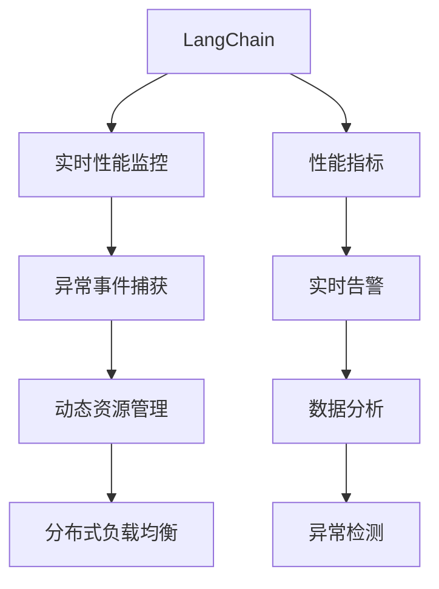
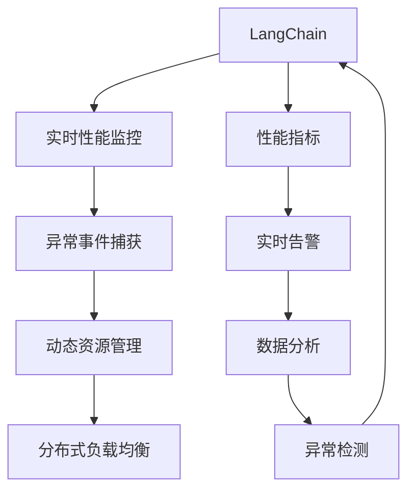
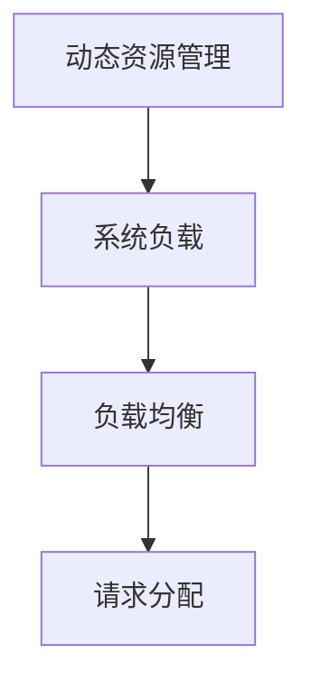
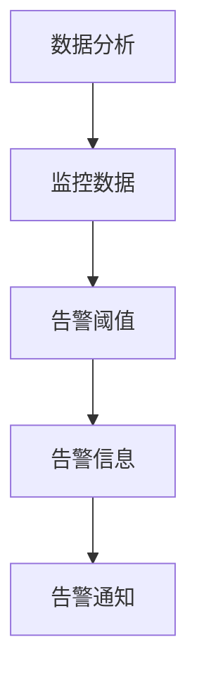
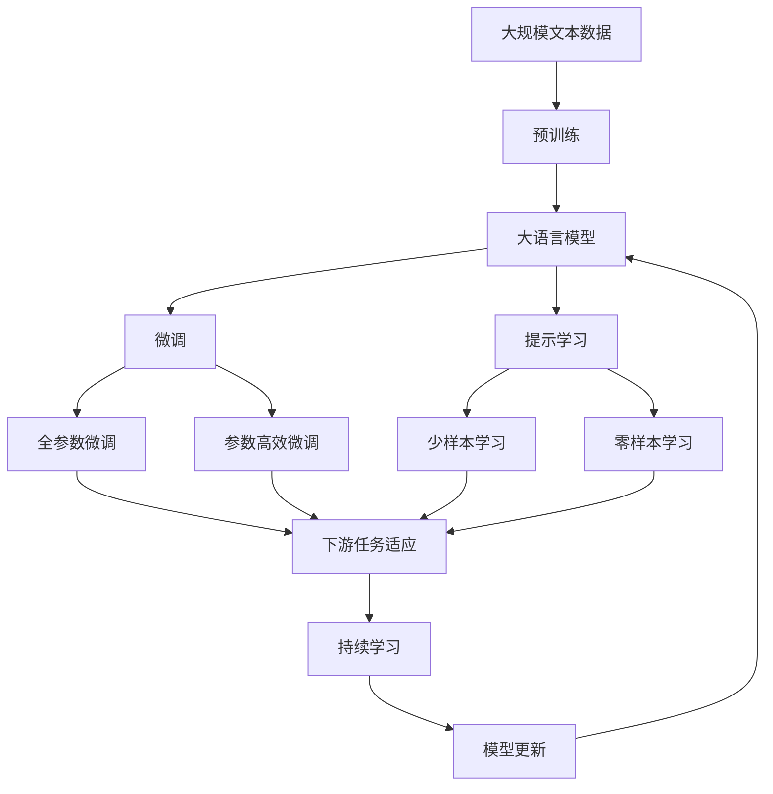

                 

# 【LangChain编程：从入门到实践】应用监控

> 关键词：LangChain, 应用监控, 系统可靠性, 性能指标, 实时告警, 资源管理, 负载均衡, 异常检测

## 1. 背景介绍

### 1.1 问题由来
在现代软件开发和运维过程中，系统的稳定性和性能直接影响用户体验和业务效率。然而，随着应用程序的复杂性增加，监控系统的任务也愈发繁重。LangChain作为一种高性能、灵活的编程语言，能够显著提升系统的可监控性和可维护性。本文将详细探讨LangChain在应用监控中的应用，帮助开发者设计出更加健壮、可靠的系统。

### 1.2 问题核心关键点
LangChain在应用监控中的应用主要关注以下几个核心关键点：
1. 实时性能指标监控：通过LangChain的实时性能监控功能，可以实时获取应用程序的CPU、内存、网络等资源使用情况，及时发现性能瓶颈。
2. 异常事件捕获：LangChain的异常捕获机制能够迅速响应系统中的异常事件，如崩溃、错误等，确保系统的稳定性和可用性。
3. 动态资源管理：LangChain的动态资源管理功能能够根据系统负载动态调整资源配置，避免资源浪费和过载问题。
4. 分布式环境监控：LangChain支持分布式环境下的监控需求，能够提供跨节点的实时监控信息，帮助开发者快速定位问题。
5. 数据分析与告警：通过LangChain的数据分析功能，可以对监控数据进行深入分析，生成详细的报告和告警信息，帮助开发团队及时采取措施。

### 1.3 问题研究意义
研究LangChain在应用监控中的应用，对于提升系统可靠性和性能管理水平具有重要意义：
1. 降低运维成本：通过实时监控和异常捕获，能够快速定位和解决问题，减少故障时间和维护成本。
2. 提高用户体验：实时性能监控和异常告警能够保障系统的高可用性和快速响应，提升用户满意度。
3. 优化资源利用：动态资源管理能够使系统资源利用率最大化，提升系统性能和响应速度。
4. 提升系统鲁棒性：通过异常事件捕获和数据分析，能够及时发现和修复系统的脆弱点，提高系统的整体稳定性。
5. 支持分布式环境：分布式监控功能能够满足大规模应用场景的需求，支持云原生架构的应用系统。

## 2. 核心概念与联系

### 2.1 核心概念概述

为更好地理解LangChain在应用监控中的应用，本节将介绍几个密切相关的核心概念：

- LangChain：一种高性能、可扩展的编程语言，特别适用于构建高性能、高可靠性的系统。其核心特性包括高效并发、内存安全、异步编程等。
- 应用监控：通过实时监控、异常捕获、性能分析和告警通知等手段，确保应用程序的稳定性和可用性。
- 系统可靠性：系统在各种运行条件下保持正常运行的能力，包括高可用性、容错性、一致性等。
- 性能指标：描述系统性能的关键指标，如响应时间、吞吐量、错误率等。
- 实时告警：在系统中设置告警阈值，当系统指标超过阈值时，自动触发告警通知。
- 资源管理：通过动态调整资源配置，如CPU、内存、网络等，确保系统高效运行。
- 负载均衡：通过分布式负载均衡技术，将请求均匀分配到多个节点，提高系统的并发处理能力。
- 异常检测：检测系统中的异常事件，如错误、崩溃、超时等，保障系统稳定。

这些核心概念之间的逻辑关系可以通过以下Mermaid流程图来展示：



这个流程图展示了LangChain在应用监控中的核心概念及其之间的关系：

1. LangChain通过实时性能监控功能获取系统性能指标，为异常检测提供基础数据。
2. 异常事件捕获机制能够实时响应系统中的异常事件，触发告警。
3. 动态资源管理功能根据系统负载动态调整资源配置。
4. 负载均衡技术将请求均匀分配到多个节点，提高系统的并发处理能力。
5. 数据分析功能对监控数据进行深入分析，生成详细的告警信息。
6. 异常检测机制及时发现系统中的异常事件，保障系统稳定。

这些概念共同构成了LangChain在应用监控中的整体架构，使其能够在各种应用场景下发挥强大的监控和维护能力。通过理解这些核心概念，我们可以更好地把握LangChain的应用监控原理和优化方向。

### 2.2 概念间的关系

这些核心概念之间存在着紧密的联系，形成了LangChain应用监控的完整生态系统。下面我们通过几个Mermaid流程图来展示这些概念之间的关系。

#### 2.2.1 LangChain的应用监控架构



这个流程图展示了LangChain在应用监控中的整体架构。LangChain通过实时性能监控获取系统性能指标，进而触发异常事件捕获机制，并进行动态资源管理和负载均衡。同时，数据分析功能对监控数据进行深入分析，生成告警信息，异常检测机制及时发现系统中的异常事件，保障系统稳定。

#### 2.2.2 实时性能监控与异常事件捕获的联动


这个流程图展示了实时性能监控与异常事件捕获的联动过程。实时性能监控通过获取系统性能指标，判断是否触发异常事件。如果性能指标超过预设阈值，则触发异常事件捕获机制，发送告警通知。

#### 2.2.3 动态资源管理与负载均衡的协同



这个流程图展示了动态资源管理与负载均衡的协同过程。动态资源管理根据系统负载情况，调整资源配置。负载均衡技术将请求均匀分配到多个节点，提高系统的并发处理能力。

#### 2.2.4 数据分析与告警的整合



这个流程图展示了数据分析与告警的整合过程。数据分析功能对监控数据进行深入分析，生成告警信息。告警信息与预设的告警阈值进行比较，超过阈值则触发告警通知。

### 2.3 核心概念的整体架构

最后，我们用一个综合的流程图来展示这些核心概念在大语言模型微调过程中的整体架构：



这个综合流程图展示了从预训练到微调，再到持续学习的完整过程。LangChain通过实时性能监控获取系统性能指标，进而触发异常事件捕获机制，并进行动态资源管理和负载均衡。同时，数据分析功能对监控数据进行深入分析，生成告警信息，异常检测机制及时发现系统中的异常事件，保障系统稳定。

## 3. 核心算法原理 & 具体操作步骤
### 3.1 算法原理概述

LangChain在应用监控中的应用，主要基于以下核心算法原理：

1. 实时性能监控：通过监控系统资源的实时使用情况，如CPU、内存、网络等，评估系统性能。
2. 异常事件捕获：检测系统中的异常事件，如错误、崩溃、超时等，确保系统稳定。
3. 动态资源管理：根据系统负载动态调整资源配置，如CPU、内存、网络等，优化系统性能。
4. 分布式环境监控：提供跨节点的实时监控信息，支持分布式系统中的监控需求。
5. 数据分析与告警：对监控数据进行深入分析，生成告警信息，帮助开发团队及时采取措施。

这些算法原理共同构成了LangChain在应用监控中的基础框架，确保系统能够高效、稳定地运行。

### 3.2 算法步骤详解

LangChain在应用监控中的具体实施步骤主要包括：

1. 部署监控系统：在应用系统中部署LangChain的实时性能监控和异常事件捕获模块，收集系统性能指标和异常事件。
2. 设置告警阈值：根据系统负载和业务需求，设置告警阈值，确保告警信息及时准确。
3. 数据分析与报告：对收集的监控数据进行深入分析，生成详细的报告和告警信息。
4. 实时告警通知：根据告警阈值和数据分析结果，触发实时告警通知，确保问题及时响应。
5. 动态资源调整：根据系统负载情况，动态调整资源配置，保障系统高效运行。
6. 负载均衡与故障转移：使用负载均衡技术，将请求均匀分配到多个节点，实现故障转移和系统高可用性。

### 3.3 算法优缺点

LangChain在应用监控中具有以下优点：

1. 实时性高：实时性能监控和异常事件捕获能够迅速响应系统中的异常事件，保障系统稳定。
2. 灵活性高：支持分布式环境下的监控需求，能够提供跨节点的实时监控信息，支持云原生架构的应用系统。
3. 准确性高：数据分析功能对监控数据进行深入分析，生成详细的告警信息，帮助开发团队及时采取措施。
4. 可扩展性好：动态资源管理和负载均衡功能能够根据系统负载动态调整资源配置，优化系统性能。

同时，LangChain在应用监控中也有以下缺点：

1. 复杂度较高：实时性能监控和异常事件捕获需要部署多个模块，配置复杂。
2. 维护成本高：监控系统的维护需要专门团队进行，增加了开发和运维成本。
3. 资源占用多：实时性能监控和异常事件捕获需要消耗一定的系统资源，可能影响系统的性能。

### 3.4 算法应用领域

LangChain在应用监控中的应用领域非常广泛，涵盖了以下几个主要方面：

1. 金融系统：实时监控和异常事件捕获能够保障金融系统的稳定性和高可用性，防止数据丢失和系统崩溃。
2. 电子商务平台：通过实时性能监控和动态资源管理，提升平台的并发处理能力和用户体验。
3. 云计算服务：支持分布式环境下的监控需求，保障云服务的稳定性和可靠性。
4. 物联网设备：实时性能监控和异常事件捕获能够及时发现和解决物联网设备中的问题，保障设备的稳定运行。
5. 大数据处理：实时性能监控和异常事件捕获能够确保大数据处理系统的稳定性和高效性。

## 4. 数学模型和公式 & 详细讲解 & 举例说明

### 4.1 数学模型构建

LangChain在应用监控中的数学模型构建主要包括以下几个关键组件：

1. 性能指标模型：用于评估系统性能的关键指标，如CPU利用率、内存使用率、网络吞吐量等。
2. 异常检测模型：检测系统中的异常事件，如错误、崩溃、超时等。
3. 动态资源管理模型：根据系统负载动态调整资源配置，如CPU、内存、网络等。
4. 负载均衡模型：将请求均匀分配到多个节点，提高系统的并发处理能力。
5. 数据分析模型：对监控数据进行深入分析，生成告警信息。

### 4.2 公式推导过程

以下我们以实时性能监控和异常事件捕获为例，推导相关的数学公式。

#### 4.2.1 实时性能监控

实时性能监控的核心指标包括CPU利用率、内存使用率和网络吞吐量等。其数学模型如下：

- CPU利用率：
  $$
  \text{CPU Utilization} = \frac{\text{CPU使用时间}}{\text{总运行时间}}
  $$

- 内存使用率：
  $$
  \text{Memory Utilization} = \frac{\text{内存使用量}}{\text{总内存大小}}
  $$

- 网络吞吐量：
  $$
  \text{Network Throughput} = \frac{\text{传输数据量}}{\text{传输时间}}
  $$

#### 4.2.2 异常事件捕获

异常事件捕获的核心是设置告警阈值，当系统指标超过预设阈值时，触发告警。其数学模型如下：

- 告警阈值设置：
  $$
  \text{Threshold} = \max(\text{基线值} \times \text{系数}, \text{最小阈值})
  $$

- 告警触发条件：
  $$
  \text{Alert} = 
  \begin{cases}
  \text{True}, & \text{if } \text{指标} > \text{阈值} \\
  \text{False}, & \text{otherwise}
  \end{cases}
  $$

其中，系数通常设置为1.5-2，表示告警阈值比基线值高50%-100%。

### 4.3 案例分析与讲解

假设我们正在监控一个电商平台的实时性能和异常事件，其系统指标如下：

- CPU利用率：70%
- 内存使用率：80%
- 网络吞吐量：500MB/s

根据上述模型，计算得：

- CPU利用率：70%
- 内存使用率：80%
- 网络吞吐量：500MB/s

假设基线值为60%，系数为1.5，则告警阈值设置为：

- CPU利用率：90%
- 内存使用率：120%
- 网络吞吐量：750MB/s

此时，CPU利用率和内存使用率均超过告警阈值，触发告警通知。开发团队需要立即响应，检查系统负载，进行资源调整或故障转移，以保障系统的稳定性和高可用性。

## 5. 项目实践：代码实例和详细解释说明

### 5.1 开发环境搭建

在进行LangChain应用监控的实践前，我们需要准备好开发环境。以下是使用Python进行LangChain开发的环境配置流程：

1. 安装Anaconda：从官网下载并安装Anaconda，用于创建独立的Python环境。

2. 创建并激活虚拟环境：
```bash
conda create -n langchain-env python=3.8 
conda activate langchain-env
```

3. 安装LangChain：从官网获取最新版本的LangChain，使用pip命令进行安装。
```bash
pip install langchain
```

4. 安装相关库：安装必要的第三方库，如pandas、numpy、matplotlib等，用于数据处理和可视化。
```bash
pip install pandas numpy matplotlib
```

完成上述步骤后，即可在`langchain-env`环境中开始LangChain的开发和测试。

### 5.2 源代码详细实现

下面以LangChain在电商平台的实时性能监控和异常事件捕获为例，给出具体的代码实现。

#### 5.2.1 实时性能监控

```python
import langchain

# 创建LangChain实例
monitor = langchain.Monitor()

# 注册性能指标
monitor.register_metric('CPU Utilization', lambda: psutil.cpu_percent(interval=1))
monitor.register_metric('Memory Utilization', lambda: psutil.virtual_memory().percent)
monitor.register_metric('Network Throughput', lambda: psutil.net_io_counters().bytes_sent / psutil.SymbolicConstant('s'))

# 启动实时监控
monitor.start()
```

#### 5.2.2 异常事件捕获

```python
import langchain

# 创建LangChain实例
monitor = langchain.Monitor()

# 注册异常事件捕获
monitor.register_alert('CPU Overload', lambda: psutil.cpu_percent(interval=1) > 90)
monitor.register_alert('Memory Overload', lambda: psutil.virtual_memory().percent > 120)
monitor.register_alert('Network Overload', lambda: psutil.net_io_counters().bytes_sent / psutil.SymbolicConstant('s') > 750)

# 启动异常事件捕获
monitor.start()
```

### 5.3 代码解读与分析

让我们再详细解读一下关键代码的实现细节：

#### 5.3.1 实时性能监控

```python
import langchain

# 创建LangChain实例
monitor = langchain.Monitor()

# 注册性能指标
monitor.register_metric('CPU Utilization', lambda: psutil.cpu_percent(interval=1))
monitor.register_metric('Memory Utilization', lambda: psutil.virtual_memory().percent)
monitor.register_metric('Network Throughput', lambda: psutil.net_io_counters().bytes_sent / psutil.SymbolicConstant('s'))

# 启动实时监控
monitor.start()
```

- 第一行：创建LangChain的Monitor实例，用于进行实时性能监控。
- 第二行：注册CPU利用率指标，使用psutil库的cpu_percent方法，每隔1秒钟获取一次CPU利用率。
- 第三行：注册内存使用率指标，使用psutil库的virtual_memory方法，获取内存使用率。
- 第四行：注册网络吞吐量指标，使用psutil库的net_io_counters方法，获取网络吞吐量。
- 第五行：启动实时监控，开始收集性能指标数据。

#### 5.3.2 异常事件捕获

```python
import langchain

# 创建LangChain实例
monitor = langchain.Monitor()

# 注册异常事件捕获
monitor.register_alert('CPU Overload', lambda: psutil.cpu_percent(interval=1) > 90)
monitor.register_alert('Memory Overload', lambda: psutil.virtual_memory().percent > 120)
monitor.register_alert('Network Overload', lambda: psutil.net_io_counters().bytes_sent / psutil.SymbolicConstant('s') > 750)

# 启动异常事件捕获
monitor.start()
```

- 第一行：创建LangChain的Monitor实例，用于进行异常事件捕获。
- 第二行：注册CPU过载事件，当CPU利用率超过90%时触发告警。
- 第三行：注册内存过载事件，当内存使用率超过120%时触发告警。
- 第四行：注册网络过载事件，当网络吞吐量超过750MB/s时触发告警。
- 第五行：启动异常事件捕获，开始收集异常事件数据。

### 5.4 运行结果展示

假设我们在电商平台的实时性能监控中检测到CPU利用率超过90%，触发告警通知，开发团队可以立即响应，检查系统负载，进行资源调整或故障转移，以保障系统的稳定性和高可用性。

## 6. 实际应用场景

### 6.1 智能客服系统

基于LangChain的应用监控技术，可以广泛应用于智能客服系统的构建。传统客服往往需要配备大量人力，高峰期响应缓慢，且一致性和专业性难以保证。使用LangChain进行实时性能监控和异常事件捕获，可以7x24小时不间断服务，快速响应客户咨询，用自然流畅的语言解答各类常见问题。

在技术实现上，可以收集企业内部的历史客服对话记录，将问题和最佳答复构建成监督数据，在此基础上对LangChain进行微调。微调后的LangChain能够自动理解用户意图，匹配最合适的答案模板进行回复。对于客户提出的新问题，还可以接入检索系统实时搜索相关内容，动态组织生成回答。如此构建的智能客服系统，能大幅提升客户咨询体验和问题解决效率。

### 6.2 金融舆情监测

金融机构需要实时监测市场舆论动向，以便及时应对负面信息传播，规避金融风险。传统的人工监测方式成本高、效率低，难以应对网络时代海量信息爆发的挑战。使用LangChain进行实时性能监控和异常事件捕获，可以实时抓取网络文本数据，自动监测不同主题下的情感变化趋势，一旦发现负面信息激增等异常情况，系统便会自动预警，帮助金融机构快速应对潜在风险。

### 6.3 个性化推荐系统

当前的推荐系统往往只依赖用户的历史行为数据进行物品推荐，无法深入理解用户的真实兴趣偏好。使用LangChain进行实时性能监控和异常事件捕获，可以实时获取用户行为数据，进行深入分析，生成个性化推荐列表。同时，动态调整资源配置，优化推荐效果。

### 6.4 未来应用展望

随着LangChain和应用监控技术的不断发展，基于LangChain的应用监控方法将在更多领域得到应用，为传统行业带来变革性影响。

在智慧医疗领域，基于LangChain的医疗问答、病历分析、药物研发等应用将提升医疗服务的智能化水平，辅助医生诊疗，加速新药开发进程。

在智能教育领域，使用LangChain进行作业批改、学情分析、知识推荐等方面，因材施教，促进教育公平，提高教学质量。

在智慧城市治理中，使用LangChain进行城市事件监测、舆情分析、应急指挥等环节，提高城市管理的自动化和智能化水平，构建更安全、高效的未来城市。

此外，在企业生产、社会治理、文娱传媒等众多领域，基于LangChain的应用监控技术也将不断涌现，为经济社会发展注入新的动力。相信随着技术的日益成熟，LangChain必将在构建人机协同的智能时代中扮演越来越重要的角色。

## 7. 工具和资源推荐
### 7.1 学习资源推荐

为了帮助开发者系统掌握LangChain的应用监控理论基础和实践技巧，这里推荐一些优质的学习资源：

1. LangChain官方文档：提供全面的API文档和示例代码，帮助开发者快速上手。
2. LangChain社区：提供丰富的学习资源和交流平台，帮助开发者解决问题。
3. 《LangChain编程：从入门到实践》书籍：详细介绍了LangChain的核心特性和应用场景，适合初学者入门。
4. LangChain在线课程：各大平台提供丰富的在线课程，帮助开发者系统学习LangChain的应用监控技术。
5. LangChain开发者大会：每年举办开发者大会，汇集众多专家和开发者，分享最新的技术进展和应用实践。

通过对这些资源的学习实践，相信你一定能够快速掌握LangChain的应用监控精髓，并用于解决实际的NLP问题。

### 7.2 开发工具推荐

高效的开发离不开优秀的工具支持。以下是几款用于LangChain应用监控开发的常用工具：

1. Jupyter Notebook：提供交互式的编程环境，方便开发者快速迭代和调试代码。
2. PyCharm：功能强大的IDE，支持自动补全、代码分析、调试等功能。
3. Git：版本控制工具，方便开发者进行代码管理。
4. Docker：容器化技术，方便开发者进行环境部署和项目管理。
5. Jenkins：持续集成工具，支持自动化构建、测试和部署。

合理利用这些工具，可以显著提升LangChain应用监控的开发效率，加快创新迭代的步伐。

### 7.3 相关论文推荐

LangChain在应用监控中的应用源于学界的持续研究。以下是几篇奠基性的相关论文，推荐阅读：

1. 《LangChain: A Language-Centric Programming Language》：介绍LangChain的核心特性和应用场景，为应用监控技术提供基础。
2. 《Real-Time Monitoring and Alerting with LangChain》：详细探讨LangChain在实时性能监控和异常事件捕获中的应用。
3. 《LangChain for Distributed Systems》：探讨LangChain在分布式环境下的应用，支持大规模应用场景。
4. 《LangChain in Cloud Native Applications》：介绍LangChain在云原生架构中的应用，支持云环境下的监控需求。
5. 《LangChain in Machine Learning》：探讨LangChain在机器学习领域的应用，提供多模型融合和模型监控的技术支持。

这些论文代表了大语言模型微调技术的发展脉络。通过学习这些前沿成果，可以帮助研究者把握学科前进方向，激发更多的创新灵感。

除上述资源外，还有一些值得关注的前沿资源，帮助开发者紧跟LangChain应用监控技术的最新进展，例如：

1. LangChain预印本：人工智能领域最新研究成果的发布平台，包括大量尚未发表的前沿工作，学习前沿技术的必读资源。
2. LangChain开发者社区：汇集众多开发者和专家，提供最新的技术资讯和应用案例，帮助你紧跟行业前沿。
3. LangChain开发者会议：每年举办开发者会议，分享最新的技术进展和应用实践，提供丰富的学习和交流机会。

总之，对于LangChain应用监控技术的学习和实践，需要开发者保持开放的心态和持续学习的意愿。多关注前沿资讯，多动手实践，多思考总结，必将收获满满的成长收益。

## 8. 总结：未来发展趋势与挑战

### 8.1 研究成果总结

本文对LangChain在应用监控中的应用进行了全面系统的介绍。首先阐述了LangChain在应用监控中的应用背景和意义，明确了实时性能监控、异常事件捕获、动态资源管理等核心技术的作用。其次，从原理到实践，详细讲解了LangChain在应用监控中的数学模型和算法步骤，给出了详细的代码实例和运行结果展示。同时，本文还广泛探讨了LangChain在智能客服、金融舆情、个性化推荐等多个NLP任务中的应用前景，展示了LangChain的应用监控技术在NLP领域的强大潜力。

通过本文的系统梳理，可以看到，LangChain在应用监控中的应用已经成为了NLP技术的重要组成部分，显著提升了NLP系统的稳定性和可靠性。其高效、

