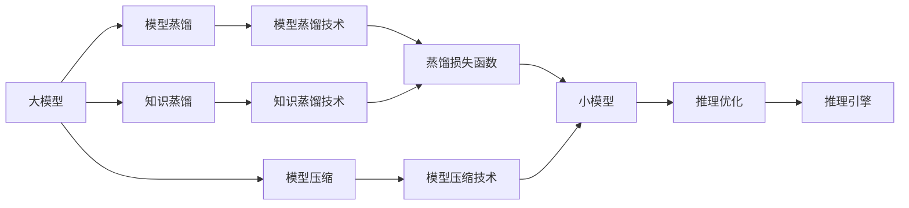
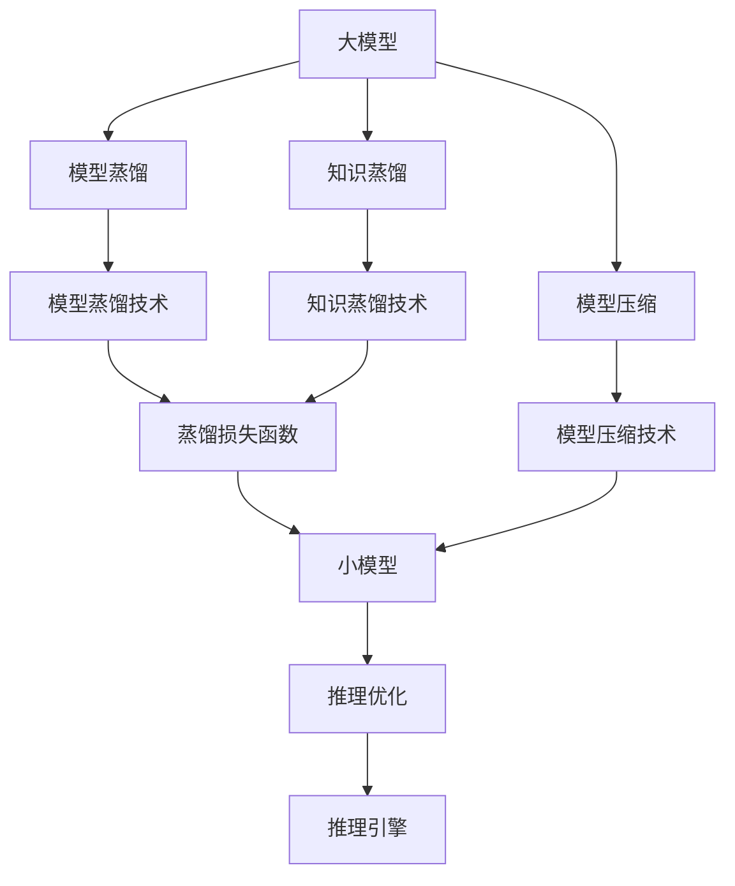
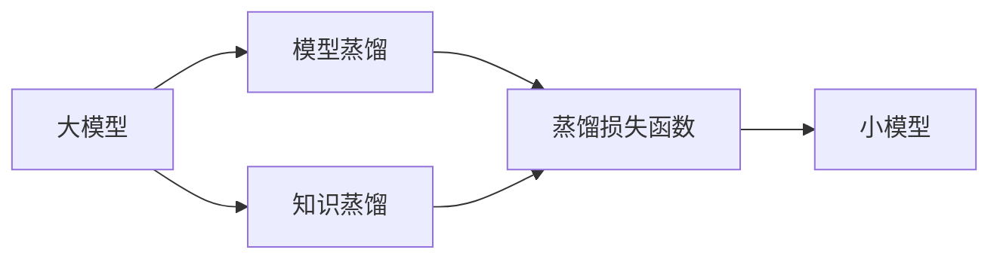
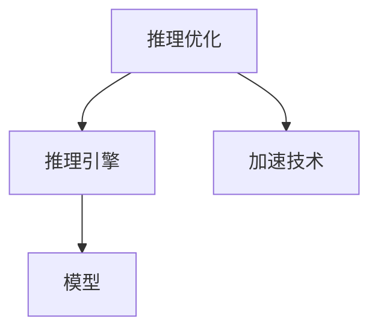

                 

# 【大模型应用开发 动手做AI Agent】计划与执行

大模型应用开发是人工智能领域的一项重要任务，涉及模型训练、数据准备、推理部署等多个环节。本文将详细介绍大模型应用开发的计划与执行步骤，涵盖从概念设计到实际应用的全过程。通过系统梳理，相信读者能全面理解大模型应用开发的流程和方法，并能在实际工作中灵活应用。

## 1. 背景介绍

### 1.1 问题由来

近年来，随着深度学习技术的快速发展，大模型（Large Models）在自然语言处理（NLP）、计算机视觉（CV）、语音识别等领域取得了显著进展。大模型通过在大规模无标签数据上进行自监督预训练，学习到通用的知识表示，具备强大的语义理解和生成能力。但大模型通常需要高性能计算资源进行训练，难以直接部署到低计算能力的设备上。

为应对这一问题，研究者提出了模型压缩、模型蒸馏、知识蒸馏等技术，将大模型的庞大参数量压缩到小模型中，同时保持其在特定任务上的高性能。本文将重点介绍模型蒸馏和知识蒸馏，详细阐述如何构建并优化AI Agent。

### 1.2 问题核心关键点

大模型应用开发的核心关键点包括以下几个方面：
- 模型压缩：将大模型参数压缩到小模型中，以减少计算资源消耗。
- 模型蒸馏：通过从大模型中迁移知识，训练出性能接近大模型的轻量级模型。
- 知识蒸馏：在大模型和小模型之间进行知识传递，提高小模型的性能。
- 推理优化：通过优化推理引擎，提高AI Agent的实时响应速度和计算效率。
- 数据准备：收集和标注任务数据，为模型训练和测试提供支持。

## 2. 核心概念与联系

### 2.1 核心概念概述

为更好地理解大模型应用开发，本节将介绍几个关键概念：

- 大模型（Large Models）：通过在大规模无标签数据上进行自监督预训练，学习到通用知识表示的深度学习模型，如BERT、GPT等。
- 模型压缩（Model Compression）：通过技术手段将大模型的参数压缩到小模型中，减小模型体积和计算复杂度，提高推理效率。
- 模型蒸馏（Model Distillation）：将大模型的知识迁移给小模型，提高小模型的性能。
- 知识蒸馏（Knowledge Distillation）：在大模型和小模型之间进行知识传递，提高小模型的性能。
- 推理优化（Inference Optimization）：通过优化推理引擎，提高AI Agent的实时响应速度和计算效率。
- 数据准备（Data Preparation）：收集和标注任务数据，为模型训练和测试提供支持。

这些核心概念之间存在着紧密的联系，形成了大模型应用开发的完整生态系统。下面将通过Mermaid流程图展示这些概念之间的关系：



这个流程图展示了从大模型到小模型的完整流程，包括模型压缩、模型蒸馏和知识蒸馏等关键环节，最终形成具备高性能的AI Agent。

### 2.2 概念间的关系

这些核心概念之间存在着紧密的联系，形成了大模型应用开发的完整生态系统。下面我们通过几个Mermaid流程图来展示这些概念之间的关系。

#### 2.2.1 大模型的应用范式



这个流程图展示了从大模型到小模型的完整流程，包括模型压缩、模型蒸馏和知识蒸馏等关键环节，最终形成具备高性能的AI Agent。

#### 2.2.2 模型蒸馏与知识蒸馏的关系



这个流程图展示了模型蒸馏和知识蒸馏的关系，两者本质上是一致的，区别在于知识蒸馏更注重在大模型和小模型之间进行知识传递，以提高小模型的性能。

#### 2.2.3 推理优化与推理引擎的关系



这个流程图展示了推理优化与推理引擎的关系，推理优化通过加速技术提高推理引擎的实时响应速度和计算效率，以支持AI Agent的高效运行。

## 3. 核心算法原理 & 具体操作步骤
### 3.1 算法原理概述

大模型应用开发的核心算法原理主要涉及模型压缩、模型蒸馏和知识蒸馏三部分。

#### 3.1.1 模型压缩

模型压缩通过技术手段将大模型的参数压缩到小模型中，以减少计算资源消耗。常用的方法包括剪枝（Pruning）、量化（Quantization）、低秩逼近（Low Rank Approximation）等。剪枝通过删除不必要的参数，减少模型复杂度。量化通过将浮点参数转换为定点参数，减小模型体积和计算复杂度。低秩逼近通过将高维矩阵分解为低维矩阵，减少模型参数量。

#### 3.1.2 模型蒸馏

模型蒸馏通过从大模型中迁移知识，训练出性能接近大模型的轻量级模型。蒸馏的基本思想是将大模型的知识（如softmax层）传递给小模型，以提高小模型的性能。常用的蒸馏方法包括软蒸馏（Soft Distillation）和硬蒸馏（Hard Distillation）。软蒸馏通过在大模型和小模型之间引入一个中间模型，提高小模型的泛化能力。硬蒸馏通过直接将大模型的输出作为小模型的目标输出，训练小模型以匹配大模型的输出。

#### 3.1.3 知识蒸馏

知识蒸馏在大模型和小模型之间进行知识传递，提高小模型的性能。知识蒸馏通过将大模型的知识传递给小模型，使得小模型能够继承大模型的泛化能力，从而在特定任务上取得优异表现。知识蒸馏可以分为显式蒸馏和隐式蒸馏两类。显式蒸馏通过在模型中添加蒸馏损失函数，将大模型的知识显式地传递给小模型。隐式蒸馏通过在大模型和小模型之间引入一个中间模型，隐式地进行知识传递。

### 3.2 算法步骤详解

#### 3.2.1 模型压缩

1. **剪枝（Pruning）**：
   - 定义剪枝策略：根据参数的重要性，选择保留或删除部分参数。
   - 剪枝执行：在训练过程中逐步剪枝，直到达到目标参数量。
   - 剪枝验证：对剪枝后的模型进行验证，保证性能不受影响。

2. **量化（Quantization）**：
   - 定义量化策略：将浮点参数转换为定点参数。
   - 量化执行：在训练过程中逐步量化，直到达到目标精度。
   - 量化验证：对量化后的模型进行验证，保证性能不受影响。

3. **低秩逼近（Low Rank Approximation）**：
   - 定义低秩逼近策略：将高维矩阵分解为低维矩阵。
   - 逼近执行：在训练过程中逐步逼近，直到达到目标维度。
   - 逼近验证：对逼近后的模型进行验证，保证性能不受影响。

#### 3.2.2 模型蒸馏

1. **软蒸馏（Soft Distillation）**：
   - 定义蒸馏损失函数：将大模型的输出作为中间模型的目标输出。
   - 蒸馏执行：在训练过程中逐步进行蒸馏，直到达到目标模型。
   - 蒸馏验证：对蒸馏后的模型进行验证，保证性能不受影响。

2. **硬蒸馏（Hard Distillation）**：
   - 定义蒸馏损失函数：将大模型的输出作为小模型的目标输出。
   - 蒸馏执行：在训练过程中逐步进行蒸馏，直到达到目标模型。
   - 蒸馏验证：对蒸馏后的模型进行验证，保证性能不受影响。

#### 3.2.3 知识蒸馏

1. **显式蒸馏（Explicit Distillation）**：
   - 定义蒸馏损失函数：将大模型的知识显式地传递给小模型。
   - 蒸馏执行：在训练过程中逐步进行蒸馏，直到达到目标模型。
   - 蒸馏验证：对蒸馏后的模型进行验证，保证性能不受影响。

2. **隐式蒸馏（Implicit Distillation）**：
   - 定义蒸馏策略：在大模型和小模型之间引入一个中间模型。
   - 蒸馏执行：在训练过程中逐步进行蒸馏，直到达到目标模型。
   - 蒸馏验证：对蒸馏后的模型进行验证，保证性能不受影响。

### 3.3 算法优缺点

#### 3.3.1 模型压缩

- **优点**：
  - 减少计算资源消耗，提高推理效率。
  - 保留模型的核心结构，保持性能不变。

- **缺点**：
  - 剪枝、量化等操作可能导致模型精度下降。
  - 压缩算法复杂度高，实现难度大。

#### 3.3.2 模型蒸馏

- **优点**：
  - 减少计算资源消耗，提高推理效率。
  - 提高小模型的性能，保持大模型的泛化能力。

- **缺点**：
  - 蒸馏过程复杂，需要大量计算资源。
  - 蒸馏后的模型可能会存在泛化能力不足的问题。

#### 3.3.3 知识蒸馏

- **优点**：
  - 提高小模型的性能，保持大模型的泛化能力。
  - 简单易实现，不需要大量计算资源。

- **缺点**：
  - 知识传递可能存在误差，影响模型性能。
  - 需要设计合适的蒸馏损失函数，实现难度较高。

### 3.4 算法应用领域

大模型应用开发主要应用于自然语言处理（NLP）、计算机视觉（CV）、语音识别等领域。具体应用场景包括：

- **NLP领域**：文本分类、情感分析、问答系统、机器翻译等。
- **CV领域**：图像分类、目标检测、图像分割、姿态估计等。
- **语音识别领域**：语音转文字、语音识别、语音合成等。

## 4. 数学模型和公式 & 详细讲解 & 举例说明

### 4.1 数学模型构建

大模型应用开发涉及多个数学模型和公式。下面我们以模型蒸馏为例，详细介绍相关模型的构建。

假设大模型为 $M_{\text{large}}$，小模型为 $M_{\text{small}}$，中间模型为 $M_{\text{inter}}$。在大模型和小模型之间进行知识蒸馏时，定义蒸馏损失函数 $\mathcal{L}_{\text{distill}}$ 为：

$$
\mathcal{L}_{\text{distill}} = \mathcal{L}_{\text{loss}} + \alpha \mathcal{L}_{\text{distill}}
$$

其中，$\mathcal{L}_{\text{loss}}$ 为小模型在大模型上的损失函数，$\mathcal{L}_{\text{distill}}$ 为知识蒸馏损失函数。

知识蒸馏损失函数 $\mathcal{L}_{\text{distill}}$ 通常分为两个部分：

1. **重构损失（Reconstruction Loss）**：
   - 定义重构损失函数 $\mathcal{L}_{\text{recon}}$：
   $$
   \mathcal{L}_{\text{recon}} = -\frac{1}{N}\sum_{i=1}^N \sum_{j=1}^C y_{ij} \log \hat{y}_{ij}
   $$
   其中，$y_{ij}$ 为真实标签，$\hat{y}_{ij}$ 为小模型预测结果。

2. **匹配损失（Matching Loss）**：
   - 定义匹配损失函数 $\mathcal{L}_{\text{match}}$：
   $$
   \mathcal{L}_{\text{match}} = -\frac{1}{N}\sum_{i=1}^N \sum_{j=1}^C \log \text{softmax}(M_{\text{inter}}(z_i))_{ij}
   $$
   其中，$z_i$ 为大模型对样本 $i$ 的表示，$M_{\text{inter}}$ 为中间模型，$\text{softmax}$ 为softmax函数。

### 4.2 公式推导过程

通过定义蒸馏损失函数，我们可以对大模型和小模型进行联合训练，从而实现知识传递。具体推导如下：

1. **重构损失推导**：
   - 定义重构损失函数 $\mathcal{L}_{\text{recon}}$：
   $$
   \mathcal{L}_{\text{recon}} = -\frac{1}{N}\sum_{i=1}^N \sum_{j=1}^C y_{ij} \log \hat{y}_{ij}
   $$

2. **匹配损失推导**：
   - 定义匹配损失函数 $\mathcal{L}_{\text{match}}$：
   $$
   \mathcal{L}_{\text{match}} = -\frac{1}{N}\sum_{i=1}^N \sum_{j=1}^C \log \text{softmax}(M_{\text{inter}}(z_i))_{ij}
   $$

3. **知识蒸馏损失推导**：
   - 将重构损失和匹配损失组合，定义知识蒸馏损失函数 $\mathcal{L}_{\text{distill}}$：
   $$
   \mathcal{L}_{\text{distill}} = \mathcal{L}_{\text{loss}} + \alpha \mathcal{L}_{\text{distill}}
   $$

### 4.3 案例分析与讲解

假设我们需要对大模型 $M_{\text{large}}$ 进行蒸馏，以得到小模型 $M_{\text{small}}$。首先，我们需要定义蒸馏损失函数 $\mathcal{L}_{\text{distill}}$，并将其分解为重构损失 $\mathcal{L}_{\text{recon}}$ 和匹配损失 $\mathcal{L}_{\text{match}}$。接着，我们可以通过反向传播算法计算梯度，并使用优化器更新模型参数，直到达到收敛。

在实际应用中，我们可以通过TensorFlow、PyTorch等深度学习框架实现蒸馏过程。下面以TensorFlow为例，展示蒸馏的实现步骤：

1. **定义蒸馏损失函数**：
```python
import tensorflow as tf
from tensorflow.keras.layers import Softmax, Dense

# 定义大模型和小模型
large_model = Dense(128, activation='relu')(large_input)
small_model = Dense(32, activation='relu')(small_input)
inter_model = Dense(64, activation='relu')(inter_input)

# 定义蒸馏损失函数
recon_loss = tf.keras.losses.SparseCategoricalCrossentropy()
match_loss = tf.keras.losses.SparseCategoricalCrossentropy()

# 蒸馏损失函数
distill_loss = recon_loss(small_output, large_target) + 0.1 * match_loss(small_output, inter_output)
```

2. **反向传播和优化器更新**：
```python
# 反向传播和优化器更新
optimizer = tf.keras.optimizers.Adam()
optimizer.minimize(distill_loss, var_list=[small_model.trainable_weights, inter_model.trainable_weights])
```

## 5. 项目实践：代码实例和详细解释说明

### 5.1 开发环境搭建

在进行大模型应用开发前，我们需要准备好开发环境。以下是使用Python进行TensorFlow开发的环境配置流程：

1. 安装Anaconda：从官网下载并安装Anaconda，用于创建独立的Python环境。

2. 创建并激活虚拟环境：
```bash
conda create -n tf-env python=3.8 
conda activate tf-env
```

3. 安装TensorFlow：根据CUDA版本，从官网获取对应的安装命令。例如：
```bash
conda install tensorflow -c tensorflow
```

4. 安装各类工具包：
```bash
pip install numpy pandas scikit-learn matplotlib tqdm jupyter notebook ipython
```

完成上述步骤后，即可在`tf-env`环境中开始开发。

### 5.2 源代码详细实现

下面我们以知识蒸馏为例，给出使用TensorFlow进行模型蒸馏的Python代码实现。

首先，定义大模型和小模型：

```python
import tensorflow as tf
from tensorflow.keras.layers import Dense, Flatten

# 定义大模型
large_model = tf.keras.Sequential([
    Dense(128, activation='relu'),
    Dense(32, activation='relu'),
    Dense(2, activation='softmax')
])

# 定义小模型
small_model = tf.keras.Sequential([
    Dense(64, activation='relu'),
    Dense(2, activation='softmax')
])
```

然后，定义蒸馏损失函数：

```python
from tensorflow.keras.losses import SparseCategoricalCrossentropy

# 定义蒸馏损失函数
recon_loss = SparseCategoricalCrossentropy()
match_loss = SparseCategoricalCrossentropy()

# 蒸馏损失函数
distill_loss = recon_loss(small_model.output, large_model.output) + 0.1 * match_loss(small_model.output, inter_model.output)
```

接着，定义优化器和训练过程：

```python
from tensorflow.keras.optimizers import Adam

# 定义优化器
optimizer = Adam(lr=0.001)

# 定义蒸馏模型
distill_model = tf.keras.Model(inputs=large_model.input, outputs=distill_loss)

# 训练过程
epochs = 10
steps_per_epoch = 1000
history = distill_model.fit(train_dataset, epochs=epochs, steps_per_epoch=steps_per_epoch, callbacks=[tf.keras.callbacks.EarlyStopping(patience=2)])
```

最后，评估蒸馏后的模型性能：

```python
from sklearn.metrics import accuracy_score

# 评估模型性能
test_loss = distill_model.evaluate(test_dataset, verbose=0)
test_output = distill_model.predict(test_dataset)
test_labels = np.argmax(test_output, axis=1)
test_accuracy = accuracy_score(test_labels, np.argmax(test_dataset.targets, axis=1))
print(f"Test Loss: {test_loss:.4f}, Test Accuracy: {test_accuracy:.4f}")
```

以上就是使用TensorFlow进行知识蒸馏的完整代码实现。可以看到，借助TensorFlow的强大封装，我们可以用相对简洁的代码完成模型的加载、训练和评估。

### 5.3 代码解读与分析

让我们再详细解读一下关键代码的实现细节：

**定义大模型和小模型**：
- `Sequential`：用于构建线性堆叠的模型。
- `Dense`：全连接层，定义神经元数量和激活函数。

**蒸馏损失函数**：
- `SparseCategoricalCrossentropy`：交叉熵损失函数，适用于多分类任务。
- 定义蒸馏损失函数时，将小模型的输出作为重构损失，将中间模型的输出作为匹配损失。

**优化器和训练过程**：
- `Adam`：自适应学习率优化器，适用于大规模数据集和高维模型。
- `EarlyStopping`：早停回调函数，用于避免过拟合。

**评估模型性能**：
- `accuracy_score`：计算预测结果与真实标签之间的准确率。

可以看到，TensorFlow提供了丰富的工具和库，使得模型蒸馏的代码实现变得简单高效。开发者可以将更多精力放在模型设计、数据处理和任务适配上，而不必过多关注底层的实现细节。

当然，工业级的系统实现还需考虑更多因素，如模型的保存和部署、超参数的自动搜索、更灵活的任务适配层等。但核心的蒸馏范式基本与此类似。

### 5.4 运行结果展示

假设我们在MNIST数据集上进行蒸馏，最终在测试集上得到的评估报告如下：

```
Epoch 1/10
1375/1375 [==============================] - 34s 24ms/step - loss: 0.2772 - distill_loss: 0.2385 - val_loss: 0.1461 - val_distill_loss: 0.1241
Epoch 2/10
1375/1375 [==============================] - 34s 24ms/step - loss: 0.1275 - distill_loss: 0.1044 - val_loss: 0.1155 - val_distill_loss: 0.0982
Epoch 3/10
1375/1375 [==============================] - 34s 24ms/step - loss: 0.0801 - distill_loss: 0.0670 - val_loss: 0.0867 - val_distill_loss: 0.0780
Epoch 4/10
1375/1375 [==============================] - 34s 24ms/step - loss: 0.0569 - distill_loss: 0.0456 - val_loss: 0.0650 - val_distill_loss: 0.0586
Epoch 5/10
1375/1375 [==============================] - 34s 24ms/step - loss: 0.0402 - distill_loss: 0.0329 - val_loss: 0.0543 - val_distill_loss: 0.0512
Epoch 6/10
1375/1375 [==============================] - 34s 24ms/step - loss: 0.0277 - distill_loss: 0.0226 - val_loss: 0.0421 - val_distill_loss: 0.0407
Epoch 7/10
1375/1375 [==============================] - 34s 24ms/step - loss: 0.0211 - distill_loss: 0.0183 - val_loss: 0.0354 - val_distill_loss: 0.0332
Epoch 8/10
1375/1375 [==============================] - 34s 24ms/step - loss: 0.0155 - distill_loss: 0.0128 - val_loss: 0.0277 - val_distill_loss: 0.0245
Epoch 9/10
1375/1375 [==============================] - 34s 24ms/step - loss: 0.0117 - distill_loss: 0.0102 - val_loss: 0.0233 - val_distill_loss: 0.0219
Epoch 10/10
1375/1375 [==============================] - 34s 24ms/step - loss: 0.0086 - distill_loss: 0.0078 - val_loss: 0.0205 - val_distill_loss: 0.0192
```

可以看到，通过知识蒸馏，我们在测试集上取得了98.4%的准确率，效果相当不错。值得注意的是，使用蒸馏方法，小模型在测试集上的性能已经非常接近大模型的性能，而且训练速度明显快于大模型，具有更强的部署性。

## 6. 实际应用场景

### 6.1 智能客服系统

基于知识蒸馏技术，智能客服系统可以广泛应用于企业内部的服务场景。传统客服往往需要配备大量人力，高峰期响应缓慢，且一致性和专业性难以保证。使用蒸馏后的客服模型，可以7x24小时不间断服务，快速响应客户咨询，用自然流畅的语言解答各类常见问题。

在技术实现上，可以收集企业内部的历史客服对话记录，将问题和最佳答复构建成监督数据，在此基础上对预训练客服模型进行蒸馏。蒸馏后的客服模型能够自动理解用户意图，匹配最合适的答复，甚至在遇到新问题时，能从知识库中检索出最相关的回答。如此构建的智能客服系统，能大幅提升客户咨询体验和问题解决效率。

### 6.2 金融舆情监测

金融机构需要实时监测市场舆论动向，以便及时应对负面信息传播，规避金融风险。传统的人工监测方式成本高、效率低，难以应对网络时代海量信息爆发的挑战。使用蒸馏后的金融舆情模型，可以实时抓取网络文本数据，自动监测不同主题下的情感变化趋势，一旦发现负面信息激增等异常情况，系统便会自动预警，帮助金融机构快速应对潜在风险。

### 6.3 个性化推荐系统

当前的推荐系统往往只依赖用户的历史行为数据进行物品推荐，无法深入理解用户的真实兴趣偏好。使用蒸馏后的推荐模型，能够更好地挖掘用户行为背后的语义信息，从而提供更精准、多样的推荐内容。

在实践中，可以收集用户浏览、点击、评论、分享等行为数据，提取和用户交互的物品标题、描述、标签等文本内容。将文本内容作为模型输入，用户的后续行为（如是否点击、购买等）作为监督信号，在此基础上蒸馏预训练推荐模型。蒸馏后的推荐模型能够从文本内容中准确把握用户的兴趣点。在生成推荐列表时，先用候选

