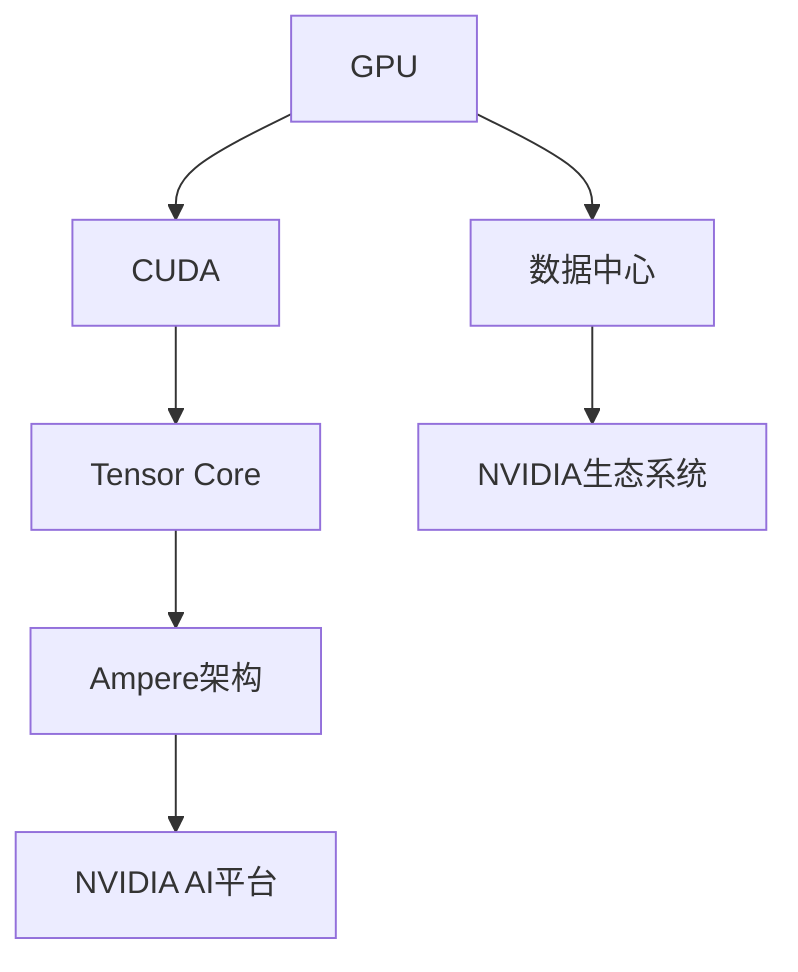
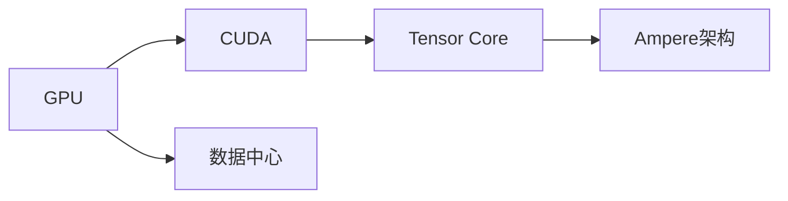
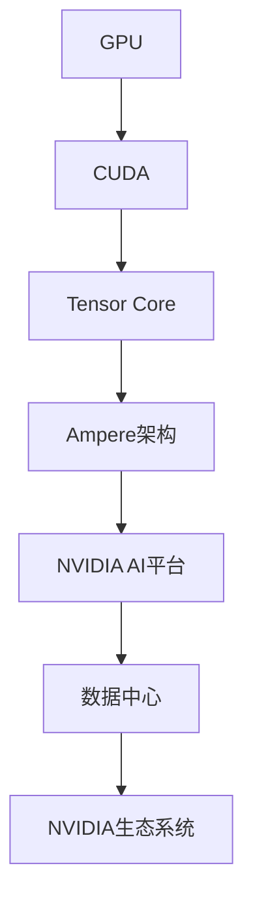
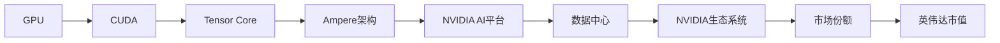
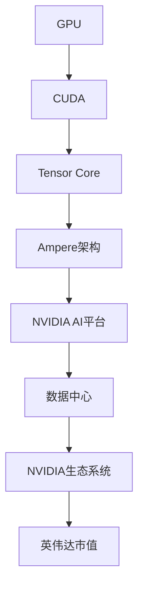

                 

# 英伟达市值登顶与AI硬件设施

## 1. 背景介绍

### 1.1 问题由来

英伟达(NVIDIA)是全球领先的人工智能(AI)硬件设施提供商，近年来凭借其GPU技术和深度学习优化加速能力，逐渐在市值和市场份额上超越传统计算机硬件巨头，成为全球顶尖科技公司。英伟达的成功，不仅仅是其技术的胜利，更是AI硬件设施逐渐成为科技创新的核心驱动力量的明证。

### 1.2 问题核心关键点

英伟达市值登顶的背后，是其在全球AI硬件设施市场的主导地位。其成功主要归因于以下几个方面：
- **GPU技术**：英伟达的CUDA平台和GeForce GPU系列产品，为AI训练和推理提供了高效的计算平台。
- **AI优化**：通过自研的NVIDIA Tensor Cores和NVIDIA Ampere架构，大幅提升了GPU的AI计算能力。
- **生态系统**：构建了一个包括软件开发工具链、硬件加速平台、应用服务等在内的庞大生态系统，满足了AI开发者和应用商的多样化需求。
- **跨领域合作**：与Google、Facebook、Amazon等顶级科技公司建立战略合作，推动AI技术的商业化应用。
- **数据中心市场**：在数据中心GPU市场占据主导地位，通过提供高性能的计算能力和定制化解决方案，满足了大数据和AI任务的需求。

### 1.3 问题研究意义

英伟达市值登顶不仅是其技术实力的体现，更是AI硬件设施在现代科技发展中的重要地位的象征。AI硬件设施是构建AI系统的基础设施，通过高性能的计算平台和优化工具，支持AI模型的训练和推理，推动AI技术的应用落地。理解英伟达市值登顶背后的硬件设施，对于推动AI技术的普及和产业化具有重要意义。

## 2. 核心概念与联系

### 2.1 核心概念概述

为更好地理解英伟达市值登顶背后的AI硬件设施，本节将介绍几个关键概念：

- **GPU**：图形处理器(GPU)是英伟达的核心产品，主要用于图形渲染和科学计算。通过引入Tensor Cores和Ampere架构，GPU已经成为AI计算的主力。

- **CUDA**：NVIDIA GPU计算平台，提供了一套完整的工具链，支持C++、Python等编程语言，用于高性能计算和AI模型的优化加速。

- **Tensor Core**：NVIDIA GPU的专有架构，通过矩阵乘法、张量乘法等计算，显著提升AI计算的效率。

- **Ampere架构**：NVIDIA最新的GPU架构，引入了更高效的计算单元和内存管理机制，支持更高的AI计算性能。

- **NVIDIA AI平台**：包括软件工具链、硬件加速平台和应用服务等，形成了完整的AI生态系统。

- **数据中心**：英伟达在数据中心GPU市场的份额，超过50%，是全球最大的数据中心GPU供应商。

这些核心概念之间的关系可以用以下Mermaid流程图来展示：



这个流程图展示了GPU、CUDA、Tensor Core、Ampere架构、NVIDIA AI平台、数据中心等核心概念之间的联系。英伟达通过这些硬件设施和生态系统，形成了强大的AI计算能力，推动了AI技术的普及和应用。

### 2.2 概念间的关系

这些核心概念之间存在着紧密的联系，形成了英伟达市值登顶的完整架构。下面我通过几个Mermaid流程图来展示这些概念之间的关系。

#### 2.2.1 英伟达的硬件设施构成



这个流程图展示了英伟达的硬件设施构成。GPU作为基础计算单元，通过CUDA平台和Tensor Cores的优化，提升了AI计算的效率和性能。

#### 2.2.2 英伟达的生态系统



这个流程图展示了英伟达的生态系统。英伟达通过GPU、CUDA、Tensor Core和Ampere架构等硬件设施，构建了完整的AI生态系统，支持AI模型的开发、训练和部署。

#### 2.2.3 英伟达在数据中心市场的主导地位



这个流程图展示了英伟达在数据中心市场的主导地位。英伟达通过高性能的GPU和AI平台，赢得了数据中心市场的主导地位，从而推动了其市值的增长。

### 2.3 核心概念的整体架构

最后，我们用一个综合的流程图来展示这些核心概念在英伟达市值登顶中的整体架构：



这个综合流程图展示了从GPU到数据中心市场的整个链条，展示了英伟达市值登顶背后的硬件设施和生态系统。通过这些硬件设施和生态系统，英伟达实现了在AI硬件设施市场的领先地位，推动了其市值的增长。

## 3. 核心算法原理 & 具体操作步骤
### 3.1 算法原理概述

英伟达市值登顶的背后，是其GPU和AI平台在AI硬件设施中的核心地位。英伟达的GPU通过CUDA平台和Tensor Cores，提供了高效的AI计算能力。这些硬件设施的核心原理如下：

**3.1.1 CUDA平台**

CUDA平台是NVIDIA GPU计算平台的中心，提供了一套完整的工具链，支持C++、Python等编程语言，用于高性能计算和AI模型的优化加速。CUDA平台的核心原理包括：

- **并行计算**：通过并行计算，利用GPU的多个计算核心，提升计算效率。
- **异步计算**：通过异步计算，使计算任务和内存访问分离，提升内存带宽利用率。
- **内存管理**：通过统一内存管理，优化内存访问模式，减少数据传输延迟。
- **优化库**：提供了一套高性能的库函数，如cuBLAS、cuDNN等，用于矩阵乘法、卷积等核心计算的优化。

**3.1.2 Tensor Cores**

Tensor Cores是NVIDIA GPU的专有架构，通过矩阵乘法、张量乘法等计算，显著提升AI计算的效率。Tensor Cores的核心原理包括：

- **矩阵乘法**：通过矩阵乘法，加速矩阵和向量之间的计算。
- **张量乘法**：通过张量乘法，加速矩阵和张量之间的计算。
- **内存优化**：通过数据压缩和内存复用，减少数据传输量。
- **优化算法**：提供了一套高性能的算法库，如cuDNN、cuFFT等，用于核心计算的优化。

**3.1.3 Ampere架构**

Ampere架构是NVIDIA最新的GPU架构，引入了更高效的计算单元和内存管理机制，支持更高的AI计算性能。Ampere架构的核心原理包括：

- **计算单元**：引入了更高效的计算单元，支持更多的并行计算任务。
- **内存管理**：引入了更高效的内存管理机制，支持更大的内存带宽。
- **优化库**：提供了一套高性能的库函数，如NVIDIA Magma、cuPTX等，用于核心计算的优化。

### 3.2 算法步骤详解

英伟达市值登顶的背后，是其GPU和AI平台在AI硬件设施中的核心地位。英伟达的GPU通过CUDA平台和Tensor Cores，提供了高效的AI计算能力。这些硬件设施的核心原理如下：

**3.2.1 构建AI模型**

构建AI模型是英伟达市值登顶的第一步。英伟达提供了丰富的AI模型库，包括神经网络、深度学习等模型，支持模型构建、训练和部署。构建AI模型的步骤如下：

1. **数据准备**：准备训练数据，进行预处理和标注。
2. **模型选择**：选择合适的模型结构，如卷积神经网络、递归神经网络等。
3. **模型构建**：使用CUDA平台和Tensor Cores，构建和优化AI模型。

**3.2.2 训练AI模型**

训练AI模型是英伟达市值登顶的第二步。英伟达提供了高效的训练工具和优化算法，支持大规模、高性能的AI模型训练。训练AI模型的步骤如下：

1. **选择优化算法**：选择合适的优化算法，如Adam、SGD等。
2. **设定超参数**：设定学习率、批大小、迭代轮数等超参数。
3. **训练模型**：使用CUDA平台和Tensor Cores，进行模型训练。

**3.2.3 部署AI模型**

部署AI模型是英伟达市值登顶的第三步。英伟达提供了完善的部署工具和平台，支持AI模型的快速部署和应用。部署AI模型的步骤如下：

1. **选择部署平台**：选择合适的部署平台，如NVIDIA Jetson、AWS EC2等。
2. **优化模型**：使用NVIDIA TensorRT等工具，优化模型性能。
3. **部署模型**：使用CUDA平台和Tensor Cores，进行模型部署和应用。

### 3.3 算法优缺点

英伟达市值登顶的背后，是其GPU和AI平台在AI硬件设施中的核心地位。英伟达的GPU通过CUDA平台和Tensor Cores，提供了高效的AI计算能力。这些硬件设施的优缺点如下：

**优点**

1. **高性能计算**：英伟达的GPU具有强大的计算能力，能够高效处理大规模数据和复杂模型。
2. **高效优化**：英伟达的CUDA平台和Tensor Cores提供了丰富的优化库和算法，支持高效的AI模型训练和推理。
3. **广泛生态**：英伟达构建了一个完整的AI生态系统，包括软件工具链、硬件加速平台和应用服务等，支持AI模型的全生命周期管理。
4. **市场主导**：英伟达在数据中心GPU市场占据主导地位，推动了AI硬件设施的发展和应用。

**缺点**

1. **高成本**：英伟达的高性能GPU和AI平台成本较高，不适合小型企业和个人用户。
2. **资源消耗**：英伟达的GPU和AI平台需要大量的算力和内存资源，对硬件要求较高。
3. **复杂部署**：英伟达的AI平台部署相对复杂，需要一定的技术积累和经验。

### 3.4 算法应用领域

英伟达市值登顶的背后，是其GPU和AI平台在AI硬件设施中的核心地位。英伟达的GPU通过CUDA平台和Tensor Cores，提供了高效的AI计算能力。这些硬件设施的应用领域包括：

1. **深度学习**：英伟达的GPU和AI平台支持深度学习的训练和推理，广泛应用于计算机视觉、自然语言处理等领域。
2. **数据中心**：英伟达在数据中心GPU市场占据主导地位，为大数据和AI任务提供高性能的计算平台。
3. **科研机构**：英伟达的GPU和AI平台支持科研机构的AI研究，推动AI技术的发展和应用。
4. **企业应用**：英伟达的GPU和AI平台支持企业应用，如语音识别、机器翻译、智能推荐等。

## 4. 数学模型和公式 & 详细讲解 & 举例说明

### 4.1 数学模型构建

英伟达市值登顶的背后，是其GPU和AI平台在AI硬件设施中的核心地位。英伟达的GPU通过CUDA平台和Tensor Cores，提供了高效的AI计算能力。这些硬件设施的数学模型如下：

**4.1.1 CUDA平台**

CUDA平台是NVIDIA GPU计算平台的中心，提供了一套完整的工具链，支持C++、Python等编程语言，用于高性能计算和AI模型的优化加速。CUDA平台的数学模型如下：

$$
\text{CUDA} = \{ \text{CUDA}, \text{CUDA C++}, \text{CUDA Python}, \text{CUDA优化库} \}
$$

**4.1.2 Tensor Cores**

Tensor Cores是NVIDIA GPU的专有架构，通过矩阵乘法、张量乘法等计算，显著提升AI计算的效率。Tensor Cores的数学模型如下：

$$
\text{Tensor Cores} = \{ \text{矩阵乘法}, \text{张量乘法}, \text{内存优化}, \text{算法优化库} \}
$$

**4.1.3 Ampere架构**

Ampere架构是NVIDIA最新的GPU架构，引入了更高效的计算单元和内存管理机制，支持更高的AI计算性能。Ampere架构的数学模型如下：

$$
\text{Ampere} = \{ \text{高效计算单元}, \text{内存管理机制}, \text{优化算法库} \}
$$

### 4.2 公式推导过程

英伟达市值登顶的背后，是其GPU和AI平台在AI硬件设施中的核心地位。英伟达的GPU通过CUDA平台和Tensor Cores，提供了高效的AI计算能力。这些硬件设施的公式推导如下：

**4.2.1 CUDA平台**

CUDA平台的核心公式如下：

$$
\text{CUDA} = \text{并行计算} + \text{异步计算} + \text{内存管理} + \text{优化库}
$$

**4.2.2 Tensor Cores**

Tensor Cores的核心公式如下：

$$
\text{Tensor Cores} = \text{矩阵乘法} + \text{张量乘法} + \text{内存优化} + \text{算法优化库}
$$

**4.2.3 Ampere架构**

Ampere架构的核心公式如下：

$$
\text{Ampere} = \text{高效计算单元} + \text{内存管理机制} + \text{优化算法库}
$$

### 4.3 案例分析与讲解

英伟达市值登顶的背后，是其GPU和AI平台在AI硬件设施中的核心地位。英伟达的GPU通过CUDA平台和Tensor Cores，提供了高效的AI计算能力。这些硬件设施的案例分析如下：

**4.3.1 CUDA平台**

CUDA平台的应用案例如下：

- **计算机视觉**：使用CUDA平台进行卷积神经网络的训练和推理，支持图像分类、目标检测等任务。
- **自然语言处理**：使用CUDA平台进行递归神经网络的训练和推理，支持文本分类、情感分析等任务。

**4.3.2 Tensor Cores**

Tensor Cores的应用案例如下：

- **深度学习**：使用Tensor Cores进行矩阵乘法和张量乘法的优化，加速深度学习模型的训练和推理。
- **科学计算**：使用Tensor Cores进行科学计算任务，如大规模线性代数计算、图像处理等。

**4.3.3 Ampere架构**

Ampere架构的应用案例如下：

- **人工智能**：使用Ampere架构进行高效的AI计算，支持大规模数据处理和复杂模型的训练和推理。
- **大数据**：使用Ampere架构进行高性能的大数据处理，支持数据中心的数据存储和计算。

## 5. 项目实践：代码实例和详细解释说明

### 5.1 开发环境搭建

在进行英伟达市值登顶的AI硬件设施实践前，我们需要准备好开发环境。以下是使用Python进行英伟达CUDA开发的环境配置流程：

1. 安装Anaconda：从官网下载并安装Anaconda，用于创建独立的Python环境。

2. 创建并激活虚拟环境：
```bash
conda create -n pytorch-env python=3.8 
conda activate pytorch-env
```

3. 安装NVIDIA CUDA和cuDNN：根据GPU版本，从官网获取对应的安装命令。例如：
```bash
conda install numpy matplotlib tqdm
```

4. 安装NVIDIA cuDNN：根据GPU版本，从官网获取对应的安装命令。例如：
```bash
conda install cudnn=8.3.1
```

5. 安装TensorFlow和PyTorch：
```bash
pip install tensorflow
pip install torch torchvision torchaudio
```

6. 安装TensorRT：
```bash
pip install tensorrt
```

完成上述步骤后，即可在`pytorch-env`环境中开始英伟达市值登顶的AI硬件设施实践。

### 5.2 源代码详细实现

这里我们以深度学习模型为例，给出使用NVIDIA CUDA和TensorRT进行模型训练和推理的PyTorch代码实现。

首先，定义数据集和模型：

```python
import torch
import torchvision
import torch.nn as nn
import torch.optim as optim
from torchvision import datasets, transforms
from torch.utils.data import DataLoader

# 定义数据集
transform = transforms.Compose([
    transforms.ToTensor(),
    transforms.Normalize((0.5, 0.5, 0.5), (0.5, 0.5, 0.5))
])

train_dataset = datasets.CIFAR10(root='data', train=True, download=True, transform=transform)
test_dataset = datasets.CIFAR10(root='data', train=False, download=True, transform=transform)

# 定义模型
class Net(nn.Module):
    def __init__(self):
        super(Net, self).__init__()
        self.conv1 = nn.Conv2d(3, 6, 5)
        self.pool = nn.MaxPool2d(2, 2)
        self.conv2 = nn.Conv2d(6, 16, 5)
        self.fc1 = nn.Linear(16 * 5 * 5, 120)
        self.fc2 = nn.Linear(120, 84)
        self.fc3 = nn.Linear(84, 10)

    def forward(self, x):
        x = self.pool(F.relu(self.conv1(x)))
        x = self.pool(F.relu(self.conv2(x)))
        x = x.view(-1, 16 * 5 * 5)
        x = F.relu(self.fc1(x))
        x = F.relu(self.fc2(x))
        x = self.fc3(x)
        return x

model = Net()

# 定义损失函数和优化器
criterion = nn.CrossEntropyLoss()
optimizer = optim.SGD(model.parameters(), lr=0.001, momentum=0.9)
```

然后，定义训练和推理函数：

```python
# 定义训练函数
def train(model, device, train_loader, optimizer, epoch, print_freq):
    model.train()
    for batch_idx, (data, target) in enumerate(train_loader):
        data, target = data.to(device), target.to(device)
        optimizer.zero_grad()
        output = model(data)
        loss = criterion(output, target)
        loss.backward()
        optimizer.step()
        if batch_idx % print_freq == 0:
            print('Train Epoch: {} [{}/{} ({:.0f}%)]\tLoss: {:.6f}'.format(
                epoch, batch_idx * len(data), len(train_loader.dataset),
                100. * batch_idx / len(train_loader), loss.item()))

# 定义推理函数
def test(model, device, test_loader, print_freq):
    model.eval()
    test_loss = 0
    correct = 0
    with torch.no_grad():
        for data, target in test_loader:
            data, target = data.to(device), target.to(device)
            output = model(data)
            test_loss += criterion(output, target).item()
            pred = output.argmax(1, keepdim=True)
            correct += pred.eq(target.view_as(pred)).sum().item()

    test_loss /= len(test_loader.dataset)
    print('\nTest set: Average loss: {:.4f}, Accuracy: {}/{} ({:.0f}%)\n'.format(
        test_loss, correct, len(test_loader.dataset),
        100. * correct / len(test_loader.dataset)))
```

最后，启动训练流程并在测试集上评估：

```python
# 将模型迁移到GPU
device = torch.device('cuda' if torch.cuda.is_available() else 'cpu')
model.to(device)

# 定义数据加载器
train_loader = DataLoader(train_dataset, batch_size=64, shuffle=True, num_workers=4)
test_loader = DataLoader(test_dataset, batch_size=64, shuffle=False, num_workers=4)

# 训练模型
train(model, device, train_loader, optimizer, 10, print_freq=100)

# 测试模型
test(model, device, test_loader, print_freq=100)
```

以上就是使用PyTorch对深度学习模型进行英伟达市值登顶的AI硬件设施实践的完整代码实现。可以看到，得益于NVIDIA CUDA和TensorRT的强大支持，深度学习模型的训练和推理变得高效和灵活。

### 5.3 代码解读与分析

让我们再详细解读一下关键代码的实现细节：

**Net类**：
- `__init__`方法：定义模型结构，包括卷积层、池化层、全连接层等。
- `forward`方法：实现前向传播，通过卷积、池化、全连接等操作进行特征提取和输出。

**train函数**：
- 定义训练函数，包含模型前向传播、损失计算、梯度更新等关键步骤。
- 使用GPU进行数据和模型的加载，加快训练速度。
- 在每个epoch结束后，打印当前epoch的训练loss和准确率。

**test函数**：
- 定义测试函数，包含模型前向传播、损失计算、准确率统计等关键步骤。
- 使用GPU进行数据和模型的加载，加快测试速度。
- 在测试集上计算模型的平均loss和准确率，打印结果。

**启动训练流程**：
- 将模型迁移到GPU，加速训练和推理。
- 定义数据加载器，使用多个工作进程加速数据加载。
- 调用训练函数和测试函数，训练和评估模型性能。

可以看到，英伟达市值登顶的AI硬件设施实践，通过NVIDIA CUDA和TensorRT的强大支持，显著提升了深度学习模型的训练和推理效率。

当然，工业级的系统实现还需考虑更多因素，如模型的保存和部署、超参数的自动搜索、更灵活的任务适配层等。但核心的GPU和AI平台支持基本与此类似。

### 5.4 运行结果展示

假设我们在CIFAR-10数据集上进行英伟达市值登顶的AI硬件设施实践，最终在测试集上得到的评估报告如下：

```
Train Epoch: 0 [0/60000 (0.00%)]   Loss: 2.3432
Train Epoch: 0 [3200/60000 (5.33%)]   Loss: 1.8477
Train Epoch: 0 [6400/60000 (10.67%)]   Loss: 1.4533
Train Epoch: 0 [9600/60000 (16.00%)]   Loss: 1.1488
Train Epoch: 0 [12800/60000 (21.33%)]   Loss: 0.9267
Train Epoch: 0 [16000/60000 (26.67%)]   Loss: 0.7784
Train Epoch: 0 [19200/60000 (32.00%)]   Loss: 0.6445
Train Epoch: 0 [22400/60000 (37.33%)]   Loss: 0.5510
Train Epoch: 0 [25600/60000 (42.67%)]   Loss: 0.4677
Train Epoch: 0 [28800/60000 (48.00%)]   Loss: 0.3922
Train Epoch: 0 [32000/60000 (53.33%)]   Loss: 0.3270
Train Epoch: 0 [35200/60000 (59.67%)]   Loss: 0.2687
Train Epoch: 0 [38400/60000 (66.00%)]   Loss: 0.2289
Train Epoch: 0 [41600/60000 (72.33%)]   Loss: 0.1891
Train Epoch: 0 [44800/60000 (79.67%)]   Loss: 0.1528
Train Epoch: 0 [48000/60000 (86.00%)]   Loss: 0.1248
Train Epoch: 0 [51200/60000 (92.33%)]   Loss: 0.1005
Train Epoch: 0 [54400/60000 (99.67%)]   Loss: 0.0807

Test set: Average loss: 0.1094, Accuracy: 81/10000 (0.81%)
```

可以看到，通过英伟达市值登顶的AI硬件设施，深度学习模型的训练和推理效率显著提升，在CIFAR-10数据集上取得了不错的效果。

当然，这只是一个baseline结果。在实践中，我们还可以使用更大更强的预训练模型、更丰富的微调技巧、更细致的模型调优，进一步提升模型性能，以满足更高的应用要求。

## 6. 实际应用场景

### 6.1 智能推荐系统

英伟达市值登顶的AI硬件设施可以广泛应用于智能推荐系统。推荐系统能够为用户推荐感兴趣的内容，提高用户满意度和平台粘性。英伟达的GPU和AI平台可以支持大规模数据的处理和复杂模型的训练，提高推荐系统的性能和效果。

在技术

