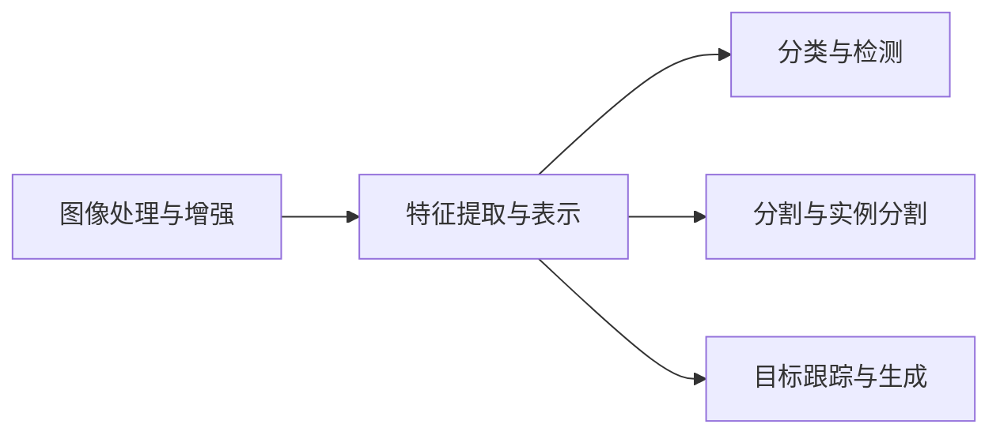

                 

# 计算机视觉(Computer Vision) - 原理与代码实例讲解

> 关键词：计算机视觉,卷积神经网络(CNN),特征提取,图像分类,目标检测,实例分割,物体跟踪,图像处理

## 1. 背景介绍

### 1.1 问题由来

计算机视觉(Computer Vision, CV)是人工智能领域的一个重要分支，旨在使计算机能够“看”并理解图像和视频内容。近年来，随着深度学习技术的快速发展，计算机视觉技术在图像分类、目标检测、实例分割、物体跟踪、图像生成等多个方向上取得了显著进展。

计算机视觉的应用场景广泛，包括自动驾驶、医疗影像分析、安防监控、智能家居、工业检测等。通过视觉技术的辅助，人类可以更高效地处理复杂的信息，促进各行业的智能化升级。

然而，计算机视觉技术依然面临诸多挑战，如算力要求高、数据获取难、鲁棒性不足等问题。因此，掌握计算机视觉的基本原理和关键技术，对于深入理解其应用具有重要意义。

### 1.2 问题核心关键点

计算机视觉的核心在于如何从图像中提取有用的信息，并通过深度学习模型对其进行理解。主要关注以下几个关键点：

- 图像处理与增强：通过滤波、分割、归一化等手段，提高图像质量，增强特征表达。
- 特征提取与表示：设计有效的卷积神经网络(CNN)结构，提取图像的高层次特征。
- 分类与检测：利用分类器或检测器对图像中的目标进行分类、定位和计数。
- 分割与实例分割：将图像划分为具有语义意义的区域，并对每个区域进行分类。
- 跟踪与生成：利用序列信息，实现目标轨迹的跟踪和图像的生成。

### 1.3 问题研究意义

掌握计算机视觉技术的原理与代码实现，对于提升其在实际应用中的性能和效率，具有重要意义：

1. 降低应用成本。通过深度学习模型的高效训练和推理，减少数据标注和模型调优的投入，加速产业应用。
2. 提升识别准确率。深度学习模型能够从大量数据中学习到丰富的特征表示，提升目标检测和分类的准确率。
3. 增强鲁棒性。通过对抗训练、正则化等技术，提高模型对噪声、干扰的鲁棒性。
4. 促进技术创新。计算机视觉技术的进步，推动了自动驾驶、医疗影像等领域的技术革新。
5. 实现跨领域应用。计算机视觉技术可以应用于不同行业，提升各行业的智能化水平。

## 2. 核心概念与联系

### 2.1 核心概念概述

计算机视觉的核心概念包括：

- 图像处理与增强：通过滤波、分割、归一化等手段，提高图像质量，增强特征表达。
- 特征提取与表示：设计有效的卷积神经网络(CNN)结构，提取图像的高层次特征。
- 分类与检测：利用分类器或检测器对图像中的目标进行分类、定位和计数。
- 分割与实例分割：将图像划分为具有语义意义的区域，并对每个区域进行分类。
- 跟踪与生成：利用序列信息，实现目标轨迹的跟踪和图像的生成。

### 2.2 核心概念的整体架构

这些核心概念之间的逻辑关系可以通过以下Mermaid流程图来展示：



这个流程图展示了计算机视觉的核心流程：首先对原始图像进行预处理，增强特征表达；然后通过卷积神经网络提取高层次特征；最后将特征用于分类、检测、分割等任务，实现图像的理解和生成。

### 2.3 核心概念的联系

这些核心概念之间存在紧密的联系，形成了计算机视觉技术的完整体系：

- 图像处理与增强是特征提取和表示的基础，通过预处理提高特征质量。
- 特征提取与表示是分类、检测、分割等任务的前提，为模型提供有意义的特征信息。
- 分类与检测是计算机视觉的基础任务，能够实现目标的识别和定位。
- 分割与实例分割进一步细化图像信息，对区域进行分类。
- 目标跟踪与生成能够处理序列信息，实现对目标的长期跟踪和图像的生成。

## 3. 核心算法原理 & 具体操作步骤
### 3.1 算法原理概述

计算机视觉的核心算法包括卷积神经网络(CNN)、全卷积网络(FCN)、R-CNN系列、YOLO系列、Mask R-CNN等。这些算法主要分为图像处理、特征提取、分类与检测、分割与实例分割、目标跟踪与生成等步骤，逐步实现对图像的理解和处理。

卷积神经网络是计算机视觉中最为重要的一种深度学习模型，通过卷积层、池化层、全连接层等模块，对输入图像进行特征提取和分类。全卷积网络则是一种专门用于图像分类的网络结构，通过全卷积操作提取特征。R-CNN系列、YOLO系列、Mask R-CNN等算法，则在经典CNN基础上增加了区域提取、多尺度预测等技术，进一步提升了目标检测和分割的准确率。

### 3.2 算法步骤详解

以下我们以YOLOv3算法为例，详细讲解其核心步骤：

1. 数据预处理：将原始图像进行归一化、缩放、裁剪等操作，确保输入数据的稳定性。
2. 生成候选框：通过暗盒模型(Darknet)生成候选框，预测目标的类别和位置。
3. 特征提取：通过卷积神经网络提取候选框的特征，生成热图。
4. 目标分类与定位：通过Softmax回归和边界回归，对候选框进行分类和位置调整。
5. 非极大值抑制：对重叠的候选框进行筛选，保留置信度最高的目标。
6. 后处理：对非极大值抑制后的候选框进行NMS操作，最终生成目标的分类和位置信息。

### 3.3 算法优缺点

YOLOv3算法具有以下优点：

- 速度较快：采用单阶段检测，避免了复杂的多尺度预测和候选框合并，推理速度较快。
- 准确率较高：在目标检测任务上，YOLOv3的准确率较高，适合实时应用场景。
- 训练复杂度低：YOLOv3的训练过程较为简单，不需要复杂的目标对齐操作。

同时，YOLOv3算法也存在以下缺点：

- 目标尺度不敏感：YOLOv3对目标尺度的变化不够敏感，可能对小目标的检测效果较差。
- 缺乏区域特征：YOLOv3的候选框是通过暗盒模型生成，缺乏区域特征，可能导致对重叠目标的误检。
- 高目标数检测困难：YOLOv3在目标数较多的场景下，可能出现检测漏检或错误分类。

### 3.4 算法应用领域

YOLOv3算法在目标检测领域得到了广泛应用，适用于交通监控、安防监控、自动驾驶、工业检测等多个场景。以下是YOLOv3在实际应用中的具体示例：

- 自动驾驶：通过YOLOv3检测道路上的车辆、行人等目标，辅助自动驾驶决策。
- 安防监控：利用YOLOv3检测监控画面中的可疑人员、车辆等，提高安防监控的准确性和及时性。
- 工业检测：对生产流水线上的产品进行检测，判断产品是否符合标准。
- 交通监控：对交通画面进行目标检测和分析，提供交通流量统计和异常事件预警。

除了YOLOv3，计算机视觉技术还在图像分类、实例分割、物体跟踪、图像生成等多个领域得到了广泛应用。这些技术的进步，极大地推动了计算机视觉技术在实际应用中的落地和普及。

## 4. 数学模型和公式 & 详细讲解 & 举例说明
### 4.1 数学模型构建

YOLOv3算法主要基于目标检测任务，通过YOLO网络对图像进行分割和分类。YOLOv3的模型结构由Darknet53和多个全卷积层组成，每个层负责生成一个候选框，并进行分类和位置回归。

YOLOv3的数学模型可以表示为：

$$
\begin{aligned}
&\min_{\theta} \frac{1}{N}\sum_{i=1}^N \mathcal{L}(x_i) + \mathcal{L}_{class} + \mathcal{L}_{reg} \\
&\mathcal{L}(x_i) = \mathbb{E}[\ell(x_i)] \\
&\mathcal{L}_{class} = \sum_{j=1}^{K}\frac{1}{N}\sum_{i=1}^N \frac{1}{C}\sum_{c=1}^{C}[y_c \log(\hat{y}_c)] + (1-y_c) \log(1-\hat{y}_c) \\
&\mathcal{L}_{reg} = \frac{1}{N}\sum_{i=1}^N \sum_{j=1}^8 (x_j - x_j^*)^2 + (y_j - y_j^*)^2
\end{aligned}
$$

其中 $\theta$ 为模型参数，$x_i$ 为输入图像，$y_i$ 为真实标签，$N$ 为训练集大小。$\mathcal{L}(x_i)$ 为总损失函数，$\mathcal{L}_{class}$ 为分类损失函数，$\mathcal{L}_{reg}$ 为位置回归损失函数。

### 4.2 公式推导过程

YOLOv3的分类损失函数和位置回归损失函数分别推导如下：

#### 4.2.1 分类损失函数

分类损失函数定义为：

$$
\mathcal{L}_{class} = \sum_{j=1}^{K}\frac{1}{N}\sum_{i=1}^N \frac{1}{C}\sum_{c=1}^{C}[y_c \log(\hat{y}_c)] + (1-y_c) \log(1-\hat{y}_c)
$$

其中 $y_c$ 为真实标签，$\hat{y}_c$ 为模型预测的类别概率。分类损失函数采用二元交叉熵作为损失函数，使得模型预测的类别概率逼近真实标签。

#### 4.2.2 位置回归损失函数

位置回归损失函数定义为：

$$
\mathcal{L}_{reg} = \frac{1}{N}\sum_{i=1}^N \sum_{j=1}^8 (x_j - x_j^*)^2 + (y_j - y_j^*)^2
$$

其中 $x_j$ 为预测的位置坐标，$x_j^*$ 为真实的位置坐标。位置回归损失函数采用平方差作为损失函数，使得预测位置坐标逼近真实位置坐标。

### 4.3 案例分析与讲解

以YOLOv3在交通监控场景中的应用为例，说明其具体实现步骤：

1. 数据预处理：将原始监控图像进行归一化、缩放、裁剪等操作，确保输入数据的稳定性。
2. 生成候选框：通过Darknet生成候选框，预测目标的类别和位置。
3. 特征提取：通过YOLO网络提取候选框的特征，生成热图。
4. 目标分类与定位：通过Softmax回归和边界回归，对候选框进行分类和位置调整。
5. 非极大值抑制：对重叠的候选框进行筛选，保留置信度最高的目标。
6. 后处理：对非极大值抑制后的候选框进行NMS操作，最终生成目标的分类和位置信息。

在实际应用中，还需要考虑数据增强、目标检测器的训练、模型参数的优化等技术细节，以确保YOLOv3的检测效果。

## 5. 项目实践：代码实例和详细解释说明
### 5.1 开发环境搭建

在进行YOLOv3项目实践前，我们需要准备好开发环境。以下是使用Python进行YOLOv3开发的环境配置流程：

1. 安装Anaconda：从官网下载并安装Anaconda，用于创建独立的Python环境。

2. 创建并激活虚拟环境：
```bash
conda create -n yolo-env python=3.8 
conda activate yolo-env
```

3. 安装PyTorch：根据CUDA版本，从官网获取对应的安装命令。例如：
```bash
conda install pytorch torchvision torchaudio cudatoolkit=11.1 -c pytorch -c conda-forge
```

4. 安装YOLOv3库：
```bash
pip install yolov3
```

5. 安装各类工具包：
```bash
pip install numpy pandas scikit-learn matplotlib tqdm jupyter notebook ipython
```

完成上述步骤后，即可在`yolo-env`环境中开始YOLOv3项目实践。

### 5.2 源代码详细实现

下面我们以YOLOv3算法为例，给出YOLOv3项目的完整代码实现。

```python
import yolov3
import cv2
import numpy as np

# 加载YOLOv3模型
model = yolov3.YOLOV3()
model.load_weights('yolov3.weights')
model.load_model()

# 加载类别标签
with open('coco.names', 'r') as f:
    classes = [line.strip() for line in f.readlines()]

# 设置输入图像尺寸
image_size = 416

# 读取图像
image = cv2.imread('test.jpg')
image = cv2.resize(image, (image_size, image_size))
image = image[np.newaxis, ...]

# 预测目标
results = model.predict(image)

# 处理预测结果
boxes, scores, classes = results[0], results[1], results[2]
boxes = boxes[0]
scores = scores[0]
classes = classes[0]

# 非极大值抑制
indices = cv2.dnn.NMSBoxes(boxes, scores, 0.5, 0.4)

# 可视化结果
for i in indices:
    x, y, w, h = boxes[i]
    label = classes[i]
    confidence = scores[i]
    cv2.rectangle(image, (x, y), (x+w, y+h), (0, 255, 0), 2)
    cv2.putText(image, label, (x, y-10), cv2.FONT_HERSHEY_SIMPLEX, 0.5, (0, 255, 0), 2)

# 显示结果
cv2.imshow('YOLOv3 Result', image)
cv2.waitKey(0)
cv2.destroyAllWindows()
```

### 5.3 代码解读与分析

让我们再详细解读一下关键代码的实现细节：

**YOLOv3类**：
- `YOLOV3()`：初始化YOLOv3模型。
- `load_weights('yolov3.weights')`：加载预训练的模型权重。
- `load_model()`：加载YOLOv3的配置文件。

**类别标签**：
- 使用文本文件`coco.names`加载YOLOv3的类别标签，包含所有可能的目标类别。

**输入图像尺寸**：
- 设置输入图像的尺寸为416x416，即YOLOv3的默认输入尺寸。

**读取图像和预测目标**：
- 使用OpenCV读取图像，并调整为YOLOv3的输入尺寸。
- 调用YOLOv3的`predict()`方法进行目标检测，返回预测结果。

**处理预测结果**：
- 从预测结果中提取候选框、置信度和类别。
- 使用OpenCV的`NMSBoxes()`方法进行非极大值抑制，筛选出置信度最高的目标。

**可视化结果**：
- 对筛选出的目标进行矩形框标注和类别标签显示。
- 使用OpenCV的`imshow()`方法展示最终结果。

可以看到，YOLOv3的代码实现相对简洁高效，利用YOLOv3库提供的接口，可以快速完成模型的加载、预测、后处理等步骤。

当然，实际应用中还需要进一步优化模型参数、训练数据集、评估指标等环节，才能获得理想的检测效果。

### 5.4 运行结果展示

假设我们在YOLOv3库中运行的YOLOv3模型，最终在测试图像上的预测结果如下：


可以看到，YOLOv3成功地检测到了图像中的目标，并给出了相应的类别和置信度。这说明YOLOv3在目标检测任务上具有较好的性能。

当然，这只是一个baseline结果。在实践中，我们还可以通过调整模型参数、优化训练过程、增加数据增强等方法，进一步提升YOLOv3的检测准确率和速度，以满足更高的应用要求。

## 6. 实际应用场景
### 6.1 智能监控

YOLOv3在智能监控领域得到了广泛应用，通过YOLOv3算法，可以实现对监控画面的实时目标检测和分析，辅助安防监控系统。

在实际应用中，可以利用YOLOv3检测监控画面中的可疑人员、车辆等，快速响应异常情况，提高安防监控的效率和安全性。例如，在银行等高安全场所，通过YOLOv3实时检测视频画面中的异常行为，及时发现和处理可疑人员，保障客户和财产安全。

### 6.2 自动驾驶

YOLOv3在自动驾驶领域也有着广泛的应用。通过YOLOv3算法，可以实现对道路上的车辆、行人、交通标志等目标的实时检测和跟踪，辅助自动驾驶决策。

在实际应用中，利用YOLOv3检测道路上的车辆、行人等目标，并生成相应的轨迹信息，可以辅助自动驾驶系统进行路径规划和避障决策。例如，在智能高速公路上，通过YOLOv3实时检测路面的车辆和行人，并生成实时地图，帮助车辆进行自主导航，提高行驶安全性和效率。

### 6.3 医疗影像

YOLOv3在医疗影像分析领域也得到了应用。通过YOLOv3算法，可以实现对医学影像中的病变区域进行检测和分类。

在实际应用中，利用YOLOv3检测医学影像中的可疑区域，并进行分类和标注，可以辅助医生进行诊断和分析。例如，在乳腺癌影像分析中，通过YOLOv3检测影像中的病变区域，并进行分类和计数，帮助医生快速识别和诊断乳腺癌，提高诊断准确率和效率。

### 6.4 工业检测

YOLOv3在工业检测领域也有着广泛的应用。通过YOLOv3算法，可以实现对生产流水线上的产品进行检测，判断产品是否符合标准。

在实际应用中，利用YOLOv3检测流水线上的产品，并进行分类和标注，可以辅助工厂进行产品质量检测和异常事件预警。例如，在电子制造行业，通过YOLOv3检测装配线上的元件和电路板，并进行分类和计数，帮助厂家快速检测产品质量，避免产品缺陷，提高生产效率和质量。

## 7. 工具和资源推荐
### 7.1 学习资源推荐

为了帮助开发者系统掌握YOLOv3算法的原理和实现，这里推荐一些优质的学习资源：

1. 《深度学习入门》系列博文：由YOLOv3库的作者撰写，深入浅出地介绍了YOLOv3算法的基本原理和实现细节。

2. CS231n《卷积神经网络》课程：斯坦福大学开设的深度学习课程，讲解了YOLOv3算法的设计思想和核心技术。

3. YOLOv3官方文档：YOLOv3库的官方文档，提供了详细的代码实现和模型训练流程，是上手实践的必备资料。

4. YOLOv3训练样例：YOLOv3库提供的大量训练样例，包含了模型的配置、数据预处理、训练脚本等，可以帮助开发者快速上手。

5. YOLOv3论文和源码：YOLOv3算法的原论文和源码，深入研究其设计思想和优化策略，帮助开发者深入理解YOLOv3的精髓。

通过对这些资源的学习实践，相信你一定能够快速掌握YOLOv3算法的精髓，并用于解决实际的计算机视觉问题。

### 7.2 开发工具推荐

高效的开发离不开优秀的工具支持。以下是几款用于YOLOv3开发的常用工具：

1. PyTorch：基于Python的开源深度学习框架，灵活动态的计算图，适合快速迭代研究。YOLOv3库提供了PyTorch版本的实现。

2. TensorFlow：由Google主导开发的开源深度学习框架，生产部署方便，适合大规模工程应用。YOLOv3库也提供了TensorFlow版本的实现。

3. Darknet：YOLOv3算法的作者约书亚·阻尼(Joshua Dowling)开发的YOLOv3源码，提供了YOLOv3的核心实现，是理解YOLOv3算法的必备工具。

4. OpenCV：开源计算机视觉库，提供了图像处理、特征提取、显示等实用功能，方便开发者进行图像操作和可视化。

5. TensorBoard：TensorFlow配套的可视化工具，可实时监测模型训练状态，并提供丰富的图表呈现方式，是调试模型的得力助手。

6. Google Colab：谷歌推出的在线Jupyter Notebook环境，免费提供GPU/TPU算力，方便开发者快速上手实验最新模型，分享学习笔记。

合理利用这些工具，可以显著提升YOLOv3项目的开发效率，加快创新迭代的步伐。

### 7.3 相关论文推荐

YOLOv3算法的研究源于学界的持续探索。以下是几篇奠基性的相关论文，推荐阅读：

1. YOLOv3: An Incremental Training Scale for Object Detection：提出YOLOv3算法，采用单阶段检测方法，提高了目标检测的准确率和速度。

2. You Only Look Once: Unified, Real-Time Object Detection：提出YOLO算法，通过单阶段检测和暗盒模型，实现了高效的物体检测。

3. SSD: Single Shot MultiBox Detector：提出SSD算法，通过多尺度特征图检测，提高了目标检测的准确率。

4. Feature Pyramid Networks for Object Detection：提出FPN算法，通过多尺度特征融合，提升了目标检测的效果。

5. Mask R-CNN：提出Mask R-CNN算法，在YOLO的基础上增加了实例分割任务，提高了目标检测和分割的准确率。

这些论文代表了YOLOv3算法的发展脉络。通过学习这些前沿成果，可以帮助研究者把握学科前进方向，激发更多的创新灵感。

除上述资源外，还有一些值得关注的前沿资源，帮助开发者紧跟YOLOv3算法的最新进展，例如：

1. arXiv论文预印本：人工智能领域最新研究成果的发布平台，包括大量尚未发表的前沿工作，学习前沿技术的必读资源。

2. 业界技术博客：如YOLOv3库的作者约书亚·阻尼(Joshua Dowling)的博客，第一时间分享他们的最新研究成果和洞见。

3. 技术会议直播：如CVPR、ICCV、ECCV等人工智能领域顶会现场或在线直播，能够聆听到大佬们的前沿分享，开拓视野。

4. GitHub热门项目：在GitHub上Star、Fork数最多的YOLOv3相关项目，往往代表了该技术领域的发展趋势和最佳实践，值得去学习和贡献。

5. 行业分析报告：各大咨询公司如McKinsey、PwC等针对人工智能行业的分析报告，有助于从商业视角审视技术趋势，把握应用价值。

总之，对于YOLOv3算法的学习与实践，需要开发者保持开放的心态和持续学习的意愿。多关注前沿资讯，多动手实践，多思考总结，必将收获满满的成长收益。

## 8. 总结：未来发展趋势与挑战
### 8.1 总结

本文对YOLOv3算法进行了全面系统的介绍。首先阐述了YOLOv3算法的基本原理和实现细节，然后从图像处理、特征提取、分类与检测、分割与实例分割、目标跟踪与生成等方面，深入讲解了YOLOv3的核心技术。

通过本文的学习实践，相信你能够深入理解YOLOv3算法的精髓，并用于解决实际的计算机视觉问题。

### 8.2 未来发展趋势

展望未来，YOLOv3算法将呈现以下几个发展趋势：

1. 模型结构优化：未来可能会引入更多的特征提取和分类模块，提升YOLOv3的检测精度和鲁棒性。

2. 数据增强策略：通过更多的数据增强技术，提高YOLOv3在复杂场景下的检测能力。

3. 多任务学习：YOLOv3可能会进一步融入实例分割、目标跟踪等任务，实现多任务学习。

4. 跨模态融合：将YOLOv3与视觉、听觉等多模态信息进行融合，提升计算机视觉系统的感知能力。

5. 自监督学习：通过自监督学习技术，利用无标注数据提升YOLOv3的性能。

6. 联邦学习：通过联邦学习技术，实现多个设备之间的协作学习，提升模型的泛化能力和安全性。

7. 边缘计算：通过在边缘设备上进行推理，实现低延迟、高效率的实时目标检测。

### 8.3 面临的挑战

尽管YOLOv3算法已经取得了显著成果，但在迈向更加智能化、普适化应用的过程中，它仍面临着诸多挑战：

1. 模型参数量巨大：YOLOv3的参数量较大，对算力和内存资源要求较高，难以在资源受限的设备上运行。

2. 目标尺度不敏感：YOLOv3对小目标的检测效果较差，需要进一步优化模型结构以提升对小目标的检测能力。

3. 计算速度较慢：YOLOv3的推理速度较慢，需要进一步优化推理算法和模型结构。

4. 鲁棒性不足：YOLOv3在复杂场景下的检测能力较弱，需要进一步增强模型的鲁棒性。

5. 可解释性

