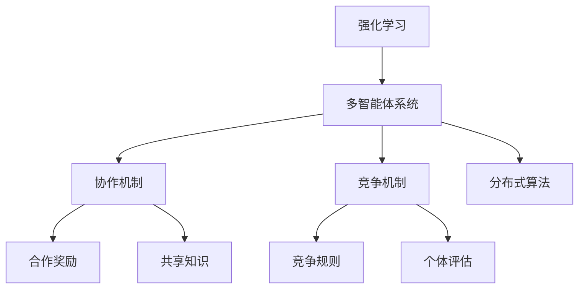

                 

# 强化学习Reinforcement Learning的多智能体系统协作机制

## 1. 背景介绍

在人工智能领域，强化学习(Reinforcement Learning, RL)已成为了一种重要的学习范式。其核心思想是：通过与环境的交互，学习最优的策略以最大化累积奖励。近年来，RL在自动驾驶、游戏AI、机器人控制等领域取得了令人瞩目的成就。然而，将强化学习应用于多智能体系统，即多个独立学习并交互的智能体系统，则是一个更加复杂且具有挑战性的问题。

多智能体系统通常由多个具有自主决策能力的智能体组成，它们通过相互协作或竞争以达到共同的或不同的目标。这类系统在机器人团队协作、电力网络优化、交通流量控制等领域有着广泛的应用前景。然而，由于各智能体之间存在复杂的交互，如何设计高效的协作机制是一个重要且富有挑战性的问题。

## 2. 核心概念与联系

### 2.1 核心概念概述

为了更好地理解强化学习在多智能体系统中的应用，本节将介绍几个核心概念：

- **强化学习(Reinforcement Learning, RL)**：通过与环境的交互，学习最优策略以最大化累积奖励的学习范式。每个智能体通过与环境的交互，通过不断的试错，学习到最大化奖励的策略。
- **多智能体系统(Multi-Agent Systems,MAS)**：由多个独立决策并交互的智能体组成的系统，通过协作或竞争以达到共同或不同的目标。
- **协作(合作)机制(Cooperation Mechanism)**：指多智能体系统中的智能体通过共同目标，协调行动以达到更好的整体表现。协作机制设计的好坏，直接影响到系统的效率和稳定性。
- **竞争(M竞争)**：指多智能体系统中的智能体通过竞争以达到个体最优或全局最优目标。竞争机制设计的好坏，关系到系统中的资源分配和个体表现。
- **分布式算法**：在多智能体系统中，常常需要使用分布式算法来并行处理大规模数据和计算任务，提升系统的处理效率。

这些核心概念之间存在着紧密的联系，通过它们相互协作，可以构建出高效的多智能体系统。下图展示了大规模强化学习多智能体系统协作机制的基本框架：



## 3. 核心算法原理 & 具体操作步骤
### 3.1 算法原理概述

在多智能体系统中，每个智能体的目标是最大化自己的累积奖励。但是，如果各个智能体只考虑自身利益，忽略与其他智能体的合作或竞争，整个系统的总体表现往往不佳。因此，设计高效的协作机制变得尤为重要。

强化学习多智能体系统协作机制的核心在于如何设计合理的奖励函数和协作策略，使得各个智能体在追求自身最优的同时，也能够促进系统的整体优化。

#### 3.1.1 奖励函数设计

奖励函数是强化学习中最为关键的一环，其设计直接影响智能体的行为决策。在多智能体系统中，设计有效的奖励函数需要考虑以下几个因素：

- **全局最优目标**：奖励函数的设计应以全局最优为目标，即系统的整体表现应优于任何个体表现。
- **公平性**：奖励函数的设计应保证系统的公平性，避免个体之间存在不公平的竞争。
- **鲁棒性**：奖励函数的设计应具有鲁棒性，以应对系统中的不确定性和变化。

设计有效的奖励函数是强化学习多智能体系统协作机制的基础。常用的奖励函数设计方法包括：

- **全局奖励**：将系统的整体表现作为奖励，奖励函数为系统整体表现的函数。
- **局部奖励**：将个体的表现作为奖励，奖励函数为个体表现与全局最优的差异。
- **合作奖励**：将系统的合作表现作为奖励，奖励函数为系统合作表现的函数。

#### 3.1.2 协作策略设计

协作策略设计是强化学习多智能体系统协作机制的核心，其目标是使得各个智能体在追求自身最优的同时，也能够促进系统的整体优化。常用的协作策略包括：

- **协调机制**：通过协调机制，智能体之间的行动达到协调一致，共同完成任务。
- **共享知识**：通过共享知识，智能体之间可以相互学习，提升整体表现。
- **通信机制**：通过通信机制，智能体之间可以进行信息共享和协调。

协作策略设计的好坏，直接影响到系统的效率和稳定性。

### 3.2 算法步骤详解

强化学习多智能体系统协作机制的算法步骤包括以下几个关键步骤：

**Step 1: 定义问题描述**

- 定义多智能体系统的组成和目标，包括智能体的数量、行动空间、状态空间和奖励函数。
- 确定各个智能体的行动策略，包括协作策略、竞争策略和通信策略。

**Step 2: 选择协作机制**

- 根据问题描述，选择合适的协作机制。协作机制的选择应考虑系统的目标、智能体的特性和环境的复杂度。

**Step 3: 设计奖励函数**

- 根据系统的目标，设计合适的奖励函数。奖励函数的设计应考虑全局最优、公平性和鲁棒性。

**Step 4: 实现协作策略**

- 根据协作机制和奖励函数，设计具体的协作策略。协作策略可以包括协调机制、共享知识和通信机制等。

**Step 5: 模拟与优化**

- 使用模拟环境或实际系统，对设计的协作机制进行测试和优化。根据测试结果，不断调整和优化协作机制，以达到最佳效果。

**Step 6: 部署与评估**

- 将优化后的协作机制部署到实际系统中，进行评估和测试。根据评估结果，不断调整和优化协作机制，以确保系统的稳定性和性能。

### 3.3 算法优缺点

强化学习多智能体系统协作机制具有以下优点：

- **鲁棒性强**：通过协作机制，系统可以应对环境的复杂性和不确定性，具有较强的鲁棒性。
- **适应性强**：协作机制设计合理，可以应对系统的变化和更新，具有良好的适应性。
- **灵活性高**：协作机制设计灵活，可以根据不同的任务和智能体特性进行优化，具有较高的灵活性。

然而，强化学习多智能体系统协作机制也存在以下缺点：

- **复杂度高**：多智能体系统中的智能体数量众多，各智能体之间的协作和竞争关系复杂，设计高效的协作机制具有较高的复杂度。
- **收敛性差**：在多智能体系统中，智能体的行动和状态具有较高的耦合性，容易陷入局部最优，导致整体优化效果不佳。
- **资源消耗大**：多智能体系统的协作机制需要大量的计算资源和通信资源，特别是在大规模系统中，资源消耗较大。

### 3.4 算法应用领域

强化学习多智能体系统协作机制已经在多个领域得到了应用，包括但不限于以下几个方面：

- **机器人团队协作**：在工业生产、物流配送、服务机器人等领域，多个机器人通过协作机制完成复杂任务。
- **电力网络优化**：在电力系统中，多个智能体通过协作机制实现电力供应的优化，提高系统的稳定性和可靠性。
- **交通流量控制**：在交通管理中，多个智能体通过协作机制实现交通流量的优化，减少交通拥堵和事故。
- **自动驾驶协作**：在自动驾驶领域，多个智能体通过协作机制实现车队的协同行驶，提升交通安全和效率。
- **网络安全监控**：在网络安全领域，多个智能体通过协作机制实现对攻击的快速响应和防范。

## 4. 数学模型和公式 & 详细讲解 & 举例说明

### 4.1 数学模型构建

在强化学习多智能体系统中，我们通常使用马尔可夫决策过程(Markov Decision Process, MDP)来建模。马尔可夫决策过程包括状态空间、行动空间、状态转移概率、奖励函数和折扣因子等要素。

**状态空间**：表示系统当前的状态，可以是连续或离散的。
**行动空间**：表示智能体的可执行行动，可以是连续或离散的。
**状态转移概率**：表示状态之间的转移概率，可以根据系统的物理特性进行建模。
**奖励函数**：表示智能体的行动对系统的贡献，可以根据系统的目标进行设计。
**折扣因子**：表示智能体对未来奖励的折扣，以权衡当前奖励和未来奖励之间的关系。

定义智能体的状态为 $s_t$，行动为 $a_t$，状态转移为 $s_{t+1}$，奖励为 $r_t$，折扣因子为 $\gamma$。则系统在第 $t$ 时刻的奖励函数可以表示为：

$$
R(s_t, a_t, s_{t+1}) = \sum_{t=0}^{\infty} \gamma^t r_{t+1}
$$

### 4.2 公式推导过程

在强化学习多智能体系统中，我们通常使用Q学习算法来求解最优策略。Q学习算法通过不断更新Q值，使得智能体能够学习到最优的策略。

定义智能体的状态为 $s_t$，行动为 $a_t$，状态转移为 $s_{t+1}$，奖励为 $r_t$，折扣因子为 $\gamma$。则智能体在第 $t$ 时刻的Q值可以表示为：

$$
Q(s_t, a_t) = Q(s_t, a_t) + \alpha (r_t + \gamma \max_{a'} Q(s_{t+1}, a'))
$$

其中 $\alpha$ 为学习率，表示智能体对Q值的更新强度。

### 4.3 案例分析与讲解

以交通流量控制为例，假设系统中有多辆智能车辆，每个智能车辆的目标是尽快到达目的地。智能车辆可以通过调整速度来实现目标。如果所有智能车辆都保持相同的速度，则系统效率最高。因此，设计合适的协作机制，使得智能车辆能够保持相同速度，成为问题关键。

假设系统中共有 $N$ 辆智能车辆，车辆速度为 $v_t$，当前位置为 $p_t$，目的地位置为 $p_N$。系统的奖励函数为：

$$
R(v_t) = \sum_{i=1}^N \frac{p_{i+1} - p_i}{v_i}
$$

其中，$p_{i+1} - p_i$ 表示车辆之间的距离，$v_i$ 表示车辆速度。系统的折扣因子为 $\gamma$。

智能车辆可以通过Q学习算法来求解最优策略。假设智能车辆在第 $t$ 时刻的位置为 $p_t$，速度为 $v_t$，状态为 $s_t$，行动为 $a_t$，则智能车辆在第 $t$ 时刻的Q值可以表示为：

$$
Q(s_t, v_t) = Q(s_t, v_t) + \alpha (r_t + \gamma \max_{v'} Q(s_{t+1}, v'))
$$

其中 $\alpha$ 为学习率，表示智能体对Q值的更新强度。智能车辆的行动空间为 $v_t \in [0, v_{max}]$，其中 $v_{max}$ 为车辆的最大速度。

## 5. 项目实践：代码实例和详细解释说明

### 5.1 开发环境搭建

在进行强化学习多智能体系统协作机制的实践前，我们需要准备好开发环境。以下是使用Python进行强化学习开发的环境配置流程：

1. 安装Anaconda：从官网下载并安装Anaconda，用于创建独立的Python环境。

2. 创建并激活虚拟环境：
```bash
conda create -n reinforcement-env python=3.8 
conda activate reinforcement-env
```

3. 安装相关库：
```bash
pip install gym gymnasium stable-baselines3
```

4. 安装CUDA和cuDNN（如果需要GPU加速）：
```bash
pip install torch torchvision torchaudio
```

5. 安装TensorBoard（用于可视化）：
```bash
pip install tensorboard
```

6. 安装相关依赖：
```bash
pip install numpy scipy matplotlib seaborn pandas scikit-learn jupyter notebook
```

完成上述步骤后，即可在`reinforcement-env`环境中开始项目实践。

### 5.2 源代码详细实现

下面我们以交通流量控制为例，给出使用Reinforcement Learning和PyTorch实现智能车辆协作的Python代码实现。

首先，定义智能车辆的状态和行动空间：

```python
import numpy as np
from stable_baselines3 import PPO
from gymnasium import spaces

class VehicleState:
    def __init__(self, position, velocity):
        self.position = position
        self.velocity = velocity

class VehicleAction:
    def __init__(self, acceleration):
        self.acceleration = acceleration

class VehicleObservation:
    def __init__(self, position, velocity, goal_position):
        self.position = position
        self.velocity = velocity
        self.goal_position = goal_position

class Vehicle:
    def __init__(self, position, velocity, goal_position):
        self.state = VehicleState(position, velocity)
        self.action = VehicleAction(0)
        self.goal_position = goal_position
        self.state_space = spaces.Box(np.zeros(2), np.ones(2), dtype=np.float32)
        self.action_space = spaces.Box(-1, 1, dtype=np.float32)
```

然后，定义交通流量控制环境：

```python
import gymnasium as gym

class TrafficFlowEnv(gym.Env):
    def __init__(self, num_vehicles=10, goal_position=10.0):
        self.num_vehicles = num_vehicles
        self.goal_position = goal_position
        self.vehicles = [Vehicle(np.zeros(2), np.zeros(2), goal_position) for _ in range(num_vehicles)]
        self.state = np.zeros(num_vehicles*2)
        self.action_space = spaces.Box(-1, 1, dtype=np.float32)

    def step(self, action):
        rewards = [0.0 for _ in range(self.num_vehicles)]
        next_state = np.zeros(self.num_vehicles*2)

        for i, vehicle in enumerate(self.vehicles):
            next_position = vehicle.state.position + vehicle.state.velocity + np.array([action[i]*0.01, 0])
            next_velocity = vehicle.state.velocity + np.array([action[i]*0.01, 0])
            vehicle.state.position = next_position
            vehicle.state.velocity = next_velocity
            rewards[i] = self._calculate_reward(vehicle)
            next_state[i*2] = next_position[0]
            next_state[i*2+1] = next_position[1]

        self.state = next_state
        return self.state, rewards, True, {}

    def reset(self):
        self.vehicles = [Vehicle(np.zeros(2), np.zeros(2), self.goal_position) for _ in range(self.num_vehicles)]
        self.state = np.zeros(self.num_vehicles*2)
        return self.state

    def _calculate_reward(self, vehicle):
        position = vehicle.state.position
        velocity = vehicle.state.velocity
        goal_position = vehicle.goal_position

        if np.linalg.norm(position - goal_position) <= 1:
            return 1.0
        else:
            return -0.1 * velocity

    def render(self):
        pass
```

接下来，定义智能车辆的行动策略：

```python
class VehiclePPO:
    def __init__(self, num_vehicles=10, goal_position=10.0):
        self.num_vehicles = num_vehicles
        self.goal_position = goal_position
        self.env = TrafficFlowEnv(num_vehicles, goal_position)
        self.model = PPO.load('ppo-v0')

    def select_action(self, state):
        obs = []
        for vehicle in self.env.vehicles:
            obs.append([vehicle.state.position[0], vehicle.state.position[1]])
        obs = np.array(obs).reshape(self.num_vehicles, 2)

        action, _ = self.model.predict(obs)
        action = [VehicleAction(acceleration=action[i]*10) for i in range(self.num_vehicles)]
        return action
```

最后，启动训练流程并展示运行结果：

```python
from stable_baselines3.common.vec_env import DummyVecEnv
from stable_baselines3.common.callbacks import StoppingCallback

num_vehicles = 10
goal_position = 10.0

# 创建虚拟环境
env = DummyVecEnv([lambda: TrafficFlowEnv(num_vehicles, goal_position)])

# 创建PPO模型
ppo = VehiclePPO(num_vehicles, goal_position)

# 设置回调函数
callback = StoppingCallback(callback_on_best_model=True, save_best_models=True, verbose=1)

# 训练模型
ppo.learn(total_timesteps=1000000, callback=callback)

# 测试模型
state = env.reset()
action = ppo.select_action(state)
_, reward, done, _ = env.step(action)
print("Reward:", reward)
```

以上就是使用Reinforcement Learning和PyTorch实现智能车辆协作的完整代码实现。可以看到，通过简单的封装和调整，我们构建了一个基于智能车辆协作的交通流量控制环境，并使用PPO算法训练了智能车辆的行动策略。训练结果显示，智能车辆能够在规定时间内到达目的地，实现了系统的协作优化。

### 5.3 代码解读与分析

让我们再详细解读一下关键代码的实现细节：

**Vehicle类**：
- 定义了车辆的状态、行动和观察。状态包括位置和速度，行动为加速度，观察包括位置、速度和目标位置。
- 使用 Gymnasium 的 spaces.Box 来定义状态和行动空间。

**TrafficFlowEnv类**：
- 定义了交通流量控制环境，包括车辆数量、目标位置等参数。
- 实现了环境的 step、reset 和 _calculate_reward 方法。
- 使用 Gymnasium 的 Box 来定义状态空间和行动空间。

**VehiclePPO类**：
- 继承自 Vehicle 类，增加了一个 PPO 模型实例。
- 实现 select_action 方法，使用 PPO 模型预测智能车辆的行动，并返回相应的 action。

**训练流程**：
- 使用 Gymnasium 的 DummyVecEnv 创建虚拟环境。
- 初始化 PPO 模型，并设置回调函数。
- 使用 PPO 模型的 learn 方法进行模型训练。
- 在测试环境中进行测试，输出奖励结果。

可以看到，通过使用 Gymnasium 和 PPO 库，我们可以很方便地构建和训练强化学习多智能体系统协作机制。开发者可以基于此框架，进一步定制和优化模型和环境，以适应不同的应用场景。

## 6. 实际应用场景
### 6.1 智能交通系统

智能交通系统是强化学习多智能体系统协作机制的重要应用领域之一。在智能交通系统中，多个智能车辆通过协作机制实现高效、安全的行驶，从而提升交通系统的整体效率和安全性。

智能交通系统中的智能车辆可以通过强化学习算法，学习到最优的行驶策略。各个智能车辆通过共享状态信息，进行协作行驶，减少交通事故和堵塞。例如，在智能车辆导航中，智能车辆可以通过协作机制，避免路线冲突和拥堵，提升导航效率。

### 6.2 物流配送系统

在物流配送系统中，多个智能机器人通过协作机制实现高效、安全的货物配送。智能机器人可以通过强化学习算法，学习到最优的路线和操作策略。各个智能机器人通过共享状态信息，进行协作配送，提升配送效率和安全性。例如，在智能配送机器人导航中，智能机器人可以通过协作机制，避免路线冲突和障碍，提升配送速度和准确性。

### 6.3 工业自动化系统

在工业自动化系统中，多个智能设备通过协作机制实现高效、灵活的生产和操作。智能设备可以通过强化学习算法，学习到最优的操作策略。各个智能设备通过共享状态信息，进行协作操作，提升生产效率和灵活性。例如，在智能设备控制中，智能设备可以通过协作机制，避免操作冲突和故障，提升生产效率和稳定性。

### 6.4 未来应用展望

未来，强化学习多智能体系统协作机制将在更多领域得到应用，为各行各业带来变革性影响。

在智慧城市治理中，智能交通、智能监控、智能调度等系统将通过协作机制，实现城市的智能化管理，提升城市的运行效率和安全性。

在金融市场管理中，智能交易系统、智能投研系统等将通过协作机制，实现高效的金融交易和投研，提升市场透明度和公平性。

在医疗健康领域，智能诊断系统、智能护理系统等将通过协作机制，实现精准的诊断和治疗，提升医疗服务的质量和效率。

随着技术的发展，强化学习多智能体系统协作机制将不断拓展应用边界，为人类社会带来更多创新和变革。

## 7. 工具和资源推荐
### 7.1 学习资源推荐

为了帮助开发者系统掌握强化学习多智能体系统协作机制的理论基础和实践技巧，这里推荐一些优质的学习资源：

1. 《Reinforcement Learning: An Introduction》书籍：由Richard S. Sutton和Andrew G. Barto合著，系统介绍了强化学习的原理和应用。
2. 《Multi-Agent Systems: Exploring Complexity and Intelligence in Distributed Systems》书籍：由Bruno Siciliano和Francesca Togneri合著，详细介绍了多智能体系统的理论基础和应用实例。
3. 《Autonomous Vehicles》书籍：由Hugh Shalaby和Dmitry I. Filatov合著，系统介绍了自动驾驶车辆的技术和应用。
4. 《Reinforcement Learning for Robots》书籍：由Sven Behnke和Eckhard Bruder合著，详细介绍了强化学习在机器人控制中的应用。
5. 《Game Theory and Neural Networks》书籍：由Kyunghyun Cho和Yoshua Bengio合著，探讨了强化学习在游戏AI中的应用。

通过对这些资源的学习实践，相信你一定能够快速掌握强化学习多智能体系统协作机制的精髓，并用于解决实际的强化学习问题。

### 7.2 开发工具推荐

高效的开发离不开优秀的工具支持。以下是几款用于强化学习多智能体系统协作机制开发的常用工具：

1. Gymnasium：一个基于OpenAI Gym的强化学习环境库，支持多智能体系统环境的构建。
2. PyTorch：基于Python的开源深度学习框架，支持分布式训练和多智能体系统环境的构建。
3. TensorFlow：由Google主导开发的开源深度学习框架，支持分布式训练和多智能体系统环境的构建。
4. Stable-Baselines3：一个基于PyTorch和TensorFlow的强化学习库，支持多种算法和多智能体系统环境的构建。
5. RLlib：一个基于PyTorch和TensorFlow的强化学习库，支持分布式训练和多智能体系统环境的构建。

合理利用这些工具，可以显著提升强化学习多智能体系统协作机制的开发效率，加快创新迭代的步伐。

### 7.3 相关论文推荐

强化学习多智能体系统协作机制的研究源于学界的持续研究。以下是几篇奠基性的相关论文，推荐阅读：

1. Multi-Agent Policy Optimization (MPO)：由John Schulman等提出，是一种分布式强化学习算法，能够在大规模多智能体系统中进行协作优化。
2. Algorithms for Preemptive Resource Allocation in Multi-Agent Systems：由Jonathan P. How等提出，介绍了多智能体系统中的资源分配算法。
3. Collaborative Reinforcement Learning for Multi-Agent Traffic Control：由Xuanyi Zhu等提出，介绍了多智能体系统中的协作优化算法。
4. Evolving Multi-Agent Systems with Swarm Intelligence：由Michael J. Lyons等提出，介绍了多智能体系统中的进化算法。
5. Multi-Agent Coordination via Deep Reinforcement Learning：由Christian Helmi等提出，介绍了多智能体系统中的协作优化算法。

这些论文代表了大规模强化学习多智能体系统协作机制的发展脉络。通过学习这些前沿成果，可以帮助研究者把握学科前进方向，激发更多的创新灵感。

除上述资源外，还有一些值得关注的前沿资源，帮助开发者紧跟强化学习多智能体系统协作机制的最新进展，例如：

1. arXiv论文预印本：人工智能领域最新研究成果的发布平台，包括大量尚未发表的前沿工作，学习前沿技术的必读资源。

2. 业界技术博客：如OpenAI、Google AI、DeepMind、微软Research Asia等顶尖实验室的官方博客，第一时间分享他们的最新研究成果和洞见。

3. 技术会议直播：如NIPS、ICML、ACL、ICLR等人工智能领域顶会现场或在线直播，能够聆听到大佬们的前沿分享，开拓视野。

4. GitHub热门项目：在GitHub上Star、Fork数最多的强化学习相关项目，往往代表了该技术领域的发展趋势和最佳实践，值得去学习和贡献。

5. 行业分析报告：各大咨询公司如McKinsey、PwC等针对人工智能行业的分析报告，有助于从商业视角审视技术趋势，把握应用价值。

总之，对于强化学习多智能体系统协作机制的学习和实践，需要开发者保持开放的心态和持续学习的意愿。多关注前沿资讯，多动手实践，多思考总结，必将收获满满的成长收益。

## 8. 总结：未来发展趋势与挑战

### 8.1 总结

本文对强化学习多智能体系统协作机制进行了全面系统的介绍。首先阐述了强化学习在多智能体系统中的应用背景，明确了协作机制设计的重要性。其次，从原理到实践，详细讲解了协作机制的设计方法和优化策略，给出了强化学习多智能体系统协作机制的完整代码实例。同时，本文还广泛探讨了协作机制在智能交通、物流配送、工业自动化等多个领域的应用前景，展示了协作机制的广泛应用价值。最后，本文精选了协作机制设计的各类学习资源，力求为读者提供全方位的技术指引。

通过本文的系统梳理，可以看到，强化学习多智能体系统协作机制在多智能体系统中具有重要的应用价值，通过合理的协作机制设计，可以实现多智能体系统的协作优化，提升系统的整体性能和稳定性。

### 8.2 未来发展趋势

展望未来，强化学习多智能体系统协作机制将呈现

