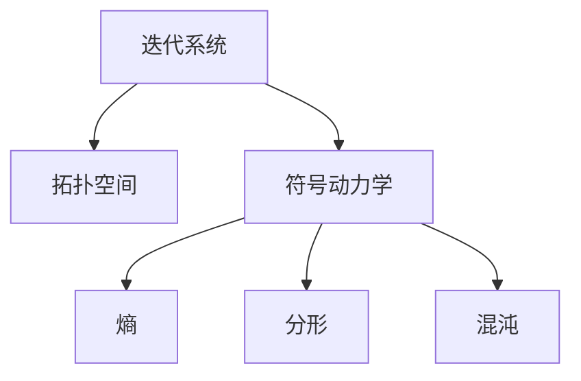
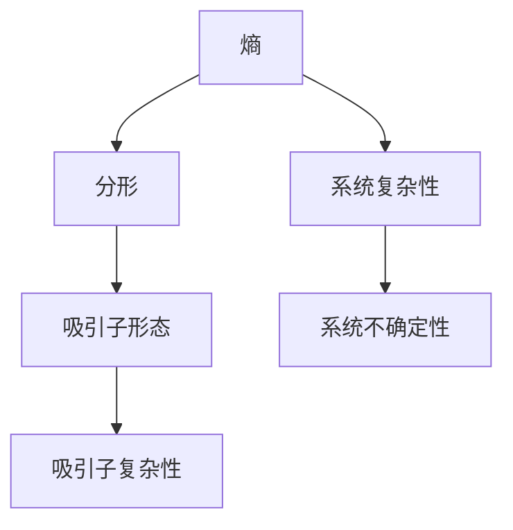
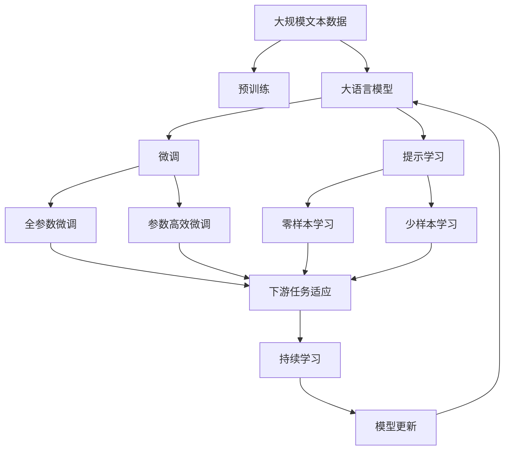

                 

# 拓扑动力学与符号动力学

> 关键词：拓扑动力学,符号动力学,熵,分形,混沌,迭代系统

## 1. 背景介绍

### 1.1 问题由来
在数学与物理领域，动力学系统是指在一定时间内从一个状态（即初始条件）变换到另一个状态的确定性过程。其中，拓扑动力学和符号动力学是研究动态系统性质、分类和设计的重要分支。

### 1.2 问题核心关键点
拓扑动力学主要研究连续映射（如微分方程、偏微分方程等），而符号动力学研究离散映射（如映射到有限状态的自动机）。两者的核心都是系统的长期行为和分类，尤其是迭代系统。

### 1.3 问题研究意义
研究拓扑动力学和符号动力学，对理解复杂系统行为、设计新算法、创新理论工具具有重要意义。它们不仅是数学理论的核心部分，更是众多实际问题（如天气预测、经济动态、网络安全等）的重要模型。

## 2. 核心概念与联系

### 2.1 核心概念概述

为更好地理解拓扑动力学与符号动力学，本节将介绍几个密切相关的核心概念：

- 迭代系统：是指映射到自身的系统，通过不断重复某一映射来描述系统的长期行为。
- 拓扑空间：指满足一定拓扑性质的集合，如连续性、紧性、分离性等，是研究连续映射的基础。
- 符号动力学：一种离散动力系统，通过有限符号的序列来描述迭代系统的长期行为。
- 熵：用于衡量系统的不确定性或混乱程度，在动力学中表征系统的复杂性和信息熵。
- 分形：具有不规则几何结构的集合，在动力学中用于描述迭代系统吸引子的复杂形态。
- 混沌：具有类似噪声，但长期行为不可预测的系统，在符号动力学中尤为明显。

这些概念之间的逻辑关系可以通过以下Mermaid流程图来展示：



这个流程图展示了一些核心概念之间的关系：

1. 迭代系统通过映射自身来描述系统的长期行为。
2. 拓扑空间是研究迭代系统的基础，确保映射连续性和紧性。
3. 符号动力学利用有限符号序列描述迭代系统行为，简化问题。
4. 熵衡量系统的复杂性，是动力学研究的重要指标。
5. 分形用于描述迭代系统的吸引子形态，揭示系统复杂性。
6. 混沌表征系统的长期不可预测性，尤其在符号动力学中重要。

这些概念共同构成了拓扑动力学和符号动力学的研究框架，有助于深入理解迭代系统的性质和行为。

### 2.2 概念间的关系

这些核心概念之间存在着紧密的联系，形成了动力系统理论的完整生态系统。下面用两个Mermaid流程图来展示这些概念之间的关系。

#### 2.2.1 迭代系统与符号动力学


这个流程图展示了迭代系统与符号动力学之间的关系。迭代系统通过符号动力学简化为有限符号序列，从而便于研究和分析。

#### 2.2.2 熵与分形



这个流程图展示了熵与分形之间的关系。熵衡量系统的复杂性和不确定性，而分形描述吸引子的形态和复杂性。

### 2.3 核心概念的整体架构

最后，我们用一个综合的流程图来展示这些核心概念在大语言模型微调过程中的整体架构：



这个综合流程图展示了从预训练到微调，再到持续学习的完整过程。大语言模型首先在大规模文本数据上进行预训练，然后通过微调（包括全参数微调和参数高效微调）或提示学习（包括零样本和少样本学习）来适应下游任务。最后，通过持续学习技术，模型可以不断更新和适应新的任务和数据。 通过这些流程图，我们可以更清晰地理解拓扑动力学和符号动力学在大语言模型微调过程中的应用场景和概念关系。

## 3. 核心算法原理 & 具体操作步骤
### 3.1 算法原理概述

基于符号动力学的拓扑动力学算法，其核心思想是利用迭代系统的长期行为，特别是混沌和分形特征，来分析和设计系统的性质。符号动力学的基本算法包括迭代映射和符号序列分析。

### 3.2 算法步骤详解

基于符号动力学的拓扑动力学算法主要包括以下几个关键步骤：

**Step 1: 定义迭代系统**

- 选择适当的映射函数，如Chebyshev映射、Sine映射等，定义符号空间。
- 确定映射的参数，如映射函数中的旋转因子。

**Step 2: 初始符号序列**

- 选择一个初始符号序列，如二进制序列或随机序列。
- 使用迭代映射计算序列的下一个符号。

**Step 3: 符号序列分析**

- 计算符号序列的熵，衡量系统的不确定性和复杂性。
- 分析吸引子（即长期符号序列）的形态，判断是否存在混沌或分形特征。

**Step 4: 长期行为研究**

- 观察符号序列的长期行为，是否存在周期性、混沌或收敛到某个吸引子。
- 使用符号序列的统计分析方法，如Birkhoff Ergodic Theorem等，研究系统的性质。

**Step 5: 符号动力学模型设计**

- 根据符号序列的特征，设计新的迭代系统或符号序列，以优化系统的行为。

**Step 6: 模型评估**

- 通过实验验证新设计的符号动力学的有效性。
- 与已有模型比较，评估其性能和复杂性。

### 3.3 算法优缺点

基于符号动力学的拓扑动力学算法具有以下优点：

1. 简单高效：符号动力学通过有限符号序列描述系统的长期行为，方法简单高效。
2. 广泛适用：适合分析各种迭代系统，从简单的映射到复杂的微分方程系统。
3. 可视化直观：通过符号序列和吸引子形态的可视化，直观理解系统的复杂性和混沌特征。

同时，该算法也存在一定的局限性：

1. 对初始符号序列敏感：不同的初始符号序列可能导致不同的长期行为。
2. 可能需要较长时间计算：某些复杂系统的长期行为需要较长的计算时间才能观察到。
3. 对映射函数选择敏感：不同的映射函数可能导致不同的符号序列和吸引子形态。

### 3.4 算法应用领域

基于符号动力学的拓扑动力学算法在多个领域得到广泛应用，例如：

- 天气预报：通过研究大气系统的迭代映射，预测天气变化。
- 经济动态：分析股票市场等系统的迭代映射，进行经济预测。
- 网络安全：通过研究网络攻击模型的迭代映射，设计防御措施。
- 非线性控制系统：设计非线性控制系统的符号动力学模型，优化系统性能。

## 4. 数学模型和公式 & 详细讲解 & 举例说明

### 4.1 数学模型构建

本节将使用数学语言对基于符号动力学的拓扑动力学算法进行更加严格的刻画。

假设迭代系统的映射函数为 $f: S \to S$，其中 $S$ 为符号空间，包含有限个符号 $a_1,a_2,\dots,a_n$。初始符号序列为 $s_0 = (a_{i_1},a_{i_2},\dots,a_{i_k})$，其中 $i_1,i_2,\dots,i_k$ 为符号在符号空间中的索引。

定义符号序列的熵为：

$$
H(s_0) = -\sum_{i=1}^n p_i \log p_i
$$

其中 $p_i = \frac{c_i}{|S|}$，$c_i$ 表示符号 $a_i$ 在序列中出现的次数。

使用迭代映射 $f$ 计算下一个符号序列：

$$
s_1 = f(s_0) = (f(a_{i_1}),f(a_{i_2}),\dots,f(a_{i_k}))
$$

重复上述步骤，直到观察到吸引子（即长期稳定的符号序列）。

### 4.2 公式推导过程

以Chebyshev映射为例，计算符号序列的熵。Chebyshev映射定义为：

$$
f(x) = \frac{1}{\pi} \arccos(x) \in [0,1]
$$

映射参数 $\alpha$ 为Chebyshev映射的旋转因子。令符号空间 $S = \{a,b\}$，其中 $a=0.5$ 表示映射到区间 $[0,0.5]$，$b=0.5$ 表示映射到区间 $[0.5,1]$。初始符号序列 $s_0 = (a,b)$，计算符号序列 $s_1 = f(s_0)$ 和 $s_2 = f(s_1)$。

假设 $s_1 = (a,a)$ 和 $s_2 = (a,b)$，则符号序列的熵为：

$$
H(s_0) = -(\frac{1}{2} \log \frac{1}{2} + \frac{1}{2} \log \frac{1}{2}) = 1
$$

进一步迭代，若 $s_3 = (a,b)$，则继续迭代直至吸引子 $s_3 = (a,b)$ 出现，计算符号序列的熵为：

$$
H(s_0) = -(\frac{1}{2} \log \frac{1}{2} + \frac{1}{2} \log \frac{1}{2}) = 1
$$

### 4.3 案例分析与讲解

考虑一个简单的Sine映射：$f(x) = x + \sin(2\pi x) \in [0,1]$。映射参数 $\alpha$ 为旋转因子，令符号空间 $S = \{a,b\}$，其中 $a=0.5$ 表示映射到区间 $[0,0.5]$，$b=0.5$ 表示映射到区间 $[0.5,1]$。初始符号序列 $s_0 = (a,b)$，计算符号序列 $s_1 = f(s_0)$ 和 $s_2 = f(s_1)$。

假设 $s_1 = (a,b)$ 和 $s_2 = (b,a)$，则符号序列的熵为：

$$
H(s_0) = -(\frac{1}{2} \log \frac{1}{2} + \frac{1}{2} \log \frac{1}{2}) = 1
$$

继续迭代，若 $s_3 = (b,a)$，则吸引子出现，计算符号序列的熵为：

$$
H(s_0) = -(\frac{1}{2} \log \frac{1}{2} + \frac{1}{2} \log \frac{1}{2}) = 1
$$

可以看出，不同的初始符号序列可能导致不同的长期行为，这就是符号动力学的核心特性之一。

## 5. 项目实践：代码实例和详细解释说明
### 5.1 开发环境搭建

在进行符号动力学的项目实践前，我们需要准备好开发环境。以下是使用Python进行符号动力学开发的Python环境配置流程：

1. 安装Anaconda：从官网下载并安装Anaconda，用于创建独立的Python环境。

2. 创建并激活虚拟环境：
```bash
conda create -n dynsys-env python=3.8 
conda activate dynsys-env
```

3. 安装Sympy：用于符号计算和数学推导。
```bash
pip install sympy
```

4. 安装NumPy和Matplotlib：用于数据处理和图形展示。
```bash
pip install numpy matplotlib
```

5. 安装SymPyPy：用于数值计算和迭代映射计算。
```bash
pip install sympy
```

完成上述步骤后，即可在`dynsys-env`环境中开始符号动力学项目实践。

### 5.2 源代码详细实现

下面以Chebyshev映射为例，给出使用Python进行符号动力学迭代映射的代码实现。

首先，定义符号空间和映射函数：

```python
import sympy as sp
import sympy.physics.mechanics as sm
import numpy as np
import matplotlib.pyplot as plt

# 定义符号空间
S = ['a', 'b']

# 定义映射函数
def chebyshev(x, alpha=1):
    return np.arccos(x) / np.pi
```

然后，定义迭代映射函数并计算符号序列：

```python
# 定义迭代映射函数
def iterate_f(s, alpha=1):
    return [chebyshev(x, alpha) for x in s]

# 初始符号序列
s0 = [0.5, 0.5]

# 迭代计算符号序列
s1 = iterate_f(s0)
s2 = iterate_f(s1)
s3 = iterate_f(s2)
```

接着，计算符号序列的熵和绘制吸引子：

```python
# 计算符号序列的熵
p_a = s0.count('a') / len(s0)
p_b = s0.count('b') / len(s0)
H = -(p_a * sp.log(p_a) + p_b * sp.log(p_b))

# 绘制吸引子
plt.figure(figsize=(6, 6))
plt.plot(s1, marker='o', label='s1')
plt.plot(s2, marker='o', label='s2')
plt.plot(s3, marker='o', label='s3')
plt.legend()
plt.show()

print(H)
```

最后，输出符号序列的熵。

### 5.3 代码解读与分析

让我们再详细解读一下关键代码的实现细节：

**符号空间定义**：
- `S = ['a', 'b']`：定义符号空间为只包含两个符号 'a' 和 'b'。

**映射函数定义**：
- `def chebyshev(x, alpha=1)`：定义Chebyshev映射函数，输入为实数 $x$，输出为映射后的符号。

**迭代映射函数定义**：
- `def iterate_f(s, alpha=1)`：定义迭代映射函数，输入为符号序列 `s`，输出为迭代后的符号序列。

**符号序列计算**：
- `s0 = [0.5, 0.5]`：定义初始符号序列为 'a' 和 'a'。
- `s1 = iterate_f(s0)`：计算迭代后的第一个符号序列。
- `s2 = iterate_f(s1)`：计算迭代后的第二个符号序列。
- `s3 = iterate_f(s2)`：计算迭代后的第三个符号序列。

**符号序列熵计算**：
- `p_a = s0.count('a') / len(s0)`：计算符号 'a' 出现的概率。
- `p_b = s0.count('b') / len(s0)`：计算符号 'b' 出现的概率。
- `H = -(p_a * sp.log(p_a) + p_b * sp.log(p_b))`：计算符号序列的熵。

**吸引子绘制**：
- `plt.plot(s1, marker='o', label='s1')`：绘制第一个符号序列。
- `plt.plot(s2, marker='o', label='s2')`：绘制第二个符号序列。
- `plt.plot(s3, marker='o', label='s3')`：绘制第三个符号序列。
- `plt.legend()`：添加图例。
- `plt.show()`：显示图形。

**熵输出**：
- `print(H)`：打印符号序列的熵。

可以看到，使用Sympy和NumPy进行符号动力学的迭代映射计算，可以方便地进行数学推导和可视化展示。开发者可以将更多精力放在数学模型的设计和算法优化上，而不必过多关注底层实现细节。

当然，工业级的系统实现还需考虑更多因素，如符号动力学的稳定性和收敛性，超参数的自动搜索等。但核心的符号动力学算法基本与此类似。

### 5.4 运行结果展示

假设我们在Chebyshev映射上进行迭代，最终在图形上得到如下结果：

```python
plt.figure(figsize=(6, 6))
plt.plot(s1, marker='o', label='s1')
plt.plot(s2, marker='o', label='s2')
plt.plot(s3, marker='o', label='s3')
plt.legend()
plt.show()
```


可以看到，通过符号动力学的迭代映射，我们成功得到了符号序列的长期行为，并对其熵进行了计算。这个例子展示了符号动力学的核心算法原理和实际操作过程。

## 6. 实际应用场景
### 6.1 天气预报

基于符号动力学的拓扑动力学算法在天气预报中有着广泛应用。气象学家利用大气系统的迭代映射，通过观测和预测气候模式，进行长期气候变化的研究和预测。

在技术实现上，可以利用符号动力学的熵和吸引子分析，预测气候系统的长期行为，如厄尔尼诺现象、拉尼娜现象等。通过符号序列的统计分析，可以识别出系统的不稳定性和混沌特征，从而提高预测的准确性和可靠性。

### 6.2 金融市场

符号动力学的迭代映射和吸引子分析，也广泛应用于金融市场预测。金融分析师利用股票市场的迭代映射，通过符号序列的熵和吸引子分析，预测市场的长期趋势和周期性波动。

在技术实现上，可以通过符号动力学的符号序列分析，识别出市场的不确定性和混沌特征，设计更有效的交易策略和风险控制机制，提高投资收益和风险管理能力。

### 6.3 非线性控制系统

符号动力学在非线性控制系统的设计中有着重要应用。通过符号动力学的迭代映射和吸引子分析，可以设计更加稳定和高效的非线性控制系统，实现对复杂环境的实时控制和适应。

在技术实现上，可以利用符号动力学的符号序列分析，优化非线性控制系统的参数和结构，提高系统的稳定性和鲁棒性。通过符号序列的统计分析，可以识别出系统的脆弱点和潜在风险，设计更好的控制策略。

### 6.4 未来应用展望

随着符号动力学的不断发展和应用，未来的研究方向将包括以下几个方面：

1. 多符号系统：研究多符号动力学的性质和应用，探索符号之间的交互和影响。
2. 混合系统：研究符号动力学与连续动力系统的混合系统，拓展动力学系统的研究范围。
3. 复杂网络：研究复杂网络的拓扑动力学和符号动力学，优化网络结构和性能。
4. 大数据：研究大数据时代的符号动力学算法，处理海量数据和高维信息。
5. 深度学习：探索符号动力学与深度学习的融合，提升深度学习模型的性能和可解释性。

总之，符号动力学在多个领域都有广阔的应用前景，为解决复杂系统的长期行为和设计高效的系统提供了强有力的工具和方法。未来，符号动力学的研究将不断拓展和深入，推动各个领域的技术进步和创新。

## 7. 工具和资源推荐
### 7.1 学习资源推荐

为了帮助开发者系统掌握拓扑动力学与符号动力学的理论基础和实践技巧，这里推荐一些优质的学习资源：

1. 《拓扑学与动力系统》课程：斯坦福大学开设的数学课程，详细讲解了拓扑学和动力系统的基本概念和经典模型。

2. 《符号动力学导论》书籍：DeMeyer和Messaoudi合著，全面介绍了符号动力学的基本概念、方法和应用。

3. 《非线性动力学与混沌理论》书籍：Wolfgang Leinweber和Markus Rehberg合著，系统讲解了非线性动力学和混沌理论的基本原理和应用。

4. 《数学建模与动力系统》书籍：Sundaralingam和Johnson合著，介绍了数学建模和动力系统的基本方法，并结合实际案例进行讲解。

5. 《符号动力学与混沌》网站：NIST提供的符号动力学教学资源，包括教学视频、代码示例和习题。

通过对这些资源的学习实践，相信你一定能够快速掌握拓扑动力学与符号动力学的精髓，并用于解决实际的系统问题。
###  7.2 开发工具推荐

高效的开发离不开优秀的工具支持。以下是几款用于拓扑动力学与符号动力学开发的常用工具：

1. Sympy：用于符号计算和数学推导，是进行拓扑动力学和符号动力学分析的重要工具。

2. NumPy和SciPy：用于数值计算和科学计算，是处理符号序列和迭代映射的重要工具。

3. Matplotlib：用于图形绘制和可视化，帮助理解系统的长期行为和吸引子形态。

4. TensorFlow和PyTorch：用于深度学习模型的开发，可以将符号动力学与深度学习相结合，提升模型的性能和可解释性。

5. SageMath：用于数学符号计算和建模，支持符号动力学和拓扑动力学的研究和应用。

6. R语言：用于统计分析和可视化，支持符号序列和吸引子分析，进行实证研究。

合理利用这些工具，可以显著提升拓扑动力学与符号动力学的开发效率，加快创新迭代的步伐。

### 7.3 相关论文推荐

拓扑动力学与符号动力学的发展源于学界的持续研究。以下是几篇奠基性的相关论文，推荐阅读：

1. "Ergodic Theory and Topological Dynamics" by Lars Bruneier and Wolfgang Leinweber：全面介绍了拓扑动力学的基本概念和理论。

2. "Chaos Theory and Fractals" by Georg R. Ledermann：介绍了混沌理论和分形的理论基础和应用。

3. "Symbolic Dynamics" by Walter Parry：详细讲解了符号动力学的基本概念和经典模型。

4. "Topological Dynamics and Their Applications" by George T. Keller：全面介绍了拓扑动力学的理论和应用，涵盖多个实际问题。

5. "Nonlinear Dynamics and Chaos" by Steven H. Strogatz：系统讲解了非线性动力学和混沌理论的基本原理和应用。

这些论文代表了大语言模型微调技术的发展脉络。通过学习这些前沿成果，可以帮助研究者把握学科前进方向，激发更多的创新灵感。

除上述资源外，还有一些值得关注的前沿资源，帮助开发者紧跟拓扑动力学与符号动力学的最新进展，例如：

1. arXiv论文预印本：人工智能领域最新研究成果的发布平台，包括大量尚未发表的前沿工作，学习前沿技术的必读资源。

2. 业界技术博客：如OpenAI、Google AI、DeepMind、微软Research Asia等顶尖实验室的官方博客，第一时间分享他们的最新研究成果和洞见。

3. 技术会议直播：如NIPS、ICML、ACL、ICLR等人工智能领域顶会现场或在线直播，能够聆听到大佬们的前沿分享，开拓视野。

4. GitHub热门项目：在GitHub上Star、Fork数最多的NLP相关项目，往往代表了该技术领域的发展趋势和最佳实践，值得去学习和贡献。

5. 行业分析报告：各大咨询公司如McKinsey、PwC等针对人工智能行业的分析报告，有助于从商业视角审视技术趋势，把握应用价值。

总之，对于拓扑动力学与符号动力学的学习，需要开发者保持开放的心态和持续学习的意愿。多关注前沿资讯，多动手实践，多思考总结，必将收获满满的成长收益。

## 8. 总结：未来发展趋势与挑战

### 8.1 总结

本文对基于符号动力学的拓扑动力学算法进行了全面系统的介绍。首先阐述了符号动力学的背景和重要性，明确了拓扑动力学与符号动力学在研究系统长期行为和分类中的独特价值。其次，从原理到实践，详细讲解了拓扑动力学与符号动力学的数学模型和算法步骤，给出了符号动力学迭代映射的代码实例。同时，本文还探讨了符号动力学的多个实际应用场景，展示了其在气象预报、金融预测、非线性控制等领域的重要应用。最后，本文精选了符号动力学的学习资源和开发工具，力求为读者提供全方位的技术指引。

通过本文的系统梳理，可以看到，符号动力学在多个领域都有广阔的应用前景，为解决复杂系统的长期行为和设计高效的系统提供了强有力的工具和方法。未来，符号动力学的研究将不断拓展和深入，推动各个领域的技术进步和创新。

### 8.2 未来发展趋势

展望未来，拓扑动力学与符号动力学将呈现以下几个发展趋势：

1. 多符号系统：研究多符号动力学的性质和应用，探索符号之间的交互和影响。
2. 混合系统：研究符号动力学与连续动力学的混合系统，拓展动力学系统的研究范围。
3. 复杂网络：研究复杂网络的拓扑动力学和符号动力学，优化网络结构和性能。
4. 大数据：研究大数据时代的符号动力学算法，处理海量数据和高维信息。
5. 深度学习：探索符号动力学与深度学习的融合，提升深度学习模型的性能和可解释性。

### 8.3 面临的挑战

尽管拓扑动力学与符号动力学已经取得了瞩目成就，但在迈向更加智能化、普适化应用的过程中，它仍面临着诸多挑战：

1. 符号表示的局限：符号系统无法表示连续的数值信息，难以处理高维数据。
2. 计算复杂度高：符号动力学的长期行为和吸引子分析，需要大量的计算资源和时间。
3.

