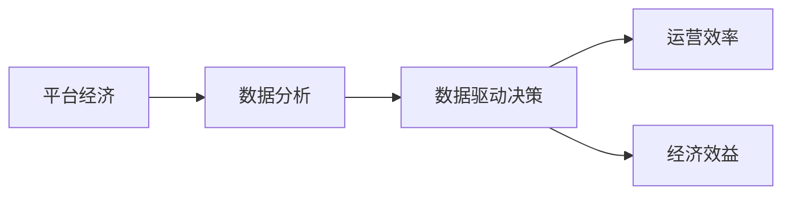

                 

## 1. 背景介绍

在数字化转型的时代背景下，平台经济正在迅速崛起，成为推动全球经济增长的重要引擎。然而，随着平台规模的不断扩大，数据量也呈现爆炸式增长，如何从海量数据中提取有价值的洞察，提升运营效率和市场效益，成为了各大平台亟待解决的核心问题。本文旨在通过探讨数据分析在平台经济中的应用，揭示如何利用数据驱动的方式，优化决策过程，释放平台潜能，创造更大的社会和经济价值。

## 2. 核心概念与联系

### 2.1 核心概念概述

在进行数据分析的具体应用之前，我们首先需要对以下几个核心概念进行理解：

- **平台经济**：指以互联网为基础，通过提供连接供需双方的在线平台，实现资源的高效配置和共享的经济模式。
- **数据分析**：指通过对数据进行收集、清洗、分析和可视化，从中提取有用信息的过程。
- **数据驱动决策**：基于数据分析结果进行业务决策，优化运营策略，提升用户体验和经济效益。
- **效率和效益**：在平台运营中，效率通常指单位时间内的产出或完成率，而效益则是指投入与产出之比，即最大化的经济效益和社会价值。

这些概念之间的联系可以简要描述如下：在平台经济中，数据分析作为核心驱动力，通过挖掘和分析用户行为、市场趋势、运营数据等，帮助平台优化资源配置，提高运营效率，最终提升整体效益。

### 2.2 概念间的关系

以下使用Mermaid流程图来展示这些概念之间的联系：



这个流程图表明，数据分析通过驱动决策来提升运营效率和经济效益，构成了平台经济的循环发展机制。

## 3. 核心算法原理 & 具体操作步骤

### 3.1 算法原理概述

在平台经济中，数据分析的算法原理主要包括以下几个方面：

1. **数据收集与清洗**：首先，需要对平台运营中的各类数据进行收集，并对数据进行清洗和处理，确保数据质量。
2. **特征工程**：通过分析数据特征，构建适用于机器学习模型的特征集，提升模型预测能力。
3. **机器学习模型**：选择适合的机器学习算法，如回归分析、分类、聚类、关联规则等，对数据进行分析。
4. **模型评估与优化**：评估模型性能，并进行优化调整，确保模型预测结果的准确性。
5. **可视化分析**：将分析结果以图表形式呈现，帮助业务决策者理解数据背后的故事和趋势。

### 3.2 算法步骤详解

基于上述算法原理，平台数据分析的具体操作步骤如下：

1. **需求分析**：明确数据分析的目标和需求，如用户行为分析、市场趋势预测、运营效率优化等。
2. **数据收集**：从平台日志、用户反馈、市场数据等渠道收集相关数据。
3. **数据预处理**：清洗数据，处理缺失值、异常值，进行归一化、标准化等处理。
4. **特征工程**：根据需求选择或构建特征，如时间特征、用户特征、行为特征等。
5. **模型选择与训练**：选择适合的机器学习模型，使用训练数据集进行模型训练。
6. **模型评估**：使用测试数据集评估模型性能，如准确率、召回率、F1分数等。
7. **结果解读与行动**：根据分析结果，制定行动计划，优化运营策略，提升用户体验和市场效益。

### 3.3 算法优缺点

**优点**：
- **提升决策质量**：通过数据分析，平台可以更加客观、科学的进行决策，减少主观因素影响。
- **优化运营效率**：数据分析可以揭示运营过程中的瓶颈和问题，帮助平台优化资源配置和流程。
- **创造经济效益**：基于数据驱动的优化，平台可以降低成本，增加收入，提升整体效益。

**缺点**：
- **数据隐私问题**：大量数据收集和分析可能涉及用户隐私问题，需要严格遵守相关法律法规。
- **技术复杂性**：数据分析涉及复杂的技术工具和算法，对团队技术水平要求较高。
- **数据质量和一致性**：数据收集和处理的准确性对分析结果有直接影响，需要持续维护数据质量。

### 3.4 算法应用领域

数据分析在平台经济中的应用领域广泛，主要包括：

- **用户行为分析**：通过分析用户行为数据，了解用户偏好和需求，优化产品和服务。
- **市场趋势预测**：基于历史和实时数据，预测市场趋势，指导产品开发和市场策略。
- **运营效率优化**：分析运营数据，识别效率低下的环节，进行流程优化。
- **风险管理**：通过数据分析，预测和监控潜在的风险，采取预防措施。
- **个性化推荐**：利用用户数据和行为特征，提供个性化推荐，提升用户粘性和满意度。

## 4. 数学模型和公式 & 详细讲解

### 4.1 数学模型构建

在平台经济中，数据分析的主要数学模型包括：

- **回归模型**：用于预测连续型变量的值，如价格预测、用户转化率等。
- **分类模型**：用于分类离散型变量，如用户标签、用户流失概率等。
- **聚类模型**：用于识别数据中的群体，如用户分群、市场细分等。
- **关联规则模型**：用于发现数据中的频繁项集，如购物篮分析、交叉销售等。

### 4.2 公式推导过程

以线性回归模型为例，推导其基本公式和关键步骤：

假设有一组数据集 $(x_1, y_1), (x_2, y_2), ..., (x_n, y_n)$，其中 $x$ 为自变量，$y$ 为因变量，目标是找到一个线性模型 $y = \beta_0 + \beta_1 x + \epsilon$，其中 $\beta_0$ 和 $\beta_1$ 为模型参数，$\epsilon$ 为误差项。

根据最小二乘法，目标是最小化残差平方和 $\sum_{i=1}^n (y_i - \hat{y}_i)^2$，其中 $\hat{y}_i = \beta_0 + \beta_1 x_i$。通过求导，可以得到：

$$
\frac{\partial}{\partial \beta_0} \sum_{i=1}^n (y_i - \hat{y}_i)^2 = -2\sum_{i=1}^n (y_i - \hat{y}_i)
$$

$$
\frac{\partial}{\partial \beta_1} \sum_{i=1}^n (y_i - \hat{y}_i)^2 = -2\sum_{i=1}^n (x_i - \bar{x})(y_i - \hat{y}_i)
$$

解上述方程组，可以得到：

$$
\beta_0 = \bar{y} - \beta_1 \bar{x}
$$

$$
\beta_1 = \frac{\sum_{i=1}^n (x_i - \bar{x})(y_i - \bar{y})}{\sum_{i=1}^n (x_i - \bar{x})^2}
$$

这就是线性回归模型的基本公式。

### 4.3 案例分析与讲解

以一个电商平台为例，平台可以通过分析历史订单数据，构建线性回归模型预测未来的销售量。具体步骤如下：

1. **数据收集**：从平台订单系统收集历史订单数据，包括订单时间、订单金额、订单量等。
2. **数据清洗**：处理缺失值、异常值，进行归一化处理。
3. **特征工程**：选取订单时间、季节、节假日等特征。
4. **模型训练**：使用训练集训练线性回归模型，预测未来的订单量。
5. **模型评估**：使用测试集评估模型性能，如均方误差。
6. **结果解读**：根据预测结果，调整库存和采购策略，提升运营效率。

## 5. 项目实践：代码实例和详细解释说明

### 5.1 开发环境搭建

为了进行数据分析，我们需要搭建一个适合的数据分析环境。以下是具体的搭建步骤：

1. **安装Python**：Python是数据分析的主流语言，需先安装Python 3.x版本。
2. **安装相关库**：安装必要的Python库，如NumPy、Pandas、Matplotlib、Scikit-learn等。
3. **配置开发环境**：可以使用Jupyter Notebook或PyCharm等IDE进行数据分析开发。

### 5.2 源代码详细实现

以下是一个简单的数据分析代码实例，使用Python和Pandas库进行数据处理和分析：

```python
import pandas as pd

# 读取数据
data = pd.read_csv('sales_data.csv')

# 数据清洗
data.dropna(inplace=True)

# 特征工程
data['season'] = data['date'].dt.month // 3 + 1
data['holiday'] = data['date'].dt.dayofyear // 30
data['weekday'] = data['date'].dt.weekday // 5 + 1

# 模型训练
from sklearn.linear_model import LinearRegression
model = LinearRegression()
model.fit(data[['season', 'holiday', 'weekday']], data['sales'])

# 模型评估
from sklearn.metrics import mean_squared_error
y_pred = model.predict(data[['season', 'holiday', 'weekday']])
mse = mean_squared_error(data['sales'], y_pred)
print(f'Mean Squared Error: {mse}')
```

### 5.3 代码解读与分析

这段代码通过Pandas库读取订单数据，进行数据清洗和特征工程，然后使用Scikit-learn库的线性回归模型进行训练和评估。

- `pd.read_csv`：读取数据集。
- `data.dropna`：处理缺失值。
- `data[['season', 'holiday', 'weekday']]`：选取模型所需的特征。
- `model.fit`：训练线性回归模型。
- `mean_squared_error`：计算模型预测误差。

### 5.4 运行结果展示

运行上述代码后，可以得到模型预测误差，用于评估模型性能。

## 6. 实际应用场景

### 6.1 电商平台的用户行为分析

电商平台可以通过数据分析，了解用户的购买行为和偏好，优化产品推荐和促销策略。例如，平台可以根据用户的历史浏览记录和购买行为，构建用户画像，预测其未来的购买意向，从而实现精准推荐。

### 6.2 旅游平台的用户体验优化

旅游平台可以通过数据分析，优化用户体验，提高用户满意度和忠诚度。例如，平台可以分析用户的旅游行为数据，发现用户在不同景点停留的时间、喜欢的旅游类型等，从而提供个性化的旅游推荐和行程安排。

### 6.3 社交平台的内容推荐

社交平台可以通过数据分析，优化内容推荐算法，提升用户互动率和平台活跃度。例如，平台可以根据用户的历史浏览和互动数据，发现用户喜欢的内容类型和话题，从而实现个性化的内容推荐。

## 7. 工具和资源推荐

### 7.1 学习资源推荐

以下是几本优秀的数据分析书籍，值得推荐：

1. 《Python数据分析实战》：通过具体案例讲解Python数据分析的实用技巧。
2. 《R语言实战》：详细介绍R语言的数据分析和可视化功能。
3. 《机器学习实战》：讲解机器学习算法及其在数据分析中的应用。
4. 《深入理解统计学》：介绍统计学原理和数据分析方法。

### 7.2 开发工具推荐

以下是几款常用的数据分析开发工具：

1. Jupyter Notebook：开源的交互式开发环境，支持多种编程语言和库。
2. PyCharm：专业的Python IDE，提供丰富的功能和工具。
3. RStudio：专门为R语言设计的开发环境，提供数据可视化和脚本编写功能。
4. Tableau：数据可视化工具，支持快速数据连接和交互式分析。

### 7.3 相关论文推荐

以下是几篇经典的数据分析论文，值得深入学习：

1. 《A Survey on Data Mining Techniques》：全面回顾数据挖掘技术的发展历程和应用。
2. 《Machine Learning Yearning》：Andrew Ng关于机器学习应用的指南，涵盖数据分析、模型选择和评估等。
3. 《Data-Driven Decision Making in Retail》：讨论大数据分析在零售行业的具体应用。
4. 《Predictive Analytics for Business》：介绍预测分析在商业决策中的应用。

## 8. 总结：未来发展趋势与挑战

### 8.1 研究成果总结

数据分析在平台经济中已经取得了显著成果，提升了运营效率和市场效益。然而，数据驱动决策仍然面临一些挑战，如数据隐私问题、技术复杂性、数据质量等。

### 8.2 未来发展趋势

未来，数据分析在平台经济中的应用将更加深入和广泛，主要趋势包括：

1. **数据融合与协同**：不同平台之间的数据融合，可以提升整体分析能力和决策效果。
2. **实时数据分析**：利用流式计算和大数据技术，实现实时数据分析和反馈。
3. **多模态数据分析**：结合文本、图像、音频等多种数据类型，进行综合分析。
4. **深度学习与AI**：引入深度学习和人工智能技术，提升数据分析的准确性和自动化程度。

### 8.3 面临的挑战

尽管数据分析在平台经济中具有重要价值，但仍需面对以下挑战：

1. **数据隐私与安全**：大量数据收集和分析可能涉及用户隐私，需严格遵守法律法规。
2. **数据质量和一致性**：数据收集和处理过程中的准确性对分析结果有直接影响。
3. **技术门槛**：数据分析涉及复杂的技术工具和算法，对团队技术水平要求较高。

### 8.4 研究展望

未来，数据分析在平台经济中的应用需不断突破技术瓶颈，提升数据质量和分析效果。具体研究展望包括：

1. **数据隐私保护**：研究如何在保护用户隐私的同时，充分利用数据进行决策。
2. **多源数据融合**：研究如何高效融合不同来源的数据，提升综合分析能力。
3. **自动化与智能化**：研究如何引入自动化和智能化技术，提升数据分析的效率和准确性。

## 9. 附录：常见问题与解答

**Q1：数据分析在平台经济中具体有哪些应用？**

A: 数据分析在平台经济中有很多具体应用，包括用户行为分析、市场趋势预测、运营效率优化、风险管理、个性化推荐等。这些应用能够帮助平台优化决策，提升用户体验和市场效益。

**Q2：如何进行有效的数据清洗和预处理？**

A: 数据清洗和预处理是数据分析的重要环节，具体方法包括：
1. 处理缺失值和异常值。
2. 归一化和标准化处理。
3. 特征选择和构造。

**Q3：如何选择合适的机器学习模型？**

A: 选择合适的机器学习模型需要根据具体问题进行判断，常见的选择方法包括：
1. 理解问题的本质和类型（回归、分类、聚类等）。
2. 评估数据特征和分布。
3. 尝试多种模型，比较其性能和复杂度。

**Q4：数据分析在平台经济中面临哪些挑战？**

A: 数据分析在平台经济中面临的挑战包括：
1. 数据隐私问题。
2. 数据质量和一致性。
3. 技术复杂性。

**Q5：未来数据分析在平台经济中的发展方向是什么？**

A: 未来数据分析在平台经济中的发展方向包括：
1. 数据融合与协同。
2. 实时数据分析。
3. 多模态数据分析。
4. 深度学习和AI的应用。

**Q6：如何保障数据分析中的数据隐私和安全？**

A: 保障数据分析中的数据隐私和安全，需要：
1. 遵循相关法律法规。
2. 使用数据脱敏和加密技术。
3. 控制数据访问权限。

---
作者：禅与计算机程序设计艺术 / Zen and the Art of Computer Programming

