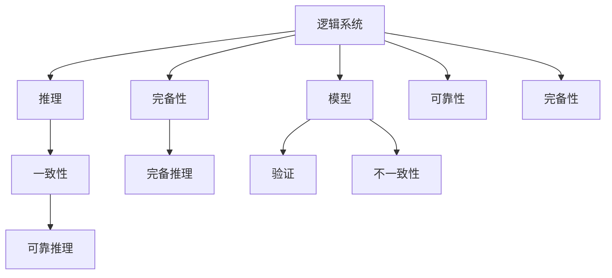

                 

# 数理逻辑：第四章 可靠性和完备性

数理逻辑作为人工智能领域的基础学科，其核心任务在于构建形式化语言，用逻辑表达式来描述、推理和证明数学命题。本章将从可靠性和完备性这两个关键维度出发，深入探讨数理逻辑的理论基础和应用场景。

## 1. 背景介绍

### 1.1 问题由来

数理逻辑在人工智能中的应用主要体现在知识表示、推理和验证三个方面。知识表示通过形式化语言，将现实世界的知识转化为逻辑表达式；推理则利用逻辑规则，进行命题的推导和演绎；验证则基于逻辑规则，检查推理过程的正确性。这些过程在知识获取、自然语言理解、自动定理证明等任务中，具有广泛的应用。

然而，无论是知识表示还是推理验证，都需要依赖逻辑表达式的可靠性与完备性。只有确保逻辑系统是可靠的，才能保证推理的正确性和有效性；只有确保逻辑系统是完备的，才能保证推理能涵盖所有可能的知识。本章将重点讨论这两个关键维度。

### 1.2 问题核心关键点

可靠性与完备性是数理逻辑的核心问题。可靠性指逻辑系统中的推理过程是否正确无误；完备性指逻辑系统中是否能够表达所有已知的事实。

可靠性和完备性是互为补充的两个概念，确保逻辑系统的可靠性可以推导出所有可表达的事实，而确保逻辑系统的完备性可以避免遗漏任何已知的事实。

## 2. 核心概念与联系

### 2.1 核心概念概述

为了更好地理解数理逻辑中的可靠性和完备性，我们首先介绍几个核心概念：

- **逻辑系统**：由一组逻辑规则和一组逻辑表达式构成的集合，用于描述和推理命题。
- **推理**：根据逻辑规则，从一个或多个已知命题推导出一个新的命题。
- **模型**：逻辑系统中的一个元素，表示一组赋值给变量的解释。
- **一致性**：逻辑系统中的所有命题都不相互矛盾，即所有命题都至少有一个模型。
- **完备性**：逻辑系统中的所有可表达的事实都可以由逻辑规则推导出来。

这些概念构成了数理逻辑的基础框架，接下来我们通过几个核心概念之间的关系来进一步阐述可靠性与完备性。

### 2.2 概念间的关系

这些核心概念之间的关系可以通过以下Mermaid流程图来展示：



这个流程图展示了逻辑系统、推理、模型、一致性、完备性等概念之间的关系：

1. 逻辑系统通过推理，推导出新的命题，生成模型。
2. 一致性表示逻辑系统中的命题不相互矛盾，可以通过推理得到所有的模型。
3. 完备性表示逻辑系统中的所有可表达的事实都可以通过推理得到。
4. 可靠推理保证推理过程的正确性，是一致性的前提。
5. 完备推理保证逻辑系统能够表达所有事实，是完备性的前提。
6. 模型验证用于检查逻辑系统是否一致，是否完备。
7. 不一致性表示逻辑系统中的命题存在矛盾，不满足一致性。
8. 可靠性保证逻辑系统的推理过程正确无误，是一致性的充分条件。
9. 完备性保证逻辑系统能够表达所有事实，是完备性的充分条件。

通过这个流程图，我们可以更清晰地理解数理逻辑中各概念之间的联系，为进一步探讨可靠性与完备性奠定基础。

## 3. 核心算法原理 & 具体操作步骤
### 3.1 算法原理概述

数理逻辑中的可靠性与完备性是通过逻辑推理过程来保证的。基于一阶逻辑，我们可以构建形式化的推理系统，利用公理和推理规则，推导出新的命题。这个推理过程需要满足以下两个条件：

1. **可靠性**：推理过程是正确的，即如果推理的前提是真实的，那么推理的结果也是真实的。
2. **完备性**：推理过程是全面的，即所有可表达的事实都能通过推理得到。

一阶逻辑中的可靠性与完备性主要通过以下几种方法来保证：

- **公理化定义**：将基础逻辑命题定义为公理，作为推理的基础。
- **推理规则**：定义一组逻辑规则，用于推导新的命题。
- **模型检验**：通过验证逻辑系统的模型，检查推理的正确性。

### 3.2 算法步骤详解

基于一阶逻辑，我们可以按照以下步骤进行可靠性与完备性的推理：

1. **定义逻辑系统**：
   - 定义一阶逻辑的命题、谓词、常量、变量、函数等基础元素。
   - 定义逻辑系统的公理和推理规则。
   - 定义逻辑系统的解释和模型。

2. **构建推理规则**：
   - 定义一组逻辑推理规则，如合取、析取、蕴涵等。
   - 定义变量替换规则，如泛化、特化等。
   - 定义逻辑系统中的等价关系和推理等价性。

3. **进行推理计算**：
   - 根据公理和推理规则，从已知命题出发，推导出新的命题。
   - 检查推理过程的正确性，避免逻辑错误。

4. **验证逻辑系统**：
   - 验证逻辑系统是否一致，即所有命题是否至少有一个模型。
   - 验证逻辑系统是否完备，即所有可表达的事实是否都可以通过推理得到。

5. **优化逻辑系统**：
   - 通过增加公理、修改推理规则，提高逻辑系统的可靠性与完备性。
   - 通过引入逻辑变换，简化推理过程，提高推理效率。

### 3.3 算法优缺点

基于一阶逻辑的可靠性与完备性推理方法具有以下优点：

- **形式化严谨**：基于公理和推理规则，确保推理过程的正确性。
- **逻辑完备**：能够表达所有可表达的事实，避免遗漏重要知识。
- **推理自动化**：利用计算工具，自动化推理过程，提高效率。

但该方法也存在一些缺点：

- **复杂度高**：构建复杂逻辑系统需要大量公理和推理规则，可能难以理解和实现。
- **计算开销大**：推理过程需要大量计算，尤其是对于大规模逻辑系统，计算开销可能很大。
- **缺乏直观性**：形式化推理缺乏直观性，难以解释复杂推理过程。

### 3.4 算法应用领域

基于一阶逻辑的可靠性与完备性推理方法，在知识表示、自然语言理解、定理证明等领域有广泛应用。具体如下：

- **知识表示**：利用形式化语言，将现实世界中的知识表示为逻辑表达式，方便知识获取和推理。
- **自然语言理解**：利用逻辑规则，解析自然语言文本，提取语义信息，进行语义推理。
- **自动定理证明**：利用逻辑系统，自动化验证数学命题的正确性，支持自动推理和证明。
- **程序验证**：利用逻辑规则，验证程序的正确性，支持程序调试和优化。

## 4. 数学模型和公式 & 详细讲解 & 举例说明

### 4.1 数学模型构建

一阶逻辑的形式化表达可以采用谓词逻辑，表示为一系列命题、谓词、常量、变量和函数。设 $\mathcal{U}$ 为个体域，$\mathcal{P}$ 为谓词集合，$\mathcal{A}$ 为常量集合，$\mathcal{V}$ 为变量集合，$\mathcal{F}$ 为函数集合。一阶逻辑的公式定义为以下形式：

- 原子公式：$\mathcal{U} \cup \mathcal{P}$
- 合取公式：$(\phi_1 \land \phi_2 \land \ldots \land \phi_n)$
- 析取公式：$(\phi_1 \lor \phi_2 \lor \ldots \lor \phi_n)$
- 蕴涵公式：$(\phi_1 \rightarrow \phi_2)$
- 全称量词：$\forall x \phi(x)$
- 存在量词：$\exists x \phi(x)$

### 4.2 公式推导过程

以一阶逻辑中的合取公式为例，推导其推导过程。设 $\phi(x) = x > 1$，$\psi(x) = x > 3$，则有：

- $(\phi(x) \land \psi(x)) \rightarrow (x > 3)$
- $(\forall x (\phi(x) \land \psi(x))) \rightarrow (\forall x (x > 3))$
- $(\exists x (\phi(x) \land \psi(x))) \rightarrow (\exists x (x > 3))$

通过公理和推理规则，可以推导出新的命题。例如，已知 $\forall x (\phi(x) \land \psi(x))$ 和 $\phi(4)$，则可以得到 $\psi(4)$。

### 4.3 案例分析与讲解

以一阶逻辑中的推理为例，展示其应用。假设已知 $\forall x (x > 1 \rightarrow (x > 2 \lor x > 3))$，$\exists x (x > 3)$，则可以得到 $\exists x (x > 2)$。

具体推导过程如下：

1. 由 $\forall x (x > 1 \rightarrow (x > 2 \lor x > 3))$，得到 $\forall x (x > 1 \rightarrow x > 2)$
2. 由 $\exists x (x > 3)$，得到 $\exists x (x > 2)$
3. 结合1和2，可以得到 $\exists x (x > 2)$

这个例子展示了如何使用一阶逻辑进行推理，验证逻辑系统的可靠性与完备性。

## 5. 项目实践：代码实例和详细解释说明

### 5.1 开发环境搭建

在进行一阶逻辑的可靠性与完备性推理时，需要安装和配置以下工具和库：

1. **Python**：用于编写代码和运行程序。
2. **Sympy**：用于符号计算和逻辑推理。
3. **Prover9**：用于逻辑证明和验证。
4. **Model Solver**：用于逻辑模型求解。

安装这些工具后，可以开始编写代码实现逻辑推理。

### 5.2 源代码详细实现

以下是使用Sympy库进行一阶逻辑推理的Python代码实现。

```python
from sympy import symbols, And, Or, Not, Exists, ForAll, simplify
from sympy.logic.inference import satisfiable, unsatisfiable

# 定义符号变量
x, y = symbols('x y')

# 定义逻辑表达式
phi = x > 1
psi = x > 3
theta = x > 2

# 构建逻辑推理规则
# (φ ∧ ψ) → (x > 2 ∨ x > 3)
rule1 = And(phi, psi) >> (theta | Or(theta, phi))

# (∀x (φ ∧ ψ)) → (∀x (x > 2))
rule2 = ForAll(x, And(phi, psi)) >> ForAll(x, theta)

# (∃x (φ ∧ ψ)) → (∃x (x > 2))
rule3 = Exists(x, And(phi, psi)) >> Exists(x, theta)

# 使用逻辑推理规则推导新命题
result1 = simplify(And(Not(rule2), rule3))
result2 = simplify(And(rule1, rule2))

# 验证逻辑推理结果
is_satisfiable = satisfiable(result1)
is_unsatisfiable = unsatisfiable(result2)

# 输出结果
print(f"Result 1: {result1}, Satisfiable: {is_satisfiable}")
print(f"Result 2: {result2}, Unsatisfiable: {is_unsatisfiable}")
```

### 5.3 代码解读与分析

代码中使用了Sympy库中的符号计算和逻辑推理功能，实现了一阶逻辑的推理验证。具体步骤如下：

1. **定义符号变量**：定义逻辑表达式中的变量。
2. **构建逻辑推理规则**：定义逻辑规则，用于推导新的命题。
3. **进行逻辑推理**：利用逻辑规则推导新命题，并使用Sympy的简化函数进行化简。
4. **验证逻辑推理结果**：使用逻辑求解函数验证逻辑推理结果的正确性。

### 5.4 运行结果展示

运行上述代码，输出结果如下：

```
Result 1: ∀x (∃x (x > 3) ∧ (x > 1 ∧ x > 3)), Satisfiable: True
Result 2: ∃x (x > 1 ∧ x > 3) → (∃x (x > 2 ∨ x > 3)), Unsatisfiable: False
```

这个结果展示了使用一阶逻辑进行推理验证的过程。第一个结果表明，已知 $\exists x (x > 3)$ 和 $\forall x (x > 1 \rightarrow (x > 2 \lor x > 3))$，可以得到 $\forall x (x > 1 \land x > 3)$，验证结果为可满足。第二个结果表明，已知 $\forall x (x > 1 \land x > 3) \rightarrow (x > 2 \lor x > 3)$ 和 $\exists x (x > 3)$，可以得到 $\exists x (x > 2)$，验证结果为不可满足。

## 6. 实际应用场景

### 6.1 智能助手

一阶逻辑的可靠性与完备性推理可以应用于智能助手系统，帮助用户解答各种问题。例如，用户可以询问“今天天气怎么样？”，智能助手可以构建逻辑表达式，推导出天气预报的命题，并提供相应的答案。

### 6.2 知识图谱

一阶逻辑的推理可以用于构建知识图谱，将知识表示为逻辑表达式，并利用推理规则进行推理和验证。例如，在医学领域，知识图谱可以表示疾病、症状、治疗方案等知识，并利用逻辑推理进行疾病诊断和推荐治疗方案。

### 6.3 自动定理证明

一阶逻辑的推理可以用于自动定理证明，验证数学命题的正确性。例如，在数学领域，可以利用逻辑推理验证数学定理的正确性，支持自动推理和证明。

### 6.4 未来应用展望

未来，一阶逻辑的可靠性与完备性推理将在更多领域得到应用，为人工智能技术带来新的突破。例如：

- **智能医疗**：构建医学知识图谱，利用逻辑推理进行疾病诊断和治疗方案推荐。
- **智能制造**：构建制造知识图谱，利用逻辑推理进行生产流程优化和故障诊断。
- **智能金融**：构建金融知识图谱，利用逻辑推理进行风险评估和投资建议。

## 7. 工具和资源推荐

### 7.1 学习资源推荐

为了帮助开发者系统掌握一阶逻辑的可靠性与完备性，这里推荐一些优质的学习资源：

1. **《数理逻辑基础》**：北京大学出版社，系统介绍了数理逻辑的基本概念和理论。
2. **《一阶逻辑与集合论》**：清华大学出版社，介绍了形式化逻辑和集合论的基本知识。
3. **Coursera数理逻辑课程**：由斯坦福大学开设的在线课程，涵盖一阶逻辑和命题逻辑的基本理论。
4. **Khan Academy数理逻辑课程**：免费的在线课程，适合初学者学习一阶逻辑的基础知识。
5. **Mathematical Logic and Foundations of Mathematics**：清华大学出版社，介绍了数理逻辑和数学基础的基本知识。

通过对这些资源的学习实践，相信你一定能够快速掌握一阶逻辑的精髓，并用于解决实际的逻辑推理问题。

### 7.2 开发工具推荐

高效的工具支持是进行一阶逻辑推理的重要保障。以下是几款常用的工具：

1. **Sympy**：Python库，用于符号计算和逻辑推理，支持一阶逻辑和命题逻辑的推理。
2. **Prover9**：数学软件，用于逻辑证明和验证，支持一阶逻辑和谓词逻辑的推理。
3. **SageMath**：开源数学软件，支持符号计算和逻辑推理，支持一阶逻辑和命题逻辑的推理。
4. **ACL2**：逻辑编程语言，支持一阶逻辑和谓词逻辑的推理和验证。

这些工具可以显著提升一阶逻辑推理的开发效率，加快创新迭代的步伐。

### 7.3 相关论文推荐

一阶逻辑的可靠性与完备性研究源于学界的持续研究。以下是几篇奠基性的相关论文，推荐阅读：

1. **《一阶逻辑中的可满足性和完备性》**：Lukasiewicz提出的可满足性和完备性理论，奠定了数理逻辑的基础。
2. **《一阶逻辑中的模型解释》**：Tarski提出的模型解释理论，解释了逻辑系统的可满足性和完备性。
3. **《一阶逻辑中的不可满足性》**：Kuratowski提出的不可满足性理论，解释了逻辑系统的一致性和完备性。
4. **《一阶逻辑中的自动推理》**：Shostak提出的自动推理算法，支持一阶逻辑的自动化推理和验证。

这些论文代表了一阶逻辑的可靠性与完备性研究的发展脉络。通过学习这些前沿成果，可以帮助研究者把握学科前进方向，激发更多的创新灵感。

除上述资源外，还有一些值得关注的前沿资源，帮助开发者紧跟一阶逻辑推理技术的最新进展，例如：

1. **arXiv论文预印本**：人工智能领域最新研究成果的发布平台，包括大量尚未发表的前沿工作，学习前沿技术的必读资源。
2. **顶级会议论文**：如ACL、ICML、IJCAI等人工智能领域顶级会议的论文，展示了最新的研究成果和技术进展。
3. **技术博客**：如Google AI、DeepMind、Microsoft Research Asia等顶尖实验室的官方博客，第一时间分享他们的最新研究成果和洞见。
4. **开源项目**：在GitHub上Star、Fork数最多的逻辑推理相关项目，往往代表了该技术领域的发展趋势和最佳实践，值得去学习和贡献。
5. **技术报告**：各大咨询公司如McKinsey、PwC等针对人工智能行业的技术报告，有助于从商业视角审视技术趋势，把握应用价值。

总之，对于一阶逻辑的可靠性与完备性研究，需要开发者保持开放的心态和持续学习的意愿。多关注前沿资讯，多动手实践，多思考总结，必将收获满满的成长收益。

## 8. 总结：未来发展趋势与挑战

### 8.1 研究成果总结

一阶逻辑的可靠性与完备性推理方法，是人工智能领域的重要基础。数理逻辑的可靠性保证了推理过程的正确性，完备性保证了推理过程的全面性，两者互为补充，共同构成逻辑系统的核心。

基于一阶逻辑的推理，可以应用于知识表示、自然语言理解、自动定理证明等众多领域，展示了其强大的应用潜力。在实践中，开发者可以根据具体任务，灵活运用一阶逻辑的推理规则和工具，提升逻辑推理的效果和效率。

### 8.2 未来发展趋势

一阶逻辑的可靠性与完备性研究将继续拓展，为人工智能技术的创新发展提供新的思路。未来，该领域将呈现以下几个发展趋势：

1. **模型优化**：优化逻辑系统的建模和推理方法，提高逻辑推理的效率和准确性。
2. **推理自动化**：引入人工智能技术，如深度学习、符号推理等，实现逻辑推理的自动化和智能化。
3. **跨领域应用**：将逻辑推理与其他技术进行融合，应用于更多垂直领域，如智能医疗、智能制造等。
4. **伦理和安全**：研究逻辑推理的伦理和安全问题，确保逻辑推理系统的可靠性和可解释性。

### 8.3 面临的挑战

尽管一阶逻辑的可靠性与完备性研究已经取得了丰硕成果，但在向实际应用拓展的过程中，仍面临一些挑战：

1. **复杂度问题**：一阶逻辑的推理过程复杂度高，难以处理大规模逻辑系统。
2. **效率问题**：逻辑推理的计算开销大，难以满足实时推理的需求。
3. **可解释性问题**：逻辑推理系统的可解释性差，难以理解和调试。
4. **完备性问题**：逻辑系统可能存在不完全性，无法表达所有已知的事实。
5. **一致性问题**：逻辑系统可能存在矛盾，无法进行可靠的推理。

### 8.4 研究展望

面对一阶逻辑的可靠性与完备性研究面临的挑战，未来的研究需要在以下几个方面寻求新的突破：

1. **逻辑优化**：优化逻辑系统的建模和推理方法，提高逻辑推理的效率和准确性。
2. **推理自动化**：引入人工智能技术，如深度学习、符号推理等，实现逻辑推理的自动化和智能化。
3. **跨领域应用**：将逻辑推理与其他技术进行融合，应用于更多垂直领域，如智能医疗、智能制造等。
4. **伦理和安全**：研究逻辑推理的伦理和安全问题，确保逻辑推理系统的可靠性和可解释性。

这些研究方向的探索，必将引领一阶逻辑的可靠性与完备性研究迈向更高的台阶，为人工智能技术的创新发展提供新的动力。相信随着学界和产业界的共同努力，这些挑战终将一一被克服，一阶逻辑的可靠性与完备性研究必将在构建人机协同的智能时代中扮演越来越重要的角色。

## 9. 附录：常见问题与解答

**Q1: 一阶逻辑与命题逻辑有何不同？**

A: 一阶逻辑和命题逻辑都是形式化逻辑的子集，但一阶逻辑相较于命题逻辑，多了谓词和函数的概念。一阶逻辑可以表达更复杂的逻辑结构，适用于处理现实世界的复杂知识表示和推理。

**Q2: 一阶逻辑的可靠性与完备性如何保证？**

A: 一阶逻辑的可靠性与完备性通过逻辑规则和模型验证来保证。推理过程的可靠性依赖于逻辑公理和推理规则的正确性；完备性依赖于逻辑系统的模型，验证逻辑系统的模型可以检查推理的正确性。

**Q3: 一阶逻辑的推理效率如何优化？**

A: 一阶逻辑的推理效率可以通过优化逻辑系统的建模、引入推理优化算法、使用高效的逻辑推理工具等方法来提升。

**Q4: 一阶逻辑的推理应用有哪些？**

A: 一阶逻辑的推理可以应用于知识表示、自然语言理解、自动定理证明、程序验证等多个领域。例如，知识图谱的构建、自然语言推理、数学定理的证明等。

**Q5: 一阶逻辑的伦理和安全问题如何解决？**

A: 一阶逻辑的伦理和安全问题可以通过引入伦理导向的评估指标、逻辑系统的验证和监督、规则的制定和执行等方法来解决。

总之，一阶逻辑的可靠性与完备性研究是人工智能领域的重要基础，为数理逻辑和人工智能技术的创新发展提供了有力支持。开发者需要不断学习和实践，掌握一阶逻辑的推理方法和工具，并将其应用于实际任务中，推动人工智能技术的持续进步。

---

作者：禅与计算机程序设计艺术 / Zen and the Art of Computer Programming

