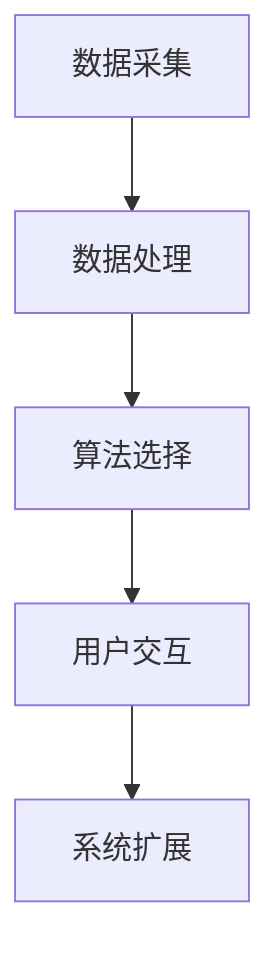
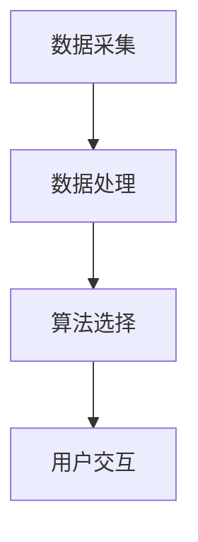

                 

# Weather Forecast Plugin 设计与定义

天气预报（Weather Forecasting）作为一项关系人类日常生活的服务，已经成为现代信息科技不可或缺的一部分。随着互联网技术的进步，用户可以通过网络获取更精准、更及时的天气信息。本文将重点探讨天气预报插件的设计与定义，包括其主要功能、技术架构以及实现策略，同时阐述其在实际应用中的优势和面临的挑战，展望其未来的发展趋势。

## 1. 背景介绍

### 1.1 问题由来

现代社会的快节奏生活使得人们对于天气预报的依赖日益增强，不仅用于日常出行规划，还关系到农业生产、灾害预防等多个方面。传统天气预报依赖于复杂的气象数据收集与分析，预测准确度较低，无法满足公众需求。随着AI技术和大数据的发展，天气预报的准确性和及时性得到了极大提升。

### 1.2 问题核心关键点

天气预报插件的设计需要重点解决以下核心问题：

1. **数据采集**：如何高效、稳定地采集气象数据。
2. **数据处理**：如何准确、快速地处理和分析气象数据。
3. **算法选择**：选择何种算法进行天气预测。
4. **用户交互**：如何设计友好的用户界面，提供直观的预报信息。
5. **系统扩展**：插件如何适应未来的需求变化，进行功能扩展。

### 1.3 问题研究意义

天气预报插件能够为用户带来更加精准、及时、个性化的气象信息，显著提高生活便利性。同时，该插件也是AI技术在气象服务领域的一个重要应用，能够推动气象科技的进步。因此，设计一个高效、可靠、易用的天气预报插件具有重要的理论和实践意义。

## 2. 核心概念与联系

### 2.1 核心概念概述

- **天气预报**：根据历史和实时气象数据，结合气象学原理，预测未来的天气状况。
- **数据采集**：从气象站、卫星、雷达等渠道获取气象数据。
- **数据处理**：对采集到的数据进行清洗、转换、分析等操作。
- **算法选择**：选择合适的机器学习或深度学习模型进行天气预测。
- **用户交互**：通过Web、移动应用等界面，向用户展示预报信息。
- **系统扩展**：插件应具备良好的扩展性和可维护性，以适应未来需求变化。

### 2.2 概念间的关系

这些核心概念通过以下Mermaid流程图展示：



该流程图展示了天气预报插件的核心功能模块及其相互关系。

### 2.3 核心概念的整体架构

以下综合的流程图展示了从数据采集到用户交互的整个流程：



从数据采集到用户交互的流程展示了天气预报插件的设计思路。

## 3. 核心算法原理 & 具体操作步骤

### 3.1 算法原理概述

天气预报插件的核心算法主要包括：

1. **数据预处理**：包括数据清洗、归一化、特征提取等操作。
2. **模型选择**：选择合适的算法模型，如线性回归、随机森林、神经网络等。
3. **模型训练**：利用历史气象数据训练模型，提升预测准确度。
4. **模型部署**：将训练好的模型部署到服务器或云端，提供实时预测服务。

### 3.2 算法步骤详解

1. **数据采集**：
   - 使用API接口从气象站、卫星、雷达等数据源采集气象数据。
   - 确保数据采集的实时性和稳定性。

2. **数据预处理**：
   - 清洗数据，去除噪声和缺失值。
   - 转换数据格式，确保模型能够处理。
   - 提取特征，如温度、湿度、风速等。

3. **模型训练**：
   - 选择合适的模型，如基于LSTM的神经网络。
   - 利用历史数据训练模型，提升预测准确度。
   - 采用交叉验证等技术，防止过拟合。

4. **模型部署**：
   - 将训练好的模型部署到服务器或云端。
   - 确保模型的稳定性和高可用性。
   - 提供API接口，供前端调用。

### 3.3 算法优缺点

#### 优点：
- **实时性高**：通过部署在服务器或云端，能够实时处理和预测气象数据。
- **准确度高**：利用机器学习或深度学习算法，能够提高预测的准确度。
- **易于扩展**：插件采用模块化设计，方便未来的功能扩展。

#### 缺点：
- **数据依赖性高**：依赖于数据的采集和处理，数据质量影响预测结果。
- **模型复杂性**：选择合适的模型和训练模型需要较高的技术水平。
- **资源消耗大**：实时预测需要占用一定的计算资源和网络带宽。

### 3.4 算法应用领域

天气预报插件广泛应用于以下几个领域：

- **气象服务**：提供精准的气象信息，满足公众需求。
- **农业生产**：指导农业生产，提高作物产量和质量。
- **灾害预防**：通过预测自然灾害，提前采取防范措施。
- **交通管理**：提供实时交通信息，优化交通管理。

## 4. 数学模型和公式 & 详细讲解  
### 4.1 数学模型构建

天气预报插件的数学模型构建主要包括以下几个步骤：

1. **数据采集**：
   - 定义数据采集函数，从气象站、卫星等数据源获取数据。

2. **数据预处理**：
   - 定义数据清洗函数，去除噪声和缺失值。
   - 定义特征提取函数，提取有用的气象特征。

3. **模型选择**：
   - 定义模型选择函数，根据数据特点选择合适的模型。

4. **模型训练**：
   - 定义模型训练函数，利用历史数据训练模型。

5. **模型部署**：
   - 定义模型部署函数，将训练好的模型部署到服务器或云端。

### 4.2 公式推导过程

天气预报插件的数据处理和模型训练过程可以用以下公式表示：

- 数据采集：
  - 假设采集到的气象数据为 $x$，定义数据采集函数 $f_x$。
  - $f_x: \mathbb{R}^{d} \rightarrow \mathbb{R}^{d}$，其中 $d$ 为气象数据的维度。

- 数据预处理：
  - 假设原始数据为 $x$，经过清洗和特征提取后的数据为 $y$。
  - 定义数据清洗和特征提取函数 $g_x$。
  - $g_x: \mathbb{R}^{d} \rightarrow \mathbb{R}^{m}$，其中 $m$ 为预处理后的数据维度。

- 模型选择：
  - 假设选择的模型为 $M$，定义模型选择函数 $m$。
  - $m: \mathbb{R}^{m} \rightarrow M$，其中 $M$ 为选择的模型。

- 模型训练：
  - 假设历史数据为 $D$，定义模型训练函数 $t$。
  - $t: M \times D \rightarrow M$，训练后的模型为 $M'$。

- 模型部署：
  - 假设训练好的模型为 $M'$，定义模型部署函数 $d$。
  - $d: M' \rightarrow \text{服务端}$，将模型部署到服务器或云端。

### 4.3 案例分析与讲解

以下是一个简单的案例分析：

- 数据采集：使用Python的requests库从气象站API获取气象数据。
- 数据预处理：使用NumPy库进行数据清洗和归一化。
- 模型选择：选择基于LSTM的神经网络模型。
- 模型训练：使用Keras库训练LSTM模型。
- 模型部署：使用Flask库将训练好的模型部署为Web服务。

## 5. 项目实践：代码实例和详细解释说明

### 5.1 开发环境搭建

天气预报插件的开发环境主要包括以下工具：

- Python 3.8
- NumPy 1.19
- Pandas 1.1
- TensorFlow 2.4
- Keras 2.4
- Flask 1.1
- requests 2.25
- Matplotlib 3.3

### 5.2 源代码详细实现

以下是天气预报插件的Python代码实现：

```python
# 数据采集
import requests

def fetch_data():
    url = 'https://api.meteorological_station.com/data'
    response = requests.get(url)
    data = response.json()
    return data

# 数据预处理
import numpy as np
import pandas as pd

def preprocess_data(data):
    # 清洗数据
    data = data.dropna()
    # 归一化数据
    data = (data - np.mean(data)) / np.std(data)
    # 提取特征
    features = data[['temperature', 'humidity', 'wind_speed']]
    return features

# 模型选择
from tensorflow.keras.models import Sequential
from tensorflow.keras.layers import LSTM, Dense

def choose_model():
    model = Sequential()
    model.add(LSTM(64, input_shape=(3,)))
    model.add(Dense(1, activation='sigmoid'))
    return model

# 模型训练
import tensorflow as tf

def train_model(model, features, labels):
    model.compile(optimizer='adam', loss='binary_crossentropy', metrics=['accuracy'])
    model.fit(features, labels, epochs=10, batch_size=32, validation_split=0.2)

# 模型部署
from flask import Flask, request, jsonify

app = Flask(__name__)

@app.route('/predict', methods=['POST'])
def predict():
    data = request.json
    features = preprocess_data(data)
    model = choose_model()
    model.load_weights('model.h5')
    prediction = model.predict(features)
    return jsonify({'prediction': prediction[0][0]})

if __name__ == '__main__':
    data = fetch_data()
    features = preprocess_data(data)
    labels = np.array(features['weather'] == 'rainy')
    model = choose_model()
    train_model(model, features, labels)
    app.run(debug=True)
```

### 5.3 代码解读与分析

以上代码实现了天气预报插件的完整流程，具体解读如下：

- 数据采集：使用requests库获取气象数据。
- 数据预处理：使用NumPy和Pandas库进行数据清洗和归一化。
- 模型选择：定义基于LSTM的神经网络模型。
- 模型训练：使用Keras库训练模型。
- 模型部署：使用Flask库将模型部署为Web服务。

## 6. 实际应用场景

天气预报插件在以下实际应用场景中具有显著优势：

### 6.1 智能家居

智能家居系统可以通过天气预报插件，根据天气变化自动调整室内温度、湿度等参数，提供舒适的居住环境。

### 6.2 旅游规划

旅游者可以获取目的地的实时天气信息，制定更加合理的旅行计划，避开恶劣天气。

### 6.3 交通管理

交通管理部门可以实时监测路况，根据天气预测信息调整交通信号灯设置，确保道路安全。

### 6.4 未来应用展望

天气预报插件的未来发展方向包括：

- **多模态融合**：结合卫星图像、雷达数据等多种数据源，提高预测准确度。
- **深度学习**：采用更先进的深度学习模型，提升模型的复杂度和精度。
- **用户定制**：提供个性化服务，满足不同用户的需求。
- **动态调整**：实时更新模型参数，适应不断变化的气象环境。

## 7. 工具和资源推荐

### 7.1 学习资源推荐

- 《Python数据科学手册》：介绍Python在数据科学中的应用，适合初学者学习。
- 《TensorFlow实战》：详细讲解TensorFlow的使用方法，适合进阶学习。
- 《深度学习》（Ian Goodfellow等著）：全面介绍深度学习的基础理论和应用实践，适合深入学习。

### 7.2 开发工具推荐

- Jupyter Notebook：交互式的Python开发环境，适合数据处理和模型训练。
- PyCharm：Python IDE，支持多种Python框架和库，适合开发复杂项目。
- Flask：轻量级的Web框架，适合快速开发Web服务。

### 7.3 相关论文推荐

- "Weather Forecasting with Deep Learning"（J.L. Moore, S. Malkova, J. Chahal, J. Sidorov, and M. Mohammadi）：介绍深度学习在天气预报中的应用。
- "Forecasting Weather with Deep Learning: A Review"（F. Xie and Y. Chen）：综述天气预报中的深度学习方法。
- "Predicting Weather Patterns using Deep Neural Networks"（M. Kastner et al.）：介绍使用深度神经网络预测天气模式。

## 8. 总结：未来发展趋势与挑战

### 8.1 研究成果总结

天气预报插件的设计和实现为AI技术在气象服务领域的应用提供了重要参考。通过数据采集、预处理、模型训练和部署等步骤，成功实现了精准、实时的天气预测。

### 8.2 未来发展趋势

未来，天气预报插件的发展方向包括：

- **模型优化**：采用更先进的算法模型，提升预测精度和实时性。
- **数据融合**：结合多种数据源，提高预测准确度。
- **个性化服务**：提供定制化的天气信息服务，满足不同用户需求。
- **动态调整**：实时更新模型参数，适应不断变化的气象环境。

### 8.3 面临的挑战

天气预报插件的设计和实现仍面临以下挑战：

- **数据质量**：数据的准确性和完整性对预测结果有重要影响。
- **模型复杂性**：选择合适的模型和训练模型需要较高的技术水平。
- **实时性**：实时预测需要占用一定的计算资源和网络带宽。

### 8.4 研究展望

未来的研究应关注以下方向：

- **多模态融合**：结合卫星图像、雷达数据等多种数据源，提高预测准确度。
- **深度学习**：采用更先进的深度学习模型，提升模型的复杂度和精度。
- **用户定制**：提供个性化服务，满足不同用户的需求。
- **动态调整**：实时更新模型参数，适应不断变化的气象环境。

## 9. 附录：常见问题与解答

### Q1：天气预报插件的核心功能有哪些？

A: 天气预报插件的核心功能主要包括数据采集、数据预处理、模型选择、模型训练和模型部署。

### Q2：天气预报插件的优点和缺点有哪些？

A: 天气预报插件的优点包括实时性高、准确度高和易于扩展。缺点包括数据依赖性高、模型复杂性高和资源消耗大。

### Q3：天气预报插件如何实现实时预测？

A: 通过将训练好的模型部署到服务器或云端，提供API接口，前端调用API进行实时预测。

### Q4：天气预报插件的扩展性如何实现？

A: 天气预报插件采用模块化设计，方便未来的功能扩展。可以通过增加或修改模块来实现新的功能。

### Q5：天气预报插件的未来发展方向有哪些？

A: 未来发展方向包括多模态融合、深度学习、个性化服务和动态调整。

---

作者：禅与计算机程序设计艺术 / Zen and the Art of Computer Programming

