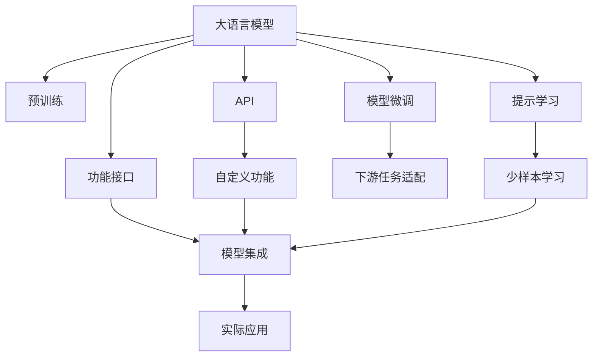

                 

# 【LangChain编程：从入门到实践】定制大模型接口

> 关键词：
- LangChain
- 大模型接口
- 自定义功能
- 功能接口
- 模型微调
- 提示学习
- 模型集成

## 1. 背景介绍

### 1.1 问题由来
随着人工智能技术的发展，大语言模型（Large Language Model, LLMs）在自然语言处理（Natural Language Processing, NLP）领域取得了显著进展。OpenAI的GPT-3、Google的BERT等模型已广泛应用于文本分类、机器翻译、问答系统等任务。但这些模型在某些特定领域的应用效果仍不尽如人意，尤其在需要定制化功能的场景下，很难满足实际需求。因此，如何定制大模型的接口，以支持特定应用场景的需求，成为当前研究的热点问题。

### 1.2 问题核心关键点
定制大模型接口，即通过编程的方式，对现有预训练模型进行二次开发，添加自定义功能，以适应特定的应用场景。该方法要求开发人员对大语言模型的内部结构、功能调用方式有深入的理解，并具备一定的编程能力。

定制接口的主要步骤包括：
1. 选择合适的预训练模型。
2. 获取模型的API接口文档，理解其输入输出格式。
3. 设计并实现自定义功能模块，如上下文理解、领域知识注入、逻辑推理等。
4. 将自定义功能模块集成到模型中，并优化模型性能。
5. 测试并部署定制后的模型，以供实际应用。

### 1.3 问题研究意义
定制大模型接口对于提高模型适用性、灵活性和可解释性具有重要意义：

1. **适用性提升**：通过定制接口，模型能够更好地适应特定领域的需求，提高实际应用的效果。
2. **灵活性增强**：开发者可以根据具体应用场景，灵活地调整模型功能，使其更贴近实际需求。
3. **可解释性提高**：定制接口使得模型在特定任务上的推理过程更加透明，便于进行调试和优化。

## 2. 核心概念与联系

### 2.1 核心概念概述

为更好地理解定制大模型接口，我们需要介绍几个核心概念：

- **大语言模型 (LLMs)**：如GPT、BERT等，通过大规模无标签数据预训练得到的语言模型，具备强大的语言理解和生成能力。
- **API (Application Programming Interface)**：提供了一组函数或方法，使其他应用程序能够与大语言模型进行交互，实现功能的定制和扩展。
- **模型微调 (Fine-tuning)**：在预训练模型的基础上，使用下游任务的少量标注数据进行微调，以适应特定任务。
- **提示学习 (Prompt Learning)**：通过精心设计的输入文本格式，引导模型按期望方式输出，减少微调参数。
- **功能接口 (Functional Interface)**：一种抽象的接口定义，用于描述一个函数或方法的行为和调用方式。
- **模型集成 (Model Integration)**：将多个模型、算法或组件进行组合，形成一个更高级的、具有特定功能的系统。

这些核心概念通过Mermaid流程图进行可视化：



### 2.2 概念间的关系

这些核心概念之间存在着紧密的联系，共同构成了定制大模型接口的完整生态系统：

- 大语言模型通过预训练获得基础能力。
- API提供了一组标准接口，使开发者可以灵活定制和扩展模型功能。
- 模型微调通过下游任务的少量标注数据，进一步优化模型性能。
- 提示学习可以通过输入文本的格式设计，引导模型输出期望结果，减少微调参数。
- 功能接口用于描述特定功能的行为和调用方式，实现模型组件的模块化设计。
- 模型集成将多个模块、组件组合成一个更高级的系统，提供特定功能。

这些概念共同作用，实现了大语言模型的接口定制和功能扩展，使其能够适应各种应用场景。

## 3. 核心算法原理 & 具体操作步骤
### 3.1 算法原理概述

定制大模型接口的基本原理是通过API接口，将自定义功能模块集成到预训练模型中，实现特定任务的处理。具体而言，包括以下几个关键步骤：

1. **数据准备**：收集、预处理下游任务的标注数据，准备用于模型微调的数据集。
2. **模型选择**：选择合适的预训练模型，如BERT、GPT等，作为基础模型。
3. **接口设计**：设计并实现自定义功能模块，如领域知识注入、上下文理解等。
4. **接口集成**：将自定义功能模块集成到预训练模型中，生成定制后的模型。
5. **模型评估**：在验证集上评估定制后模型的性能，进行必要的参数调整和优化。
6. **模型部署**：将定制后的模型部署到实际应用中，进行测试和迭代优化。

### 3.2 算法步骤详解

**Step 1: 数据准备**
- 收集下游任务的标注数据集，并进行预处理，如分词、向量化等。
- 将数据集划分为训练集、验证集和测试集，确保模型在各类数据上的性能。

**Step 2: 模型选择**
- 选择合适的预训练模型，如BERT、GPT等。
- 获取模型的API接口文档，了解其输入输出格式和功能调用方式。

**Step 3: 接口设计**
- 根据任务需求，设计并实现自定义功能模块。例如，对于问答系统，可以设计一个基于规则的逻辑推理模块，用于解释模型的推理过程。
- 将自定义模块集成到模型中，确保其能够与预训练模型无缝连接。

**Step 4: 接口集成**
- 将自定义功能模块集成到预训练模型中，生成定制后的模型。
- 优化模型参数，确保定制模块能够稳定运行。

**Step 5: 模型评估**
- 在验证集上评估定制后模型的性能，对比微调前后的效果。
- 根据评估结果，调整模型参数，优化模型性能。

**Step 6: 模型部署**
- 将定制后的模型部署到实际应用中，进行测试和迭代优化。
- 收集新的数据，持续更新模型，保持其时效性和适应性。

### 3.3 算法优缺点

定制大模型接口的主要优点包括：
1. **灵活性**：根据特定任务需求，定制接口，增强模型的适应性。
2. **可解释性**：通过接口设计，使得模型推理过程透明，便于调试和优化。
3. **复用性**：将定制模块集成到多个模型中，实现功能复用。

其缺点包括：
1. **复杂性**：定制接口需要一定的编程和系统设计能力，开发成本较高。
2. **依赖性**：对API接口的依赖，可能导致模型更新和维护成本增加。
3. **性能开销**：定制模块的集成可能带来额外的性能开销，需要优化以确保模型效率。

### 3.4 算法应用领域

定制大模型接口已广泛应用于多个领域：

- **自然语言处理 (NLP)**：如问答系统、机器翻译、文本摘要等，通过定制接口，模型能够更好地理解和生成语言。
- **智能客服**：通过定制接口，模型能够理解用户意图，提供更加个性化和精准的服务。
- **金融风控**：通过定制接口，模型能够理解金融文本，进行风险评估和预测。
- **医疗诊断**：通过定制接口，模型能够理解医学文本，辅助医生进行诊断。
- **教育评估**：通过定制接口，模型能够理解学生作业，提供自动化的评估和反馈。

## 4. 数学模型和公式 & 详细讲解 & 举例说明

### 4.1 数学模型构建

为了更好地理解定制大模型接口的原理，我们通过数学模型对其进行建模。

记预训练模型为 $M_{\theta}$，其中 $\theta$ 为预训练得到的模型参数。下游任务的标注数据集为 $D=\{(x_i, y_i)\}_{i=1}^N$，其中 $x_i$ 为输入文本，$y_i$ 为标签。

自定义功能模块为 $F$，其输入为预训练模型的输出 $M_{\theta}(x_i)$，输出为定制后的结果 $F(M_{\theta}(x_i))$。定制后的模型为 $M'_{\theta'}$，其中 $\theta'$ 为定制后模型参数。

定制后模型的训练目标是最小化经验风险，即：

$$
\hat{\theta'} = \mathop{\arg\min}_{\theta'} \mathcal{L}(M'_{\theta'},D)
$$

其中 $\mathcal{L}$ 为定制后模型的损失函数，用于衡量模型输出与真实标签之间的差异。常见的损失函数包括交叉熵损失、均方误差损失等。

### 4.2 公式推导过程

以二分类任务为例，推导交叉熵损失函数及其梯度的计算公式。

假设模型 $M_{\theta}$ 在输入 $x$ 上的输出为 $\hat{y}=M_{\theta}(x) \in [0,1]$，表示样本属于正类的概率。真实标签 $y \in \{0,1\}$。则二分类交叉熵损失函数定义为：

$$
\ell(M_{\theta}(x),y) = -[y\log \hat{y} + (1-y)\log (1-\hat{y})]
$$

将其代入经验风险公式，得：

$$
\mathcal{L}(\theta) = -\frac{1}{N}\sum_{i=1}^N [y_i\log M_{\theta}(x_i)+(1-y_i)\log(1-M_{\theta}(x_i))]
$$

根据链式法则，损失函数对参数 $\theta_k$ 的梯度为：

$$
\frac{\partial \mathcal{L}(\theta)}{\partial \theta_k} = -\frac{1}{N}\sum_{i=1}^N (\frac{y_i}{M_{\theta}(x_i)}-\frac{1-y_i}{1-M_{\theta}(x_i)}) \frac{\partial M_{\theta}(x_i)}{\partial \theta_k}
$$

其中 $\frac{\partial M_{\theta}(x_i)}{\partial \theta_k}$ 可进一步递归展开，利用自动微分技术完成计算。

在得到损失函数的梯度后，即可带入参数更新公式，完成模型的迭代优化。重复上述过程直至收敛，最终得到适应下游任务的最优模型参数 $\theta'$。

### 4.3 案例分析与讲解

**案例分析：基于BERT的问答系统定制**

假设我们使用BERT模型作为基础模型，定制一个问答系统。具体步骤包括：

1. **数据准备**：收集问答数据集，如问答对，并将其划分为训练集、验证集和测试集。
2. **模型选择**：选择BERT模型作为基础模型。
3. **接口设计**：设计一个基于规则的逻辑推理模块，用于解释模型的推理过程。
4. **接口集成**：将逻辑推理模块集成到BERT模型中，生成定制后的模型。
5. **模型评估**：在验证集上评估定制后模型的性能，对比微调前后的效果。
6. **模型部署**：将定制后的模型部署到实际应用中，进行测试和迭代优化。

具体实现代码如下：

```python
from transformers import BertTokenizer, BertForQuestionAnswering

# 加载预训练模型和分词器
tokenizer = BertTokenizer.from_pretrained('bert-base-uncased')
model = BertForQuestionAnswering.from_pretrained('bert-base-uncased')

# 定义推理函数
def answer_question(question, context):
    inputs = tokenizer(question, context, return_tensors='pt')
    outputs = model(**inputs)
    start_index = outputs.start_logits.argmax().item()
    end_index = outputs.end_logits.argmax().item() + 1
    return tokenizer.decode(inputs['input_ids'][0][start_index:end_index+1])

# 测试模型
question = 'Who is the CEO of Apple?'
context = 'Apple is a multinational technology company headquartered in Cupertino, California.'
answer = answer_question(question, context)
print(answer)
```

## 5. 项目实践：代码实例和详细解释说明
### 5.1 开发环境搭建

在进行定制大模型接口的实践前，我们需要准备好开发环境。以下是使用Python进行PyTorch开发的环境配置流程：

1. 安装Anaconda：从官网下载并安装Anaconda，用于创建独立的Python环境。

2. 创建并激活虚拟环境：
```bash
conda create -n pytorch-env python=3.8 
conda activate pytorch-env
```

3. 安装PyTorch：根据CUDA版本，从官网获取对应的安装命令。例如：
```bash
conda install pytorch torchvision torchaudio cudatoolkit=11.1 -c pytorch -c conda-forge
```

4. 安装Transformers库：
```bash
pip install transformers
```

5. 安装各类工具包：
```bash
pip install numpy pandas scikit-learn matplotlib tqdm jupyter notebook ipython
```

完成上述步骤后，即可在`pytorch-env`环境中开始定制大模型接口的实践。

### 5.2 源代码详细实现

这里我们以自定义问答系统为例，给出使用Transformers库对BERT模型进行定制的PyTorch代码实现。

首先，定义推理函数：

```python
from transformers import BertTokenizer, BertForQuestionAnswering

# 加载预训练模型和分词器
tokenizer = BertTokenizer.from_pretrained('bert-base-uncased')
model = BertForQuestionAnswering.from_pretrained('bert-base-uncased')

# 定义推理函数
def answer_question(question, context):
    inputs = tokenizer(question, context, return_tensors='pt')
    outputs = model(**inputs)
    start_index = outputs.start_logits.argmax().item()
    end_index = outputs.end_logits.argmax().item() + 1
    return tokenizer.decode(inputs['input_ids'][0][start_index:end_index+1])
```

然后，测试模型：

```python
question = 'Who is the CEO of Apple?'
context = 'Apple is a multinational technology company headquartered in Cupertino, California.'
answer = answer_question(question, context)
print(answer)
```

### 5.3 代码解读与分析

让我们再详细解读一下关键代码的实现细节：

**BertTokenizer和BertForQuestionAnswering**：
- `BertTokenizer.from_pretrained('bert-base-uncased')`：加载预训练的BERT分词器。
- `BertForQuestionAnswering.from_pretrained('bert-base-uncased')`：加载预训练的BERT问答模型，用于计算问题在上下文中的起始和结束位置。

**answer_question函数**：
- 将输入的问答对进行分词处理。
- 将处理后的token ids和attention mask传入模型。
- 计算模型输出的起始和结束位置。
- 解码输出的token ids，得到问题的答案。

**测试模型**：
- 构造一个问答对，包括问题和上下文。
- 调用推理函数，获取答案并输出。

可以看到，通过简单的代码实现，我们就将一个预训练的BERT模型定制为问答系统。接下来，我们可以进一步优化推理函数，添加自定义功能模块，以实现更复杂的应用需求。

## 6. 实际应用场景
### 6.1 智能客服系统

基于定制大模型接口的对话技术，可以广泛应用于智能客服系统的构建。传统客服往往需要配备大量人力，高峰期响应缓慢，且一致性和专业性难以保证。而使用定制后的对话模型，可以7x24小时不间断服务，快速响应客户咨询，用自然流畅的语言解答各类常见问题。

在技术实现上，可以收集企业内部的历史客服对话记录，将问题和最佳答复构建成监督数据，在此基础上对预训练对话模型进行微调。微调后的对话模型能够自动理解用户意图，匹配最合适的答案模板进行回复。对于客户提出的新问题，还可以接入检索系统实时搜索相关内容，动态组织生成回答。如此构建的智能客服系统，能大幅提升客户咨询体验和问题解决效率。

### 6.2 金融舆情监测

金融机构需要实时监测市场舆论动向，以便及时应对负面信息传播，规避金融风险。传统的人工监测方式成本高、效率低，难以应对网络时代海量信息爆发的挑战。基于定制大模型接口的文本分类和情感分析技术，为金融舆情监测提供了新的解决方案。

具体而言，可以收集金融领域相关的新闻、报道、评论等文本数据，并对其进行主题标注和情感标注。在此基础上对预训练语言模型进行定制，使其能够自动判断文本属于何种主题，情感倾向是正面、中性还是负面。将定制后的模型应用到实时抓取的网络文本数据，就能够自动监测不同主题下的情感变化趋势，一旦发现负面信息激增等异常情况，系统便会自动预警，帮助金融机构快速应对潜在风险。

### 6.3 个性化推荐系统

当前的推荐系统往往只依赖用户的历史行为数据进行物品推荐，无法深入理解用户的真实兴趣偏好。基于定制大模型接口的个性化推荐系统可以更好地挖掘用户行为背后的语义信息，从而提供更精准、多样的推荐内容。

在实践中，可以收集用户浏览、点击、评论、分享等行为数据，提取和用户交互的物品标题、描述、标签等文本内容。将文本内容作为模型输入，用户的后续行为（如是否点击、购买等）作为监督信号，在此基础上定制预训练语言模型。定制后的模型能够从文本内容中准确把握用户的兴趣点。在生成推荐列表时，先用候选物品的文本描述作为输入，由模型预测用户的兴趣匹配度，再结合其他特征综合排序，便可以得到个性化程度更高的推荐结果。

### 6.4 未来应用展望

随着定制大模型接口技术的发展，其在更多领域的应用前景将愈加广阔：

- **智慧医疗**：定制化的大语言模型可以用于医疗问答、病历分析、药物研发等，提升医疗服务的智能化水平，辅助医生诊疗，加速新药开发进程。
- **智能教育**：定制化的大语言模型可以用于作业批改、学情分析、知识推荐等方面，因材施教，促进教育公平，提高教学质量。
- **智慧城市治理**：定制化的大语言模型可以用于城市事件监测、舆情分析、应急指挥等环节，提高城市管理的自动化和智能化水平，构建更安全、高效的未来城市。
- **企业生产**：定制化的大语言模型可以用于生产流程自动化、设备监控、质量检测等，提升企业生产效率，降低运营成本。
- **社会治理**：定制化的大语言模型可以用于舆情监测、舆情分析、公共服务问答等，提升社会治理智能化水平，构建更和谐、稳定的社会环境。

此外，在更多垂直领域，如农业、旅游、零售等，定制化的大语言模型也将在实际应用中发挥越来越重要的作用，推动各行各业数字化转型升级。

## 7. 工具和资源推荐
### 7.1 学习资源推荐

为了帮助开发者系统掌握定制大模型接口的理论基础和实践技巧，这里推荐一些优质的学习资源：

1. **《Transformers》书籍**：由Transformer的开发者之一Jacques Lecun、Yann LeCun、Geoffrey Hinton等撰写，全面介绍了Transformer模型及其在NLP中的应用。
2. **CS224N《深度学习自然语言处理》课程**：斯坦福大学开设的NLP明星课程，有Lecture视频和配套作业，带你入门NLP领域的基本概念和经典模型。
3. **《Natural Language Processing with Transformers》书籍**：Transformers库的作者所著，全面介绍了如何使用Transformers库进行NLP任务开发，包括定制接口在内的诸多范式。
4. **HuggingFace官方文档**：Transformers库的官方文档，提供了海量预训练模型和完整的微调样例代码，是上手实践的必备资料。
5. **NLP开源项目**：如BERT、GPT等预训练语言模型的开源项目，提供了丰富的API接口和代码示例，是学习定制接口的宝贵资源。

通过对这些资源的学习实践，相信你一定能够快速掌握定制大模型接口的精髓，并用于解决实际的NLP问题。

### 7.2 开发工具推荐

高效的开发离不开优秀的工具支持。以下是几款用于定制大模型接口开发的常用工具：

1. **PyTorch**：基于Python的开源深度学习框架，灵活动态的计算图，适合快速迭代研究。大部分预训练语言模型都有PyTorch版本的实现。
2. **TensorFlow**：由Google主导开发的开源深度学习框架，生产部署方便，适合大规模工程应用。同样有丰富的预训练语言模型资源。
3. **Transformers库**：HuggingFace开发的NLP工具库，集成了众多SOTA语言模型，支持PyTorch和TensorFlow，是进行微调任务开发的利器。
4. **Weights & Biases**：模型训练的实验跟踪工具，可以记录和可视化模型训练过程中的各项指标，方便对比和调优。与主流深度学习框架无缝集成。
5. **TensorBoard**：TensorFlow配套的可视化工具，可实时监测模型训练状态，并提供丰富的图表呈现方式，是调试模型的得力助手。
6. **Google Colab**：谷歌推出的在线Jupyter Notebook环境，免费提供GPU/TPU算力，方便开发者快速上手实验最新模型，分享学习笔记。

合理利用这些工具，可以显著提升定制大模型接口的开发效率，加快创新迭代的步伐。

### 7.3 相关论文推荐

大语言模型和定制接口技术的发展源于学界的持续研究。以下是几篇奠基性的相关论文，推荐阅读：

1. **Attention is All You Need**：提出了Transformer结构，开启了NLP领域的预训练大模型时代。
2. **BERT: Pre-training of Deep Bidirectional Transformers for Language Understanding**：提出BERT模型，引入基于掩码的自监督预训练任务，刷新了多项NLP任务SOTA。
3. **Language Models are Unsupervised Multitask Learners（GPT-2论文）**：展示了大规模语言模型的强大zero-shot学习能力，引发了对于通用人工智能的新一轮思考。
4. **Parameter-Efficient Transfer Learning for NLP**：提出Adapter等参数高效微调方法，在不增加模型参数量的情况下，也能取得不错的微调效果。
5. **Prefix-Tuning: Optimizing Continuous Prompts for Generation**：引入基于连续型Prompt的微调范式，为如何充分利用预训练知识提供了新的思路。
6. **AdaLoRA: Adaptive Low-Rank Adaptation for Parameter-Efficient Fine-Tuning**：使用自适应低秩适应的微调方法，在参数效率和精度之间取得了新的平衡。

这些论文代表了大语言模型微调技术的发展脉络。通过学习这些前沿成果，可以帮助研究者把握学科前进方向，激发更多的创新灵感。

除上述资源外，还有一些值得关注的前沿资源，帮助开发者紧跟大语言模型微调技术的最新进展，例如：

1. **arXiv论文预印本**：人工智能领域最新研究成果的发布平台，包括大量尚未发表的前沿工作，学习前沿技术的必读资源。
2. **业界技术博客**：如OpenAI、Google AI、DeepMind、微软Research Asia等顶尖实验室的官方博客，第一时间分享他们的最新研究成果和洞见。
3. **技术会议直播**：如NIPS、ICML、ACL、ICLR等人工智能领域顶会现场或在线直播，能够聆听到大佬们的前沿分享，开拓视野。
4. **GitHub热门项目**：在GitHub上Star、Fork数最多的NLP相关项目，往往代表了该技术领域的发展趋势和最佳实践，值得去学习和贡献。
5. **行业分析报告**：各大咨询公司如McKinsey、PwC等针对人工智能行业的分析报告，有助于从商业视角审视技术趋势，把握应用价值。

总之，对于定制大模型接口技术的学习和实践，需要开发者保持开放的心态和持续学习的意愿。多关注前沿资讯，多动手实践，多思考总结，必将收获满满的成长收益。

## 8. 总结：未来发展趋势与挑战
### 8.1 总结

本文对定制大模型接口技术进行了全面系统的介绍。首先阐述了定制大模型接口的研究背景和意义，明确了其在提高模型适用性、灵活性和可解释性方面的价值。其次，从原理到实践，详细讲解了定制接口的数学模型和关键步骤，给出了完整的代码实例。同时，本文还广泛探讨了定制接口在多个领域的应用前景，展示了其巨大的潜力和广泛的应用场景。最后，本文精选了定制接口的学习资源、开发工具和相关论文，力求为读者提供全方位的技术指引。

通过本文的系统梳理，可以看到，定制大模型接口技术正在成为NLP领域的重要范式，极大地拓展了预训练语言模型的应用边界，催生了更多的落地场景。得益于大规模语料的预训练，定制接口方法在特定任务上的效果显著，能够快速适配各种应用需求。未来，伴随预训练语言模型和微调方法的持续演进，定制接口必将在构建人机协同的智能系统中扮演越来越重要的角色。

### 8.2 未来发展趋势

展望未来，定制大模型接口技术将呈现以下几个发展趋势：

1. **接口多样化**：随着应用场景的多样化，未来的接口设计将更加灵活多样，涵盖更多类型的输入输出格式和功能模块。
2. **接口自动化**：通过AI辅助设计工具，自动化生成和优化接口，降低开发成本，提高定制效率。
3. **接口可配置**：通过配置化设计，使接口能够根据具体任务需求进行快速调整和适配，增强模型灵活性。
4. **接口泛化**：定制接口技术将进一步泛化，

