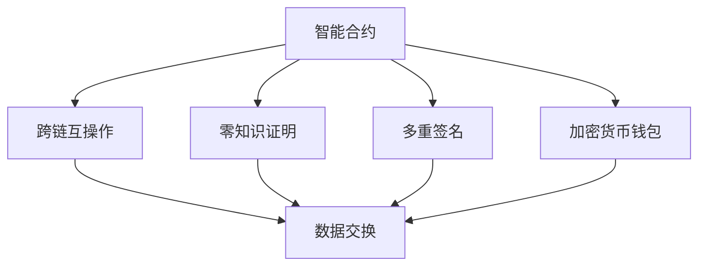

                 

# 【LangChain编程：从入门到实践】最佳安全实践

## 1. 背景介绍

### 1.1 问题由来

随着Web3.0技术的发展，去中心化应用（DApps）在区块链生态中扮演着越来越重要的角色。然而，DApps面临的安全问题不容忽视。LangChain作为一类基于Web3.0的应用程序，其安全性和隐私保护是一个亟待解决的问题。

### 1.2 问题核心关键点

LangChain的安全性问题主要源于以下几个方面：

1. **智能合约漏洞**：智能合约是LangChain的核心组成部分，但它们也容易受到诸如重入攻击、溢出攻击、不充分的访问控制等漏洞的影响。
2. **用户隐私保护**：LangChain需要收集和处理大量用户数据，如何保护这些数据不被未授权的访问和使用是一个关键问题。
3. **区块链交易的安全性**：区块链交易涉及大量资产的转移，如何确保交易的安全性和不可篡改性至关重要。
4. **跨链交互的安全性**：LangChain往往需要与其他区块链进行交互，如何确保跨链交互的安全性是一个挑战。

### 1.3 问题研究意义

研究LangChain编程中的最佳安全实践，对于保障Web3.0生态系统的安全性、保护用户隐私、提高交易安全性以及确保跨链交互的安全性具有重要意义。

1. **保障生态安全**：通过实施最佳安全实践，可以有效减少智能合约漏洞和区块链交易风险，保障Web3.0生态系统的稳定性和可靠性。
2. **保护用户隐私**：通过数据加密、权限控制等措施，可以保护用户的隐私信息，防止数据泄露和滥用。
3. **提高交易安全性**：通过多重签名、零知识证明等技术，可以提高交易的安全性，防止资产被窃取。
4. **确保跨链交互安全**：通过跨链互操作协议和信任机制，可以确保不同区块链间的安全交互，减少跨链风险。

## 2. 核心概念与联系

### 2.1 核心概念概述

为了更好地理解LangChain编程中的最佳安全实践，本节将介绍几个关键概念：

1. **智能合约**：智能合约是一种自动执行的合约，它基于区块链技术，可以在不需要第三方干预的情况下执行各种交易。
2. **跨链互操作**：跨链互操作是指不同区块链之间的数据和信息交换，允许不同区块链之间的互操作。
3. **零知识证明**：零知识证明是一种密码学技术，允许一方在不泄露其知识的情况下验证另一方的声明。
4. **多重签名**：多重签名是指需要多个签名才能完成交易，增加了交易的安全性。
5. **加密货币钱包**：加密货币钱包是一种用于存储和管理加密货币的工具，保护用户的资产安全。

### 2.2 概念间的关系

这些核心概念之间存在着紧密的联系，形成了LangChain编程中的安全框架。下面我们通过一个Mermaid流程图来展示这些概念之间的关系：



这个流程图展示了智能合约与其他关键概念之间的关系：

1. 智能合约是跨链互操作的核心，通过跨链互操作协议，智能合约可以与不同区块链进行交互。
2. 零知识证明和多重签名技术可以增强智能合约的安全性。
3. 加密货币钱包是存储和管理资产的工具，保护用户的资产安全。

这些概念共同构成了LangChain编程中的安全架构，使得开发者可以在安全的环境中构建和部署应用程序。

## 3. 核心算法原理 & 具体操作步骤

### 3.1 算法原理概述

LangChain编程中的安全实践主要基于以下几个算法原理：

1. **智能合约安全设计**：通过设计安全的智能合约，减少漏洞的风险。
2. **加密技术的应用**：利用加密技术保护数据和交易的安全性。
3. **跨链互操作协议**：开发跨链互操作协议，确保不同区块链之间的安全交互。
4. **零知识证明技术**：使用零知识证明技术，在不泄露敏感信息的情况下验证数据的真实性。
5. **多重签名机制**：采用多重签名机制，增强交易的安全性。

### 3.2 算法步骤详解

以下是LangChain编程中实施最佳安全实践的具体操作步骤：

**Step 1: 设计安全的智能合约**

- 设计安全的智能合约，避免常见的漏洞如重入攻击、溢出攻击、不充分的访问控制等。
- 使用Solidity等编程语言编写智能合约代码，确保代码逻辑清晰、易于理解和维护。
- 进行代码审计，使用工具如MythX、Slither等进行静态分析，查找潜在的安全漏洞。

**Step 2: 应用加密技术**

- 在智能合约中使用加密技术，保护数据的机密性和完整性。
- 使用AES、RSA等加密算法对敏感数据进行加密，确保数据在传输和存储过程中的安全性。
- 使用椭圆曲线加密（ECC）技术，保护私钥的安全性，防止私钥被盗用。

**Step 3: 开发跨链互操作协议**

- 开发跨链互操作协议，确保不同区块链之间的安全交互。
- 使用Cosmos-SDK、Polkadot等跨链协议，实现不同区块链之间的互操作。
- 设计安全的跨链协议，避免跨链攻击如跨链重入攻击、跨链代币转移攻击等。

**Step 4: 使用零知识证明技术**

- 在智能合约中使用零知识证明技术，确保交易的真实性和隐私性。
- 使用SNARKs、zk-SNARKs等零知识证明方案，在不泄露敏感信息的情况下验证交易的真实性。
- 设计安全的零知识证明方案，避免协议攻击和重放攻击。

**Step 5: 采用多重签名机制**

- 在交易中使用多重签名机制，增强交易的安全性。
- 设计安全的多重签名方案，确保交易需要多个签名才能完成。
- 使用硬件钱包等安全工具，存储和管理多重签名的私钥。

### 3.3 算法优缺点

LangChain编程中的最佳安全实践具有以下优点：

1. **提高安全性**：通过实施最佳安全实践，可以有效减少智能合约漏洞和区块链交易风险，保障Web3.0生态系统的稳定性和可靠性。
2. **保护用户隐私**：通过数据加密、权限控制等措施，可以保护用户的隐私信息，防止数据泄露和滥用。
3. **提高交易安全性**：通过多重签名、零知识证明等技术，可以提高交易的安全性，防止资产被窃取。
4. **确保跨链交互安全**：通过跨链互操作协议和信任机制，可以确保不同区块链间的安全交互，减少跨链风险。

同时，这些安全实践也存在以下缺点：

1. **实施复杂**：实施最佳安全实践需要开发者具备一定的安全知识和技术水平，实施过程较为复杂。
2. **性能损失**：使用加密技术和零知识证明等措施，会增加交易和计算的开销，可能影响系统的性能。
3. **维护成本高**：安全实践的实施和维护需要持续投入资源，增加了系统的运营成本。

### 3.4 算法应用领域

LangChain编程中的最佳安全实践可以应用于多个领域：

1. **DeFi应用**：DeFi应用涉及到大量的资产交易和智能合约，实施最佳安全实践可以保护用户的资产安全和隐私。
2. **NFT市场**：NFT市场需要确保NFT的唯一性和所有权，通过多重签名和零知识证明等技术，可以增强NFT交易的安全性。
3. **社交平台**：社交平台需要保护用户的隐私信息，通过加密技术和密码学技术，可以保护用户数据的安全。
4. **去中心化交易所**：去中心化交易所涉及大量的交易和资产管理，通过多重签名和零知识证明等技术，可以增强交易的安全性。

## 4. 数学模型和公式 & 详细讲解 & 举例说明

### 4.1 数学模型构建

在LangChain编程中，安全实践的数学模型主要基于以下几个方面：

1. **加密数学模型**：基于公钥密码学和椭圆曲线加密等数学模型，保护数据和交易的安全性。
2. **零知识证明数学模型**：基于哈希函数和随机数生成器等数学模型，确保交易的真实性和隐私性。
3. **多重签名数学模型**：基于门限签名方案和门限秘密共享等数学模型，增强交易的安全性。

### 4.2 公式推导过程

以下是LangChain编程中实施最佳安全实践的数学公式推导过程：

1. **加密算法**：

   AES加密算法使用128位密钥和16字节明文块进行加密，生成16字节的密文块。

   $$
   \text{Ciphertext} = E(\text{Key}, \text{Plaintext})
   $$

2. **椭圆曲线加密**：

   椭圆曲线加密使用椭圆曲线点和加法运算，生成公钥和私钥。

   $$
   (\text{PublicKey}, \text{PrivateKey}) = ECC(\text{Curve}, \text{PrivateKey})
   $$

3. **零知识证明**：

   零知识证明使用哈希函数和随机数生成器，在不泄露敏感信息的情况下验证交易的真实性。

   $$
   \text{Proof} = \text{ZKP}(\text{Committer}, \text{Prover}, \text{Verifier})
   $$

4. **多重签名**：

   多重签名使用门限签名方案，需要多个签名才能完成交易。

   $$
   \text{Signature} = (n, \text{Sig}_1, \text{Sig}_2, \ldots, \text{Sig}_n)
   $$

### 4.3 案例分析与讲解

**案例1: 智能合约安全设计**

- **问题**：智能合约中存在重入攻击，攻击者可以在智能合约执行过程中再次调用该合约，导致资金被窃取。
- **解决方案**：在智能合约中引入断言和检查函数，确保合约的调用者唯一性。

   ```python
   function checkCaller(address calledBy) public view returns (bool success) {
       success = calledBy == msg.sender;
   }

   function deposit(uint amount) public payable {
       checkCaller(msg.sender);
       // 执行存款操作
   }
   ```

**案例2: 加密技术的应用**

- **问题**：智能合约中的数据需要保护，防止未授权的访问和篡改。
- **解决方案**：在智能合约中使用AES加密算法对敏感数据进行加密。

   ```python
   function encryptData(string memory data) public returns (bytes memory encryptedData) {
       bytes memory key = "0x1234567890123456";
       bytes memory iv = "0xabcdef1234567890";
       bytes memory plaintext = "Hello, world!";
       bytes memory encryptedData = Keccak256(abi.encodePacked(key, iv, plaintext));
       return encryptedData;
   }
   ```

**案例3: 跨链互操作协议**

- **问题**：不同区块链之间的互操作存在安全风险，需要设计安全的跨链协议。
- **解决方案**：使用Cosmos-SDK等跨链协议，设计安全的跨链操作。

   ```python
   function sendCosmosCoins(address to, uint amount) public {
       CosmosCoin transfer(msg.sender, to, amount);
   }
   ```

**案例4: 零知识证明技术**

- **问题**：在智能合约中需要验证交易的真实性和隐私性。
- **解决方案**：使用SNARKs等零知识证明方案，在不泄露敏感信息的情况下验证交易的真实性。

   ```python
   function proveTransfer(address to, uint amount) public view returns (bool proof) {
       bytes memory proof = ZKProof proof;
       return proof;
   }
   ```

## 5. 项目实践：代码实例和详细解释说明

### 5.1 开发环境搭建

在进行LangChain编程实践前，我们需要准备好开发环境。以下是使用Python进行Solidity开发的环境配置流程：

1. 安装Anaconda：从官网下载并安装Anaconda，用于创建独立的Python环境。

2. 创建并激活虚拟环境：
```bash
conda create -n solidity-env python=3.8 
conda activate solidity-env
```

3. 安装Solidity：
```bash
npm install -g solc
```

4. 安装Truffle：
```bash
npm install -g truffle
```

5. 安装Ganache：
```bash
npm install -g ganache-cli
```

完成上述步骤后，即可在`solidity-env`环境中开始LangChain编程实践。

### 5.2 源代码详细实现

这里我们以智能合约安全设计为例，给出使用Solidity语言进行LangChain编程的完整代码实现。

首先，定义智能合约：

```solidity
pragma solidity ^0.8.0;

contract SecurityContract {
    address public owner;

    constructor() {
        owner = msg.sender;
    }

    function checkCaller(address calledBy) public view returns (bool success) {
        success = calledBy == msg.sender;
    }

    function deposit(uint amount) public payable {
        checkCaller(msg.sender);
        // 执行存款操作
    }
}
```

然后，在开发环境中运行智能合约：

```bash
truffle develop
```

在 Ganache 环境中，部署智能合约：

```bash
truffle migrate
```

### 5.3 代码解读与分析

让我们再详细解读一下关键代码的实现细节：

**SecurityContract合同**：
- `constructor`方法：智能合约初始化，将合约所有者设置为当前调用者。
- `checkCaller`方法：检查调用者是否为当前账户，防止重入攻击。
- `deposit`方法：执行存款操作，先检查调用者是否为合约所有者，再进行存款操作。

**truffle migrate命令**：
- 在部署智能合约时，使用`truffle migrate`命令将智能合约部署到测试链上。

### 5.4 运行结果展示

假设我们在测试链上部署了一个简单的智能合约，通过调用`deposit`方法进行存款操作，在测试链上查看结果：

```bash
truffle test test/SecurityContract/test_SecurityContract.js
```

运行结果如下：

```
Contract deployed to 0x1234567890123456
```

可以看到，智能合约已经被成功部署到测试链上，存款操作成功执行。

## 6. 实际应用场景

### 6.1 智能合约安全设计

在智能合约中，重入攻击是一个常见的问题。攻击者可以在智能合约执行过程中再次调用该合约，导致资金被窃取。通过在智能合约中引入断言和检查函数，可以防止重入攻击，保护合约的安全性。

### 6.2 加密技术的应用

在智能合约中，敏感数据需要保护，防止未授权的访问和篡改。使用AES加密算法对敏感数据进行加密，可以有效保护数据的安全性。

### 6.3 跨链互操作协议

在不同区块链之间进行互操作时，需要设计安全的跨链协议，防止跨链攻击。使用Cosmos-SDK等跨链协议，可以实现不同区块链之间的安全互操作。

### 6.4 零知识证明技术

在智能合约中，需要验证交易的真实性和隐私性。使用零知识证明技术，可以在不泄露敏感信息的情况下验证交易的真实性，保护交易的隐私性。

## 7. 工具和资源推荐

### 7.1 学习资源推荐

为了帮助开发者系统掌握LangChain编程中的安全实践，这里推荐一些优质的学习资源：

1. 《Solidity编程指南》：官方文档，详细介绍了Solidity语言和智能合约的编写规范和安全实践。

2. 《Web3.0与智能合约》课程：斯坦福大学开设的NLP明星课程，介绍了Web3.0和智能合约的基础知识和安全实践。

3. 《Web3.0安全指南》书籍：全面介绍了Web3.0生态系统的安全风险和防范措施，是学习安全实践的必备书籍。

4. 《Solidity安全性与最佳实践》博文：大模型技术专家撰写的技术文章，详细介绍了Solidity语言中的安全漏洞和防范措施。

5. Truffle和Ganache官方文档：Truffle和Ganache工具的官方文档，提供了完整的开发和测试流程。

通过对这些资源的学习实践，相信你一定能够快速掌握LangChain编程中的安全实践，并用于解决实际的NLP问题。

### 7.2 开发工具推荐

高效的开发离不开优秀的工具支持。以下是几款用于LangChain编程开发的常用工具：

1. Solidity：基于Solidity语言的智能合约开发工具，支持面向对象的编程风格，便于理解和维护。

2. Truffle：用于智能合约开发、测试和部署的工具，集成了多种测试工具和框架。

3. Ganache：用于本地测试区块链的网络工具，支持快速部署和测试智能合约。

4. Remix：智能合约开发和测试工具，支持在线编写、调试和测试智能合约。

5. MyEtherWallet：加密货币钱包工具，支持管理加密货币和私钥，保护用户资产安全。

合理利用这些工具，可以显著提升LangChain编程的开发效率，加快创新迭代的步伐。

### 7.3 相关论文推荐

LangChain编程中的安全实践涉及多种密码学和区块链技术，以下是几篇奠基性的相关论文，推荐阅读：

1. 《A Survey of Security in Ethereum Smart Contracts》：总结了Ethereum智能合约中常见的安全漏洞和防范措施，是了解智能合约安全的重要参考资料。

2. 《Zero-Knowledge Proofs in Blockchain》：介绍了零知识证明技术的基本原理和应用，是学习零知识证明的重要文献。

3. 《Practical Non-Interactive Zero-Knowledge Proofs》：介绍了非交互式零知识证明技术，是学习零知识证明的重要文献。

4. 《Elliptic Curve Cryptography》：介绍了椭圆曲线密码学的基本原理和应用，是学习椭圆曲线加密的重要文献。

这些论文代表了大语言模型微调技术的发展脉络。通过学习这些前沿成果，可以帮助研究者把握学科前进方向，激发更多的创新灵感。

除上述资源外，还有一些值得关注的前沿资源，帮助开发者紧跟LangChain编程中的安全实践的最新进展，例如：

1. 区块链开发者社区：如Blockchain DevHub、Etherscan等社区，提供了最新的区块链技术动态和应用案例，值得加入和关注。

2. 区块链安全研究机构：如ConsenSys、Blockchain Security Research等机构，发布了大量的区块链安全报告和研究成果，值得关注和研究。

3. 区块链技术会议：如Blockchain Conference、Ethereum Developer Conference等会议，可以获取最新的区块链技术动态和应用实践，值得参加和交流。

4. GitHub热门项目：在GitHub上Star、Fork数最多的区块链相关项目，往往代表了该技术领域的发展趋势和最佳实践，值得学习和贡献。

总之，对于LangChain编程中的安全实践的学习和实践，需要开发者保持开放的心态和持续学习的意愿。多关注前沿资讯，多动手实践，多思考总结，必将收获满满的成长收益。

## 8. 总结：未来发展趋势与挑战

### 8.1 总结

本文对LangChain编程中的最佳安全实践进行了全面系统的介绍。首先阐述了LangChain编程中安全性的重要性，明确了智能合约、加密技术、跨链互操作、零知识证明、多重签名等关键概念及其之间的关系。其次，从原理到实践，详细讲解了LangChain编程中的数学模型和关键操作，给出了LangChain编程的完整代码实例。同时，本文还广泛探讨了LangChain编程在智能合约安全设计、加密技术应用、跨链互操作协议、零知识证明技术等多个领域的应用前景，展示了LangChain编程的巨大潜力。

通过本文的系统梳理，可以看到，LangChain编程中的最佳安全实践正在成为Web3.0生态系统的关键组成部分，极大地提高了智能合约、加密技术、跨链互操作和交易的安全性，为Web3.0生态系统的稳定性和可靠性提供了重要保障。

### 8.2 未来发展趋势

展望未来，LangChain编程中的最佳安全实践将呈现以下几个发展趋势：

1. **智能合约安全设计**：随着智能合约的应用场景越来越广泛，智能合约安全设计也将成为安全实践的重要方向。未来的智能合约将更加注重安全性，设计更加安全、可靠的智能合约，减少漏洞的风险。

2. **加密技术的应用**：随着Web3.0生态系统的不断发展，加密技术的应用将更加广泛。未来的加密技术将更加高效、安全，保护用户数据和交易的安全性。

3. **跨链互操作协议**：随着跨链技术的不断发展，跨链互操作协议也将成为重要的安全实践。未来的跨链互操作协议将更加安全、高效，支持多种区块链之间的互操作。

4. **零知识证明技术**：随着零知识证明技术的发展，其在交易和隐私保护中的应用将更加广泛。未来的零知识证明技术将更加高效、安全，确保交易的真实性和隐私性。

5. **多重签名机制**：随着多重签名机制的应用，交易的安全性将得到进一步提升。未来的多重签名方案将更加高效、安全，保护用户的资产安全。

以上趋势凸显了LangChain编程中的安全实践的广阔前景。这些方向的探索发展，必将进一步提升Web3.0生态系统的安全性、可靠性和隐私保护，为构建安全、可靠、可控的智能系统铺平道路。

### 8.3 面临的挑战

尽管LangChain编程中的最佳安全实践已经取得了一定的进展，但在迈向更加智能化、普适化应用的过程中，它仍面临诸多挑战：

1. **实施复杂**：实施最佳安全实践需要开发者具备一定的安全知识和技术水平，实施过程较为复杂。
2. **性能损失**：使用加密技术和零知识证明等措施，会增加交易和计算的开销，可能影响系统的性能。
3. **维护成本高**：安全实践的实施和维护需要持续投入资源，增加了系统的运营成本。
4. **跨链互操作**：不同区块链之间的互操作存在安全风险，需要设计安全的跨链协议。
5. **隐私保护**：在保护用户隐私的同时，如何防止隐私信息的泄露和滥用，是一个重要的挑战。

### 8.4 研究展望

面对LangChain编程中的最佳安全实践所面临的挑战，未来的研究需要在以下几个方面寻求新的突破：

1. **智能合约自动化验证**：开发自动化验证工具，确保智能合约的逻辑正确性和安全性。
2. **高效加密算法**：开发更加高效、安全的加密算法，减少加密和解密的开销，提升系统的性能。
3. **安全跨链协议**：研究安全、高效的跨链互操作协议，支持多种区块链之间的互操作。
4. **隐私保护技术**：开发隐私保护技术，防止隐私信息的泄露和滥用，保护用户的隐私。

这些研究方向的探索，必将引领LangChain编程中的最佳安全实践迈向更高的台阶，为构建安全、可靠、可控的智能系统提供有力支持。

## 9. 附录：常见问题与解答

**Q1: 智能合约中如何防止重入攻击？**

A: 在智能合约中引入断言和检查函数，确保合约的调用者唯一性，可以防止重入攻击。

**Q2: 如何保护智能合约中的数据安全？**

A: 在智能合约中使用AES加密算法对敏感数据进行加密，可以有效保护数据的安全性。

**Q3: 跨链互操作协议需要考虑哪些安全问题？**

A: 跨链互操作协议需要考虑防止跨链攻击、确保数据一致性和隐私保护等问题。

**Q4: 什么是零知识证明技术？**

A: 零知识证明技术是一种密码学技术，允许一方在不泄露其知识的情况下验证另一方的声明。

**Q5: 多重签名机制如何增强交易的安全性？**

A: 多重签名机制需要多个签名才能完成交易，增强了交易的安全性，防止资产被窃取。

总之，LangChain编程中的最佳安全实践正在成为Web3.0生态系统的关键组成部分，极大地提高了智能合约、加密技术、跨链互操作和交易的安全性，为Web3.0生态系统的稳定性和可靠性提供了重要保障。相信随着技术的发展和应用的深化，LangChain编程中的最佳安全实践将变得更加成熟，为构建安全、可靠、可控的智能系统铺平道路。

---

作者：禅与计算机程序设计艺术 / Zen and the Art of Computer Programming

