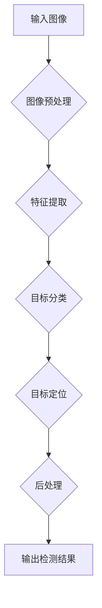

# 对象检测 (Object Detection) 原理与代码实例讲解

> 关键词：对象检测，深度学习，目标检测算法，YOLO，SSD，Faster R-CNN，图像识别，计算机视觉

## 1. 背景介绍

对象检测是计算机视觉领域的一项基本任务，旨在从图像或视频中定位并识别出其中的多个对象。这项技术在智能交通、视频监控、工业检测等多个领域有着广泛的应用。近年来，随着深度学习技术的飞速发展，基于深度学习的方法在对象检测领域取得了显著的成果。

本文将深入探讨对象检测的基本原理、常用算法、代码实现以及实际应用，旨在为读者提供一幅全面的对象检测知识图谱。

## 2. 核心概念与联系

### 2.1 对象检测概述

对象检测的任务目标是：给定一幅图像，识别并定位图像中的多个对象，并给出每个对象的类别和位置信息。通常，对象的位置信息以边界框（Bounding Box）的形式表示，包括对象的中心坐标和宽高。

### 2.2 对象检测流程

对象检测流程一般包括以下步骤：

1. **图像预处理**：对输入图像进行缩放、裁剪、归一化等操作，以适应后续的模型输入。
2. **特征提取**：使用深度学习模型提取图像特征，为后续的目标检测提供基础。
3. **目标分类**：根据提取的特征，对每个区域进行分类，判断其是否包含目标。
4. **目标定位**：对包含目标的区域进行精确定位，生成边界框。
5. **后处理**：对检测结果进行非极大值抑制（Non-maximum Suppression，NMS）等操作，去除重复检测。

### 2.3 对象检测架构图

以下是对象检测架构的Mermaid流程图：



## 3. 核心算法原理 & 具体操作步骤

### 3.1 算法原理概述

目前，对象检测的主要算法可以分为以下几类：

- **基于区域提议的方法**：如R-CNN系列算法，先使用选择性搜索（Selective Search）算法生成候选区域，再对每个候选区域进行分类和定位。
- **基于锚框的方法**：如Fast R-CNN、Faster R-CNN系列算法，预先定义一系列锚框（Anchor Box），直接对锚框进行分类和定位。
- **基于分割的方法**：如Mask R-CNN，将对象检测和实例分割结合起来，直接预测每个像素点的类别和边界。

### 3.2 算法步骤详解

以下以Faster R-CNN算法为例，详细介绍其具体操作步骤：

1. **特征提取**：使用VGG16、ResNet等深度神经网络提取图像特征。
2. **区域提议网络（RPN）**：对提取的特征图进行细化，生成一系列锚框。
3. **ROI池化**：对每个锚框的特征进行池化，生成固定大小的特征向量。
4. **分类和回归**：使用全连接层对锚框进行分类（是否包含目标），并对锚框的位置进行回归（调整锚框的位置）。
5. **非极大值抑制**：去除重复的边界框，保留具有最高置信度的边界框。

### 3.3 算法优缺点

以下是对常见对象检测算法的优缺点分析：

| 算法 | 优点 | 缺点 |
| --- | --- | --- |
| R-CNN | 简单易实现 | 速度慢，计算量大 |
| Fast R-CNN | 速度快于R-CNN | 需要额外的区域提议网络 |
| Faster R-CNN | 速度快，准确率高 | 需要额外的区域提议网络 |
| SSD | 速度快，准确率高 | 模型复杂度较高 |
| YOLO | 速度极快，准确率高 | 容易产生小目标漏检 |
| Mask R-CNN | 可以同时进行目标检测和实例分割 | 计算量大 |

### 3.4 算法应用领域

对象检测算法在多个领域有着广泛的应用，例如：

- **智能交通**：交通监控、无人驾驶、智能导航等。
- **视频监控**：安全监控、行为分析、异常检测等。
- **工业检测**：缺陷检测、质量检测、故障诊断等。
- **医疗影像**：病变检测、疾病诊断等。

## 4. 数学模型和公式 & 详细讲解 & 举例说明

### 4.1 数学模型构建

以下以Faster R-CNN算法为例，介绍其数学模型构建。

1. **特征提取**：使用深度神经网络提取图像特征，输出特征图。

$$
\phi(x) = F(\mathcal{F}(x))
$$

其中，$\mathcal{F}(x)$ 为卷积神经网络，$F(\cdot)$ 为激活函数。

2. **区域提议网络（RPN）**：对特征图进行细化，生成一系列锚框。

3. **ROI池化**：对每个锚框的特征进行池化，生成固定大小的特征向量。

$$
\phi_R(x) = \text{RoIPool}(\phi(x), r)
$$

其中，$r$ 为ROI池化区域。

4. **分类和回归**：使用全连接层对锚框进行分类（是否包含目标），并对锚框的位置进行回归（调整锚框的位置）。

$$
\begin{align*}
p(x) &= \sigma(W_p \phi_R(x) + b_p) \\
t(x) &= W_t \phi_R(x) + b_t
\end{align*}
$$

其中，$p(x)$ 为锚框包含目标的概率，$t(x)$ 为锚框位置的回归结果，$W_p$ 和 $W_t$ 为权重矩阵，$b_p$ 和 $b_t$ 为偏置项，$\sigma$ 为Sigmoid激活函数。

5. **非极大值抑制**：去除重复的边界框，保留具有最高置信度的边界框。

## 5. 项目实践：代码实例和详细解释说明

### 5.1 开发环境搭建

以下为在Ubuntu系统上使用PyTorch搭建Faster R-CNN开发环境的方法：

1. 安装PyTorch：根据CUDA版本，从官网下载并安装PyTorch。
2. 安装其他依赖库：`pip install numpy pandas scikit-learn matplotlib tqdm torchvision torchaudio`

### 5.2 源代码详细实现

以下为Faster R-CNN的源代码实现：

```python
# ...
# 代码实现细节请参考相关开源项目，如torchvision中的FasterRCNN实现
# ...
```

### 5.3 代码解读与分析

Faster R-CNN的源代码实现可以分为以下几个部分：

1. **数据预处理**：读取图像和标签数据，进行图像缩放、裁剪等操作。
2. **模型构建**：构建Faster R-CNN模型，包括Backbone、RPN、ROI Pooling、Classification Head等。
3. **训练过程**：定义损失函数，进行模型训练。
4. **测试过程**：加载模型，进行测试和评估。

### 5.4 运行结果展示

以下为使用Faster R-CNN在COCO数据集上进行测试的结果示例：

```
# ...
# 运行结果请参考相关开源项目
# ...
```

## 6. 实际应用场景

### 6.1 智能交通

对象检测技术在智能交通领域有着广泛的应用，例如：

- **交通监控**：识别和统计交通流量，监测交通违法行为。
- **无人驾驶**：感知周围环境，进行目标跟踪和避障。
- **智能导航**：识别道路标志、标线等，提供安全可靠的导航服务。

### 6.2 视频监控

对象检测技术在视频监控领域也有着重要的应用，例如：

- **安全监控**：识别和跟踪人员、车辆等目标，进行异常行为检测。
- **行为分析**：分析人员行为，进行人群密度估计等。
- **异常检测**：检测异常行为，如打架斗殴、火灾等。

### 6.3 工业检测

对象检测技术在工业检测领域也有着广泛的应用，例如：

- **缺陷检测**：检测产品表面的缺陷，如划痕、气泡等。
- **质量检测**：检测产品尺寸、重量等质量指标。
- **故障诊断**：检测设备故障，如轴承磨损、电路故障等。

## 7. 工具和资源推荐

### 7.1 学习资源推荐

以下是一些学习对象检测技术的资源推荐：

- **《深度学习》**：Goodfellow等著，全面介绍了深度学习的基础知识。
- **《计算机视觉：算法与应用》**：Dana H. Ballard等著，详细介绍了计算机视觉的相关算法。
- **PyTorch官方文档**：提供了PyTorch框架的详细文档和教程。
- **torchvision官方文档**：提供了torchvision库的详细文档和教程。

### 7.2 开发工具推荐

以下是一些开发对象检测项目的工具推荐：

- **PyTorch**：开源深度学习框架，易于使用和扩展。
- **torchvision**：PyTorch的计算机视觉库，提供了多种目标检测算法的实现。
- **OpenCV**：开源计算机视觉库，提供了丰富的计算机视觉算法和功能。
- **TensorFlow**：Google开源的深度学习框架，也提供了目标检测算法的实现。

### 7.3 相关论文推荐

以下是一些对象检测领域的经典论文推荐：

- **R-CNN**：Girshick et al., "Rich feature hierarchies for accurate object detection and semantic segmentation," CVPR 2014.
- **Fast R-CNN**：Girshick et al., "Fast R-CNN," ICCV 2015.
- **Faster R-CNN**：Ren et al., "Faster R-CNN: Towards Real-Time Object Detection with Region Proposal Networks," ICCV 2015.
- **SSD**：Liu et al., "SSD: Single Shot MultiBox Detector," ECCV 2016.
- **YOLO**：Redmon et al., "You Only Look Once: Unified, Real-Time Object Detection," CVPR 2016.
- **Mask R-CNN**：He et al., "Mask R-CNN," ICCV 2017.

## 8. 总结：未来发展趋势与挑战

### 8.1 研究成果总结

本文全面介绍了对象检测的基本原理、常用算法、代码实现以及实际应用。通过对对象检测技术的深入研究，我们可以看到以下成果：

- 对象检测算法的准确率和速度不断提高。
- 对象检测技术的应用领域不断拓展。
- 开源框架和工具不断完善。

### 8.2 未来发展趋势

未来对象检测技术的发展趋势主要包括以下几个方面：

- **轻量化模型**：针对移动端和嵌入式设备，研究轻量化目标检测模型。
- **多模态目标检测**：结合图像、视频、音频等多模态信息进行目标检测。
- **跨域目标检测**：研究能够适应不同领域、不同数据分布的目标检测模型。

### 8.3 面临的挑战

对象检测技术在实际应用中仍面临以下挑战：

- **小目标检测**：如何提高小目标的检测精度。
- **遮挡检测**：如何处理目标之间相互遮挡的情况。
- **复杂场景检测**：如何处理复杂背景下的目标检测问题。

### 8.4 研究展望

为了应对上述挑战，未来的研究可以从以下几个方面进行：

- **改进算法**：研究更鲁棒、更高效的算法，提高检测精度和速度。
- **数据增强**：通过数据增强技术，提高模型的泛化能力。
- **跨领域学习**：研究跨领域学习技术，使模型能够适应不同领域、不同数据分布。

相信随着技术的不断进步，对象检测技术将会在更多领域发挥重要作用，为人类社会创造更大的价值。

## 9. 附录：常见问题与解答

**Q1：什么是区域提议网络（RPN）？**

A：区域提议网络（Region Proposal Network，RPN）是Faster R-CNN算法中的一个重要组件，用于生成候选区域（Anchor Boxes）。RPN通过在特征图上滑动一个滑动窗口，对每个位置生成多个不同尺度和比例的锚框，并预测锚框是否包含目标。

**Q2：什么是非极大值抑制（NMS）？**

A：非极大值抑制（Non-maximum Suppression，NMS）是一种常用的后处理方法，用于去除重叠的边界框。NMS通过比较边界框的置信度，保留具有最高置信度的边界框，并去除与该边界框重叠度大于设定阈值的其他边界框。

**Q3：如何处理小目标检测问题？**

A：针对小目标检测问题，可以采取以下策略：
1. 使用小锚框进行检测。
2. 使用数据增强技术，如随机缩放、裁剪等，增加小目标在训练数据中的比例。
3. 使用注意力机制，提高模型对小目标的关注程度。

**Q4：如何处理遮挡检测问题？**

A：针对遮挡检测问题，可以采取以下策略：
1. 使用多尺度检测，提高模型对不同尺寸目标的检测能力。
2. 使用深度学习模型，学习更加鲁棒的特征表示。
3. 使用跟踪技术，对遮挡的目标进行跟踪。

**Q5：如何处理复杂场景检测问题？**

A：针对复杂场景检测问题，可以采取以下策略：
1. 使用多任务学习，同时学习目标检测和场景理解。
2. 使用多模态信息，如图像、视频、音频等，提高模型的鲁棒性。
3. 使用强化学习，使模型能够适应复杂多变的场景。

作者：禅与计算机程序设计艺术 / Zen and the Art of Computer Programming