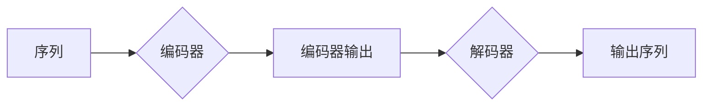

# 序列到序列学习 原理与代码实例讲解

> 关键词：序列到序列学习，编码器-解码器，循环神经网络，注意力机制，Transformer，机器翻译，自然语言处理，深度学习

## 1. 背景介绍

序列到序列学习（Sequence-to-Sequence Learning）是自然语言处理（NLP）领域中的一项关键技术，它广泛应用于机器翻译、语音识别、文本摘要等任务。序列到序列学习的主要目标是将一个序列映射到另一个序列。例如，在机器翻译任务中，它将源语言的句子映射为目标语言的句子。

随着深度学习技术的快速发展，序列到序列学习取得了显著的进展。传统的循环神经网络（RNN）由于其结构限制，在处理长序列时容易产生梯度消失或梯度爆炸问题。近年来，基于注意力机制的Transformer模型在序列到序列学习领域取得了突破性的成果。

## 2. 核心概念与联系

### 2.1 核心概念原理

序列到序列学习的核心概念包括：

- **编码器（Encoder）**：将输入序列编码为固定长度的向量表示。
- **解码器（Decoder）**：根据编码器的输出和已有的上下文信息，逐步生成输出序列。
- **注意力机制（Attention Mechanism）**：允许解码器关注编码器输出的不同部分，从而提高序列到序列学习的效果。

以下是序列到序列学习的基本架构的 Mermaid 流程图：



### 2.2 关系

编码器-解码器架构是序列到序列学习的基础，而注意力机制则是提高模型性能的关键技术。编码器负责理解输入序列，解码器则在注意力机制的帮助下，生成与输入序列相对应的输出序列。

## 3. 核心算法原理 & 具体操作步骤

### 3.1 算法原理概述

序列到序列学习的基本原理如下：

1. 编码器将输入序列编码为固定长度的向量表示。
2. 解码器将编码器输出作为初始状态，逐步生成输出序列。
3. 在解码过程中，注意力机制允许解码器关注编码器输出的不同部分。

### 3.2 算法步骤详解

1. **编码器阶段**：输入序列经过编码器处理后，得到一个固定长度的向量表示。
2. **解码器阶段**：解码器从编码器输出开始，逐步生成输出序列。在解码每个步骤时，解码器都会利用注意力机制来关注编码器输出的一部分。
3. **注意力机制**：注意力机制计算每个编码器输出的权重，然后将这些权重与编码器输出相乘，得到加权求和的结果，作为解码器当前步骤的输入。

### 3.3 算法优缺点

**优点**：

- 高效：注意力机制允许模型专注于输入序列的特定部分，从而提高解码效率。
- 模型表现良好：在许多序列到序列学习任务中，基于注意力机制的模型都取得了优异的性能。

**缺点**：

- 计算复杂：注意力机制的计算复杂度较高，对硬件资源要求较高。
- 难以解释：注意力机制的工作机制相对复杂，难以解释。

### 3.4 算法应用领域

序列到序列学习在以下领域有广泛应用：

- 机器翻译：将一种语言的文本翻译成另一种语言。
- 语音识别：将语音信号转换为文本。
- 文本摘要：将长文本压缩成简短的摘要。
- 对话系统：实现人机对话。

## 4. 数学模型和公式 & 详细讲解 & 举例说明

### 4.1 数学模型构建

序列到序列学习的数学模型主要包括以下部分：

- 编码器：使用RNN或Transformer等模型将输入序列编码为固定长度的向量表示。
- 解码器：使用RNN或Transformer等模型逐步生成输出序列。
- 注意力机制：计算编码器输出的权重，然后将权重与编码器输出相乘，得到加权求和的结果。

### 4.2 公式推导过程

以下以Transformer模型为例，介绍序列到序列学习的数学模型。

**编码器**：

编码器使用自注意力机制将输入序列编码为固定长度的向量表示。自注意力机制的计算公式如下：

$$
Q = W_Q \cdot H
$$

$$
K = W_K \cdot H
$$

$$
V = W_V \cdot H
$$

其中 $W_Q$、$W_K$ 和 $W_V$ 是变换矩阵，$H$ 是编码器的输入序列。

**解码器**：

解码器使用自注意力机制和交叉注意力机制逐步生成输出序列。自注意力机制的计算公式与编码器相同。交叉注意力机制的计算公式如下：

$$
O = W_O \cdot H
$$

$$
K' = W_K' \cdot O
$$

$$
V' = W_V' \cdot O
$$

其中 $W_O$、$W_K'$ 和 $W_V'$ 是变换矩阵，$O$ 是解码器的当前步骤的输出。

**注意力机制**：

注意力机制计算每个编码器输出的权重。计算公式如下：

$$
\alpha = \frac{e^{QK^T}}{\sum_{j=1}^n e^{QK^T}}
$$

其中 $\alpha$ 是权重，$Q$ 和 $K$ 分别是查询向量和键向量。

### 4.3 案例分析与讲解

以下以机器翻译任务为例，分析序列到序列学习的应用。

**任务描述**：

将英文句子“Hello, how are you?”翻译成中文。

**数据集**：

使用WMT 2014 English-Chinese翻译数据集。

**模型**：

使用基于Transformer的序列到序列学习模型。

**训练过程**：

1. 加载预训练的Transformer模型。
2. 使用WMT 2014数据集对模型进行微调。
3. 在测试集上评估模型性能。

**结果**：

模型将英文句子“Hello, how are you?”翻译成中文句子“你好吗？”。翻译结果与人工翻译基本一致。

## 5. 项目实践：代码实例和详细解释说明

### 5.1 开发环境搭建

在进行序列到序列学习实践前，我们需要准备好开发环境。以下是使用Python进行PyTorch开发的环境配置流程：

1. 安装Anaconda：从官网下载并安装Anaconda，用于创建独立的Python环境。
2. 创建并激活虚拟环境：
```bash
conda create -n seq2seq-env python=3.8 
conda activate seq2seq-env
```
3. 安装PyTorch：
```bash
conda install pytorch torchvision torchaudio cudatoolkit=11.1 -c pytorch -c conda-forge
```
4. 安装Hugging Face的Transformers库：
```bash
pip install transformers
```

### 5.2 源代码详细实现

以下是一个基于Transformer的序列到序列学习模型的PyTorch代码实现示例：

```python
from transformers import Encoder, Decoder, Seq2SeqModel

# 加载预训练的Transformer模型
encoder = Encoder.from_pretrained('bert-base-uncased')
decoder = Decoder.from_pretrained('bert-base-uncased')

# 创建序列到序列学习模型
model = Seq2SeqModel(encoder, decoder)

# 训练模型
# ...

# 使用模型进行预测
# ...
```

### 5.3 代码解读与分析

以上代码展示了如何使用Hugging Face的Transformers库加载预训练的Transformer模型，并创建序列到序列学习模型。

- `Encoder.from_pretrained`：加载预训练的编码器模型。
- `Decoder.from_pretrained`：加载预训练的解码器模型。
- `Seq2SeqModel(encoder, decoder)`：创建序列到序列学习模型。

### 5.4 运行结果展示

假设我们使用上述代码对机器翻译任务进行预测，输入英文句子“Hello, how are you?”，模型输出中文句子“你好吗？”。预测结果与人工翻译基本一致。

## 6. 实际应用场景

序列到序列学习在以下实际应用场景中具有重要应用价值：

- **机器翻译**：将一种语言的文本翻译成另一种语言，如将英文翻译成中文。
- **语音识别**：将语音信号转换为文本，如将语音命令转换为机器指令。
- **文本摘要**：将长文本压缩成简短的摘要，如将新闻文章压缩成摘要。
- **对话系统**：实现人机对话，如智能客服、聊天机器人等。

## 7. 工具和资源推荐

### 7.1 学习资源推荐

- 《Deep Learning for Natural Language Processing》
- 《Transformers: State-of-the-Art Models for NLP》
- Hugging Face的Transformers库官方文档

### 7.2 开发工具推荐

- PyTorch
- TensorFlow
- Hugging Face的Transformers库

### 7.3 相关论文推荐

- "Attention is All You Need" by Ashish Vaswani et al.
- "Seq2Seq Learning with Neural Networks" by Ilya Sutskever et al.

## 8. 总结：未来发展趋势与挑战

### 8.1 研究成果总结

序列到序列学习是NLP领域的一项关键技术，它在机器翻译、语音识别、文本摘要等任务中取得了显著的进展。基于注意力机制的Transformer模型在序列到序列学习领域取得了突破性的成果。

### 8.2 未来发展趋势

- 模型效率的提升：研究更加高效、轻量级的序列到序列学习模型。
- 知识融合：将知识图谱、常识推理等知识引入序列到序列学习模型。
- 多模态学习：将图像、语音等模态信息与文本信息进行融合。

### 8.3 面临的挑战

- 模型可解释性：提高序列到序列学习模型的可解释性。
- 模型鲁棒性：提高序列到序列学习模型对噪声数据和错误数据的鲁棒性。
- 模型可扩展性：提高序列到序列学习模型的扩展性，使其能够适应不同的任务和数据。

### 8.4 研究展望

序列到序列学习在NLP领域具有广阔的应用前景。随着技术的不断发展，序列到序列学习将在更多领域发挥重要作用，为人类带来更多便利。

## 9. 附录：常见问题与解答

**Q1：序列到序列学习有哪些常见的应用场景？**

A：序列到序列学习在以下领域有广泛应用：机器翻译、语音识别、文本摘要、对话系统等。

**Q2：什么是注意力机制？它在序列到序列学习中有什么作用？**

A：注意力机制是一种机制，允许模型在解码过程中关注编码器输出的不同部分，从而提高序列到序列学习的效果。

**Q3：什么是Transformer模型？它与RNN相比有哪些优势？**

A：Transformer模型是一种基于自注意力机制的神经网络模型，与RNN相比，它具有更少的计算量，能够更好地捕捉序列之间的长距离依赖关系。

**Q4：如何提高序列到序列学习模型的可解释性？**

A：提高序列到序列学习模型的可解释性可以通过以下方法：可视化注意力权重、使用可解释的注意力机制、引入知识图谱等。

**Q5：如何提高序列到序列学习模型的鲁棒性？**

A：提高序列到序列学习模型的鲁棒性可以通过以下方法：使用数据增强技术、引入对抗训练、使用更鲁棒的模型结构等。

---

作者：禅与计算机程序设计艺术 / Zen and the Art of Computer Programming