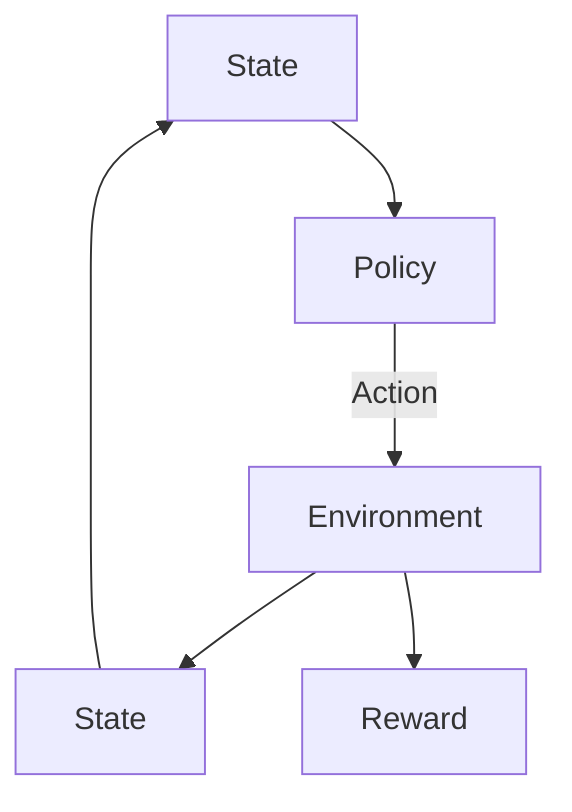

# 强化学习Reinforcement Learning中的状态估计与未知环境建模

> 关键词：强化学习，状态估计，未知环境，模型学习，马尔可夫决策过程，探索-利用，Q学习，策略梯度，深度强化学习

## 1. 背景介绍

强化学习（Reinforcement Learning，RL）是机器学习的一个重要分支，它通过智能体与环境交互，通过奖励信号来学习最优策略，以实现最大化累积奖励的目标。在强化学习框架中，状态估计和未知环境建模是两个关键问题，它们直接影响到智能体的学习效果和决策质量。

状态估计是指智能体对环境状态的判断和预测能力。在未知环境中，智能体需要根据有限的观测数据来推断环境的状态，这对于智能体的决策至关重要。未知环境建模则是指智能体对环境动态和结构的学习，这有助于智能体更好地适应和预测环境变化。

## 2. 核心概念与联系

### 2.1 核心概念

- **强化学习（RL）**：一种机器学习方法，智能体通过与环境的交互来学习最优策略。
- **状态（State）**：描述环境当前状况的一系列属性。
- **动作（Action）**：智能体对环境采取的行动。
- **奖励（Reward）**：智能体在执行动作后从环境中获得的奖励信号。
- **策略（Policy）**：智能体在给定状态下采取动作的概率分布。
- **价值函数（Value Function）**：衡量策略在给定状态下预期累积奖励的函数。
- **模型（Model）**：对环境动态的数学或统计表示。

### 2.2 Mermaid 流程图



在这个流程图中，智能体首先感知到状态A，然后根据策略B选择动作C，动作执行后，环境反馈状态D和奖励E。智能体根据奖励调整策略B，并继续这个过程。

## 3. 核心算法原理 & 具体操作步骤

### 3.1 算法原理概述

强化学习中的状态估计和未知环境建模通常涉及以下算法：

- **Q学习（Q-Learning）**：通过学习Q值函数（策略的最优估计）来学习策略。
- **策略梯度（Policy Gradient）**：直接学习策略函数，并通过梯度上升法优化策略。
- **深度强化学习（DRL）**：结合深度学习技术，学习状态到动作的映射。

### 3.2 算法步骤详解

#### 3.2.1 Q学习

1. 初始化Q表，Q(s,a)表示在状态s采取动作a的预期奖励。
2. 选择动作a，根据策略π(s)。
3. 执行动作a，观察状态s'和奖励r。
4. 更新Q表：$$Q(s,a) = Q(s,a) + \alpha [r + \gamma \max_{a'} Q(s',a') - Q(s,a)]$$
5. 返回步骤2。

#### 3.2.2 策略梯度

1. 初始化策略π(θ)，θ为策略参数。
2. 执行策略π(θ)，观察状态s'和奖励r。
3. 计算策略梯度：$$\nabla_{\theta} J(\theta) = \sum_{s,a} \pi(a|s;\theta) [r + \gamma \max_{a'} Q(s',a';\theta) - Q(s,a;\theta)]$$
4. 使用梯度上升法更新策略参数θ。
5. 返回步骤2。

#### 3.2.3 深度强化学习

1. 使用深度神经网络作为Q值函数或策略函数。
2. 训练神经网络模型，通常使用强化学习算法进行训练。
3. 根据训练好的模型，执行策略或直接输出动作。

### 3.3 算法优缺点

#### Q学习

优点：
- 理论上收敛到最优策略。
- 简单易实现。

缺点：
- 需要大量探索来学习最优策略。
- 易受噪声和样本偏差的影响。

#### 策略梯度

优点：
- 直接学习策略函数，可能收敛更快。
- 在某些情况下，收敛到更好的策略。

缺点：
- 需要梯度估计，可能难以计算。
- 可能收敛到次优策略。

#### 深度强化学习

优点：
- 可以处理高维状态空间和动作空间。
- 能够学习复杂的策略。

缺点：
- 训练复杂，需要大量数据。
- 可能难以解释模型的行为。

### 3.4 算法应用领域

- 自动驾驶
- 游戏AI
- 机器人控制
- 股票交易

## 4. 数学模型和公式 & 详细讲解 & 举例说明

### 4.1 数学模型构建

强化学习中的数学模型通常基于马尔可夫决策过程（MDP）：

$$
\begin{align*}
P(s'|s,a) & = P(s'|s,a) \\
R(s,a) & = R(s,a) \\
P(s'|s,a) & = \sum_{s'} P(s'|s,a) \\
\end{align*}
$$

其中，s是当前状态，a是动作，s'是下一个状态，R是奖励，P是状态转移概率。

### 4.2 公式推导过程

#### 4.2.1 Q学习

Q学习的目标是最小化以下损失函数：

$$
L(\theta) = \sum_{s,a} (Q(s,a) - r - \gamma \max_{a'} Q(s',a'))^2
$$

其中，θ是Q值函数的参数，γ是折扣因子。

#### 4.2.2 策略梯度

策略梯度算法的目标是最大化以下期望值：

$$
J(\theta) = \mathbb{E}_{s,a}[r + \gamma \max_{a'} Q(s',a')]
$$

其中，Q(s',a')是策略π(s')下在状态s'采取动作a'的Q值。

### 4.3 案例分析与讲解

#### 4.3.1 Q学习案例

假设智能体在一个简单的迷宫环境中，目标是找到从起点到终点的最优路径。智能体可以通过Q学习来学习最优策略。

#### 4.3.2 策略梯度案例

假设智能体在一个股票交易环境中，目标是最大化累积收益。智能体可以通过策略梯度来学习最优交易策略。

## 5. 项目实践：代码实例和详细解释说明

### 5.1 开发环境搭建

为了演示强化学习中的状态估计和未知环境建模，我们将使用Python和OpenAI的Gym库来构建一个简单的迷宫环境。

### 5.2 源代码详细实现

以下是使用Python和PyTorch实现Q学习的代码示例：

```python
import gym
import numpy as np
import torch
import torch.nn as nn
import torch.optim as optim

# 定义环境
env = gym.make("MountainCar-v0")

# 定义Q网络
class QNetwork(nn.Module):
    def __init__(self, state_dim, action_dim):
        super(QNetwork, self).__init__()
        self.fc1 = nn.Linear(state_dim, 128)
        self.fc2 = nn.Linear(128, action_dim)
    
    def forward(self, x):
        x = torch.relu(self.fc1(x))
        x = self.fc2(x)
        return x

# 初始化网络和优化器
state_dim = env.observation_space.shape[0]
action_dim = env.action_space.n
q_network = QNetwork(state_dim, action_dim)
optimizer = optim.Adam(q_network.parameters(), lr=0.01)

# 定义学习率衰减
scheduler = optim.lr_scheduler.StepLR(optimizer, step_size=10000, gamma=0.9)

# 训练Q网络
episodes = 1000
for episode in range(episodes):
    state = env.reset()
    done = False
    total_reward = 0
    while not done:
        # 随机选择动作或使用epsilon-greedy策略
        if np.random.random() < 0.1:
            action = env.action_space.sample()
        else:
            with torch.no_grad():
                q_values = q_network(torch.from_numpy(state))
                action = q_values.argmax().item()
        
        # 执行动作
        next_state, reward, done, _ = env.step(action)
        total_reward += reward
        
        # 计算目标Q值
        with torch.no_grad():
            next_q_values = q_network(torch.from_numpy(next_state))
            target_q = reward + 0.99 * next_q_values.max()
        
        # 更新Q值
        current_q = q_network(torch.from_numpy(state))
        current_q[0, action] = reward + 0.99 * next_q_values.max()
        
        # 反向传播
        loss = nn.MSELoss()(current_q, target_q)
        optimizer.zero_grad()
        loss.backward()
        optimizer.step()
    
    scheduler.step()
    print(f"Episode {episode+1}, Total Reward: {total_reward}")

# 保存模型
torch.save(q_network.state_dict(), "q_network.pth")

# 加载模型并测试
q_network.load_state_dict(torch.load("q_network.pth"))
for _ in range(10):
    state = env.reset()
    done = False
    total_reward = 0
    while not done:
        with torch.no_grad():
            q_values = q_network(torch.from_numpy(state))
            action = q_values.argmax().item()
        next_state, reward, done, _ = env.step(action)
        total_reward += reward
        state = next_state
    print(f"Test Reward: {total_reward}")
```

### 5.3 代码解读与分析

这段代码首先导入了必要的库和函数，并定义了环境、Q网络、优化器和学习率衰减。然后，通过epsilon-greedy策略训练Q网络，最后保存并加载模型进行测试。

### 5.4 运行结果展示

运行上述代码后，可以看到在每个episode结束时打印的总奖励值。测试阶段的平均奖励值将显示模型学习到的策略的效果。

## 6. 实际应用场景

强化学习中的状态估计和未知环境建模在许多实际应用场景中都有广泛的应用，以下是一些例子：

- **自动驾驶**：智能体通过估计周围环境和预测车辆行为来做出决策。
- **机器人控制**：机器人通过学习环境中的状态和动作来执行复杂的任务。
- **游戏AI**：智能体通过学习游戏状态和动作来击败对手。
- **资源管理**：智能体通过学习资源分布和需求来优化资源分配。

## 7. 工具和资源推荐

### 7.1 学习资源推荐

- 《Reinforcement Learning: An Introduction》
- 《Deep Reinforcement Learning》
- OpenAI Gym
- PyTorch Reinforcement Learning教程

### 7.2 开发工具推荐

- Python
- PyTorch
- OpenAI Gym
- TensorBoard

### 7.3 相关论文推荐

- Q-Learning (Sutton and Barto, 1989)
- Policy Gradient Methods (Sutton and Barto, 1998)
- Deep Q-Networks (Mnih et al., 2013)
- Deep Reinforcement Learning for Robotics (Battaglia et al., 2018)

## 8. 总结：未来发展趋势与挑战

### 8.1 研究成果总结

本文介绍了强化学习中的状态估计和未知环境建模的基本概念、算法原理、具体操作步骤以及实际应用场景。通过分析不同的强化学习算法，我们了解了它们在状态估计和未知环境建模中的应用和效果。

### 8.2 未来发展趋势

随着深度学习技术的发展，深度强化学习（DRL）在状态估计和未知环境建模中扮演越来越重要的角色。未来，DRL将在以下方面取得进一步的发展：

- **更强大的模型**：开发更加复杂的神经网络结构，以处理更复杂的环境和任务。
- **更有效的训练方法**：提出更加高效的训练算法，减少训练时间和计算资源。
- **更广泛的应用**：将DRL应用于更多领域，如医疗、金融、工业自动化等。

### 8.3 面临的挑战

尽管强化学习在状态估计和未知环境建模方面取得了显著进展，但仍面临以下挑战：

- **样本效率**：强化学习需要大量的探索来学习最优策略，这限制了其在实际应用中的可行性。
- **可解释性**：强化学习模型通常缺乏可解释性，这限制了其在高风险领域的应用。
- **安全性和稳定性**：强化学习模型在遇到未知情况时可能会出现不稳定的决策。

### 8.4 研究展望

为了克服这些挑战，未来的研究将重点关注以下方向：

- **样本高效的方法**：研究如何通过主动学习、多智能体学习等方法提高样本效率。
- **可解释性**：研究如何提高强化学习模型的可解释性，使其决策更加可靠和可信。
- **安全性和稳定性**：研究如何提高强化学习模型的安全性和稳定性，使其在复杂环境中更加可靠。

## 9. 附录：常见问题与解答

**Q1：什么是状态估计？**

A：状态估计是指智能体根据有限的观测数据来推断环境状态的判断和预测能力。

**Q2：什么是未知环境建模？**

A：未知环境建模是指智能体对环境动态和结构的学习，这有助于智能体更好地适应和预测环境变化。

**Q3：强化学习中的Q学习是什么？**

A：Q学习是一种通过学习Q值函数来学习策略的强化学习方法。Q值函数衡量在给定状态下采取动作a的预期奖励。

**Q4：策略梯度算法有什么优缺点？**

A：策略梯度算法的优点是直接学习策略函数，可能收敛更快。缺点是需要梯度估计，可能难以计算。

**Q5：深度强化学习在状态估计和未知环境建模中有哪些应用？**

A：深度强化学习在自动驾驶、机器人控制、游戏AI等领域有广泛的应用。

作者：禅与计算机程序设计艺术 / Zen and the Art of Computer Programming