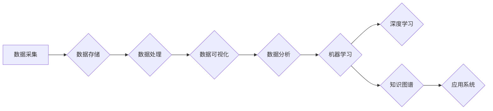

# 未来发展中的大数据与AI技术

> 关键词：大数据，人工智能，机器学习，深度学习，云计算，边缘计算，数据隐私，伦理道德

## 1. 背景介绍

随着信息技术的飞速发展，大数据和人工智能（AI）技术已经成为现代社会不可或缺的组成部分。大数据为AI提供了丰富的学习资源，而AI则为大数据分析提供了强大的计算能力和智能化的决策支持。本文将探讨大数据与AI技术在未来发展中的趋势、挑战和机遇。

### 1.1 大数据的发展

大数据是指规模巨大、类型多样、价值密度低的数据集合。随着物联网、移动互联网、云计算等技术的发展，大数据已经成为各个行业的重要资产。大数据技术主要包括数据采集、存储、处理、分析和可视化等方面。

### 1.2 人工智能的发展

人工智能是指通过模拟、延伸和扩展人的智能，使计算机具有感知、推理、学习、规划和决策等能力的技术。近年来，深度学习等AI技术的快速发展，使得AI在图像识别、语音识别、自然语言处理等领域取得了显著成果。

### 1.3 大数据与AI技术的融合

大数据与AI技术的融合，使得数据分析和处理更加智能化、自动化。例如，在金融领域，大数据技术可以帮助金融机构进行风险评估、欺诈检测；在医疗领域，AI技术可以帮助医生进行疾病诊断和治疗方案推荐。

## 2. 核心概念与联系

### 2.1 大数据技术

#### 2.1.1 数据采集

数据采集是指从各种来源收集数据的过程。数据来源包括传感器、网络日志、社交媒体、移动设备等。数据采集技术主要包括数据抽取、数据清洗和数据集成等。

#### 2.1.2 数据存储

数据存储是指将采集到的数据存储在合适的存储系统中。常见的存储系统包括关系型数据库、NoSQL数据库、分布式文件系统等。

#### 2.1.3 数据处理

数据处理是指对存储的数据进行清洗、转换、聚合等操作，以便于分析和挖掘。数据处理技术主要包括数据清洗、数据集成、数据仓库和数据湖等。

#### 2.1.4 数据分析

数据分析是指使用统计、机器学习等方法对数据进行挖掘，提取有价值的信息和知识。数据分析技术主要包括统计分析、机器学习、数据挖掘等。

#### 2.1.5 数据可视化

数据可视化是指将数据以图形化的方式展示出来，以便于人们直观地理解和分析数据。数据可视化技术主要包括图表、地图、仪表板等。

### 2.2 人工智能技术

#### 2.2.1 机器学习

机器学习是指通过算法使计算机从数据中学习，从而实现特定任务的自动化。机器学习算法主要包括监督学习、无监督学习、强化学习等。

#### 2.2.2 深度学习

深度学习是一种特殊的机器学习技术，通过模拟人脑神经元结构，学习数据中的复杂特征和模式。深度学习在图像识别、语音识别、自然语言处理等领域取得了显著成果。

#### 2.2.3 知识图谱

知识图谱是一种结构化的知识表示方式，通过实体、关系和属性来组织知识。知识图谱技术在信息检索、推荐系统、问答系统等领域具有广泛应用。

### 2.3 Mermaid 流程图

以下是大数据与AI技术融合的Mermaid流程图：



## 3. 核心算法原理 & 具体操作步骤

### 3.1 算法原理概述

大数据与AI技术融合的核心算法主要包括以下几类：

#### 3.1.1 机器学习算法

- 监督学习：通过已标记的训练数据学习输入和输出之间的映射关系。
- 无监督学习：通过未标记的数据学习数据的内在结构和模式。
- 强化学习：通过与环境交互，学习最优的策略以实现目标。

#### 3.1.2 深度学习算法

- 神经网络：通过模拟人脑神经元结构，学习数据中的复杂特征和模式。
- 卷积神经网络（CNN）：擅长图像和视频数据的特征提取和分类。
- 循环神经网络（RNN）和长短时记忆网络（LSTM）：擅长序列数据的处理和预测。

#### 3.1.3 知识图谱算法

- 实体识别：识别文本中的实体。
- 关系抽取：识别实体之间的关系。
- 知识融合：将不同来源的知识进行整合。

### 3.2 算法步骤详解

#### 3.2.1 机器学习算法步骤

1. 数据预处理：对数据进行清洗、转换等操作，使其适合机器学习模型。
2. 模型选择：选择合适的机器学习模型，如线性回归、决策树、支持向量机等。
3. 模型训练：使用训练数据对模型进行训练。
4. 模型评估：使用测试数据评估模型性能。
5. 模型优化：根据评估结果调整模型参数，提高模型性能。

#### 3.2.2 深度学习算法步骤

1. 数据预处理：与机器学习类似，对数据进行清洗、转换等操作。
2. 模型构建：构建深度学习模型，如神经网络、CNN、RNN等。
3. 模型训练：使用训练数据对模型进行训练。
4. 模型评估：使用测试数据评估模型性能。
5. 模型优化：根据评估结果调整模型结构或参数，提高模型性能。

#### 3.2.3 知识图谱算法步骤

1. 实体识别：使用实体识别算法识别文本中的实体。
2. 关系抽取：使用关系抽取算法识别实体之间的关系。
3. 知识融合：使用知识融合算法将不同来源的知识进行整合。

### 3.3 算法优缺点

#### 3.3.1 机器学习算法优缺点

- 优点：算法原理简单，易于理解和实现；模型可解释性强。
- 缺点：模型复杂度较高，训练数据需求量大；泛化能力有限。

#### 3.3.2 深度学习算法优缺点

- 优点：能够处理复杂数据，学习到丰富的特征；泛化能力强。
- 缺点：模型复杂度较高，训练数据需求量大；可解释性差。

#### 3.3.3 知识图谱算法优缺点

- 优点：能够整合不同来源的知识，构建知识库；可解释性强。
- 缺点：知识构建和维护成本高；知识图谱的表示方法多样，难以统一。

### 3.4 算法应用领域

- 机器学习算法：在推荐系统、图像识别、语音识别、自然语言处理等领域有广泛应用。
- 深度学习算法：在图像识别、语音识别、自然语言处理、自动驾驶等领域有广泛应用。
- 知识图谱算法：在信息检索、推荐系统、问答系统等领域有广泛应用。

## 4. 数学模型和公式 & 详细讲解 & 举例说明

### 4.1 数学模型构建

大数据与AI技术的数学模型主要包括以下几类：

#### 4.1.1 机器学习模型

- 线性回归模型：
  $$
  y = \theta_0 + \theta_1 x_1 + \theta_2 x_2 + \cdots + \theta_n x_n
  $$
- 决策树模型：
  $$
  T(x) = \prod_{i=1}^n \theta_i(x_i)
  $$

#### 4.1.2 深度学习模型

- 卷积神经网络模型：
  $$
  h_{l}(x) = f(W_l h_{l-1}(x) + b_l)
  $$

#### 4.1.3 知识图谱模型

- 知识图谱模型：
  $$
  R(E, P, O) = \langle E, P, O \rangle
  $$

### 4.2 公式推导过程

以下以线性回归模型为例，介绍公式推导过程。

假设我们有训练数据集 $D = \{(x_1, y_1), (x_2, y_2), \ldots, (x_n, y_n)\}$，其中 $x_i$ 和 $y_i$ 分别表示输入和输出。

根据最小二乘法，线性回归模型的参数 $\theta$ 可以通过以下公式求得：

$$
\theta = (X^T X)^{-1} X^T y
$$

其中 $X$ 是设计矩阵，$y$ 是输出向量。

### 4.3 案例分析与讲解

以下以图像识别任务为例，介绍大数据与AI技术的应用。

假设我们要训练一个图像识别模型，识别图片中的猫和狗。

1. 数据采集：从互联网上收集大量猫和狗的图片。
2. 数据预处理：对图片进行缩放、裁剪、翻转等操作，使模型更容易学习。
3. 数据标注：将图片标注为猫或狗。
4. 模型训练：使用训练数据训练深度学习模型，如CNN。
5. 模型评估：使用测试数据评估模型性能。

通过以上步骤，我们可以训练出一个能够识别猫和狗的深度学习模型。

## 5. 项目实践：代码实例和详细解释说明

### 5.1 开发环境搭建

以下是使用Python进行图像识别任务的项目实践。

1. 安装必要的库：
   ```
   pip install numpy matplotlib pillow keras tensorflow
   ```
2. 下载猫和狗的图片数据集。

### 5.2 源代码详细实现

以下是一个简单的CNN图像识别模型代码示例：

```python
from keras.models import Sequential
from keras.layers import Conv2D, MaxPooling2D, Flatten, Dense

model = Sequential()
model.add(Conv2D(32, (3, 3), activation='relu', input_shape=(64, 64, 3)))
model.add(MaxPooling2D(pool_size=(2, 2)))
model.add(Flatten())
model.add(Dense(128, activation='relu'))
model.add(Dense(1, activation='sigmoid'))

model.compile(optimizer='adam', loss='binary_crossentropy', metrics=['accuracy'])
model.fit(x_train, y_train, validation_data=(x_test, y_test), epochs=10)
```

### 5.3 代码解读与分析

以上代码首先定义了一个简单的CNN模型，包括卷积层、池化层、全连接层等。然后使用Adam优化器和二元交叉熵损失函数编译模型。最后，使用训练数据训练模型，并在测试数据上评估模型性能。

### 5.4 运行结果展示

运行以上代码后，我们可以得到模型在测试数据上的准确率等指标。

## 6. 实际应用场景

### 6.1 金融领域

在金融领域，大数据与AI技术可以应用于风险评估、欺诈检测、信贷审批、客户关系管理等方面。

### 6.2 医疗领域

在医疗领域，大数据与AI技术可以应用于疾病诊断、药物研发、健康监测、医疗决策等方面。

### 6.3 交通领域

在交通领域，大数据与AI技术可以应用于交通流量预测、自动驾驶、智能交通管理等方面。

### 6.4 智能制造

在智能制造领域，大数据与AI技术可以应用于设备故障预测、生产优化、供应链管理等方面。

## 7. 工具和资源推荐

### 7.1 学习资源推荐

- 《深度学习》
- 《Python数据科学手册》
- 《机器学习实战》
- 《Hadoop权威指南》

### 7.2 开发工具推荐

- TensorFlow
- PyTorch
- Keras
- Hadoop
- Spark

### 7.3 相关论文推荐

- "Deep Learning for Computer Vision: A Review"
- "Large Scale Visual Recognition Challenge 2015"
- "TensorFlow: Large-Scale Machine Learning on Heterogeneous Systems"
- "The Hundred-Door Puzzle: Solving Large Scale Problems with Big Data"

## 8. 总结：未来发展趋势与挑战

### 8.1 研究成果总结

大数据与AI技术在过去几年取得了显著的成果，并在各个领域得到了广泛应用。未来，大数据与AI技术将继续融合，为人类社会带来更多创新和变革。

### 8.2 未来发展趋势

- 大数据与AI技术的融合将更加紧密。
- AI模型将更加轻量化和高效。
- AI将更加普及，应用于更多领域。
- 数据隐私和伦理道德问题将得到更多关注。

### 8.3 面临的挑战

- 数据安全和隐私保护。
- AI模型的可解释性。
- AI模型的公平性和可靠性。
- AI伦理道德问题。

### 8.4 研究展望

未来，大数据与AI技术将继续发展，为人类社会带来更多机遇和挑战。我们需要共同努力，解决这些挑战，推动大数据与AI技术更好地服务于人类社会。

## 9. 附录：常见问题与解答

**Q1：大数据与AI技术的区别是什么？**

A：大数据是指规模巨大、类型多样、价值密度低的数据集合，而AI是指通过模拟、延伸和扩展人的智能，使计算机具有感知、推理、学习、规划和决策等能力的技术。大数据是AI技术发展的基础，而AI技术则是大数据分析的核心驱动力。

**Q2：大数据与AI技术有哪些应用领域？**

A：大数据与AI技术可以应用于金融、医疗、交通、制造、能源、教育、娱乐等各个领域。

**Q3：如何保证大数据与AI技术的安全性？**

A：保证大数据与AI技术的安全性需要从数据采集、存储、处理、分析、应用等各个环节进行严格控制。例如，对数据进行加密、访问控制、审计等。

**Q4：大数据与AI技术是否会导致失业？**

A：大数据与AI技术的发展可能会导致部分传统职业的失业，但也会创造新的就业机会。我们需要积极应对技术变革，提升自身技能，适应未来社会的发展。

**Q5：大数据与AI技术会对社会产生哪些影响？**

A：大数据与AI技术将深刻改变人类社会，提高生产效率、改善生活质量、推动科技创新。但同时，也需要关注数据隐私、伦理道德等问题，确保技术发展的可持续发展。

---

作者：禅与计算机程序设计艺术 / Zen and the Art of Computer Programming