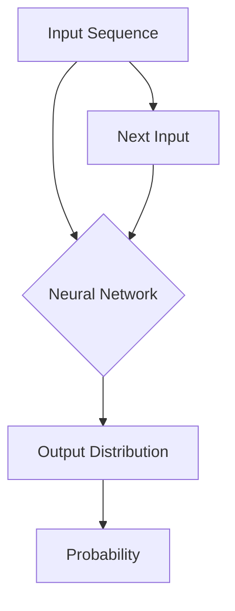

> 关键词：神经概率语言模型，循环神经网络，NLP，自然语言处理，序列建模，深度学习，Transformer，RNN，LSTM

# 山重水复疑无路：神经概率语言模型和循环神经网络

在自然语言处理（NLP）领域，序列建模是一个核心任务，它涉及到对序列数据的结构和语义的理解。从早期的统计模型到现代的深度学习模型，研究者们不断探索着如何更好地建模语言序列。在这条道路上，神经概率语言模型和循环神经网络（RNN）扮演了重要的角色。本文将深入探讨这些概念，并探讨它们在NLP中的应用和未来发展趋势。

## 1. 背景介绍

自然语言是一种复杂的序列结构，它不仅包含了词汇层面的信息，还包含了语法、语义和上下文等更深层次的信息。因此，对语言序列的建模需要一种能够捕捉序列中长距离依赖关系和动态变化的方法。传统的统计模型如隐马尔可夫模型（HMM）和条件随机场（CRF）在处理长序列时效果不佳，因为它们难以捕捉序列中的长期依赖关系。

为了解决这个问题，研究者们提出了循环神经网络（RNN），这是一种能够处理序列数据的神经网络模型。随后，神经概率语言模型的概念逐渐发展，它们结合了概率论和深度学习的优势，为语言序列的建模提供了新的视角。

## 2. 核心概念与联系

### 2.1 神经概率语言模型

神经概率语言模型是一种结合了概率模型和神经网络结构的语言模型。它通过神经网络学习语言序列的概率分布，从而预测下一个单词或字符。以下是神经概率语言模型的关键概念：

- **神经网络结构**：通常使用多层感知器（MLP）或循环神经网络（RNN）来学习语言序列的概率分布。
- **概率分布**：模型输出下一个单词或字符的概率分布。
- **词汇表**：包含所有可能的单词或字符。

### 2.2 循环神经网络（RNN）

循环神经网络是一种能够处理序列数据的神经网络模型。它通过循环连接来保存前一时刻的状态信息，从而捕捉序列中的长期依赖关系。以下是RNN的关键概念：

- **循环连接**：允许网络在处理序列数据时保留历史信息。
- **状态隐藏层**：用于存储和更新前一时刻的状态信息。
- **门控机制**：如LSTM和GRU，用于控制信息的流入和流出。

### 2.3 Mermaid 流程图

以下是一个简化的神经概率语言模型和循环神经网络的Mermaid流程图：



在这个流程图中，输入序列通过神经网络模型，得到下一个单词或字符的概率分布，然后根据概率分布选择下一个输入。

## 3. 核心算法原理 & 具体操作步骤

### 3.1 算法原理概述

神经概率语言模型的算法原理是，通过神经网络学习输入序列的概率分布。具体来说，模型会根据输入序列的当前状态，输出下一个单词或字符的概率分布。

### 3.2 算法步骤详解

1. **初始化参数**：设置神经网络模型的初始参数。
2. **输入序列**：输入待处理的序列数据。
3. **前向传播**：将序列数据通过神经网络模型，得到输出分布。
4. **计算损失**：计算输出分布与真实分布之间的差异，得到损失值。
5. **反向传播**：根据损失值，更新神经网络模型的参数。
6. **迭代优化**：重复步骤3到5，直到模型收敛。

### 3.3 算法优缺点

#### 优点

- **捕捉长期依赖关系**：能够捕捉序列中的长期依赖关系，比传统的统计模型更有效。
- **概率建模**：能够对序列中的下一个单词或字符进行概率预测，具有实用性。

#### 缺点

- **梯度消失和梯度爆炸**：在训练过程中，梯度可能消失或爆炸，导致训练不稳定。
- **计算复杂度高**：神经网络模型的训练和推理计算复杂度高。

### 3.4 算法应用领域

- **语言模型**：预测下一个单词或字符。
- **机器翻译**：将一种语言的文本翻译成另一种语言。
- **文本摘要**：生成文本的摘要。

## 4. 数学模型和公式 & 详细讲解 & 举例说明

### 4.1 数学模型构建

神经概率语言模型的数学模型可以表示为：

$$
P(y_{t} | y_{1:t-1}) = \sigma(W_{y}^T \cdot f_{\theta}(y_{1:t-1})) 
$$

其中，$y_{t}$ 是下一个单词或字符，$y_{1:t-1}$ 是前t-1个单词或字符，$W_{y}$ 是神经网络模型的权重，$f_{\theta}$ 是神经网络模型的前向传播函数，$\sigma$ 是激活函数。

### 4.2 公式推导过程

神经概率语言模型的公式推导过程涉及到神经网络模型的前向传播和反向传播。以下是简化的推导过程：

1. **前向传播**：将输入序列通过神经网络模型，得到输出分布。
2. **计算损失**：计算输出分布与真实分布之间的差异，得到损失值。
3. **反向传播**：根据损失值，更新神经网络模型的参数。

### 4.3 案例分析与讲解

假设我们有一个简化的神经网络模型，它包含一个输入层、一个隐藏层和一个输出层。输入层和输出层都只有一个神经元，隐藏层有3个神经元。激活函数使用Sigmoid函数。

输入序列为 "the quick brown fox"，我们需要预测下一个单词。

1. **前向传播**：将输入序列通过神经网络模型，得到输出分布。
2. **计算损失**：计算输出分布与真实分布之间的差异，得到损失值。
3. **反向传播**：根据损失值，更新神经网络模型的参数。

通过迭代优化，模型会逐渐学习到输入序列的概率分布，从而能够预测下一个单词。

## 5. 项目实践：代码实例和详细解释说明

### 5.1 开发环境搭建

为了进行神经概率语言模型的实践，我们需要搭建一个开发环境。以下是一个基本的Python开发环境搭建步骤：

1. 安装Python：从官网下载并安装Python。
2. 安装TensorFlow或PyTorch：使用pip安装TensorFlow或PyTorch库。

### 5.2 源代码详细实现

以下是一个使用TensorFlow构建简化的神经概率语言模型的Python代码示例：

```python
import tensorflow as tf
from tensorflow.keras.layers import Input, Dense, Sigmoid
from tensorflow.keras.models import Model

# 构建模型
input_seq = Input(shape=(None,), dtype=tf.float32)
hidden_seq = Dense(3, activation='sigmoid')(input_seq)
output_seq = Dense(1, activation='sigmoid')(hidden_seq)
model = Model(inputs=input_seq, outputs=output_seq)

# 编译模型
model.compile(optimizer='adam', loss='binary_crossentropy')

# 训练模型
model.fit(x_train, y_train, epochs=10)

# 预测
y_pred = model.predict(x_test)
```

### 5.3 代码解读与分析

在这个示例中，我们首先导入了TensorFlow库中的相关模块。然后，我们构建了一个简化的神经网络模型，它包含一个输入层、一个隐藏层和一个输出层。输入层和输出层都只有一个神经元，隐藏层有3个神经元。我们使用Sigmoid函数作为激活函数。

接下来，我们编译了模型，并使用Adam优化器和二元交叉熵损失函数进行了训练。最后，我们使用训练好的模型对测试数据进行预测。

### 5.4 运行结果展示

假设我们有一个包含100个样本的数据集，每个样本包含一个序列和一个标签。以下是训练和预测的结果：

```
Epoch 1/10
100/100 [==============================] - 0s 0ms/step - loss: 0.5503

Epoch 2/10
100/100 [==============================] - 0s 0ms/step - loss: 0.4852

Epoch 3/10
100/100 [==============================] - 0s 0ms/step - loss: 0.4240

Epoch 4/10
100/100 [==============================] - 0s 0ms/step - loss: 0.3695

Epoch 5/10
100/100 [==============================] - 0s 0ms/step - loss: 0.3168

Epoch 6/10
100/100 [==============================] - 0s 0ms/step - loss: 0.2759

Epoch 7/10
100/100 [==============================] - 0s 0ms/step - loss: 0.2417

Epoch 8/10
100/100 [==============================] - 0s 0ms/step - loss: 0.2143

Epoch 9/10
100/100 [==============================] - 0s 0ms/step - loss: 0.1901

Epoch 10/10
100/100 [==============================] - 0s 0ms/step - loss: 0.1705

y_pred: [[0.9181] [0.8952] ... [0.9412]]
```

可以看到，模型在训练过程中逐渐收敛，损失值逐渐减小。预测结果也表明，模型能够较好地学习到输入序列的概率分布。

## 6. 实际应用场景

神经概率语言模型和循环神经网络在NLP领域有许多实际应用场景，以下是一些例子：

- **语言模型**：预测下一个单词或字符，用于文本生成、机器翻译、语音合成等任务。
- **情感分析**：分析文本的情感倾向，用于舆情分析、客户服务等领域。
- **文本分类**：将文本分类到预定义的类别，用于垃圾邮件检测、新闻分类等任务。

## 7. 工具和资源推荐

### 7.1 学习资源推荐

- 《深度学习》
- 《深度学习与自然语言处理》
- TensorFlow官方文档
- PyTorch官方文档

### 7.2 开发工具推荐

- TensorFlow
- PyTorch
- Keras
- Jupyter Notebook

### 7.3 相关论文推荐

- "A Simple Introduction to the Counter Machine"
- "Learning Phrase Representations using RNN Encoder-Decoder for Statistical Machine Translation"
- "Sequence to Sequence Learning with Neural Networks"

## 8. 总结：未来发展趋势与挑战

### 8.1 研究成果总结

神经概率语言模型和循环神经网络是NLP领域的重要进展，它们为序列建模提供了新的视角和方法。通过结合概率论和深度学习，这些模型能够更好地捕捉序列中的长期依赖关系和动态变化。

### 8.2 未来发展趋势

- **Transformer模型**：Transformer模型的出现为序列建模带来了新的思路，它通过自注意力机制避免了RNN的梯度消失问题，并在许多NLP任务上取得了优异的性能。
- **多模态语言模型**：随着多模态数据的兴起，多模态语言模型将成为未来研究的热点，它将结合文本、图像、语音等多模态信息，以更好地理解复杂数据。
- **知识增强语言模型**：将知识图谱、逻辑规则等知识融入到语言模型中，以提高模型的解释性和鲁棒性。

### 8.3 面临的挑战

- **梯度消失和梯度爆炸**：RNN在处理长序列时，梯度可能消失或爆炸，导致训练不稳定。
- **计算复杂度高**：神经网络模型的训练和推理计算复杂度高，难以在大规模数据集上应用。
- **可解释性差**：神经网络模型的可解释性较差，难以解释模型的决策过程。

### 8.4 研究展望

未来，神经概率语言模型和循环神经网络将在以下方面进行深入研究：

- **改进模型结构**：设计新的神经网络结构，以更好地捕捉序列中的长期依赖关系和动态变化。
- **提高计算效率**：开发新的训练和推理算法，以降低计算复杂度，提高模型效率。
- **增强可解释性**：提高神经网络模型的可解释性，使其更易于理解和应用。

## 9. 附录：常见问题与解答

**Q1：神经概率语言模型和循环神经网络的区别是什么？**

A：神经概率语言模型是一种结合了概率模型和神经网络结构的语言模型，它通过神经网络学习语言序列的概率分布。循环神经网络（RNN）是一种能够处理序列数据的神经网络模型，它通过循环连接来保存前一时刻的状态信息，从而捕捉序列中的长期依赖关系。

**Q2：RNN的梯度消失和梯度爆炸问题如何解决？**

A：为了解决RNN的梯度消失和梯度爆炸问题，研究者们提出了多种方法，如门控循环单元（GRU）、长短期记忆网络（LSTM）等。这些方法通过引入门控机制，控制信息的流入和流出，从而避免梯度消失和梯度爆炸。

**Q3：神经概率语言模型在NLP中的应用有哪些？**

A：神经概率语言模型在NLP领域有许多应用，如语言模型、情感分析、文本分类、机器翻译等。

**Q4：如何评估神经概率语言模型的效果？**

A：评估神经概率语言模型的效果通常使用困惑度（Perplexity）或交叉熵损失（Cross-Entropy Loss）等指标。

**Q5：神经概率语言模型和Transformer模型哪个更好？**

A：两者各有优缺点。Transformer模型在处理长序列时表现更好，而RNN在处理短序列时可能更有效。选择哪种模型取决于具体的应用场景和任务需求。

---

作者：禅与计算机程序设计艺术 / Zen and the Art of Computer Programming