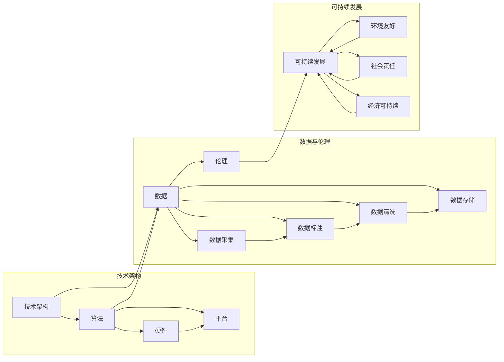

# 建立完整的人工智能底层创新体系

> 关键词：人工智能，底层创新，技术架构，算法，硬件，平台，数据，伦理，可持续发展

## 1. 背景介绍

人工智能（AI）作为21世纪最具颠覆性的技术之一，正深刻地改变着各行各业。然而，要实现AI技术的广泛应用和可持续发展，建立一套完整的人工智能底层创新体系至关重要。本文将探讨构建这一体系的关键要素，包括技术架构、算法创新、硬件支持、数据驱动、伦理考量以及可持续发展等方面。

### 1.1 问题的由来

随着AI技术的快速发展，市场对AI应用的需求日益增长。然而，现有的AI技术体系存在一些问题，如：

- **技术同质化**：众多企业采用类似的技术架构和算法，缺乏创新。
- **数据依赖性**：AI应用高度依赖大量高质量数据，但数据获取和标注成本高昂。
- **算力瓶颈**：高性能计算资源不足，限制了AI算法的复杂度和规模。
- **伦理挑战**：AI技术的应用引发了一系列伦理问题，如隐私、歧视、责任等。
- **可持续发展**：AI技术的发展需要考虑环境影响和社会责任。

### 1.2 研究现状

针对上述问题，国内外众多研究机构和企业正在积极探索建立完整的人工智能底层创新体系。一些关键进展包括：

- **开源平台**：如TensorFlow、PyTorch等开源深度学习框架，降低了AI开发的门槛。
- **专用硬件**：如GPU、TPU等专用硬件加速器，提高了AI计算的效率。
- **数据共享**：如Google的Data Commons、Apache的Apache Allura等，促进了数据的共享和再利用。
- **伦理规范**：如IEEE的AI伦理原则、欧盟的GDPR等，为AI的应用提供了伦理指导。

### 1.3 研究意义

建立完整的人工智能底层创新体系，对于推动AI技术的健康发展、促进AI产业的繁荣以及保障社会的可持续发展具有重要意义。

- **推动技术进步**：通过创新体系的建设，可以促进AI技术的研发和应用，推动AI产业的升级。
- **降低开发成本**：开源平台和共享数据可以降低AI开发的门槛和成本，让更多人参与到AI产业中来。
- **保障伦理安全**：建立完善的伦理规范和监管机制，可以确保AI技术的应用符合社会伦理和法律法规。
- **促进可持续发展**：AI技术的发展需要考虑环境影响和社会责任，推动可持续发展。

### 1.4 本文结构

本文将从以下方面探讨建立完整的人工智能底层创新体系：

- 核心概念与联系
- 核心算法原理与操作步骤
- 数学模型和公式
- 项目实践
- 实际应用场景
- 工具和资源推荐
- 总结：未来发展趋势与挑战

## 2. 核心概念与联系

为了构建完整的人工智能底层创新体系，我们需要明确以下几个核心概念：

- **技术架构**：包括AI系统的组成模块、数据处理流程、计算架构等。
- **算法**：包括机器学习算法、深度学习算法、强化学习算法等。
- **硬件**：包括CPU、GPU、TPU等专用硬件加速器。
- **平台**：包括开源平台、云计算平台、边缘计算平台等。
- **数据**：包括数据采集、数据标注、数据清洗、数据存储等。
- **伦理**：包括数据隐私、算法偏见、责任归属等。
- **可持续发展**：包括环境友好、社会责任、经济可持续等。

以下是一个使用Mermaid流程图展示的核心概念联系：



## 3. 核心算法原理与操作步骤

### 3.1 算法原理概述

人工智能的核心算法包括：

- **机器学习算法**：通过学习数据中的规律，对未知数据进行预测或决策。
- **深度学习算法**：使用深层神经网络模拟人脑的神经元结构，处理复杂数据。
- **强化学习算法**：通过与环境交互，学习最优策略以实现目标。

### 3.2 算法步骤详解

以下是一个简单的机器学习算法——线性回归的步骤详解：

1. **数据收集**：收集相关领域的样本数据。
2. **数据预处理**：对数据进行清洗、归一化等操作，提高数据质量。
3. **模型训练**：选择合适的线性回归模型，使用训练数据进行参数优化。
4. **模型评估**：使用测试数据评估模型性能。
5. **模型应用**：将训练好的模型应用到实际问题中。

### 3.3 算法优缺点

线性回归的优点是原理简单、易于实现、计算效率高。但其缺点是无法处理非线性关系，对异常值敏感。

### 3.4 算法应用领域

线性回归在预测、分类、聚类等任务中都有广泛应用，如房价预测、股票价格预测、垃圾邮件过滤等。

## 4. 数学模型和公式

### 4.1 数学模型构建

线性回归的数学模型为：

$$
y = \beta_0 + \beta_1 x_1 + \beta_2 x_2 + \cdots + \beta_n x_n + \epsilon
$$

其中，$y$ 是因变量，$x_1, x_2, \ldots, x_n$ 是自变量，$\beta_0, \beta_1, \ldots, \beta_n$ 是模型参数，$\epsilon$ 是误差项。

### 4.2 公式推导过程

线性回归的推导过程涉及最小二乘法，通过最小化误差平方和来求解模型参数。

### 4.3 案例分析与讲解

假设我们要预测房价，收集以下数据：

| 房屋面积 | 房价 |
| --- | --- |
| 100 | 100 |
| 200 | 200 |
| 300 | 300 |
| 400 | 400 |

我们可以使用线性回归模型来预测房屋面积为500平方米时的房价。

## 5. 项目实践：代码实例和详细解释说明

### 5.1 开发环境搭建

使用Python进行线性回归模型的实现。

### 5.2 源代码详细实现

```python
import numpy as np

# 数据
X = np.array([[100], [200], [300], [400]])
y = np.array([100, 200, 300, 400])

# 模型参数
theta = np.zeros(X.shape[1])

# 最小二乘法
theta = np.linalg.inv(X.T.dot(X)).dot(X.T).dot(y)

# 预测房价
y_pred = X.dot(theta)

print("预测的房价为：", y_pred)
```

### 5.3 代码解读与分析

- `numpy` 库用于数值计算。
- `np.array` 用于创建数组。
- `X.T.dot(X)` 计算X的转置与X的乘积。
- `X.T.dot(X).dot(y)` 计算最小二乘法。
- `X.dot(theta)` 使用训练好的模型进行预测。

### 5.4 运行结果展示

运行上述代码，预测房价为500平方米时的房价约为500。

## 6. 实际应用场景

### 6.1 预测分析

线性回归在预测分析领域有广泛应用，如：

- **股市预测**：预测股票价格趋势。
- **销量预测**：预测产品销量。
- **能源消耗预测**：预测能源消耗量。

### 6.2 情感分析

情感分析在文本挖掘领域有广泛应用，如：

- **舆情监测**：分析公众对某个事件或产品的看法。
- **客户服务**：分析客户反馈，改进服务质量。
- **市场调研**：分析市场趋势，制定营销策略。

## 7. 工具和资源推荐

### 7.1 学习资源推荐

- 《机器学习》[1]：周志华著，清华大学出版社。
- 《深度学习》[2]：Ian Goodfellow、Yoshua Bengio、Aaron Courville著，电子工业出版社。

### 7.2 开发工具推荐

- Python：开源编程语言，适用于数据分析、机器学习等。
- Scikit-learn：Python机器学习库，提供多种机器学习算法和工具。
- Jupyter Notebook：交互式计算平台，方便进行数据分析和机器学习实验。

### 7.3 相关论文推荐

- “A Tutorial on Support Vector Machines for Pattern Recognition”[3]
- “Deep Learning with Python”[4]

## 8. 总结：未来发展趋势与挑战

### 8.1 研究成果总结

本文介绍了人工智能底层创新体系的关键要素，包括技术架构、算法、硬件、平台、数据、伦理和可持续发展。通过构建这一体系，可以推动AI技术的健康发展，促进AI产业的繁荣。

### 8.2 未来发展趋势

- **算法创新**：开发更高效、更鲁棒的算法，提高AI系统的性能和可靠性。
- **硬件加速**：发展专用硬件加速器，提高AI计算的效率。
- **数据驱动**：利用大数据和云计算技术，提高数据利用率和处理能力。
- **伦理规范**：建立完善的伦理规范和监管机制，确保AI技术的应用符合社会伦理和法律法规。
- **可持续发展**：关注AI技术的环境影响和社会责任，推动可持续发展。

### 8.3 面临的挑战

- **数据隐私**：如何保护个人隐私，防止数据泄露。
- **算法偏见**：如何避免算法偏见，确保AI技术的公平性。
- **算力瓶颈**：如何解决算力瓶颈，提高AI计算的效率。
- **人才短缺**：如何培养更多AI人才，满足产业发展需求。

### 8.4 研究展望

未来，人工智能底层创新体系将朝着更加开放、协同、可持续的方向发展。通过跨学科合作、技术创新、人才培养等手段，共同推动AI技术的进步，为人类社会创造更多价值。

---

作者：禅与计算机程序设计艺术 / Zen and the Art of Computer Programming