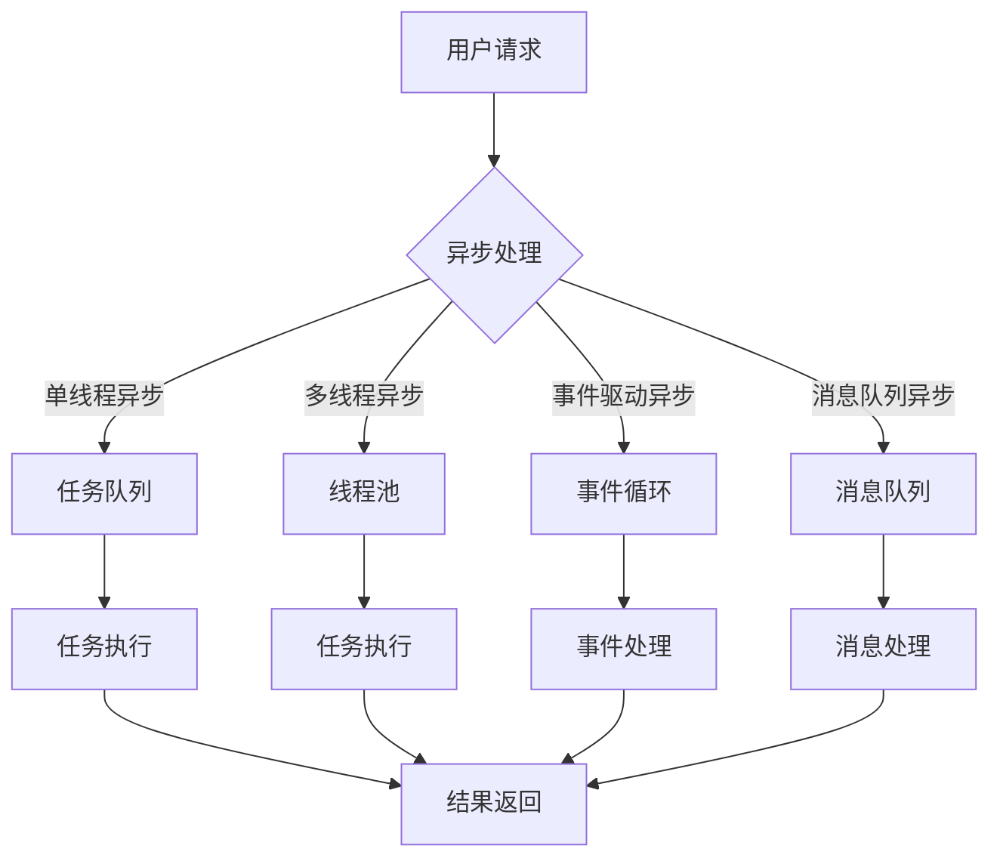

# 异步处理技术在高吞吐量中的实例应用

> 关键词：异步处理，高吞吐量，并发编程，消息队列，事件驱动，微服务，性能优化

## 1. 背景介绍

随着互联网技术的发展，高并发、高吞吐量的系统需求日益增长。在传统的串行处理模型中，系统性能容易受到单点瓶颈的限制，难以满足日益增长的用户需求。异步处理技术作为一种重要的系统设计模式，能够有效提高系统的并发能力和吞吐量。本文将深入探讨异步处理技术的原理、应用和实践，并结合实际案例进行详细分析。

### 1.1 问题的由来

随着Web 2.0和移动互联网的兴起，用户对系统响应速度和并发能力的要求越来越高。传统的同步阻塞模型在处理大量并发请求时，往往会出现以下问题：

- **CPU资源浪费**：线程阻塞在I/O操作上，导致CPU资源被闲置。
- **线程上下文切换开销**：频繁的线程创建和销毁，造成上下文切换开销巨大。
- **内存消耗**：大量线程占用内存，导致内存资源紧张。
- **系统瓶颈**：单点瓶颈限制了系统整体性能。

异步处理技术通过将I/O操作和计算任务解耦，可以有效地解决上述问题，提高系统的并发能力和吞吐量。

### 1.2 研究现状

异步处理技术已经广泛应用于各种系统和平台中，如消息队列、事件驱动架构、微服务架构等。以下是一些常见的异步处理技术：

- **消息队列**：如RabbitMQ、Kafka、ActiveMQ等，用于解耦服务间的通信，提高系统的解耦性和扩展性。
- **事件驱动架构**：如Node.js、EventMachine等，以事件为驱动，实现高效的I/O处理。
- **微服务架构**：将系统拆分为多个独立服务，通过异步方式进行通信，提高系统的可伸缩性和可维护性。

### 1.3 研究意义

研究异步处理技术对于提升系统性能、提高开发效率具有重要意义：

- **提高并发能力和吞吐量**：异步处理可以减少线程上下文切换开销，充分利用CPU和I/O资源，提高系统的并发能力和吞吐量。
- **提升用户体验**：异步处理可以缩短用户等待时间，提升用户体验。
- **提高开发效率**：异步处理模式可以简化系统设计，提高开发效率。
- **增强系统可扩展性**：异步处理可以降低系统耦合度，提高系统的可扩展性。

### 1.4 本文结构

本文将分为以下几个部分：

- 第2部分介绍异步处理技术的核心概念与联系。
- 第3部分详细阐述异步处理的核心算法原理和具体操作步骤。
- 第4部分介绍异步处理中的数学模型和公式，并进行案例分析与讲解。
- 第5部分以代码实例和详细解释说明异步处理技术的应用。
- 第6部分探讨异步处理技术在实际应用场景中的应用。
- 第7部分推荐异步处理相关的学习资源、开发工具和参考文献。
- 第8部分总结异步处理技术的发展趋势与挑战。
- 第9部分为附录，提供常见问题与解答。

## 2. 核心概念与联系

### 2.1 核心概念原理

异步处理技术的核心思想是将耗时的I/O操作或计算任务从主线程中分离出来，交给其他线程或进程处理，从而避免阻塞主线程，提高系统并发能力和吞吐量。

以下是一些常见的异步处理技术：

- **单线程异步**：使用单个线程处理多个任务，通过任务队列来管理任务执行顺序。
- **多线程异步**：使用多个线程并行处理多个任务，通过线程池来管理线程资源。
- **事件驱动异步**：使用事件循环来处理异步事件，如I/O事件、定时器事件等。
- **消息队列异步**：使用消息队列来解耦服务间的通信，实现异步处理。

### 2.2 架构的 Mermaid 流程图



图中展示了异步处理技术的基本流程，包括用户请求、异步处理、任务队列/线程池/事件循环/消息队列、任务执行和结果返回等环节。

## 3. 核心算法原理 & 具体操作步骤

### 3.1 算法原理概述

异步处理技术的主要原理如下：

- **任务解耦**：将耗时的I/O操作或计算任务从主线程中分离出来，交给其他线程或进程处理，避免阻塞主线程。
- **并发执行**：通过多线程、多进程或事件驱动等方式，并行处理多个任务，提高系统并发能力和吞吐量。
- **消息传递**：使用消息队列、事件队列等方式，传递任务状态和结果，实现任务之间的解耦和协作。

### 3.2 算法步骤详解

异步处理技术的具体步骤如下：

1. **任务创建**：创建需要异步处理的任务，包括I/O任务、计算任务等。
2. **任务调度**：将任务提交到任务队列、线程池、事件循环或消息队列中。
3. **任务执行**：任务执行者从任务队列、线程池、事件循环或消息队列中取出任务进行执行。
4. **结果处理**：任务执行完成后，将结果返回给调用者或存储到结果队列中。

### 3.3 算法优缺点

异步处理技术的优点如下：

- **提高并发能力和吞吐量**：通过并发处理多个任务，提高系统并发能力和吞吐量。
- **降低资源消耗**：减少线程上下文切换开销，降低CPU和内存消耗。
- **提高系统可维护性**：将任务解耦，提高系统可维护性。

异步处理技术的缺点如下：

- **复杂度增加**：异步处理技术相比同步处理，设计复杂度更高，需要更多的编程技巧和经验。
- **调试困难**：异步处理中的任务调度和消息传递可能导致调试困难。

### 3.4 算法应用领域

异步处理技术适用于以下领域：

- **Web服务器**：如Nginx、Apache等，使用异步I/O处理大量并发请求。
- **消息队列**：如RabbitMQ、Kafka等，使用异步消息传递实现高吞吐量的分布式系统。
- **微服务架构**：如Spring Cloud、Docker等，使用异步通信实现高并发、高可用的微服务系统。

## 4. 数学模型和公式 & 详细讲解 & 举例说明

### 4.1 数学模型构建

异步处理技术的数学模型主要包括以下内容：

- **任务执行时间**：$T_{task}$
- **任务间依赖关系**：$R_{task}$
- **系统资源**：$R_{sys}$
- **系统吞吐量**：$Q_{sys}$

### 4.2 公式推导过程

系统吞吐量 $Q_{sys}$ 可以通过以下公式进行计算：

$$
Q_{sys} = \frac{R_{sys}}{T_{task} + \sum_{i=1}^n R_{task_i}}
$$

其中，$R_{sys}$ 为系统资源，$T_{task}$ 为任务执行时间，$R_{task_i}$ 为第 $i$ 个任务的资源需求。

### 4.3 案例分析与讲解

以下以一个简单的异步任务为例，说明异步处理技术的应用。

假设有一个Web服务器，需要处理大量并发HTTP请求。服务器使用异步I/O处理请求，任务执行时间 $T_{task}$ 为1ms，系统资源 $R_{sys}$ 为1000个并发连接。

根据上述公式，系统吞吐量 $Q_{sys}$ 为：

$$
Q_{sys} = \frac{1000}{1 + 1000 \times 1} = 0.5
$$

这意味着在理想情况下，每秒可以处理500个请求。

如果使用同步I/O处理请求，则系统吞吐量 $Q_{sys}$ 为：

$$
Q_{sys} = \frac{1000}{1000} = 1
$$

可以看出，异步处理技术可以显著提高系统的吞吐量。

## 5. 项目实践：代码实例和详细解释说明

### 5.1 开发环境搭建

以下是使用Python进行异步编程的环境搭建流程：

1. 安装Python 3.6或更高版本。
2. 安装asyncio库，用于支持异步编程。

```bash
pip install asyncio
```

### 5.2 源代码详细实现

以下是一个使用Python的asyncio库实现异步Web服务器的示例代码：

```python
import asyncio

async def handle_request(reader, writer):
    data = await reader.read(100)
    print("Received:", data.decode())
    writer.write(data.upper())
    await writer.drain()
    writer.close()
    await writer.wait_closed()

async def main():
    server = await asyncio.start_server(handle_request, '127.0.0.1', 8888)
    addr = server.sockets[0].getsockname()
    print(f'Serving on {addr}')
    await server.serve_forever()

asyncio.run(main())
```

### 5.3 代码解读与分析

以上代码实现了一个简单的异步Web服务器，使用asyncio库处理客户端的连接和请求。

- `handle_request` 函数：异步处理客户端请求，读取请求内容，并返回大写响应。
- `main` 函数：启动异步服务器，监听本地8888端口。

通过使用asyncio库，服务器可以同时处理多个客户端请求，提高并发能力和吞吐量。

### 5.4 运行结果展示

运行上述代码，启动异步Web服务器：

```bash
python async_server.py
```

在浏览器或其他工具中访问 http://127.0.0.1:8888/，可以看到服务器返回大写响应。

## 6. 实际应用场景

### 6.1 Web服务器

异步处理技术在Web服务器中得到了广泛应用，如Nginx、Apache等。通过异步I/O处理大量并发请求，提高服务器性能。

### 6.2 消息队列

消息队列如RabbitMQ、Kafka等，使用异步消息传递实现高吞吐量的分布式系统，如电商、金融、物流等场景。

### 6.3 微服务架构

微服务架构如Spring Cloud、Docker等，使用异步通信实现高并发、高可用的微服务系统。

## 7. 工具和资源推荐

### 7.1 学习资源推荐

- 《Python异步编程实战》
- 《Node.js高级程序设计》
- 《异步消息队列：原理与实践》

### 7.2 开发工具推荐

- Python的asyncio库
- Node.js的Event Loop
- 消息队列软件，如RabbitMQ、Kafka等

### 7.3 相关论文推荐

- 《Asynchronous I/O: A New Model for Concurrent Programming on Shared-Memory Multiprocessors》
- 《Event-Driven Programming with Node.js》
- 《Message Queuing: Concepts and Comparisons》

## 8. 总结：未来发展趋势与挑战

### 8.1 研究成果总结

异步处理技术作为一种重要的系统设计模式，在提高系统并发能力和吞吐量方面发挥着重要作用。本文介绍了异步处理技术的核心概念、算法原理、应用实例和发展趋势，为读者提供了全面的理论和实践指导。

### 8.2 未来发展趋势

异步处理技术在未来将呈现以下发展趋势：

- **更轻量级的异步框架**：随着Node.js、Go等语言的流行，更轻量级的异步框架将不断涌现，提高异步编程的易用性。
- **多语言支持**：异步处理技术将得到更多编程语言的青睐，支持多种语言进行异步编程。
- **更高效的消息队列**：消息队列技术将更加高效，支持更高的吞吐量和更低的延迟。

### 8.3 面临的挑战

异步处理技术在实际应用中仍面临以下挑战：

- **编程复杂度**：异步编程相比同步编程，编程复杂度更高，需要开发者具备更强的编程能力和经验。
- **调试困难**：异步编程中的任务调度和消息传递可能导致调试困难。
- **性能瓶颈**：异步处理技术本身可能成为性能瓶颈，需要进一步优化。

### 8.4 研究展望

为了克服异步处理技术面临的挑战，未来需要在以下方面进行深入研究：

- **异步编程语言和框架**：开发更易用、更高效的异步编程语言和框架。
- **异步编程工具**：开发更强大的异步编程调试工具，提高异步编程的易用性和可维护性。
- **性能优化**：优化异步处理技术，提高系统的性能和可扩展性。

## 9. 附录：常见问题与解答

**Q1：异步处理技术与多线程有什么区别？**

A：异步处理技术与多线程的主要区别在于：

- 异步处理关注于任务调度和消息传递，多线程关注于并发执行。
- 异步处理可以避免线程阻塞，多线程需要处理线程同步和竞争条件。

**Q2：如何选择合适的异步框架？**

A：选择合适的异步框架需要考虑以下因素：

- **编程语言**：选择支持异步编程的编程语言，如Python、Node.js等。
- **性能要求**：选择性能优异的异步框架，如Node.js、Go等。
- **社区支持**：选择社区活跃、文档完善的异步框架。

**Q3：异步编程有什么注意事项？**

A：异步编程需要注意以下事项：

- **错误处理**：异步编程中的错误处理比同步编程更加复杂。
- **代码可读性**：异步编程代码的可读性相对较低，需要良好的编程规范和编码习惯。

**Q4：异步处理技术是否适用于所有场景？**

A：异步处理技术适用于以下场景：

- **高并发、高吞吐量**：如Web服务器、消息队列等。
- **需要处理耗时的I/O操作或计算任务**：如网络请求、数据库操作等。

**Q5：异步处理技术与同步处理相比，有哪些优势？**

A：异步处理技术与同步处理相比，具有以下优势：

- **提高并发能力和吞吐量**：避免线程阻塞，提高系统并发能力和吞吐量。
- **降低资源消耗**：减少线程上下文切换开销，降低CPU和内存消耗。
- **提高系统可维护性**：将任务解耦，提高系统可维护性。

作者：禅与计算机程序设计艺术 / Zen and the Art of Computer Programming