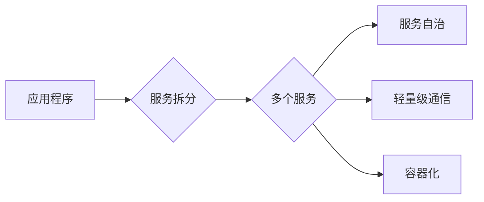

# 微服务在高扩展性中的优势

> 关键词：微服务架构，高扩展性，容错性，系统性能，分布式系统，服务拆分，负载均衡，弹性计算

## 1. 背景介绍

随着互联网和移动应用的快速发展，企业对于系统的高可用性、可扩展性和快速迭代能力提出了更高的要求。传统的单体应用架构在处理高并发、高负载的场景时，往往难以满足这些需求。为了应对这些挑战，微服务架构应运而生。微服务架构将大型应用拆分为多个独立的服务，每个服务负责特定的功能，通过轻量级通信机制（如RESTful API）相互协作。这种架构模式具有许多优势，尤其在实现高扩展性方面表现出色。

## 2. 核心概念与联系

### 2.1 微服务架构

微服务架构是一种设计方法，它将单一的应用程序作为一组小型、独立的服务部署。每个服务都有自己的业务逻辑、数据存储和API接口。以下是微服务架构的一些核心概念：

- **服务拆分**：将大型应用拆分为多个独立的服务。
- **服务自治**：每个服务独立部署、升级和扩展。
- **轻量级通信**：服务之间通过RESTful API进行通信。
- **容器化**：使用容器技术（如Docker）部署服务，提高资源利用率。

以下是一个简化的Mermaid流程图，展示了微服务架构的基本原理：



### 2.2 高扩展性

高扩展性是指系统在处理更多用户请求时，能够保持性能和可用性。微服务架构通过以下方式实现高扩展性：

- **水平扩展**：增加更多服务实例来处理更多的请求。
- **垂直扩展**：增加服务实例的计算资源（如CPU、内存）。
- **负载均衡**：将请求分配到不同的服务实例。

### 2.3 容错性

容错性是指系统在组件失败时能够继续正常运行。微服务架构通过以下方式提高容错性：

- **服务副本**：为每个服务创建多个副本，提高系统的可用性。
- **断路器模式**：当服务出现故障时，自动停止向该服务发送请求。
- **服务熔断**：在检测到服务不可用时，立即返回默认值。

## 3. 核心算法原理 & 具体操作步骤

### 3.1 算法原理概述

微服务架构的核心算法原理是服务拆分和分布式系统的设计。以下是实现微服务架构的关键步骤：

1. **需求分析**：分析应用的功能需求，确定服务拆分策略。
2. **服务设计**：设计每个服务的接口、数据存储和业务逻辑。
3. **服务开发**：使用合适的编程语言和技术栈开发每个服务。
4. **服务部署**：将服务容器化，并部署到容器编排平台（如Kubernetes）。
5. **服务监控**：监控服务的性能和健康状态，及时发现问题。
6. **服务治理**：管理服务的配置、权限和生命周期。

### 3.2 算法步骤详解

以下是实现微服务架构的详细步骤：

1. **需求分析**：分析应用的功能需求，确定服务拆分策略。例如，可以将用户管理、订单处理、库存管理等功能拆分为独立的服务。
2. **服务设计**：为每个服务设计API接口，定义数据模型和业务逻辑。确保服务之间通过轻量级通信机制（如RESTful API）进行交互。
3. **服务开发**：使用合适的编程语言和技术栈（如Spring Boot、Node.js）开发每个服务。确保服务之间无状态，便于水平扩展。
4. **服务部署**：将服务容器化，并部署到容器编排平台（如Kubernetes）。利用容器编排平台的自动扩展功能，实现水平扩展。
5. **服务监控**：使用监控工具（如Prometheus、Grafana）监控服务的性能和健康状态。设置告警规则，及时发现并解决问题。
6. **服务治理**：使用配置管理工具（如Consul）管理服务的配置。使用权限管理工具（如OAuth 2.0）管理用户权限。使用服务管理工具（如Kubernetes）管理服务生命周期。

### 3.3 算法优缺点

微服务架构具有以下优点：

- **高扩展性**：通过水平扩展和垂直扩展，提高系统的处理能力。
- **灵活性和可维护性**：每个服务独立开发、部署和扩展，降低维护成本。
- **可重用性**：服务可以独立重构、升级和替换，提高系统可维护性。
- **容错性**：通过服务副本和断路器模式，提高系统的容错性。

微服务架构也存在以下缺点：

- **复杂性**：服务拆分和分布式系统设计增加了系统的复杂性。
- **通信开销**：服务之间通过API进行通信，存在通信开销。
- **一致性**：在分布式系统中，数据一致性问题难以保证。

### 3.4 算法应用领域

微服务架构适用于以下场景：

- **大型企业级应用**：需要高可用性、可扩展性和快速迭代能力。
- **互联网应用**：需要处理高并发、高负载的用户请求。
- **移动应用后端**：需要与移动应用进行高效交互。
- **微服务化改造**：将传统的单体应用改造为微服务架构。

## 4. 数学模型和公式 & 详细讲解 & 举例说明

### 4.1 数学模型构建

微服务架构的数学模型主要关注系统的性能和可用性。以下是一个简化的数学模型：

$$
P = f(T, C)
$$

其中，$P$ 表示系统的性能，$T$ 表示系统负载，$C$ 表示系统计算资源。

### 4.2 公式推导过程

假设系统负载 $T$ 与系统计算资源 $C$ 成正比，则：

$$
P \propto \frac{1}{T \cdot C}
$$

当系统计算资源增加时，系统性能提高；当系统负载增加时，系统性能下降。

### 4.3 案例分析与讲解

假设一个微服务架构的系统，包含100个服务实例，每个服务实例的计算资源为4核CPU和8GB内存。当系统负载为1000个请求/秒时，系统的性能为0.1。当系统负载增加到2000个请求/秒时，系统的性能下降到0.05。

为了提高系统性能，可以采取以下措施：

1. 增加服务实例数量：将服务实例数量增加到200个，提高系统的处理能力。
2. 增加单个服务实例的计算资源：将单个服务实例的计算资源增加到8核CPU和16GB内存，提高单个实例的处理能力。
3. 采用负载均衡技术：将请求分配到不同的服务实例，提高系统的处理能力。

## 5. 项目实践：代码实例和详细解释说明

### 5.1 开发环境搭建

以下是使用Python和Django框架开发一个简单的微服务应用的步骤：

1. 安装Django：
```bash
pip install django
```

2. 创建Django项目：
```bash
django-admin startproject myproject
```

3. 创建Django应用：
```bash
cd myproject
python manage.py startapp myapp
```

4. 配置Django项目文件 `settings.py`：
```python
# settings.py

INSTALLED_APPS = [
    'django.contrib.admin',
    'django.contrib.auth',
    'django.contrib.contenttypes',
    'django.contrib.sessions',
    'django.contrib.messages',
    'django.contrib.staticfiles',
    'myapp',
]

# ...
```

5. 编写Django应用代码：
```python
# myapp/views.py

from django.http import JsonResponse

def index(request):
    return JsonResponse({'message': 'Hello, World!'})
```

6. 运行Django开发服务器：
```bash
python manage.py runserver
```

### 5.2 源代码详细实现

以下是Django应用的完整代码：

```python
# myproject/settings.py

# ...

# myapp/views.py

from django.http import JsonResponse

def index(request):
    return JsonResponse({'message': 'Hello, World!'})
```

### 5.3 代码解读与分析

以上代码展示了如何使用Django框架创建一个简单的微服务应用。首先，创建Django项目和应用。然后，在应用中定义视图函数，处理HTTP请求。最后，运行Django开发服务器，启动应用。

### 5.4 运行结果展示

在浏览器中访问 `http://localhost:8000/`，将看到以下响应：

```json
{
    "message": "Hello, World!"
}
```

## 6. 实际应用场景

微服务架构在以下场景中表现出色：

- **在线支付系统**：需要高可用性和可扩展性，以处理大量的支付请求。
- **电子商务平台**：需要处理高并发的用户访问和交易。
- **社交媒体平台**：需要处理大量的用户生成内容和社交互动。
- **内容管理系统**：需要支持用户内容的高效创建、管理和发布。

## 7. 工具和资源推荐

### 7.1 学习资源推荐

- 《Building Microservices》
- 《Designing Data-Intensive Applications》
- 《Microservice Patterns》

### 7.2 开发工具推荐

- Docker
- Kubernetes
- Spring Cloud
- Netflix OSS

### 7.3 相关论文推荐

- "Microservices: A Systematic Literature Review" by Richard J. Koubek and Mark Little
- "The Design of the FreeBSD Operating System" by Marshall Kirk McKusick, George V. Neville-Neil

## 8. 总结：未来发展趋势与挑战

### 8.1 研究成果总结

微服务架构通过服务拆分、轻量级通信和容器化等技术，实现了高可用性、可扩展性和快速迭代能力。这种架构模式在互联网和移动应用领域得到了广泛应用。

### 8.2 未来发展趋势

未来微服务架构将朝着以下方向发展：

- **服务网格**：使用服务网格技术，简化服务之间的通信和监控。
- **Serverless架构**：利用Serverless架构，提高资源利用率和开发效率。
- **服务发现和配置管理**：使用服务发现和配置管理工具，提高系统的可维护性。

### 8.3 面临的挑战

微服务架构也面临以下挑战：

- **复杂性**：服务拆分和分布式系统设计增加了系统的复杂性。
- **通信开销**：服务之间通过API进行通信，存在通信开销。
- **数据一致性和安全性**：分布式系统中的数据一致性和安全性问题难以保证。

### 8.4 研究展望

未来，微服务架构将与其他新兴技术（如服务网格、Serverless架构）相结合，为构建更加高效、可维护和安全的分布式系统提供更多可能性。

---

作者：禅与计算机程序设计艺术 / Zen and the Art of Computer Programming