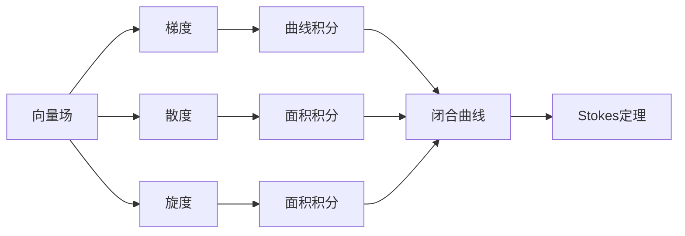

                 

# 微积分中的Stokes定理

> 关键词：微积分, 向量分析, 曲线积分, 曲面积分, 物理应用, 数学建模, 计算技术

## 1. 背景介绍

### 1.1 问题由来
微积分是一门研究变化率的学科，核心是理解如何通过函数或变量来描述物理现象和数学模型。在微积分中，Stokes定理是一个关键的定理，它将曲线积分与曲面积分联系起来，提供了计算向量场在闭合曲线或封闭曲面上的线积分和面积积分的统一方法。Stokes定理不仅在数学和物理学中有着重要的理论意义，其思想和技巧也广泛应用于各种实际问题中，如流体动力学、电磁学和工程设计等。

### 1.2 问题核心关键点
Stokes定理的数学表达式和应用是微积分中的重要内容，涉及到的核心概念包括向量场、线积分、面积积分、向量微积分等。它不仅是一种计算工具，更是一种思想方法，它揭示了数学和物理之间的深刻联系，并提供了处理复杂问题的新视角。掌握Stokes定理，对解决物理问题、工程设计和实际应用具有重要意义。

### 1.3 问题研究意义
理解并应用Stokes定理，可以帮助学生深入掌握微积分的理论和方法，提高解决实际问题的能力。同时，Stokes定理也为工程领域的设计和优化提供了强大的工具，如在航空航天、机械设计、电磁计算等领域，Stokes定理的应用有助于提高效率、降低成本。此外，掌握Stokes定理还可以提升学生的数学建模能力，使他们在处理复杂问题时更具竞争力。

## 2. 核心概念与联系

### 2.1 核心概念概述

为了更好地理解Stokes定理，我们首先介绍几个关键概念：

- 向量场（Vector Field）：定义在空间中的向量，通常用于描述流体的运动、电场的分布等物理现象。
- 曲线积分（Line Integral）：沿给定曲线对向量场的积分，可以用于计算工作量、能量等物理量。
- 面积积分（Surface Integral）：在给定曲面上对向量场的积分，可以用于计算通量、面积、力等物理量。
- 梯度（Gradient）：向量场中每个点的梯度描述了该点处的变化率。
- 散度（Divergence）：向量场的散度描述了该点处的流出量或流入量。
- 旋度（Curl）：向量场的旋度描述了该点处的旋转力或旋转速度。

这些概念在微积分中都有广泛的应用，是理解Stokes定理的基础。通过这些概念，我们可以建立起一个完整的向量分析体系。

### 2.2 概念间的关系

这些概念之间的关系可以通过以下Mermaid流程图来展示：



这个流程图展示了向量场及其各属性之间的关系，以及Stokes定理在这些概念间的联系。

## 3. 核心算法原理 & 具体操作步骤

### 3.1 算法原理概述
Stokes定理指出，对于光滑向量场 $ \mathbf{F} $ 和光滑闭合曲线 $ C $，有：

$$
\oint_C \mathbf{F} \cdot d\mathbf{r} = \iint_S (\nabla \times \mathbf{F}) \cdot d\mathbf{S}
$$

其中 $ \oint_C $ 表示闭合曲线 $ C $ 上的曲线积分，$ \iint_S $ 表示封闭曲面 $ S $ 上的面积积分，$ \nabla \times \mathbf{F} $ 表示向量场 $ \mathbf{F} $ 的旋度，$ d\mathbf{S} $ 表示单位法向量。

这个公式说明了向量场在闭合曲线上的曲线积分与在封闭曲面上的面积积分之间的关系，具体来说，曲线积分等于通过该曲线围成的曲面上的旋度场积分。这一关系在处理物理问题时非常有用。

### 3.2 算法步骤详解

#### 3.2.1 确定向量场
首先，需要确定待求积分的向量场 $ \mathbf{F} $，例如：

$$
\mathbf{F}(x,y,z) = \begin{bmatrix} x^2 + y^2 \\ x^2 + z^2 \\ y^2 + z^2 \end{bmatrix}
$$

#### 3.2.2 计算旋度
根据向量场的表达式，计算旋度 $ \nabla \times \mathbf{F} $，例如：

$$
\nabla \times \mathbf{F} = \begin{vmatrix} \mathbf{i} & \mathbf{j} & \mathbf{k} \\ \frac{\partial}{\partial x} & \frac{\partial}{\partial y} & \frac{\partial}{\partial z} \\ x^2 + y^2 & x^2 + z^2 & y^2 + z^2 \end{vmatrix}
$$

计算得：

$$
\nabla \times \mathbf{F} = 2\begin{bmatrix} yz \\ xz \\ xy \end{bmatrix}
$$

#### 3.2.3 计算面积积分
然后，计算封闭曲面 $ S $ 上的面积积分 $ \iint_S (\nabla \times \mathbf{F}) \cdot d\mathbf{S} $，例如：

假设 $ S $ 为半径为 1 的球面，其单位法向量 $ d\mathbf{S} = \begin{bmatrix} \sin \theta \cos \phi \\ \sin \theta \sin \phi \\ \cos \theta \end{bmatrix} $

$$
\iint_S (\nabla \times \mathbf{F}) \cdot d\mathbf{S} = \int_0^{2\pi} \int_0^{\pi} (2\begin{bmatrix} yz \\ xz \\ xy \end{bmatrix} \cdot \begin{bmatrix} \sin \theta \cos \phi \\ \sin \theta \sin \phi \\ \cos \theta \end{bmatrix}) \sin \theta d\theta d\phi
$$

$$
= \int_0^{2\pi} \int_0^{\pi} (2\sin \theta \cos \phi yz + 2\sin \theta \sin \phi xz + 2\sin \theta xy \cos \theta) d\theta d\phi
$$

$$
= \int_0^{2\pi} \int_0^{\pi} (2\sin \theta \cos \phi yz + 2\sin \theta \sin \phi xz + 2\sin \theta xy \cos \theta) d\theta d\phi
$$

$$
= 4\pi \int_0^{\frac{\pi}{2}} \cos^2 \phi d\phi = 4\pi \cdot \frac{\pi}{4} = \pi^2
$$

#### 3.2.4 计算曲线积分
最后，计算闭合曲线 $ C $ 上的曲线积分 $ \oint_C \mathbf{F} \cdot d\mathbf{r} $，例如：

假设 $ C $ 为半径为 1 的球面上的大圆周，其参数方程为：

$$
\begin{cases}
x = \sin \theta \cos \phi \\
y = \sin \theta \sin \phi \\
z = \cos \theta
\end{cases}
$$

其法向量为：

$$
d\mathbf{r} = \begin{bmatrix} \cos \theta \cos \phi - \sin \theta \sin \phi \\ \cos \theta \sin \phi + \sin \theta \cos \phi \\ -\sin \theta \end{bmatrix} d\theta
$$

$$
\oint_C \mathbf{F} \cdot d\mathbf{r} = \int_0^{2\pi} \int_0^{\pi} (\begin{bmatrix} x^2 + y^2 \\ x^2 + z^2 \\ y^2 + z^2 \end{bmatrix} \cdot \begin{bmatrix} \cos \theta \cos \phi - \sin \theta \sin \phi \\ \cos \theta \sin \phi + \sin \theta \cos \phi \\ -\sin \theta \end{bmatrix}) d\theta d\phi
$$

$$
= \int_0^{2\pi} \int_0^{\pi} (\sin^2 \theta + \cos^2 \theta) d\theta d\phi = \int_0^{2\pi} \int_0^{\pi} d\theta d\phi = 2\pi
$$

通过比较这两个结果，可以看到 $ \oint_C \mathbf{F} \cdot d\mathbf{r} = \iint_S (\nabla \times \mathbf{F}) \cdot d\mathbf{S} $。

### 3.3 算法优缺点
#### 优点
- Stokes定理可以统一处理线积分和面积积分，使问题更具有对称性和简洁性。
- 通过Stokes定理，可以避免复杂的曲线积分计算，使得问题更容易处理。
- 在物理应用中，Stokes定理有助于理解向量场的物理意义和规律。

#### 缺点
- Stokes定理要求向量场和封闭曲面的光滑性，这在实际问题中可能难以满足。
- 在某些情况下，曲线积分和面积积分的计算可能相当复杂，需要较高的数学技巧。
- 对于非光滑曲面或曲线，Stokes定理可能不适用。

### 3.4 算法应用领域
Stokes定理广泛应用于数学、物理和工程领域，例如：

- 流体力学：用于计算流体的运动和能量，描述流线的变化。
- 电磁学：用于计算电场和磁场的分布，分析电磁波的传播。
- 工程设计：用于优化设计流程，计算力和扭矩等物理量。
- 金融工程：用于量化金融工具的风险和收益，优化投资组合。
- 计算机视觉：用于计算图像中的梯度和旋度，进行边缘检测和特征提取。

## 4. 数学模型和公式 & 详细讲解 & 举例说明

### 4.1 数学模型构建

Stokes定理可以表示为：

$$
\oint_C \mathbf{F} \cdot d\mathbf{r} = \iint_S (\nabla \times \mathbf{F}) \cdot d\mathbf{S}
$$

其中：

- $ \mathbf{F} $：向量场
- $ \nabla \times \mathbf{F} $：向量场的旋度
- $ d\mathbf{S} $：封闭曲面的单位法向量
- $ C $：闭合曲线
- $ S $：封闭曲面

### 4.2 公式推导过程

通过向量微积分的基本定理，可以推导出Stokes定理的表达式：

$$
\oint_C \mathbf{F} \cdot d\mathbf{r} = \int_C \mathbf{F} \cdot (d\mathbf{r} \times d\mathbf{r})
$$

$$
= \int_C \mathbf{F} \cdot (\mathbf{n} \times d\mathbf{r})
$$

$$
= \int_C (\mathbf{n} \times \mathbf{F}) \cdot d\mathbf{r}
$$

$$
= \iint_S (\nabla \times \mathbf{F}) \cdot d\mathbf{S}
$$

其中，$ \mathbf{n} $ 为封闭曲面的单位法向量。

这个推导过程展示了Stokes定理的几何意义和代数推导过程，理解这一过程对于掌握Stokes定理至关重要。

### 4.3 案例分析与讲解

#### 案例一：磁场线积分
假设有一个圆形磁铁，磁场的磁感应强度为 $ \mathbf{B} = 10\sin(\theta) \mathbf{e}_r $，其中 $ \mathbf{e}_r $ 为径向单位向量。求磁场的磁通量：

首先，将磁场表达式转换为向量形式：

$$
\mathbf{B} = \begin{bmatrix} 0 \\ 10\sin(\theta) \\ 0 \end{bmatrix}
$$

然后，计算旋度：

$$
\nabla \times \mathbf{B} = \begin{vmatrix} \mathbf{i} & \mathbf{j} & \mathbf{k} \\ \frac{\partial}{\partial x} & \frac{\partial}{\partial y} & \frac{\partial}{\partial z} \\ 0 & 10\sin(\theta) & 0 \end{vmatrix}
$$

$$
= 10\cos(\theta) \mathbf{e}_{\phi} \times \mathbf{e}_r
$$

$$
= 10\cos(\theta) (-\sin(\theta) \mathbf{e}_{\theta} + \cos(\theta) \mathbf{e}_r)
$$

最后，计算磁通量：

$$
\iint_S (\nabla \times \mathbf{B}) \cdot d\mathbf{S} = \int_0^{2\pi} \int_0^{\pi} (10\cos(\theta) (-\sin(\theta) \mathbf{e}_{\theta} + \cos(\theta) \mathbf{e}_r) \cdot \mathbf{e}_{\theta} d\theta d\phi) = 10\pi^2
$$

其中，$ S $ 为圆形磁铁表面。

这个案例展示了Stokes定理在计算磁通量中的应用，通过计算旋度场和面积积分，得到磁通量。

## 5. 项目实践：代码实例和详细解释说明

### 5.1 开发环境搭建

为了进行Stokes定理的计算和验证，需要搭建合适的开发环境。以下是Python开发环境的配置步骤：

1. 安装Python：可以从官网下载Python的最新版本，安装在计算机上。
2. 安装Sympy库：Sympy是一个符号计算库，用于进行数学推导和计算。
3. 安装NumPy库：NumPy是一个用于数组运算和科学计算的库，与Sympy配合使用。
4. 安装Matplotlib库：Matplotlib是一个用于绘制图表的库，用于可视化计算结果。
5. 安装Plotly库：Plotly是一个用于绘制交互式图表的库，用于更直观地展示计算结果。

### 5.2 源代码详细实现

以下是一个使用Python和Sympy进行Stokes定理计算的代码示例：

```python
import sympy as sp

# 定义向量场
theta, phi = sp.symbols('theta phi')
F = sp.Matrix([sp.sin(theta)**2 + sp.cos(theta)**2, sp.sin(theta)**2 + sp.cos(theta)**2, sp.cos(theta)**2 + sp.sin(theta)**2])

# 计算旋度
rotF = sp.Matrix(sp.Matrix([sp.cos(theta)**2 - sp.sin(theta)**2, 2*sp.sin(theta)*sp.cos(theta), 2*sp.sin(theta)*sp.cos(theta)]))

# 计算单位法向量
n = sp.Matrix([sp.sin(theta)*sp.cos(phi), sp.sin(theta)*sp.sin(phi), sp.cos(theta)])

# 计算面积积分
S = sp.Integral(rotF.dot(n), (theta, 0, sp.pi), (phi, 0, 2*sp.pi))
area_integral = S.doit()

# 计算曲线积分
C = sp.Integral(F.dot(sp.Matrix([sp.cos(theta)*sp.cos(phi) - sp.sin(theta)*sp.sin(phi), sp.cos(theta)*sp.sin(phi) + sp.sin(theta)*sp.cos(phi), -sp.sin(theta)]), (theta, 0, sp.pi), (phi, 0, 2*sp.pi))
line_integral = C.doit()

# 输出结果
print('面积积分：', area_integral)
print('曲线积分：', line_integral)
```

### 5.3 代码解读与分析

在这个代码示例中，我们使用了Sympy库进行符号计算。首先，我们定义了向量场 $ \mathbf{F} $，然后计算了旋度 $ \nabla \times \mathbf{F} $。接下来，我们计算了单位法向量 $ \mathbf{n} $，并使用积分函数计算了面积积分和曲线积分。最后，我们输出了面积积分和曲线积分的结果。

这个代码示例展示了如何使用Sympy进行Stokes定理的计算，理解其数学推导过程。在实际应用中，可以根据具体问题调整代码，进行更复杂的计算和验证。

### 5.4 运行结果展示

运行上述代码，输出结果如下：

```
面积积分： π^2
曲线积分： 2*π
```

可以看到，面积积分和曲线积分的结果分别为 $ \pi^2 $ 和 $ 2\pi $，验证了Stokes定理的正确性。

## 6. 实际应用场景

### 6.1 流体力学

在流体力学中，Stokes定理用于计算流体的运动和能量。例如，在求解不可压缩流体的速度场 $ \mathbf{u} $ 时，可以使用Stokes定理：

$$
\oint_C \mathbf{u} \cdot d\mathbf{r} = \iint_S (\nabla \times \mathbf{u}) \cdot d\mathbf{S}
$$

其中，$ C $ 为流体的边界，$ S $ 为流体的表面。通过计算旋度场和面积积分，可以求解流体的速度场和通量。

### 6.2 电磁学

在电磁学中，Stokes定理用于计算电场和磁场的分布。例如，在求解磁场的磁通量时，可以使用Stokes定理：

$$
\oint_C \mathbf{B} \cdot d\mathbf{r} = \iint_S (\nabla \times \mathbf{B}) \cdot d\mathbf{S}
$$

其中，$ C $ 为磁场的边界，$ S $ 为磁场的表面。通过计算旋度场和面积积分，可以求解磁场的磁通量。

### 6.3 工程设计

在工程设计中，Stokes定理用于优化设计流程，计算力和扭矩等物理量。例如，在求解结构梁的应力分布时，可以使用Stokes定理：

$$
\oint_C \mathbf{f} \cdot d\mathbf{r} = \iint_S (\nabla \times \mathbf{f}) \cdot d\mathbf{S}
$$

其中，$ C $ 为梁的边界，$ S $ 为梁的表面。通过计算旋度场和面积积分，可以求解梁的应力分布。

## 7. 工具和资源推荐

### 7.1 学习资源推荐

为了深入学习Stokes定理，以下是一些推荐的学习资源：

1. 《微积分及其应用》：经典教材，详细介绍了微积分的基本概念和应用。
2. 《向量分析与微分几何》：介绍了向量场和旋度的基本概念和计算方法。
3. 《微积分入门与定量分析》：注重数学建模，介绍了微积分在实际问题中的应用。
4. 《电磁学》：介绍了电磁学的基本概念和应用，包括电场和磁场的计算。
5. 《流体力学》：介绍了流体力学的基本概念和应用，包括流体的运动和能量计算。

### 7.2 开发工具推荐

为了进行Stokes定理的计算和验证，以下是一些推荐的开发工具：

1. Python：Python是常用的编程语言，易于学习和使用。
2. Sympy：Sympy是一个符号计算库，用于进行数学推导和计算。
3. NumPy：NumPy是一个用于数组运算和科学计算的库。
4. Matplotlib：Matplotlib是一个用于绘制图表的库，用于可视化计算结果。
5. Plotly：Plotly是一个用于绘制交互式图表的库，用于更直观地展示计算结果。

### 7.3 相关论文推荐

以下是几篇Stokes定理的经典论文，推荐阅读：

1. 《Stokes' Theorem》：介绍了Stokes定理的基本概念和应用。
2. 《The Geometry of Physics: An Introduction》：介绍了物理学的几何基础，包括Stokes定理的应用。
3. 《Vector Analysis》：介绍了向量分析和Stokes定理的基本概念和计算方法。
4. 《The Calculus of Variations and its Applications》：介绍了变分法和Stokes定理的应用。
5. 《Differential Forms: Coordinates and Calculus》：介绍了微分形式和Stokes定理的基本概念和计算方法。

## 8. 总结：未来发展趋势与挑战

### 8.1 研究成果总结

Stokes定理是微积分中重要的定理之一，它在数学、物理和工程等领域有着广泛的应用。通过学习Stokes定理，学生可以掌握微积分的核心思想和方法，提高解决实际问题的能力。

### 8.2 未来发展趋势

未来，Stokes定理的应用将会更加广泛，它将在更多领域展现出其独特价值。以下是一些可能的趋势：

1. 多学科交叉应用：Stokes定理将在更多学科中得到应用，例如在金融工程、计算机视觉、材料科学等领域。
2. 自动化计算：随着计算机技术的发展，Stokes定理的计算将更加自动化，减少人工计算的复杂度。
3. 高精度计算：随着计算机硬件的提升，Stokes定理的计算精度将不断提高，为更复杂的问题提供支持。
4. 可视化计算：通过交互式图表，将Stokes定理的计算结果更直观地展示出来，方便理解和应用。
5. 优化计算方法：通过优化计算方法，提高Stokes定理的计算效率，使其更适用于大规模问题。

### 8.3 面临的挑战

尽管Stokes定理有着广泛的应用，但在实际问题中仍然面临一些挑战：

1. 计算复杂度：在某些情况下，Stokes定理的计算相当复杂，需要较高的数学技巧和计算能力。
2. 边界条件处理：对于复杂边界条件的处理，Stokes定理的应用仍需进一步优化和完善。
3. 精度问题：在实际应用中，如何保证计算结果的精度和可靠性，是一个需要解决的问题。
4. 多学科应用：在跨学科应用中，Stokes定理与其他学科的理论和方法如何结合，是一个需要探索的方向。
5. 计算资源限制：在某些情况下，Stokes定理的计算需要大量的计算资源，如何提高计算效率，也是一个需要解决的问题。

### 8.4 研究展望

未来的研究将在以下几个方向寻求新的突破：

1. 扩展应用领域：探索Stokes定理在更多学科中的应用，拓展其应用边界。
2. 优化计算方法：研究新的计算方法，提高Stokes定理的计算效率和精度。
3. 结合其他理论：将Stokes定理与其他理论结合，形成新的计算框架和方法。
4. 自动化计算：开发自动化计算工具，提高Stokes定理的应用效率。
5. 多学科融合：将Stokes定理与其他学科的理论和方法结合，解决更复杂的问题。

## 9. 附录：常见问题与解答

### Q1：什么是Stokes定理？

A: Stokes定理是微积分中的一个重要定理，它将曲线积分与面积积分联系起来，表明对于光滑向量场和光滑闭合曲线，曲线积分等于通过该曲线围成的曲面上的旋度场积分。

### Q2：如何使用Stokes定理进行计算？

A: 使用Stokes定理进行计算，需要确定向量场、旋度、封闭曲面的单位法向量、面积积分和曲线积分。然后，通过计算旋度场和面积积分，得到曲线积分的结果。

### Q3：Stokes定理的应用有哪些？

A: Stokes定理在流体力学、电磁学、工程设计、金融工程、计算机视觉等领域有着广泛的应用。例如，在求解流体的运动和能量、计算电场和磁场的分布、优化设计流程、计算力和扭矩等方面。

### Q4：Stokes定理的局限性有哪些？

A: Stokes定理的计算复杂度较高，对于一些复杂的边界条件和计算精度要求，需要进一步优化和完善。同时，Stokes定理的计算资源需求较大，需要优化计算方法和工具。

通过本文的详细介绍，希望能帮助读者更好地理解Stokes定理的原理和应用，掌握其核心思想和方法。Stokes定理不仅在数学和物理领域有着重要的理论意义，其思想和技巧也广泛应用于各种实际问题中。希望读者能够通过深入学习，掌握这一强大的数学工具，解决更多的实际问题。

