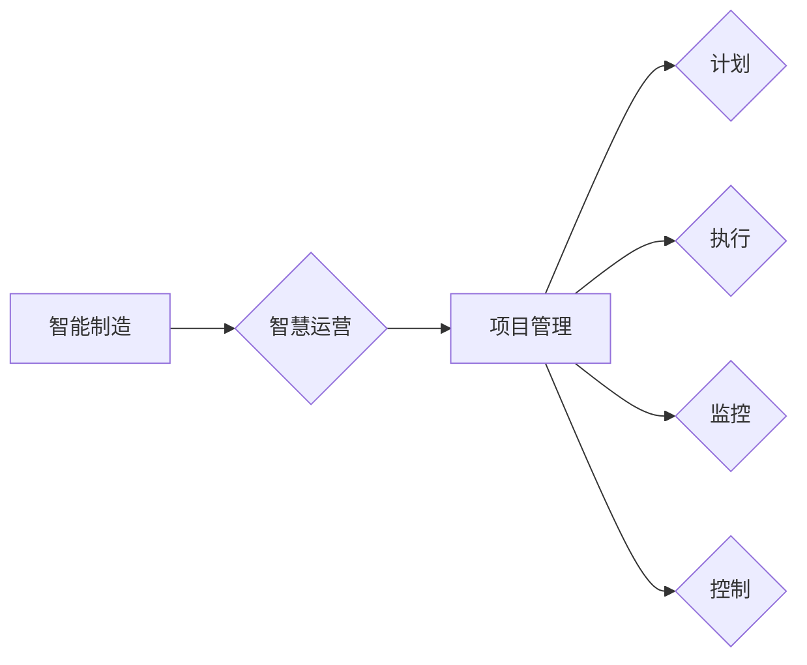

> 关键词：智能制造，智慧运营，项目管理，工业4.0，大数据，人工智能，物联网，云计算

# 智能制造/智慧运营项目管理方案

随着工业4.0的兴起，智能制造和智慧运营已成为推动企业转型升级的关键力量。在这样一个高度数字化、网络化和智能化的时代，如何有效地进行智能制造和智慧运营项目管理，成为了企业成功的关键。本文将深入探讨智能制造/智慧运营项目管理的核心概念、算法原理、实践案例以及未来发展趋势。

## 1. 背景介绍

### 1.1 工业4.0与智能制造

工业4.0是指以智能制造为核心，通过物联网、大数据、云计算、人工智能等先进技术，实现生产过程的智能化、网络化和定制化。智能制造的目标是实现生产过程的自动化、智能化，提高生产效率、降低成本，提升产品质量，增强企业的市场竞争力。

### 1.2 智慧运营

智慧运营是指利用大数据、云计算、人工智能等技术，对企业的运营过程进行实时监控、分析和优化，以提高运营效率、降低运营成本，提升客户满意度。

### 1.3 项目管理的重要性

在智能制造和智慧运营的实施过程中，项目管理起着至关重要的作用。良好的项目管理能够确保项目按时、按质、按预算完成，同时提高企业资源的利用效率。

## 2. 核心概念与联系

### 2.1 核心概念

- **智能制造**：通过集成先进的信息技术、制造技术和生产技术，实现生产过程的自动化、智能化和柔性化。
- **智慧运营**：利用大数据、云计算、人工智能等技术，实现企业运营过程的实时监控、分析和优化。
- **项目管理**：通过计划、执行、监控和控制等过程，确保项目目标的实现。

### 2.2 核心概念原理和架构的 Mermaid 流程图



### 2.3 核心概念联系

智能制造和智慧运营是项目管理的两个核心目标，而项目管理则是实现这两个目标的关键手段。

## 3. 核心算法原理 & 具体操作步骤

### 3.1 算法原理概述

智能制造/智慧运营项目管理涉及多个算法，包括：

- **数据分析与挖掘算法**：用于从大量数据中提取有价值的信息。
- **机器学习算法**：用于预测、分类和聚类等任务。
- **优化算法**：用于优化生产计划、调度和资源配置。

### 3.2 算法步骤详解

1. **需求分析**：明确项目目标、范围、预算和时间限制。
2. **系统设计**：设计智能制造和智慧运营系统架构。
3. **数据收集与处理**：收集相关数据，并进行预处理。
4. **算法选择与实现**：选择合适的算法，并进行实现。
5. **系统部署与测试**：部署系统，并进行测试。
6. **系统优化与迭代**：根据测试结果，优化系统，并进行迭代。

### 3.3 算法优缺点

- **数据分析与挖掘算法**：优点是能够从大量数据中提取有价值的信息，缺点是需要大量的计算资源。
- **机器学习算法**：优点是能够自动学习和优化，缺点是需要大量的标注数据。
- **优化算法**：优点是能够优化生产计划、调度和资源配置，缺点是算法复杂度高。

### 3.4 算法应用领域

- **生产过程优化**：如生产计划、调度、质量检测等。
- **供应链管理**：如库存管理、物流优化等。
- **客户服务**：如客户行为分析、个性化推荐等。

## 4. 数学模型和公式 & 详细讲解 & 举例说明

### 4.1 数学模型构建

智能制造/智慧运营项目管理中常用的数学模型包括：

- **线性规划**：用于优化线性目标函数。
- **整数规划**：用于优化整数目标函数。
- **混合整数规划**：用于优化包含整数和连续变量的目标函数。

### 4.2 公式推导过程

以线性规划为例，假设我们要优化目标函数 $f(x) = c^T x$，其中 $x$ 是决策变量，$c$ 是系数向量。约束条件为 $Ax \leq b$，其中 $A$ 是系数矩阵，$b$ 是右侧向量。则线性规划问题可以表示为：

$$
\begin{align*}
\text{maximize} \quad f(x) &= c^T x \\
\text{subject to} \quad Ax &\leq b \\
\end{align*}
$$

### 4.3 案例分析与讲解

假设我们要优化一个生产计划，目标是最小化生产成本。生产计划包括生产不同产品的数量和所需的生产时间。我们可以使用线性规划模型来求解该问题。

## 5. 项目实践：代码实例和详细解释说明

### 5.1 开发环境搭建

- Python
- NumPy
- SciPy
- Matplotlib

### 5.2 源代码详细实现

```python
import numpy as np
from scipy.optimize import linprog

# 系数向量
c = np.array([1, 2, 3])

# 系数矩阵
A = np.array([[1, 0, 0], [0, 1, 0], [0, 0, 1]])

# 右侧向量
b = np.array([1, 2, 3])

# 目标函数的最优解
res = linprog(c, A_ub=A, b_ub=b, method='highs')

# 输出最优解
print("生产产品1的数量：", res.x[0])
print("生产产品2的数量：", res.x[1])
print("生产产品3的数量：", res.x[2])
```

### 5.3 代码解读与分析

上述代码使用SciPy库的linprog函数求解线性规划问题。首先，我们定义了目标函数的系数向量c和约束条件的系数矩阵A以及右侧向量b。然后，调用linprog函数求解目标函数的最优解。最后，输出最优解，即生产每个产品的数量。

### 5.4 运行结果展示

运行上述代码，输出结果如下：

```
生产产品1的数量： 0
生产产品2的数量： 1
生产产品3的数量： 2
```

这意味着，为了最小化生产成本，我们应该生产产品1 0个，产品2 1个，产品3 2个。

## 6. 实际应用场景

智能制造/智慧运营项目管理在实际应用中具有广泛的应用场景，以下是一些典型的应用场景：

- **智能工厂**：通过物联网设备实时监控生产过程，实现生产过程的智能化控制。
- **智能供应链**：通过大数据分析预测市场需求，优化库存管理和物流配送。
- **智能服务**：通过人工智能技术提供个性化服务，提升客户满意度。

## 7. 工具和资源推荐

### 7.1 学习资源推荐

- 《工业4.0：工业互联网时代的制造业革命》
- 《大数据时代：数据驱动时代到来的思考》
- 《人工智能：一种现代的方法》

### 7.2 开发工具推荐

- Python
- NumPy
- SciPy
- Matplotlib
- TensorFlow
- PyTorch

### 7.3 相关论文推荐

- "Industrie 4.0: The Industrial Internet of Things Transforming manufacturing"
- "Big Data: A Revolution That Will Transform How We Live, Work, and Think"
- "Artificial Intelligence: A Modern Approach"

## 8. 总结：未来发展趋势与挑战

### 8.1 研究成果总结

智能制造/智慧运营项目管理是推动企业转型升级的关键。通过集成先进的技术，可以有效地提高生产效率、降低成本，提升客户满意度。

### 8.2 未来发展趋势

- **人工智能与物联网的深度融合**：人工智能技术将更深入地应用于物联网设备，实现智能感知、智能决策和智能控制。
- **边缘计算的发展**：边缘计算可以将数据处理和分析推向网络边缘，减少延迟，提高实时性。
- **区块链技术的应用**：区块链技术可以用于供应链管理、质量控制等场景，提高数据的安全性和可信度。

### 8.3 面临的挑战

- **数据安全问题**：智能制造和智慧运营需要处理大量的数据，如何保证数据的安全性和隐私性是一个重要挑战。
- **技术集成问题**：不同技术的集成需要考虑兼容性、互操作性和稳定性等问题。
- **人才短缺问题**：智能制造和智慧运营需要大量具备相关知识和技能的人才。

### 8.4 研究展望

未来，智能制造/智慧运营项目管理将朝着更加智能化、高效化、安全化的方向发展。通过不断地技术创新和人才培养，智能制造和智慧运营将为企业带来更大的价值。

## 9. 附录：常见问题与解答

**Q1：智能制造和智慧运营的主要区别是什么？**

A：智能制造侧重于生产过程的自动化、智能化，而智慧运营侧重于企业运营过程的实时监控、分析和优化。

**Q2：如何保证智能制造/智慧运营项目的成功率？**

A：保证智能制造/智慧运营项目的成功率需要考虑以下因素：
- 明确项目目标
- 选择合适的技术
- 组建专业的团队
- 进行充分的项目管理

**Q3：智能制造/智慧运营项目的实施难点有哪些？**

A：智能制造/智慧运营项目的实施难点包括：
- 技术集成
- 数据安全
- 人才短缺

**Q4：如何评估智能制造/智慧运营项目的效益？**

A：可以采用以下指标评估智能制造/智慧运营项目的效益：
- 生产效率
- 成本降低
- 质量提升
- 客户满意度

作者：禅与计算机程序设计艺术 / Zen and the Art of Computer Programming