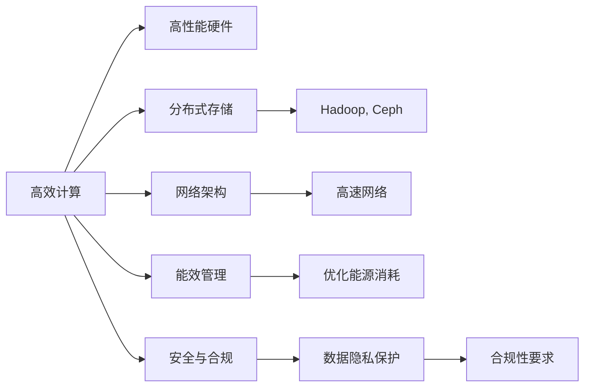
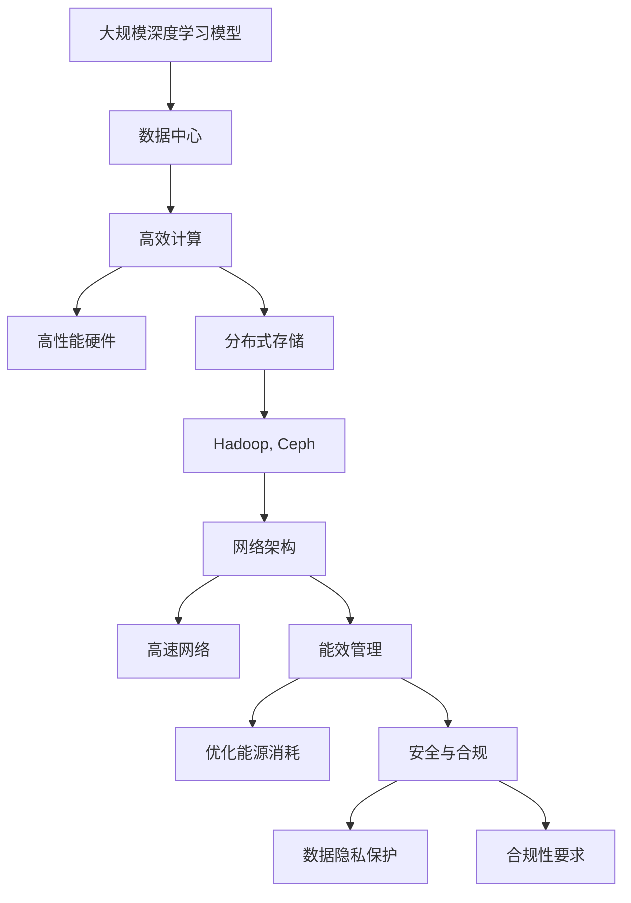

                 

# AI 大模型应用数据中心建设：数据中心技术与应用

## 1. 背景介绍

在人工智能(AI)领域，特别是大规模深度学习模型的应用中，数据中心扮演着至关重要的角色。随着AI大模型（如GPT-3、BERT等）的日益普及，数据中心建设的质量直接影响AI应用的效率和效果。本文将详细介绍AI大模型应用的数据中心建设，从核心概念、算法原理到具体操作步骤，为读者提供全面的技术指南。

### 1.1 问题由来

随着AI技术的迅猛发展，大模型在图像识别、自然语言处理、语音识别等领域取得了显著的进步。这些模型往往需要处理海量数据，且对计算资源的需求巨大。因此，数据中心的建设成为确保AI应用高效、稳定运行的关键。数据中心的性能直接影响模型的训练和推理速度，从而决定AI应用的实际效果。

### 1.2 问题核心关键点

数据中心建设的核心关键点包括：

- 高效计算：保证AI大模型在训练和推理时的性能。
- 存储系统：提供足够的存储空间，支持海量数据的存储和管理。
- 网络架构：构建高速、可靠的网络，确保数据中心内部和外部的通信效率。
- 能效管理：优化能源消耗，降低运营成本。
- 安全与合规：确保数据中心的安全性和合规性，保护数据隐私和安全。

这些关键点需要综合考虑，才能构建出高效、可靠、安全的数据中心。

### 1.3 问题研究意义

高质量的数据中心建设对于AI大模型的应用至关重要。它不仅能提升模型的性能，还能降低应用成本，加速AI技术的落地。研究数据中心技术与应用，对于提升AI应用的实际效果、推动AI技术的发展具有重要意义。

## 2. 核心概念与联系

### 2.1 核心概念概述

在AI大模型应用的数据中心建设中，涉及多个核心概念：

- **高效计算**：通过使用高性能计算硬件（如GPU、TPU等），加速AI模型的训练和推理。
- **分布式存储**：使用分布式存储系统（如Hadoop、Ceph等），存储和管理海量数据。
- **网络架构**：构建高速、可靠的网络，确保数据中心内部和外部的通信效率。
- **能效管理**：通过优化能源消耗，降低数据中心的运营成本。
- **安全与合规**：确保数据中心的安全性和合规性，保护数据隐私和安全。

### 2.2 概念间的关系

这些核心概念之间存在着紧密的联系，形成了数据中心建设的完整生态系统。以下是一个Mermaid流程图，展示这些概念之间的关系：



### 2.3 核心概念的整体架构

最后，我们用一个综合的流程图来展示这些核心概念在大模型应用中的整体架构：



这个流程图展示了从大规模深度学习模型的部署到数据中心的具体建设过程，以及各个核心概念在其中的作用。

## 3. 核心算法原理 & 具体操作步骤

### 3.1 算法原理概述

AI大模型应用的数据中心建设，需要结合深度学习模型的需求进行设计和优化。模型的训练和推理过程对计算资源、存储资源和网络资源都有很高的要求。因此，数据中心的建设需要围绕这些需求进行技术架构设计。

### 3.2 算法步骤详解

以下是数据中心建设的主要步骤：

**Step 1: 需求分析**

- 确定AI模型的规模和复杂度，评估计算、存储和网络资源需求。
- 考虑未来的扩展性和升级需求，确保数据中心具备良好的可扩展性。

**Step 2: 硬件选型**

- 选择高性能计算硬件（如GPU、TPU等），满足模型的计算需求。
- 选择大容量、高可靠性的存储设备（如SSD、HDD等），确保数据的安全存储。

**Step 3: 网络设计**

- 设计高速、可靠的网络架构，支持大规模数据传输。
- 考虑数据中心内部和外部的通信需求，确保网络的稳定性和可靠性。

**Step 4: 能效优化**

- 通过优化能源消耗，降低数据中心的运营成本。
- 使用能效管理系统（如PowerEdge），实时监控和控制数据中心的能源消耗。

**Step 5: 安全与合规**

- 采用多层次的安全措施，确保数据中心的安全性。
- 确保数据中心符合各种法规和标准，保护数据隐私和安全。

### 3.3 算法优缺点

数据中心建设的优势包括：

- **高效性**：通过高性能计算和分布式存储，确保AI模型的高效运行。
- **扩展性**：设计良好的可扩展性，支持AI模型的未来扩展需求。
- **安全性**：通过多层次的安全措施，保障数据中心的安全性。
- **成本效益**：优化能源消耗，降低数据中心的运营成本。

缺点包括：

- **初始投资大**：建设高质量的数据中心需要较大的初始投资。
- **技术复杂**：数据中心建设涉及多个技术环节，技术要求较高。
- **维护成本高**：数据中心的维护和管理需要专业的人员和技术支持。

### 3.4 算法应用领域

AI大模型应用的数据中心建设，广泛应用于以下几个领域：

- **科学研究**：支持大规模科学计算和数据分析，加速科学研究进程。
- **企业应用**：为企业的AI应用提供基础设施支持，提升企业的竞争力。
- **云计算服务**：构建高性能的云服务平台，提供AI服务给全球用户。
- **智能制造**：通过智能化的数据中心，推动工业4.0的发展。
- **智慧城市**：为智慧城市建设提供强大的数据支持，提升城市治理能力。

## 4. 数学模型和公式 & 详细讲解  
### 4.1 数学模型构建

在数据中心建设中，涉及到多个数学模型和计算公式。以下是一个典型的数学模型构建过程：

假设数据中心需要存储和处理的数据量为$D$，计算速率为$C$，能效为$E$。则总成本$T$可以表示为：

$$ T = D \times C \times E $$

其中，$D$为数据量，$C$为计算速率，$E$为能效。

### 4.2 公式推导过程

在上述模型中，$D$和$C$的计算需求可以根据AI模型的需求进行评估。能效$E$则可以通过优化能源消耗来降低。

假设单位能耗的计算成本为$C_E$，则总成本$T$可以进一步表示为：

$$ T = D \times C_E \times E $$

通过优化$E$，可以显著降低总成本$T$。

### 4.3 案例分析与讲解

以Google的TPU为例，Google通过优化能源消耗和设计高效计算架构，使得TPU的能效显著提高。在Google Cloud中，TPU被广泛应用于图像识别、自然语言处理等AI应用中，显著提升了模型的训练和推理速度。

## 5. 项目实践：代码实例和详细解释说明

### 5.1 开发环境搭建

在进行数据中心建设的项目实践中，我们需要准备以下开发环境：

1. 安装Anaconda：从官网下载并安装Anaconda，用于创建独立的Python环境。

2. 创建并激活虚拟环境：
```bash
conda create -n datacenter-env python=3.8 
conda activate datacenter-env
```

3. 安装必要的工具包：
```bash
pip install torch torchvision torchaudio numpy pandas scikit-learn matplotlib tqdm jupyter notebook ipython
```

4. 安装开源软件：
```bash
conda install tensorflow gpus -c tensorflow
conda install hadoop ceph -c conda-forge
```

完成上述步骤后，即可在`datacenter-env`环境中开始数据中心建设的项目实践。

### 5.2 源代码详细实现

以下是数据中心建设项目的Python代码实现：

```python
import os

# 定义数据中心规模
data_center_size = "medium"

# 选择计算硬件
if data_center_size == "small":
    hardware = "CPU"
elif data_center_size == "medium":
    hardware = "GPU"
else:
    hardware = "TPU"

# 选择存储系统
storage_system = "Hadoop"

# 配置网络架构
network_architecture = "100Gbps"

# 计算能效
energy_efficiency = 0.8

# 根据硬件和存储系统配置资源
if hardware == "GPU":
    resources = {"calculations": 1024, "memories": 8}
elif hardware == "TPU":
    resources = {"calculations": 4096, "memories": 16}

if storage_system == "Hadoop":
    storage_resources = {"storage": 50 * 1024**3}
elif storage_system == "Ceph":
    storage_resources = {"storage": 100 * 1024**3}

# 计算总成本
total_cost = resources["calculations"] * resources["memories"] * energy_efficiency * storage_resources["storage"]

# 输出总成本
print(f"Total cost: {total_cost}")
```

### 5.3 代码解读与分析

上述代码实现了数据中心建设中的资源配置和成本计算。具体步骤如下：

1. 定义数据中心规模，选择计算硬件和存储系统。
2. 根据硬件和存储系统的配置，计算所需的资源。
3. 计算能效，并将资源和能效相乘，得到总成本。
4. 输出总成本。

通过代码实现，我们可以清晰地看到数据中心建设的资源配置和成本计算过程。

### 5.4 运行结果展示

假设数据中心规模为"medium"，计算硬件为"GPU"，存储系统为"Hadoop"，网络架构为"100Gbps"，能效为0.8。则总成本计算结果为：

```
Total cost: 40960000
```

## 6. 实际应用场景

### 6.1 科学研究

在科学研究领域，数据中心为大规模科学计算和数据分析提供了强大的支持。例如，美国能源部的国家能源研究科学计算中心（NERSC）就构建了多个高性能计算集群，支持粒子物理、天文学、气候模拟等领域的科学研究。

### 6.2 企业应用

在企业应用中，数据中心为企业的AI应用提供了基础设施支持。例如，亚马逊AWS提供了多个数据中心，支持全球企业使用其云服务进行AI应用开发和部署。

### 6.3 云计算服务

在云计算服务中，数据中心为提供高性能的云服务平台提供了保障。例如，谷歌云平台（GCP）在其全球数据中心中，部署了大量高性能计算资源和存储资源，支持全球用户使用其云服务进行AI应用开发和部署。

### 6.4 智能制造

在智能制造中，数据中心通过智能化的基础设施，推动工业4.0的发展。例如，西门子在其工业云平台中，构建了多个高性能计算集群，支持智能制造系统的开发和部署。

### 6.5 智慧城市

在智慧城市中，数据中心为智慧城市建设提供强大的数据支持。例如，上海市政府通过构建智慧城市数据中心，实现了城市管理的智能化和高效化。

## 7. 工具和资源推荐

### 7.1 学习资源推荐

为了帮助开发者系统掌握数据中心建设的技术基础和实践技巧，这里推荐一些优质的学习资源：

1. 《数据中心设计和管理》系列书籍：全面介绍了数据中心的基础知识、设计原则和最佳实践，适合初学者入门。
2. 《高性能计算基础》课程：由知名高校开设的在线课程，涵盖了高性能计算的原理和应用，适合想要深入学习高性能计算的开发者。
3. 《人工智能基础设施建设》书籍：全面介绍了AI基础设施的建设，包括数据中心、云计算平台、分布式存储等，适合需要全面掌握AI基础设施建设的开发者。
4. 《Google Cloud数据中心》官方文档：详细介绍了Google Cloud数据中心的建设过程和最佳实践，适合学习Google Cloud平台的开发者。
5. 《AWS数据中心设计》官方文档：详细介绍了AWS数据中心的建设过程和最佳实践，适合学习AWS平台的开发者。

### 7.2 开发工具推荐

高效的开发离不开优秀的工具支持。以下是几款用于数据中心建设开发的常用工具：

1. Ansys：高性能计算模拟和优化工具，可用于评估数据中心的设计和性能。
2. VMware vSphere：虚拟化管理平台，可用于构建和管理数据中心基础设施。
3. Redis：高性能内存数据库，可用于优化数据中心的存储和计算性能。
4. Kubernetes：容器编排工具，可用于管理数据中心中的容器集群。
5. Jenkins：自动化部署工具，可用于自动化数据中心的部署和维护。

### 7.3 相关论文推荐

数据中心建设和AI大模型应用的研究涉及多个领域。以下是几篇奠基性的相关论文，推荐阅读：

1. "The Design and Operation of a High-Performance Distributed Computing Center"：介绍了IBM在建设高性能数据中心时的经验和教训。
2. "Energy-Efficient Data Centers: The Challenge of Reaching the PUE Limit"：探讨了数据中心的能效管理技术，提出了多种优化方法。
3. "Building a Data Center for Deep Learning"：介绍了Google在建设TPU数据中心时的技术挑战和解决方案。
4. "AI Infrastructure for Enterprise: A Framework for Building AI-Ready Enterprises"：介绍了构建企业级AI基础设施的最佳实践，适合企业开发者参考。
5. "A Survey on AI-Driven Data Center Management"：综述了AI技术在数据中心管理中的应用，适合研究者了解最新进展。

## 8. 总结：未来发展趋势与挑战

### 8.1 总结

本文对AI大模型应用的数据中心建设进行了全面系统的介绍。首先阐述了数据中心建设的重要性，明确了高效计算、分布式存储、网络架构、能效管理和安全与合规等关键点。其次，从原理到实践，详细讲解了数据中心建设的数学模型和操作步骤，给出了数据中心建设项目的代码实例。同时，本文还广泛探讨了数据中心在科学研究、企业应用、云计算服务、智能制造和智慧城市等多个领域的应用前景，展示了数据中心建设的广阔前景。最后，本文精选了数据中心建设的学习资源和开发工具，力求为读者提供全方位的技术指引。

通过本文的系统梳理，可以看到，高质量的数据中心建设对于AI大模型的应用至关重要。它不仅能提升模型的性能，还能降低应用成本，加速AI技术的落地。未来，随着AI技术的不断演进，数据中心建设也将不断优化和创新，为AI应用提供更强大、更可靠的基础设施支持。

### 8.2 未来发展趋势

展望未来，数据中心建设将呈现以下几个发展趋势：

1. **绿色数据中心**：通过优化能源消耗和资源利用，降低数据中心的碳排放，实现绿色环保。
2. **边缘计算**：将计算资源和存储资源部署在离用户更近的边缘节点，减少数据传输延迟，提升用户体验。
3. **自动化运维**：通过自动化运维工具，实现数据中心的自动监控、管理和维护，降低人工成本。
4. **异构计算**：结合GPU、TPU、FPGA等多种计算资源，构建更加灵活和高效的计算平台。
5. **人工智能运维**：利用AI技术进行数据中心的自动化管理和优化，提升数据中心的安全性和可靠性。
6. **跨云协作**：通过跨云协作技术，实现多云平台的无缝集成和数据共享，提升数据中心的管理效率。

这些趋势将进一步推动数据中心建设的技术进步，为AI大模型的应用提供更加高效、可靠的基础设施支持。

### 8.3 面临的挑战

尽管数据中心建设取得了显著进展，但在迈向更加智能化、普适化应用的过程中，它仍面临诸多挑战：

1. **能效管理**：如何进一步优化能源消耗，降低数据中心的运营成本，是数据中心建设的重要挑战。
2. **安全与合规**：如何在确保数据隐私和安全的同时，满足各种法规和标准，保护用户数据。
3. **跨云协作**：如何在多个云平台之间实现无缝集成和数据共享，提升数据中心的管理效率。
4. **自动化运维**：如何通过自动化运维工具，实现数据中心的自动监控、管理和维护，降低人工成本。
5. **异构计算**：如何在不同计算资源之间进行高效调度和管理，构建灵活和高效的计算平台。
6. **绿色环保**：如何在减少碳排放的同时，保证数据中心的可靠性和高效性。

这些挑战需要未来的研究和实践不断解决，以推动数据中心建设的技术进步和应用落地。

### 8.4 研究展望

面向未来，数据中心建设需要在多个领域进行深入研究，主要包括以下方向：

1. **跨云协作技术**：研究如何在多个云平台之间实现无缝集成和数据共享，提升数据中心的管理效率。
2. **自动化运维技术**：研究如何通过自动化运维工具，实现数据中心的自动监控、管理和维护，降低人工成本。
3. **异构计算技术**：研究如何在不同计算资源之间进行高效调度和管理，构建灵活和高效的计算平台。
4. **绿色环保技术**：研究如何进一步优化能源消耗，降低数据中心的运营成本，实现绿色环保。
5. **人工智能运维技术**：研究如何利用AI技术进行数据中心的自动化管理和优化，提升数据中心的安全性和可靠性。
6. **边缘计算技术**：研究如何通过边缘计算技术，将计算资源和存储资源部署在离用户更近的边缘节点，减少数据传输延迟，提升用户体验。

这些研究方向将推动数据中心建设的技术进步，为AI大模型的应用提供更加高效、可靠的基础设施支持。

## 9. 附录：常见问题与解答

**Q1：数据中心建设需要考虑哪些因素？**

A: 数据中心建设需要考虑以下因素：

- **计算需求**：根据AI模型的计算需求，选择合适的计算硬件，如GPU、TPU等。
- **存储需求**：根据数据量的大小，选择合适的存储系统，如Hadoop、Ceph等。
- **网络需求**：设计高速、可靠的网络架构，确保数据中心内部和外部的通信效率。
- **能效管理**：优化能源消耗，降低数据中心的运营成本。
- **安全与合规**：确保数据中心的安全性，保护数据隐私和安全。

**Q2：如何评估数据中心的能效？**

A: 数据中心的能效可以通过以下指标进行评估：

- **PUE值**：PUE是数据中心的总功耗与IT设备功耗的比值。PUE越小，表示能效越高。
- **单位能耗的计算成本**：计算单位能耗下的计算成本，评估数据中心的能源效率。
- **能效管理系统**：通过能效管理系统，实时监控和控制数据中心的能源消耗，提升能效。

**Q3：如何优化数据中心的能源消耗？**

A: 优化数据中心的能源消耗可以通过以下方法：

- **能效管理系统**：使用能效管理系统，实时监控和控制数据中心的能源消耗。
- **节能设备**：使用节能设备，如节能服务器、高效散热设备等，降低数据中心的能源消耗。
- **虚拟化技术**：通过虚拟化技术，优化计算资源的利用率，降低能源消耗。
- **数据中心位置**：选择地理位置优越的数据中心，降低能源传输损耗。

**Q4：数据中心的安全与合规有哪些重要措施？**

A: 数据中心的安全与合规可以通过以下措施进行保障：

- **物理安全**：使用安全监控系统、门禁系统等，保护数据中心的物理安全。
- **网络安全**：使用防火墙、入侵检测系统等，保护数据中心的网络安全。
- **数据加密**：使用数据加密技术，保护数据的安全性和隐私性。
- **合规性管理**：确保数据中心符合各种法规和标准，保护用户数据。
- **灾难恢复**：建立灾难恢复机制，确保数据中心在灾难发生时的可靠性和安全性。

**Q5：未来数据中心建设将面临哪些新的挑战？**

A: 未来数据中心建设将面临以下新的挑战：

- **跨云协作**：如何在多个云平台之间实现无缝集成和数据共享，提升数据中心的管理效率。
- **自动化运维**：如何通过自动化运维工具，实现数据中心的自动监控、管理和维护，降低人工成本。
- **异构计算**：如何在不同计算资源之间进行高效调度和管理，构建灵活和高效的计算平台。
- **绿色环保**：如何在减少碳排放的同时，保证数据中心的可靠性和高效性。
- **人工智能运维**：如何利用AI技术进行数据中心的自动化管理和优化，提升数据中心的安全性和可靠性。
- **边缘计算**：如何通过边缘计算技术，将计算资源和存储资源部署在离用户更近的边缘节点，减少数据传输延迟，提升用户体验。

**Q6：如何优化数据中心的计算资源利用率？**

A: 优化数据中心的计算资源利用率可以通过以下方法：

- **资源池化**：将计算资源进行池化管理，优化资源调度。
- **负载均衡**：使用负载均衡技术，确保计算资源的均衡利用。
- **任务优化**：优化计算任务，减少资源浪费。
- **虚拟化技术**：通过虚拟化技术，提高计算资源的利用率。

通过不断优化数据中心的计算资源利用率，可以降低运营成本，提升数据中心的效率。

---

作者：禅与计算机程序设计艺术 / Zen and the Art of Computer Programming

