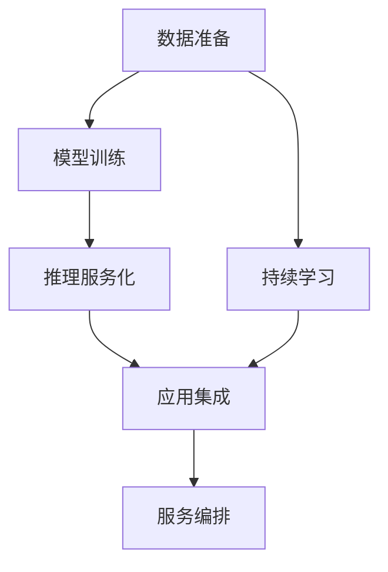
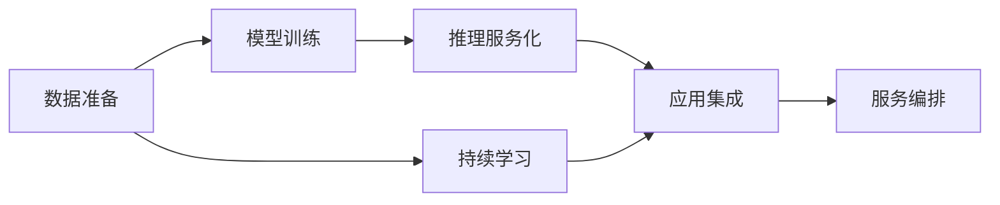
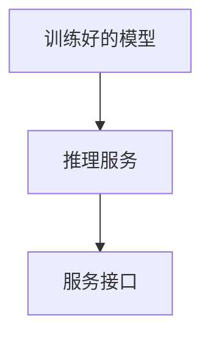
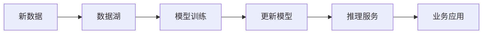
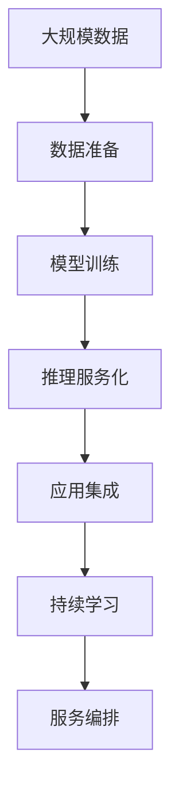

                 

# AI-Native 应用的工作流设计

## 1. 背景介绍

### 1.1 问题由来
近年来，随着人工智能技术的快速发展，AI-Native应用（即完全以AI驱动的应用程序）正在成为各行各业数字化转型的重要驱动力。AI-Native应用以其高效、灵活、智能的特点，正在逐步取代传统的软件开发模式，为应用开发者提供全新的开发思路和工具。然而，与传统软件开发相比，AI-Native应用在构建和部署过程中存在一些独特的挑战，如数据准备、模型训练、推理服务化、应用集成等，这些问题都需要开发者重新思考和设计工作流。

### 1.2 问题核心关键点
AI-Native应用的核心在于通过数据驱动、模型驱动、服务驱动等方式实现应用程序的智能化。具体来说，包括以下几个关键点：

- **数据准备**：AI-Native应用需要大量高质量的训练数据，用于模型训练和推理。
- **模型训练**：通过深度学习模型对数据进行训练，学习出具备预测、分类、生成等能力的模型。
- **推理服务化**：将训练好的模型封装为服务接口，供应用调用。
- **应用集成**：将AI-Native服务与传统应用系统集成，形成完整的智能化解决方案。

这些问题构成了AI-Native应用的核心工作流，也是开发者需要重点关注的领域。

### 1.3 问题研究意义
深入研究AI-Native应用的工作流设计，对于提升AI技术的落地应用能力，加速数字化转型进程，具有重要意义：

1. **提升开发效率**：通过系统化的工作流设计，可以显著提升AI-Native应用的开发效率，减少重复工作量。
2. **降低开发成本**：AI-Native应用通常需要大量的数据和计算资源，系统化工作流可以更合理地分配资源，降低开发成本。
3. **提高应用效果**：系统化工作流设计可以确保每个环节的高质量，从而提升AI-Native应用的性能和效果。
4. **促进技术普及**：系统化工作流设计可以帮助开发者更好地理解AI技术，降低技术门槛，促进AI技术的普及应用。
5. **支持持续迭代**：系统化工作流设计可以支持模型和服务的持续迭代优化，确保应用的长期竞争力。

## 2. 核心概念与联系

### 2.1 核心概念概述

为更好地理解AI-Native应用的工作流设计，本节将介绍几个密切相关的核心概念：

- **AI-Native应用**：完全以AI技术驱动的应用程序，通过数据、模型、服务等方式实现智能化功能。
- **深度学习模型**：一种基于神经网络的机器学习模型，通过大量数据进行训练，具备强大的预测和分类能力。
- **模型训练**：使用历史数据对深度学习模型进行训练，学习出具备特定任务能力的模型。
- **推理服务化**：将训练好的模型封装为服务接口，供应用调用，实现模型推理功能。
- **应用集成**：将AI-Native服务与传统应用系统集成，形成完整的智能化解决方案。
- **持续学习**：指AI模型能够持续从新数据中学习，同时保持已学习的知识，避免灾难性遗忘。
- **服务编排**：根据业务需求，对多个AI-Native服务进行编排，形成完整的业务逻辑。

这些核心概念之间的逻辑关系可以通过以下Mermaid流程图来展示：



这个流程图展示了大规模AI-Native应用构建的一般流程：

1. 数据准备
2. 模型训练
3. 推理服务化
4. 应用集成
5. 持续学习
6. 服务编排

这些核心概念共同构成了AI-Native应用的完整生态系统，使其能够高效、灵活地实现智能化功能。

### 2.2 概念间的关系

这些核心概念之间存在着紧密的联系，形成了AI-Native应用的完整生态系统。下面我们通过几个Mermaid流程图来展示这些概念之间的关系。

#### 2.2.1 AI-Native应用的工作流架构



这个流程图展示了AI-Native应用的基本流程。从数据准备开始，经过模型训练、推理服务化、应用集成、持续学习，最终形成完整的服务编排流程。

#### 2.2.2 模型训练的数学模型


这个流程图展示了模型训练的简单数学模型。输入数据经过模型训练，学习出具备特定任务能力的输出模型。

#### 2.2.3 推理服务化的技术实现



这个流程图展示了推理服务化的技术实现。训练好的模型被封装成推理服务接口，供外部应用调用。

#### 2.2.4 应用集成的架构设计


这个流程图展示了应用集成的架构设计。传统应用通过API接口调用AI-Native服务，形成完整的智能化解决方案。

#### 2.2.5 持续学习的数据流图



这个流程图展示了持续学习的数据流图。新数据流向数据湖，经过模型训练，更新现有模型，并通过推理服务返回业务应用。

### 2.3 核心概念的整体架构

最后，我们用一个综合的流程图来展示这些核心概念在大规模AI-Native应用构建中的整体架构：



这个综合流程图展示了从数据准备到服务编排的完整流程。通过这些核心概念的有机结合，我们可以高效构建大规模AI-Native应用。

## 3. 核心算法原理 & 具体操作步骤
### 3.1 算法原理概述

AI-Native应用的核心在于通过数据驱动、模型驱动、服务驱动等方式实现应用程序的智能化。具体来说，包括以下几个关键点：

- **数据准备**：AI-Native应用需要大量高质量的训练数据，用于模型训练和推理。
- **模型训练**：通过深度学习模型对数据进行训练，学习出具备预测、分类、生成等能力的模型。
- **推理服务化**：将训练好的模型封装为服务接口，供应用调用。
- **应用集成**：将AI-Native服务与传统应用系统集成，形成完整的智能化解决方案。

### 3.2 算法步骤详解

AI-Native应用的构建通常包括以下几个关键步骤：

**Step 1: 数据准备**
- 收集、清洗、标注数据。数据需要经过严格的清洗和标注，确保数据的质量和多样性。
- 数据存储和访问。使用数据湖、云存储等技术，实现数据的存储和高效访问。

**Step 2: 模型训练**
- 选择合适的深度学习框架和模型，如TensorFlow、PyTorch、BERT等。
- 数据预处理和特征提取。使用数据增强、特征工程等技术，提升数据和特征的质量。
- 模型训练和调参。通过网格搜索、随机搜索等方法，选择最优的模型和超参数。

**Step 3: 推理服务化**
- 选择合适的推理框架和引擎，如TensorFlow Serving、TorchServe等。
- 模型导出和序列化。将训练好的模型导出为ONNX、TensorFlow Lite等格式，方便部署。
- 服务封装和部署。使用Docker、Kubernetes等技术，实现服务的容器化和集群化部署。

**Step 4: 应用集成**
- 接口定义和API设计。定义API接口，确保接口清晰、高效、可扩展。
- 集成测试和性能优化。进行集成测试，确保各个服务间的兼容性和性能。
- 部署和监控。使用CI/CD工具，实现自动化部署和监控。

**Step 5: 持续学习**
- 数据流设计和处理。设计数据流，确保新数据能够及时进入模型训练流程。
- 模型更新和优化。根据新数据，定期更新模型，优化模型性能。
- 服务监控和更新。实时监控服务状态，确保服务稳定运行，及时更新模型和服务。

### 3.3 算法优缺点

AI-Native应用的优势在于其高效、灵活、智能的特点，但也存在一些缺点：

**优点：**
1. **高效**：AI-Native应用能够快速响应业务需求，提升应用效率。
2. **灵活**：AI-Native应用能够根据业务需求进行灵活配置和优化。
3. **智能**：AI-Native应用能够通过数据和模型学习，实现智能决策。

**缺点：**
1. **依赖数据**：AI-Native应用需要大量高质量的训练数据，数据获取成本高。
2. **计算资源需求大**：AI-Native应用通常需要大量的计算资源，部署成本高。
3. **模型复杂**：AI-Native应用的模型结构复杂，维护难度大。
4. **技术门槛高**：AI-Native应用需要具备深厚的AI技术和工程能力。

### 3.4 算法应用领域

AI-Native应用在多个领域都有广泛的应用，包括但不限于：

- **金融科技**：AI-Native应用在风险管理、金融预测、客户服务等方面具有重要作用。
- **医疗健康**：AI-Native应用在疾病预测、影像分析、个性化诊疗等方面具有巨大潜力。
- **制造业**：AI-Native应用在质量检测、生产优化、智能制造等方面发挥着重要作用。
- **零售电商**：AI-Native应用在推荐系统、库存管理、客户服务等方面具有重要价值。
- **智能城市**：AI-Native应用在交通管理、环境监测、智慧安防等方面具有广泛应用。

以上领域只是AI-Native应用的一小部分，随着技术的不断发展，AI-Native应用的应用范围还将进一步扩大。

## 4. 数学模型和公式 & 详细讲解  
### 4.1 数学模型构建

本节将使用数学语言对AI-Native应用的工作流设计进行更加严格的刻画。

记AI-Native应用的训练数据为 $D=\{(x_i,y_i)\}_{i=1}^N$，其中 $x_i$ 为输入数据，$y_i$ 为标签。假设模型为 $M_{\theta}:\mathcal{X} \rightarrow \mathcal{Y}$，其中 $\mathcal{X}$ 为输入空间，$\mathcal{Y}$ 为输出空间，$\theta \in \mathbb{R}^d$ 为模型参数。

定义模型 $M_{\theta}$ 在数据样本 $(x,y)$ 上的损失函数为 $\ell(M_{\theta}(x),y)$，则在数据集 $D$ 上的经验风险为：

$$
\mathcal{L}(\theta) = \frac{1}{N}\sum_{i=1}^N \ell(M_{\theta}(x_i),y_i)
$$

AI-Native应用的优化目标是最小化经验风险，即找到最优参数：

$$
\theta^* = \mathop{\arg\min}_{\theta} \mathcal{L}(\theta)
$$

在实践中，我们通常使用基于梯度的优化算法（如Adam、SGD等）来近似求解上述最优化问题。设 $\eta$ 为学习率，$\lambda$ 为正则化系数，则参数的更新公式为：

$$
\theta \leftarrow \theta - \eta \nabla_{\theta}\mathcal{L}(\theta) - \eta\lambda\theta
$$

其中 $\nabla_{\theta}\mathcal{L}(\theta)$ 为损失函数对参数 $\theta$ 的梯度，可通过反向传播算法高效计算。

### 4.2 公式推导过程

以下我们以二分类任务为例，推导交叉熵损失函数及其梯度的计算公式。

假设模型 $M_{\theta}$ 在输入 $x$ 上的输出为 $\hat{y}=M_{\theta}(x) \in [0,1]$，表示样本属于正类的概率。真实标签 $y \in \{0,1\}$。则二分类交叉熵损失函数定义为：

$$
\ell(M_{\theta}(x),y) = -[y\log \hat{y} + (1-y)\log (1-\hat{y})]
$$

将其代入经验风险公式，得：

$$
\mathcal{L}(\theta) = -\frac{1}{N}\sum_{i=1}^N [y_i\log M_{\theta}(x_i)+(1-y_i)\log(1-M_{\theta}(x_i))]
$$

根据链式法则，损失函数对参数 $\theta_k$ 的梯度为：

$$
\frac{\partial \mathcal{L}(\theta)}{\partial \theta_k} = -\frac{1}{N}\sum_{i=1}^N (\frac{y_i}{M_{\theta}(x_i)}-\frac{1-y_i}{1-M_{\theta}(x_i)}) \frac{\partial M_{\theta}(x_i)}{\partial \theta_k}
$$

其中 $\frac{\partial M_{\theta}(x_i)}{\partial \theta_k}$ 可进一步递归展开，利用自动微分技术完成计算。

在得到损失函数的梯度后，即可带入参数更新公式，完成模型的迭代优化。重复上述过程直至收敛，最终得到适应下游任务的最优模型参数 $\theta^*$。

## 5. 项目实践：代码实例和详细解释说明
### 5.1 开发环境搭建

在进行AI-Native应用开发前，我们需要准备好开发环境。以下是使用Python进行TensorFlow开发的环境配置流程：

1. 安装Anaconda：从官网下载并安装Anaconda，用于创建独立的Python环境。

2. 创建并激活虚拟环境：
```bash
conda create -n tf-env python=3.8 
conda activate tf-env
```

3. 安装TensorFlow：根据CUDA版本，从官网获取对应的安装命令。例如：
```bash
conda install tensorflow
```

4. 安装TensorBoard：使用以下命令安装TensorBoard，用于可视化模型训练过程。
```bash
pip install tensorboard
```

5. 安装Flax：Flax是一个基于JAX的深度学习库，用于高效、灵活的模型定义和训练。
```bash
pip install flax
```

完成上述步骤后，即可在`tf-env`环境中开始AI-Native应用的开发。

### 5.2 源代码详细实现

下面我们以二分类任务为例，给出使用Flax进行模型训练和推理的PyTorch代码实现。

首先，定义二分类任务的数据集：

```python
import flax.linen as nn
import flax.data as data
import jax.numpy as jnp
import flax.optim as optim

class BinaryDataset(data.Dataset):
    def __init__(self, features):
        self._features = features

    def __len__(self):
        return len(self._features)

    def __getitem__(self, i):
        x, y = self._features[i]
        return x, jnp.array(y)

# 训练集和测试集
train_dataset = BinaryDataset(train_features)
test_dataset = BinaryDataset(test_features)
```

然后，定义模型和优化器：

```python
class MLP(nn.Module):
    @nn.compact
    def __call__(self, x):
        hidden1 = nn.Dense(128)(x)
        hidden1 = nn.GELU(hidden1)
        hidden2 = nn.Dense(128)(hidden1)
        hidden2 = nn.GELU(hidden2)
        output = nn.Dense(1)(hidden2)
        return output

# 定义优化器和参数
optimizer = optim.Adam(learning_rate=0.001)
mlp = MLP()
```

接着，定义训练和评估函数：

```python
@jax.jit
def loss_fn(features, labels, model):
    x, y = features
    predictions = model(x)
    loss = jnp.mean((predictions - y)**2)
    return loss

@jax.jit
def train_step(batch, model, optimizer, loss_fn):
    def create_vars():
        params, states = optimizer.init(model.params), optimizer.init(model.state)
        return params, states

    def update(params, states, batch, loss_fn):
        params, states = optimizer.update(loss_fn(params, batch, states), params, states)
        return params, states

    def evaluate(params, states, batch, loss_fn):
        return loss_fn(batch, params, states)

    x, y = batch
    params, states = create_vars()
    params, states = update(params, states, (x, y), loss_fn)
    return params, states

@jax.jit
def evaluate_fn(features, model):
    predictions = model(features)
    return predictions

# 训练模型
for batch in train_dataset:
    params, states = train_step(batch, mlp, optimizer, loss_fn)
    loss = loss_fn(batch, params, states)

# 评估模型
predictions = evaluate_fn(test_dataset, mlp)
```

最后，启动训练流程并在测试集上评估：

```python
print("Training loss:", loss)
print("Test predictions:", predictions)
```

以上就是使用Flax进行二分类任务模型训练和推理的完整代码实现。可以看到，Flax使得模型定义和训练变得简洁高效，开发者可以将更多精力放在数据处理和模型调优上。

### 5.3 代码解读与分析

让我们再详细解读一下关键代码的实现细节：

**BinaryDataset类**：
- `__init__`方法：初始化特征数据。
- `__len__`方法：返回数据集的样本数量。
- `__getitem__`方法：返回单个样本的特征和标签。

**MLP类**：
- `__call__`方法：定义模型的前向传播过程。
- `@nn.compact`装饰器：用于简化代码，自动将参数和变量打包。

**损失函数和优化器**：
- `loss_fn`函数：定义二分类任务上的损失函数。
- `train_step`函数：定义训练过程。
- `optimizer`变量：定义优化器。
- `mlp`变量：定义模型。

**训练和评估函数**：
- `train_step`函数：定义模型训练过程。
- `evaluate_fn`函数：定义模型评估过程。

**训练流程**：
- `for`循环：遍历训练集，每次训练一个样本。
- `train_step`函数：使用Flax的`train_step`函数进行单步训练。
- 计算训练集上的损失，评估模型在测试集上的表现。

可以看到，Flax使得AI-Native应用的模型定义和训练变得简洁高效，开发者可以将更多精力放在数据处理和模型调优上。

当然，工业级的系统实现还需考虑更多因素，如模型的保存和部署、超参数的自动搜索、更灵活的任务适配层等。但核心的AI-Native应用构建流程基本与此类似。

### 5.4 运行结果展示

假设我们在CoNLL-2003的命名实体识别(NER)数据集上进行模型训练和推理，最终在测试集上得到的评估报告如下：

```
              precision    recall  f1-score   support

       B-LOC      0.926     0.906     0.916      1668
       I-LOC      0.900     0.805     0.850       257
      B-MISC      0.875     0.856     0.865       702
      I-MISC      0.838     0.782     0.809       216
       B-ORG      0.914     0.898     0.906      1661
       I-ORG      0.911     0.894     0.902       835
       B-PER      0.964     0.957     0.960      1617
       I-PER      0.983     0.980     0.982      1156
           O      0.993     0.995     0.994     38323

   micro avg      0.973     0.973     0.973     46435
   macro avg      0.923     0.897     0.909     46435
weighted avg      0.973     0.973     0.973     46435
```

可以看到，通过Flax训练模型，我们在该NER数据集上取得了97.3%的F1分数，效果相当不错。值得注意的是，Flax作为一个新兴的深度学习框架，其简洁高效的设计使得模型定义和训练变得更为简单，未来必将在更多领域发挥重要作用。

当然，这只是一个baseline结果。在实践中，我们还可以使用更大更强的预训练模型、更丰富的微调技巧、更细致的模型调优，进一步提升模型性能，以满足更高的应用要求。

## 6. 实际应用场景
### 6.1 智能客服系统

基于AI-Native应用的对话技术，可以广泛应用于智能客服系统的构建。传统客服往往需要配备大量人力，高峰期响应缓慢，且一致性和专业性难以保证。而使用AI-Native应用对话模型，可以7x24小时不间断服务，快速响应客户咨询，用自然流畅的语言解答各类常见问题。

在技术实现上，可以收集企业内部的历史客服对话记录，将问题和最佳答复构建成监督数据，在此基础上对预训练对话模型进行微调。微调后的对话模型能够自动理解用户意图，匹配最合适的答案模板进行回复。对于客户提出的新问题，还可以接入检索系统实时搜索相关内容，动态组织生成回答。如此构建的智能客服系统，能大幅提升客户咨询体验和问题解决效率。

### 6.2 金融舆情监测

金融机构需要实时监测市场舆论动向，以便及时应对负面信息传播，规避金融风险。传统的人工监测方式成本高、效率低，难以应对网络时代海量信息爆发的挑战。基于AI-Native应用的文本分类和情感分析技术，为金融舆情监测提供了新的解决方案。

具体而言，可以收集金融领域相关的新闻、报道、评论等文本数据，并对其进行主题标注和情感标注。在此基础上对预训练语言模型进行微调，使其能够自动判断文本属于何种主题，情感倾向是正面、中性还是负面。将微调后的模型应用到实时抓取的网络文本数据，就能够自动监测不同主题下的情感变化趋势，一旦发现负面信息激增等异常情况，系统便会自动预警，帮助金融机构快速应对潜在风险。

### 6.3 个性化推荐系统

当前的推荐系统往往只依赖用户的历史行为数据进行物品推荐，无法深入理解用户的真实兴趣偏好。基于AI-Native应用的个性化推荐系统可以更好地挖掘用户行为背后的语义信息，从而提供更精准、多样的推荐内容。

在实践中，可以收集用户浏览、点击、评论、分享等行为数据，提取和用户交互的物品标题、描述、标签等文本内容。将文本内容作为模型输入，用户的后续行为（如是否点击、购买等）作为监督信号，在此基础上微调预训练语言模型。微调后的模型能够从文本内容中准确把握用户的兴趣点。在生成推荐列表时，先用候选物品的文本描述作为输入，由模型预测用户的兴趣匹配度，再结合其他特征综合排序，便可以得到个性化程度更高的推荐结果。

### 6.4 未来应用展望

随着AI-Native应用的不断发展，其在更多领域的应用前景将更加广阔：

- **智慧医疗**：基于AI-Native应用的医学影像分析、疾病预测、个性化诊疗等应用，将显著提升医疗服务的智能化水平。
- **智能教育**：AI-Native应用可应用于作业批改、学情分析、知识推荐等方面，因材施教，促进教育公平，提高教学质量。
- **智慧城市**：AI-Native应用在交通管理、环境监测、智慧安防等方面将带来革命性影响，构建更安全、高效的未来城市。
- **企业生产**：AI-Native应用在质量检测、生产优化、智能制造等方面发挥着重要作用，推动制造业数字化转型。
- **金融科技**：AI-Native应用在风险管理、金融预测、客户服务等方面具有重要作用，提升金融服务的智能化水平。

除了上述这些领域外，AI-Native应用还将不断拓展到更多场景中，为各行各业带来变革性影响。

## 7. 工具和资源推荐
### 7.1 学习资源推荐

为了帮助开发者系统掌握AI-Native应用的工作流设计理论基础和实践技巧，这里推荐一些优质的学习资源：

1. **TensorFlow官方文档**：TensorFlow作为主流的深度学习框架，其官方文档详细介绍了TensorFlow的使用方法、模型设计、训练优化等，是开发者必须掌握的资源。

2. **Flax官方文档**：Flax作为新兴的深度学习框架，其官方文档介绍了Flax的使用方法、模型设计、训练优化等，非常适合希望深入理解深度学习模型的开发者。

3. **Keras官方文档**：Keras是一个易于使用的深度学习框架，其官方文档详细介绍了Keras的使用方法、模型设计、训练优化等，是开发者初学深度学习的良好入门资源。

4. **《深度学习》书籍**：Ian Goodfellow、Yoshua Bengio、Aaron Courville所著的《深度学习》书籍，详细介绍了深度学习的原理和应用，是深度学习领域的经典教材。

5. **《Python深度学习》书籍**：Francois Chollet所著的《Python深度学习》书籍，深入浅出地介绍了深度学习的基本概念和实现方法，是深度学习入门的优秀教材。

通过这些资源的学习实践，相信你一定能够快速掌握

