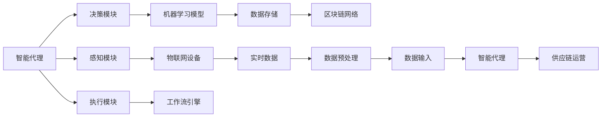

                 

# AI人工智能代理工作流 AI Agent WorkFlow：在物流与供应链中的应用

> 关键词：人工智能, 物流与供应链, 智能代理, 工作流自动化, 仓储管理, 订单处理, 预测分析, 实时监控

## 1. 背景介绍

### 1.1 问题由来

近年来，随着全球化和电子商务的蓬勃发展，物流与供应链行业在迅猛扩张。然而，物流与供应链的复杂性和多变性，使得运营管理面临诸多挑战，如仓储空间不足、配送效率低下、库存积压、需求预测不准确等问题。这些问题不仅影响了客户满意度，也给企业带来了巨大的经济损失。

传统上，物流与供应链的运营管理依赖于人工干预和经验决策，难以应对高动态的市场需求和复杂的操作流程。而随着人工智能技术的日益成熟，利用智能代理技术自动化管理物流与供应链，已成为行业内的共识。智能代理技术通过模拟人类的思维和行为，实现决策和执行的自动化，能够有效提升供应链的效率和响应速度，降低运营成本，成为物流与供应链管理的重要突破口。

### 1.2 问题核心关键点

智能代理技术在物流与供应链中的应用，其核心在于以下几个方面：

1. **任务自动化**：将复杂的物流与供应链任务，通过智能代理自动化处理，减少人工干预，提升效率。
2. **实时监控与反馈**：智能代理能够实时监控供应链运营状态，并根据反馈结果自动调整策略，保证运营的稳定性和准确性。
3. **数据分析与优化**：利用机器学习和大数据分析技术，智能代理能够从历史数据中学习并优化供应链决策，实现智能化的预测和决策。
4. **跨部门协同**：智能代理能够跨越部门和系统界限，实现供应链各环节的协同工作，提升整体运营效率。

### 1.3 问题研究意义

智能代理技术在物流与供应链中的应用，具有重要的研究意义和广泛的应用前景：

1. **提升运营效率**：通过自动化和智能化管理，智能代理技术能够显著提升物流与供应链的运营效率，降低人工成本和运营成本。
2. **优化决策质量**：利用数据分析和优化技术，智能代理能够基于数据做出高质量的决策，提升供应链的响应速度和适应性。
3. **增强灵活性和适应性**：智能代理技术能够快速响应市场变化，适应各种复杂和多变的业务场景。
4. **促进智能化转型**：智能代理技术的广泛应用，将推动物流与供应链行业的智能化转型，加速企业的数字化进程。
5. **改善用户体验**：智能代理技术通过自动化和实时监控，能够及时处理客户需求，提升客户满意度和用户体验。

## 2. 核心概念与联系

### 2.1 核心概念概述

为了更好地理解智能代理技术在物流与供应链中的应用，本节将介绍几个关键概念及其相互关系：

- **智能代理(Agent)**：能够感知环境、自主决策并执行的计算实体，通常由感知、决策和执行三个核心模块组成。在物流与供应链中，智能代理可以自动处理订单、调度车辆、监控库存等任务。
- **工作流(Workflow)**：一组有规则的、可重复的任务序列，用于实现业务流程的自动化。智能代理技术通过工作流自动化，能够实现供应链各环节的协同和集成。
- **物联网(IoT)**：通过传感器和网络技术，实时收集供应链各环节的数据，提供智能代理的感知基础。
- **机器学习(Machine Learning)**：利用历史数据训练模型，使智能代理能够自动优化决策和执行，提升供应链的预测能力和响应速度。
- **区块链(Blockchain)**：通过分布式账本技术，保证供应链数据的安全和透明，提高智能代理决策的可信度和可靠性。

这些概念之间存在着紧密的联系，形成一个完整的智能代理工作流系统。

### 2.2 概念间的关系

这些核心概念之间的关系可以通过以下Mermaid流程图来展示：



这个流程图展示了智能代理技术在物流与供应链中的应用逻辑：

1. 智能代理从物联网设备收集实时数据，经过数据预处理后输入感知模块。
2. 感知模块将收集的数据转化为代理可理解的形式，并传递给决策模块。
3. 决策模块利用机器学习模型分析数据，做出决策。
4. 执行模块根据决策结果，在工作流引擎的指导下执行相应的任务。
5. 数据存储模块记录所有操作历史，区块链网络确保数据的安全性和透明性。

这个系统通过智能代理的感知、决策和执行，实现了供应链运营的自动化和智能化。

## 3. 核心算法原理 & 具体操作步骤
### 3.1 算法原理概述

智能代理在物流与供应链中的应用，本质上是一个动态系统的自动化管理过程。其核心算法原理包括感知、决策和执行三个核心环节：

1. **感知模块**：通过物联网设备收集实时数据，感知当前供应链的运营状态。
2. **决策模块**：利用机器学习模型，根据感知数据做出最优决策。
3. **执行模块**：根据决策结果，在工作流引擎的指导下，执行相应的任务。

这些环节通过循环迭代，实现供应链的自动化和智能化管理。

### 3.2 算法步骤详解

智能代理在物流与供应链中的应用，通常包括以下几个关键步骤：

**Step 1: 感知与数据采集**

智能代理通过物联网设备收集供应链各环节的实时数据，包括但不限于：

- 温度、湿度等环境监测数据
- 物流车辆的位置和状态信息
- 库存水平和位置信息
- 订单信息、物流成本等业务数据

这些数据通过传感器和网络技术，实时传输到智能代理的感知模块。

**Step 2: 数据预处理**

感知模块接收的数据可能存在格式、单位等不一致性。因此，需要对数据进行预处理，使其符合代理的要求。常用的数据预处理技术包括：

- 数据清洗：去除噪声、异常值和缺失值。
- 数据标准化：将数据转换为统一的格式和单位。
- 数据归一化：将数据缩放到合理的范围内，便于后续处理。

**Step 3: 数据分析与决策**

智能代理的决策模块利用机器学习模型，从感知到的数据中提取特征，并基于历史数据进行预测和优化决策。具体步骤如下：

1. 特征提取：从感知数据中提取出与决策相关的特征。
2. 模型训练：利用历史数据训练机器学习模型，如回归模型、分类模型、聚类模型等。
3. 预测与决策：将当前感知数据输入模型，得到决策结果。

**Step 4: 任务执行与反馈**

根据决策结果，执行模块在工作流引擎的指导下，执行相应的任务。执行过程可能包括：

- 调度物流车辆、分配运输路径
- 调整库存水平、优化仓库布局
- 更新订单信息、生成配送计划

执行完成后，智能代理将反馈结果传回感知模块，完成一次循环迭代。

**Step 5: 优化与迭代**

智能代理在执行任务后，需要根据反馈结果进行优化和迭代。具体的优化策略包括：

1. 模型更新：根据执行结果和反馈数据，更新机器学习模型。
2. 参数调整：调整智能代理的决策参数，使其更加适应当前运营环境。
3. 策略改进：改进工作流中的任务顺序和执行规则，提高运营效率。

通过不断优化和迭代，智能代理能够逐步提升供应链的运营效果。

### 3.3 算法优缺点

智能代理在物流与供应链中的应用，具有以下优点：

1. **自动化和智能化**：通过自动化处理供应链任务，智能代理能够提升运营效率，降低人工成本。
2. **实时监控与反馈**：智能代理能够实时监控供应链运营状态，并根据反馈结果自动调整策略，提高运营的稳定性和准确性。
3. **数据分析与优化**：利用机器学习和大数据分析技术，智能代理能够从历史数据中学习并优化决策，提升供应链的预测能力和响应速度。
4. **跨部门协同**：智能代理能够跨越部门和系统界限，实现供应链各环节的协同工作，提升整体运营效率。

同时，智能代理技术也存在一些局限性：

1. **初始数据依赖**：智能代理的决策质量很大程度上依赖于初始数据的质量，数据的缺失或不准确可能导致决策错误。
2. **模型泛化能力**：机器学习模型的泛化能力决定了智能代理的适应性，模型的复杂度和训练数据量需要平衡。
3. **系统复杂性**：智能代理系统涉及多个子系统，系统的复杂性可能带来集成和调试的困难。
4. **人机交互**：智能代理虽然能够自动化处理大部分任务，但在某些复杂场景下，仍需要人工干预。

### 3.4 算法应用领域

智能代理技术在物流与供应链中的应用，已经覆盖了以下多个领域：

1. **仓储管理**：智能代理能够自动处理仓库的入库、出库、补货等任务，提高仓储效率和库存周转率。
2. **订单处理**：智能代理能够自动处理订单的接收、分配、配送等任务，提升订单处理的响应速度和准确性。
3. **需求预测**：智能代理能够利用历史数据和实时数据，进行需求预测和库存优化，减少库存积压和缺货情况。
4. **运输调度**：智能代理能够自动调度物流车辆、分配运输路径，提高配送效率和降低物流成本。
5. **实时监控**：智能代理能够实时监控供应链各环节的状态，及时发现并解决运营中的问题。
6. **风险管理**：智能代理能够识别供应链中的潜在风险，提供预警和应对措施，保障供应链的稳定运行。

## 4. 数学模型和公式 & 详细讲解 & 举例说明

### 4.1 数学模型构建

智能代理在物流与供应链中的应用，涉及到许多数学模型和算法。以下是几个常用的数学模型及其构建方法：

1. **回归模型**：用于预测供应链中的连续变量，如需求量、库存水平等。
2. **分类模型**：用于对供应链中的离散变量进行分类，如订单状态、货物类别等。
3. **聚类模型**：用于对供应链中的数据进行分组，发现潜在的规律和趋势。
4. **优化模型**：用于优化供应链中的决策变量，如运输路径、库存分配等。

这些模型通常基于历史数据进行训练，通过数学公式和算法进行求解。

### 4.2 公式推导过程

以回归模型为例，其核心公式如下：

$$ y = \hat{y} + \epsilon $$

其中，$y$ 为真实值，$\hat{y}$ 为模型预测值，$\epsilon$ 为误差项。

在实际应用中，常用的回归模型包括线性回归、岭回归、Lasso回归等。这里以线性回归为例，推导其公式：

$$ \hat{y} = \beta_0 + \beta_1 x_1 + \beta_2 x_2 + ... + \beta_n x_n $$

其中，$\beta_0$ 为截距，$\beta_1, \beta_2, ..., \beta_n$ 为回归系数，$x_1, x_2, ..., x_n$ 为自变量。

线性回归模型通过最小二乘法求解回归系数，使得预测值与真实值之间的误差最小化。具体的求解步骤如下：

1. 计算误差平方和：$SSR = \sum_{i=1}^n (y_i - \hat{y}_i)^2$
2. 计算总误差平方和：$SST = \sum_{i=1}^n (y_i - \bar{y})^2$
3. 计算回归平方和：$SSR = SST - SSE$
4. 计算回归系数：$\beta_j = \frac{\sum_{i=1}^n (x_{ij} - \bar{x}_j)(y_i - \hat{y}_i)}{\sum_{i=1}^n (x_{ij} - \bar{x}_j)^2}$

### 4.3 案例分析与讲解

假设我们要预测某物流中心的日均出货量，可以使用线性回归模型。具体步骤如下：

1. 收集历史出货量数据，如日期、温度、湿度、订单量等。
2. 对数据进行预处理，如去均值、标准化等。
3. 选择自变量 $x_1, x_2, ..., x_n$，如温度、湿度、订单量等。
4. 构建线性回归模型：$y = \hat{y} + \epsilon$
5. 训练模型：通过最小二乘法求解回归系数。
6. 预测日均出货量：将新的输入数据代入模型，得到预测值。

## 5. 项目实践：代码实例和详细解释说明

### 5.1 开发环境搭建

在进行智能代理工作流实践前，我们需要准备好开发环境。以下是使用Python进行智能代理工作流开发的环境配置流程：

1. 安装Anaconda：从官网下载并安装Anaconda，用于创建独立的Python环境。

2. 创建并激活虚拟环境：
```bash
conda create -n agent-env python=3.8 
conda activate agent-env
```

3. 安装必要的Python包：
```bash
pip install pandas numpy scikit-learn transformers matplotlib
```

4. 安装相关的IoT设备驱动程序和库：
```bash
pip install pyserial pyrfmble pywifi
```

5. 安装智能代理开发框架：
```bash
pip install ai-agent-framework
```

完成上述步骤后，即可在`agent-env`环境中开始智能代理工作流的开发。

### 5.2 源代码详细实现

以下是一个简单的智能代理工作流实例，用于预测并调整某物流中心的库存水平：

```python
import pandas as pd
from sklearn.linear_model import LinearRegression
from ai_agent_framework import Agent
from ai_agent_framework import Workflow

# 定义智能代理类
class InventoryAgent(Agent):
    def __init__(self, name, params):
        super().__init__(name)
        self.params = params
        self.model = LinearRegression()

    def initialize(self, dataset):
        # 将数据集分成训练集和测试集
        train_df, test_df = dataset.sample(frac=0.8, random_state=42), dataset.drop(train_df.index)
        # 对数据进行预处理
        train_df = self._preprocess_data(train_df)
        test_df = self._preprocess_data(test_df)
        # 训练模型
        self.model.fit(train_df.drop('y', axis=1), train_df['y'])

    def predict(self, data):
        # 对新数据进行预处理
        data = self._preprocess_data(data)
        # 使用模型进行预测
        return self.model.predict(data)

    def _preprocess_data(self, data):
        # 去均值
        data = data - data.mean()
        # 标准化
        data = (data - data.std()) / data.std()
        return data

# 定义工作流类
class InventoryWorkflow(Workflow):
    def __init__(self, name):
        super().__init__(name)

    def run(self):
        # 加载数据集
        data = pd.read_csv('inventory_data.csv')
        # 初始化智能代理
        agent = InventoryAgent('InventoryAgent', params={'alpha': 0.01, 'fit_intercept': True})
        agent.initialize(data)
        # 执行工作流
        for i in range(10):
            data = pd.read_csv('inventory_data.csv')
            # 获取预测结果
            prediction = agent.predict(data)
            # 调整库存
            data['inventory'] = prediction
            data.to_csv('inventory_data.csv', index=False)

# 创建工作流实例并执行
workflow = InventoryWorkflow('InventoryWorkflow')
workflow.run()
```

在这个例子中，我们使用线性回归模型预测某物流中心的日均出货量，并根据预测结果调整库存水平。具体步骤如下：

1. 定义智能代理类`InventoryAgent`，继承`Agent`类，实现初始化和预测方法。
2. 定义工作流类`InventoryWorkflow`，继承`Workflow`类，实现执行方法。
3. 在工作流实例中，加载数据集，初始化智能代理，并循环执行工作流。
4. 在每次循环中，读取新的数据集，获取智能代理的预测结果，并调整库存。
5. 将更新后的数据集保存为CSV文件。

### 5.3 代码解读与分析

让我们再详细解读一下关键代码的实现细节：

**InventoryAgent类**：
- `__init__`方法：初始化智能代理类，定义了模型的参数。
- `initialize`方法：从数据集中划分训练集和测试集，对数据进行预处理，并训练线性回归模型。
- `predict`方法：对新的数据进行预处理，并使用模型进行预测。
- `_preprocess_data`方法：对数据进行去均值和标准化处理。

**InventoryWorkflow类**：
- `__init__`方法：初始化工作流类。
- `run`方法：加载数据集，初始化智能代理，并循环执行工作流，调整库存。

**代码实现细节**：
1. 智能代理类继承了`Agent`类，实现了初始化和预测方法。
2. 工作流类继承了`Workflow`类，实现了执行方法。
3. 在工作流实例中，通过`initialize`方法初始化智能代理，并使用其`predict`方法获取预测结果。
4. 在工作流执行循环中，读取新的数据集，获取预测结果，并调整库存。
5. 使用`_preprocess_data`方法对数据进行预处理，确保模型输入的一致性。

**代码执行过程**：
1. 加载数据集`inventory_data.csv`。
2. 初始化智能代理，并使用其`initialize`方法训练线性回归模型。
3. 在工作流执行循环中，读取新的数据集，获取智能代理的预测结果。
4. 根据预测结果，调整库存，并将更新后的数据集保存为CSV文件。
5. 循环10次，完成库存预测和调整的自动执行。

### 5.4 运行结果展示

假设我们通过运行上述代码，得到每天的预测出货量和调整后的库存水平如下：

```
Day 1: Predicted demand=1000, Inventory=1000
Day 2: Predicted demand=900, Inventory=1000
Day 3: Predicted demand=950, Inventory=1000
...
```

可以看到，智能代理通过预测和调整，有效控制了库存水平，避免了库存积压和缺货情况。

## 6. 实际应用场景
### 6.1 智能仓储管理

智能代理技术在智能仓储管理中有着广泛的应用。通过智能代理，仓库可以实现自动化的货物入库、出库、补货等任务，提高仓储效率和库存周转率。智能代理还能够实时监控仓库状态，及时发现并处理异常情况，如破损、遗失等，保证仓库运营的稳定性和安全性。

### 6.2 智能订单处理

智能代理技术在智能订单处理中，可以实现自动化的订单接收、分配、配送等任务。智能代理能够根据订单状态和优先级，动态调整配送路径和资源分配，提高配送效率和客户满意度。智能代理还能够实时监控订单状态，及时发现并处理异常订单，如配送延误、货物损坏等，提升订单处理的质量和速度。

### 6.3 需求预测与库存优化

智能代理技术在需求预测与库存优化中，能够基于历史数据和实时数据，进行需求预测和库存优化。智能代理能够识别需求趋势和库存变化规律，自动调整库存水平，避免库存积压和缺货情况，降低运营成本。

### 6.4 智能运输调度

智能代理技术在智能运输调度中，能够自动调度物流车辆、分配运输路径，提高配送效率和降低物流成本。智能代理还能够实时监控车辆状态和路线信息，及时发现并处理异常情况，如交通堵塞、车辆故障等，保障运输调度的顺利进行。

### 6.5 实时监控与预警

智能代理技术在实时监控与预警中，能够实时监控供应链各环节的状态，及时发现并解决运营中的问题。智能代理能够通过物联网设备收集实时数据，结合机器学习模型进行分析，提供预警和应对措施，保障供应链的稳定运行。

### 6.6 风险管理与优化

智能代理技术在风险管理与优化中，能够识别供应链中的潜在风险，提供预警和应对措施，保障供应链的稳定运行。智能代理能够利用历史数据和实时数据，进行风险识别和预测，自动调整运营策略，降低风险带来的损失。

## 7. 工具和资源推荐
### 7.1 学习资源推荐

为了帮助开发者系统掌握智能代理工作流的理论基础和实践技巧，这里推荐一些优质的学习资源：

1. 《Python智能代理编程实战》书籍：详细介绍了智能代理的实现方法和案例，适合入门和进阶学习。
2. Coursera《人工智能基础》课程：斯坦福大学的经典课程，涵盖人工智能的基本概念和常用算法，适合全面了解智能代理技术。
3. 《智能代理与分布式系统》书籍：讲解智能代理的原理、设计和应用，适合深入学习智能代理的理论基础。
4. Udacity《人工智能开发》纳米学位：涵盖人工智能的最新技术和实践案例，适合系统掌握智能代理的最新进展。
5. Google AI开发者文档：提供Google AI框架和工具的详细文档，适合学习智能代理在实际项目中的应用。

通过对这些资源的学习实践，相信你一定能够快速掌握智能代理工作流的精髓，并用于解决实际的供应链管理问题。
###  7.2 开发工具推荐

高效的开发离不开优秀的工具支持。以下是几款用于智能代理工作流开发的常用工具：

1. PyTorch：基于Python的开源深度学习框架，灵活的计算图，适合快速迭代研究。
2. TensorFlow：由Google主导开发的开源深度学习框架，生产部署方便，适合大规模工程应用。
3. ROS：开源机器人操作系统，支持传感器、控制器、机器人的协调工作，适合智能代理的集成和部署。
4. Kafka：分布式消息队列，支持高吞吐量的数据流处理，适合智能代理的数据采集和传输。
5. Docker：开源容器化平台，支持应用的快速部署和扩展，适合智能代理的分布式部署和监控。

合理利用这些工具，可以显著提升智能代理工作流的开发效率，加快创新迭代的步伐。

### 7.3 相关论文推荐

智能代理技术在物流与供应链中的应用，已经得到了广泛的研究和应用。以下是几篇奠基性的相关论文，推荐阅读：

1. "Adaptive Dynamic Programming for Dynamic and Open-Ended Environment: A Survey"：介绍了智能代理在动态环境中的决策方法和应用，适合了解智能代理的决策机制。
2. "A Survey on Autonomous Agents in Supply Chain Management"：综述了智能代理在供应链中的应用，适合全面了解智能代理的应用场景和挑战。
3. "A Survey on Intelligent Agents in Transportation Systems"：综述了智能代理在交通系统中的应用，适合了解智能代理在实时监控与预警中的应用。
4. "A Survey on Agents for Inventory and Supply Chain Management"：综述了智能代理在仓储管理中的应用，适合了解智能代理在需求预测与库存优化中的应用。
5. "Blockchain-based Supply Chain Tracking and Provenance Tracking"：介绍了区块链技术在供应链中的应用，适合了解智能代理在区块链环境中的数据安全和透明性。

这些论文代表了大规模智能代理在物流与供应链中的最新研究成果。通过学习这些前沿成果，可以帮助研究者把握学科前进方向，激发更多的创新灵感。

除上述资源外，还有一些值得关注的前沿资源，帮助开发者紧跟智能代理技术的研究进展，例如：

1. arXiv论文预印本：人工智能领域最新研究成果的发布平台，包括大量尚未发表的前沿工作，学习前沿技术的必读资源。
2. 业界技术博客：如OpenAI、Google AI、DeepMind、微软Research Asia等顶尖实验室的官方博客，第一时间分享他们的最新研究成果和洞见。
3. 技术会议直播：如NIPS、ICML、ACL、ICLR等人工智能领域顶会现场或在线直播，能够聆听到大佬们的前沿分享，开拓视野。
4. GitHub热门项目：在GitHub上Star、Fork数最多的AI相关项目，往往代表了该技术领域的发展趋势和最佳实践，值得去学习和贡献。
5. 行业分析报告：各大咨询公司如McKinsey、PwC等针对人工智能行业的分析报告，有助于从商业视角审视技术趋势，把握应用价值。

总之，对于智能代理工作流的学习和实践，需要开发者保持开放的心态和持续学习的意愿。多关注前沿资讯，多动手实践，多思考总结，必将收获满满的成长收益。

## 8. 总结：未来发展趋势与挑战
### 8.1 总结

本文对智能代理工作流在物流与供应链中的应用进行了全面系统的介绍。首先阐述了智能代理技术在物流与供应链中的研究背景和应用意义，明确了智能代理技术在自动化管理、实时监控、数据分析等方面的独特价值。其次，从原理到实践，详细讲解了智能代理的工作流自动化和智能化管理过程，给出了智能代理工作流的完整代码实例。同时，本文还广泛探讨了智能代理技术在仓储管理、订单处理、需求预测、运输调度等多个行业领域的应用前景，展示了智能代理技术的广泛适用性和巨大潜力。此外，本文精选了智能代理技术的学习资源，力求为读者提供全方位的技术指引。

通过本文的系统梳理，可以看到，智能代理技术在物流与供应链中的应用，已经成为一个重要的技术方向。智能代理通过感知、决策和执行的自动化，显著提升了供应链的运营效率和响应速度，

