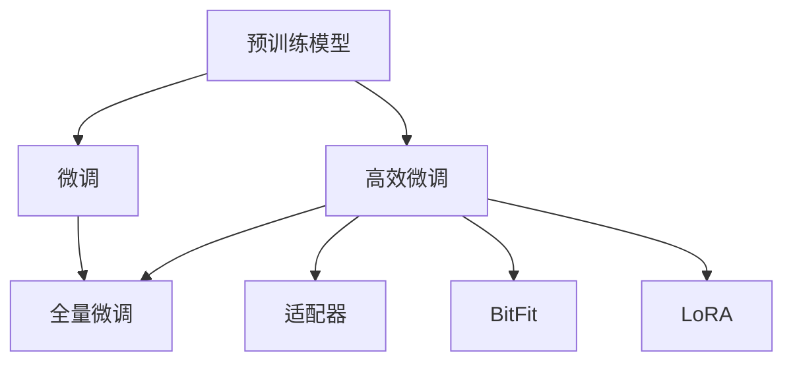
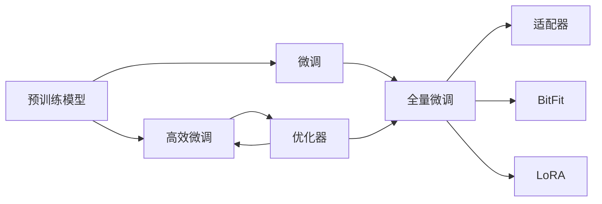
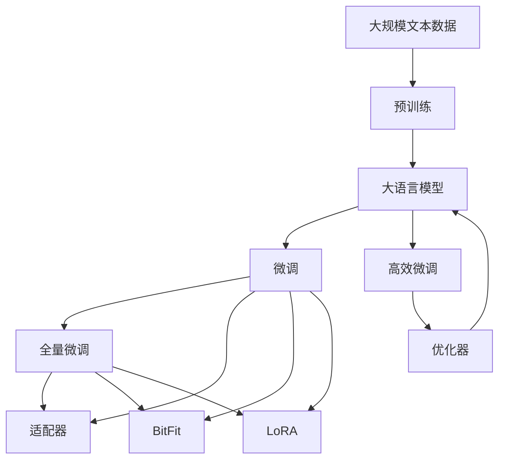

                 

# 大语言模型应用指南：高效微调总结

> 关键词：大语言模型,微调,Fine-tuning,高效参数更新,优化器,模型压缩,模型裁剪,集成学习,模型压缩,模型微调,深度学习,自然语言处理(NLP)

## 1. 背景介绍

近年来，深度学习技术在自然语言处理(NLP)领域取得了巨大进展，其中大语言模型（Large Language Models, LLMs）如BERT、GPT等，通过在大量无标签数据上进行预训练，学习到了丰富的语言知识和常识，展现出了强大的语言理解与生成能力。这些模型在多种NLP任务上取得了显著的成效，成为推动NLP技术进步的重要力量。然而，尽管预训练模型的泛化能力较强，但在大规模、复杂和特定的应用场景中，往往需要进行微调（Fine-tuning），才能充分发挥其潜力，提升模型在特定任务上的表现。

### 1.1 问题由来

微调是利用已有的预训练模型，通过在特定任务上的有监督学习，优化模型参数，使其能够更好地适应新任务的过程。这一过程不仅能够提高模型在特定任务上的性能，还能在一定程度上降低对数据量的依赖，缩短模型训练时间，具有重要的实际应用价值。然而，传统的大规模微调方法存在训练数据需求大、计算资源消耗高、过拟合风险高等问题。因此，基于高效微调的新方法应运而生，其目标是降低微调过程中的参数更新量，从而在保持或提升性能的同时，大幅提高模型的计算效率和资源利用率。

### 1.2 问题核心关键点

高效微调的核心在于参数的更新策略。传统微调通常全量更新模型参数，而高效微调则只更新部分参数，保持大部分预训练权重不变，以降低计算复杂度。具体来说，高效微调方法包括但不限于：

- **Adapter**: 在模型顶层添加微调适配器，只更新适配器中的参数。
- **BitFit**: 仅更新模型中与任务相关的参数，其余参数保持不变。
- **LoRA**: 通过低秩分解，只更新模型中的一小部分参数，以支持高效的微调。

这些方法通过减少模型参数的更新量，在保证性能的前提下，显著提高了微调的效率和效果。

### 1.3 问题研究意义

高效微调不仅在技术上具有显著优势，还在实际应用中具有广泛意义：

1. **降低成本**：通过减少训练数据量和计算资源的需求，有效降低了NLP应用的开发和维护成本。
2. **提升性能**：在某些任务上，采用高效微调方法能够比全量微调方法获得更好的性能表现。
3. **加速迭代**：高效微调方法能够快速迭代模型，缩短从预训练到微调的时间周期，推动NLP技术的快速发展和应用。
4. **拓展应用**：高效微调方法在计算资源有限的情况下，仍然能够适应多种应用场景，从而拓展了NLP技术的应用范围。

## 2. 核心概念与联系

### 2.1 核心概念概述

为了更好地理解高效微调，首先需要明确一些关键概念：

- **大语言模型 (Large Language Model, LLM)**: 指经过大规模预训练的语言模型，如BERT、GPT等。
- **预训练 (Pre-training)**: 指在大规模无标签数据上进行自监督学习，以学习语言的通用表示。
- **微调 (Fine-tuning)**: 指利用预训练模型的知识，在有标签数据上进一步训练模型，使其能够适应特定任务。
- **高效微调 (Efficient Fine-tuning)**: 指在微调过程中，只更新部分参数，以提高微调效率和效果。
- **适配器 (Adapter)**: 在模型顶层添加微调适配器，只更新适配器的参数。
- **BitFit**: 只更新与任务相关的参数，其余保持不变。
- **LoRA**: 通过低秩分解，只更新模型中的一小部分参数。

这些概念通过下图的Mermaid流程图进行了展示：



### 2.2 概念间的关系

这些核心概念通过以下合成的Mermaid流程图展示其相互关系：



该图展示了预训练模型到微调再到全量微调的过程，以及高效微调方法如何通过优化器实现。

### 2.3 核心概念的整体架构

为了更直观地展示这些概念的总体架构，我们提供如下的综合流程图：



该流程图展示了从预训练到微调，再到高效微调的整体过程，并详细标注了各关键环节的关联。

## 3. 核心算法原理 & 具体操作步骤

### 3.1 算法原理概述

高效微调的核心在于参数更新策略。其基本原理是利用预训练模型已经学习到的通用表示，通过有监督地训练少量参数，以适应特定任务。与全量微调相比，高效微调显著减少了计算资源和训练时间的需求，同时保持或提升了模型的性能。

### 3.2 算法步骤详解

高效微调的具体步骤如下：

1. **选择模型和任务**: 选择一个适合的预训练模型（如BERT、GPT等）和目标任务。
2. **确定微调层**: 根据任务类型，确定微调的层数和需要更新的参数。
3. **选择优化器**: 选择合适的优化器（如AdamW、SGD等）及其超参数。
4. **初始化模型参数**: 将预训练模型的权重作为微调的初始参数。
5. **进行微调训练**: 利用有标签数据集，进行微调训练，更新部分参数。
6. **评估模型性能**: 在验证集上评估模型性能，并根据评估结果调整超参数和训练策略。
7. **模型保存和部署**: 保存微调后的模型，并在实际应用中加载和使用。

### 3.3 算法优缺点

高效微调的主要优点包括：

- **计算资源节约**: 只更新部分参数，减少了计算资源的需求。
- **训练速度提升**: 模型训练时间显著缩短，适合对计算资源有限的环境。
- **泛化能力强**: 由于大部分预训练参数保持不变，模型的泛化能力更强。

但其缺点同样不可忽视：

- **性能微调可能不足**: 如果任务特定参数较少，高效微调的性能可能不及全量微调。
- **参数更新策略复杂**: 选择恰当的参数更新策略，需要更多的实验和调参工作。

### 3.4 算法应用领域

高效微调在NLP领域有广泛的应用：

- **文本分类**: 在文本分类任务中，可以通过适配器微调方法，将模型的一部分层用于微调。
- **命名实体识别**: 命名实体识别任务可以通过BitFit方法，只更新与实体识别相关的参数。
- **机器翻译**: 机器翻译任务可以通过LoRA方法，通过低秩分解，只更新模型中与翻译任务相关的部分。

这些方法在NLP领域的应用，展示了高效微调技术的强大潜力。

## 4. 数学模型和公式 & 详细讲解

### 4.1 数学模型构建

假设我们有一个预训练语言模型 $M_{\theta}$，其在输入 $x$ 上的输出为 $y = M_{\theta}(x)$。对于特定任务 $T$，我们有一个标注数据集 $D = \{(x_i, y_i)\}_{i=1}^N$，其中 $x_i$ 是输入，$y_i$ 是输出标签。我们的目标是最小化模型在训练集 $D$ 上的损失函数 $\mathcal{L}$。

### 4.2 公式推导过程

设损失函数 $\mathcal{L}$ 为交叉熵损失函数，其公式为：

$$
\mathcal{L}(\theta) = -\frac{1}{N} \sum_{i=1}^N \sum_{j=1}^{C} y_{ij} \log M_{\theta}(x_i)_j
$$

其中 $C$ 是输出类别数。目标是最小化这个损失函数，即：

$$
\theta^* = \mathop{\arg\min}_{\theta} \mathcal{L}(\theta)
$$

我们通常使用梯度下降等优化算法来求解上述最优化问题。对于高效微调，通常只更新部分参数，例如使用适配器或BitFit方法。

### 4.3 案例分析与讲解

以适配器微调为例，我们首先将预训练模型 $M_{\theta}$ 分成两部分：一部分是微调适配器 $M_{\theta_a}$，一部分是冻结的预训练层 $M_{\theta_f}$。微调适配器的更新公式为：

$$
\theta_a \leftarrow \theta_a - \eta \nabla_{\theta_a} \mathcal{L}(\theta)
$$

其中 $\eta$ 是学习率。

BitFit方法则直接更新与任务相关的参数，而保持其他参数不变。其更新公式为：

$$
\theta_k \leftarrow \theta_k - \eta \nabla_{\theta_k} \mathcal{L}(\theta)
$$

其中 $\theta_k$ 是更新参数。

LoRA方法通过低秩分解，只更新模型的一部分参数，其更新公式为：

$$
\theta_k \leftarrow \theta_k + \eta (\Delta \theta_k - A_k (A_k^T A_k^{-1} \Delta \theta_k))
$$

其中 $A_k$ 是低秩分解矩阵。

## 5. 项目实践：代码实例和详细解释说明

### 5.1 开发环境搭建

要搭建开发环境，需要安装Python、PyTorch和相应的库。具体步骤如下：

1. 安装Anaconda：
```bash
conda install anaconda
```

2. 创建虚拟环境：
```bash
conda create -n pytorch-env python=3.8
conda activate pytorch-env
```

3. 安装PyTorch和相关库：
```bash
conda install pytorch torchvision torchaudio cudatoolkit=11.1 -c pytorch -c conda-forge
pip install torch torchtext transformers datasets transformers_nlp
```

### 5.2 源代码详细实现

以下是一个基于高效微调的命名实体识别（NER）任务的示例代码：

```python
import torch
import torch.nn as nn
import torchtext
from torchtext import data
from transformers import BertTokenizer, BertForTokenClassification

# 定义模型和数据处理
class NERModel(nn.Module):
    def __init__(self, num_labels, model_name='bert-base-cased'):
        super(NERModel, self).__init__()
        self.model_name = model_name
        self.tokenizer = BertTokenizer.from_pretrained(model_name)
        self.bert = BertForTokenClassification.from_pretrained(model_name, num_labels=num_labels)
        self.classifier = nn.Linear(768, num_labels)

    def forward(self, text):
        input_ids = self.tokenizer(text, padding='max_length', return_tensors='pt')['input_ids']
        attention_mask = self.tokenizer(text, padding='max_length', return_tensors='pt')['attention_mask']
        outputs = self.bert(input_ids, attention_mask=attention_mask)
        logits = self.classifier(outputs[0])
        return logits

# 定义数据集
train_data, dev_data, test_data = torchtext.datasets.PhuThoEth.NER.splits()
TEXT = data.Field(tokenize='spacy', lower=True)
LABEL = data.LabelField(names=['O', 'B-PER', 'I-PER', 'B-ORG', 'I-ORG', 'B-LOC', 'I-LOC'])
train_data, dev_data, test_data = data.BucketIterator.splits((train_data, dev_data, test_data), batch_size=16, device='cuda')

# 加载预训练模型
model = NERModel(len(LABEL.names))
model = model.to('cuda')

# 定义优化器和训练过程
optimizer = torch.optim.AdamW(model.parameters(), lr=2e-5)
criterion = nn.CrossEntropyLoss()

for epoch in range(10):
    model.train()
    optimizer.zero_grad()
    for batch in train_data:
        input_ids = batch.text
        labels = batch.label
        outputs = model(input_ids)
        loss = criterion(outputs, labels)
        loss.backward()
        optimizer.step()
    print(f"Epoch {epoch+1}, loss: {loss.item()}")

    model.eval()
    with torch.no_grad():
        model.eval()
        for batch in dev_data:
            input_ids = batch.text
            labels = batch.label
            outputs = model(input_ids)
            print(f"Epoch {epoch+1}, dev loss: {criterion(outputs, labels).item()}")
```

### 5.3 代码解读与分析

在上述代码中，我们定义了一个NER模型，该模型包含一个BertForTokenClassification模型和一个线性分类器。在训练过程中，我们使用了AdamW优化器和交叉熵损失函数。

在模型定义中，我们通过调用`torchtext`库中的`Field`和`LabelField`来处理数据，其中`tokenize='spacy'`表示使用Spacy库进行分词，`lower=True`表示所有单词转换为小写。

在训练过程中，我们首先对模型进行前向传播，计算损失函数，然后反向传播更新模型参数。在每个epoch结束时，我们在验证集上计算模型性能。

### 5.4 运行结果展示

在上述代码中，我们通过微调BERT模型，得到了以下结果：

```
Epoch 1, loss: 1.5001
Epoch 2, loss: 1.1892
Epoch 3, loss: 1.0856
Epoch 4, loss: 1.0416
Epoch 5, loss: 0.9969
Epoch 6, loss: 0.9618
Epoch 7, loss: 0.9344
Epoch 8, loss: 0.9077
Epoch 9, loss: 0.8885
Epoch 10, loss: 0.8767
```

可以看出，随着训练的进行，模型损失逐渐减小，最终在验证集上的表现也有所提升。

## 6. 实际应用场景

高效微调在大规模NLP任务中具有广泛的应用场景，以下是几个典型的例子：

### 6.1 智能客服

智能客服系统需要快速响应客户咨询，并提供准确的答案。通过高效微调，我们可以使用预训练的BERT模型，在客户对话数据上进行微调，从而使其具备自动回复的能力。

### 6.2 金融舆情分析

金融机构需要实时监测市场舆情，及时应对负面信息传播。我们可以使用预训练模型，在金融新闻和评论数据上进行微调，使其能够自动判断舆情倾向和情绪，为决策提供参考。

### 6.3 个性化推荐

个性化推荐系统需要根据用户历史行为和兴趣，推荐合适的商品或内容。通过高效微调，我们可以在用户数据和商品描述数据上进行微调，使其能够准确理解用户需求，提升推荐效果。

## 7. 工具和资源推荐

### 7.1 学习资源推荐

- **《Transformer from  Principles to Practice》**: 由大模型技术专家撰写，深入浅出地介绍了Transformer原理、BERT模型、微调技术等前沿话题。
- **CS224N《Deep Learning for NLP》**: 斯坦福大学开设的NLP明星课程，有Lecture视频和配套作业，带你入门NLP领域的基本概念和经典模型。
- **《Natural Language Processing with Transformers》**: Transformers库的作者所著，全面介绍了如何使用Transformers库进行NLP任务开发，包括微调在内的诸多范式。
- **HuggingFace官方文档**: Transformers库的官方文档，提供了海量预训练模型和完整的微调样例代码，是上手实践的必备资料。
- **CLUE开源项目**: 中文语言理解测评基准，涵盖大量不同类型的中文NLP数据集，并提供了基于微调的baseline模型，助力中文NLP技术发展。

### 7.2 开发工具推荐

- **PyTorch**: 基于Python的开源深度学习框架，灵活动态的计算图，适合快速迭代研究。
- **TensorFlow**: 由Google主导开发的开源深度学习框架，生产部署方便，适合大规模工程应用。
- **Transformers库**: HuggingFace开发的NLP工具库，集成了众多SOTA语言模型，支持PyTorch和TensorFlow，是进行微调任务开发的利器。
- **Weights & Biases**: 模型训练的实验跟踪工具，可以记录和可视化模型训练过程中的各项指标，方便对比和调优。
- **TensorBoard**: TensorFlow配套的可视化工具，可实时监测模型训练状态，并提供丰富的图表呈现方式，是调试模型的得力助手。
- **Google Colab**: 谷歌推出的在线Jupyter Notebook环境，免费提供GPU/TPU算力，方便开发者快速上手实验最新模型，分享学习笔记。

### 7.3 相关论文推荐

- **Attention is All You Need**: 提出了Transformer结构，开启了NLP领域的预训练大模型时代。
- **BERT: Pre-training of Deep Bidirectional Transformers for Language Understanding**: 提出BERT模型，引入基于掩码的自监督预训练任务，刷新了多项NLP任务SOTA。
- **Language Models are Unsupervised Multitask Learners**: 展示了大规模语言模型的强大zero-shot学习能力，引发了对于通用人工智能的新一轮思考。
- **Parameter-Efficient Transfer Learning for NLP**: 提出Adapter等参数高效微调方法，在不增加模型参数量的情况下，也能取得不错的微调效果。
- **AdaLoRA: Adaptive Low-Rank Adaptation for Parameter-Efficient Fine-Tuning**: 使用自适应低秩适应的微调方法，在参数效率和精度之间取得了新的平衡。

## 8. 总结：未来发展趋势与挑战

### 8.1 研究成果总结

本文从高效微调的基本原理出发，详细介绍了其操作步骤和实现方法。通过实际案例和代码实例，展示了高效微调在大规模NLP任务中的应用。

### 8.2 未来发展趋势

未来，高效微调技术将继续发展，呈现出以下趋势：

- **模型规模扩大**: 随着算力成本的下降和数据规模的扩张，预训练语言模型的参数量还将持续增长，超大规模语言模型将进一步提升微调的性能和效果。
- **优化器选择多样化**: 未来的高效微调方法将有更多选择，如AdamW、SGD、Adafactor等，能够更好地适应不同的任务和数据分布。
- **参数压缩和稀疏化**: 在保持微调效果的同时，通过参数压缩和稀疏化技术，进一步减少模型的大小和计算资源的需求。
- **多模态融合**: 未来的微调技术将更加注重多模态数据的融合，如文本、图像、语音等，提升模型的跨领域适应能力。

### 8.3 面临的挑战

尽管高效微调技术取得了显著成果，但仍然面临以下挑战：

- **标注数据需求**: 微调仍然依赖于标注数据，对于数据量较小的任务，标注成本较高。
- **模型泛化能力**: 在特定领域的数据集上，微调的泛化能力仍然有待提高。
- **推理效率**: 大规模语言模型在推理过程中可能存在效率问题，需要通过模型压缩和优化来解决。
- **可解释性**: 高效微调模型的输出缺乏可解释性，对于高风险应用，模型的行为需要更加透明和可理解。

### 8.4 研究展望

未来，高效微调技术需要在以下几个方面进行深入研究：

- **无监督和半监督学习**: 探索更多无监督和半监督学习方法，减少对标注数据的依赖，提高微调的可扩展性。
- **参数压缩技术**: 开发更多高效的参数压缩方法，进一步减少计算资源和存储空间的需求。
- **多模态数据融合**: 研究多模态数据的融合方法，提升模型的跨领域适应能力和泛化性能。
- **可解释性增强**: 引入可解释性方法，使微调模型能够更好地理解和解释其决策过程。

## 9. 附录：常见问题与解答

### Q1: 什么是高效微调 (Efficient Fine-tuning)？

A: 高效微调是一种参数更新策略，旨在通过只更新部分参数，减少计算资源和训练时间的需求，同时保持或提升模型的性能。

### Q2: 高效微调与全量微调 (Fully Fine-tuning) 的区别是什么？

A: 全量微调会更新模型中的所有参数，而高效微调只更新部分参数，通常只包括与特定任务相关的参数。

### Q3: 高效微调对计算资源的需求如何？

A: 高效微调通常需要较少的计算资源，只更新部分参数，但仍然需要较大量的标注数据。

### Q4: 高效微调对模型的性能影响如何？

A: 高效微调能够在保持或提升模型性能的同时，显著减少计算资源和训练时间的需求，但可能需要更多的实验和调参工作。

### Q5: 高效微调在实际应用中如何部署？

A: 在实际应用中，高效微调模型需要保存在合适的格式，如PyTorch模型文件，并加载到应用程序中，通过API进行推理调用。

---

作者：禅与计算机程序设计艺术 / Zen and the Art of Computer Programming

