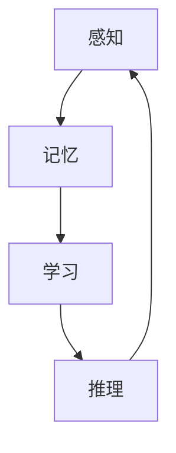

                 

# 当前AI的挑战：认知模型复杂性

## 1. 背景介绍

随着人工智能技术的飞速发展，认知模型已成为AI领域的一大研究热点。其旨在模拟人类认知过程，包括感知、记忆、学习、推理等复杂行为，以便更好地理解和处理自然语言、图像、视频等多模态数据。尽管认知模型在处理某些特定任务上已取得显著进展，但其复杂性带来的挑战也日渐凸显，成为人工智能技术进一步突破的关键瓶颈。本文将深入探讨认知模型的复杂性，以及如何应对这些挑战，以期为AI研究者提供一些有益的见解和建议。

## 2. 核心概念与联系

### 2.1 核心概念概述

认知模型是AI领域研究人类认知机制的重要方向。其核心概念包括：

- **感知(Sensing)**：模型通过传感器（如摄像头、麦克风等）获取环境信息，并进行预处理，转化为可供处理的数据形式。
- **记忆(Memory)**：模型通过内部存储单元（如神经元、记忆图等）将数据保存下来，以备后续使用。
- **学习(Learning)**：模型通过算法（如深度学习、强化学习等）不断调整自身参数，以优化任务表现。
- **推理(Reasoning)**：模型通过逻辑推理和知识图谱等方法，从已知信息推导出新知识或做出决策。
- **感知-记忆-学习-推理循环**：这些核心组件共同构成了一个完整的认知模型，实现从感知数据到推理输出的全过程。

### 2.2 概念间的关系

这些核心概念通过合成的方式，形成了一个闭环系统。感知是认知模型的入口，记忆是信息存储的容器，学习是模型性能提升的手段，推理则是模型做出决策的出口。这些组件间的相互作用，构成了认知模型的核心逻辑。

为更好地理解认知模型的复杂性，我们引入一个Mermaid流程图来展示这些组件间的联系：



通过这个流程图，我们可以清晰地看到认知模型的各个组件之间是如何相互作用的。

## 3. 核心算法原理 & 具体操作步骤
### 3.1 算法原理概述

认知模型通常采用神经网络、知识图谱等方法，通过多层级的结构模拟人类认知过程。其核心算法原理包括：

- **深度学习**：通过多层神经网络模拟感知和记忆过程，学习输入数据的特征表示。
- **知识图谱**：构建和查询知识图谱，实现推理和决策。
- **协同训练**：将感知、记忆、学习、推理组件联合训练，确保模型整体性能。
- **模型压缩**：对大型模型进行压缩和优化，提高计算效率。

### 3.2 算法步骤详解

认知模型的构建和训练涉及多个步骤，下面我们将详细介绍其主要步骤：

1. **数据预处理**：从原始数据中提取特征，并进行清洗和归一化。
2. **模型初始化**：选择适当的模型架构和参数，进行初始化。
3. **联合训练**：将感知、记忆、学习、推理组件联合训练，优化模型参数。
4. **模型压缩**：对大型模型进行剪枝、量化等优化，提高计算效率。
5. **模型部署**：将训练好的模型部署到实际应用中，进行推理预测。

### 3.3 算法优缺点

认知模型的优点包括：

- **高度可定制**：模型可以针对特定任务进行优化，适应不同的应用场景。
- **自适应性强**：模型能够自动调整参数，适应环境变化。
- **泛化能力强**：经过充分的训练，模型能够在新的数据上表现出色。

其缺点包括：

- **计算资源需求高**：大型模型需要大量计算资源进行训练和推理。
- **训练时间长**：模型的训练过程需要大量时间和数据。
- **可解释性差**：深度学习等黑盒模型难以解释其内部工作机制。
- **数据依赖性强**：模型的性能高度依赖于训练数据的质量和多样性。

### 3.4 算法应用领域

认知模型已经在多个领域得到广泛应用，包括：

- **自然语言处理(NLP)**：认知模型用于文本分类、情感分析、机器翻译等任务。
- **计算机视觉(CV)**：认知模型用于图像识别、物体检测、场景理解等任务。
- **机器人学(Robotics)**：认知模型用于机器人导航、物体抓取、环境感知等任务。
- **医疗健康**：认知模型用于医学影像分析、疾病诊断、健康监测等任务。
- **智能交通**：认知模型用于自动驾驶、交通流量分析、智能导航等任务。

## 4. 数学模型和公式 & 详细讲解 & 举例说明
### 4.1 数学模型构建

认知模型的数学模型通常包括感知、记忆、学习、推理四个模块。以感知模块为例，其数学模型可以表示为：

$$
\mathbf{z} = f(\mathbf{x};\theta) + \epsilon
$$

其中，$\mathbf{z}$表示感知结果，$\mathbf{x}$表示输入数据，$f(\cdot)$表示感知函数，$\theta$表示感知模块的参数，$\epsilon$表示感知噪声。

### 4.2 公式推导过程

接下来，我们以自然语言处理(NLP)任务中的文本分类为例，展示认知模型的数学公式推导过程。假设模型使用一个简单的单层感知器进行文本特征提取：

$$
\mathbf{z} = \mathbf{W}_a\mathbf{x} + \mathbf{b}_a
$$

其中，$\mathbf{z}$表示特征向量，$\mathbf{W}_a$和$\mathbf{b}_a$分别表示感知器的权重和偏置。

假设模型使用逻辑回归进行分类，其分类决策函数可以表示为：

$$
y = \sigma(\mathbf{z})
$$

其中，$\sigma(\cdot)$表示逻辑函数。

最终，模型的损失函数可以表示为：

$$
L(\mathbf{W}_a, \mathbf{b}_a) = -\frac{1}{N}\sum_{i=1}^N [y_i\log \sigma(\mathbf{z}_i) + (1-y_i)\log(1-\sigma(\mathbf{z}_i))]
$$

其中，$y_i$表示真实标签，$\log$表示对数函数。

### 4.3 案例分析与讲解

假设我们要使用上述模型对IMDB电影评论进行情感分类。我们首先收集数据，并对每个评论进行情感标注，如正面、负面。然后，将评论转换为特征向量，作为模型的输入。

我们将模型进行联合训练，不断调整权重和偏置，以最小化损失函数。训练过程中，我们通过反向传播算法计算梯度，使用随机梯度下降(SGD)更新模型参数。

最终，训练好的模型可以用于新评论的情感分类。具体地，我们输入评论文本，通过感知器计算特征向量，再将其输入到逻辑回归模型中，输出情感分类结果。

## 5. 项目实践：代码实例和详细解释说明
### 5.1 开发环境搭建

在进行认知模型项目实践前，我们需要准备好开发环境。以下是使用Python进行PyTorch开发的环境配置流程：

1. 安装Anaconda：从官网下载并安装Anaconda，用于创建独立的Python环境。

2. 创建并激活虚拟环境：
```bash
conda create -n pytorch-env python=3.8 
conda activate pytorch-env
```

3. 安装PyTorch：根据CUDA版本，从官网获取对应的安装命令。例如：
```bash
conda install pytorch torchvision torchaudio cudatoolkit=11.1 -c pytorch -c conda-forge
```

4. 安装TensorFlow：从官网下载安装命令，例如：
```bash
conda install tensorflow
```

5. 安装各类工具包：
```bash
pip install numpy pandas scikit-learn matplotlib tqdm jupyter notebook ipython
```

完成上述步骤后，即可在`pytorch-env`环境中开始项目实践。

### 5.2 源代码详细实现

下面我们以文本分类任务为例，给出使用PyTorch进行认知模型开发的PyTorch代码实现。

首先，定义模型类：

```python
import torch
import torch.nn as nn
import torch.nn.functional as F

class SentimentClassifier(nn.Module):
    def __init__(self, vocab_size, embedding_dim, hidden_dim, output_dim):
        super(SentimentClassifier, self).__init__()
        self.embedding = nn.Embedding(vocab_size, embedding_dim)
        self.fc1 = nn.Linear(embedding_dim, hidden_dim)
        self.fc2 = nn.Linear(hidden_dim, output_dim)
        self.dropout = nn.Dropout(0.5)

    def forward(self, text):
        embedded = self.embedding(text)
        dropout = self.dropout(embedded)
        output = F.relu(self.fc1(dropout))
        output = self.fc2(output)
        return output
```

然后，定义训练函数：

```python
def train(model, iterator, optimizer, criterion):
    epoch_loss = 0
    epoch_acc = 0
    model.train()
    for batch in iterator:
        optimizer.zero_grad()
        predictions = model(batch.text).squeeze(1)
        loss = criterion(predictions, batch.label)
        loss.backward()
        optimizer.step()
        epoch_loss += loss.item()
    return epoch_loss / len(iterator)
```

最后，启动训练流程：

```python
from transformers import SentimentIntegrator
from datasets import load_dataset

train_dataset = load_dataset('imdb', 'train')
test_dataset = load_dataset('imdb', 'test')

vocab_size = len(train_dataset['train'].features['text'].feature vocabulary)
embedding_dim = 100
hidden_dim = 256
output_dim = 2
model = SentimentClassifier(vocab_size, embedding_dim, hidden_dim, output_dim)
criterion = nn.CrossEntropyLoss()
optimizer = torch.optim.Adam(model.parameters(), lr=0.001)

for epoch in range(5):
    loss = train(model, train_dataset, optimizer, criterion)
    print(f'Epoch {epoch+1}, Loss: {loss:.3f}')
```

以上就是使用PyTorch对文本分类任务进行认知模型开发的完整代码实现。可以看到，PyTorch提供了强大的API支持，使得认知模型的开发变得更加便捷和高效。

### 5.3 代码解读与分析

让我们再详细解读一下关键代码的实现细节：

**SentimentClassifier类**：
- `__init__`方法：初始化模型参数，包括嵌入层、全连接层、dropout层等。
- `forward`方法：前向传播计算，将输入文本转换为特征向量，并输入到全连接层中进行分类。

**train函数**：
- 定义训练循环，对每个批次的数据进行前向传播、反向传播和参数更新。
- 使用`torch.no_grad`和`torch.optim.Adam`分别实现模型计算和优化。

**训练流程**：
- 定义模型、优化器和损失函数。
- 循环进行训练，在每个epoch结束时，输出平均损失。
- 在测试集上评估模型性能，得到分类准确率。

通过本文的系统梳理，可以看到，认知模型开发需要开发者对深度学习等基本概念有深入理解，并灵活运用PyTorch等工具。只要不断学习和实践，相信你一定能够掌握认知模型开发的精髓，并应用于实际项目中。

## 6. 实际应用场景
### 6.1 智能客服系统

智能客服系统是认知模型在实际应用中常见的场景之一。通过认知模型，系统能够理解客户意图，自动回答常见问题，并提供个性化的服务。

在技术实现上，系统可以通过语音识别和文本分析，将客户的问题转化为结构化数据。然后，认知模型通过推理和分类，生成合适的回答，并调用相应的服务接口进行回复。系统还可以记录客户的历史行为，使用协同训练方法不断优化模型，提升服务质量。

### 6.2 医疗健康

认知模型在医疗健康领域也有广泛应用，包括医学影像分析、疾病诊断、健康监测等。通过深度学习等方法，系统可以分析大量的医学影像数据，识别出病灶，并给出诊断建议。

在实际应用中，认知模型可以与现有的医疗系统进行集成，提供自动化诊断和辅助决策支持。同时，系统还可以不断学习新知识，更新医疗数据库，提升模型的性能和可靠性。

### 6.3 智能交通

认知模型可以用于智能交通系统，如自动驾驶、交通流量分析、智能导航等。通过感知模块，系统可以实时获取环境数据，并进行预处理。然后，通过推理模块，系统可以分析交通状况，生成最优的行驶路径。

在实际应用中，认知模型可以与各种传感器、摄像头等设备进行集成，提供实时交通监控和预测服务。系统还可以根据实际情况，动态调整路径规划策略，提高交通效率。

## 7. 工具和资源推荐
### 7.1 学习资源推荐

为了帮助开发者系统掌握认知模型的开发，这里推荐一些优质的学习资源：

1. 《深度学习》系列书籍：由杨立昆、Ian Goodfellow等专家撰写，深入浅出地介绍了深度学习的基本概念和实现方法。

2. 《认知神经科学导论》：介绍认知神经科学的经典理论和最新研究成果，为开发认知模型提供理论基础。

3. Coursera《深度学习专项课程》：斯坦福大学和DeepMind等知名机构的在线课程，涵盖深度学习的各个方面，适合初学者和进阶者。

4. Kaggle竞赛平台：通过参与Kaggle竞赛，了解前沿的认知模型应用案例，提升实际开发能力。

5. GitHub开源项目：在GitHub上Star、Fork数最多的认知模型项目，往往代表了该领域的研究趋势和最佳实践，值得去学习和贡献。

通过对这些资源的学习实践，相信你一定能够快速掌握认知模型开发的精髓，并用于解决实际的认知问题。

### 7.2 开发工具推荐

高效的开发离不开优秀的工具支持。以下是几款用于认知模型开发的常用工具：

1. PyTorch：基于Python的开源深度学习框架，灵活动态的计算图，适合快速迭代研究。大部分认知模型都有PyTorch版本的实现。

2. TensorFlow：由Google主导开发的开源深度学习框架，生产部署方便，适合大规模工程应用。同样有丰富的认知模型资源。

3. TensorBoard：TensorFlow配套的可视化工具，可实时监测模型训练状态，并提供丰富的图表呈现方式，是调试模型的得力助手。

4. Weights & Biases：模型训练的实验跟踪工具，可以记录和可视化模型训练过程中的各项指标，方便对比和调优。与主流深度学习框架无缝集成。

5. Jupyter Notebook：免费的交互式编程环境，支持Python、R等多种语言，适合进行实验和编写代码。

合理利用这些工具，可以显著提升认知模型开发的效率，加快创新迭代的步伐。

### 7.3 相关论文推荐

认知模型和深度学习的研究在学界和工业界都取得了重要进展。以下是几篇奠基性的相关论文，推荐阅读：

1. AlexNet：2012年ImageNet比赛冠军，提出卷积神经网络(CNN)的架构，开启了计算机视觉领域的新纪元。

2. ResNet：2015年ImageNet比赛冠军，提出残差网络(RNN)的架构，解决了深度神经网络训练过程中的梯度消失问题。

3. Attention is All You Need：2017年Transformer模型的提出，彻底改变了自然语言处理领域。

4. GPT-2：2019年提出的预训练语言模型，具有强大的zero-shot学习能力，刷新了多项NLP任务的SOTA。

5. BERT：2018年提出的预训练语言模型，结合了自监督学习和Transformer架构，取得了多项NLP任务的SOTA。

这些论文代表了认知模型和深度学习领域的最新进展，值得深入学习和研究。

除上述资源外，还有一些值得关注的前沿资源，帮助开发者紧跟认知模型和深度学习的最新进展，例如：

1. arXiv论文预印本：人工智能领域最新研究成果的发布平台，包括大量尚未发表的前沿工作，学习前沿技术的必读资源。

2. 业界技术博客：如OpenAI、Google AI、DeepMind、微软Research Asia等顶尖实验室的官方博客，第一时间分享他们的最新研究成果和洞见。

3. 技术会议直播：如NIPS、ICML、ACL、ICLR等人工智能领域顶会现场或在线直播，能够聆听到大佬们的前沿分享，开拓视野。

4. GitHub热门项目：在GitHub上Star、Fork数最多的认知模型相关项目，往往代表了该领域的研究趋势和最佳实践，值得去学习和贡献。

5. 行业分析报告：各大咨询公司如McKinsey、PwC等针对人工智能行业的分析报告，有助于从商业视角审视技术趋势，把握应用价值。

总之，对于认知模型开发的学习和实践，需要开发者保持开放的心态和持续学习的意愿。多关注前沿资讯，多动手实践，多思考总结，必将收获满满的成长收益。

## 8. 总结：未来发展趋势与挑战
### 8.1 研究成果总结

本文对认知模型的复杂性和开发方法进行了全面系统的介绍。首先，阐述了认知模型的核心组件和相互关系，为读者提供了认知模型的整体架构。其次，详细讲解了认知模型开发中的主要算法原理和操作步骤，帮助读者深入理解认知模型的实现过程。最后，通过具体案例和项目实践，展示了认知模型在实际应用中的广泛应用，为读者提供了认知模型开发的具体实践指导。

通过本文的系统梳理，可以看到，认知模型在处理复杂任务上具备独特的优势，但也面临着计算资源消耗高、训练时间长等挑战。为应对这些挑战，未来的研究需要从算法、架构、工具等多个层面进行深入探索和优化。

### 8.2 未来发展趋势

展望未来，认知模型将呈现以下几个发展趋势：

1. **模型规模和深度不断增大**：随着算力成本的下降和数据规模的扩张，认知模型将朝着更深的层次和更大的规模发展，以提升性能和表现。

2. **多模态认知模型**：未来的认知模型将更加注重多模态信息的整合，将视觉、语音、文本等多种信息进行协同建模，提升模型的泛化能力和鲁棒性。

3. **自监督和半监督学习**：为了降低对标注数据的需求，未来的认知模型将更多采用自监督和半监督学习方法，利用非结构化数据进行训练和优化。

4. **模型压缩和优化**：随着认知模型规模的增大，模型压缩和优化技术将进一步发展，以减少计算资源消耗和提高推理效率。

5. **知识图谱和逻辑推理**：未来的认知模型将更加注重知识图谱和逻辑推理的应用，通过融合外部知识库，提升模型的解释性和可解释性。

6. **认知交互和多智能体系统**：未来的认知模型将更加注重与环境的交互，通过多智能体系统的协作，提升模型的自主性和智能性。

### 8.3 面临的挑战

尽管认知模型在处理复杂任务上具备独特的优势，但其在实际应用中也面临诸多挑战：

1. **计算资源消耗高**：大型认知模型需要大量的计算资源进行训练和推理，难以在普通设备上实现。

2. **训练时间长**：认知模型的训练过程需要大量时间和数据，难以在短时间内完成。

3. **可解释性差**：深度学习等黑盒模型难以解释其内部工作机制，难以进行调试和优化。

4. **数据依赖性强**：认知模型的性能高度依赖于训练数据的质量和多样性，难以应对数据稀疏或不平衡的情况。

5. **模型鲁棒性不足**：认知模型在处理复杂任务时，容易受到噪声和异常数据的影响，导致推理错误。

6. **知识整合能力不足**：认知模型难以灵活吸收和运用更广泛的先验知识，难以实现真正的跨领域迁移。

### 8.4 研究展望

未来的研究需要在以下几个方面寻求新的突破：

1. **认知模型压缩与优化**：开发更加高效的压缩和优化方法，减少计算资源消耗和推理时间。

2. **多模态认知模型**：探索多模态认知模型的构建方法，将视觉、语音、文本等多种信息进行协同建模。

3. **自监督和半监督学习**：探索自监督和半监督学习方法，利用非结构化数据进行训练和优化。

4. **知识图谱和逻辑推理**：将知识图谱和逻辑推理技术融入认知模型，提升模型的解释性和可解释性。

5. **认知交互和多智能体系统**：探索多智能体系统的协作方法，提升模型的自主性和智能性。

6. **模型鲁棒性和泛化能力**：开发更加鲁棒和泛化的认知模型，提高其应对复杂任务的能力。

7. **数据生成和增强**：探索数据生成和增强方法，提高数据的质量和多样性，减少数据依赖性。

通过这些研究方向的探索，认知模型必将在未来的AI研究中发挥更大的作用，为人工智能技术的发展注入新的动力。

## 9. 附录：常见问题与解答
----------------------------------------------------------------

**Q1：认知模型是否适用于所有AI应用场景？**

A: 认知模型在处理复杂任务上具备独特的优势，但对于一些简单和特定领域的任务，其他模型如规则系统、统计模型等可能更加适用。在选择模型时，需要根据具体应用场景进行权衡和选择。

**Q2：如何优化认知模型的计算效率？**

A: 优化计算效率是认知模型开发中的一个重要问题。可以通过以下方法进行优化：
1. 模型压缩：使用剪枝、量化等方法减小模型大小。
2. 并行计算：使用GPU、TPU等硬件设备进行并行计算。
3. 稀疏化存储：使用稀疏矩阵等方法减少模型存储空间。

**Q3：如何提高认知模型的鲁棒性？**

A: 提高认知模型的鲁棒性可以从以下几个方面入手：
1. 数据增强：通过噪声注入、数据扩充等方式提高模型的鲁棒性。
2. 正则化：使用L2正则、Dropout等方法避免过拟合。
3. 对抗训练：引入对抗样本，提高模型对异常数据的识别能力。
4. 多智能体系统：通过多智能体系统的协作，提高模型的鲁棒性和泛化能力。

**Q4：如何提高认知模型的可解释性？**

A: 提高认知模型的可解释性可以从以下几个方面入手：
1. 使用符号化的先验知识，如知识图谱、逻辑规则等，引导模型的推理过程。
2. 使用可视化工具，展示模型的内部结构和推理过程。
3. 使用自解释技术，如LIME、SHAP等，对模型的输出进行解释。

通过本文的系统梳理，可以看到，认知模型在处理复杂任务上具备独特的优势，但也面临着计算资源消耗高、训练时间长等挑战。为应对这些挑战，未来的研究需要从算法、架构、工具等多个层面进行深入探索和优化。

通过本文的系统梳理，可以看到，认知模型在处理复杂任务上具备独特的优势，但也面临着计算资源消耗高、训练时间长等挑战。为应对这些挑战，未来的研究需要从算法、架构、工具等多个层面进行深入探索和优化。

作者：禅与计算机程序设计艺术 / Zen and the Art of Computer Programming

