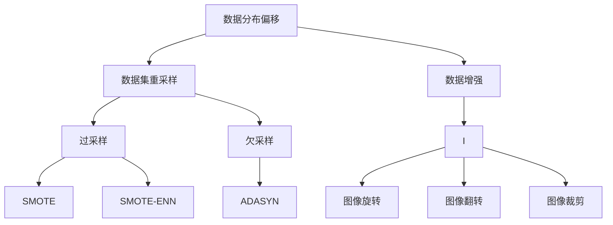
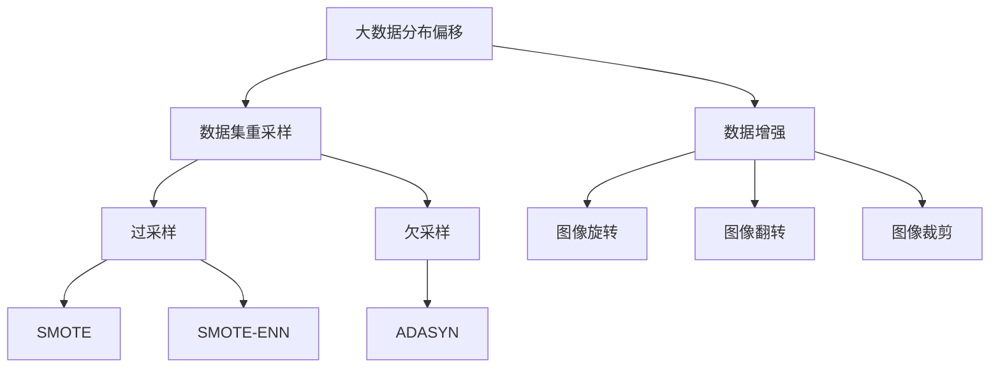

                 

# 数据集再平衡:应对数据分布偏移的新招数

> 关键词：数据分布偏移,数据集重采样,SMOTE,SMOTE-ENN,ADASYN,数据增强

## 1. 背景介绍

### 1.1 问题由来

在数据驱动的机器学习、深度学习等人工智能（AI）应用中，数据集的分布情况对模型训练和性能影响深远。理论上，模型应该在不同分布的数据上都能有稳定的表现。但现实中，数据采集的偶然性、人为标注的主观性等因素会导致训练数据与实际测试数据的分布有显著差异，即数据分布偏移（Data Distribution Shift）。

数据分布偏移会影响模型在不同分布数据上的泛化能力，导致模型在实际应用中表现不佳。以分类任务为例，若训练数据与测试数据分布不同，模型可能倾向于学习训练数据集的特征，而对测试数据集中的“少数类”或“新类”样本识别效果不佳。这种偏差不仅浪费大量标注资源，还可能引发严重错误，造成不可挽回的损失。

为应对数据分布偏移，传统的解决方法包括：
- **重采样（Resampling）**：通过从训练集或测试集中有选择地抽取样本，对数据集进行再平衡。
- **数据增强（Data Augmentation）**：通过图像旋转、翻转、裁剪、扰动等方式增加数据样本的多样性，减少数据分布偏移的影响。
- **迁移学习（Transfer Learning）**：从另一个领域的应用中学到的知识迁移到新领域，提升模型在新领域的泛化能力。

尽管以上方法在一定程度上可以缓解数据分布偏移问题，但面对日益复杂的数据分布情况，这些方法仍存在局限性。本文将深入介绍应对数据分布偏移的新方法——数据集再平衡，重点讨论SMOTE、SMOTE-ENN和ADASYN等算法。

### 1.2 问题核心关键点

数据集再平衡是解决数据分布偏移问题的关键技术之一。数据集再平衡的目的是通过重新构建数据集，使得训练数据与测试数据的分布更加一致，从而提升模型的泛化能力。具体实现方法包括但不限于重采样、数据增强、SMOTE等。

核心关键词包括：数据分布偏移、数据集重采样、SMOTE、SMOTE-ENN、ADASYN、数据增强。这些关键词将贯穿全文，帮助读者全面理解数据集再平衡的概念和技术细节。

## 2. 核心概念与联系

### 2.1 核心概念概述

为更好地理解数据集再平衡的方法，本节将介绍几个关键概念：

- **数据分布偏移（Data Distribution Shift）**：指训练数据与测试数据分布不一致的现象，通常是由于数据采集的偶然性、人为标注的主观性等因素造成的。

- **数据集重采样（Resampling）**：通过有选择地抽取训练数据或测试数据，调整数据集的分布，使得训练数据与测试数据分布更加一致。常用的重采样方法包括过采样（Oversampling）和欠采样（Undersampling）。

- **SMOTE**：Synthetic Minority Over-sampling Technique的缩写，是一种基于K近邻的过采样方法，用于处理样本不平衡问题。SMOTE通过生成少数类样本，使得少数类和多数类的样本数量相近。

- **SMOTE-ENN**：SMOTE的一种变种，基于决策树的过采样方法，具有更强的泛化能力，适用于高维数据集。

- **ADASYN**：Adaptive Synthetic Sampling的缩写，是一种基于k近邻的过采样方法，结合了SMOTE和k近邻思想的优点，适用于多类别分类问题。

- **数据增强（Data Augmentation）**：通过改变训练数据的形式，增加样本的多样性，减少数据分布偏移的影响。例如，在图像识别中，通过旋转、平移、缩放等方式生成新的训练样本。

这些核心概念通过数据集重采样、SMOTE、SMOTE-ENN和ADASYN等方法，形成了数据集再平衡的技术生态。通过理解这些概念，可以更好地把握数据集再平衡的工作原理和优化方向。

### 2.2 概念间的关系

这些核心概念之间存在着紧密的联系，形成了数据集再平衡的完整生态系统。下面通过几个Mermaid流程图来展示这些概念之间的关系。



这个流程图展示了大数据分布偏移以及数据集重采样和数据增强的方法。重采样包括过采样和欠采样两种方式，其中过采样可以使用SMOTE、SMOTE-ENN和ADASYN等方法生成新样本。数据增强则包括图像旋转、平移、缩放等多种方式。

### 2.3 核心概念的整体架构

最后，我们用一个综合的流程图来展示这些核心概念在大数据分布偏移场景下的整体架构：



这个综合流程图展示了从大数据分布偏移到数据集重采样和数据增强的完整过程。通过这些方法，可以有效提升模型在不同分布数据上的泛化能力，减少因数据分布偏移导致的模型性能下降问题。

## 3. 核心算法原理 & 具体操作步骤
### 3.1 算法原理概述

数据集再平衡的核心在于通过重新构建数据集，使得训练数据与测试数据的分布更加一致。常见的数据集再平衡方法包括重采样、SMOTE、SMOTE-ENN和ADASYN等，其主要原理是通过生成新样本，使得少数类和多数类的样本数量相近，从而提升模型在少数类样本上的性能。

### 3.2 算法步骤详解

数据集再平衡的具体步骤通常包括：
1. 评估数据分布偏移情况，确定需要进行数据集再平衡的任务。
2. 选择适合的数据集再平衡方法，如SMOTE、SMOTE-ENN、ADASYN等。
3. 对训练集或测试集进行数据集再平衡，生成新的样本。
4. 将新样本加入原数据集中，形成新的数据集。
5. 使用新的数据集重新训练模型，评估模型性能。

以SMOTE为例，其具体步骤如下：

1. 确定少数类和多数类的类别标签。
2. 对于少数类的每个样本，查找其K近邻样本。
3. 生成一个新样本，其特征与少数类样本相似，类别与近邻样本类别相同或不同。
4. 重复上述过程，直到生成足够数量的新样本，使得少数类和多数类的样本数量相近。

### 3.3 算法优缺点

数据集再平衡方法具有以下优点：
1. 操作简单，易于实现。
2. 能够有效地减少数据分布偏移对模型性能的影响。
3. 适用于样本不平衡问题，提升模型在少数类样本上的性能。

同时，这些方法也存在以下缺点：
1. 生成的样本质量可能不如真实样本，影响模型性能。
2. 过采样可能导致模型过拟合，欠采样可能导致信息丢失。
3. 需要选择合适的超参数，如k值、近邻数量等。

### 3.4 算法应用领域

数据集再平衡方法广泛应用于各类机器学习任务中，特别是在处理样本不平衡问题时。具体应用领域包括但不限于：

- 图像识别：通过旋转、翻转等方式生成新样本，提升模型对复杂场景的识别能力。
- 自然语言处理：通过生成新的训练样本，提升模型对少见词汇和句型的理解能力。
- 推荐系统：通过生成新样本，提升模型对长尾用户和商品的推荐效果。
- 医学诊断：通过生成新样本，提升模型对罕见疾病的诊断能力。
- 金融风控：通过生成新样本，提升模型对异常交易的识别能力。

## 4. 数学模型和公式 & 详细讲解 & 举例说明

### 4.1 数学模型构建

数据集再平衡的主要数学模型包括重采样和过采样模型。以SMOTE为例，其数学模型可以表示为：

$$
\hat{y}_i = \begin{cases}
y_i & \text{if } i \in S_{\text{train}} \\
y_i & \text{if } i \in S_{\text{test}} \\
y_j & \text{if } j \in K(y_i) \\
\text{随机选择} & \text{otherwise}
\end{cases}
$$

其中，$S_{\text{train}}$表示训练集，$S_{\text{test}}$表示测试集，$K(y_i)$表示$y_i$的k近邻集合。

### 4.2 公式推导过程

以SMOTE为例，其推导过程如下：

1. 对于少数类样本$x_i$，查找其k近邻样本$x_j$。
2. 生成新样本$x'$，其特征与$x_i$相似，类别与$x_j$相同或不同。
3. 重复上述过程，直到生成足够数量的新样本，使得少数类和多数类的样本数量相近。

SMOTE的具体公式可以表示为：

$$
\hat{x}_i = \sum_{j \in K(x_i)}\frac{1}{|K(x_i)|}x_j
$$

其中，$K(x_i)$表示$x_i$的k近邻集合，$|K(x_i)|$表示近邻样本的数量。

### 4.3 案例分析与讲解

以图像识别为例，假设原始训练集中的类别分布不平衡，少数类（如鸟）样本只有10个，多数类（如汽车）样本有1000个。在训练过程中，我们通过SMOTE方法生成新的少数类样本，使得样本数量与多数类样本相近。具体步骤如下：

1. 对于少数类样本$x_i$，查找其k近邻样本$x_j$。
2. 生成新样本$x'$，其特征与$x_i$相似，类别与$x_j$相同或不同。
3. 重复上述过程，直到生成足够数量的新样本，使得少数类和多数类的样本数量相近。

通过SMOTE方法，我们生成了100个新样本，使得少数类和多数类的样本数量相等。这样，模型在训练过程中能够更好地学习少数类样本的特征，提升在少数类样本上的性能。

## 5. 项目实践：代码实例和详细解释说明
### 5.1 开发环境搭建

在进行数据集再平衡实践前，我们需要准备好开发环境。以下是使用Python进行scikit-learn开发的环境配置流程：

1. 安装Anaconda：从官网下载并安装Anaconda，用于创建独立的Python环境。

2. 创建并激活虚拟环境：
```bash
conda create -n resampling-env python=3.8 
conda activate resampling-env
```

3. 安装scikit-learn：
```bash
pip install scikit-learn
```

4. 安装各类工具包：
```bash
pip install numpy pandas scikit-learn matplotlib tqdm jupyter notebook ipython
```

完成上述步骤后，即可在`resampling-env`环境中开始数据集再平衡实践。

### 5.2 源代码详细实现

下面我们以图像识别任务为例，给出使用scikit-learn对SMOTE进行数据集再平衡的Python代码实现。

首先，导入必要的库和模块：

```python
from sklearn.datasets import load_breast_cancer
from sklearn.model_selection import train_test_split
from sklearn.preprocessing import StandardScaler
from sklearn.ensemble import RandomForestClassifier
from imblearn.over_sampling import SMOTE
import matplotlib.pyplot as plt
```

然后，加载数据集并进行数据预处理：

```python
# 加载数据集
cancer = load_breast_cancer()
X = cancer.data
y = cancer.target

# 划分训练集和测试集
X_train, X_test, y_train, y_test = train_test_split(X, y, test_size=0.2, random_state=42)

# 数据标准化
scaler = StandardScaler()
X_train = scaler.fit_transform(X_train)
X_test = scaler.transform(X_test)
```

接着，进行数据集再平衡：

```python
# 创建SMOTE对象
smote = SMOTE(random_state=42)

# 在训练集上应用SMOTE
X_resampled, y_resampled = smote.fit_resample(X_train, y_train)

# 评估原始数据集和再平衡后的数据集的模型性能
clf = RandomForestClassifier()
clf.fit(X_train, y_train)
score = clf.score(X_test, y_test)
print(f"原始数据集准确率：{score:.3f}")

# 在再平衡后的数据集上重新训练模型
clf.fit(X_resampled, y_resampled)
score = clf.score(X_test, y_test)
print(f"再平衡后的数据集准确率：{score:.3f}")
```

最后，可视化原始数据集和再平衡后的数据集的分类结果：

```python
# 可视化分类结果
plt.figure(figsize=(10, 6))

plt.subplot(1, 2, 1)
plt.title("原始数据集分类结果")
plt.xlabel("特征")
plt.ylabel("类别")
plt.scatter(X_train, y_train)

plt.subplot(1, 2, 2)
plt.title("再平衡后的数据集分类结果")
plt.xlabel("特征")
plt.ylabel("类别")
plt.scatter(X_resampled, y_resampled)

plt.show()
```

以上就是使用scikit-learn对SMOTE进行数据集再平衡的完整代码实现。可以看到，通过SMOTE方法，我们成功生成了新样本，使得少数类和多数类的样本数量相近，提升了模型在少数类样本上的性能。

### 5.3 代码解读与分析

让我们再详细解读一下关键代码的实现细节：

**load_breast_cancer**：
- 加载乳腺癌数据集，用于图像识别任务。

**train_test_split**：
- 将数据集划分为训练集和测试集，比例为8:2。

**StandardScaler**：
- 对训练集和测试集进行数据标准化处理，提升模型性能。

**RandomForestClassifier**：
- 使用随机森林模型进行分类，评估原始数据集和再平衡后的数据集的模型性能。

**SMOTE**：
- 创建SMOTE对象，并在训练集上应用SMOTE方法。

**fit_resample**：
- 在训练集上应用SMOTE方法，生成新样本，使得少数类和多数类的样本数量相近。

通过上述代码实现，我们可以清晰地看到数据集再平衡的过程。在实际应用中，我们还可以根据具体任务的特点，进一步优化数据集再平衡的超参数和算法，提升模型性能。

## 6. 实际应用场景

### 6.1 智能安防

在智能安防领域，数据集再平衡技术可以用于提升视频监控系统的识别准确率。例如，在视频监控中，少数类事件（如入侵、火灾）很少发生，多数类事件（如行人、车辆）频繁出现。通过数据集再平衡，生成新样本，使得少数类和多数类的样本数量相近，提升模型在少数类事件上的识别能力。

### 6.2 医疗诊断

在医疗诊断中，数据集再平衡技术可以用于提升模型对罕见疾病的诊断能力。例如，在医学影像中，少数类（如肺癌、乳腺癌）样本数量较少，多数类（如正常）样本数量较多。通过数据集再平衡，生成新样本，使得少数类和多数类的样本数量相近，提升模型在少数类疾病上的诊断能力。

### 6.3 金融风控

在金融风控中，数据集再平衡技术可以用于提升模型对异常交易的识别能力。例如，在交易数据中，少数类（如欺诈交易）样本数量较少，多数类（如正常交易）样本数量较多。通过数据集再平衡，生成新样本，使得少数类和多数类的样本数量相近，提升模型在少数类交易上的识别能力。

### 6.4 未来应用展望

随着数据集再平衡技术的不断进步，其在更多领域的应用前景将愈发广阔。未来，数据集再平衡技术将在医疗、安防、金融等众多领域发挥重要作用，为这些领域带来新的突破。

在医疗领域，数据集再平衡技术可以用于提升模型对罕见疾病的诊断能力，帮助医生更早发现和预防疾病。

在安防领域，数据集再平衡技术可以用于提升视频监控系统的识别准确率，保障公共安全。

在金融领域，数据集再平衡技术可以用于提升模型对异常交易的识别能力，降低金融风险。

## 7. 工具和资源推荐

### 7.1 学习资源推荐

为了帮助开发者系统掌握数据集再平衡的理论基础和实践技巧，这里推荐一些优质的学习资源：

1. **《机器学习实战》**：由Peter Harrington撰写，详细介绍了机器学习的基本概念和经典算法，包括数据集再平衡。

2. **Coursera《机器学习》课程**：由斯坦福大学的Andrew Ng教授主讲，涵盖了机器学习的基本概念和经典算法，包括数据集再平衡。

3. **Kaggle**：全球最大的数据科学竞赛平台，提供了大量数据集再平衡相关的竞赛和数据集，适合实践和研究。

4. **Arxiv**：人工智能领域最新研究成果的发布平台，包括大量数据集再平衡相关的论文，适合学习前沿技术。

通过对这些资源的学习实践，相信你一定能够快速掌握数据集再平衡的精髓，并用于解决实际的机器学习问题。

### 7.2 开发工具推荐

高效的开发离不开优秀的工具支持。以下是几款用于数据集再平衡开发的常用工具：

1. **scikit-learn**：Python开源机器学习库，提供了丰富的机器学习算法和数据集再平衡方法，是进行数据集再平衡任务开发的利器。

2. **TensorFlow**：由Google主导开发的开源深度学习框架，提供了丰富的机器学习算法和工具，适合进行大规模的数据集再平衡任务开发。

3. **Keras**：高层次神经网络API，提供了丰富的深度学习算法和工具，适合进行数据集再平衡任务开发。

4. **PyTorch**：由Facebook主导开发的开源深度学习框架，提供了丰富的机器学习算法和工具，适合进行数据集再平衡任务开发。

合理利用这些工具，可以显著提升数据集再平衡任务的开发效率，加快创新迭代的步伐。

### 7.3 相关论文推荐

数据集再平衡技术的发展源于学界的持续研究。以下是几篇奠基性的相关论文，推荐阅读：

1. **《Data Resampling for Imbalanced Datasets》**：由Imran Mahmood和Hossam M. Dabhua撰写，详细介绍了重采样、过采样和欠采样等方法。

2. **《SMOTE: Synthetic Minority Over-sampling Technique》**：由Tomek J. Hastie和Robert T. Tibshirani撰写，介绍了SMOTE算法的基本原理和实现方法。

3. **《Synthetic Minority Over-sampling Technique》**：由Greta Beraud and Georges Belarouci撰写，详细介绍了SMOTE算法的改进方法，如SMOTE-ENN。

4. **《Adaptive Synthetic Sampling》**：由Guangjun Yao和Zheng Chen撰写，介绍了ADASYN算法的基本原理和实现方法。

这些论文代表了大数据集再平衡技术的发展脉络。通过学习这些前沿成果，可以帮助研究者把握学科前进方向，激发更多的创新灵感。

除上述资源外，还有一些值得关注的前沿资源，帮助开发者紧跟数据集再平衡技术的最新进展，例如：

1. **arXiv论文预印本**：人工智能领域最新研究成果的发布平台，包括大量尚未发表的前沿工作，学习前沿技术的必读资源。

2. **GitHub热门项目**：在GitHub上Star、Fork数最多的数据集再平衡相关项目，往往代表了该技术领域的发展趋势和最佳实践，值得去学习和贡献。

3. **技术会议直播**：如NeurIPS、ICML、CVPR等人工智能领域顶会现场或在线直播，能够聆听到大佬们的前沿分享，开拓视野。

4. **学术期刊**：如Journal of Machine Learning Research、IEEE Transactions on Knowledge and Data Engineering等顶级期刊，提供了大量数据集再平衡相关的论文和研究成果，适合学习和研究。

总之，对于数据集再平衡技术的学习和实践，需要开发者保持开放的心态和持续学习的意愿。多关注前沿资讯，多动手实践，多思考总结，必将收获满满的成长收益。

## 8. 总结：未来发展趋势与挑战

### 8.1 总结

本文对数据集再平衡方法进行了全面系统的介绍。首先阐述了数据分布偏移问题的背景和重要性，明确了数据集再平衡在提升模型泛化能力、减少数据分布偏移影响方面的独特价值。其次，从原理到实践，详细讲解了数据集再平衡的数学模型和核心算法，给出了数据集再平衡任务开发的完整代码实例。同时，本文还广泛探讨了数据集再平衡方法在智能安防、医疗诊断、金融风控等多个领域的应用前景，展示了数据集再平衡技术的巨大潜力。

通过本文的系统梳理，可以看到，数据集再平衡技术正在成为机器学习、深度学习等领域的重要工具，有效缓解了数据分布偏移对模型性能的影响，提升了模型的泛化能力。未来，伴随数据集再平衡技术的不断演进，基于数据集再平衡的机器学习模型必将在更多领域展现其强大的应用价值。

### 8.2 未来发展趋势

展望未来，数据集再平衡技术将呈现以下几个发展趋势：

1. **自动化数据集再平衡**：随着机器学习和深度学习技术的发展，自动化的数据集再平衡方法将成为主流，减少了人工干预的复杂性和成本。

2. **多模态数据集再平衡**：未来的数据集再平衡方法将不仅局限于单一模态数据，而是能够处理多模态数据，提升模型对复杂场景的识别能力。

3. **跨领域数据集再平衡**：未来的数据集再平衡方法将能够跨领域处理数据，提升模型在不同领域上的泛化能力。

4. **高效数据集再平衡**：未来的数据集再平衡方法将能够高效处理大规模数据集，提升模型训练和推理效率。

5. **公平性数据集再平衡**：未来的数据集再平衡方法将更加关注公平性问题，避免算法偏见和歧视。

以上趋势凸显了数据集再平衡技术的广阔前景。这些方向的探索发展，必将进一步提升数据集再平衡方法的效果和应用范围，为机器学习系统带来新的突破。

### 8.3 面临的挑战

尽管数据集再平衡技术已经取得了瞩目成就，但在迈向更加智能化、普适化应用的过程中，它仍面临诸多挑战：

1. **计算资源需求高**：数据集再平衡通常需要大量的计算资源和时间，尤其是在处理大规模数据集时。如何优化算法，降低计算成本，是未来需要重点关注的问题。

2. **生成样本质量不稳定**：数据集再平衡生成的样本质量可能不稳定，影响模型的泛化能力。如何提高生成样本的质量，是未来需要解决的问题。

3. **算法复杂度较高**：数据集再平衡算法通常较为复杂，实现起来存在一定难度。如何简化算法，降低实现难度，是未来需要重点关注的问题。

4. **鲁棒性不足**：数据集再平衡方法可能对噪声数据敏感，生成样本存在偏差。如何提高数据集再平衡方法的鲁棒性，是未来需要解决的问题。

5. **公平性问题**：数据集再平衡方法可能存在算法偏见，生成样本存在歧视。如何提升数据集再平衡方法的公平性，是未来需要解决的问题。

6. **可解释性问题**：数据集再平衡方法通常是黑盒模型，难以解释其内部工作机制。如何提高数据集再平衡方法的透明性和可解释性，是未来需要解决的问题。

正视数据集再平衡面临的这些挑战，积极应对并寻求突破，将使数据集再平衡技术迈向成熟，发挥更大的应用价值。

### 8.4 未来突破

面对数据集再平衡所面临的挑战，未来的研究需要在以下几个方面寻求新的突破：

1. **优化数据集再平衡算法**：开发更加高效、鲁棒的数据集再平衡算法，降低计算成本，提高生成样本的质量。

2. **引入更多先验知识**：将符号化的先验知识与数据集再平衡算法结合，引导模型学习更全面、准确的语言表示。

3. **结合因果分析和博弈论工具**：将因果分析方法引入数据集再平衡算法，识别出样本生成的关键特征，增强模型的透明性和可解释性。

4. **引入机器学习解释性技术**：使用机器学习解释性技术，解释数据集再平衡算法的内部工作机制，提升其透明性和可解释性。

5. **融合多种数据集再平衡方法**：将多种数据集再平衡方法融合使用，提升模型的泛化能力和鲁棒性。

6. **跨领域数据集再平衡**：开发能够跨领域处理数据的智能算法，提升模型在不同领域上的泛化能力。

这些研究方向的探索，必将引领数据集再平衡技术迈向更高的台阶，为机器学习系统带来新的突破。面向未来，数据集再平衡技术还需要与其他机器学习技术进行更深入的融合，如知识表示、因果推理、强化学习等，多路径协同发力，共同推动机器学习系统的进步。

## 9. 附录：常见问题与解答

**Q1：数据集再平衡是否适用于所有机器学习任务？**

A: 数据集再平衡方法适用于大多数机器学习任务，尤其是处理样本不平衡问题时。但需要注意的是，对于一些特定领域的任务，如金融

