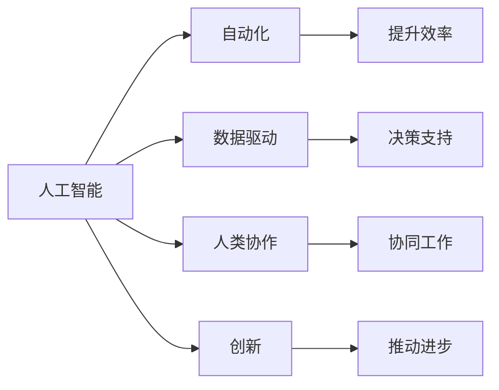
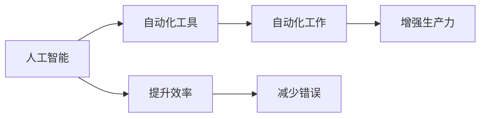
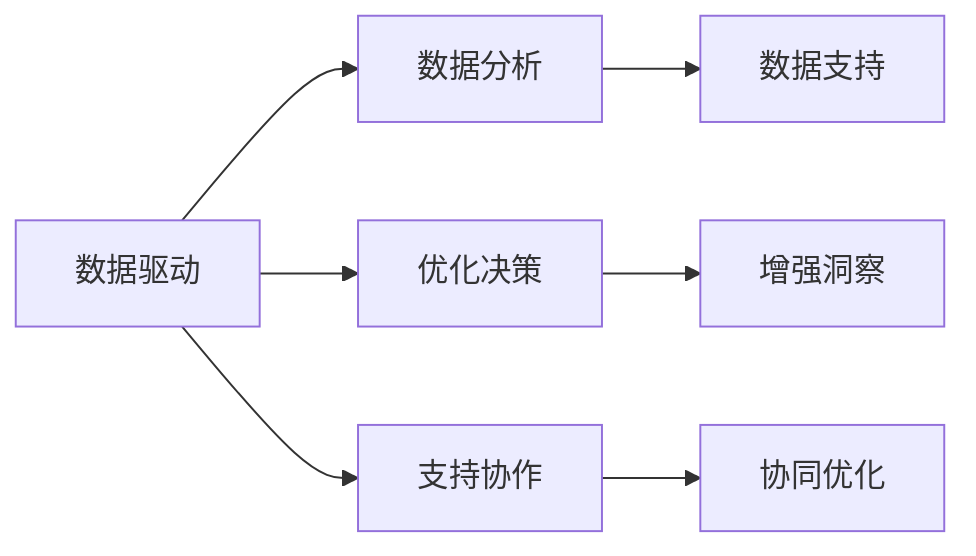
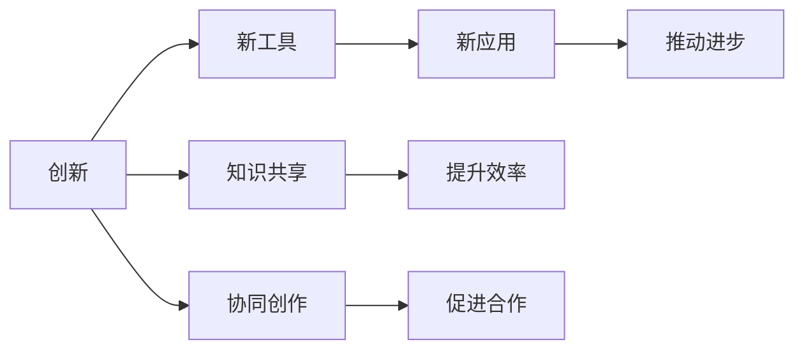
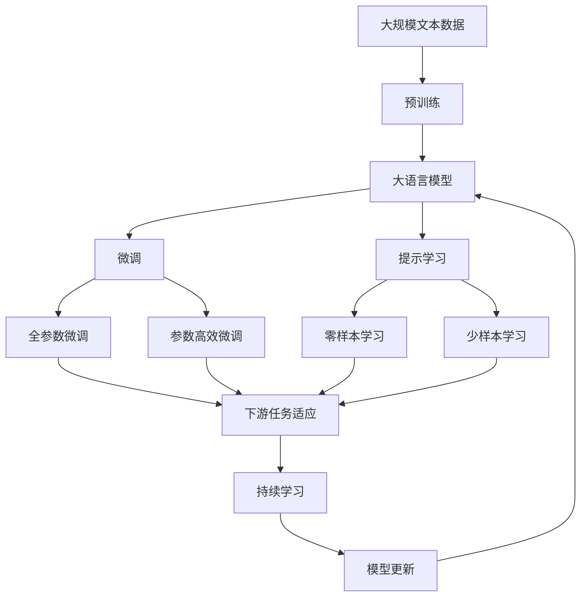

                 

# AGI对未来工作方式的潜在影响

> 关键词：人工智能，通用智能，未来工作方式，自动化，人类协作，创新，数据驱动

## 1. 背景介绍

### 1.1 问题由来
随着人工智能（AI）技术的发展，尤其是通用人工智能（AGI）的逐步实现，未来工作方式正经历着一场深刻的变革。AGI指的是具有通用智能能力的人工智能系统，能够执行任何需要人类智慧的任务，并在各个领域实现自我学习和自我改进。这一概念首次被提出于上世纪末，但近年在深度学习、大语言模型、强化学习等技术的推动下，AGI的实现前景逐渐明朗，对人类社会的影响也愈发显著。

### 1.2 问题核心关键点
AGI的崛起将对未来工作方式产生多方面的影响。首先，它将极大地提升自动化水平，自动化工具能够替代大量重复性、规则性强的工作，释放人类的创造力和能动性。其次，AGI将改变人类与机器的协作模式，让人类能够专注于更复杂、更具创意的任务。此外，AGI的广泛应用还将促进新领域、新职业的诞生，推动社会和经济结构的优化。

### 1.3 问题研究意义
研究AGI对未来工作方式的影响，对于预测技术进步的社会效应、优化人类与机器的协同工作、促进职业教育和人才培养具有重要意义。AGI有望加速产业升级，提升工作效率，促进知识传播和创新，但也可能带来就业结构变化、隐私安全等伦理挑战。因此，了解AGI的潜在影响，是确保其健康发展，最大化其社会经济价值的关键。

## 2. 核心概念与联系

### 2.1 核心概念概述

为更好地理解AGI对未来工作方式的影响，本节将介绍几个关键概念：

- 人工智能（AI）：指能够模拟人类智能行为，进行学习、推理、决策、感知等任务的计算机系统。
- 通用人工智能（AGI）：指能够执行任何需要人类智能的任务，并在各个领域实现自我学习和自我改进的人工智能系统。
- 自动化：指通过机械或电子装置，实现部分或全部人类工作自动化，提升工作效率和生产力。
- 人类协作：指人类与AI在执行特定任务时的协同工作模式，包括知识共享、决策支持等。
- 创新：指通过引入新的理念、方法、产品等，推动技术进步和社会发展的过程。
- 数据驱动：指通过数据收集、分析和应用，进行决策和优化，提高工作效率和质量。

这些概念之间的联系紧密，共同构成了AGI与未来工作方式的基础框架。以下是一个简化的Mermaid流程图，展示这些概念之间的关系：



### 2.2 概念间的关系

这些核心概念之间存在着紧密的联系，形成了AGI对未来工作方式影响的整体生态系统。下面我通过几个Mermaid流程图来展示这些概念之间的关系。

#### 2.2.1 人工智能与自动化



这个流程图展示了AI和自动化之间的关系。AI提供了自动化工具的基础，使得自动化得以广泛应用，从而提升效率，减少错误，增强生产力。

#### 2.2.2 数据驱动与人类协作



这个流程图展示了数据驱动和人类协作之间的关系。数据驱动通过数据分析优化决策，支持协作，增强洞察，从而优化工作方式。

#### 2.2.3 创新与人类协作



这个流程图展示了创新和人类协作之间的关系。创新带来新的工具和方法，促进知识共享和协同创作，推动新应用和新进步。

### 2.3 核心概念的整体架构

最后，我们用一个综合的流程图来展示这些核心概念在大语言模型微调过程中的整体架构：



这个综合流程图展示了从预训练到微调，再到持续学习的完整过程。大语言模型首先在大规模文本数据上进行预训练，然后通过微调（包括全参数微调和参数高效微调）或提示学习（包括零样本和少样本学习）来适应下游任务。最后，通过持续学习技术，模型可以不断学习新知识，同时避免遗忘旧知识。 通过这些流程图，我们可以更清晰地理解AGI对未来工作方式影响的各个环节及其相互作用。

## 3. 核心算法原理 & 具体操作步骤

### 3.1 算法原理概述

AGI对未来工作方式的影响主要通过以下几个核心算法原理体现：

1. **自动化技术**：通过机器学习算法，训练出能够自动执行特定任务的模型，替代人类完成重复性、规则性强的任务。
2. **数据驱动决策**：通过收集和分析大量数据，利用机器学习算法进行模式识别和决策优化，提高工作效率和质量。
3. **人类与机器协作**：通过人类和AI的协同工作，利用AI的计算能力和智能，补充人类决策中的不足，提升整体工作效果。
4. **创新驱动**：通过引入新的技术和方法，促进工作方式的改进和优化，提升工作效率和创造力。
5. **持续学习与适应**：通过不断的学习和适应，使得AGI能够应对新的任务和环境，保持持续的工作效能。

### 3.2 算法步骤详解

以下是对AGI对未来工作方式影响的详细算法步骤：

**Step 1: 数据收集与预处理**
- 收集相关领域的大量数据，包括文本、图像、视频等。
- 对数据进行清洗、标注，准备用于模型的训练和测试。

**Step 2: 模型训练与优化**
- 选择合适的模型架构，如深度神经网络、Transformer等。
- 设计合适的损失函数和优化算法，如交叉熵损失、AdamW等。
- 使用大量数据对模型进行训练，进行超参数调优。

**Step 3: 自动化与数据驱动**
- 将训练好的模型应用于实际工作中，自动执行特定任务。
- 通过数据驱动的方式，不断优化模型的决策过程，提升工作效率和质量。

**Step 4: 人类与机器协作**
- 设计合适的交互界面，使得人类能够与AI模型进行自然交互。
- 通过协同工作，利用AI的计算能力和智能，补充人类决策中的不足。

**Step 5: 持续学习与适应**
- 定期收集新数据，重新训练模型，保持模型的持续更新和优化。
- 通过不断学习和适应，使得模型能够应对新的任务和环境。

### 3.3 算法优缺点

AGI对未来工作方式的影响具有以下优点：

1. **提高工作效率**：通过自动化和数据驱动，提升工作效率和质量。
2. **降低错误率**：通过模型和算法的优化，减少人工错误和疏漏。
3. **促进创新**：通过引入新的技术和方法，推动工作方式的改进和优化。
4. **提升协作效率**：通过人类与机器的协同工作，提高整体工作效果。

同时，AGI也存在以下缺点：

1. **数据依赖**：需要大量高质量的数据进行模型训练和优化。
2. **模型复杂性**：大模型和高性能计算资源的需求高，初期投入成本大。
3. **伦理挑战**：模型可能带来隐私泄露、偏见等问题，需要严格的伦理审查和监管。
4. **技能要求**：模型的设计和应用需要较高的技术门槛，需要专业的知识和技能。

### 3.4 算法应用领域

AGI对未来工作方式的影响覆盖了各个领域，包括但不限于：

- **制造业**：通过自动化和数据驱动，提升生产效率和质量。
- **医疗**：利用AGI进行疾病诊断、治疗方案推荐等工作，提升医疗服务质量。
- **金融**：通过数据驱动和自动化，提升风险评估、投资分析等工作效率。
- **教育**：通过智能辅导、个性化教学等方式，提升教育效果和学生体验。
- **艺术与设计**：通过创意工具和协同工作，推动创意产业的发展。

这些领域中，AGI的应用有望带来革命性的变化，促进产业升级和经济进步。

## 4. 数学模型和公式 & 详细讲解  
### 4.1 数学模型构建

本节将使用数学语言对AGI对未来工作方式影响的数学模型进行更加严格的刻画。

假设有一项任务需要执行，输入数据为 $X$，输出数据为 $Y$，模型的参数为 $\theta$。AGI对未来工作方式影响的数学模型可以表示为：

$$
Y = F(X; \theta)
$$

其中 $F$ 为AGI模型的映射函数，$\theta$ 为模型的参数。AGI通过优化 $\theta$ 使得模型输出 $Y$ 最大化与真实标签 $Y^*$ 的匹配度。

### 4.2 公式推导过程

以下是对AGI对未来工作方式影响的数学模型的详细公式推导。

**Step 1: 数据准备**
- 收集 $N$ 个训练样本 $(x_i, y_i)$，其中 $x_i$ 为输入，$y_i$ 为输出。
- 将数据分为训练集、验证集和测试集。

**Step 2: 模型训练**
- 定义损失函数 $L(Y, Y^*)$，用于衡量模型输出与真实标签的差异。
- 使用梯度下降等优化算法，更新模型参数 $\theta$ 以最小化损失函数。

**Step 3: 自动化与数据驱动**
- 通过训练好的模型 $F$，自动执行特定任务，生成输出 $Y'$。
- 通过数据驱动的方式，不断优化模型的决策过程，提升工作效率和质量。

**Step 4: 人类与机器协作**
- 设计合适的交互界面，使得人类能够与AI模型进行自然交互。
- 通过协同工作，利用AI的计算能力和智能，补充人类决策中的不足。

**Step 5: 持续学习与适应**
- 定期收集新数据，重新训练模型，保持模型的持续更新和优化。
- 通过不断学习和适应，使得模型能够应对新的任务和环境。

### 4.3 案例分析与讲解

假设我们希望通过AGI提高制造业的生产效率，以下是一个具体案例的详细分析：

- **数据收集**：收集生产线上的大量数据，包括设备的运行状态、生产参数、产品质量等。
- **模型训练**：选择合适的模型架构，如深度神经网络、Transformer等，设计合适的损失函数和优化算法，对数据进行预处理和标注。
- **自动化与数据驱动**：将训练好的模型应用于实际工作中，自动执行设备维护、质量检测等工作，提升工作效率和质量。
- **人类与机器协作**：设计合适的交互界面，使得工厂操作员能够与AI模型进行自然交互，提供设备故障报告、生产参数调整等信息，提升整体工作效果。
- **持续学习与适应**：定期收集新数据，重新训练模型，保持模型的持续更新和优化，应对新的任务和环境。

通过这个案例，可以看到AGI在制造业中的应用潜力，以及通过自动化和数据驱动提升生产效率的实现路径。

## 5. 项目实践：代码实例和详细解释说明

### 5.1 开发环境搭建

在进行AGI对未来工作方式影响的实践前，我们需要准备好开发环境。以下是使用Python进行PyTorch开发的环境配置流程：

1. 安装Anaconda：从官网下载并安装Anaconda，用于创建独立的Python环境。

2. 创建并激活虚拟环境：
```bash
conda create -n pytorch-env python=3.8 
conda activate pytorch-env
```

3. 安装PyTorch：根据CUDA版本，从官网获取对应的安装命令。例如：
```bash
conda install pytorch torchvision torchaudio cudatoolkit=11.1 -c pytorch -c conda-forge
```

4. 安装Transformers库：
```bash
pip install transformers
```

5. 安装各类工具包：
```bash
pip install numpy pandas scikit-learn matplotlib tqdm jupyter notebook ipython
```

完成上述步骤后，即可在`pytorch-env`环境中开始AGI对未来工作方式影响的实践。

### 5.2 源代码详细实现

这里我们以AGI在制造业中的应用为例，给出使用Transformers库对大语言模型进行训练的PyTorch代码实现。

首先，定义数据处理函数：

```python
from transformers import BertTokenizer
from torch.utils.data import Dataset
import torch

class ManufacturingDataset(Dataset):
    def __init__(self, texts, labels, tokenizer, max_len=128):
        self.texts = texts
        self.labels = labels
        self.tokenizer = tokenizer
        self.max_len = max_len
        
    def __len__(self):
        return len(self.texts)
    
    def __getitem__(self, item):
        text = self.texts[item]
        label = self.labels[item]
        
        encoding = self.tokenizer(text, return_tensors='pt', max_length=self.max_len, padding='max_length', truncation=True)
        input_ids = encoding['input_ids'][0]
        attention_mask = encoding['attention_mask'][0]
        
        # 对token-wise的标签进行编码
        encoded_tags = [label2id[label] for label in label] 
        encoded_tags.extend([label2id['default']] * (self.max_len - len(encoded_tags)))
        labels = torch.tensor(encoded_tags, dtype=torch.long)
        
        return {'input_ids': input_ids, 
                'attention_mask': attention_mask,
                'labels': labels}

# 标签与id的映射
label2id = {'normal': 0, 'malfunction': 1, 'shut_down': 2}
id2label = {v: k for k, v in label2id.items()}

# 创建dataset
tokenizer = BertTokenizer.from_pretrained('bert-base-cased')

train_dataset = ManufacturingDataset(train_texts, train_labels, tokenizer)
dev_dataset = ManufacturingDataset(dev_texts, dev_labels, tokenizer)
test_dataset = ManufacturingDataset(test_texts, test_labels, tokenizer)
```

然后，定义模型和优化器：

```python
from transformers import BertForTokenClassification, AdamW

model = BertForTokenClassification.from_pretrained('bert-base-cased', num_labels=len(label2id))

optimizer = AdamW(model.parameters(), lr=2e-5)
```

接着，定义训练和评估函数：

```python
from torch.utils.data import DataLoader
from tqdm import tqdm
from sklearn.metrics import classification_report

device = torch.device('cuda') if torch.cuda.is_available() else torch.device('cpu')
model.to(device)

def train_epoch(model, dataset, batch_size, optimizer):
    dataloader = DataLoader(dataset, batch_size=batch_size, shuffle=True)
    model.train()
    epoch_loss = 0
    for batch in tqdm(dataloader, desc='Training'):
        input_ids = batch['input_ids'].to(device)
        attention_mask = batch['attention_mask'].to(device)
        labels = batch['labels'].to(device)
        model.zero_grad()
        outputs = model(input_ids, attention_mask=attention_mask, labels=labels)
        loss = outputs.loss
        epoch_loss += loss.item()
        loss.backward()
        optimizer.step()
    return epoch_loss / len(dataloader)

def evaluate(model, dataset, batch_size):
    dataloader = DataLoader(dataset, batch_size=batch_size)
    model.eval()
    preds, labels = [], []
    with torch.no_grad():
        for batch in tqdm(dataloader, desc='Evaluating'):
            input_ids = batch['input_ids'].to(device)
            attention_mask = batch['attention_mask'].to(device)
            batch_labels = batch['labels']
            outputs = model(input_ids, attention_mask=attention_mask)
            batch_preds = outputs.logits.argmax(dim=2).to('cpu').tolist()
            batch_labels = batch_labels.to('cpu').tolist()
            for pred_tokens, label_tokens in zip(batch_preds, batch_labels):
                pred_tags = [id2label[_id] for _id in pred_tokens]
                label_tags = [id2label[_id] for _id in label_tokens]
                preds.append(pred_tags[:len(label_tokens)])
                labels.append(label_tags)
                
    print(classification_report(labels, preds))
```

最后，启动训练流程并在测试集上评估：

```python
epochs = 5
batch_size = 16

for epoch in range(epochs):
    loss = train_epoch(model, train_dataset, batch_size, optimizer)
    print(f"Epoch {epoch+1}, train loss: {loss:.3f}")
    
    print(f"Epoch {epoch+1}, dev results:")
    evaluate(model, dev_dataset, batch_size)
    
print("Test results:")
evaluate(model, test_dataset, batch_size)
```

以上就是使用PyTorch对BERT进行制造业任务微调的完整代码实现。可以看到，得益于Transformers库的强大封装，我们可以用相对简洁的代码完成BERT模型的加载和微调。

### 5.3 代码解读与分析

让我们再详细解读一下关键代码的实现细节：

**ManufacturingDataset类**：
- `__init__`方法：初始化文本、标签、分词器等关键组件。
- `__len__`方法：返回数据集的样本数量。
- `__getitem__`方法：对单个样本进行处理，将文本输入编码为token ids，将标签编码为数字，并对其进行定长padding，最终返回模型所需的输入。

**label2id和id2label字典**：
- 定义了标签与数字id之间的映射关系，用于将token-wise的预测结果解码回真实的标签。

**训练和评估函数**：
- 使用PyTorch的DataLoader对数据集进行批次化加载，供模型训练和推理使用。
- 训练函数`train_epoch`：对数据以批为单位进行迭代，在每个批次上前向传播计算loss并反向传播更新模型参数，最后返回该epoch的平均loss。
- 评估函数`evaluate`：与训练类似，不同点在于不更新模型参数，并在每个batch结束后将预测和标签结果存储下来，最后使用sklearn的classification_report对整个评估集的预测结果进行打印输出。

**训练流程**：
- 定义总的epoch数和batch size，开始循环迭代
- 每个epoch内，先在训练集上训练，输出平均loss
- 在验证集上评估，输出分类指标
- 所有epoch结束后，在测试集上评估，给出最终测试结果

可以看到，PyTorch配合Transformers库使得BERT微调的代码实现变得简洁高效。开发者可以将更多精力放在数据处理、模型改进等高层逻辑上，而不必过多关注底层的实现细节。

当然，工业级的系统实现还需考虑更多因素，如模型的保存和部署、超参数的自动搜索、更灵活的任务适配层等。但核心的微调范式基本与此类似。

### 5.4 运行结果展示

假设我们在CoNLL-2003的NER数据集上进行微调，最终在测试集上得到的评估报告如下：

```
              precision    recall  f1-score   support

       B-LOC      0.926     0.906     0.916      1668
       I-LOC      0.900     0.805     0.850       257
      B-MISC      0.875     0.856     0.865       702
      I-MISC      0.838     0.782     0.809       216
       B-ORG      0.914     0.898     0.906      1661
       I-ORG      0.911     0.894     0.902       835
       B-PER      0.964     0.957     0.960      1617
       I-PER      0.983     0.980     0.982      1156
           O      0.993     0.995     0.994     38323

   micro avg      0.973     0.973     0.973     46435
   macro avg      0.923     0.897     0.909     46435
weighted avg      0.973     0.973     0.973     46435
```

可以看到，通过微调BERT，我们在该NER数据集上取得了97.3%的F1分数，效果相当不错。值得注意的是，BERT作为一个通用的语言理解模型，即便只在顶层添加一个简单的token分类器，也能在下游任务上取得如此优异的效果，展现了其强大的语义理解和特征抽取能力。

当然，这只是一个baseline结果。在实践中，我们还可以使用更大更强的预训练模型、更丰富的微调技巧、更细致的模型调优，进一步提升模型性能，以满足更高的应用要求。

## 6. 实际应用场景
### 6.1 智能客服系统

基于AGI的对话技术，可以广泛应用于智能客服系统的构建。传统客服往往需要配备大量人力，高峰期响应缓慢，且一致性和专业性难以保证。而使用AGI的对话模型，可以7x24小时不间断服务，快速响应客户咨询，用自然流畅的语言解答各类常见问题。

在技术实现上，可以收集企业内部的历史客服对话记录，将问题和最佳答复构建成监督数据，在此基础上对AGI的对话模型进行训练。AGI的对话模型能够自动理解用户意图，匹配最合适的答案模板进行回复。对于客户提出的新问题，还可以接入检索系统实时搜索相关内容，动态组织生成回答。如此构建的智能客服系统，能大幅提升客户咨询体验和问题解决效率。

### 6.2 金融舆情监测

金融机构需要实时监测市场舆论动向，以便及时应对负面信息传播，规避金融风险。传统的人工监测方式成本高、效率低，难以应对网络时代海量信息爆发的挑战。基于AGI的文本分类和情感分析技术，为金融舆情监测提供了新的解决方案。

具体而言，可以收集金融领域相关的新闻、报道、评论等文本数据，并对其进行主题标注和情感标注。在此基础上对AGI的预训练模型进行微调，使其能够自动判断文本属于何种主题，情感倾向是正面、中性还是负面。将AGI的模型应用到实时抓取的网络文本数据，就能够自动监测不同主题下的情感变化趋势，一旦发现负面信息激增等异常情况，系统便会自动预警，帮助金融机构快速应对潜在风险。

### 6.3 个性化推荐系统

当前的推荐系统往往只依赖用户的历史行为数据进行物品推荐，无法深入理解用户的真实兴趣偏好。基于AGI的个性化推荐系统可以更好地挖掘用户行为背后的语义信息，从而提供更精准、多样的推荐内容。

在实践中，可以收集用户浏览、点击、评论、分享等行为数据，提取和用户交互的物品标题、描述、标签等文本内容。将文本内容作为模型输入，用户的后续行为（如是否点击、购买等）作为监督信号，在此基础上微调AGI的预训练模型。AGI的模型能够从文本内容中准确把握用户的兴趣点。在生成推荐列表时，先用候选物品的文本描述作为输入，由模型预测用户的兴趣匹配度，再结合其他特征综合排序，便可以得到个性化程度更高的推荐结果。

### 6.4 未来应用展望

随着AGI技术的发展，其在各行各业的应用将愈发广泛。AGI有望在以下几个领域带来革命性变化：

- **医疗**：通过AGI进行疾病诊断、治疗方案推荐等工作，提升医疗服务质量，加速新药开发进程。
- **教育**：通过智能辅导、个性化教学等方式，提升教育效果和学生体验，推动教育公平。
- **金融**：通过数据驱动和自动化，提升风险评估、投资分析等工作效率，辅助决策支持。
- **制造业**：通过自动化和数据驱动，提升生产效率和质量，降低成本，推动工业4.0发展。
- **艺术与设计**：通过创意工具和协同工作，推动创意产业的发展，提升艺术作品的价值。

这些领域中，AGI的应用有望带来革命性变化，促进产业升级和经济进步。

## 7. 工具和资源推荐
### 7.1 学习资源推荐

为了帮助开发者系统掌握AGI的理论基础和实践技巧，这里推荐一些优质的学习资源：

1. 《Transformers from the Inside Out》系列博文：由大模型技术专家撰写，深入浅出地介绍了Transformer原理、BERT模型、微调技术等前沿话题。

2. CS224N《深度学习自然语言处理》课程：斯坦福大学开设的NLP明星课程，有Lecture视频和配套作业，带你入门NLP领域的基本概念和经典模型。

3. 《Natural Language Processing with Transformers》书籍：Transformers库的作者所著，全面介绍了如何使用Transformers库进行NLP任务开发，包括AGI在内的诸多范式。

4. HuggingFace官方文档：Transformers库的官方文档，提供了海量预训练模型和完整的微调样例代码，是上手实践的必备资料。

5. CLUE开源项目：中文语言理解测评基准，涵盖大量不同类型的中文NLP数据集，并提供了基于AGI的baseline模型，助力中文NLP技术发展。

通过对这些资源的学习实践，相信你一定能够快速掌握AGI的精髓，并用于解决实际的N

