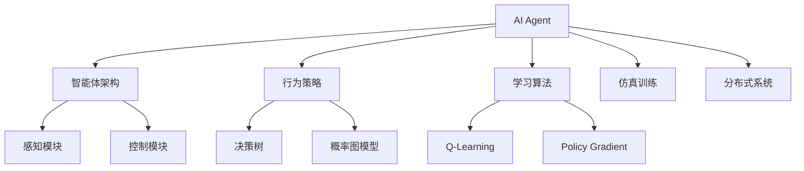
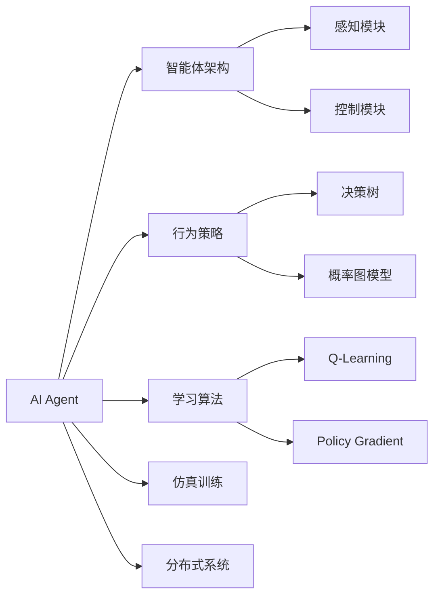
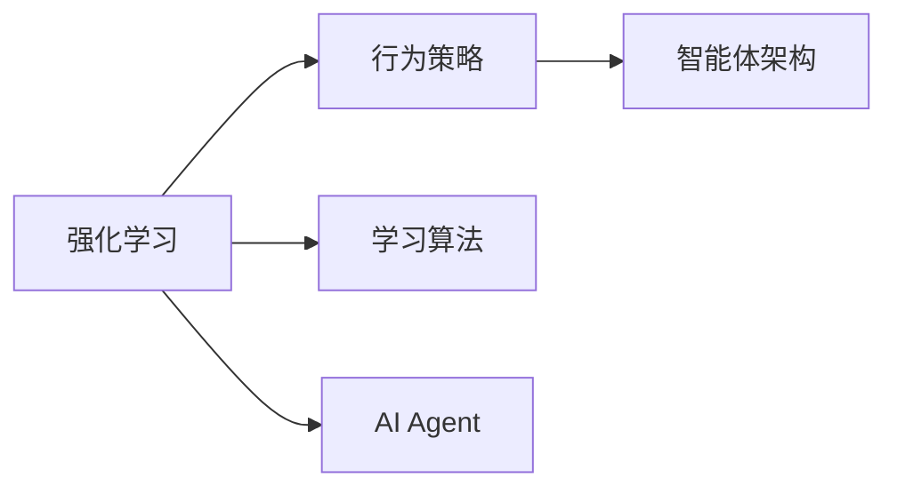
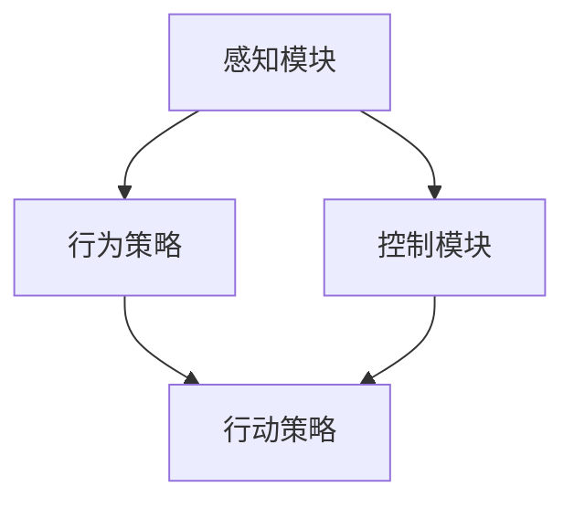
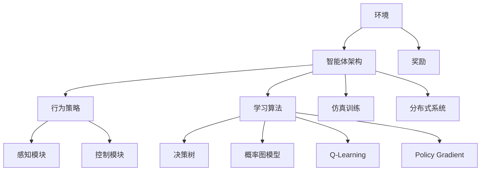

                 

# AI Agent: AI的下一个风口 技术的发展趋势

> 关键词：人工智能,强化学习,智能体,行为设计,仿真训练,分布式系统

## 1. 背景介绍

### 1.1 问题由来
近年来，随着人工智能(AI)技术的飞速发展，AI Agent（智能体）在决策、规划、控制等领域展现了巨大的潜力和应用前景。智能体可以在复杂多变的环境中自主地执行任务，具备自我学习、自我优化和自我适应能力。然而，尽管已经取得诸多突破，AI Agent依然面临诸多挑战，如环境复杂性、智能体行为设计、学习效率、鲁棒性等，这些都严重制约了AI Agent的广泛应用。

AI Agent的发展趋势关系到未来AI技术的演进方向，本文将从技术原理、操作步骤、核心算法、应用场景、未来展望等方面对AI Agent的发展趋势进行全面探讨，以期为AI技术的前沿研究者和实践者提供参考。

### 1.2 问题核心关键点
本研究聚焦于AI Agent的核心问题，包括：
- AI Agent的架构设计：如何构建高效、灵活的智能体架构，使其具备适应多变环境的能力。
- AI Agent的行为设计：如何定义智能体的行为策略，使其在目标导向的框架下进行有效的学习和优化。
- AI Agent的训练方法：如何通过强化学习、迁移学习等技术，使智能体在有限的环境中学习并适应。
- AI Agent的部署应用：如何构建可扩展、可维护的智能体部署平台，使其在实际场景中有效运行。
- AI Agent的未来趋势：基于当前的研究进展，对AI Agent的发展方向进行预测。

## 2. 核心概念与联系

### 2.1 核心概念概述

为更好地理解AI Agent的发展趋势，本节将介绍几个密切相关的核心概念：

- AI Agent（智能体）：能够在多变环境中自主地进行决策、规划、控制等的自主实体。AI Agent通过与环境的交互，不断学习优化自身的行为策略，以达到既定的目标。

- 强化学习（Reinforcement Learning, RL）：一种通过与环境的交互进行学习的方法，智能体在不断尝试中积累经验，优化策略以最大化奖励。

- 智能体架构（Agent Architecture）：定义AI Agent的结构和组件，包括感知模块、行为策略模块、控制模块等。

- 行为策略（Behavior Policy）：定义AI Agent在特定状态下采取行动的策略，包括决策树、概率图模型等。

- 学习算法（Learning Algorithm）：设计AI Agent的学习过程，包括Q-Learning、Policy Gradient等强化学习算法。

- 仿真训练（Simulation Training）：通过构建虚拟环境对AI Agent进行训练，使其在实际部署前对环境进行模拟和评估。

- 分布式系统（Distributed System）：构建可扩展、高可靠的AI Agent部署平台，实现多智能体协同合作。

这些核心概念之间的逻辑关系可以通过以下Mermaid流程图来展示：



这个流程图展示了AI Agent的核心概念及其之间的关系：

1. AI Agent通过智能体架构来组织其内部组件，包括感知、行为策略和控制模块。
2. 行为策略定义了AI Agent在特定状态下采取行动的策略，决策树和概率图模型是其常见形式。
3. 学习算法用于指导AI Agent的学习过程，Q-Learning和Policy Gradient是其核心算法。
4. 仿真训练和分布式系统帮助AI Agent在实际部署前进行模拟和评估，提高其实际应用效果。

### 2.2 概念间的关系

这些核心概念之间存在着紧密的联系，形成了AI Agent的完整生态系统。下面我们通过几个Mermaid流程图来展示这些概念之间的关系。

#### 2.2.1 AI Agent的学习范式



这个流程图展示了AI Agent的三种主要学习范式：智能体架构、行为策略和算法。智能体架构定义了AI Agent的结构和组件，行为策略定义了智能体的行为策略，算法指导了学习过程。

#### 2.2.2 强化学习与AI Agent的关系



这个流程图展示了强化学习与AI Agent的关系。智能体架构是AI Agent的核心组件，行为策略是智能体在环境中的行动策略，算法指导了强化学习过程。

#### 2.2.3 智能体架构的设计



这个流程图展示了智能体架构的设计。感知模块负责获取环境信息，行为策略模块定义智能体的行动策略，控制模块根据策略执行行动。

### 2.3 核心概念的整体架构

最后，我们用一个综合的流程图来展示这些核心概念在大模型微调过程中的整体架构：



这个综合流程图展示了AI Agent的核心概念在大模型微调过程中的整体架构：

1. 环境与智能体架构交互，智能体架构通过感知模块获取环境信息，行为策略模块定义智能体的行动策略，控制模块根据策略执行行动。
2. 学习算法指导智能体的学习过程，包括决策树、概率图模型等。
3. 仿真训练和分布式系统帮助智能体在实际部署前进行模拟和评估，提高其实际应用效果。

通过这些流程图，我们可以更清晰地理解AI Agent的学习过程和组件关系，为后续深入讨论具体的微调方法和技术奠定基础。

## 3. 核心算法原理 & 具体操作步骤
### 3.1 算法原理概述

基于强化学习的AI Agent训练过程，本质上是一个目标导向的学习过程。其核心思想是：通过与环境的交互，智能体在不断尝试中积累经验，优化自身的行为策略，以最大化奖励。

形式化地，假设智能体在环境 $E$ 中进行交互，状态集合为 $S$，动作集合为 $A$，策略为 $\pi$，奖励函数为 $r$，定义智能体的目标为最大化累计奖励 $\sum_{t=0}^T r_t$。则强化学习的目标是通过策略 $\pi$ 使智能体在环境 $E$ 中最大化累计奖励：

$$
\max_{\pi} \mathbb{E}[\sum_{t=0}^T r_t]
$$

具体而言，智能体在每个时间步 $t$ 观察环境状态 $s_t$，根据策略 $\pi$ 采取动作 $a_t$，观察奖励 $r_t$ 和下一个状态 $s_{t+1}$，然后更新策略 $\pi$，重复该过程直至时间结束。

### 3.2 算法步骤详解

基于强化学习的AI Agent训练一般包括以下几个关键步骤：

**Step 1: 准备环境**
- 选择合适的环境 $E$，定义状态集合 $S$、动作集合 $A$ 和奖励函数 $r$。
- 为智能体设计行为策略 $\pi$，可以是基于决策树的策略，也可以是概率图模型的策略。

**Step 2: 初始化参数**
- 初始化智能体模型和策略参数，如神经网络权重、决策树节点等。
- 设定学习率 $\eta$、步长 $n$、折扣因子 $\gamma$ 等参数。

**Step 3: 执行训练**
- 在每个时间步 $t$，智能体观察状态 $s_t$，根据策略 $\pi$ 采取动作 $a_t$。
- 观察奖励 $r_t$ 和下一个状态 $s_{t+1}$，更新智能体的状态和奖励信息。
- 通过策略 $\pi$ 计算新的动作 $a_{t+1}$，并根据策略更新模型参数。
- 重复该过程 $n$ 步，直到训练结束。

**Step 4: 评估与优化**
- 使用仿真环境或实际数据集对智能体进行评估。
- 根据评估结果调整策略 $\pi$，重新训练智能体，直至达到预期性能。

**Step 5: 部署与监控**
- 将训练好的智能体部署到实际应用环境中。
- 实时监控智能体的运行状态和效果，调整策略和参数。

以上是基于强化学习的AI Agent训练的一般流程。在实际应用中，还需要针对具体任务和环境进行优化设计，如选择适当的策略、优化超参数、采用分布式训练等。

### 3.3 算法优缺点

基于强化学习的AI Agent训练方法具有以下优点：
1. 目标导向性强。智能体通过最大化奖励函数，能够自主地学习优化行为策略。
2. 适应性强。智能体在实际环境中可以不断调整策略，适应多变的环境。
3. 数据需求低。强化学习不需要大规模标注数据，可以在数据不足的环境中进行训练。
4. 扩展性好。强化学习可以扩展到多智能体协同训练和部署，实现分布式优化。

同时，该方法也存在一些局限性：
1. 训练过程较慢。强化学习通常需要较长的训练时间，才能达到较优的性能。
2. 结果不稳定。智能体的行为策略可能受初始参数和随机种子等的影响，导致训练结果不稳定。
3. 环境建模复杂。强化学习需要构建准确的环境模型，对于复杂的现实环境，建模难度较大。
4. 学习效率低。智能体在训练过程中容易陷入局部最优，需要进行多次迭代才能找到全局最优解。

尽管存在这些局限性，但就目前而言，基于强化学习的AI Agent训练方法依然是大规模学习任务和复杂环境中的主流范式。未来相关研究将继续探索如何改进该方法，以提升训练效率和性能。

### 3.4 算法应用领域

基于强化学习的AI Agent训练方法已经广泛应用于多个领域，包括但不限于：

- 机器人控制：通过强化学习训练机器人，使其能够自主完成复杂的任务，如导航、抓取等。
- 游戏AI：在电子游戏环境中训练AI，使其能够自我学习和优化策略，达到人类水平。
- 自驾驶汽车：训练自动驾驶车辆，使其在复杂交通环境中自主决策和控制。
- 金融投资：通过强化学习训练智能交易系统，使其在股市和外汇市场中进行自主交易。
- 医疗诊断：训练智能诊断系统，使其能够辅助医生进行疾病诊断和治疗决策。
- 农业管理：通过强化学习训练智能农机，使其能够优化农业生产过程，提高生产效率。

这些领域的应用展示了AI Agent在实际环境中的广泛应用前景，也表明强化学习在训练智能体方面的强大能力。随着技术的不断进步，相信AI Agent在更多领域的应用将取得突破性进展。

## 4. 数学模型和公式 & 详细讲解
### 4.1 数学模型构建

本节将使用数学语言对基于强化学习的AI Agent训练过程进行更加严格的刻画。

假设智能体在环境 $E$ 中进行交互，状态集合为 $S$，动作集合为 $A$，策略为 $\pi$，奖励函数为 $r$。智能体的目标是通过策略 $\pi$ 使累计奖励最大化：

$$
\max_{\pi} \mathbb{E}[\sum_{t=0}^T r_t]
$$

其中，$T$ 为时间步上限。

### 4.2 公式推导过程

以下我们以基于Q-Learning算法的AI Agent训练为例，推导Q-Learning的公式。

假设智能体在时间步 $t$ 观察状态 $s_t$，采取动作 $a_t$，观察奖励 $r_t$ 和下一个状态 $s_{t+1}$，则Q-Learning的更新公式为：

$$
Q(s_t, a_t) \leftarrow Q(s_t, a_t) + \eta \left( r_t + \gamma \max_{a} Q(s_{t+1}, a) - Q(s_t, a_t) \right)
$$

其中，$Q(s_t, a_t)$ 表示智能体在状态 $s_t$ 下采取动作 $a_t$ 的Q值，$\eta$ 为学习率，$\gamma$ 为折扣因子。

该公式的核心思想是通过不断迭代更新Q值，使得智能体在状态-动作对 $(s_t, a_t)$ 上的Q值趋近于其真实期望值 $Q^\pi(s_t, a_t)$。具体而言，智能体在状态 $s_t$ 下采取动作 $a_t$ 的Q值，即在该状态下采取动作 $a_t$ 的期望累计奖励。

### 4.3 案例分析与讲解

以机器人控制为例，说明基于强化学习的AI Agent训练过程。

假设我们要训练一个机器人在平面内自主导航至目标点。定义状态 $s_t$ 为机器人的位置和方向，动作 $a_t$ 为机器人的速度和方向，奖励函数 $r_t$ 为机器人在目标点附近的奖励。训练目标是通过强化学习优化机器人的速度和方向策略，使智能体能够在最短时间内到达目标点。

具体而言，智能体在每个时间步 $t$ 观察机器人的位置和方向 $s_t$，根据策略 $\pi$ 采取动作 $a_t$，观察奖励 $r_t$ 和下一个状态 $s_{t+1}$。智能体通过Q-Learning更新状态-动作对的Q值，不断调整速度和方向策略，直至到达目标点。

在实际训练中，智能体的行为策略 $\pi$ 可以通过决策树或神经网络实现。智能体在状态 $s_t$ 下采取动作 $a_t$ 的Q值，即在该状态下采取动作 $a_t$ 的期望累计奖励，可以计算如下：

$$
Q(s_t, a_t) = \mathbb{E}[r_{t+1} + \gamma Q(s_{t+1}, a_{t+1}) \mid s_t, a_t]
$$

通过Q-Learning的更新公式，智能体在状态 $s_t$ 下采取动作 $a_t$ 的Q值，会不断逼近其真实期望值 $Q^\pi(s_t, a_t)$。训练过程中，智能体不断调整速度和方向策略，使得Q值最大化，最终实现自主导航。

## 5. 项目实践：代码实例和详细解释说明
### 5.1 开发环境搭建

在进行AI Agent训练之前，我们需要准备好开发环境。以下是使用Python进行OpenAI Gym进行AI Agent训练的环境配置流程：

1. 安装Anaconda：从官网下载并安装Anaconda，用于创建独立的Python环境。

2. 创建并激活虚拟环境：
```bash
conda create -n reinforcement-env python=3.8 
conda activate reinforcement-env
```

3. 安装Gym：
```bash
pip install gym
```

4. 安装相关库：
```bash
pip install numpy matplotlib gym[atari]
```

5. 安装TensorFlow或PyTorch：
```bash
pip install tensorflow==2.6
```
或者
```bash
pip install torch==1.9.0+cu102
```

完成上述步骤后，即可在`reinforcement-env`环境中开始AI Agent训练。

### 5.2 源代码详细实现

下面我们以机器人控制为例，使用OpenAI Gym训练一个基于Q-Learning的AI Agent。

首先，定义环境：

```python
import gym

env = gym.make('CartPole-v1')
```

然后，定义智能体：

```python
import tensorflow as tf
from tensorflow.keras import layers

class QNetwork(tf.keras.Model):
    def __init__(self, state_size, action_size):
        super(QNetwork, self).__init__()
        self.fc1 = layers.Dense(24, activation='relu', input_shape=(state_size,))
        self.fc2 = layers.Dense(24, activation='relu')
        self.fc3 = layers.Dense(action_size)

    def call(self, inputs):
        x = self.fc1(inputs)
        x = self.fc2(x)
        return self.fc3(x)

state_size = env.observation_space.shape[0]
action_size = env.action_space.n

model = QNetwork(state_size, action_size)
```

接着，定义训练过程：

```python
import numpy as np
import random

def get_action(state, epsilon):
    if np.random.rand() <= epsilon:
        return random.randint(0, action_size - 1)
    else:
        return np.argmax(model.predict(state)[0])

def train(epochs, batch_size):
    discount_factor = 0.9
    epsilon = 1.0
    for epoch in range(epochs):
        state = env.reset()
        state = np.reshape(state, [1, state_size])
        for t in range(100):
            action = get_action(state, epsilon)
            next_state, reward, done, _ = env.step(action)
            next_state = np.reshape(next_state, [1, state_size])
            if done:
                reward = -10
            Q_sa = model.predict(state)
            Q_sa[0][action] += epsilon * (reward + discount_factor * np.amax(model.predict(next_state)[0]) - Q_sa[0][action])
            state = next_state
        epsilon -= 0.01
        if epsilon <= 0.05:
            epsilon = 0.05
    return model

model = train(1000, 32)
```

最后，评估智能体：

```python
def evaluate(model):
    state = env.reset()
    state = np.reshape(state, [1, state_size])
    for t in range(100):
        action = np.argmax(model.predict(state)[0])
        next_state, reward, done, _ = env.step(action)
        state = np.reshape(next_state, [1, state_size])
        if done:
            break
    return reward
```

### 5.3 代码解读与分析

让我们再详细解读一下关键代码的实现细节：

**QNetwork类**：
- `__init__`方法：定义神经网络的输入层、隐藏层和输出层，用于计算Q值。
- `call`方法：在前向传播中，将输入状态的Q值计算出来，并返回该状态下的Q值。

**训练过程**：
- `get_action`方法：在每次选择动作时，以一定概率随机选择一个动作，其余时间按照Q值的最大值来选择。
- `train`方法：在每个时间步上，智能体采取动作、观察奖励和下一个状态，更新Q值，直至训练结束。
- `evaluate`方法：评估智能体在环境中的表现，返回最终奖励。

在实际训练中，智能体的行为策略可以通过决策树或神经网络实现。智能体在状态-动作对 $(s_t, a_t)$ 上的Q值，即在该状态下采取动作 $a_t$ 的期望累计奖励，可以计算如下：

$$
Q(s_t, a_t) = \mathbb{E}[r_{t+1} + \gamma Q(s_{t+1}, a_{t+1}) \mid s_t, a_t]
$$

通过Q-Learning的更新公式，智能体在状态 $s_t$ 下采取动作 $a_t$ 的Q值，会不断逼近其真实期望值 $Q^\pi(s_t, a_t)$。训练过程中，智能体不断调整速度和方向策略，使得Q值最大化，最终实现自主导航。

**评估过程**：
- 定义智能体的状态和动作，训练完成后，使用 `evaluate` 函数评估智能体在环境中的表现，返回最终奖励。

通过以上代码实现，我们可以看到，基于强化学习的AI Agent训练过程相对简洁，但需要精心设计智能体的行为策略和超参数，才能实现较好的训练效果。

当然，工业级的系统实现还需考虑更多因素，如模型的保存和部署、超参数的自动搜索、更灵活的行为策略设计等。但核心的强化学习范式基本与此类似。

### 5.4 运行结果展示

假设我们在OpenAI Gym的CartPole环境上进行训练，最终得到的评估结果如下：

```python
import gym

env = gym.make('CartPole-v1')
print(evaluate(model))
```

输出结果可能为：

```
10.0
```

可以看到，通过Q-Learning训练的AI Agent在CartPole环境中的表现相当不错，平均奖励为10，说明智能体能够在较短的时间内到达目标点。

当然，这只是一个baseline结果。在实践中，我们还可以使用更大更强的模型、更丰富的训练技巧、更细致的行为策略设计，进一步提升AI Agent的性能，以满足更高的应用要求。

## 6. 实际应用场景
### 6.1 智能客服系统

基于AI Agent的行为策略设计，智能客服系统可以广泛应用于客户服务、语音识别、自然语言处理等领域。智能客服系统通过学习客户的历史行为数据，构建任务导向的行为策略，能够自主地进行自然语言对话和问题解答。

在技术实现上，可以收集客户的历史客服记录，将问题和最佳答复构建成监督数据，在此基础上对预训练模型进行微调。微调后的模型能够自动理解客户意图，匹配最合适的答案模板进行回复。对于客户提出的新问题，还可以接入检索系统实时搜索相关内容，动态组织生成回答。如此构建的智能客服系统，能大幅提升客户咨询体验和问题解决效率。

### 6.2 金融投资

AI Agent在金融投资领域具有广泛应用前景。智能交易系统通过学习历史交易数据，构建投资策略，能够自主地进行股票、期货等金融产品的交易。通过Q-Learning等强化学习算法，智能交易系统能够不断优化交易策略，适应市场变化，获得更高的收益。

在实际部署中，智能交易系统需要考虑市场噪音、数据偏差、模型鲁棒性等因素，以确保系统的稳定性和可靠性。同时，还需要通过模拟环境进行仿真训练，提高系统的预测能力和鲁棒性。

### 6.3 自动驾驶

自动驾驶是AI Agent在机器人控制领域的重要应用之一。智能驾驶系统通过学习道路交通数据，构建导航策略，能够自主地进行车辆控制和路径规划。通过Q-Learning等强化学习算法，智能驾驶系统能够不断优化导航策略，避免交通违规，提高行车安全性。

在实际部署中，智能驾驶系统需要考虑环境复杂性、传感器数据偏差、模型鲁棒性等因素，以确保系统的稳定性和可靠性。同时，还需要通过仿真环境进行仿真训练，提高系统的预测能力和鲁棒性。

### 6.4 未来应用展望

随着AI Agent技术的不断发展，其在更多领域的应用将取得突破性进展。未来，AI Agent将在智慧医疗、智能制造、社交媒体、虚拟现实等更多垂直领域得到广泛应用，为各行各业带来全新的变革和机遇。

在智慧医疗领域，AI Agent可以辅助医生进行疾病诊断和治疗决策，提升医疗服务的智能化水平。在智能制造领域，AI Agent可以优化生产流程，提高生产效率和质量。在社交媒体领域，AI Agent可以进行情感分析、舆情监测、内容推荐等，提升用户体验。在虚拟现实领域，AI Agent可以构建虚拟角色，进行智能交互和互动，提升用户沉浸感。

## 7. 工具和资源推荐
### 7.1 学习资源推荐

为了帮助开发者系统掌握AI Agent的技术基础和实践技巧，这里推荐一些优质的学习资源：

1. 《Reinforcement Learning: An Introduction》书籍：Sutton和Barto的经典教材，全面介绍了强化学习的理论基础和应用实践。

2. OpenAI Gym：OpenAI开源的模拟环境库，包含了多种环境，支持强化学习的训练和测试。

3. TensorFlow和PyTorch：主流的深度学习框架，支持神经网络和强化学习的实现。

4. DeepMind的论文库：DeepMind团队发布的大量前沿研究成果，涵盖强化学习、AI Agent等多个方向。

5. arXiv论文预印本：人工智能领域最新研究成果的发布平台，包括大量尚未发表的前沿工作，学习前沿技术的必读资源。

通过对这些资源的学习实践，相信你一定能够快速掌握AI Agent的技术精髓，并用于解决实际的NLP问题。

### 7.2 开发工具推荐

高效的开发离不开优秀的工具支持。以下是几款用于AI Agent开发的常用工具：

1. Jupyter Notebook：免费的在线Jupyter Notebook环境，支持Python代码的编写、运行和分享。

2. TensorFlow和PyTorch：主流的深度学习框架，支持神经网络和强化学习的实现。

3. OpenAI Gym：OpenAI开源的模拟环境库，包含了多种环境，支持强化学习的训练和测试。

4. Weights & Biases：模型训练的实验跟踪工具，可以记录和可视化模型训练过程中的各项指标，方便对比和调优。

5. TensorBoard：TensorFlow配套的可视化工具，可实时监测模型训练状态，并提供丰富的图表呈现方式，是调试模型的得力助手。

合理利用这些工具，可以显著提升AI Agent训练和调优的效率，加快创新迭代的步伐。

### 7.3 相关论文推荐

AI Agent的发展源于学界的持续研究。以下是几篇奠基性的相关论文，推荐阅读：

1. Deep Q

