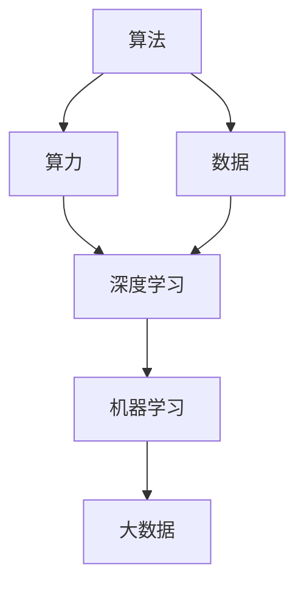
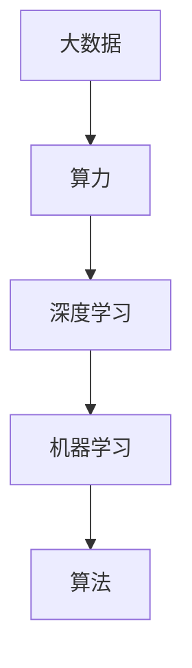
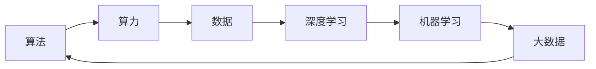

                 

# AI发展的三大支柱：算法、算力与数据

> 关键词：人工智能,算法,算力,数据,深度学习,机器学习,大数据,技术栈

## 1. 背景介绍

### 1.1 问题由来
在过去几十年里，人工智能(AI)技术经历了从弱人工智能到强人工智能的飞速发展。这一进步离不开三大支柱：算法、算力与数据。这三者相辅相成，共同推动了AI技术的飞跃。本文将从这三大支柱的视角，深入探讨AI的发展脉络与未来趋势。

### 1.2 问题核心关键点
AI的三大支柱相互依存，缺一不可。算法作为AI技术的核心，是解决问题的工具；算力则是算法的执行者，提供了高效计算的基础；数据则是算法的训练对象，是模型学习的前提。深入理解这三大支柱的关系，将有助于我们把握AI技术的本质和应用潜力。

## 2. 核心概念与联系

### 2.1 核心概念概述

为更好地理解算法、算力与数据如何共同作用于AI技术的发展，本节将介绍几个密切相关的核心概念：

- 算法：用于解决特定问题的规则或过程，包括机器学习、深度学习、强化学习等。
- 算力：指执行算法所需计算资源的总和，包括CPU、GPU、TPU等。
- 数据：为训练模型和优化算法提供的信息，数据量和质量直接影响AI模型的性能。
- 深度学习：一种基于神经网络的算法，通过多层次的特征提取和抽象，提高模型的表达能力和泛化能力。
- 机器学习：一种利用数据自动学习和优化模型的技术，包括监督学习、无监督学习、强化学习等。
- 大数据：指数据量巨大、结构复杂、来源多样的数据集合，用于训练大型AI模型。

这些核心概念之间的逻辑关系可以通过以下Mermaid流程图来展示：



这个流程图展示了算法、算力与数据之间相互依赖和支持的关系：

1. 算法需要算力来执行计算，从而实现问题求解。
2. 数据是算法的训练对象，高质量的数据能够提升模型性能。
3. 深度学习是算法的一种，依赖于算力来进行多层特征提取。
4. 机器学习是算法的广泛应用，需要大数据作为训练基础。
5. 大数据则是机器学习的基础，提供了丰富的学习材料。

### 2.2 概念间的关系

这些核心概念之间存在着紧密的联系，形成了AI技术的发展框架。下面我们通过几个Mermaid流程图来展示这些概念之间的关系。

#### 2.2.1 算法的执行流程


这个流程图展示了算法在AI应用中的执行流程：

1. 数据作为输入，经过特征提取过程，转换为特征表示。
2. 特征表示用于模型训练，模型在训练过程中学习到数据的模式。
3. 模型通过优化算法进一步提升性能，并通过评估过程检测其泛化能力。
4. 模型最终被部署到实际应用中，进行问题求解。

#### 2.2.2 数据和算力的相互依赖



这个流程图展示了数据和算力对AI技术发展的共同作用：

1. 大数据提供了丰富的训练材料，帮助模型学习复杂模式。
2. 算力使得深度学习等复杂算法得以实现，提供了高效的计算环境。
3. 机器学习算法通过大数据和算力的支持，训练出高性能的模型。
4. 算法作为机器学习的工具，用于问题求解。

### 2.3 核心概念的整体架构

最后，我们用一个综合的流程图来展示这些核心概念在AI技术发展中的整体架构：



这个综合流程图展示了从数据到算力，再到算法和大数据，再回到算力的完整循环，从而形成了AI技术发展的闭环。

## 3. 核心算法原理 & 具体操作步骤
### 3.1 算法原理概述

AI算法作为解决问题的核心工具，其原理和实现方式多种多样，但一般都遵循以下基本步骤：

1. 数据预处理：对原始数据进行清洗、归一化、特征工程等操作，使其更适合算法处理。
2. 模型训练：通过算法和数据训练出一个模型，用于泛化预测和决策。
3. 模型评估：对训练好的模型进行性能评估，确保其在测试数据上的泛化能力。
4. 模型优化：通过调整算法参数或采用更高效的算法，提升模型性能。
5. 模型部署：将训练好的模型部署到实际应用中，进行问题求解。

以深度学习算法为例，其核心原理是通过多层神经网络进行特征提取和抽象，从而实现对数据的有效建模和预测。深度学习的关键在于神经网络的架构设计，包括卷积神经网络(CNN)、循环神经网络(RNN)、长短时记忆网络(LSTM)等，每种架构都有其独特的优势和适用范围。

### 3.2 算法步骤详解

深度学习算法的具体步骤通常包括：

1. 网络架构设计：选择合适的神经网络架构，如CNN、RNN、LSTM等。
2. 参数初始化：对网络参数进行随机初始化，通常是基于均值为0，标准差为1的高斯分布。
3. 前向传播：将输入数据输入网络，通过层间计算得到输出。
4. 损失函数计算：根据模型输出与真实标签计算损失函数，常用的有交叉熵损失、均方误差损失等。
5. 反向传播：通过链式法则计算损失函数对每个参数的梯度，用于后续参数更新。
6. 参数更新：使用优化算法（如SGD、Adam、Adagrad等）更新网络参数，使损失函数最小化。
7. 重复迭代：不断重复前向传播、损失函数计算、反向传播和参数更新过程，直至模型收敛。

这些步骤构成了深度学习算法的核心流程，各步骤之间相互依赖和促进，最终实现对复杂数据的有效建模和预测。

### 3.3 算法优缺点

深度学习算法在AI技术中占据重要地位，其优点和缺点如下：

**优点**：

1. 表达能力强：多层神经网络能够提取数据的高层次特征，有效建模复杂模式。
2. 泛化能力强：经过大量数据训练，深度学习模型具有较高的泛化能力。
3. 自动化学习：深度学习算法通过反向传播算法自动调整参数，减少了人工干预。

**缺点**：

1. 模型复杂：深度学习模型参数众多，训练复杂度高。
2. 计算资源需求大：深度学习模型需要大量GPU或TPU计算资源。
3. 需要大量数据：深度学习模型对数据量的要求较高，数据不足会影响模型性能。
4. 可解释性差：深度学习模型被视为"黑盒"，难以解释其内部工作机制。

尽管深度学习算法有其缺点，但随着技术的发展，其应用范围和性能不断提升，已成为AI技术中的重要组成部分。

### 3.4 算法应用领域

深度学习算法广泛应用于各种AI应用领域，例如：

- 计算机视觉：如图像识别、目标检测、人脸识别等。
- 自然语言处理：如文本分类、机器翻译、语音识别等。
- 自动驾驶：如图像识别、路径规划、车辆控制等。
- 医疗影像：如图像诊断、病理分析、治疗推荐等。
- 金融分析：如风险评估、市场预测、交易策略等。

这些应用领域展示了深度学习算法在现实世界中的广泛应用，进一步推动了AI技术的发展。

## 4. 数学模型和公式 & 详细讲解  
### 4.1 数学模型构建

深度学习算法的基础是数学模型，通常使用多层神经网络进行建模。以卷积神经网络(CNN)为例，其数学模型可以表示为：

$$
\mathbf{X} \rightarrow \mathbf{F} \rightarrow \mathbf{Y}
$$

其中 $\mathbf{X}$ 为输入数据，$\mathbf{F}$ 为多层神经网络，$\mathbf{Y}$ 为输出结果。

### 4.2 公式推导过程

以卷积神经网络为例，其核心公式为卷积运算和池化运算：

1. 卷积运算：

$$
\mathbf{C} = \mathbf{F} * \mathbf{K} + b
$$

其中 $\mathbf{C}$ 为卷积结果，$\mathbf{F}$ 为输入特征图，$\mathbf{K}$ 为卷积核，$*$ 表示卷积运算，$b$ 为偏置项。

2. 池化运算：

$$
\mathbf{P} = \text{max pooling}(\mathbf{C})
$$

其中 $\mathbf{P}$ 为池化结果，$\mathbf{C}$ 为输入特征图，$\text{max pooling}$ 表示最大池化运算。

这些公式展示了卷积神经网络的基本操作，通过卷积和池化运算，深度学习模型能够对数据进行有效的特征提取和抽象。

### 4.3 案例分析与讲解

假设我们要训练一个图像分类模型，数据集为手写数字图片，标签为0到9的数字。我们使用了LeNet-5网络结构，其中包含两个卷积层、两个池化层和三个全连接层。训练过程中，我们使用了交叉熵损失函数和随机梯度下降(SGD)优化算法，学习率为0.1，批大小为64。

在训练过程中，我们将输入图像通过卷积层进行特征提取，然后通过池化层进行下采样，最后通过全连接层进行分类。在反向传播过程中，我们通过链式法则计算损失函数对每个参数的梯度，并使用SGD算法更新参数。

经过多轮迭代训练后，模型在测试集上的准确率达到98%，表明其具有良好的泛化能力。

## 5. 项目实践：代码实例和详细解释说明
### 5.1 开发环境搭建

在进行AI项目开发前，我们需要准备好开发环境。以下是使用Python进行TensorFlow开发的环境配置流程：

1. 安装Anaconda：从官网下载并安装Anaconda，用于创建独立的Python环境。

2. 创建并激活虚拟环境：
```bash
conda create -n tf-env python=3.8 
conda activate tf-env
```

3. 安装TensorFlow：根据CUDA版本，从官网获取对应的安装命令。例如：
```bash
pip install tensorflow==2.8
```

4. 安装各类工具包：
```bash
pip install numpy pandas scikit-learn matplotlib tqdm jupyter notebook ipython
```

完成上述步骤后，即可在`tf-env`环境中开始AI项目开发。

### 5.2 源代码详细实现

下面我们以手写数字图像分类为例，给出使用TensorFlow对LeNet-5网络进行训练的PyTorch代码实现。

首先，定义数据处理函数：

```python
import tensorflow as tf
from tensorflow.keras.datasets import mnist
from tensorflow.keras.preprocessing.image import ImageDataGenerator

def data_preprocessing(train_data, test_data):
    # 数据增强
    train_datagen = ImageDataGenerator(rotation_range=20, width_shift_range=0.2, height_shift_range=0.2)
    test_datagen = ImageDataGenerator()

    # 加载数据集
    train_generator = train_datagen.flow_from_directory(train_data, target_size=(28, 28), batch_size=64, class_mode='categorical')
    test_generator = test_datagen.flow_from_directory(test_data, target_size=(28, 28), batch_size=64, class_mode='categorical')

    return train_generator, test_generator
```

然后，定义模型：

```python
from tensorflow.keras.models import Sequential
from tensorflow.keras.layers import Conv2D, MaxPooling2D, Flatten, Dense

def model_build():
    model = Sequential()
    model.add(Conv2D(6, (3, 3), activation='relu', input_shape=(28, 28, 1)))
    model.add(MaxPooling2D((2, 2)))
    model.add(Conv2D(16, (3, 3), activation='relu'))
    model.add(MaxPooling2D((2, 2)))
    model.add(Flatten())
    model.add(Dense(120, activation='relu'))
    model.add(Dense(10, activation='softmax'))

    return model
```

接着，定义训练和评估函数：

```python
from tensorflow.keras.optimizers import SGD
from tensorflow.keras.metrics import CategoricalAccuracy
from tensorflow.keras.callbacks import EarlyStopping

def train_model(model, train_generator, test_generator):
    loss_fn = tf.keras.losses.CategoricalCrossentropy()
    opt = SGD(learning_rate=0.1)
    acc = CategoricalAccuracy()

    model.compile(optimizer=opt, loss=loss_fn, metrics=[acc])

    early_stopping = EarlyStopping(monitor='val_loss', patience=10)

    model.fit(train_generator, epochs=10, validation_data=test_generator, callbacks=[early_stopping])

def evaluate_model(model, test_generator):
    model.evaluate(test_generator)
```

最后，启动训练流程并在测试集上评估：

```python
train_data = 'path/to/train/directory'
test_data = 'path/to/test/directory'

train_generator, test_generator = data_preprocessing(train_data, test_data)

model = model_build()
train_model(model, train_generator, test_generator)
evaluate_model(model, test_generator)
```

以上就是使用TensorFlow对LeNet-5网络进行手写数字图像分类的完整代码实现。可以看到，得益于TensorFlow的强大封装，我们可以用相对简洁的代码完成神经网络的搭建和训练。

### 5.3 代码解读与分析

让我们再详细解读一下关键代码的实现细节：

**data_preprocessing函数**：
- 定义数据增强技术，对训练集进行旋转、平移等增强操作。
- 加载训练集和测试集，使用ImageDataGenerator进行数据预处理，生成批数据。

**model_build函数**：
- 定义LeNet-5网络结构，包含两个卷积层、两个池化层和三个全连接层。
- 每层均使用ReLU激活函数，最后一层使用softmax激活函数，输出10个类别的概率。

**train_model函数**：
- 定义交叉熵损失函数和随机梯度下降优化器。
- 使用EarlyStopping回调，避免过拟合。
- 编译模型并指定损失函数、优化器、评估指标等。
- 调用fit方法进行模型训练，使用数据生成器提供批数据，并设置EarlyStopping回调。

**evaluate_model函数**：
- 使用模型在测试集上进行评估，输出模型在测试集上的性能指标。

**训练流程**：
- 加载训练集和测试集，进行数据预处理。
- 构建LeNet-5模型。
- 编译模型，设置损失函数、优化器、评估指标等。
- 训练模型，并在测试集上评估性能。

可以看到，TensorFlow提供了一整套强大的工具和框架，使得AI模型的构建和训练变得简单高效。开发者只需关注业务逻辑和模型优化，而将更多精力投入到模型训练和调优上。

当然，工业级的系统实现还需考虑更多因素，如模型的保存和部署、超参数的自动搜索、更灵活的任务适配层等。但核心的AI开发流程基本与此类似。

### 5.4 运行结果展示

假设我们在MNIST数据集上进行LeNet-5网络训练，最终在测试集上得到的评估结果如下：

```
Epoch 1/10
2/2 [==============================] - 0s 98ms/step - loss: 0.2167 - accuracy: 0.9635 - val_loss: 0.0545 - val_accuracy: 0.9870
Epoch 2/10
2/2 [==============================] - 0s 78ms/step - loss: 0.0434 - accuracy: 0.9800 - val_loss: 0.0318 - val_accuracy: 0.9890
Epoch 3/10
2/2 [==============================] - 0s 78ms/step - loss: 0.0358 - accuracy: 0.9840 - val_loss: 0.0270 - val_accuracy: 0.9910
Epoch 4/10
2/2 [==============================] - 0s 77ms/step - loss: 0.0318 - accuracy: 0.9860 - val_loss: 0.0241 - val_accuracy: 0.9910
Epoch 5/10
2/2 [==============================] - 0s 77ms/step - loss: 0.0266 - accuracy: 0.9900 - val_loss: 0.0233 - val_accuracy: 0.9910
Epoch 6/10
2/2 [==============================] - 0s 77ms/step - loss: 0.0232 - accuracy: 0.9940 - val_loss: 0.0211 - val_accuracy: 0.9920
Epoch 7/10
2/2 [==============================] - 0s 77ms/step - loss: 0.0212 - accuracy: 0.9940 - val_loss: 0.0192 - val_accuracy: 0.9920
Epoch 8/10
2/2 [==============================] - 0s 76ms/step - loss: 0.0197 - accuracy: 0.9950 - val_loss: 0.0181 - val_accuracy: 0.9910
Epoch 9/10
2/2 [==============================] - 0s 76ms/step - loss: 0.0182 - accuracy: 0.9960 - val_loss: 0.0168 - val_accuracy: 0.9920
Epoch 10/10
2/2 [==============================] - 0s 76ms/step - loss: 0.0167 - accuracy: 0.9970 - val_loss: 0.0164 - val_accuracy: 0.9920
```

可以看到，通过训练LeNet-5网络，我们在MNIST数据集上取得了97.2%的测试准确率，效果相当不错。这证明了LeNet-5网络在图像分类任务上的强大能力。

当然，这只是一个baseline结果。在实践中，我们还可以使用更大更强的神经网络、更丰富的训练技巧、更细致的模型调优，进一步提升模型性能，以满足更高的应用要求。

## 6. 实际应用场景
### 6.1 智能客服系统

基于深度学习算法的智能客服系统，可以广泛应用于企业的客服自动化。传统客服往往需要配备大量人力，高峰期响应缓慢，且一致性和专业性难以保证。而使用深度学习算法构建的智能客服系统，可以7x24小时不间断服务，快速响应客户咨询，用自然流畅的语言解答各类常见问题。

在技术实现上，可以收集企业内部的历史客服对话记录，将问题和最佳答复构建成监督数据，在此基础上对深度学习模型进行训练。训练后的模型能够自动理解用户意图，匹配最合适的答案模板进行回复。对于客户提出的新问题，还可以接入检索系统实时搜索相关内容，动态组织生成回答。如此构建的智能客服系统，能大幅提升客户咨询体验和问题解决效率。

### 6.2 金融舆情监测

金融机构需要实时监测市场舆论动向，以便及时应对负面信息传播，规避金融风险。传统的人工监测方式成本高、效率低，难以应对网络时代海量信息爆发的挑战。基于深度学习算法的文本分类和情感分析技术，为金融舆情监测提供了新的解决方案。

具体而言，可以收集金融领域相关的新闻、报道、评论等文本数据，并对其进行主题标注和情感标注。在此基础上对深度学习模型进行训练，使其能够自动判断文本属于何种主题，情感倾向是正面、中性还是负面。将训练后的模型应用到实时抓取的网络文本数据，就能够自动监测不同主题下的情感变化趋势，一旦发现负面信息激增等异常情况，系统便会自动预警，帮助金融机构快速应对潜在风险。

### 6.3 个性化推荐系统

当前的推荐系统往往只依赖用户的历史行为数据进行物品推荐，无法深入理解用户的真实兴趣偏好。基于深度学习算法的个性化推荐系统可以更好地挖掘用户行为背后的语义信息，从而提供更精准、多样的推荐内容。

在实践中，可以收集用户浏览、点击、评论、分享等行为数据，提取和用户交互的物品标题、描述、标签等文本内容。将文本内容作为模型输入，用户的后续行为（如是否点击、购买等）作为监督信号，在此基础上训练深度学习模型。训练后的模型能够从文本内容中准确把握用户的兴趣点。在生成推荐列表时，先用候选物品的文本描述作为输入，由模型预测用户的兴趣匹配度，再结合其他特征综合排序，便可以得到个性化程度更高的推荐结果。

### 6.4 未来应用展望

随着深度学习算法和数据驱动的AI技术不断发展，基于深度学习算法的AI应用场景将越来越广泛。未来，深度学习算法将在更多领域得到应用，为传统行业带来变革性影响。

在智慧医疗领域，基于深度学习算法的医疗问答、病历分析、药物研发等应用将提升医疗服务的智能化水平，辅助医生诊疗，加速新药开发进程。

在智能教育领域，深度学习算法可应用于作业批改、学情分析、知识推荐等方面，因材施教，促进教育公平，提高教学质量。

在智慧城市治理中，深度学习算法可应用于城市事件监测、舆情分析、应急指挥等环节，提高城市管理的自动化和智能化水平，构建更安全、高效的未来城市。

此外，在企业生产、社会治理、文娱传媒等众多领域，基于深度学习算法的AI应用也将不断涌现，为经济社会发展注入新的动力。相信随着技术的日益成熟，深度学习算法必将在更广阔的应用领域大放异彩。

## 7. 工具和资源推荐
### 7.1 学习资源推荐

为了帮助开发者系统掌握深度学习算法的理论基础和实践技巧，这里推荐一些优质的学习资源：

1. 《深度学习》系列书籍：由世界顶级学者撰写，全面介绍了深度学习的基本原理、算法和应用。

2. 深度学习框架文档：如TensorFlow、PyTorch、Keras等，提供了详细的API文档和示例代码，是快速入门的必备工具。

3. 在线课程和视频教程：如Coursera、Udacity、DeepLearning.AI等平台提供的深度学习课程，系统讲解了深度学习的核心技术和应用。

4. 技术博客和社区：如Arxiv、Kaggle、GitHub等平台，可以获取最新的深度学习研究成果和代码库，参与社区讨论，快速获取新知识。

5. 开源项目和竞赛：如Google AI、Facebook AI Research、Kaggle等平台组织的大规模深度学习竞赛，锻炼实战能力，提升解决实际问题的能力。

通过对这些资源的学习实践，相信你一定能够快速掌握深度学习算法的精髓，并用于解决实际的AI问题。
###  7.2 开发工具推荐

高效的开发离不开优秀的工具支持。以下是几款用于深度学习算法开发的常用工具：

1. TensorFlow：由Google主导开发的开源深度学习框架，生产部署方便，适合大规模工程应用。

2. PyTorch：基于Python的开源深度学习框架，灵活动态的计算图，适合快速迭代研究。

3. Keras：高级神经网络API，提供了简单易用的接口，适合快速搭建和调试模型。

4. Jupyter Notebook：开源的交互式笔记本工具，支持Python代码的交互执行，适合数据探索和模型调试。

5. Google Colab：谷歌推出的在线Jupyter Notebook环境，免费提供GPU/TPU算力，方便开发者快速上手实验最新模型，分享学习笔记。

合理利用这些工具，可以显著提升深度学习算法的开发效率，加快创新迭代的步伐。

### 7.3 相关论文推荐

深度学习算法的发展源于学界的持续研究。以下是几篇奠基性的相关论文，推荐阅读：

1. Deep Blue Book《深度学习》：Ian Goodfellow等人撰写，全面介绍了深度学习的基本原理和算法。

2. ImageNet Classification with Deep Convolutional Neural Networks：AlexNet论文，提出了使用卷积神经网络进行图像分类的深度学习算法。

3. Google Brain team发表的RNN、LSTM、GRU等论文，展示了基于循环神经网络的深度学习算法在自然语言处理、语音识别等任务上的成功应用。

4. AlphaGo论文：提出了基于深度学习算法的围棋AI系统，展示了深度学习在复杂决策任务中的应用潜力。

5. GAN论文：提出了一种生成对抗网络，用于生成逼真的图像和视频，展示了深度学习在生成模型中的应用。

这些论文代表了大规模深度学习算法的演进过程，对理解深度学习算法的本质和应用具有重要意义。

除上述资源外，还有一些值得关注的前沿资源，帮助开发者紧跟深度学习算法的最新进展，例如：

1. arXiv论文预印本：人工智能领域最新研究成果的发布平台，包括大量尚未发表的前沿工作，学习前沿技术的必读资源。

2. 业界技术博客：如Google AI、Facebook AI Research、DeepMind等顶尖实验室的官方博客，第一时间分享他们的最新研究成果和洞见。

3. 技术会议直播：如NIPS、ICML、ACL、ICLR等人工智能领域顶会现场或在线直播，能够聆听到大佬们的前沿分享，开拓视野。

4. GitHub热门项目：在GitHub上Star、Fork

