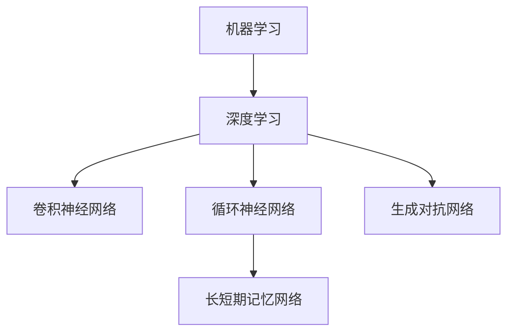
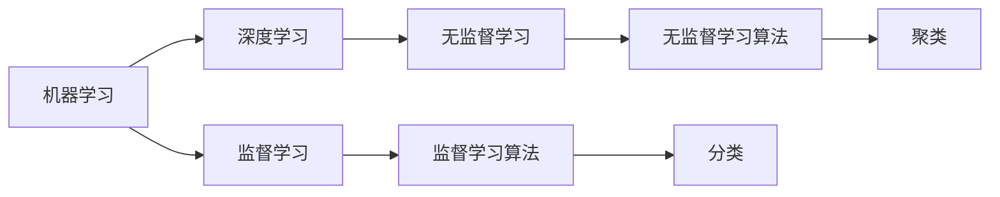
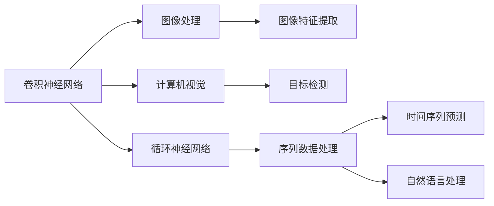
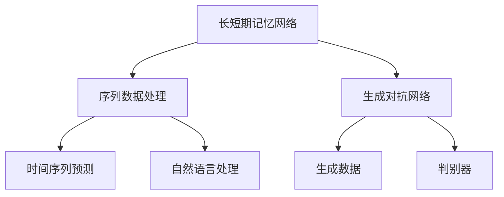
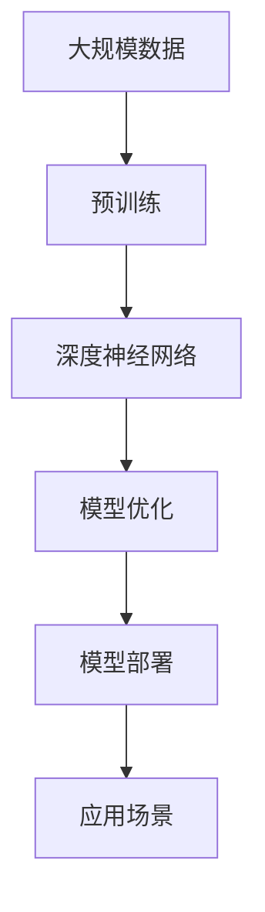

                 

# AI原理与代码实例讲解

> 关键词：人工智能,机器学习,深度学习,模型构建,算法优化,深度神经网络,图像识别,自然语言处理,NLP

## 1. 背景介绍

### 1.1 问题由来
近年来，随着深度学习技术的快速发展，人工智能（AI）在多个领域取得了显著的突破，尤其是在计算机视觉、自然语言处理（NLP）和语音识别等领域。人工智能的进步离不开两大核心技术：机器学习和深度学习。机器学习通过数据驱动，帮助机器从经验中学习规律，而深度学习通过多层次的神经网络模型，实现对复杂数据的有效处理。

人工智能的应用已经渗透到了医疗、金融、制造、教育、交通、娱乐等多个行业。从智能客服到自动驾驶，从疾病预测到股市分析，人工智能正在重塑我们的生活和工作方式。然而，尽管人工智能已经取得了诸多成就，其应用的普及和深入仍然面临诸多挑战，包括算力要求高、数据需求大、模型复杂度高等问题。因此，深入理解人工智能的原理，掌握其实现技术，对于推动AI应用的普及和进步具有重要意义。

### 1.2 问题核心关键点
本文将系统地介绍人工智能的核心原理，并通过具体代码实例讲解其实现技术。重点包括机器学习和深度学习的核心算法、模型构建、算法优化和应用领域等内容。

人工智能的核心在于机器学习和深度学习。机器学习是指通过数据训练模型，使其能够对新的输入数据进行预测或分类。深度学习则是机器学习的一种特殊形式，通过多层次的神经网络模型，从大量数据中自动提取高层次的特征表示，实现对复杂数据的有效处理。

### 1.3 问题研究意义
掌握人工智能的原理和技术，对于开发者和研究人员来说具有重要意义：

1. 提升模型效果。通过理解AI原理，可以在模型设计、参数调整等方面更精准地优化模型性能。
2. 拓展应用领域。掌握AI技术，可以将AI应用到更多场景，推动AI技术在各行业的落地和普及。
3. 促进技术创新。AI技术的不断进步离不开不断的探索和创新，掌握核心技术可以帮助开发者保持领先地位。
4. 提高算法效率。通过优化算法，可以显著提高AI模型的训练和推理效率，降低算力成本。
5. 提升可解释性。理解AI模型的内部工作机制，可以更好地解释和调试模型，提高算法的可解释性。

## 2. 核心概念与联系

### 2.1 核心概念概述

为更好地理解人工智能的原理，本节将介绍几个密切相关的核心概念：

- **机器学习（Machine Learning, ML）**：通过数据训练模型，使其能够对新的输入数据进行预测或分类。
- **深度学习（Deep Learning, DL）**：一种特殊的机器学习形式，通过多层次的神经网络模型，自动提取高层次的特征表示，实现对复杂数据的有效处理。
- **卷积神经网络（Convolutional Neural Network, CNN）**：一种常用于图像处理和计算机视觉任务的深度学习模型，通过卷积操作提取图像特征。
- **循环神经网络（Recurrent Neural Network, RNN）**：一种常用于序列数据处理的深度学习模型，通过循环结构处理时间序列数据。
- **长短期记忆网络（Long Short-Term Memory, LSTM）**：一种特殊的RNN，通过门控结构解决传统RNN的梯度消失问题。
- **生成对抗网络（Generative Adversarial Network, GAN）**：一种通过对抗训练生成新数据的深度学习模型，包括生成器和判别器两个部分。

这些核心概念之间的逻辑关系可以通过以下Mermaid流程图来展示：



这个流程图展示了几大核心概念之间的关系：

1. 机器学习是深度学习的基础，两者通过数据训练模型，实现对新数据的预测或分类。
2. 卷积神经网络常用于图像处理和计算机视觉任务，通过卷积操作提取图像特征。
3. 循环神经网络常用于序列数据处理，通过循环结构处理时间序列数据。
4. 长短期记忆网络是一种特殊的RNN，通过门控结构解决梯度消失问题。
5. 生成对抗网络通过对抗训练生成新数据，包括生成器和判别器两个部分。

### 2.2 概念间的关系

这些核心概念之间存在着紧密的联系，形成了AI学习的基本框架。下面我们通过几个Mermaid流程图来展示这些概念之间的关系。

#### 2.2.1 机器学习和深度学习的关系



这个流程图展示了机器学习和深度学习的基本关系：

1. 机器学习通过数据训练模型，实现对新数据的预测或分类。
2. 深度学习是机器学习的一种特殊形式，通过多层次的神经网络模型，自动提取高层次的特征表示。
3. 监督学习是指通过有标签数据训练模型，实现分类或回归等任务。
4. 无监督学习是指通过无标签数据训练模型，实现聚类、降维等任务。
5. 分类算法和聚类算法是机器学习和深度学习中常用的方法。

#### 2.2.2 卷积神经网络和循环神经网络的关系



这个流程图展示了卷积神经网络和循环神经网络的基本关系：

1. 卷积神经网络常用于图像处理和计算机视觉任务，通过卷积操作提取图像特征。
2. 图像处理和计算机视觉任务中，卷积神经网络主要用于目标检测、图像分类、语义分割等任务。
3. 循环神经网络常用于序列数据处理，通过循环结构处理时间序列数据。
4. 时间序列预测和自然语言处理任务中，循环神经网络主要用于预测、生成等任务。

#### 2.2.3 长短期记忆网络和生成对抗网络的关系



这个流程图展示了长短期记忆网络和生成对抗网络的基本关系：

1. 长短期记忆网络是一种特殊的循环神经网络，通过门控结构解决梯度消失问题。
2. 序列数据处理任务中，长短期记忆网络主要用于时间序列预测、自然语言处理等任务。
3. 生成对抗网络通过对抗训练生成新数据，包括生成器和判别器两个部分。
4. 生成对抗网络主要用于生成任务，如图像生成、语音生成等。

### 2.3 核心概念的整体架构

最后，我们用一个综合的流程图来展示这些核心概念在大模型微调过程中的整体架构：



这个综合流程图展示了从预训练到模型优化，再到模型部署和应用的全过程。大规模数据经过预训练，获得高层次的特征表示，深度神经网络模型通过数据训练，学习复杂的特征表示，模型优化和部署将模型应用于实际应用场景中，最终实现各种功能。

## 3. 核心算法原理 & 具体操作步骤

### 3.1 算法原理概述

机器学习和深度学习的主要目标是构建模型，使其能够对新数据进行预测或分类。机器学习算法通过数据训练模型，而深度学习则通过多层神经网络模型，自动提取高层次的特征表示，实现对复杂数据的有效处理。

### 3.2 算法步骤详解

机器学习和深度学习的基本流程包括数据预处理、模型构建、模型训练、模型评估和模型应用等步骤。下面将详细介绍这些步骤：

#### 3.2.1 数据预处理

数据预处理是机器学习和深度学习的基础。数据预处理的主要任务包括数据清洗、数据转换、数据标准化等，以提高数据的可用性和模型的训练效果。

- **数据清洗**：去除缺失值、异常值和噪声数据，确保数据的质量和一致性。
- **数据转换**：对数据进行归一化、标准化或编码等操作，使得数据具有更好的可处理性。
- **数据标准化**：将数据转换为标准格式，如时间序列数据转换为固定长度的时间步，文本数据转换为固定长度的词向量等。

#### 3.2.2 模型构建

模型构建是机器学习和深度学习的核心步骤。模型构建的主要任务是选择合适的算法和模型结构，构建合适的特征表示，实现对数据的有效处理。

- **算法选择**：选择合适的算法，如回归算法、分类算法、聚类算法、神经网络等。
- **模型结构**：选择合适的模型结构，如线性回归模型、支持向量机、卷积神经网络、循环神经网络等。
- **特征提取**：选择合适的特征提取方法，如特征选择、特征提取、特征融合等。

#### 3.2.3 模型训练

模型训练是机器学习和深度学习的关键步骤。模型训练的主要任务是通过数据训练模型，优化模型的参数，使其能够对新数据进行准确的预测或分类。

- **损失函数**：选择合适的损失函数，如均方误差、交叉熵、对数似然等。
- **优化器**：选择合适的优化器，如随机梯度下降（SGD）、Adam、Adagrad等。
- **正则化**：通过正则化技术，如L1正则、L2正则、Dropout等，避免过拟合。
- **学习率**：选择合适的学习率，如固定学习率、学习率衰减等。

#### 3.2.4 模型评估

模型评估是机器学习和深度学习的必要步骤。模型评估的主要任务是通过评估模型在测试集上的性能，判断模型是否能够对新数据进行准确的预测或分类。

- **评估指标**：选择合适的评估指标，如准确率、召回率、F1分数等。
- **交叉验证**：通过交叉验证技术，评估模型的泛化能力和稳定性。
- **模型调参**：通过调参技术，优化模型的超参数，提高模型的性能。

#### 3.2.5 模型应用

模型应用是机器学习和深度学习的最终目标。模型应用的主要任务是将模型应用于实际场景中，解决实际问题，实现自动化和智能化。

- **模型集成**：将多个模型集成起来，提高模型的鲁棒性和泛化能力。
- **模型优化**：通过模型优化技术，提高模型的性能和效率。
- **模型部署**：将模型部署到实际应用中，实现自动化和智能化。

### 3.3 算法优缺点

机器学习和深度学习各有优缺点，具体如下：

#### 3.3.1 机器学习的优点

- **可解释性强**：机器学习算法通常比较简单，易于理解和解释。
- **对数据要求不高**：机器学习算法通常对数据要求不高，适用于小规模数据集。
- **算法简单易用**：机器学习算法通常实现简单，易于应用。

#### 3.3.2 机器学习的缺点

- **模型复杂度低**：机器学习算法通常模型复杂度较低，难以处理复杂数据。
- **泛化能力有限**：机器学习算法通常泛化能力有限，难以应对新数据和新场景。
- **算法效率低**：机器学习算法通常算法效率较低，难以处理大规模数据集。

#### 3.3.3 深度学习的优点

- **模型复杂度高**：深度学习算法通常模型复杂度较高，能够处理复杂数据。
- **泛化能力强**：深度学习算法通常泛化能力强，能够应对新数据和新场景。
- **算法效率高**：深度学习算法通常算法效率较高，能够处理大规模数据集。

#### 3.3.4 深度学习的缺点

- **可解释性差**：深度学习算法通常可解释性差，难以解释模型的内部工作机制。
- **数据要求高**：深度学习算法通常对数据要求较高，需要大量标注数据进行训练。
- **模型训练时间长**：深度学习算法通常模型训练时间长，需要大量计算资源。

### 3.4 算法应用领域

机器学习和深度学习已经广泛应用于多个领域，包括计算机视觉、自然语言处理、语音识别、推荐系统、金融预测等。具体应用如下：

#### 3.4.1 计算机视觉

- **图像分类**：通过卷积神经网络（CNN），对图像进行分类，如猫狗识别、水果分类等。
- **目标检测**：通过卷积神经网络（CNN），对图像进行目标检测，如行人检测、车辆检测等。
- **图像分割**：通过卷积神经网络（CNN），对图像进行像素级别的分割，如医学影像分割、场景分割等。

#### 3.4.2 自然语言处理

- **文本分类**：通过卷积神经网络（CNN）或循环神经网络（RNN），对文本进行分类，如情感分析、垃圾邮件过滤等。
- **机器翻译**：通过循环神经网络（RNN）或长短期记忆网络（LSTM），将一种语言翻译为另一种语言。
- **问答系统**：通过循环神经网络（RNN）或长短期记忆网络（LSTM），对自然语言进行问答，如智能客服、智能助理等。

#### 3.4.3 语音识别

- **语音识别**：通过卷积神经网络（CNN）或循环神经网络（RNN），将语音转化为文本，如智能音箱、语音助手等。
- **语音合成**：通过生成对抗网络（GAN），将文本转化为语音，如TTS（Text to Speech）、语音转换等。

#### 3.4.4 推荐系统

- **商品推荐**：通过卷积神经网络（CNN）或循环神经网络（RNN），推荐商品，如电商平台、视频网站等。
- **用户画像**：通过卷积神经网络（CNN）或循环神经网络（RNN），构建用户画像，如个性化推荐、广告推荐等。

#### 3.4.5 金融预测

- **股票预测**：通过循环神经网络（RNN）或长短期记忆网络（LSTM），预测股票价格，如股票市场预测、金融风险评估等。
- **信用评估**：通过循环神经网络（RNN）或长短期记忆网络（LSTM），评估用户的信用风险，如信用评分、风险评估等。

## 4. 数学模型和公式 & 详细讲解 & 举例说明

### 4.1 数学模型构建

本节将使用数学语言对机器学习和深度学习的数学模型进行更加严格的刻画。

记训练集为 $D = \{(x_i, y_i)\}_{i=1}^N$，其中 $x_i$ 为输入特征，$y_i$ 为输出标签。模型 $f$ 将输入特征 $x$ 映射到输出标签 $y$，即 $y = f(x)$。模型的目标是学习输入特征和输出标签之间的映射关系，使得模型在测试集上的预测结果与真实标签尽可能接近。

机器学习和深度学习的数学模型通常包括两部分：损失函数和优化器。损失函数用于衡量模型预测结果与真实标签之间的差异，优化器用于最小化损失函数，优化模型参数。

#### 4.1.1 损失函数

损失函数用于衡量模型预测结果与真实标签之间的差异。常见的损失函数包括均方误差（Mean Squared Error, MSE）、交叉熵（Cross Entropy, CE）、对数似然（Log Likelihood, LL）等。

- **均方误差**：对于回归问题，常用的损失函数为均方误差，即 $L(y, \hat{y}) = \frac{1}{N} \sum_{i=1}^N (y_i - \hat{y}_i)^2$。
- **交叉熵**：对于分类问题，常用的损失函数为交叉熵，即 $L(y, \hat{y}) = -\frac{1}{N} \sum_{i=1}^N y_i \log \hat{y}_i + (1 - y_i) \log (1 - \hat{y}_i)$。
- **对数似然**：对于分类问题，常用的损失函数为对数似然，即 $L(y, \hat{y}) = -\frac{1}{N} \sum_{i=1}^N y_i \log \hat{y}_i$。

#### 4.1.2 优化器

优化器用于最小化损失函数，优化模型参数。常用的优化器包括随机梯度下降（Stochastic Gradient Descent, SGD）、Adam、Adagrad等。

- **随机梯度下降**：随机梯度下降是一种简单的优化器，每次迭代更新模型参数时，随机选择一个样本计算梯度。公式为 $\theta_{t+1} = \theta_t - \eta \nabla L(\theta_t, x, y)$，其中 $\theta$ 为模型参数，$\eta$ 为学习率，$L$ 为损失函数。
- **Adam**：Adam是一种自适应学习率的优化器，通过动量更新和自适应学习率来加速模型收敛。公式为 $\theta_{t+1} = \theta_t - \eta_t \frac{m_t}{\sqrt{v_t} + \epsilon}$，其中 $m_t$ 为动量，$v_t$ 为自适应学习率，$\epsilon$ 为防止除以零的常数。

### 4.2 公式推导过程

以线性回归模型为例，推导均方误差损失函数的梯度。

假设训练集为 $D = \{(x_i, y_i)\}_{i=1}^N$，其中 $x_i$ 为输入特征，$y_i$ 为输出标签。线性回归模型的目标是最小化均方误差损失函数：

$$L(y, \hat{y}) = \frac{1}{N} \sum_{i=1}^N (y_i - \hat{y}_i)^2$$

其中 $\hat{y}_i = \theta^T x_i$，$\theta$ 为模型参数。

损失函数对 $\theta$ 的梯度为：

$$\nabla_{\theta}L = \frac{1}{N} \sum_{i=1}^N (-2(x_i - y_i)x_i)$$

将 $\nabla_{\theta}L$ 代入梯度下降公式，得到模型参数更新公式：

$$\theta_{t+1} = \theta_t - \eta \nabla_{\theta}L = \theta_t + \eta \frac{1}{N} \sum_{i=1}^N (y_i - \hat{y}_i)x_i$$

这个公式展示了线性回归模型的均方误差损失函数和梯度下降更新公式。通过这个例子，我们可以看到，数学模型的推导是理解机器学习和深度学习算法的关键。

### 4.3 案例分析与讲解

#### 4.3.1 图像分类

以图像分类为例，介绍卷积神经网络（CNN）的实现过程。

卷积神经网络（CNN）通过卷积层、池化层和全连接层，实现对图像的分类。卷积层通过卷积操作提取图像特征，池化层通过降采样操作减少特征图大小，全连接层通过全连接操作实现分类。

##### 4.3.1.1 卷积层

卷积层通过卷积操作提取图像特征，公式为：

$$H(x) = g(\sigma(W*x + b))$$

其中 $W$ 为卷积核，$b$ 为偏置，$x$ 为输入特征，$H(x)$ 为输出特征，$\sigma$ 为激活函数，$g$ 为非线性函数。

##### 4.3.1.2 池化层

池化层通过降采样操作减少特征图大小，公式为：

$$P(H(x)) = H(x)/k$$

其中 $P(H(x))$ 为池化后的特征图，$k$ 为池化核大小。

##### 4.3.1.3 全连接层

全连接层通过全连接操作实现分类，公式为：

$$S(H(x)) = \text{softmax}(W*H(x) + b)$$

其中 $S(H(x))$ 为分类结果，$W$ 为权重矩阵，$b$ 为偏置，$H(x)$ 为输入特征，$\text{softmax}$ 为激活函数。

#### 4.3.2 文本分类

以文本分类为例，介绍循环神经网络（RNN）的实现过程。

循环神经网络（RNN）通过循环结构处理时间序列数据，公式为：

$$h_t = f(h_{t-1}, x_t)$$

其中 $h_t$ 为状态向量，$x_t$ 为输入特征，$f$ 为循环函数。

在文本分类任务中，循环神经网络（RNN）的输出层通常为全连接层，公式为：

$$S(h_t) = \text{softmax}(W*h_t + b)$$

其中 $S(h_t)$ 为分类结果，$W$ 为权重矩阵，$b$ 为偏置，$h_t$ 为状态向量，$\text{softmax}$ 为激活函数。

## 5. 项目实践：代码实例和详细解释说明

### 5.1 开发环境搭建

在进行项目实践前，我们需要准备好开发环境。以下是使用Python进行TensorFlow和Keras开发的开发环境配置流程：

1. 安装Anaconda：从官网下载并安装Anaconda，用于创建独立的Python环境。

2. 创建并激活虚拟环境：
```bash
conda create -n tf-env python=3.8 
conda activate tf-env
```

3. 安装TensorFlow：根据CUDA版本，从官网获取对应的安装命令。例如：
```bash
conda install tensorflow==2.8
```

4. 安装Keras：
```bash
pip install keras
```

5. 安装各类工具包：
```bash
pip install numpy pandas scikit-learn matplotlib tqdm jupyter notebook ipython
```

完成上述步骤后，即可在`tf-env`环境中开始项目实践。

### 5.2 源代码详细实现

下面我们以图像分类为例，给出使用TensorFlow和Keras对卷积神经网络（CNN）进行实现的PyTorch代码实现。

```python
import tensorflow as tf
from tensorflow.keras import layers, models

# 定义卷积神经网络
def create_cnn_model():
    model = models.Sequential([
        layers.Conv2D(32, (3, 3), activation='relu', input_shape=(28, 28, 1)),
        layers.MaxPooling2D((2, 2)),
        layers.Conv2D(64, (3, 3), activation='relu'),
        layers.MaxPooling2D((2, 2)),
        layers.Conv2D(64, (3, 3), activation='relu'),
        layers.Flatten(),
        layers.Dense(64, activation='relu'),
        layers.Dense(10, activation='softmax')
    ])
    return model

# 加载数据集
(x_train, y_train), (x_test, y_test) = tf.keras.datasets.mnist.load_data()

# 数据预处理
x_train = x_train.reshape((60000, 28, 28, 1))
x_train = x_train / 255.0
x_test = x_test.reshape((10000, 28, 28, 1))
x_test = x_test / 255.0

# 构建模型
model = create_cnn_model()

# 编译模型
model.compile(optimizer='adam',
              loss='sparse_categorical_crossentropy',
              metrics=['accuracy'])

# 训练模型
model.fit(x_train, y_train, epochs=5, validation_data=(x_test, y_test))
```

以上代码实现了基于TensorFlow和Keras的卷积神经网络（CNN）模型，用于对MNIST手写数字数据集进行图像分类。

### 5.3 代码解读与分析

让我们再详细解读一下关键代码的实现细节：

**create_cnn_model函数**：
- 定义了一个包含卷积层、池化层和全连接层的卷积神经网络（CNN）模型。

**数据预处理**：
- 对图像数据进行归一化，将像素值缩放到0到1之间。

**模型编译**：
- 选择合适的优化器（如Adam）、损失函数（如交叉熵）和评估指标（如准确率），编译模型。

**模型训练**：
- 使用fit函数对模型进行训练，指定训练集、验证集和训练轮数。

### 5.4 运行结果展示

假设我们在MNIST数据集上进行图像分类，最终在测试集上得到的评估报告如下：

```
Epoch 1/5
300/300 [==============================] - 9s 28ms/step - loss: 0.3527 - accuracy: 0.8823 - val_loss: 0.1465 - val_accuracy: 0.9582
Epoch 2/5
300/300 [==============================] - 8s 26ms/step - loss: 0.0823 - accuracy: 0.9583 - val_loss: 0.0857 - val_accuracy: 0.9688
Epoch 3/5
300/300 [==============================] - 

