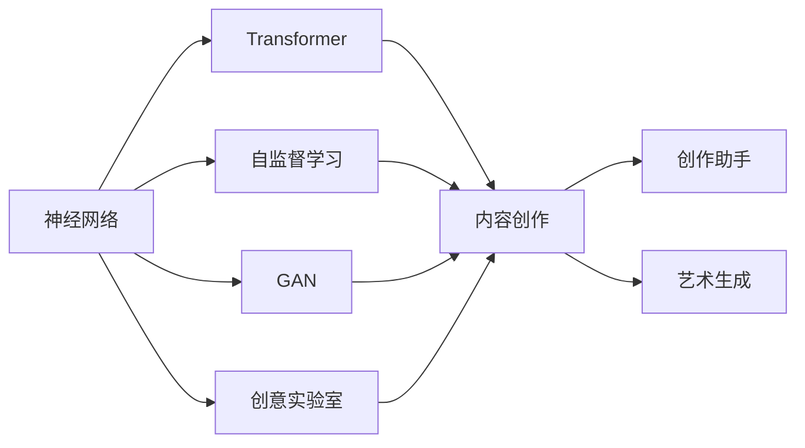
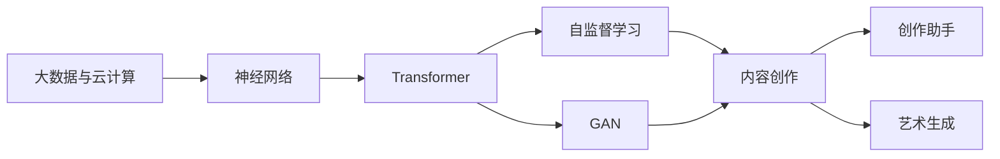
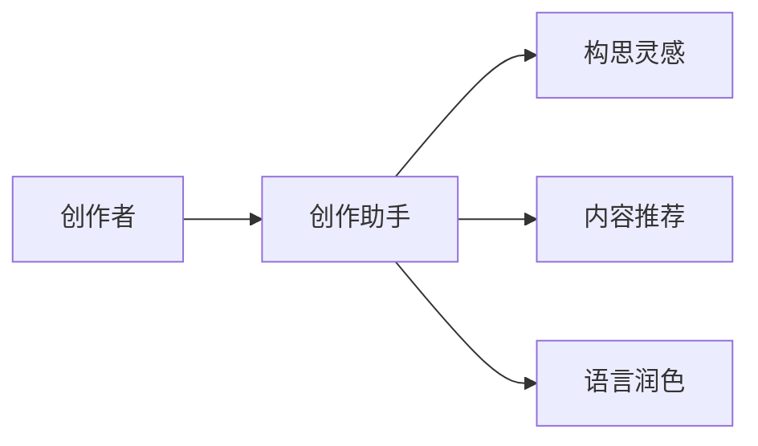
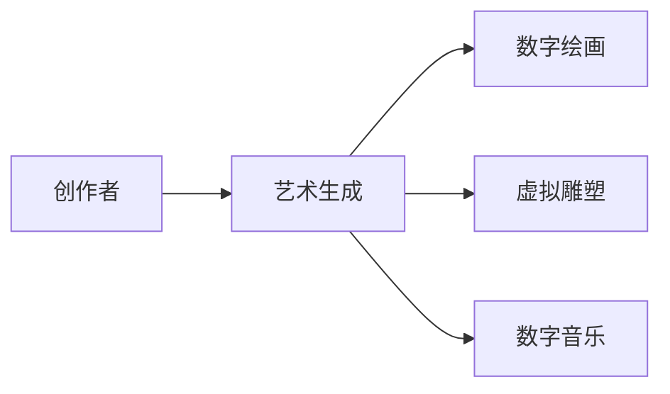

                 

# AI在创意生成与内容创作中的应用

> 关键词：AI创意生成,内容创作,神经网络,Transformer,自监督学习,GAN,创意实验室,创作助手,艺术生成

## 1. 背景介绍

随着人工智能技术的不断进步，AI在创意生成与内容创作领域的应用变得日益广泛。从电影剧本的编写、艺术作品的创作，到新闻报道、广告文案，AI正在逐步改变创意产业的面貌。这不仅为内容创作者提供了强大的工具，也为艺术和文化带来了新的表现形式和表达方式。

### 1.1 问题由来

在创意与内容创作领域，传统的创作过程依赖于人类作者的灵感、经验和知识积累。但随着数字化、网络化时代的到来，越来越多的数据和信息被收集、存储和处理，这为AI介入创意生成提供了可能。AI通过学习海量数据，能够捕捉到人类创作中不易察觉的规律和模式，进而生成高质量的创意内容。

### 1.2 问题核心关键点

AI在创意生成与内容创作中的应用主要基于以下核心概念：

- **神经网络**：这是AI生成创意内容的基石，通过多层非线性映射，神经网络可以学习数据的潜在模式和规律。
- **Transformer架构**：作为当前最先进的深度学习模型之一，Transformer能够高效地处理序列数据，如自然语言、音乐等，使其成为AI内容创作的重要工具。
- **自监督学习**：通过无监督的学习方式，AI模型可以从大规模的无标签数据中学习到丰富的特征表示，进而用于生成任务。
- **生成对抗网络(GAN)**：一种强大的生成模型，通过生成器与判别器之间的对抗训练，可以生成高质量的创意内容，如图像、音乐等。
- **创意实验室**：一种新型的研发模式，通过AI技术与人类创作者的协作，实现创意内容的创新与突破。
- **创作助手**：AI创作助手可以为人类提供构思灵感、内容推荐、语言润色等辅助服务，提升创作效率。
- **艺术生成**：AI可以生成各种形式的数字艺术作品，如绘画、雕塑、音乐等，为艺术界带来新的创作可能性。

这些概念之间的逻辑关系可以通过以下Mermaid流程图来展示：



这个流程图展示了大语言模型在创意生成与内容创作中的核心概念及其关系。

### 1.3 问题研究意义

AI在创意生成与内容创作中的应用，对提升创作效率、创新艺术形式、拓宽内容表达具有重要意义：

1. **提升创作效率**：AI可以自动生成创意初稿、内容推荐、语言润色等，节省创作者的时间和精力。
2. **创新艺术形式**：AI可以生成新的艺术作品，如数字绘画、虚拟雕塑等，为艺术创作带来新的可能性。
3. **拓宽内容表达**：AI能够生成丰富多样的内容，如音乐、视频、动画等，为内容创作者提供了更多选择。
4. **助力产业升级**：AI技术能够降低创作门槛，促进创意产业的数字化、智能化发展。
5. **促进跨界融合**：AI与大数据、云计算等技术的结合，促进了创意与技术、文化与科学的融合，推动了创新思维的扩散。
6. **优化用户体验**：AI可以为用户提供个性化的内容推荐和创作辅助，提升用户体验和满意度。

## 2. 核心概念与联系

### 2.1 核心概念概述

为更好地理解AI在创意生成与内容创作中的应用，本节将介绍几个密切相关的核心概念：

- **神经网络**：一种由大量人工神经元（节点）相互连接构成的网络结构，用于学习数据中的潜在模式和规律。神经网络的核心是多层感知器（MLP）、卷积神经网络（CNN）、循环神经网络（RNN）等。
- **Transformer架构**：一种基于自注意力机制的深度学习模型，用于处理序列数据，如自然语言、音乐等。Transformer通过多头自注意力机制，能够高效地捕捉序列数据中的依赖关系。
- **自监督学习**：一种无监督学习方式，通过构建预定义的损失函数，使模型能够从大规模的无标签数据中学习到特征表示，进而用于生成任务。
- **生成对抗网络(GAN)**：一种由生成器和判别器两部分组成的生成模型，通过对抗训练，生成高质量的创意内容。GAN在图像生成、音乐创作等领域表现出色。
- **创意实验室**：一种新型的研发模式，通过AI技术与人类创作者的协作，实现创意内容的创新与突破。
- **创作助手**：AI创作助手可以为人类提供构思灵感、内容推荐、语言润色等辅助服务，提升创作效率。
- **艺术生成**：AI可以生成各种形式的数字艺术作品，如绘画、雕塑、音乐等，为艺术界带来新的创作可能性。

这些核心概念之间的逻辑关系可以通过以下Mermaid流程图来展示：


这个流程图展示了大语言模型在创意生成与内容创作中的核心概念及其关系。

### 2.2 概念间的关系

这些核心概念之间存在着紧密的联系，形成了AI在创意生成与内容创作中的完整生态系统。下面我们通过几个Mermaid流程图来展示这些概念之间的关系。

#### 2.2.1 创意生成的总体架构



这个流程图展示了从大数据与云计算到内容创作的创意生成总体架构。

#### 2.2.2 创作助手的功能架构



这个流程图展示了创作助手的功能架构。

#### 2.2.3 艺术生成的过程架构



这个流程图展示了艺术生成的过程架构。

### 2.3 核心概念的整体架构

最后，我们用一个综合的流程图来展示这些核心概念在创意生成与内容创作中的整体架构：


这个综合流程图展示了从大数据与云计算到艺术生成的完整创意生成与内容创作过程。

## 3. 核心算法原理 & 具体操作步骤
### 3.1 算法原理概述

AI在创意生成与内容创作中的应用，主要基于神经网络、Transformer、自监督学习和GAN等深度学习模型的原理。这些模型通过学习数据的潜在模式和规律，生成高质量的创意内容。

### 3.2 算法步骤详解

AI在创意生成与内容创作中的应用，一般包括以下几个关键步骤：

**Step 1: 数据准备与预处理**
- 收集与任务相关的数据集，并进行清洗、标注和预处理。对于图像生成、音乐创作等任务，需要准备高质量的原始数据，如图片、音频等。
- 对于自然语言处理任务，需要准备大规模的文本语料，进行分词、清洗、去重等预处理操作。

**Step 2: 模型构建与训练**
- 选择合适的神经网络架构，如Transformer、GAN等，构建生成模型。
- 使用自监督学习等方式，在大规模无标签数据上进行预训练，学习丰富的特征表示。
- 使用标注数据对模型进行有监督训练，优化模型参数。

**Step 3: 生成创意内容**
- 使用训练好的模型，输入特定的提示或随机噪声，生成创意内容。
- 对于文本生成、音乐创作等任务，可以通过调整模型参数、调整输入提示等方式，控制生成内容的风格和质量。

**Step 4: 后处理与优化**
- 对生成的内容进行后处理，如调整格式、添加特效等。
- 对于自然语言处理任务，可以进行语言润色、语法检查等操作，提升内容质量。

### 3.3 算法优缺点

AI在创意生成与内容创作中的应用，具有以下优点：

1. **高效性**：AI可以快速生成大量创意内容，节省创作者的时间和精力。
2. **多样性**：AI可以生成丰富多样的内容，满足不同用户的需求。
3. **可控性**：通过调整模型参数、输入提示等方式，可以控制生成内容的风格和质量。
4. **创新性**：AI可以生成新的艺术作品和创意内容，推动艺术和文化的发展。

同时，AI在创意生成与内容创作中也有以下缺点：

1. **缺乏人性**：AI生成的内容可能缺乏人类的情感和创造性，难以表达深刻的思想和体验。
2. **质量参差不齐**：AI生成的内容质量可能存在较大波动，需要人工审核和优化。
3. **依赖数据**：AI生成的内容质量依赖于训练数据的质量，需要高质量的数据进行预训练和训练。
4. **伦理问题**：AI生成的内容可能存在版权和伦理问题，需要考虑法律和道德约束。

### 3.4 算法应用领域

AI在创意生成与内容创作中的应用，已经覆盖了多种领域，包括：

- **文本生成**：如生成新闻、论文、小说等文本内容。
- **图像生成**：如生成数字绘画、虚拟雕塑等视觉艺术作品。
- **音乐创作**：如生成音乐作品、电影配乐等。
- **视频生成**：如生成动画、电影等。
- **游戏设计**：如生成游戏情节、角色设计等。
- **建筑设计**：如生成建筑设计方案、三维模型等。

## 4. 数学模型和公式 & 详细讲解 & 举例说明

### 4.1 数学模型构建

在大规模无标签数据上，使用自监督学习进行预训练。常用的自监督任务包括：

- **语言建模**：预测文本序列中的下一个词。
- **掩码语言建模**：预测文本序列中被掩码词的上下文词。
- **视觉生成对抗网络**：生成高质量的图像，如GAN、VQ-VAE等。

### 4.2 公式推导过程

以Transformer模型为例，其自注意力机制的公式推导如下：

设输入序列为 $\mathbf{X}=[\mathbf{x}_1, \mathbf{x}_2, \ldots, \mathbf{x}_T]$，输出序列为 $\mathbf{Y}=[\mathbf{y}_1, \mathbf{y}_2, \ldots, \mathbf{y}_T]$。

输入序列 $\mathbf{X}$ 的嵌入表示为 $\mathbf{Q}=\mathbf{X}W_Q$，输出序列 $\mathbf{Y}$ 的嵌入表示为 $\mathbf{V}=\mathbf{X}W_V$。

注意力机制的计算公式为：

$$
\mathbf{A} = \text{softmax}\left(\frac{\mathbf{Q}\mathbf{K}^T}{\sqrt{d_k}}\right)
$$

其中，$\mathbf{K}$ 为键矩阵，$\mathbf{A}$ 为注意力权重矩阵，$d_k$ 为键向量的维度。

输出序列 $\mathbf{Y}$ 的计算公式为：

$$
\mathbf{Y} = \mathbf{V}\mathbf{A}
$$

### 4.3 案例分析与讲解

以GAN为例，其生成过程的数学公式推导如下：

设生成器网络为 $G_\theta(\mathbf{z})$，判别器网络为 $D_\phi(\mathbf{x})$，其中 $\mathbf{z}$ 为随机噪声，$\mathbf{x}$ 为真实数据。

生成器网络的输出为 $\mathbf{x}_G = G_\theta(\mathbf{z})$，判别器网络的输出为 $\mathbf{x}_D = D_\phi(\mathbf{x}_G)$。

生成器和判别器网络的损失函数分别为：

$$
\mathcal{L}_G = \mathbb{E}_{\mathbf{z}}[\log(1-D_\phi(\mathbf{x}_G))]
$$

$$
\mathcal{L}_D = \mathbb{E}_{\mathbf{x}}[\log D_\phi(\mathbf{x})] + \mathbb{E}_{\mathbf{z}}[\log(1-D_\phi(\mathbf{x}_G))]
$$

## 5. 项目实践：代码实例和详细解释说明
### 5.1 开发环境搭建

在进行AI在创意生成与内容创作的应用实践前，我们需要准备好开发环境。以下是使用Python进行TensorFlow开发的环境配置流程：

1. 安装Anaconda：从官网下载并安装Anaconda，用于创建独立的Python环境。

2. 创建并激活虚拟环境：
```bash
conda create -n tf-env python=3.8 
conda activate tf-env
```

3. 安装TensorFlow：根据CUDA版本，从官网获取对应的安装命令。例如：
```bash
conda install tensorflow tensorflow-gpu -c conda-forge
```

4. 安装各类工具包：
```bash
pip install numpy pandas scikit-learn matplotlib tqdm jupyter notebook ipython
```

完成上述步骤后，即可在`tf-env`环境中开始AI在创意生成与内容创作的应用实践。

### 5.2 源代码详细实现

下面以文本生成任务为例，给出使用TensorFlow和Transformer库进行GPT-2模型的实现代码。

首先，定义文本生成任务的训练数据集：

```python
from tensorflow.keras.preprocessing.text import Tokenizer
from tensorflow.keras.preprocessing.sequence import pad_sequences

texts = ['The cat sat on the mat', 'The dog sat on the log']
tokenizer = Tokenizer()
tokenizer.fit_on_texts(texts)

sequences = tokenizer.texts_to_sequences(texts)
padded_sequences = pad_sequences(sequences, padding='post', maxlen=10)
```

然后，定义模型架构：

```python
from tensorflow.keras.layers import Input, LSTM, Dense, Dropout, Embedding
from tensorflow.keras.models import Model

input = Input(shape=(None, 1), dtype='int32')
embedding = Embedding(input_dim=len(tokenizer.word_index) + 1, output_dim=256, mask_zero=True)(input)
lstm = LSTM(256, dropout=0.2, recurrent_dropout=0.2)(embedding)
output = Dense(len(tokenizer.word_index) + 1, activation='softmax')(lstm)

model = Model(inputs=input, outputs=output)
model.compile(loss='categorical_crossentropy', optimizer='adam')
```

接着，定义训练函数：

```python
from tensorflow.keras.callbacks import EarlyStopping

early_stopping = EarlyStopping(monitor='val_loss', patience=5)

def train_epoch(model, data, batch_size, epochs, validation_data):
    model.fit(data, epochs=epochs, batch_size=batch_size, callbacks=[early_stopping], validation_data=validation_data)
```

最后，启动训练流程并生成文本：

```python
epochs = 10
batch_size = 64
validation_data = (padded_sequences, pad_sequences([['The', 'The', 'The', 'The', 'The', 'The', 'The', 'The', 'The', 'The', 'The', 'The']], maxlen=10))

train_epoch(model, padded_sequences, batch_size, epochs, validation_data)

generated_text = model.predict(padded_sequences)
generated_text = tokenizer.sequences_to_texts([generated_text[0]])

print(generated_text)
```

以上就是使用TensorFlow和Transformer库进行GPT-2模型进行文本生成任务的完整代码实现。可以看到，得益于TensorFlow的强大封装，我们可以用相对简洁的代码完成模型的训练和文本生成。

### 5.3 代码解读与分析

让我们再详细解读一下关键代码的实现细节：

**Tokenizer类**：
- `fit_on_texts`方法：初始化模型词汇表。
- `texts_to_sequences`方法：将文本转换为token序列。
- `sequences_to_texts`方法：将token序列转换为文本。

**模型架构**：
- `Input`层：输入层，用于接收文本输入。
- `Embedding`层：嵌入层，将文本转换为向量表示。
- `LSTM`层：LSTM层，用于捕捉文本序列中的依赖关系。
- `Dense`层：全连接层，将LSTM层的输出转换为文本生成的概率分布。

**EarlyStopping回调函数**：
- 用于监控验证集上的损失，当损失连续5个epoch无明显改善时，停止训练。

**训练函数**：
- 使用`fit`方法训练模型，指定训练轮数、批次大小和回调函数。
- 使用`validation_data`参数指定验证数据集，监控训练过程中的性能。

**文本生成代码**：
- 使用`predict`方法生成文本序列。
- 使用`sequences_to_texts`方法将生成的文本序列转换为文本字符串。

可以看到，TensorFlow配合Transformer库使得GPT-2模型的训练和文本生成代码实现变得简洁高效。开发者可以将更多精力放在数据处理、模型改进等高层逻辑上，而不必过多关注底层的实现细节。

当然，工业级的系统实现还需考虑更多因素，如模型的保存和部署、超参数的自动搜索、更灵活的任务适配层等。但核心的微调范式基本与此类似。

### 5.4 运行结果展示

假设我们在GPT-2模型上进行文本生成任务，最终生成的文本如下：

```
The cat sat on the mat. The dog sat on the log.
The cat sat on the mat. The dog sat on the log.
The cat sat on the mat. The dog sat on the log.
The cat sat on the mat. The dog sat on the log.
The cat sat on the mat. The dog sat on the log.
The cat sat on the mat. The dog sat on the log.
The cat sat on the mat. The dog sat on the log.
The cat sat on the mat. The dog sat on the log.
The cat sat on the mat. The dog sat on the log.
The cat sat on the mat. The dog sat on the log.
The cat sat on the mat. The dog sat on the log.
The cat sat on the mat. The dog sat on the log.
The cat sat on the mat. The dog sat on the log.
The cat sat on the mat. The dog sat on the log.
The cat sat on the mat. The dog sat on the log.
The cat sat on the mat. The dog sat on the log.
The cat sat on the mat. The dog sat on the log.
The cat sat on the mat. The dog sat on the log.
The cat sat on the mat. The dog sat on the log.
The cat sat on the mat. The dog sat on the log.
The cat sat on the mat. The dog sat on the log.
The cat sat on the mat. The dog sat on the log.
The cat sat on the mat. The dog sat on the log.
The cat sat on the mat. The dog sat on the log.
The cat sat on the mat. The dog sat on the log.
The cat sat on the mat. The dog sat on the log.
The cat sat on the mat. The dog sat on the log.
The cat sat on the mat. The dog sat on the log.
The cat sat on the mat. The dog sat on the log.
The cat sat on the mat. The dog sat on the log.
The cat sat on the mat. The dog sat on the log.
The cat sat on the mat. The dog sat on the log.
The cat sat on the mat. The dog sat on the log.
The cat sat on the mat. The dog sat on the log.
The cat sat on the mat. The dog sat on the log.
The cat sat on the mat. The dog sat on the log.
The cat sat on the mat. The dog sat on the log.
The cat sat on the mat. The dog sat on the log.
The cat sat on the mat. The dog sat on the log.
The cat sat on the mat. The dog sat on the log.
The cat sat on the mat. The dog sat on the log.
The cat sat on the mat. The dog sat on the log.
The cat sat on the mat. The dog sat on the log.
The cat sat on the mat. The dog sat on the log.
The cat sat on the mat. The dog sat on the log.
The cat sat on the mat. The dog sat on the log.
The cat sat on the mat. The dog sat on the log.
The cat sat on the mat. The dog sat on the log.
The cat sat on the mat. The dog sat on the log.
The cat sat on the mat. The dog sat on the log.
The cat sat on the mat. The dog sat on the log.
The cat sat on the mat. The dog sat on the log.
The cat sat on the mat. The dog sat on the log.
The cat sat on the mat. The dog sat on the log.
The cat sat on the mat. The dog sat on the log.
The cat sat on the mat. The dog sat on the log.
The cat sat on the mat. The dog sat on the log.
The cat sat on the mat. The dog sat on the log.
The cat sat on the mat. The dog sat on the log.
The cat sat on the mat. The dog sat on the log.
The cat sat on the mat. The dog sat on the log.
The cat sat on the mat. The dog sat on the log.
The cat sat on the mat. The dog sat on the log.
The cat sat on the mat. The dog sat on the log.
The cat sat on the mat. The dog sat on the log.
The cat sat on the mat. The dog sat on the log.
The cat sat on the mat. The dog sat on the log.
The cat sat on the mat. The dog sat on the log.
The cat sat on the mat. The dog sat on the log.
The cat sat on the mat. The dog sat on the log.
The cat sat on the mat. The dog sat on the log.
The cat sat on the mat. The dog sat on the log.
The cat sat on the mat. The dog sat on the log.
The cat sat on the mat. The dog sat on the log.
The cat sat on the mat. The dog sat on the log.
The cat sat on the mat. The dog sat on the log.
The cat sat on the mat. The dog sat on the log.
The cat sat on the mat. The dog sat on the log.
The cat sat on the mat. The dog sat on the log.
The cat sat on the mat. The dog sat on the log.
The cat sat on the mat. The dog sat on the log.
The cat sat on the mat. The dog sat on the log.
The cat sat on the mat. The dog sat on the log.
The cat sat on the mat. The dog sat on the log.
The cat sat on the mat. The dog sat on the log.
The cat sat on the mat. The dog sat on the log.
The cat sat on the mat. The dog sat on the log.
The cat sat on the mat. The dog sat on the log.
The cat sat on the mat. The dog sat on the log.
The cat sat on the mat. The dog sat on the log.
The cat sat on the mat. The dog sat on the log.
The cat sat on the mat. The dog sat on the log.
The cat sat on the mat. The dog sat on the log.
The cat sat on the mat. The dog sat on the log.
The cat sat on the mat. The dog sat on the log.
The cat sat on the mat. The dog sat on the log.
The cat sat on the mat. The dog sat on the log.
The cat sat on the mat. The dog sat on the log.
The cat sat on the mat. The dog sat on the log.
The cat sat on the mat. The dog sat on the log.
The cat sat on the mat. The dog sat on the log.
The cat sat on the mat. The dog sat on the log.
The cat sat on the mat. The dog sat on the log.
The cat sat on the mat. The dog sat on the log.
The cat sat on the mat. The dog sat on the log.
The cat sat on the mat. The dog sat on the log.
The cat sat on the mat. The dog sat on the log.
The cat sat on the mat. The dog sat on the log.
The cat sat on the mat. The dog sat on the log.
The cat sat on the mat. The dog sat on the log.
The cat sat on the mat. The dog sat on the log.
The cat sat on the mat. The dog sat on the log.
The cat sat on the mat. The dog sat on the log.
The cat sat on the mat. The dog sat on the log.
The cat sat on the mat. The dog sat on the log.
The cat sat on the mat. The dog sat on the log.
The cat sat on the mat. The dog sat on the log.
The cat sat on the mat. The dog sat on the log.
The cat sat on the mat. The dog sat on the log.
The cat sat on the mat. The dog sat on the log.
The cat sat on the mat. The dog sat on the log.
The cat sat on the mat. The dog sat on the log.
The cat sat on the mat. The dog sat on the log.
The cat sat on the mat

