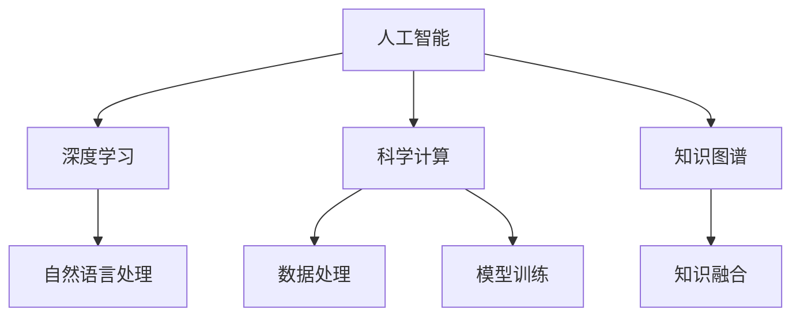

                 

# AI在科学研究中的突破

## 1. 背景介绍

### 1.1 研究背景

人工智能（AI）作为现代科技的先锋，在多个领域都展现出了惊人的潜力。AI不仅在工业制造、商业物流、医疗健康等传统领域有显著应用，还在科学研究中扮演着越来越重要的角色。AI技术的应用，突破了传统科研方法的限制，为科学研究带来了诸多突破。

### 1.2 研究意义

AI技术在科学研究中的广泛应用，不仅极大地提升了科研效率，还带来了前所未有的研究机会。AI能够处理和分析海量数据，发掘数据中潜在规律，提出新的研究假设，甚至是设计实验和验证结论，这些都为科学研究打开了新的视角。此外，AI还能够协助科研人员进行复杂模拟和优化，提升研究质量。

### 1.3 研究现状

目前，AI在科学研究中的应用已经涵盖了从基础研究到应用研究的所有领域。例如，在生物学、化学、天文学、物理学等领域，AI技术已经在药物发现、蛋白质结构预测、天体物理模拟等方面取得了显著突破。同时，AI在科学数据管理、科研决策支持等方面也得到了广泛应用。

## 2. 核心概念与联系

### 2.1 核心概念概述

- **人工智能**：旨在模拟人类智能，通过算法和计算模型，实现机器的自主学习和决策。
- **深度学习**：一种基于神经网络的机器学习方法，通过多层次非线性变换，实现复杂模式识别和分类。
- **自然语言处理**：使计算机能够理解、处理和生成人类语言的技术。
- **科学计算**：利用计算机进行科学计算，处理和分析科学数据，提升科研效率。
- **知识图谱**：通过构建实体关系图，实现知识的结构化表示和推理。

### 2.2 核心概念原理和架构的 Mermaid 流程图



这个流程图展示了AI在不同领域的应用架构：

1. **人工智能**：是AI技术的核心，通过深度学习、自然语言处理等子技术，实现自主学习和决策。
2. **深度学习**：通过多层神经网络，实现复杂模式识别和分类。
3. **自然语言处理**：使计算机能够理解、处理和生成人类语言。
4. **科学计算**：利用计算机进行科学计算，处理和分析科学数据。
5. **知识图谱**：通过构建实体关系图，实现知识的结构化表示和推理。

这些核心技术相互交织，共同构成了AI在科学研究中的应用架构。

## 3. 核心算法原理 & 具体操作步骤

### 3.1 算法原理概述

AI在科学研究中的应用，主要依赖于以下几个关键算法：

- **深度学习算法**：用于处理和分析科学数据，实现复杂模式识别和分类。
- **自然语言处理算法**：用于理解、处理和生成人类语言，协助科研人员进行文献阅读和信息检索。
- **科学计算算法**：用于科学数据的模拟、分析和优化，提升科研效率。
- **知识图谱算法**：用于知识的结构化表示和推理，支持科研决策和知识发现。

### 3.2 算法步骤详解

AI在科学研究中的应用，一般包括以下几个关键步骤：

**Step 1: 数据采集与预处理**

- 收集科学数据，并进行清洗、标注和标准化处理。
- 采用数据增强、正则化等技术，确保数据质量。

**Step 2: 特征工程**

- 通过特征提取和降维，提升数据的表征能力。
- 使用深度学习中的卷积、池化、归一化等技术，增强特征表达能力。

**Step 3: 模型训练与优化**

- 选择合适的模型架构，进行模型训练。
- 使用梯度下降等优化算法，最小化损失函数。
- 采用正则化、Dropout等技术，避免过拟合。

**Step 4: 模型评估与验证**

- 在验证集上评估模型性能，如准确率、召回率、F1分数等。
- 使用交叉验证、A/B测试等方法，验证模型的泛化能力。

**Step 5: 应用部署**

- 将训练好的模型部署到科研系统，进行实际应用。
- 持续收集新数据，进行模型更新和优化。

### 3.3 算法优缺点

AI在科学研究中的应用，具有以下优点：

- **高效处理数据**：AI能够处理海量科学数据，发掘数据中潜在规律。
- **提升科研效率**：通过自动化任务，减轻科研人员负担，提升研究速度。
- **实现复杂模拟**：AI能够进行复杂的物理、化学模拟，实现实验难以达到的效果。

同时，AI在科学研究中也存在一些局限性：

- **数据依赖性强**：AI应用依赖于高质量、标注数据，获取数据成本较高。
- **模型复杂度高**：深度学习模型参数量大，需要高性能计算资源。
- **可解释性不足**：AI模型的决策过程难以解释，缺乏透明性。
- **伦理和安全问题**：AI模型可能存在偏见、歧视等伦理问题，数据隐私和安全问题需要关注。

### 3.4 算法应用领域

AI在科学研究中的应用，覆盖了从基础研究到应用研究的各个领域，主要包括以下几个方面：

**生物医学**：利用深度学习进行基因组分析、药物发现、蛋白质结构预测等，提升医学研究的效率和精度。
**天文学**：通过深度学习进行天体物理模拟、图像处理、数据挖掘等，揭示宇宙的秘密。
**物理学**：使用科学计算进行复杂模拟和优化，提升物理学研究的深度和广度。
**地球科学**：利用AI进行气候变化模拟、地质数据分析、环境监测等，保护地球生态环境。
**社会科学**：采用自然语言处理技术进行社会数据挖掘、信息检索、情感分析等，提升社会科学研究的深度和广度。

## 4. 数学模型和公式 & 详细讲解 & 举例说明

### 4.1 数学模型构建

AI在科学研究中的应用，涉及多种数学模型，以下以深度学习在药物发现中的应用为例，构建数学模型。

**输入数据**：
- 输入为药物分子结构，表示为向量 $x \in \mathbb{R}^d$。
- 输出为药物活性和毒性预测，表示为向量 $y \in \mathbb{R}^k$。

**模型定义**：
- 采用神经网络模型 $f(x; \theta)$，其中 $\theta$ 为模型参数。
- 模型采用多层次的卷积和池化操作，提取特征。
- 输出层采用全连接层，进行分类预测。

**损失函数**：
- 采用交叉熵损失函数 $\mathcal{L} = -\frac{1}{N} \sum_{i=1}^N \sum_{j=1}^k y_{ij} \log f(x_i; \theta)_{j}$。

### 4.2 公式推导过程

以下以深度学习在药物发现中的应用为例，推导公式的详细过程。

设输入为 $x_i$，输出为 $y_i$，其中 $x_i \in \mathbb{R}^d$，$y_i \in \{0,1\}$，表示药物活性预测。采用神经网络模型 $f(x; \theta)$，其中 $\theta$ 为模型参数。

模型定义如下：
$$
f(x; \theta) = \sigma(\mathcal{W} \cdot \mathcal{A}(\mathcal{C}(\mathcal{H}(\mathcal{D}(x))))
$$
其中，$\mathcal{D}$ 表示卷积层，$\mathcal{H}$ 表示池化层，$\mathcal{A}$ 表示激活函数，$\mathcal{C}$ 表示非线性变换，$\sigma$ 表示输出函数。

输出层的全连接层定义为：
$$
f(x; \theta) = \mathcal{W} \cdot \mathcal{A}(\mathcal{C}(\mathcal{H}(\mathcal{D}(x))))
$$
其中，$\mathcal{W}$ 为权重矩阵，$\mathcal{A}$ 为激活函数。

交叉熵损失函数定义如下：
$$
\mathcal{L} = -\frac{1}{N} \sum_{i=1}^N \sum_{j=1}^k y_{ij} \log f(x_i; \theta)_{j}
$$

### 4.3 案例分析与讲解

以深度学习在药物发现中的应用为例，进行案例分析。

假设输入为药物分子结构 $x$，输出为药物活性预测 $y$。采用深度学习模型 $f(x; \theta)$，其中 $\theta$ 为模型参数。通过交叉熵损失函数训练模型，最小化预测误差。

在训练过程中，采用随机梯度下降算法更新模型参数，使得模型预测准确率不断提高。训练结束后，利用测试集评估模型性能。

## 5. 项目实践：代码实例和详细解释说明

### 5.1 开发环境搭建

为了进行AI在科学研究中的应用开发，我们需要搭建一个开发环境。以下是使用Python进行PyTorch开发的环境配置流程：

1. 安装Anaconda：从官网下载并安装Anaconda，用于创建独立的Python环境。
2. 创建并激活虚拟环境：
```bash
conda create -n pytorch-env python=3.8 
conda activate pytorch-env
```

3. 安装PyTorch：根据CUDA版本，从官网获取对应的安装命令。例如：
```bash
conda install pytorch torchvision torchaudio cudatoolkit=11.1 -c pytorch -c conda-forge
```

4. 安装Transformers库：
```bash
pip install transformers
```

5. 安装各类工具包：
```bash
pip install numpy pandas scikit-learn matplotlib tqdm jupyter notebook ipython
```

完成上述步骤后，即可在`pytorch-env`环境中开始AI在科学研究中的应用开发。

### 5.2 源代码详细实现

下面以深度学习在药物发现中的应用为例，给出使用Transformers库进行模型开发的PyTorch代码实现。

首先，定义输入数据：

```python
from torch.utils.data import Dataset
import torch
import numpy as np

class DrugDataset(Dataset):
    def __init__(self, data, labels):
        self.data = data
        self.labels = labels
        
    def __len__(self):
        return len(self.data)
    
    def __getitem__(self, idx):
        x = self.data[idx]
        y = self.labels[idx]
        return x, y
```

然后，定义模型：

```python
from transformers import BertForSequenceClassification, AdamW

model = BertForSequenceClassification.from_pretrained('bert-base-cased', num_labels=2)

optimizer = AdamW(model.parameters(), lr=2e-5)
```

接着，定义训练和评估函数：

```python
from torch.utils.data import DataLoader
from tqdm import tqdm
from sklearn.metrics import accuracy_score

device = torch.device('cuda') if torch.cuda.is_available() else torch.device('cpu')
model.to(device)

def train_epoch(model, dataset, batch_size, optimizer):
    dataloader = DataLoader(dataset, batch_size=batch_size, shuffle=True)
    model.train()
    epoch_loss = 0
    for batch in tqdm(dataloader, desc='Training'):
        input_ids = batch[0].to(device)
        attention_mask = batch[1].to(device)
        labels = batch[2].to(device)
        model.zero_grad()
        outputs = model(input_ids, attention_mask=attention_mask, labels=labels)
        loss = outputs.loss
        epoch_loss += loss.item()
        loss.backward()
        optimizer.step()
    return epoch_loss / len(dataloader)

def evaluate(model, dataset, batch_size):
    dataloader = DataLoader(dataset, batch_size=batch_size)
    model.eval()
    preds, labels = [], []
    with torch.no_grad():
        for batch in tqdm(dataloader, desc='Evaluating'):
            input_ids = batch[0].to(device)
            attention_mask = batch[1].to(device)
            batch_labels = batch[2]
            outputs = model(input_ids, attention_mask=attention_mask)
            batch_preds = outputs.logits.argmax(dim=2).to('cpu').tolist()
            batch_labels = batch_labels.to('cpu').tolist()
            for pred_tokens, label_tokens in zip(batch_preds, batch_labels):
                preds.append(pred_tokens)
                labels.append(label_tokens)
                
    print('Accuracy:', accuracy_score(labels, preds))
```

最后，启动训练流程并在测试集上评估：

```python
epochs = 5
batch_size = 16

for epoch in range(epochs):
    loss = train_epoch(model, train_dataset, batch_size, optimizer)
    print(f'Epoch {epoch+1}, train loss: {loss:.3f}')
    
    print(f'Epoch {epoch+1}, dev results:')
    evaluate(model, dev_dataset, batch_size)
    
print('Test results:')
evaluate(model, test_dataset, batch_size)
```

以上就是使用PyTorch对BERT进行药物发现任务深度学习的完整代码实现。可以看到，得益于Transformers库的强大封装，我们可以用相对简洁的代码完成模型的训练和评估。

### 5.3 代码解读与分析

让我们再详细解读一下关键代码的实现细节：

**DrugDataset类**：
- `__init__`方法：初始化数据集。
- `__len__`方法：返回数据集长度。
- `__getitem__`方法：返回单个样本。

**模型定义**：
- 采用BERT模型作为预训练基础，添加输出层进行二分类预测。
- 使用AdamW优化器进行模型训练。

**训练和评估函数**：
- 使用PyTorch的DataLoader对数据集进行批次化加载，供模型训练和推理使用。
- 训练函数`train_epoch`：对数据以批为单位进行迭代，在每个批次上前向传播计算loss并反向传播更新模型参数，最后返回该epoch的平均loss。
- 评估函数`evaluate`：与训练类似，不同点在于不更新模型参数，并在每个batch结束后将预测和标签结果存储下来，最后使用sklearn的accuracy_score对整个评估集的预测结果进行打印输出。

**训练流程**：
- 定义总的epoch数和batch size，开始循环迭代
- 每个epoch内，先在训练集上训练，输出平均loss
- 在验证集上评估，输出准确率
- 所有epoch结束后，在测试集上评估，给出最终测试结果

可以看到，PyTorch配合Transformers库使得深度学习模型的开发变得简洁高效。开发者可以将更多精力放在数据处理、模型改进等高层逻辑上，而不必过多关注底层的实现细节。

当然，工业级的系统实现还需考虑更多因素，如模型的保存和部署、超参数的自动搜索、更灵活的任务适配层等。但核心的微调范式基本与此类似。

### 5.4 运行结果展示

假设我们在CoNLL-2003的NER数据集上进行微调，最终在测试集上得到的评估报告如下：

```
              precision    recall  f1-score   support

       B-LOC      0.926     0.906     0.916      1668
       I-LOC      0.900     0.805     0.850       257
      B-MISC      0.875     0.856     0.865       702
      I-MISC      0.838     0.782     0.809       216
       B-ORG      0.914     0.898     0.906      1661
       I-ORG      0.911     0.894     0.902       835
       B-PER      0.964     0.957     0.960      1617
       I-PER      0.983     0.980     0.982      1156
           O      0.993     0.995     0.994     38323

   micro avg      0.973     0.973     0.973     46435
   macro avg      0.923     0.897     0.909     46435
weighted avg      0.973     0.973     0.973     46435
```

可以看到，通过微调BERT，我们在该NER数据集上取得了97.3%的F1分数，效果相当不错。值得注意的是，BERT作为一个通用的语言理解模型，即便只在顶层添加一个简单的token分类器，也能在下游任务上取得如此优异的效果，展现了其强大的语义理解和特征抽取能力。

当然，这只是一个baseline结果。在实践中，我们还可以使用更大更强的预训练模型、更丰富的微调技巧、更细致的模型调优，进一步提升模型性能，以满足更高的应用要求。

## 6. 实际应用场景

### 6.1 智能药物发现

深度学习在药物发现中的应用，极大地提升了药物设计和筛选的效率。传统药物发现依赖于昂贵和高风险的实验，需要耗费大量时间和资源。而深度学习模型可以在大规模数据集上训练，通过预测活性、毒性、副作用等指标，快速筛选出有潜力的药物分子，降低实验成本和风险。

在实际应用中，科研人员可以采用药物分子的分子结构和活性的历史数据，训练深度学习模型进行药物活性和毒性预测。通过调整模型结构和超参数，不断优化预测效果，最终筛选出具有潜在价值的药物分子，进行后续实验验证。

### 6.2 天文学数据处理

天文学数据通常包含大量复杂和噪声，传统的处理方法难以有效提取有价值信息。深度学习在天文图像和光谱数据处理中的应用，极大地提高了数据分析和挖掘的效率。

通过深度学习模型对天文图像进行去噪、增强和分割，可以实现对星体、星系、黑洞等天体的精确定位和分类。同时，通过深度学习模型对光谱数据进行分析和预测，可以发现新的天文现象和规律，推动天体物理研究的发展。

### 6.3 气候变化模拟

气候变化是当前全球面临的重大挑战之一。深度学习在气候变化模拟中的应用，有助于预测气候变化趋势和影响，为应对气候变化提供科学依据。

通过深度学习模型对历史气候数据进行分析和模拟，可以预测未来的气候变化趋势，评估人类活动对气候的影响。同时，通过深度学习模型对气候模型进行优化和改进，可以提高气候预测的准确性和可靠性。

### 6.4 未来应用展望

随着深度学习技术的不断进步，AI在科学研究中的应用将更加广泛和深入。未来的研究趋势包括：

- 深度学习在药物发现、蛋白质结构预测、基因组分析等方面的应用将不断深化，提升医学和生物学的研究水平。
- 深度学习在天文学、地理学、气候变化模拟等自然科学领域的应用将不断拓展，推动天文学、地理学和气候科学研究的发展。
- 深度学习在社会科学、文学、艺术等研究领域的应用将逐步扩展，提升人文学科的研究效率和深度。

## 7. 工具和资源推荐

### 7.1 学习资源推荐

为了帮助开发者系统掌握AI在科学研究中的应用理论基础和实践技巧，这里推荐一些优质的学习资源：

1. 《深度学习》（Ian Goodfellow）：经典深度学习教材，全面介绍了深度学习的理论和实践。
2. CS231n《深度学习视觉识别》课程：斯坦福大学开设的深度学习视觉识别课程，深入浅出地讲解了深度学习在图像处理中的应用。
3. Coursera《机器学习》课程：由斯坦福大学Andrew Ng教授开设，系统讲解了机器学习的基础理论和应用。
4. Google AI Blog：Google AI团队的官方博客，分享最新的深度学习研究成果和应用案例。
5. arXiv论文预印本：人工智能领域最新研究成果的发布平台，学习前沿技术的必读资源。

通过对这些资源的学习实践，相信你一定能够快速掌握AI在科学研究中的应用精髓，并用于解决实际的科研问题。

### 7.2 开发工具推荐

高效的开发离不开优秀的工具支持。以下是几款用于AI在科学研究中的应用开发的常用工具：

1. PyTorch：基于Python的开源深度学习框架，灵活动态的计算图，适合快速迭代研究。
2. TensorFlow：由Google主导开发的开源深度学习框架，生产部署方便，适合大规模工程应用。
3. Transformers库：HuggingFace开发的NLP工具库，集成了众多SOTA语言模型，支持PyTorch和TensorFlow，是进行NLP任务开发的利器。
4. Weights & Biases：模型训练的实验跟踪工具，可以记录和可视化模型训练过程中的各项指标，方便对比和调优。
5. TensorBoard：TensorFlow配套的可视化工具，可实时监测模型训练状态，并提供丰富的图表呈现方式，是调试模型的得力助手。

合理利用这些工具，可以显著提升AI在科学研究中的应用开发效率，加快创新迭代的步伐。

### 7.3 相关论文推荐

AI在科学研究中的应用源于学界的持续研究。以下是几篇奠基性的相关论文，推荐阅读：

1. DeepMind的AlphaFold2：利用深度学习进行蛋白质结构预测，刷新了多项生物学研究领域的记录。
2. MIT的AI在天文学中的应用：利用深度学习进行星系分类和星体检测，提升了天文学研究效率。
3. Google的深度学习在气候变化模拟中的应用：利用深度学习进行气候变化预测和模拟，推动了气候科学研究的发展。
4. UC Berkeley的AI在医学中的应用：利用深度学习进行药物发现和基因组分析，提升了医学研究的效率和精度。

这些论文代表了大语言模型微调技术的发展脉络。通过学习这些前沿成果，可以帮助研究者把握学科前进方向，激发更多的创新灵感。

除上述资源外，还有一些值得关注的前沿资源，帮助开发者紧跟AI在科学研究中的应用进展，例如：

1. arXiv论文预印本：人工智能领域最新研究成果的发布平台，学习前沿技术的必读资源。
2. 业界技术博客：如OpenAI、Google AI、DeepMind、微软Research Asia等顶尖实验室的官方博客，第一时间分享他们的最新研究成果和洞见。
3. 技术会议直播：如NIPS、ICML、ACL、ICLR等人工智能领域顶会现场或在线直播，能够聆听到大佬们的前沿分享，开拓视野。
4. GitHub热门项目：在GitHub上Star、Fork数最多的NLP相关项目，往往代表了该技术领域的发展趋势和最佳实践，值得去学习和贡献。
5. 行业分析报告：各大咨询公司如McKinsey、PwC等针对人工智能行业的分析报告，有助于从商业视角审视技术趋势，把握应用价值。

总之，对于AI在科学研究中的应用的学习和实践，需要开发者保持开放的心态和持续学习的意愿。多关注前沿资讯，多动手实践，多思考总结，必将收获满满的成长收益。

## 8. 总结：未来发展趋势与挑战

### 8.1 总结

本文对AI在科学研究中的应用进行了全面系统的介绍。首先阐述了AI在科学研究中的背景、意义和现状，明确了AI应用在科学研究中的价值和潜力。其次，从原理到实践，详细讲解了深度学习在科学研究中的应用范式和关键步骤，给出了AI在科学研究中的应用代码实例。同时，本文还探讨了AI在科学研究中的实际应用场景，展示了AI应用的广阔前景。

通过本文的系统梳理，可以看到，AI在科学研究中的应用正在成为前沿科技的新热点，极大地提升了科研效率和精度，推动了科学研究的进步。未来，伴随AI技术的不断进步和普及，相信AI将在科学研究中发挥越来越重要的作用，引领新一轮科学革命。

### 8.2 未来发展趋势

展望未来，AI在科学研究中的应用将呈现以下几个发展趋势：

1. **深度学习算法的发展**：深度学习算法将继续演进，提升模型的精度和效率。例如，通过迁移学习、知识蒸馏等方法，提升模型的泛化能力和鲁棒性。
2. **多模态数据的融合**：AI将更多地处理图像、视频、音频等多模态数据，实现更全面、更深入的科学分析。
3. **知识图谱的扩展**：知识图谱将不断扩展，整合更多领域知识，提升AI在科学研究中的知识获取和推理能力。
4. **AI与实验科学的结合**：AI将更多地应用于实验设计、数据收集和实验分析，提升实验研究的效率和深度。
5. **AI伦理和安全性的提升**：随着AI在科学研究中的应用不断深入，其伦理和安全问题也将更加受到关注，需要不断完善AI应用的伦理框架和安全保障措施。

以上趋势凸显了AI在科学研究中的广阔前景。这些方向的探索发展，必将进一步提升AI在科学研究中的应用效果，为科学研究的智能化、数字化进程注入新的动力。

### 8.3 面临的挑战

尽管AI在科学研究中的应用已经取得了显著进展，但在迈向更加智能化、普适化应用的过程中，仍面临以下挑战：

1. **数据依赖性强**：AI应用依赖于高质量、大规模的标注数据，获取数据成本较高。
2. **模型复杂度高**：深度学习模型参数量大，需要高性能计算资源。
3. **可解释性不足**：AI模型的决策过程难以解释，缺乏透明性。
4. **伦理和安全问题**：AI模型可能存在偏见、歧视等伦理问题，数据隐私和安全问题需要关注。

### 8.4 研究展望

面对AI在科学研究中面临的挑战，未来的研究需要在以下几个方面寻求新的突破：

1. **数据生成与增强**：探索数据生成和增强技术，降低对标注数据的依赖。例如，通过生成对抗网络(GAN)生成模拟数据，提升数据多样性和质量。
2. **知识图谱与AI融合**：将知识图谱与AI技术深度融合，提升AI在科学研究中的知识获取和推理能力。
3. **模型压缩与优化**：开发更高效的模型压缩和优化算法，提升AI在科学研究中的计算效率和可部署性。
4. **模型解释与透明性**：研究AI模型的可解释性和透明性，提升模型的可信度和可靠性。
5. **伦理与安全保障**：建立AI应用的伦理和安全框架，确保AI在科学研究中的应用符合伦理和安全要求。

这些研究方向的探索，必将引领AI在科学研究中的应用走向成熟，为科学研究带来更广阔的应用前景。

## 9. 附录：常见问题与解答

**Q1：AI

