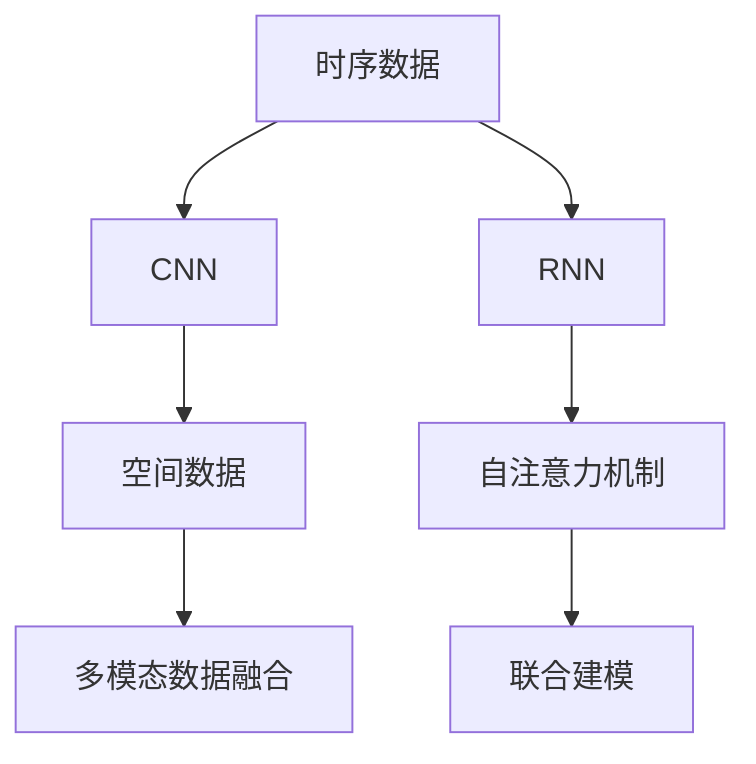
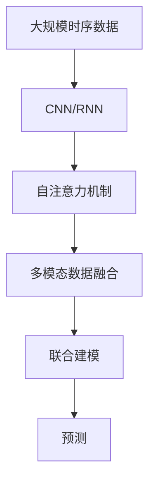
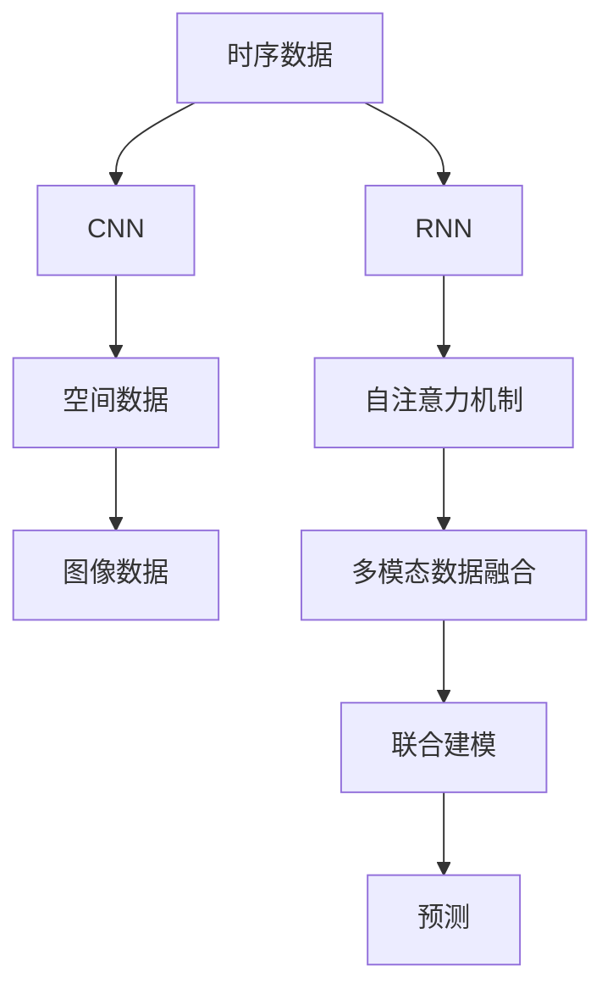

                 

## 1. 背景介绍

### 1.1 问题由来

时空建模在人工智能领域具有重要的地位，它将时间和空间两个维度结合起来，分析事物在时间和空间中的演变和交互，从而预测未来的发展趋势。时空建模的应用广泛，包括股票市场预测、天气预报、城市交通优化、自然灾害预警等。

然而，传统的时空建模方法通常依赖于手工特征工程，缺乏对复杂时空数据的有效建模能力。近年来，深度学习技术的飞速发展，尤其是卷积神经网络(CNN)和循环神经网络(RNN)的提出，为时空建模提供了新的解决方案。特别是自注意力机制的引入，使得深度学习模型能够更好地理解和处理时序和空间数据。

### 1.2 问题核心关键点

时空建模的核心在于如何利用深度学习模型对时序和空间数据进行建模，并在不同任务中进行有效的预测和优化。核心点包括：

1. **时序建模**：利用RNN或LSTM等模型捕捉时序数据的动态特性。
2. **空间建模**：利用CNN或Spatial Transformer等模型捕捉空间数据的静态特性。
3. **时空联合建模**：结合时序和空间模型，进行联合预测。
4. **多模态数据融合**：将时序和空间数据与文本、图像等多模态数据进行融合，提升模型性能。

### 1.3 问题研究意义

研究时空建模方法，对于提升各类应用场景的时空预测能力，优化系统性能，具有重要意义：

1. **精度提升**：通过深度学习模型，能够捕捉复杂的时空特性，提升预测精度。
2. **自动化特征工程**：深度学习模型自动学习特征，减少手动干预，提高效率。
3. **泛化能力**：深度学习模型能够处理不同场景的时空数据，增强模型的泛化能力。
4. **实时性**：深度学习模型可以通过GPU等加速设备实现实时预测，满足实际应用需求。
5. **可解释性**：深度学习模型提供了可视化工具，帮助理解模型的内部机制。

## 2. 核心概念与联系

### 2.1 核心概念概述

为了更好地理解时空建模，本节将介绍几个密切相关的核心概念：

- **时序数据**：指随时间变化的数据，如股票价格、气象数据、交通流量等。
- **空间数据**：指在特定空间范围内分布的数据，如地理位置、温度分布等。
- **卷积神经网络(CNN)**：一种强大的图像处理模型，通过卷积操作捕捉空间局部特征。
- **循环神经网络(RNN)**：一种处理时序数据的模型，通过循环结构捕捉时序依赖。
- **自注意力机制(Attention)**：一种用于提升深度学习模型跨步信息捕捉能力的机制。
- **多模态数据融合**：将不同类型的数据（如文本、图像、时序数据）进行融合，提升模型性能。

这些概念之间的逻辑关系可以通过以下Mermaid流程图来展示：



这个流程图展示了几类关键概念及其之间的关系：

1. 时序数据通过CNN或RNN进行处理。
2. 空间数据通过CNN进行处理。
3. 多模态数据通过融合技术进行整合。
4. 自注意力机制提升模型的跨步信息捕捉能力。
5. 联合建模将时序和空间模型进行整合。

### 2.2 概念间的关系

这些核心概念之间存在着紧密的联系，形成了时空建模的整体生态系统。下面我通过几个Mermaid流程图来展示这些概念之间的关系。

#### 2.2.1 时空建模的一般流程



这个流程图展示了时空建模的一般流程：

1. 收集大规模时序数据，使用CNN或RNN进行处理。
2. 引入自注意力机制，提升模型对跨步信息的捕捉能力。
3. 将时序数据与空间数据、多模态数据进行融合。
4. 使用联合建模方法，将时序和空间模型进行整合。
5. 通过训练后的模型进行预测，得到时空数据的变化趋势。

#### 2.2.2 多模态数据融合的技术路径



这个流程图展示了多模态数据融合的技术路径：

1. 时序数据通过CNN和RNN进行处理。
2. 引入自注意力机制，提升模型对跨步信息的捕捉能力。
3. 空间数据和图像数据分别通过CNN进行处理。
4. 使用多模态数据融合技术，将不同类型的数据进行整合。
5. 使用联合建模方法，将时序和空间模型进行整合。
6. 通过训练后的模型进行预测，得到时空数据的变化趋势。

## 3. 核心算法原理 & 具体操作步骤

### 3.1 算法原理概述

时空建模的核心算法包括时序建模、空间建模、多模态数据融合以及联合建模等。本节将对这些算法原理进行详细阐述。

- **时序建模**：使用RNN或LSTM模型，捕捉时序数据的动态特性。
- **空间建模**：使用CNN模型，捕捉空间数据的静态特性。
- **多模态数据融合**：将时序和空间数据与文本、图像等多模态数据进行融合。
- **联合建模**：结合时序和空间模型，进行联合预测。

### 3.2 算法步骤详解

#### 3.2.1 时序建模

时序建模通常使用RNN或LSTM模型，其核心思想是通过循环结构，捕捉时序数据的动态特性。具体步骤如下：

1. **输入预处理**：将原始时序数据进行归一化、标准化等预处理操作。
2. **序列嵌入**：将时序数据转换为模型的输入张量。
3. **前向传播**：通过RNN或LSTM模型，对时序数据进行前向传播。
4. **输出解码**：对模型输出进行解码，得到时序数据的预测值。
5. **损失计算**：计算预测值与真实值之间的损失，进行反向传播。
6. **参数更新**：根据损失梯度更新模型参数。

#### 3.2.2 空间建模

空间建模通常使用CNN模型，其核心思想是通过卷积操作，捕捉空间数据的静态特性。具体步骤如下：

1. **输入预处理**：将原始空间数据进行归一化、标准化等预处理操作。
2. **特征提取**：通过CNN模型，对空间数据进行特征提取。
3. **池化操作**：对特征图进行池化操作，提取重要的空间特征。
4. **全连接层**：将池化后的特征图输入全连接层，进行特征融合。
5. **输出解码**：对全连接层输出进行解码，得到空间数据的预测值。
6. **损失计算**：计算预测值与真实值之间的损失，进行反向传播。
7. **参数更新**：根据损失梯度更新模型参数。

#### 3.2.3 多模态数据融合

多模态数据融合的目标是将不同类型的数据进行整合，提升模型的性能。具体步骤如下：

1. **时序数据处理**：对时序数据进行时序建模。
2. **空间数据处理**：对空间数据进行空间建模。
3. **特征提取**：对时序和空间数据分别进行特征提取。
4. **特征融合**：将时序和空间特征进行融合，得到多模态特征。
5. **模型训练**：对多模态特征进行联合建模。
6. **输出解码**：对联合模型输出进行解码，得到时空数据的预测值。
7. **损失计算**：计算预测值与真实值之间的损失，进行反向传播。
8. **参数更新**：根据损失梯度更新模型参数。

#### 3.2.4 联合建模

联合建模的目标是将时序和空间模型进行整合，进行联合预测。具体步骤如下：

1. **时序数据处理**：对时序数据进行时序建模。
2. **空间数据处理**：对空间数据进行空间建模。
3. **特征提取**：对时序和空间数据分别进行特征提取。
4. **特征融合**：将时序和空间特征进行融合，得到多模态特征。
5. **联合模型训练**：对多模态特征进行联合建模。
6. **输出解码**：对联合模型输出进行解码，得到时空数据的预测值。
7. **损失计算**：计算预测值与真实值之间的损失，进行反向传播。
8. **参数更新**：根据损失梯度更新模型参数。

### 3.3 算法优缺点

时空建模具有以下优点：

1. **自动特征提取**：深度学习模型能够自动学习时空数据中的特征，减少了手动特征工程的工作量。
2. **模型复杂性**：深度学习模型通过多个层级进行信息传递，能够更好地捕捉复杂的时空特性。
3. **实时性**：深度学习模型可以利用GPU等加速设备进行快速训练和推理。
4. **泛化能力**：深度学习模型能够处理不同类型和规模的时空数据，具有较好的泛化能力。

同时，时空建模也存在一些缺点：

1. **模型复杂度高**：深度学习模型通常包含大量参数，训练和推理成本较高。
2. **过拟合风险**：由于模型复杂度高，容易过拟合。
3. **数据依赖性强**：深度学习模型对数据质量和数量要求较高。
4. **可解释性差**：深度学习模型通常被视为"黑盒"，难以解释其内部机制。

### 3.4 算法应用领域

时空建模在多个领域具有广泛的应用，包括但不限于：

1. **股票市场预测**：利用时序和空间数据，预测股票价格和市场走势。
2. **天气预报**：利用时序和空间数据，预测天气变化和极端天气事件。
3. **城市交通优化**：利用时序和空间数据，优化交通流量和交通管理。
4. **自然灾害预警**：利用时序和空间数据，预测地震、洪水等自然灾害。
5. **医疗诊断**：利用时序和空间数据，预测疾病发展和治疗效果。

## 4. 数学模型和公式 & 详细讲解 & 举例说明

### 4.1 数学模型构建

#### 4.1.1 时序建模

时序建模通常使用RNN或LSTM模型，其数学模型可以表示为：

$$
h_t = f(h_{t-1}, x_t)
$$

其中，$h_t$ 表示在时间$t$的隐藏状态，$f$ 表示时间$t$的前向传播函数，$x_t$ 表示时间$t$的输入数据。

#### 4.1.2 空间建模

空间建模通常使用CNN模型，其数学模型可以表示为：

$$
x_i = g(x_{i-1}, x_{i+1})
$$

其中，$x_i$ 表示在位置$i$的像素值，$g$ 表示位置$i$的卷积操作。

#### 4.1.3 多模态数据融合

多模态数据融合通常使用集成学习技术，其数学模型可以表示为：

$$
y = \alpha x_{seq} + (1-\alpha) x_{space} + \sum_k w_k x_{mod_k}
$$

其中，$y$ 表示多模态数据融合的结果，$x_{seq}$ 表示时序数据，$x_{space}$ 表示空间数据，$x_{mod_k}$ 表示其他模态数据，$\alpha$ 表示时序数据的权重，$w_k$ 表示其他模态数据的权重。

#### 4.1.4 联合建模

联合建模通常使用集成学习技术，其数学模型可以表示为：

$$
y = \beta y_{seq} + (1-\beta) y_{space} + \sum_k w_k y_{mod_k}
$$

其中，$y$ 表示联合建模的结果，$y_{seq}$ 表示时序建模的结果，$y_{space}$ 表示空间建模的结果，$y_{mod_k}$ 表示其他模态建模的结果，$\beta$ 表示时序建模的权重，$w_k$ 表示其他模态建模的权重。

### 4.2 公式推导过程

#### 4.2.1 时序建模

时序建模的公式推导过程如下：

1. **输入预处理**：
   $$
   x_t = \frac{x_{t-1} - \mu}{\sigma}
   $$

   其中，$x_t$ 表示归一化后的输入数据，$\mu$ 表示均值，$\sigma$ 表示标准差。

2. **序列嵌入**：
   $$
   h_0 = 0
   $$

   其中，$h_0$ 表示初始隐藏状态。

3. **前向传播**：
   $$
   h_t = f(h_{t-1}, x_t)
   $$

   其中，$h_t$ 表示时间$t$的隐藏状态，$f$ 表示时间$t$的前向传播函数，$x_t$ 表示时间$t$的输入数据。

4. **输出解码**：
   $$
   y_t = g(h_t)
   $$

   其中，$y_t$ 表示时间$t$的输出值，$g$ 表示输出解码函数，$h_t$ 表示时间$t$的隐藏状态。

5. **损失计算**：
   $$
   L = \frac{1}{N} \sum_{i=1}^N \ell(y_i, \hat{y_i})
   $$

   其中，$L$ 表示损失函数，$\ell$ 表示损失函数的具体形式，$y_i$ 表示真实值，$\hat{y_i}$ 表示预测值。

6. **参数更新**：
   $$
   \theta \leftarrow \theta - \eta \nabla_{\theta} L
   $$

   其中，$\theta$ 表示模型参数，$\eta$ 表示学习率，$\nabla_{\theta} L$ 表示损失函数的梯度。

#### 4.2.2 空间建模

空间建模的公式推导过程如下：

1. **输入预处理**：
   $$
   x_i = \frac{x_{i-1} - \mu}{\sigma}
   $$

   其中，$x_i$ 表示归一化后的输入数据，$\mu$ 表示均值，$\sigma$ 表示标准差。

2. **特征提取**：
   $$
   x_i = g(x_{i-1}, x_{i+1})
   $$

   其中，$x_i$ 表示位置$i$的像素值，$g$ 表示位置$i$的卷积操作。

3. **池化操作**：
   $$
   x_i' = \max(x_i)
   $$

   其中，$x_i'$ 表示位置$i$的池化值。

4. **全连接层**：
   $$
   y = w \cdot x_i' + b
   $$

   其中，$y$ 表示全连接层的输出值，$w$ 表示权重矩阵，$b$ 表示偏置向量。

5. **输出解码**：
   $$
   y = g(y)
   $$

   其中，$y$ 表示空间数据的预测值，$g$ 表示输出解码函数。

6. **损失计算**：
   $$
   L = \frac{1}{N} \sum_{i=1}^N \ell(y_i, \hat{y_i})
   $$

   其中，$L$ 表示损失函数，$\ell$ 表示损失函数的具体形式，$y_i$ 表示真实值，$\hat{y_i}$ 表示预测值。

7. **参数更新**：
   $$
   \theta \leftarrow \theta - \eta \nabla_{\theta} L
   $$

   其中，$\theta$ 表示模型参数，$\eta$ 表示学习率，$\nabla_{\theta} L$ 表示损失函数的梯度。

#### 4.2.3 多模态数据融合

多模态数据融合的公式推导过程如下：

1. **时序数据处理**：
   $$
   x_{seq} = \frac{x_{seq_{t-1}} - \mu_{seq}}{\sigma_{seq}}
   $$

   其中，$x_{seq}$ 表示归一化后的时序数据，$\mu_{seq}$ 表示时序数据的均值，$\sigma_{seq}$ 表示时序数据的标准差。

2. **空间数据处理**：
   $$
   x_{space} = \frac{x_{space_{i-1}} - \mu_{space}}{\sigma_{space}}
   $$

   其中，$x_{space}$ 表示归一化后的空间数据，$\mu_{space}$ 表示空间数据的均值，$\sigma_{space}$ 表示空间数据的标准差。

3. **特征提取**：
   $$
   x_{seq} = f_{seq}(x_{seq})
   $$

   $$
   x_{space} = f_{space}(x_{space})
   $$

   其中，$f_{seq}$ 表示时序数据的前向传播函数，$f_{space}$ 表示空间数据的前向传播函数。

4. **特征融合**：
   $$
   x_{fuse} = \alpha x_{seq} + (1-\alpha) x_{space} + \sum_k w_k x_{mod_k}
   $$

   其中，$x_{fuse}$ 表示融合后的多模态特征，$\alpha$ 表示时序数据的权重，$w_k$ 表示其他模态数据的权重。

5. **模型训练**：
   $$
   y = g(x_{fuse})
   $$

   其中，$y$ 表示多模态数据融合的结果，$g$ 表示模型训练函数，$x_{fuse}$ 表示融合后的多模态特征。

6. **输出解码**：
   $$
   y = g(y)
   $$

   其中，$y$ 表示多模态数据融合的预测值，$g$ 表示输出解码函数。

7. **损失计算**：
   $$
   L = \frac{1}{N} \sum_{i=1}^N \ell(y_i, \hat{y_i})
   $$

   其中，$L$ 表示损失函数，$\ell$ 表示损失函数的具体形式，$y_i$ 表示真实值，$\hat{y_i}$ 表示预测值。

8. **参数更新**：
   $$
   \theta \leftarrow \theta - \eta \nabla_{\theta} L
   $$

   其中，$\theta$ 表示模型参数，$\eta$ 表示学习率，$\nabla_{\theta} L$ 表示损失函数的梯度。

#### 4.2.4 联合建模

联合建模的公式推导过程如下：

1. **时序数据处理**：
   $$
   x_{seq} = \frac{x_{seq_{t-1}} - \mu_{seq}}{\sigma_{seq}}
   $$

   其中，$x_{seq}$ 表示归一化后的时序数据，$\mu_{seq}$ 表示时序数据的均值，$\sigma_{seq}$ 表示时序数据的标准差。

2. **空间数据处理**：
   $$
   x_{space} = \frac{x_{space_{i-1}} - \mu_{space}}{\sigma_{space}}
   $$

   其中，$x_{space}$ 表示归一化后的空间数据，$\mu_{space}$ 表示空间数据的均值，$\sigma_{space}$ 表示空间数据的标准差。

3. **特征提取**：
   $$
   x_{seq} = f_{seq}(x_{seq})
   $$

   $$
   x_{space} = f_{space}(x_{space})
   $$

   其中，$f_{seq}$ 表示时序数据的前向传播函数，$f_{space}$ 表示空间数据的前向传播函数。

4. **特征融合**：
   $$
   x_{fuse} = \alpha x_{seq} + (1-\alpha) x_{space} + \sum_k w_k x_{mod_k}
   $$

   其中，$x_{fuse}$ 表示融合后的多模态特征，$\alpha$ 表示时序数据的权重，$w_k$ 表示其他模态数据的权重。

5. **联合模型训练**：
   $$
   y = \beta y_{seq} + (1-\beta) y_{space} + \sum_k w_k y_{mod_k}
   $$

   其中，$y$ 表示联合建模的结果，$y_{seq}$ 表示时序建模的结果，$y_{space}$ 表示空间建模的结果，$y_{mod_k}$ 表示其他模态建模的结果，$\beta$ 表示时序建模的权重，$w_k$ 表示其他模态建模的权重。

6. **输出解码**：
   $$
   y = g(y)
   $$

   其中，$y$ 表示联合建模的预测值，$g$ 表示输出解码函数。

7. **损失计算**：
   $$
   L = \frac{1}{N} \sum_{i=1}^N \ell(y_i, \hat{y_i})
   $$

   其中，$L$ 表示损失函数，$\ell$ 表示损失函数的具体形式，$y_i$ 表示真实值，$\hat{y_i}$ 表示预测值。

8. **参数更新**：
   $$
   \theta \leftarrow \theta - \eta \nabla_{\theta} L
   $$

   其中，$\theta$ 表示模型参数，$\eta$ 表示学习率，$\nabla_{\theta} L$ 表示损失函数的梯度。

### 4.3 案例分析与讲解

#### 4.3.1 股票市场预测

股票市场预测是时空建模的典型应用场景之一。假设我们需要预测股票市场的走势，可以采用以下步骤：

1. **数据收集**：收集历史股价数据和市场指标数据。
2. **数据预处理**：对原始数据进行归一化、标准化等预处理操作。
3. **时序建模**：使用RNN或LSTM模型对历史股价数据进行建模。
4. **空间建模**：使用CNN模型对市场指标数据进行建模。
5. **多模态数据融合**：将时序数据和空间数据进行融合，得到多模态数据。
6. **联合建模**：使用集成学习技术，对多模态数据进行联合建模。
7. **模型训练**：使用历史数据对模型进行训练。
8. **预测与评估**：使用模型对未来股价进行预测，并评估其准确性。

#### 4.3.2 天气预报

天气预报是时空建模的另一个重要应用场景。假设我们需要预测某地的未来天气情况，可以采用以下步骤：

1. **数据收集**：收集历史气象数据和气象卫星图像数据。
2. **数据预处理**：对原始数据进行归一化、标准化等预处理操作。
3. **时序建模**：使用RNN或LSTM模型对历史气象数据进行建模。
4. **空间建模**：使用CNN模型对气象卫星图像数据进行建模。
5. **多模态数据融合**：将时序数据和空间数据进行融合，得到多模态数据。
6. **联合建模**：使用集成学习技术，对多模态数据进行联合建模。
7. **模型训练**：使用历史数据对模型进行训练。
8. **预测与评估**：使用模型对未来天气进行预测，并评估其准确性。

## 5. 项目实践：代码实例和详细解释说明

### 5.1 开发环境搭建

在进行时空建模实践前，我们需要准备好开发环境。以下是使用Python进行PyTorch开发的环境配置流程：

1. 安装Anaconda：从官网下载并安装Anaconda，用于创建独立的Python环境。

2. 创建并激活虚拟环境：
```bash
conda create -n pytorch-env python=3.8 
conda activate pytorch-env
```

3. 安装PyTorch：根据CUDA版本，从官网获取对应的安装命令。例如：
```bash
conda install pytorch torchvision torchaudio cudatoolkit=11.1 -c pytorch -c conda-forge
```

4. 安装TensorFlow：
```bash
conda install tensorflow
```

5. 安装Keras：
```bash
conda install keras
```

6. 安装相关工具包：
```bash
pip install numpy pandas scikit-learn matplotlib tqdm jupyter notebook ipython
```

完成上述步骤后，即可在`pytorch-env`环境中开始时空建模的实践。

### 5.2 源代码详细实现

下面我们以天气预报为例，给出使用TensorFlow进行时空建模的Python代码实现。

首先，定义数据处理函数：

```python
import tensorflow as tf
from tensorflow.keras.layers import Input, Conv2D, MaxPooling2D, Flatten, Dense, LSTM

def preprocess_data(data, seq

