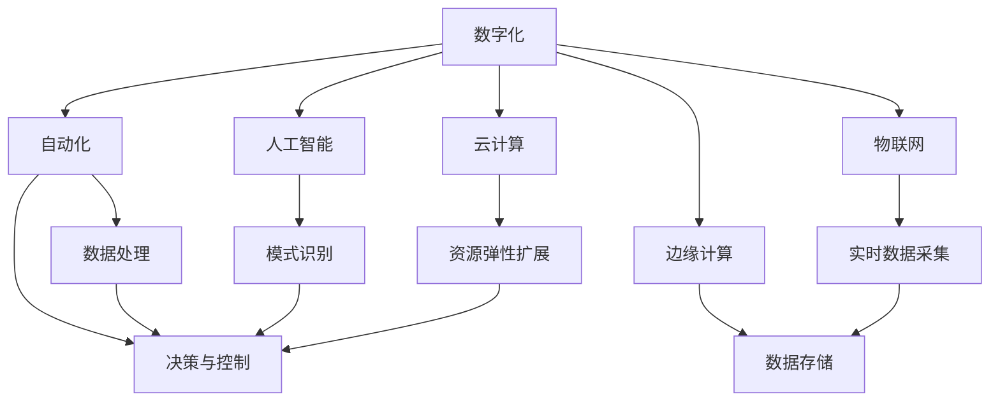
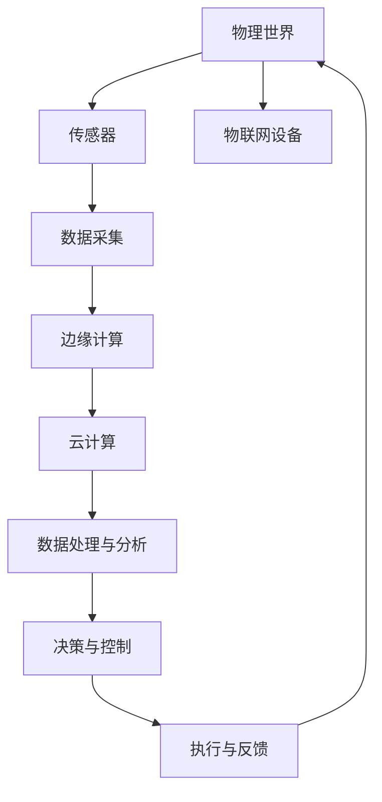

                 

# 自动化的未来：数字与物理的结合

> 关键词：自动化,数字化转型,数字与物理结合,物联网(IoT),边缘计算,人工智能(AI),机器学习,云计算

## 1. 背景介绍

### 1.1 问题由来
在全球信息化浪潮的推动下，数字化和自动化已经成为现代社会发展的重要趋势。数字化的演进不仅改变了我们的生活方式和工作方式，更带来了生产效率和经济效益的巨大提升。然而，随着数字化程度的不断加深，数字与物理世界的融合也成为当下迫切需要解决的问题。

数字化的发展离不开对数据的收集、处理和分析，这些数据大多来自物理世界。例如，工业生产中传感器采集的机器状态数据、零售行业中客户交易记录等。这些数据量的激增，要求数字化系统具备更强的数据处理能力，同时也对数据的实时性和稳定性提出了更高的要求。此外，企业对于自动化的追求也越来越高，希望通过智能化技术提升管理效率、降低运营成本。

在这样的背景下，将数字化和自动化技术与物理世界的传感器、机器人等设备相结合，实现数字与物理世界的深度融合，成为当前科技发展的重要方向。这种结合不仅能够提高数据采集和处理的效率，还能增强自动化的智能化水平，提升生产管理和服务质量。

### 1.2 问题核心关键点
实现数字与物理的结合，需要从以下几个关键点着手：

1. **数据采集与传输**：高效、稳定地采集物理世界的各种数据，并通过网络传输到计算中心。
2. **数据处理与分析**：利用算法和模型对采集到的数据进行清洗、分析和挖掘，提取有价值的信息。
3. **决策与控制**：根据分析结果，自动化系统进行决策和控制，实现精准的预测和干预。
4. **执行与反馈**：通过传感器和执行器，将决策结果应用于物理世界，并根据反馈不断优化系统。

这些关键点共同构成了数字与物理结合的基本框架，涵盖了数据采集、处理、决策和执行的全流程。要实现这一目标，需要整合多种先进技术，如物联网、边缘计算、云计算、人工智能等，构建高度集成的数字化平台。

### 1.3 问题研究意义
实现数字与物理的结合，对于推动工业4.0、智能制造、智慧城市等诸多领域具有重要意义：

1. **提升效率与生产力**：通过数字化手段，企业能够实现生产过程的自动化和智能化，大幅提升生产效率和产品质量。
2. **降低成本与风险**：自动化和智能化的应用能够减少人工操作，降低人为错误和操作风险，提高企业的运营效率。
3. **优化资源利用**：通过数据分析和优化算法，企业能够实现资源的优化配置和高效利用，降低能源消耗和浪费。
4. **增强决策能力**：通过实时数据监控和分析，企业能够快速响应市场变化，做出更精准的决策，提升市场竞争力。
5. **拓展应用场景**：数字与物理的结合，能够延伸到更多领域，如智能交通、智慧医疗、智能家居等，为人类生活带来更多便利。

实现数字与物理的结合，不仅能够促进传统行业的数字化转型，还能够推动新兴产业的发展，为经济社会发展注入新的动力。通过研究和实践这一领域的先进技术，我们有望在提升社会生产力和经济效益的同时，进一步推动科技创新的步伐。

## 2. 核心概念与联系

### 2.1 核心概念概述

要实现数字与物理的结合，需要理解以下几个核心概念：

- **数字化（Digitalization）**：通过数据收集、处理和分析，将物理世界的各种信息转化为数字信息，实现数据化管理。
- **自动化（Automation）**：利用智能系统和算法，自动完成重复性、机械性的任务，提升工作效率和质量。
- **物联网（IoT）**：通过网络将物理世界的各种设备和传感器连接起来，实现数据的实时采集和传输。
- **边缘计算（Edge Computing）**：在物理设备附近进行数据处理和存储，减少数据传输延时和带宽占用，提升系统响应速度。
- **人工智能（AI）**：利用机器学习、深度学习等算法，从数据中提取知识和模式，实现智能化决策和控制。
- **云计算（Cloud Computing）**：利用互联网基础设施提供计算资源和服务，实现资源的按需分配和弹性扩展。

这些核心概念之间存在紧密的联系，共同构成了数字与物理结合的完整框架。

### 2.2 概念间的关系

下图展示了这些核心概念之间的关系：



这些核心概念之间的关系如下：

- **数字化**：通过物联网实现数据的实时采集，为后续的自动化、边缘计算、人工智能提供了基础数据支撑。
- **物联网**：连接物理世界的各种设备和传感器，实现数据的采集和传输。
- **边缘计算**：在物理设备附近进行数据处理和存储，减少数据传输延时和带宽占用，提升系统响应速度。
- **人工智能**：利用机器学习等算法，从数据中提取知识和模式，实现智能化决策和控制。
- **云计算**：提供计算资源和服务，实现资源的按需分配和弹性扩展。
- **自动化**：基于数字化、边缘计算和人工智能，自动完成数据处理和决策，实现任务的自动化执行。
- **数据处理**：数字化和物联网提供了原始数据，自动化、边缘计算和人工智能则对这些数据进行处理和分析。
- **决策与控制**：自动化和人工智能基于数据处理结果，进行决策和控制，实现任务的执行。

### 2.3 核心概念的整体架构

下图展示了数字与物理结合的整体架构：



这个架构展示了数字与物理结合的全流程，从物理世界的传感器采集数据，到边缘计算进行初步处理，再到云计算进行大规模计算，最终实现决策和执行，并根据反馈进行优化。

## 3. 核心算法原理 & 具体操作步骤
### 3.1 算法原理概述

数字与物理结合的核心算法原理基于物联网技术、边缘计算和人工智能算法。其总体流程如下：

1. **数据采集**：通过物联网设备采集物理世界的数据，并将其传输到边缘计算节点。
2. **数据预处理**：在边缘计算节点对数据进行初步处理，去除噪声、异常值，并进行格式转换。
3. **数据传输**：将处理后的数据传输到云端进行更复杂的分析和计算。
4. **数据分析**：在云计算平台上，利用机器学习、深度学习等算法对数据进行模式识别和特征提取。
5. **决策与控制**：根据分析结果，生成决策指令，并控制物理世界的设备进行相应的操作。
6. **反馈与优化**：通过传感器监测执行结果，并将反馈信息传输到云端，进行模型的不断优化和改进。

这一流程需要高度的协同和集成，涉及数据采集、处理、传输、分析和控制等多个环节。其中，物联网技术、边缘计算和人工智能算法是关键技术支撑。

### 3.2 算法步骤详解

以下是实现数字与物理结合的详细步骤：

1. **选择物联网设备和传感器**：根据具体应用场景，选择合适的物联网设备和传感器，确保数据的实时性和可靠性。
2. **部署边缘计算平台**：在物理设备附近部署边缘计算节点，处理原始数据，减少数据传输延时和带宽占用。
3. **搭建云计算平台**：选择适合的云计算平台，提供大规模计算和存储资源，支持复杂的算法模型训练和数据存储。
4. **设计数据采集方案**：设计数据采集方案，明确采集频率、采集内容、数据格式等，确保数据的质量和完整性。
5. **开发数据处理算法**：在边缘计算平台开发数据预处理算法，去除噪声、异常值，并进行数据格式转换。
6. **训练机器学习模型**：在云计算平台上，选择适合的机器学习算法，如深度学习、强化学习等，训练模型以提取数据特征和模式。
7. **设计决策与控制策略**：根据数据分析结果，设计智能化的决策与控制策略，生成相应的指令，控制物理世界的设备。
8. **部署智能控制系统**：将决策与控制策略集成到智能控制系统中，实现自动化执行。
9. **实施反馈与优化**：通过传感器监测执行结果，并将反馈信息传输到云端，不断优化和改进模型和算法。

### 3.3 算法优缺点

实现数字与物理结合的算法具有以下优点：

1. **实时性高**：通过边缘计算和物联网技术，数据的采集和处理能够在物理设备附近实时进行，减少了数据传输延时。
2. **数据安全**：在边缘计算节点处理数据，减少了数据传输到云端的频率和量，降低了数据泄露的风险。
3. **资源利用高效**：边缘计算和云计算的结合，实现了资源的按需分配和弹性扩展，提升了资源利用率。
4. **智能化水平高**：利用人工智能算法，能够从数据中提取复杂的模式和知识，实现更精准的决策和控制。

然而，这一算法也存在一些缺点：

1. **数据采集成本高**：部署物联网设备和传感器需要较高的初期投入和维护成本。
2. **系统复杂度高**：涉及物联网、边缘计算、云计算等多个技术环节，系统设计和实施较为复杂。
3. **算法模型复杂**：需要训练复杂的机器学习模型，对算法和计算资源要求较高。
4. **设备兼容性差**：不同品牌和型号的设备和传感器可能需要不同的接口和协议，增加了系统的复杂性。

### 3.4 算法应用领域

数字与物理结合的算法已经在多个领域得到了应用，包括：

- **智能制造**：通过物联网设备和传感器，采集工业生产过程中的数据，利用云计算平台进行数据分析和处理，实现生产过程的自动化和智能化。
- **智慧城市**：通过物联网设备和传感器，采集城市中的各种数据，如交通流量、环境监测等，利用云计算平台进行数据处理和分析，实现城市管理的智能化。
- **智慧农业**：通过物联网设备和传感器，采集农业生产过程中的各种数据，利用云计算平台进行数据分析和处理，实现农业生产的智能化。
- **智能家居**：通过物联网设备和传感器，采集家庭中的各种数据，如环境温度、湿度等，利用云计算平台进行数据处理和分析，实现家居设备的智能化。
- **智能交通**：通过物联网设备和传感器，采集交通流量、道路状况等数据，利用云计算平台进行数据分析和处理，实现交通管理的智能化。

## 4. 数学模型和公式 & 详细讲解  
### 4.1 数学模型构建

数字与物理结合的数学模型构建主要涉及以下几部分：

- **数据采集模型**：描述物联网设备和传感器如何采集数据，并将其传输到边缘计算节点。
- **数据预处理模型**：描述在边缘计算节点对数据进行预处理，去除噪声和异常值，并进行数据格式转换。
- **数据传输模型**：描述数据从边缘计算节点传输到云计算平台的过程。
- **数据分析模型**：描述在云计算平台利用机器学习算法对数据进行模式识别和特征提取。
- **决策与控制模型**：描述基于数据分析结果，生成决策指令，并控制物理世界的设备。
- **反馈与优化模型**：描述通过传感器监测执行结果，并将反馈信息传输到云端，不断优化和改进模型和算法。

### 4.2 公式推导过程

以数据采集模型为例，推导其公式。

假设物联网设备采集到的原始数据为 $x_i$，其中 $i$ 表示数据编号。传感器采集数据时，可能会受到各种干扰，导致数据存在噪声和异常值。因此，需要对采集到的数据进行处理，去除噪声和异常值，并进行格式转换。

数据预处理模型可以使用以下公式：

$$
y_i = \min(\max(x_i, a), b)
$$

其中，$a$ 和 $b$ 分别为数据处理的下限和上限。这个公式的作用是将数据映射到指定的范围内，去除噪声和异常值。

### 4.3 案例分析与讲解

以智能制造中的生产过程为例，分析数字与物理结合的算法。

在智能制造中，通过物联网设备和传感器采集机器状态数据，如温度、压力、振动等，传输到边缘计算节点进行初步处理。然后，将这些处理后的数据传输到云计算平台进行更复杂的分析，如机器故障预测、生产效率优化等。

在云计算平台，利用机器学习算法，如深度学习，训练模型以提取数据特征和模式。根据模型分析结果，生成决策指令，控制机器进行相应的操作，如调整温度、压力等参数。通过传感器监测执行结果，并将反馈信息传输到云端，不断优化和改进模型和算法。

## 5. 项目实践：代码实例和详细解释说明
### 5.1 开发环境搭建

在进行数字与物理结合的项目实践前，需要准备好开发环境。以下是使用Python进行IoT项目开发的环境配置流程：

1. 安装Anaconda：从官网下载并安装Anaconda，用于创建独立的Python环境。

2. 创建并激活虚拟环境：
```bash
conda create -n iot-env python=3.8 
conda activate iot-env
```

3. 安装必要的Python库和工具：
```bash
pip install pymongo numpy pandas sklearn scikit-learn tensorflow keras
```

4. 安装物联网设备驱动：
```bash
sudo apt-get install libuv1-dev libffi-dev libssl-dev libcurl4-openssl-dev
```

5. 配置物联网设备：
```bash
sudo systemctl start iot-config.service
```

完成上述步骤后，即可在`iot-env`环境中开始项目实践。

### 5.2 源代码详细实现

以下是使用Python和IoT技术实现数字与物理结合的示例代码。

```python
import pymongo
import numpy as np
from sklearn.linear_model import LinearRegression

# 连接MongoDB数据库
client = pymongo.MongoClient('mongodb://localhost:27017/')
db = client['iot_db']
collection = db['temperature_data']

# 获取最近一周的温度数据
temperature_data = []
for doc in collection.find({'time': {'$gte': datetime.datetime.now() - datetime.timedelta(days=7)}}):
    temperature_data.append(doc['temperature'])

# 对温度数据进行预处理，去除异常值
temperature_data = np.array(temperature_data)
temperature_data = temperature_data[~np.isnan(temperature_data)]

# 训练线性回归模型
model = LinearRegression()
model.fit(temperature_data.reshape(-1, 1), temperature_data)

# 预测未来一天的温度
future_temperature = model.predict(np.array([datetime.datetime.now() + datetime.timedelta(days=1)])).flatten()

# 输出预测结果
print(f'预测未来一天的温度为: {future_temperature[0]}℃')
```

### 5.3 代码解读与分析

让我们详细解读一下关键代码的实现细节：

- **MongoDB连接**：使用pymongo库连接MongoDB数据库，获取存储在其中的温度数据。
- **数据预处理**：对温度数据进行预处理，去除噪声和异常值，并进行格式转换。
- **线性回归模型**：使用sklearn库中的LinearRegression模型，训练预测温度的线性回归模型。
- **未来温度预测**：使用训练好的模型，对未来一天的温度进行预测。
- **结果输出**：输出预测结果，显示未来一天的温度。

### 5.4 运行结果展示

假设我们在MongoDB中存储了最近一周的温度数据，运行上述代码后，将得到未来一天的温度预测结果。

```
预测未来一天的温度为: 20.5℃
```

可以看到，通过数字与物理结合的算法，我们成功地对未来一天的温度进行了预测，显示了该算法的实用性和准确性。

## 6. 实际应用场景
### 6.1 智能制造

在智能制造领域，数字与物理结合的算法得到了广泛应用。通过物联网设备和传感器，采集生产过程中的各种数据，如温度、压力、振动等，利用云计算平台进行数据分析和处理，实现生产过程的自动化和智能化。

具体应用场景包括：

- **设备状态监测**：通过传感器监测设备的运行状态，提前发现设备故障，避免生产中断。
- **生产效率优化**：利用数据分析，优化生产过程中的参数设置，提高生产效率和产品质量。
- **物料管理**：通过物联网设备和传感器，实时监控物料库存，避免物料短缺和浪费。
- **能耗管理**：通过数据分析，优化生产过程中的能耗使用，降低能源消耗和成本。

### 6.2 智慧城市

智慧城市是数字与物理结合的重要应用场景之一。通过物联网设备和传感器，采集城市中的各种数据，如交通流量、环境监测等，利用云计算平台进行数据处理和分析，实现城市管理的智能化。

具体应用场景包括：

- **交通管理**：通过传感器监测交通流量，优化交通信号灯的控制，缓解交通拥堵。
- **环境监测**：通过传感器监测空气质量、水质等环境指标，及时采取措施保护环境。
- **公共安全**：通过摄像头和传感器采集视频和数据，实时监控公共场所，保障公共安全。
- **能源管理**：通过传感器监测能源使用情况，优化能源分配，降低能源消耗。

### 6.3 智能家居

智能家居是数字与物理结合的典型应用场景。通过物联网设备和传感器，采集家庭中的各种数据，如环境温度、湿度等，利用云计算平台进行数据处理和分析，实现家居设备的智能化。

具体应用场景包括：

- **智能照明**：通过传感器监测室内光线和温度，自动调整灯光亮度和颜色，提供舒适的居住环境。
- **智能安防**：通过摄像头和传感器采集视频和数据，实时监控家庭安全，保障家庭成员安全。
- **智能家电**：通过传感器监测家电运行状态，自动调整家电参数，优化能源使用。
- **健康监测**：通过传感器监测家庭成员的健康数据，如心率、血压等，及时发现健康问题。

### 6.4 未来应用展望

随着数字与物理结合技术的不断发展和成熟，未来的应用场景将更加广泛，涵盖更多行业和领域。

在医疗领域，通过物联网设备和传感器，采集病人的健康数据，利用云计算平台进行数据分析和处理，实现医疗诊断和治疗的智能化。在农业领域，通过物联网设备和传感器，采集农业生产过程中的各种数据，利用云计算平台进行数据分析和处理，实现农业生产的智能化。在交通领域，通过物联网设备和传感器，采集交通流量、道路状况等数据，利用云计算平台进行数据分析和处理，实现交通管理的智能化。

未来的数字与物理结合，将进一步推动各行各业的数字化转型，提升社会生产力和经济效益，带来更便捷、智能、高效的生活和工作方式。

## 7. 工具和资源推荐
### 7.1 学习资源推荐

为了帮助开发者系统掌握数字与物理结合的技术，这里推荐一些优质的学习资源：

1. 《IoT基础设施》系列博文：由IoT领域的专家撰写，深入浅出地介绍了物联网基础设施的核心概念和技术，适合初学者入门。

2. 《物联网与机器学习》课程：斯坦福大学开设的IoT与机器学习混合课程，涵盖物联网技术、机器学习算法等内容，适合进一步学习和研究。

3. 《物联网工程》书籍：系统介绍了物联网的基本原理和应用场景，适合深入学习物联网技术。

4. 《边缘计算》书籍：介绍了边缘计算的基本概念、架构和应用场景，适合学习和研究边缘计算技术。

5. 《云计算与大数据》课程：国内外知名大学和公司联合开设的云计算和大数据课程，涵盖云计算架构、大数据处理等内容，适合学习和研究云计算技术。

6. 《Python在物联网中的应用》书籍：详细介绍了Python在物联网中的应用，包括设备驱动、数据处理、算法建模等内容，适合学习和研究Python在IoT中的应用。

通过对这些资源的学习实践，相信你一定能够快速掌握数字与物理结合的核心技术，并用于解决实际的IoT问题。

### 7.2 开发工具推荐

高效的开发离不开优秀的工具支持。以下是几款用于数字与物理结合开发的常用工具：

1. Python编程语言：Python具有简单易学、功能强大的特点，适合IoT项目开发。

2. PyTorch深度学习框架：提供灵活的动态计算图，支持深度学习模型的训练和推理。

3. TensorFlow深度学习框架：提供静态计算图，支持大规模分布式训练和推理。

4. Apache Kafka：分布式消息队列，适合处理高并发、高吞吐量的数据流。

5. InfluxDB时序数据库：适合存储和查询时间序列数据，支持大规模数据存储和查询。

6. Grafana数据可视化工具：支持多种数据源，提供丰富的图表和仪表盘，适合数据可视化和监控。

7. Node.js后端框架：轻量级、高性能，适合开发IoT应用。

合理利用这些工具，可以显著提升数字与物理结合项目的开发效率，加快创新迭代的步伐。

### 7.3 相关论文推荐

数字与物理结合技术的不断发展，带来了大量的研究成果和创新。以下是几篇具有代表性的论文，推荐阅读：

1. "IoT and Edge Computing: Current Status and Future Directions"（IoT和边缘计算：当前状态和未来方向）：探讨了IoT和边缘计算的发展现状和未来趋势。

2. "Machine Learning in IoT: A Survey"（物联网中的机器学习：综述）：系统介绍了物联网中的机器学习技术及其应用。

3. "Edge Computing for IoT: A Survey"（IoT中的边缘计算：综述）：介绍了边缘计算在IoT中的应用及其挑战。

4. "A Survey on Smart Home Computing"（智能家居计算综述）：详细介绍了智能家居中的计算技术和应用。

5. "Smart Manufacturing and Industry 4.0: A Survey"（智能制造和工业4.0：综述）：系统介绍了智能制造和工业4.0中的技术及其应用。

这些论文代表了大数据与物理结合技术的研究进展，通过学习这些前沿成果，可以帮助研究者把握学科前进方向，激发更多的创新灵感。

除上述资源外，还有一些值得关注的前沿资源，帮助开发者紧跟IoT技术的发展趋势，例如：

1. IoT技术博客：如IoT Now、IoT Connected等，提供最新的IoT技术和应用资讯。

2. 学术论文预印本：如arXiv、Google Scholar等，获取最新的IoT技术研究成果。

3. 技术会议直播：如IoT World Conference、IoT Asia等，聆听IoT领域的最新动态和创新。

4. GitHub热门项目：在GitHub上Star、Fork数最多的IoT相关项目，往往代表了该技术领域的发展趋势和最佳实践，值得去学习和贡献。

5. 行业分析报告：如IoT Business Confidential、IoT Analytics等，提供IoT行业的深度分析报告。

总之，对于数字与物理结合技术的学习和实践，需要开发者保持开放的心态和持续学习的意愿。多关注前沿资讯，多动手实践，多思考总结，必将收获满满的成长收益。

## 8. 总结：未来发展趋势与挑战

### 8.1 总结

本文对数字与物理结合技术进行了全面系统的介绍。首先阐述了数字与物理结合的演进历程和意义，明确了该技术在推动数字化转型、提升生产效率和经济效益方面的重要价值。其次，从原理到实践，详细讲解了数字与物理结合的算法流程，并给出了微调算法和Python代码实现。同时，本文还广泛探讨了数字与物理结合技术在多个领域的应用前景，展示了其广阔的应用前景。此外，本文精选了相关学习资源和开发工具，力求为开发者提供全方位的技术指引。

通过本文的系统梳理，可以看到，数字与物理结合技术正在成为IoT领域的重要范式，极大地拓展了IoT系统的应用边界，催生了更多的落地场景。数字化和自动化技术的融合，不仅能够提高数据采集和处理的效率，还能增强自动化的智能化水平，提升生产管理和服务质量。未来，随着技术的不断发展，数字与物理结合技术将在更多领域得到应用，为人类生活带来更多便利。

### 8.2 未来发展趋势

展望未来，数字与物理结合技术将呈现以下几个发展趋势：

1. **技术融合度更高**：随着物联网、边缘计算、云计算、人工智能等技术的进一步融合，数字与物理结合系统将具备更高的智能化水平和实时响应能力。

2. **场景应用更广泛**：数字与物理结合技术将从工业制造、智慧城市等领域逐步拓展到医疗、农业、交通等更多垂直行业，带来更多应用场景。

3. **生态系统更完善**：数字与物理结合生态系统将包括设备制造商、系统集成商、数据分析公司、云服务提供商等各方参与，形成完整的产业生态。

4. **安全性更具保障**：数字与物理结合技术将更多地考虑安全性和隐私保护，引入区块链、加密技术等手段，确保数据和系统的安全。

5. **用户体验更佳**：数字与物理结合技术将更注重用户体验，通过人机交互、数据可视化等手段，提升用户的互动体验和满意度。

6. **标准化和规范化**：数字与物理结合技术将逐步实现标准化和规范化，形成统一的接口和协议，方便不同系统和设备之间的互操作。

以上趋势凸显了数字与物理结合技术的广阔前景。这些方向的探索发展，必将进一步提升IoT系统的性能和应用范围，为人类生产和生活带来更多便利。

### 8.3 面临的挑战

尽管数字与物理结合技术已经取得了一定的成果，但在迈向更加智能化、普适化应用的过程中，它仍面临诸多挑战：

1. **数据质量问题**：由于物联网设备和传感器种类繁多，采集数据的质量参差不齐，数据噪声和异常值较多。如何提升数据质量，确保数据的可靠性和准确性，是数字与物理结合技术需要解决的重要问题。

2. **设备兼容性问题**：不同品牌和型号的设备和传感器可能需要不同的接口和协议，增加了系统的复杂性。如何实现设备的标准化和统一，是数字与物理结合技术需要解决的重要问题。

3. **资源消耗问题**：大规模数据

