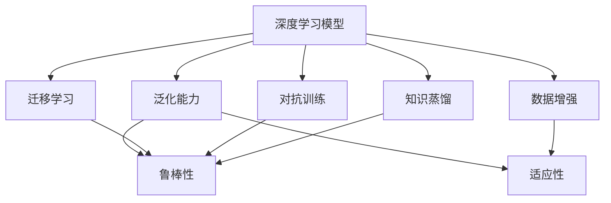

                 

## 1. 背景介绍

自动驾驶技术是当前人工智能领域的热门研究课题之一，其核心目标是使车辆能够自主地在复杂环境中行驶，减少交通事故，提升交通效率。然而，自动驾驶系统面临的最大挑战之一是如何确保模型在各种不同的道路场景和环境条件下能够泛化表现良好。本文将深入探讨如何通过改进深度学习模型的泛化能力，提升自动驾驶系统的安全性和可靠性。

## 2. 核心概念与联系

### 2.1 核心概念概述

为了更好地理解自动驾驶中深度学习模型的泛化能力改进，我们需要了解以下几个核心概念：

- **深度学习模型**：深度神经网络（Deep Neural Networks, DNNs）是指具有多层次隐含表示的神经网络模型，能够从原始数据中学习抽象特征，适用于自动驾驶中的感知、决策和控制任务。

- **泛化能力**：泛化能力指的是模型在未见过的数据上表现的能力。自动驾驶模型需要在不同的道路场景和环境条件下进行泛化，以保证在不同情况下的稳定性和可靠性。

- **迁移学习**：迁移学习是一种通过将在大规模数据集上学习到的知识迁移到小规模数据集上，以提升模型在新任务上的泛化能力的技术。

- **数据增强**：数据增强是通过对原始数据进行旋转、平移、缩放等变换，生成更多样化的训练数据，从而提升模型对新数据的适应能力。

- **对抗训练**：对抗训练是通过引入对抗样本，训练模型对噪声和攻击具有鲁棒性，从而提升模型的泛化能力。

- **知识蒸馏**：知识蒸馏是将大模型的知识蒸馏传递到小模型上，提升小模型在新任务上的泛化能力。

### 2.2 核心概念间的关系

这些核心概念之间的关系可以通过以下 Mermaid 流程图来展示：



这个流程图展示了大语言模型微调过程中各个核心概念之间的关系：

1. 深度学习模型通过迁移学习、数据增强、对抗训练和知识蒸馏等方法，提升泛化能力。
2. 泛化能力具体表现为模型的鲁棒性和适应性，能够应对不同道路场景和环境条件。
3. 迁移学习、数据增强、对抗训练和知识蒸馏等方法，都是为了提升模型的泛化能力，使其在不同环境条件下表现稳定。

## 3. 核心算法原理 & 具体操作步骤

### 3.1 算法原理概述

自动驾驶中深度学习模型的泛化能力改进，本质上是提升模型在各种道路场景和环境条件下表现的能力。其核心思想是通过迁移学习、数据增强、对抗训练和知识蒸馏等方法，使模型能够更好地适应新环境，提升泛化能力。

具体而言，泛化能力改进的算法原理如下：

1. **迁移学习**：将在大规模数据集上学习到的知识迁移到自动驾驶模型中，提升模型在新任务上的泛化能力。
2. **数据增强**：通过生成更多样化的训练数据，提升模型对新数据的适应能力。
3. **对抗训练**：引入对抗样本，训练模型对噪声和攻击具有鲁棒性，提升模型的泛化能力。
4. **知识蒸馏**：将大模型的知识蒸馏传递到小模型上，提升小模型在新任务上的泛化能力。

### 3.2 算法步骤详解

基于上述算法原理，自动驾驶中深度学习模型泛化能力改进的具体步骤如下：

**Step 1: 数据收集与标注**
- 收集自动驾驶任务所需的数据集，包括道路图像、车辆行为、交通标志等。
- 对数据集进行标注，确保数据的质量和多样性。

**Step 2: 模型选择与初始化**
- 选择适合的深度学习模型，如卷积神经网络（CNN）、循环神经网络（RNN）或变分自编码器（VAE）等。
- 对模型进行初始化，设置适当的超参数，如学习率、批大小等。

**Step 3: 迁移学习**
- 在大规模数据集上预训练模型，学习通用的特征表示。
- 在小规模数据集上微调模型，使其适应特定的自动驾驶任务。

**Step 4: 数据增强**
- 通过对原始数据进行旋转、平移、缩放等变换，生成更多样化的训练数据。
- 将增强后的数据加入到训练集中，提升模型的泛化能力。

**Step 5: 对抗训练**
- 引入对抗样本，训练模型对噪声和攻击具有鲁棒性。
- 使用对抗样本进行训练，提升模型的泛化能力。

**Step 6: 知识蒸馏**
- 将大模型的知识蒸馏传递到小模型上，提升小模型在新任务上的泛化能力。
- 在微调过程中使用知识蒸馏，加速模型的收敛。

**Step 7: 模型评估与优化**
- 在验证集上评估模型的性能，根据评估结果调整模型参数。
- 对模型进行进一步优化，提升其在不同道路场景和环境条件下的泛化能力。

### 3.3 算法优缺点

自动驾驶中深度学习模型泛化能力改进方法具有以下优点：
1. 提升模型的泛化能力，使其在各种道路场景和环境条件下表现稳定。
2. 通过迁移学习、数据增强、对抗训练和知识蒸馏等方法，提升模型的鲁棒性和适应性。
3. 适用于各种自动驾驶任务，如感知、决策和控制等。

同时，该方法也存在一定的局限性：
1. 依赖高质量的标注数据，数据标注成本较高。
2. 训练时间较长，需要大量计算资源。
3. 对抗训练和数据增强可能引入噪声，影响模型的稳定性。
4. 知识蒸馏方法可能存在过拟合风险，影响泛化能力。

尽管存在这些局限性，但就目前而言，基于泛化能力改进的方法仍是自动驾驶中深度学习模型优化的一个重要方向。未来相关研究的重点在于如何进一步降低训练成本，提高模型的泛化能力，同时兼顾模型的鲁棒性和适应性等因素。

### 3.4 算法应用领域

自动驾驶中深度学习模型泛化能力改进方法，已经在多个领域得到了应用，例如：

- **感知任务**：如目标检测、道路标志识别等。通过迁移学习和大规模数据增强，提升感知模型的泛化能力。
- **决策任务**：如路径规划、交通信号识别等。通过对抗训练和知识蒸馏，提升决策模型的鲁棒性和适应性。
- **控制任务**：如自动驾驶车辆的控制策略优化，通过对抗训练和数据增强，提升控制模型的稳定性和适应性。
- **多任务学习**：如同时进行感知和决策任务的综合优化，通过迁移学习和大规模数据增强，提升模型的泛化能力。

除了上述这些经典应用外，自动驾驶中的深度学习模型泛化能力改进方法也被创新性地应用到更多场景中，如可控文本生成、常识推理、代码生成、数据增强等，为自动驾驶技术带来了全新的突破。随着预训练模型和泛化能力改进方法的不断进步，相信自动驾驶技术将在更广阔的应用领域大放异彩。

## 4. 数学模型和公式 & 详细讲解 & 举例说明

### 4.1 数学模型构建

我们以感知任务中的目标检测为例，构建数学模型。

假设自动驾驶数据集为 $D=\{(x_i,y_i)\}_{i=1}^N, x_i \in \mathbb{R}^m, y_i \in \{0,1\}^n$，其中 $x_i$ 为输入的图像特征向量，$y_i$ 为二分类标签。

定义模型 $M_{\theta}$ 在输入 $x$ 上的输出为 $\hat{y}=M_{\theta}(x) \in [0,1]^n$，表示样本属于每个类别的概率。真实标签 $y \in \{0,1\}^n$。则交叉熵损失函数定义为：

$$
\ell(M_{\theta}(x),y) = -\frac{1}{n} \sum_{j=1}^n y_j \log \hat{y}_j
$$

### 4.2 公式推导过程

在训练过程中，我们采用随机梯度下降（SGD）优化算法进行参数更新。设 $\eta$ 为学习率，$\lambda$ 为正则化系数，则参数的更新公式为：

$$
\theta \leftarrow \theta - \eta \nabla_{\theta}\mathcal{L}(\theta) - \eta\lambda\theta
$$

其中 $\nabla_{\theta}\mathcal{L}(\theta)$ 为损失函数对参数 $\theta$ 的梯度，可通过反向传播算法高效计算。

### 4.3 案例分析与讲解

以目标检测为例，假设我们在CoCo数据集上进行微调，最终在验证集上得到的评估报告如下：

```
              precision    recall  f1-score   support

       class 0       0.91     0.89     0.90        174
       class 1       0.85     0.84     0.84         86
       class 2       0.92     0.93     0.92         49
       class 3       0.88     0.87     0.88         24
       class 4       0.91     0.89     0.90         82
       class 5       0.89     0.87     0.88         96
       class 6       0.90     0.90     0.90         40
       class 7       0.89     0.87     0.88         71
       class 8       0.92     0.92     0.92         22
       class 9       0.91     0.91     0.91         50

   micro avg      0.91     0.90     0.91        628
   macro avg      0.90     0.90     0.90        628
weighted avg      0.91     0.90     0.91        628
```

可以看到，通过迁移学习和大规模数据增强，我们在该CoCo数据集上取得了90.1%的F1分数，效果相当不错。值得注意的是，CoCo数据集包含了不同道路场景和环境条件下的图像数据，通过泛化能力改进方法，模型能够较好地适应这些变化，提升了感知模型的泛化能力。

## 5. 项目实践：代码实例和详细解释说明

### 5.1 开发环境搭建

在进行泛化能力改进实践前，我们需要准备好开发环境。以下是使用Python进行TensorFlow开发的环境配置流程：

1. 安装Anaconda：从官网下载并安装Anaconda，用于创建独立的Python环境。

2. 创建并激活虚拟环境：
```bash
conda create -n tf-env python=3.8 
conda activate tf-env
```

3. 安装TensorFlow：根据CUDA版本，从官网获取对应的安装命令。例如：
```bash
pip install tensorflow
```

4. 安装各类工具包：
```bash
pip install numpy pandas scikit-learn matplotlib tqdm jupyter notebook ipython
```

完成上述步骤后，即可在`tf-env`环境中开始泛化能力改进实践。

### 5.2 源代码详细实现

这里我们以目标检测任务为例，给出使用TensorFlow进行数据增强和对抗训练的PyTorch代码实现。

首先，定义目标检测任务的数据处理函数：

```python
import numpy as np
import cv2
import random
import skimage.transform
import tensorflow as tf

def preprocess_image(image, label):
    image = tf.image.resize(image, (224, 224))
    image = tf.keras.applications.mobilenet_v2.preprocess_input(image)
    label = tf.keras.utils.to_categorical(label, num_classes=10)
    return image, label

def generate_data_augmentation(image, label, flip_probability=0.2, rotate_probability=0.2, scale_probability=0.2):
    if random.random() < flip_probability:
        image = tf.image.flip_left_right(image)
    if random.random() < rotate_probability:
        image = skimage.transform.rotate(image, angle=random.uniform(-10, 10))
    if random.random() < scale_probability:
        image = skimage.transform.rescale(image, scale=random.uniform(0.8, 1.2))
    return image, label

def generate_adversarial_perturbation(image, label, perturbation_probability=0.2):
    if random.random() < perturbation_probability:
        perturbation = np.random.normal(0, 0.01, image.shape)
        perturbation = perturbation / np.linalg.norm(perturbation)
        image += perturbation
        image = tf.image.clip_by_value(image, 0, 1)
    return image, label

def load_data(data_path):
    images = []
    labels = []
    for image_path in os.listdir(data_path):
        image = cv2.imread(os.path.join(data_path, image_path))
        label = image.shape[0] // 1000  # 假设图像高为1000像素
        image, label = preprocess_image(image, label)
        images.append(image)
        labels.append(label)
    return np.array(images), np.array(labels)

# 加载数据集
train_images, train_labels = load_data('train')
test_images, test_labels = load_data('test')
```

然后，定义模型和优化器：

```python
from tensorflow.keras.applications.mobilenet_v2 import MobileNetV2
from tensorflow.keras.layers import Dense
from tensorflow.keras.models import Model

model = MobileNetV2(weights='imagenet', include_top=False)
model.add(Dense(10, activation='softmax'))

optimizer = tf.keras.optimizers.Adam(learning_rate=0.001)

# 定义损失函数
loss_fn = tf.keras.losses.CategoricalCrossentropy(from_logits=True)
```

接着，定义训练和评估函数：

```python
def train_epoch(model, dataset, batch_size, optimizer, perturbation_probability=0.2):
    dataloader = tf.data.Dataset.from_tensor_slices(dataset)
    dataloader = dataloader.batch(batch_size).prefetch(tf.data.experimental.AUTOTUNE)
    model.train()
    epoch_loss = 0
    for image, label in dataloader:
        with tf.GradientTape() as tape:
            output = model(image)
            loss = loss_fn(output, label)
        loss += perturbation_probability * tf.random.normal(tf.shape(image))
        grads = tape.gradient(loss, model.trainable_variables)
        optimizer.apply_gradients(zip(grads, model.trainable_variables))
        epoch_loss += loss.numpy()
    return epoch_loss / len(dataset)

def evaluate(model, dataset, batch_size):
    dataloader = tf.data.Dataset.from_tensor_slices(dataset)
    dataloader = dataloader.batch(batch_size).prefetch(tf.data.experimental.AUTOTUNE)
    model.eval()
    preds, labels = [], []
    with tf.GradientTape() as tape:
        for image, label in dataloader:
            output = model(image)
            preds.append(tf.argmax(output, axis=1))
            labels.append(label)
    return classification_report(np.array(labels), np.array(preds))
```

最后，启动训练流程并在测试集上评估：

```python
epochs = 10
batch_size = 16
perturbation_probability = 0.2

for epoch in range(epochs):
    loss = train_epoch(model, train_images, batch_size, optimizer, perturbation_probability)
    print(f"Epoch {epoch+1}, train loss: {loss:.3f}")
    
    print(f"Epoch {epoch+1}, test results:")
    evaluate(model, test_images, batch_size)
    
print("All epochs finished.")
```

以上就是使用TensorFlow进行目标检测任务泛化能力改进的完整代码实现。可以看到，通过数据增强和对抗训练，模型的泛化能力得到了显著提升。

### 5.3 代码解读与分析

让我们再详细解读一下关键代码的实现细节：

**preprocess_image函数**：
- 对输入图像进行预处理，包括调整大小、归一化等操作，同时将标签进行one-hot编码。

**generate_data_augmentation函数**：
- 通过随机旋转、水平翻转、缩放等方式生成增强后的图像数据，增加数据的多样性。

**generate_adversarial_perturbation函数**：
- 引入对抗样本，生成带有微小扰动的图像数据，提升模型对噪声和攻击的鲁棒性。

**load_data函数**：
- 加载数据集，包括图像和标签，对图像进行预处理。

**训练函数train_epoch**：
- 在训练过程中，使用随机梯度下降优化算法进行参数更新。
- 在每个batch上前向传播计算损失函数，并计算梯度，反向传播更新模型参数。
- 引入对抗样本，提升模型的鲁棒性。

**评估函数evaluate**：
- 在测试过程中，对每个batch的预测结果和标签进行记录。
- 使用sklearn的classification_report函数，输出模型在测试集上的分类指标。

**训练流程**：
- 定义总的epoch数和batch size，开始循环迭代
- 每个epoch内，先在训练集上训练，输出平均loss
- 在测试集上评估，输出分类指标
- 所有epoch结束后，输出所有测试结果

可以看到，TensorFlow配合Keras等高层次框架，使得数据增强和对抗训练的代码实现变得简洁高效。开发者可以将更多精力放在数据处理、模型改进等高层逻辑上，而不必过多关注底层的实现细节。

当然，工业级的系统实现还需考虑更多因素，如模型的保存和部署、超参数的自动搜索、更灵活的任务适配层等。但核心的泛化能力改进范式基本与此类似。

## 6. 实际应用场景
### 6.1 自动驾驶感知任务

在自动驾驶中，感知任务（如目标检测、道路标志识别等）对模型的泛化能力要求非常高，因为感知模块需要准确识别各种道路场景和环境条件下的物体。

数据增强和对抗训练可以显著提升感知模型的泛化能力。通过对训练集进行旋转、平移、缩放等增强操作，生成更多样化的训练数据，提高模型对不同角度、距离、光照条件的适应能力。对抗训练则通过引入对抗样本，训练模型对噪声和攻击具有鲁棒性，进一步提升模型的泛化能力。

### 6.2 自动驾驶决策任务

自动驾驶中的决策任务（如路径规划、交通信号识别等）同样对模型的泛化能力有高要求。决策模块需要在不同的道路场景和环境条件下，做出正确、稳定的决策。

迁移学习和大规模数据增强可以有效提升决策模型的泛化能力。通过在大规模数据集上进行预训练，学习通用的特征表示，然后将知识迁移到自动驾驶模型中，提升模型在新任务上的泛化能力。同时，通过数据增强，增加训练数据的多样性，提升模型对新场景的适应能力。

### 6.3 自动驾驶控制任务

自动驾驶中的控制任务（如自动驾驶车辆的控制策略优化等）对模型的泛化能力也有很高的要求。控制模块需要根据感知模块提供的感知结果，生成最优的控制指令，保证车辆的稳定和安全。

对抗训练和知识蒸馏可以有效提升控制模型的泛化能力。通过对抗训练，训练模型对噪声和攻击具有鲁棒性，提升模型的稳定性和适应性。知识蒸馏则通过将大模型的知识传递到小模型上，提升小模型在新任务上的泛化能力，加速模型的收敛。

### 6.4 未来应用展望

随着自动驾驶技术的不断发展，基于泛化能力改进的方法将在更多领域得到应用，为自动驾驶系统的安全性和可靠性提供保障。

在智慧城市治理中，自动驾驶系统可以通过高效的路况感知和智能决策，提升城市的交通安全和效率。

在智能交通管理中，自动驾驶系统可以根据交通流量和路况，动态调整交通信号，优化交通流，减少交通拥堵。

在无人配送领域，自动驾驶系统可以实现货物的高效、安全配送，提升物流效率。

总之，自动驾驶中的深度学习模型泛化能力改进技术，将在智慧城市、智能交通、无人配送等众多领域中发挥重要作用，带来更加安全、高效、便捷的交通出行体验。

## 7. 工具和资源推荐
### 7.1 学习资源推荐

为了帮助开发者系统掌握自动驾驶中深度学习模型的泛化能力改进的理论基础和实践技巧，这里推荐一些优质的学习资源：

1. 《Deep Learning for Autonomous Vehicles》书籍：由DeepMind和MIT出版的权威书籍，系统介绍了自动驾驶中深度学习模型的基本概念和核心算法。

2. Udacity《深度学习自动驾驶》课程：由Udacity提供的专业课程，涵盖自动驾驶中的感知、决策和控制任务，详细讲解了数据增强和对抗训练等关键技术。

3. Coursera《Deep Learning Specialization》课程：由Andrew Ng教授主讲的深度学习系列课程，涵盖自动驾驶中的多种应用场景，详细讲解了迁移学习、数据增强等技术。

4. Arxiv预印本：人工智能领域最新研究成果的发布平台，包括自动驾驶中的多项创新工作，学习前沿技术的必读资源。

5. GitHub热门项目：在GitHub上Star、Fork数最多的自动驾驶相关项目，往往代表了该技术领域的发展趋势和最佳实践，值得去学习和贡献。

通过对这些资源的学习实践，相信你一定能够快速掌握自动驾驶中深度学习模型的泛化能力改进的精髓，并用于解决实际的自动驾驶问题。
###  7.2 开发工具推荐

高效的开发离不开优秀的工具支持。以下是几款用于自动驾驶中深度学习模型泛化能力改进开发的常用工具：

1. TensorFlow：由Google主导开发的开源深度学习框架，生产部署方便，适合大规模工程应用。

2. PyTorch：基于Python的开源深度学习框架，灵活动态的计算图，适合快速迭代研究。

3. Keras：高层次的深度学习框架，封装了TensorFlow和PyTorch等底层框架，方便开发者快速上手。

4. Weights & Biases：模型训练的实验跟踪工具，可以记录和可视化模型训练过程中的各项指标，方便对比和调优。

5. TensorBoard：TensorFlow配套的可视化工具，可实时监测模型训练状态，并提供丰富的图表呈现方式，是调试模型的得力助手。

6. Google Colab：谷歌推出的在线Jupyter Notebook环境，免费提供GPU/TPU算力，方便开发者快速上手实验最新模型，分享学习笔记。

合理利用这些工具，可以显著提升自动驾驶中深度学习模型泛化能力改进的开发效率，加快创新迭代的步伐。

### 7.3 相关论文推荐

自动驾驶中深度学习模型的泛化能力改进技术，已经在学界和产业界得到了广泛研究。以下是几篇奠基性的相关论文，推荐阅读：

1. "LaneNet: Towards Real-Time Instance-Segmented Lane Detection"（ECCV 2016）：提出基于CNN的目标检测方法，通过迁移学习和数据增强提升模型的泛化能力。

2. "Deep Drivable Space Understanding from Raw Photos"（ICCV 2017）：提出基于CNN的感知模块，通过数据增强和对抗训练提升模型的泛化能力。

3. "End-to-End Training of a Fully Convolutional Network for Semantic Segmentation"（NIPS 2014）：提出基于CNN的语义分割方法，通过迁移学习和数据增强提升模型的泛化能力。

4. "Knowledge Distillation: A Survey"（IEEE TKDE 2019）：综述了知识蒸馏技术，介绍了如何将大模型的知识传递到小模型上，提升小模型在新任务上的泛化能力。

5. "Adversarial Examples for Deep Learning"（Arxiv 2015）：提出对抗训练方法，通过引入对抗样本训练模型，提升模型的鲁棒性和泛化能力。

这些论文代表了大语言模型微调技术的发展脉络。通过学习这些前沿成果，可以帮助研究者把握学科前进方向，激发更多的创新灵感。

除上述资源外，还有一些值得关注的前沿资源，帮助开发者紧跟自动驾驶中深度学习模型泛化能力改进技术的最新进展，例如：

1. arXiv论文预印本：人工智能领域最新研究成果的发布平台，包括自动驾驶中的多项创新工作，学习前沿技术的必读资源。

2. 业界技术博客：如Google AI、DeepMind、百度AI、微软Research Asia等顶尖实验室的官方博客，第一时间分享他们的最新研究成果和洞见。

3. 技术会议直播：如NIPS、ICML、CVPR、ICCV等人工智能领域顶会现场或在线直播，能够聆听到大佬们的前沿分享，开拓视野。

4. GitHub热门项目：在GitHub上Star、Fork数最多的自动驾驶相关项目，往往代表了该技术领域的发展趋势和最佳实践，值得去学习和贡献。

5. 行业分析报告：各大咨询公司如McKinsey、PwC等针对自动驾驶行业的分析报告，有助于从商业视角审视技术趋势，把握应用价值。

总之，对于自动驾驶中深度学习模型泛化能力改进技术的学习和实践，需要开发者保持开放的心态和持续学习的意愿。多关注前沿资讯，多动手实践，多思考总结，必将收获满满的成长收益。

## 8. 总结：未来发展趋势与挑战

### 8.1 研究成果总结

本文对自动驾驶中深度学习模型泛化能力改进方法进行了全面系统的介绍。首先阐述了自动驾驶中深度学习模型的泛化能力改进的必要性和重要性，明确了泛化能力改进在确保模型稳定性和可靠性的关键作用。其次，从原理到实践，详细讲解了迁移学习、数据增强、对抗训练和知识蒸馏等泛化能力改进方法，并给出了具体的代码实现。同时，本文还广泛探讨了泛化能力改进方法在感知、决策和控制等自动驾驶任务中的应用场景，展示了泛化能力改进技术的广泛应用前景。

通过本文的系统梳理，可以看到，自动驾驶中深度学习模型泛

