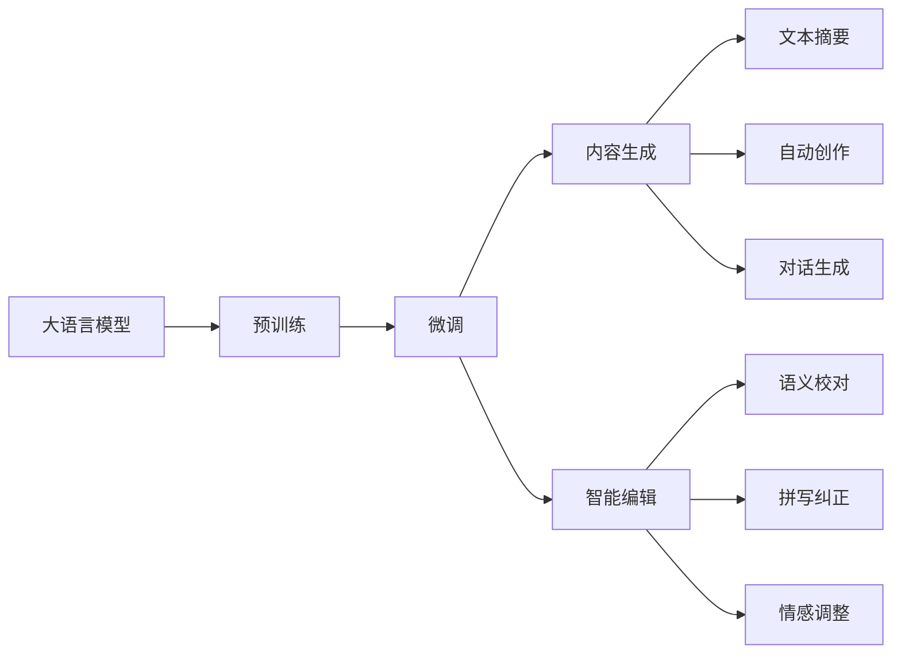
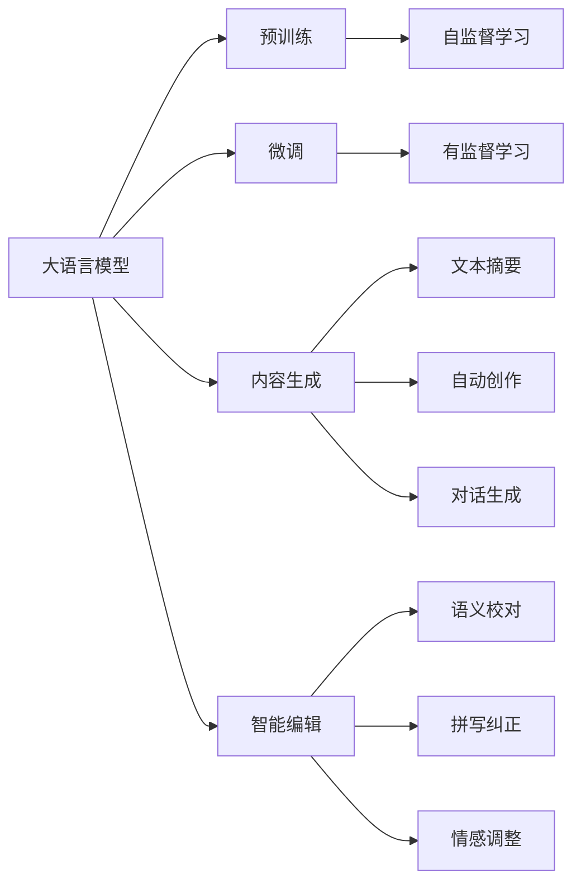
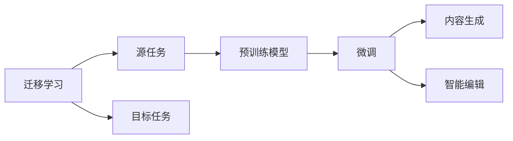
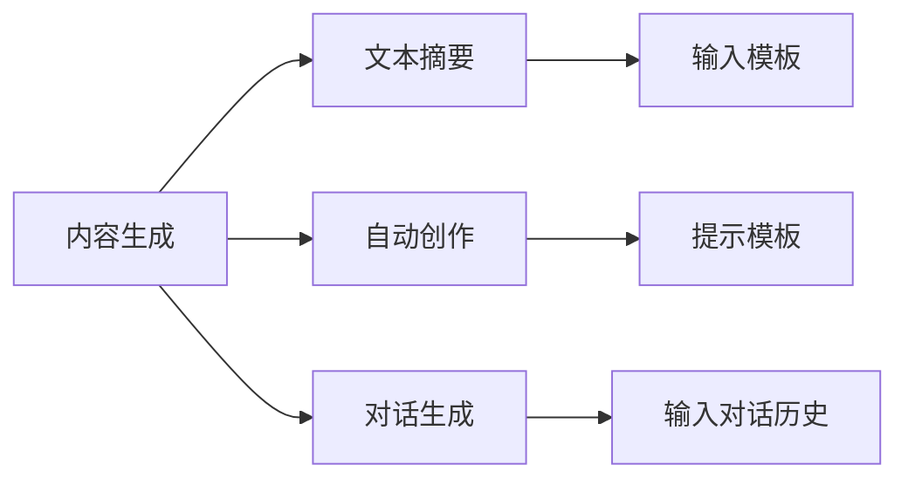
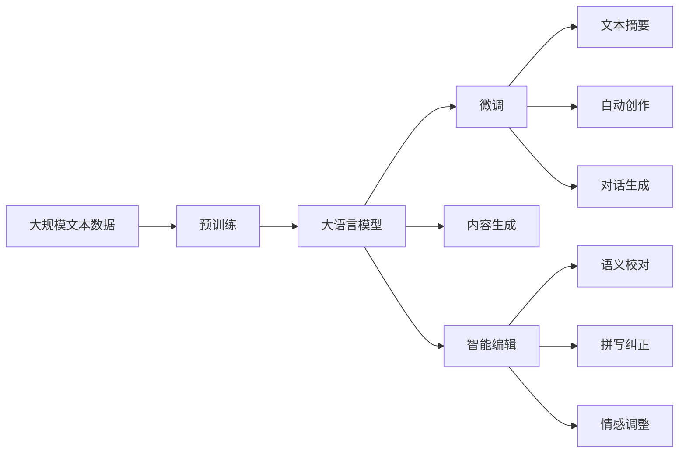

                 

# 自然语言处理的应用：内容创作革命

> 关键词：自然语言处理(NLP), 内容生成, 自然语言理解(NLU), 机器翻译, 文本分类, 文本摘要

## 1. 背景介绍

### 1.1 问题由来
自然语言处理（NLP）是人工智能领域的重要分支，旨在使计算机能够理解、处理和生成人类语言。随着深度学习技术的进步，大语言模型（Large Language Models, LLMs）如BERT、GPT、T5等在文本处理、语音识别、图像描述、情感分析等多个NLP任务上取得了显著进展。其中，大语言模型的核心是利用大规模无标签文本数据进行自监督预训练，学习到丰富的语言知识和常识，然后在特定任务上通过少量标注数据进行微调（Fine-Tuning），从而提升模型在该任务上的性能。

这一范式使得大语言模型能够高效地适应各种NLP任务，从传统的文本分类、命名实体识别、机器翻译到现代的内容生成、情感分析、问答系统等，大语言模型在多个领域展现了强大的能力。本文将重点探讨大语言模型在内容创作领域的革命性应用，分析其在自动内容生成、智能编辑、内容推荐等任务中的潜力和挑战。

### 1.2 问题核心关键点
大语言模型在内容创作中的应用主要集中在两个方面：自动内容生成和智能编辑。自动内容生成任务包括文本摘要、自动创作、对话生成等，智能编辑任务则包括语义校对、拼写纠正、情感调整等。这些任务的共同点是都需要模型理解和生成人类语言，而大语言模型凭借其强大的语言理解和生成能力，能够高效地实现这些任务。

自动内容生成的关键是找到合适的输入，引导模型生成符合要求的内容。常见的输入方式包括模板、主题、提示（Prompt）等。智能编辑则更多依赖模型的理解和纠正能力，通过分析输入文本，识别并修正其中的错误。

### 1.3 问题研究意义
大语言模型在内容创作中的应用，不仅能够大幅提高内容创作的效率，还能提升内容的质量和多样性，推动媒体、出版、广告等多个行业的发展。其意义在于：

1. **降低创作成本**：自动内容生成可以节省人力和时间成本，特别是在大量重复性内容的制作中，如新闻稿件、科技文章等。
2. **提高创作质量**：智能编辑可以保证内容的质量，避免低质量内容的传播。
3. **加速创新迭代**：内容创作工具的智能化可以加速内容创作的创新和迭代过程。
4. **拓展应用场景**：大语言模型可以应用于更多场景，如创意写作、广告文案生成、社交媒体内容创作等。

## 2. 核心概念与联系

### 2.1 核心概念概述

为更好地理解大语言模型在内容创作中的应用，本节将介绍几个密切相关的核心概念：

- **大语言模型（Large Language Model, LLM）**：以自回归（如GPT）或自编码（如BERT）模型为代表的大规模预训练语言模型。通过在大规模无标签文本语料上进行预训练，学习通用的语言知识和常识，具备强大的语言理解和生成能力。
- **预训练（Pre-training）**：指在大规模无标签文本语料上，通过自监督学习任务训练通用语言模型的过程。常见的预训练任务包括言语建模、遮挡语言模型等。预训练使得模型学习到语言的通用表示。
- **微调（Fine-tuning）**：指在预训练模型的基础上，使用下游任务的少量标注数据，通过有监督地训练来优化模型在该任务上的性能。通常只需要调整顶层分类器或解码器，并以较小的学习率更新全部或部分的模型参数。
- **迁移学习（Transfer Learning）**：指将一个领域学习到的知识，迁移应用到另一个不同但相关的领域的学习范式。大模型的预训练-微调过程即是一种典型的迁移学习方式。
- **内容生成（Content Generation）**：指通过自然语言处理技术，自动生成符合特定要求的内容。常见的应用包括文本摘要、自动创作、对话生成等。
- **智能编辑（Content Editing）**：指通过自然语言处理技术，对已有内容进行理解和修正。常见的应用包括语义校对、拼写纠正、情感调整等。

这些核心概念之间的逻辑关系可以通过以下Mermaid流程图来展示：



这个流程图展示了大语言模型的核心概念及其之间的关系：

1. 大语言模型通过预训练获得基础能力。
2. 微调是对预训练模型进行任务特定的优化，可以直接应用于内容生成和智能编辑任务。
3. 内容生成包括文本摘要、自动创作、对话生成等多种形式，而智能编辑则涉及语义校对、拼写纠正、情感调整等。

### 2.2 概念间的关系

这些核心概念之间存在着紧密的联系，形成了大语言模型在内容创作中的完整生态系统。下面我们通过几个Mermaid流程图来展示这些概念之间的关系。

#### 2.2.1 大语言模型的学习范式



这个流程图展示了大语言模型的三种主要学习范式：预训练、微调和内容生成/智能编辑。预训练主要采用自监督学习方法，而微调则是有监督学习的过程。内容生成和智能编辑可以基于微调的大语言模型进行。

#### 2.2.2 迁移学习与内容生成/智能编辑的关系



这个流程图展示了迁移学习的基本原理，以及它与内容生成/智能编辑的关系。迁移学习涉及源任务和目标任务，预训练模型在源任务上学习，然后通过微调适应各种目标任务。

#### 2.2.3 内容生成方法



这个流程图展示了内容生成的几种常见方法，包括文本摘要、自动创作和对话生成。这些方法都可以通过输入模板、提示模板或对话历史来引导模型生成符合要求的内容。

### 2.3 核心概念的整体架构

最后，我们用一个综合的流程图来展示这些核心概念在大语言模型内容创作中的整体架构：



这个综合流程图展示了从预训练到微调，再到内容生成和智能编辑的完整过程。大语言模型首先在大规模文本数据上进行预训练，然后通过微调（包括内容生成和智能编辑任务），优化模型在该任务上的性能。最终，通过内容生成和智能编辑，模型能够自动生成高质量的内容，并进行有效的编辑修正。 通过这些流程图，我们可以更清晰地理解大语言模型在内容创作中的核心概念及其关系，为后续深入讨论具体的内容创作方法和技术奠定基础。

## 3. 核心算法原理 & 具体操作步骤
### 3.1 算法原理概述

大语言模型在内容创作中的应用，本质上是一个有监督的细粒度迁移学习过程。其核心思想是：将预训练的大语言模型视作一个强大的"特征提取器"，通过在下游内容的标注数据上进行有监督的微调，使得模型输出能够匹配内容创作的目标，从而获得针对特定内容创作任务的优化的模型。

形式化地，假设预训练模型为 $M_{\theta}$，其中 $\theta$ 为预训练得到的模型参数。给定内容生成任务 $T$ 的标注数据集 $D=\{(x_i,y_i)\}_{i=1}^N$，微调的目标是找到新的模型参数 $\hat{\theta}$，使得：

$$
\hat{\theta}=\mathop{\arg\min}_{\theta} \mathcal{L}(M_{\theta},D)
$$

其中 $\mathcal{L}$ 为针对任务 $T$ 设计的损失函数，用于衡量模型预测输出与真实标签之间的差异。常见的损失函数包括交叉熵损失、均方误差损失等。

通过梯度下降等优化算法，微调过程不断更新模型参数 $\theta$，最小化损失函数 $\mathcal{L}$，使得模型输出逼近真实标签。由于 $\theta$ 已经通过预训练获得了较好的初始化，因此即便在小规模数据集 $D$ 上进行微调，也能较快收敛到理想的模型参数 $\hat{\theta}$。

### 3.2 算法步骤详解

基于有监督学习的大语言模型内容创作微调一般包括以下几个关键步骤：

**Step 1: 准备预训练模型和数据集**
- 选择合适的预训练语言模型 $M_{\theta}$ 作为初始化参数，如 BERT、GPT等。
- 准备内容创作任务的标注数据集 $D$，划分为训练集、验证集和测试集。一般要求标注数据与预训练数据的分布不要差异过大。

**Step 2: 添加内容创作层**
- 根据内容创作任务类型，在预训练模型顶层设计合适的输出层和损失函数。
- 对于文本摘要任务，通常在顶层添加序列到序列的模型，并以BLEU、ROUGE等指标为损失函数。
- 对于自动创作任务，通常使用语言模型的解码器输出概率分布，并以负对数似然为损失函数。
- 对于对话生成任务，通常使用seq2seq模型，并将对话历史作为输入，以交叉熵损失为损失函数。

**Step 3: 设置微调超参数**
- 选择合适的优化算法及其参数，如 AdamW、SGD 等，设置学习率、批大小、迭代轮数等。
- 设置正则化技术及强度，包括权重衰减、Dropout、Early Stopping 等。
- 确定冻结预训练参数的策略，如仅微调顶层，或全部参数都参与微调。

**Step 4: 执行梯度训练**
- 将训练集数据分批次输入模型，前向传播计算损失函数。
- 反向传播计算参数梯度，根据设定的优化算法和学习率更新模型参数。
- 周期性在验证集上评估模型性能，根据性能指标决定是否触发 Early Stopping。
- 重复上述步骤直到满足预设的迭代轮数或 Early Stopping 条件。

**Step 5: 测试和部署**
- 在测试集上评估微调后模型 $M_{\hat{\theta}}$ 的性能，对比微调前后的效果提升。
- 使用微调后的模型对新内容进行生成或编辑，集成到实际的应用系统中。
- 持续收集新的内容数据，定期重新微调模型，以适应内容创作需求的变化。

以上是基于有监督学习的内容创作微调一般流程。在实际应用中，还需要针对具体内容创作任务的特点，对微调过程的各个环节进行优化设计，如改进训练目标函数，引入更多的正则化技术，搜索最优的超参数组合等，以进一步提升模型性能。

### 3.3 算法优缺点

基于有监督学习的大语言模型内容创作微调方法具有以下优点：

1. 简单高效。只需准备少量标注数据，即可对预训练模型进行快速适配，获得较大的性能提升。
2. 通用适用。适用于各种NLP下游任务，包括文本分类、命名实体识别、机器翻译等，设计简单的任务适配层即可实现微调。
3. 参数高效。利用参数高效微调技术，在固定大部分预训练参数的情况下，仍可取得不错的提升。
4. 效果显著。在学术界和工业界的诸多任务上，基于微调的方法已经刷新了最先进的性能指标。

同时，该方法也存在一定的局限性：

1. 依赖标注数据。微调的效果很大程度上取决于标注数据的质量和数量，获取高质量标注数据的成本较高。
2. 迁移能力有限。当目标任务与预训练数据的分布差异较大时，微调的性能提升有限。
3. 负面效果传递。预训练模型的固有偏见、有害信息等，可能通过微调传递到下游任务，造成负面影响。
4. 可解释性不足。微调模型的决策过程通常缺乏可解释性，难以对其推理逻辑进行分析和调试。

尽管存在这些局限性，但就目前而言，基于有监督学习的微调方法仍是大语言模型内容创作的最主流范式。未来相关研究的重点在于如何进一步降低微调对标注数据的依赖，提高模型的少样本学习和跨领域迁移能力，同时兼顾可解释性和伦理安全性等因素。

### 3.4 算法应用领域

基于大语言模型内容创作的微调方法在多个领域已经得到了广泛的应用，覆盖了几乎所有常见任务，例如：

- 文本摘要：将长文本压缩成简短摘要。
- 自动创作：自动生成文章、新闻稿、广告文案等。
- 对话生成：生成智能客服对话、虚拟角色对话等。
- 情感调整：自动调整文本的情感色彩，如将负面情感转化为正面情感。

除了上述这些经典任务外，大语言模型内容创作技术还被创新性地应用到更多场景中，如可控文本生成、创意写作、新闻写作辅助等，为NLP技术带来了全新的突破。随着预训练模型和微调方法的不断进步，相信NLP技术将在更广阔的应用领域大放异彩。

## 4. 数学模型和公式 & 详细讲解 & 举例说明
### 4.1 数学模型构建

本节将使用数学语言对基于有监督学习的大语言模型内容创作微调过程进行更加严格的刻画。

记预训练语言模型为 $M_{\theta}$，其中 $\theta$ 为预训练得到的模型参数。假设内容创作任务 $T$ 的训练集为 $D=\{(x_i,y_i)\}_{i=1}^N$，其中 $x_i$ 为输入文本，$y_i$ 为输出内容。

定义模型 $M_{\theta}$ 在输入 $x$ 上的输出为 $y=M_{\theta}(x)$，在数据样本 $(x,y)$ 上的损失函数为 $\ell(M_{\theta}(x),y)$，则在数据集 $D$ 上的经验风险为：

$$
\mathcal{L}(\theta) = \frac{1}{N} \sum_{i=1}^N \ell(M_{\theta}(x_i),y_i)
$$

微调的优化目标是最小化经验风险，即找到最优参数：

$$
\theta^* = \mathop{\arg\min}_{\theta} \mathcal{L}(\theta)
$$

在实践中，我们通常使用基于梯度的优化算法（如SGD、Adam等）来近似求解上述最优化问题。设 $\eta$ 为学习率，$\lambda$ 为正则化系数，则参数的更新公式为：

$$
\theta \leftarrow \theta - \eta \nabla_{\theta}\mathcal{L}(\theta) - \eta\lambda\theta
$$

其中 $\nabla_{\theta}\mathcal{L}(\theta)$ 为损失函数对参数 $\theta$ 的梯度，可通过反向传播算法高效计算。

### 4.2 公式推导过程

以下我们以文本摘要任务为例，推导交叉熵损失函数及其梯度的计算公式。

假设模型 $M_{\theta}$ 在输入 $x$ 上的输出为 $\hat{y}=M_{\theta}(x) \in [0,1]^L$，表示 $L$ 个候选摘要的长度。真实摘要 $y \in \{0,1\}^L$，其中 $y_i$ 表示摘要的第 $i$ 个位置是否为摘要的一部分。则二分类交叉熵损失函数定义为：

$$
\ell(M_{\theta}(x),y) = -\sum_{i=1}^L [y_i\log M_{\theta}(x)_i + (1-y_i)\log(1-M_{\theta}(x)_i)]
$$

将其代入经验风险公式，得：

$$
\mathcal{L}(\theta) = -\frac{1}{N}\sum_{i=1}^N \sum_{j=1}^L [y_{ij}\log M_{\theta}(x)_j + (1-y_{ij})\log(1-M_{\theta}(x)_j)]
$$

根据链式法则，损失函数对参数 $\theta_k$ 的梯度为：

$$
\frac{\partial \mathcal{L}(\theta)}{\partial \theta_k} = -\frac{1}{N}\sum_{i=1}^N \sum_{j=1}^L \frac{y_{ij}}{M_{\theta}(x)_j} - \frac{1-y_{ij}}{1-M_{\theta}(x)_j} \frac{\partial M_{\theta}(x)_j}{\partial \theta_k}
$$

其中 $\frac{\partial M_{\theta}(x)_j}{\partial \theta_k}$ 可进一步递归展开，利用自动微分技术完成计算。

在得到损失函数的梯度后，即可带入参数更新公式，完成模型的迭代优化。重复上述过程直至收敛，最终得到适应内容创作任务的最优模型参数 $\theta^*$。

### 4.3 案例分析与讲解

假设我们有一个文本摘要任务，输入是一篇关于科技创新的新闻报道，输出是文章的摘要。我们将使用Transformers库的T5模型进行微调。

首先，定义数据预处理函数：

```python
from transformers import T5Tokenizer, T5ForConditionalGeneration

tokenizer = T5Tokenizer.from_pretrained('t5-small')

def preprocess(text):
    return tokenizer.encode_plus(text, max_length=512, padding='max_length', truncation=True, return_tensors='pt')
```

然后，加载预训练的T5模型和优化器：

```python
from transformers import AdamW

model = T5ForConditionalGeneration.from_pretrained('t5-small')
optimizer = AdamW(model.parameters(), lr=2e-5)
```

接着，定义训练和评估函数：

```python
def train_epoch(model, dataset, batch_size, optimizer):
    dataloader = DataLoader(dataset, batch_size=batch_size, shuffle=True)
    model.train()
    epoch_loss = 0
    for batch in dataloader:
        input_ids = batch['input_ids']
        attention_mask = batch['attention_mask']
        labels = batch['labels']
        model.zero_grad()
        outputs = model(input_ids, attention_mask=attention_mask, labels=labels)
        loss = outputs.loss
        epoch_loss += loss.item()
        loss.backward()
        optimizer.step()
    return epoch_loss / len(dataloader)

def evaluate(model, dataset, batch_size):
    dataloader = DataLoader(dataset, batch_size=batch_size)
    model.eval()
    preds, labels = [], []
    with torch.no_grad():
        for batch in dataloader:
            input_ids = batch['input_ids'].to(device)
            attention_mask = batch['attention_mask'].to(device)
            batch_labels = batch['labels'].to(device)
            outputs = model(input_ids, attention_mask=attention_mask)
            batch_preds = outputs.logits.argmax(dim=2).to('cpu').tolist()
            batch_labels = batch_labels.to('cpu').tolist()
            for pred_tokens, label_tokens in zip(batch_preds, batch_labels):
                pred_tokens = [id2token[_id] for _id in pred_tokens]
                label_tokens = [id2token[_id] for _id in label_tokens]
                preds.append(pred_tokens[:len(label_tokens)])
                labels.append(label_tokens)
    print(classification_report(labels, preds))
```

最后，启动训练流程并在测试集上评估：

```python
epochs = 5
batch_size = 16

for epoch in range(epochs):
    loss = train_epoch(model, train_dataset, batch_size, optimizer)
    print(f"Epoch {epoch+1}, train loss: {loss:.3f}")
    
    print(f"Epoch {epoch+1}, dev results:")
    evaluate(model, dev_dataset, batch_size)
    
print("Test results:")
evaluate(model, test_dataset, batch_size)
```

以上就是一个基于T5模型进行文本摘要微调的完整代码实现。可以看到，使用Transformers库进行微调，可以快速实现复杂的自然语言处理任务，而无需过多关注底层的实现细节。

## 5. 项目实践：代码实例和详细解释说明
### 5.1 开发环境搭建

在进行内容创作微调实践前，我们需要准备好开发环境。以下是使用Python进行PyTorch开发的环境配置流程：

1. 安装Anaconda：从官网下载并安装Anaconda，用于创建独立的Python环境。

2. 创建并激活虚拟环境：
```bash
conda create -n pytorch-env python=3.8 
conda activate pytorch-env
```

3. 安装PyTorch：根据CUDA版本，从官网获取对应的安装命令。例如：
```bash
conda install pytorch torchvision torchaudio cudatoolkit=11.1 -c pytorch -c conda-forge
```

4. 安装Transformers库：
```bash
pip install transformers
```

5. 安装各类工具包：
```bash
pip install numpy pandas scikit-learn matplotlib tqdm jupyter notebook ipython
```

完成上述步骤后，即可在`pytorch-env`环境中开始微调实践。

### 5.2 源代码详细实现

下面我们以文本摘要任务为例，给出使用Transformers库对T5模型进行微调的PyTorch代码实现。

首先，定义数据处理函数：

```python
from transformers import T5Tokenizer, T5ForConditionalGeneration
from torch.utils.data import Dataset
import torch

class TextSummarizationDataset(Dataset):
    def __init__(self, texts, summaries, tokenizer, max_len=512):
        self.texts = texts
        self.summaries = summaries
        self.tokenizer = tokenizer
        self.max_len = max_len
        
    def __len__(self):
        return len(self.texts)
    
    def __getitem__(self, item):
        text = self.texts[item]
        summary = self.summaries[item]
        
        encoding = self.tokenizer(text, return_tensors='pt', max_length=self.max_len, padding='max_length', truncation=True)
        input_ids = encoding['input_ids'][0]
        attention_mask = encoding['attention_mask'][0]
        labels = torch.tensor(encoding['input_ids'] == self.tokenizer.convert_tokens_to_ids('<sum>'), dtype=torch.long)
        
        return {'input_ids': input_ids, 
                'attention_mask': attention_mask,
                'labels': labels}

# 加载模型和优化器
model = T5ForConditionalGeneration.from_pretrained('t5-small')
optimizer = AdamW(model.parameters(), lr=2e-5)
```

然后，定义训练和评估函数：

```python
from torch.utils.data import DataLoader
from tqdm import tqdm
from sklearn.metrics import precision_recall_fscore_support

device = torch.device('cuda') if torch.cuda.is_available() else torch.device('cpu')
model.to(device)

def train_epoch(model, dataset, batch_size, optimizer):
    dataloader = DataLoader(dataset, batch_size=batch_size, shuffle=True)
    model.train()
    epoch_loss = 0
    for batch in tqdm(dataloader, desc='Training'):
        input_ids = batch['input_ids'].to(device)
        attention_mask = batch['attention_mask'].to(device)
        labels = batch['labels'].to(device)
        model.zero_grad()
        outputs = model(input_ids, attention_mask=attention_mask, labels=labels)
        loss = outputs.loss
        epoch_loss += loss.item()
        loss.backward()
        optimizer.step()
    return epoch_loss / len(dataloader)

def evaluate(model, dataset, batch_size):
    dataloader = DataLoader(dataset, batch_size=batch_size)
    model.eval()
    preds, labels = [], []
    with torch.no_grad():
        for batch in dataloader:
            input_ids = batch['input_ids'].to(device)
            attention_mask = batch['attention_mask'].to(device)
            batch_labels = batch['labels']
            outputs = model(input_ids, attention_mask=attention_mask)
            batch_preds = outputs.logits.argmax(dim=2).to('cpu').tolist()
            batch_labels = batch_labels.to('cpu').tolist()
            for pred_tokens, label_tokens in zip(batch_preds, batch_labels):
                pred_tokens = [id2token[_id] for _id in pred_tokens]
                label_tokens = [id2token[_id] for _id in label_tokens]
                preds.append(pred_tokens[:len(label_tokens)])
                labels.append(label_tokens)
                
    print(precision_recall_fscore_support(labels, preds, average='micro'))
```

最后，启动训练流程并在测试集上评估：

```python
epochs = 5
batch_size = 16

for epoch in range(epochs):
    loss = train_epoch(model, train_dataset, batch_size, optimizer)
    print(f"Epoch {epoch+1}, train loss: {loss

