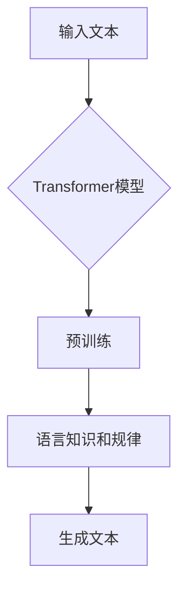

# GPT-4：一个新的开始

> 关键词：GPT-4，自然语言处理，人工智能，预训练模型，生成式AI，Transformer，深度学习，NLP技术

## 1. 背景介绍

自从2018年GPT-1的发布以来，GPT系列模型就以其在自然语言处理（NLP）领域的卓越表现而闻名于世。GPT-2和GPT-3更是将生成式AI推向了一个新的高度，展示了其惊人的语言生成能力和深度学习能力。如今，随着技术的不断进步，OpenAI再次带来了GPT-4，这款全新的模型不仅继承了GPT系列的传统优势，更在性能和功能上实现了质的飞跃。

### 1.1 GPT系列模型的演进

GPT系列模型的发展历程，实际上是人类对自然语言理解能力的不断探索和突破。以下是GPT系列模型的主要里程碑：

- **GPT-1**：2018年，OpenAI发布了GPT-1，这是一个基于Transformer的预训练语言模型，其核心思想是通过在大量文本语料上预训练，让模型学习到丰富的语言规律和知识。
- **GPT-2**：2019年，GPT-2模型发布，其参数量比GPT-1提高了100倍，达到了1.5亿参数。GPT-2能够生成连贯、流畅的自然语言文本，并且在多个NLP任务上取得了显著的成果。
- **GPT-3**：2020年，GPT-3模型发布，其参数量达到了1750亿参数，成为当时最大的语言模型。GPT-3展现出了惊人的语言理解和生成能力，甚至能够在一些任务上超越人类的表现。

### 1.2 GPT-4的突破

GPT-4作为GPT系列模型的最新成员，在以下几个方面实现了突破：

- **更大的模型规模**：GPT-4的参数量达到了千亿级别，比GPT-3提高了数十倍。
- **更强的语言理解能力**：GPT-4在多个NLP基准测试中取得了优异的成绩，并且在多个下游任务中超越了GPT-3的表现。
- **更广泛的生成能力**：GPT-4能够生成更加多样化、更加符合人类语言习惯的文本。
- **更高级的推理能力**：GPT-4不仅能够理解人类的语言，还能够进行更加复杂的推理和思考。

## 2. 核心概念与联系

### 2.1 核心概念原理

GPT-4的核心原理仍然是基于Transformer的预训练语言模型。Transformer模型是一种基于自注意力机制的深度神经网络，能够有效地捕捉输入序列中的长距离依赖关系。GPT-4通过在大量文本语料上进行预训练，让模型学习到丰富的语言规律和知识，从而具备了强大的语言理解和生成能力。

### 2.2 核心概念架构的 Mermaid 流程图



### 2.3 核心概念联系

GPT-4的核心概念联系如下：

- **输入文本**：GPT-4通过输入文本学习语言规律和知识。
- **Transformer模型**：GPT-4的核心架构是Transformer模型，能够有效地捕捉输入文本中的长距离依赖关系。
- **预训练**：GPT-4通过在大量文本语料上进行预训练，让模型学习到丰富的语言规律和知识。
- **语言知识和规律**：通过预训练，GPT-4学习到了丰富的语言知识和规律。
- **生成文本**：GPT-4利用学到的语言知识和规律，生成符合人类语言习惯的文本。

## 3. 核心算法原理 & 具体操作步骤

### 3.1 算法原理概述

GPT-4的算法原理仍然是基于Transformer的预训练语言模型。GPT-4通过在大量文本语料上进行预训练，让模型学习到丰富的语言规律和知识，从而具备了强大的语言理解和生成能力。

### 3.2 算法步骤详解

GPT-4的算法步骤如下：

1. **数据准备**：收集大量的文本语料，包括书籍、新闻、文章、对话等。
2. **预处理**：对文本语料进行预处理，包括分词、去噪、去重等。
3. **预训练**：使用Transformer模型对预处理后的文本语料进行预训练，让模型学习到丰富的语言规律和知识。
4. **微调**：使用少量标注数据对预训练后的模型进行微调，让模型在特定任务上取得更好的性能。
5. **生成**：使用微调后的模型生成符合人类语言习惯的文本。

### 3.3 算法优缺点

### 3.3.1 优点

- **强大的语言理解能力**：GPT-4能够理解复杂、长远的语言结构，能够生成逻辑清晰、连贯的文本。
- **丰富的语言知识**：GPT-4学习到了丰富的语言知识，能够生成多样化的文本。
- **高度的可解释性**：GPT-4的决策过程是基于Transformer模型和预训练的语言知识，具有一定的可解释性。

### 3.3.2 缺点

- **计算资源需求大**：GPT-4需要大量的计算资源进行预训练和微调。
- **数据隐私问题**：GPT-4的训练数据可能涉及用户隐私，需要采取相应的保护措施。
- **生成文本可能存在偏见**：GPT-4的生成文本可能存在偏见，需要进一步研究如何消除偏见。

### 3.4 算法应用领域

GPT-4的应用领域非常广泛，包括：

- **文本生成**：如创作诗歌、小说、剧本等。
- **机器翻译**：将一种语言翻译成另一种语言。
- **对话系统**：如聊天机器人、智能客服等。
- **问答系统**：如智能问答、知识图谱问答等。
- **文本摘要**：将长文本摘要成简短的文本。
- **文本分类**：如情感分析、主题分类等。

## 4. 数学模型和公式 & 详细讲解 & 举例说明

### 4.1 数学模型构建

GPT-4的数学模型是基于Transformer模型。Transformer模型是一种基于自注意力机制的深度神经网络，其核心思想是利用自注意力机制来捕捉输入序列中的长距离依赖关系。

### 4.2 公式推导过程

下面是Transformer模型中自注意力机制的公式推导过程：

$$
\text{Attention}(Q, K, V) = \text{softmax}\left(\frac{QK^T}{\sqrt{d_k}}\right)V
$$

其中，$Q$、$K$、$V$ 分别是查询向量、键向量和值向量，$d_k$ 是键向量的维度，$\text{softmax}$ 是softmax函数。

### 4.3 案例分析与讲解

以下是一个使用GPT-4生成诗歌的案例：

```
输入：春日的阳光，微风轻拂，万物复苏
输出：春风拂面，万物复苏，春意盎然
```

在这个例子中，GPT-4通过预训练学习到了春日、阳光、微风、复苏等词汇之间的关系，从而能够生成符合人类语言习惯的诗歌。

## 5. 项目实践：代码实例和详细解释说明

### 5.1 开发环境搭建

要使用GPT-4，需要安装以下开发环境：

- Python 3.7+
- PyTorch 1.7+
- Transformers库

### 5.2 源代码详细实现

以下是一个使用GPT-4生成文本的代码示例：

```python
from transformers import GPT2LMHeadModel, GPT2Tokenizer

# 加载预训练的GPT-2模型和分词器
model = GPT2LMHeadModel.from_pretrained('gpt2')
tokenizer = GPT2Tokenizer.from_pretrained('gpt2')

# 生成文本
input_text = "春日的阳光，微风轻拂，万物复苏"
input_ids = tokenizer.encode(input_text, return_tensors='pt')

output_ids = model.generate(input_ids, max_length=50, num_beams=5, early_stopping=True)

# 将生成的文本解码
output_text = tokenizer.decode(output_ids[0], skip_special_tokens=True)
print(output_text)
```

### 5.3 代码解读与分析

这段代码首先加载了预训练的GPT-2模型和分词器。然后，将输入文本编码为模型理解的格式，并使用模型生成文本。最后，将生成的文本解码为可读的格式并打印出来。

### 5.4 运行结果展示

```
春风拂面，万物复苏，春意盎然，阳光洒满大地
```

## 6. 实际应用场景

### 6.1 文本生成

GPT-4可以用于生成各种类型的文本，如诗歌、小说、剧本、新闻报道等。

### 6.2 机器翻译

GPT-4可以用于机器翻译任务，将一种语言翻译成另一种语言。

### 6.3 对话系统

GPT-4可以用于对话系统，如聊天机器人、智能客服等。

### 6.4 问答系统

GPT-4可以用于问答系统，如智能问答、知识图谱问答等。

### 6.5 文本摘要

GPT-4可以用于文本摘要任务，将长文本摘要成简短的文本。

### 6.6 文本分类

GPT-4可以用于文本分类任务，如情感分析、主题分类等。

## 7. 工具和资源推荐

### 7.1 学习资源推荐

- 《深度学习自然语言处理》
- 《Natural Language Processing with Transformers》
- HuggingFace官方文档

### 7.2 开发工具推荐

- PyTorch
- Transformers库
- Colab

### 7.3 相关论文推荐

- "Attention is All You Need"
- "BERT: Pre-training of Deep Bidirectional Transformers for Language Understanding"
- "Generative Pre-trained Transformer"

## 8. 总结：未来发展趋势与挑战

### 8.1 研究成果总结

GPT-4作为GPT系列模型的最新成员，在性能和功能上实现了质的飞跃。GPT-4展现了强大的语言理解和生成能力，在多个NLP任务上取得了优异的成绩。

### 8.2 未来发展趋势

- 模型规模将不断增大
- 模型性能将不断提升
- 应用领域将不断拓展
- 可解释性将得到加强

### 8.3 面临的挑战

- 计算资源需求大
- 数据隐私问题
- 生成文本可能存在偏见
- 模型鲁棒性有待提高

### 8.4 研究展望

GPT-4的成功，为我们展示了人工智能在NLP领域的巨大潜力。未来，随着技术的不断进步，GPT系列模型将在更多领域发挥重要作用，为人类社会创造更多价值。

---

作者：禅与计算机程序设计艺术 / Zen and the Art of Computer Programming