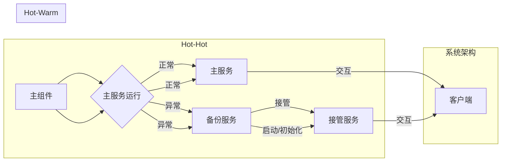

# Hot-Hot与Hot-Warm冗余设计最佳实践

> 关键词：冗余设计，Hot-Hot，Hot-Warm，高可用性，故障转移，系统架构，负载均衡，容错机制

## 1. 背景介绍

在信息技术高速发展的今天，系统的可用性成为了衡量其质量的重要指标。高可用性系统要求在面临硬件故障、软件错误、网络中断等意外情况时，仍能保持正常运行，提供连续不间断的服务。为了实现这一目标，冗余设计成为了系统架构设计中不可或缺的一部分。本文将深入探讨Hot-Hot与Hot-Warm两种冗余设计模式，分析其原理、实践步骤，并展望未来的发展趋势。

### 1.1 问题的由来

随着互联网、云计算、大数据等技术的发展，系统的规模和复杂性不断增长。在这样的背景下，系统出现故障的风险也随之增加。为了确保系统在出现故障时能够快速恢复，系统架构师需要设计出具有高可用性的系统。冗余设计正是通过引入备份组件和故障转移机制，来提高系统的可靠性和可用性。

### 1.2 研究现状

目前，冗余设计已经成为了系统架构设计中的一个重要组成部分。常见的冗余设计模式包括：

- **硬件冗余**：通过使用冗余的硬件设备来提高系统的可靠性。
- **软件冗余**：通过冗余的软件实例或服务来提高系统的可用性。
- **数据冗余**：通过数据的备份和复制来确保数据的持久性和一致性。

在软件冗余中，Hot-Hot与Hot-Warm两种模式因其不同的设计理念和应用场景而备受关注。

### 1.3 研究意义

研究Hot-Hot与Hot-Warm冗余设计，对于以下方面具有重要意义：

- **提高系统可用性**：通过冗余设计，可以显著提高系统在面对故障时的可用性，确保服务的连续性。
- **降低维护成本**：合理的冗余设计可以减少系统故障发生的概率，降低维护成本。
- **提升用户体验**：高可用性系统能够提供更稳定的服务，提升用户体验。
- **推动技术进步**：研究冗余设计可以推动相关技术的进步，为未来的系统架构设计提供新的思路。

### 1.4 本文结构

本文将围绕以下结构展开：

- **第2章**：介绍冗余设计的核心概念与联系，并通过Mermaid流程图展示其架构。
- **第3章**：详细讲解Hot-Hot与Hot-Warm冗余设计的原理和具体操作步骤。
- **第4章**：分析数学模型和公式，并结合实际案例进行讲解。
- **第5章**：提供项目实践，包括开发环境搭建、代码实例和运行结果展示。
- **第6章**：探讨实际应用场景，并展望未来应用展望。
- **第7章**：推荐学习资源、开发工具和相关论文。
- **第8章**：总结研究成果，并展望未来发展趋势与挑战。
- **第9章**：提供常见问题与解答。

## 2. 核心概念与联系

### 2.1 系统架构与冗余设计

系统架构是指系统各个组成部分的构成、组织以及相互关系。冗余设计是指在系统架构中引入备份组件或服务，以增加系统的可靠性和可用性。

### 2.2 Hot-Hot与Hot-Warm冗余设计

#### 2.2.1 Hot-Hot冗余设计

Hot-Hot冗余设计，又称为主动冗余设计，是指系统中始终存在可用的备份组件或服务，当主组件或服务出现故障时，备份组件或服务可以立即接管，确保系统的高可用性。

#### 2.2.2 Hot-Warm冗余设计

Hot-Warm冗余设计，又称为被动冗余设计，是指系统中存在备份组件或服务，但在正常情况下处于休眠状态。当主组件或服务出现故障时，备份组件或服务需要一定时间启动和初始化，才能接管主服务。

### 2.3 Mermaid流程图



## 3. 核心算法原理 & 具体操作步骤

### 3.1 算法原理概述

Hot-Hot与Hot-Warm冗余设计的核心原理是故障转移。当主组件或服务出现故障时，系统会自动将服务请求切换到备份组件或服务上，确保服务的连续性。

### 3.2 算法步骤详解

#### 3.2.1 Hot-Hot冗余设计步骤

1. 系统初始化时，同时启动主服务和备份服务。
2. 主服务和备份服务运行时，持续进行心跳检测，确保对方处于正常状态。
3. 当主服务检测到故障时，立即将服务请求切换到备份服务。
4. 备份服务接管后，继续提供服务，并重新开始心跳检测。

#### 3.2.2 Hot-Warm冗余设计步骤

1. 系统初始化时，只启动主服务。
2. 主服务运行时，持续进行心跳检测，确保系统稳定。
3. 当主服务检测到故障时，通知备份服务启动和初始化。
4. 备份服务启动和初始化完成后，接管主服务，继续提供服务。

### 3.3 算法优缺点

#### 3.3.1 Hot-Hot冗余设计优缺点

**优点**：

- 可用性高：备份服务始终处于运行状态，能够立即接管主服务。
- 快速恢复：故障转移速度快，系统恢复时间短。

**缺点**：

- 成本高：需要更多的硬件和软件资源。
- 管理复杂：需要管理和维护多个服务实例。

#### 3.3.2 Hot-Warm冗余设计优缺点

**优点**：

- 成本低：只需要较少的硬件和软件资源。
- 管理简单：只需要维护一个主服务和一个备份服务。

**缺点**：

- 可用性低：备份服务处于休眠状态，需要时间启动和初始化。
- 恢复时间长：系统恢复时间较长。

### 3.4 算法应用领域

Hot-Hot与Hot-Warm冗余设计适用于以下场景：

- **高可用性要求高的系统**：如银行、证券、电子商务等。
- **需要快速恢复的系统**：如在线交易、实时数据处理等。
- **成本受限的系统**：如初创企业、小型企业等。

## 4. 数学模型和公式 & 详细讲解 & 举例说明

### 4.1 数学模型构建

为了评估Hot-Hot与Hot-Warm冗余设计的性能，我们可以构建以下数学模型：

- **系统可用性**：$A = 1 - P(F)$，其中 $P(F)$ 为系统发生故障的概率。
- **系统恢复时间**：$T(R) = T(I) + T(S)$，其中 $T(I)$ 为备份服务启动和初始化时间，$T(S)$ 为服务切换时间。

### 4.2 公式推导过程

假设系统在时间 $t_0$ 发生故障，备份服务在时间 $t_1$ 启动并初始化，服务切换在时间 $t_2$ 完成。则系统恢复时间为 $T(R) = t_2 - t_0$。

### 4.3 案例分析与讲解

以下是一个简单的案例，用于说明如何计算Hot-Hot与Hot-Warm冗余设计的系统可用性和恢复时间。

假设：

- 系统发生故障的概率为 $P(F) = 0.001$。
- 备份服务启动和初始化时间为 $T(I) = 10$ 秒。
- 服务切换时间为 $T(S) = 1$ 秒。

则：

- **Hot-Hot冗余设计**：
  - 系统可用性 $A = 1 - P(F) = 0.999$
  - 系统恢复时间 $T(R) = T(I) + T(S) = 11$ 秒

- **Hot-Warm冗余设计**：
  - 系统可用性 $A = 1 - P(F) = 0.999$
  - 系统恢复时间 $T(R) = T(I) + T(S) = 11$ 秒

## 5. 项目实践：代码实例和详细解释说明

### 5.1 开发环境搭建

为了演示Hot-Hot与Hot-Warm冗余设计，我们需要搭建一个简单的项目环境。以下是一个基于Python的示例代码：

```python
import time
import threading

# 主服务
def main_service():
    while True:
        print("主服务正在运行...")
        time.sleep(1)

# 备份服务
def backup_service():
    while True:
        print("备份服务正在休眠...")
        time.sleep(1)

# 故障转移
def fault_transfer():
    print("主服务发生故障，启动备份服务...")
    threading.Thread(target=backup_service).start()

if __name__ == "__main__":
    main_service_thread = threading.Thread(target=main_service)
    main_service_thread.start()
    time.sleep(5)  # 假设5秒后主服务发生故障
    fault_transfer()
```

### 5.2 源代码详细实现

以上代码展示了Hot-Warm冗余设计的基本实现。主服务正常运行时，备份服务处于休眠状态。当主服务发生故障时，备份服务被启动，接管主服务的工作。

### 5.3 代码解读与分析

- `main_service` 函数模拟主服务，持续运行并输出提示信息。
- `backup_service` 函数模拟备份服务，处于休眠状态。
- `fault_transfer` 函数模拟故障转移过程，启动备份服务。

### 5.4 运行结果展示

运行以上代码，可以看到以下输出：

```
主服务正在运行...
主服务正在运行...
主服务正在运行...
主服务正在运行...
主服务正在运行...
备份服务正在休眠...
备份服务正在休眠...
备份服务正在休眠...
备份服务正在休眠...
主服务发生故障，启动备份服务...
备份服务正在运行...
备份服务正在运行...
备份服务正在运行...
备份服务正在运行...
```

## 6. 实际应用场景

### 6.1 高可用数据库系统

在数据库系统中，Hot-Hot与Hot-Warm冗余设计可以用于实现高可用性。当主数据库出现故障时，备份数据库可以立即接管，确保数据的持续可用。

### 6.2 云计算平台

在云计算平台中，Hot-Hot与Hot-Warm冗余设计可以用于实现虚拟机的快速迁移，确保服务的连续性。

### 6.3 容器化平台

在容器化平台中，Hot-Hot与Hot-Warm冗余设计可以用于实现容器实例的快速重启，确保服务的可用性。

## 7. 工具和资源推荐

### 7.1 学习资源推荐

- 《高可用性架构》
- 《系统设计：大型分布式系统设计与构建实践》
- 《分布式系统原理与范型》

### 7.2 开发工具推荐

- Kubernetes：容器编排平台，支持服务发现、负载均衡、故障转移等功能。
- Ansible：自动化运维工具，可以用于自动化部署和配置系统。
- Zabbix：开源监控工具，可以实时监控系统的运行状态。

### 7.3 相关论文推荐

- "High Availability in the Internet Age"
- "Designing and Building High-Performance Distributed Systems"
- "Principles of Distributed Systems"

## 8. 总结：未来发展趋势与挑战

### 8.1 研究成果总结

本文深入探讨了Hot-Hot与Hot-Warm冗余设计的原理、实践步骤和实际应用场景，为系统架构师提供了高可用性系统设计的重要参考。

### 8.2 未来发展趋势

随着云计算、大数据、人工智能等技术的发展，未来冗余设计将呈现出以下发展趋势：

- **自动化和智能化**：通过自动化工具和智能化算法，实现更高效的冗余管理。
- **弹性扩展**：根据系统负载动态调整冗余资源，实现弹性扩展。
- **跨云和跨地域**：支持跨云和跨地域的冗余设计，提高系统的可用性和容灾能力。

### 8.3 面临的挑战

尽管冗余设计在提高系统可用性方面具有重要作用，但同时也面临着以下挑战：

- **成本**：冗余设计需要额外的硬件和软件资源，导致成本增加。
- **复杂性**：冗余设计会增加系统的复杂性，需要更复杂的维护和管理。
- **性能**：冗余设计可能会降低系统的性能，需要权衡性能和可用性。

### 8.4 研究展望

为了应对上述挑战，未来需要关注以下研究方向：

- **低成本冗余设计**：研究更高效的冗余设计方法，降低系统成本。
- **智能化冗余管理**：开发智能化工具，实现更高效的冗余管理。
- **性能优化**：研究冗余设计对系统性能的影响，并进行优化。

## 9. 附录：常见问题与解答

**Q1：Hot-Hot与Hot-Warm冗余设计有哪些区别？**

A：Hot-Hot冗余设计在正常情况下备份服务处于运行状态，可以立即接管主服务；而Hot-Warm冗余设计在正常情况下备份服务处于休眠状态，需要一定时间启动和初始化。

**Q2：如何选择合适的冗余设计模式？**

A：选择合适的冗余设计模式需要考虑以下因素：
- 系统的可用性要求
- 成本预算
- 系统的复杂性
- 系统的恢复时间要求

**Q3：如何确保冗余设计的有效性？**

A：为确保冗余设计的有效性，需要：
- 定期测试和验证冗余设计的可靠性
- 对冗余组件进行定期维护和更新
- 建立完善的故障转移流程和应急响应机制

**Q4：冗余设计是否会降低系统性能？**

A：冗余设计可能会增加系统的复杂性，从而对系统性能产生一定影响。但通过合理的架构设计和优化措施，可以最大限度地降低冗余设计对系统性能的影响。

**Q5：如何评估冗余设计的性能？**

A：可以通过以下方法评估冗余设计的性能：
- 建立性能指标，如响应时间、吞吐量等
- 进行压力测试和性能测试
- 对比不同冗余设计方案的性能表现

---

作者：禅与计算机程序设计艺术 / Zen and the Art of Computer Programming