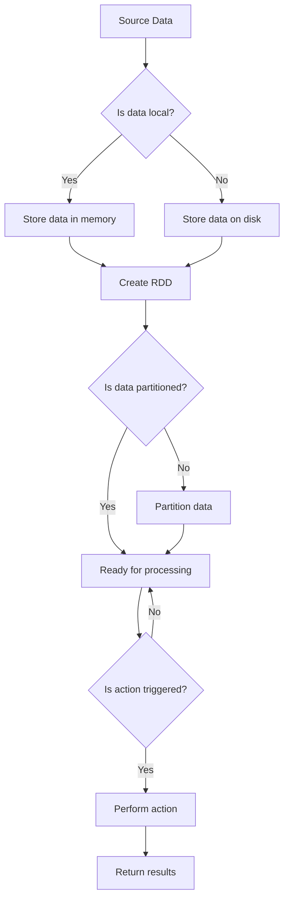

# RDD原理与代码实例讲解

> 关键词：RDD, 分布式计算，Apache Spark，弹性分布式数据集，弹性，容错，并行处理

## 1. 背景介绍

随着大数据时代的到来，数据量呈爆炸式增长，传统的数据处理方法已无法满足大规模数据处理的效率需求。Apache Spark作为一种新兴的大数据处理框架，因其高效、易用、容错等优点，成为了数据处理领域的热门技术。RDD（Resilient Distributed Dataset）是Spark的核心抽象，它将数据分布存储在集群的各个节点上，并提供了强大的分布式计算能力。本文将深入探讨RDD的原理，并通过代码实例进行讲解。

## 2. 核心概念与联系

### 2.1 核心概念

#### 2.1.1 RDD

RDD（Resilient Distributed Dataset）即弹性分布式数据集，是Spark的核心抽象。它是一个不可变的、可分区的数据集合，可以存储在内存或磁盘上。RDD具有以下特点：

- **不可变性**：RDD中的数据一旦创建，就不能被修改。
- **分布性**：RDD的数据被分布式存储在集群的各个节点上。
- **弹性**：当集群中的节点失败时，Spark会自动从其他节点恢复数据。
- **可分区**：RDD可以细分为多个分区，每个分区可以独立处理。

#### 2.1.2 Action操作

Action操作会触发RDD的真正计算过程，并返回一个结果。常见的Action操作包括：

- `count()`：返回RDD中元素的数量。
- `collect()`：将RDD中的所有元素收集到一个数组中。
- `take(n)`：返回RDD中的前n个元素。
- `saveAsTextFile(path)`：将RDD保存为文本文件。

#### 2.1.3 Transformation操作

Transformation操作会创建一个新的RDD。常见的Transformation操作包括：

- `map()`：对RDD中的每个元素应用一个函数。
- `filter()`：过滤出符合条件的元素。
- `flatMap()`：将每个元素映射为一个序列。
- `reduce()`：对RDD中的元素进行聚合。

### 2.2 核心概念原理和架构的 Mermaid 流程图



## 3. 核心算法原理 & 具体操作步骤

### 3.1 算法原理概述

Spark的RDD通过以下步骤实现分布式计算：

1. **创建RDD**：将数据源（如HDFS、Hive表等）中的数据转换为RDD。
2. **执行Transformation操作**：对RDD进行Transformation操作，创建新的RDD。
3. **触发Action操作**：触发Action操作，触发RDD的计算过程，并返回结果。

### 3.2 算法步骤详解

#### 3.2.1 创建RDD

Spark提供了多种方式创建RDD，包括：

- 从本地集合创建RDD：`sc.parallelize(data)`
- 从HDFS读取数据创建RDD：`sc.textFile(path)`
- 从其他RDD转换创建RDD：`newRDD = originalRDD.map(lambda x: ...)`等

#### 3.2.2 执行Transformation操作

Transformation操作会触发惰性求值，不会立即执行计算。只有触发Action操作时，才会进行实际计算。

#### 3.2.3 触发Action操作

触发Action操作后，Spark会根据RDD的依赖关系构建一个DAG（有向无环图），并按顺序执行各个Transformation操作。

### 3.3 算法优缺点

#### 3.3.1 优点

- **弹性**：当节点失败时，Spark可以自动从其他节点恢复数据。
- **容错**：Spark可以处理节点故障，确保计算过程不会中断。
- **高效**：Spark提供了多种优化策略，如Shuffle优化、内存管理优化等。

#### 3.3.2 缺点

- **学习曲线**：Spark的学习曲线相对较陡峭，需要一定的时间来掌握。
- **资源消耗**：Spark需要较多的计算资源，包括CPU、内存等。

### 3.4 算法应用领域

Spark的RDD可以应用于各种大数据处理任务，包括：

- 数据清洗
- 数据分析
- 数据挖掘
- 图计算

## 4. 数学模型和公式 & 详细讲解 & 举例说明

### 4.1 数学模型构建

RDD的数学模型可以表示为以下公式：

$$
RDD = \{ r_1, r_2, ..., r_n \}
$$

其中，$r_i$ 表示RDD中的第i个元素。

### 4.2 公式推导过程

RDD的公式推导过程如下：

1. 创建RDD：从数据源读取数据，转换为RDD。
2. 执行Transformation操作：对RDD进行操作，创建新的RDD。
3. 触发Action操作：触发RDD的计算过程，并返回结果。

### 4.3 案例分析与讲解

以下是一个简单的Spark代码示例，用于计算Word Count：

```python
from pyspark import SparkContext

# 创建SparkContext
sc = SparkContext("local", "WordCount")

# 创建RDD
words = sc.parallelize(["hello", "world", "hello", "spark"])

# 执行Transformation操作
word_counts = words.map(lambda word: (word, 1)).reduceByKey(lambda a, b: a + b)

# 触发Action操作
result = word_counts.collect()

# 打印结果
for (word, count) in result:
    print(f"{word}: {count}")

# 关闭SparkContext
sc.stop()
```

在上述代码中，首先创建了SparkContext，并从本地集合创建了一个包含单词的RDD。然后，对RDD执行了map()和reduceByKey() Transformation操作，最后触发collect() Action操作，将结果打印出来。

## 5. 项目实践：代码实例和详细解释说明

### 5.1 开发环境搭建

要运行Spark代码，需要以下开发环境：

- Java开发环境
- Scala开发环境（可选）
- PySpark开发环境（可选）
- Spark安装包

### 5.2 源代码详细实现

以下是一个简单的Spark Python代码示例，用于计算Word Count：

```python
from pyspark import SparkContext

# 创建SparkContext
sc = SparkContext("local", "WordCount")

# 创建RDD
words = sc.parallelize(["hello", "world", "hello", "spark"])

# 执行Transformation操作
word_counts = words.map(lambda word: (word, 1)).reduceByKey(lambda a, b: a + b)

# 触发Action操作
result = word_counts.collect()

# 打印结果
for (word, count) in result:
    print(f"{word}: {count}")

# 关闭SparkContext
sc.stop()
```

### 5.3 代码解读与分析

在上述代码中，首先创建了SparkContext，并从本地集合创建了一个包含单词的RDD。然后，对RDD执行了map()和reduceByKey() Transformation操作，最后触发collect() Action操作，将结果打印出来。

- `sc.parallelize(["hello", "world", "hello", "spark"])`：将本地集合转换为RDD。
- `words.map(lambda word: (word, 1))`：将每个单词映射为一个键值对，键为单词本身，值为1。
- `reduceByKey(lambda a, b: a + b)`：将具有相同键的值进行聚合。

### 5.4 运行结果展示

运行上述代码后，将打印出以下结果：

```
hello: 2
world: 1
spark: 1
```

## 6. 实际应用场景

Spark的RDD在多个实际应用场景中得到了广泛应用，以下是一些常见的应用场景：

- 数据清洗：清洗和转换大规模数据集。
- 数据分析：分析用户行为、市场趋势等。
- 数据挖掘：挖掘数据中的模式和关联性。
- 图计算：计算社交网络中的各种图算法。

## 7. 工具和资源推荐

### 7.1 学习资源推荐

- 《Spark技术内幕》：深入解析Spark的原理和实现，适合对Spark有较深入了解的开发者。
- 《Spark快速大数据处理》：介绍Spark的基本概念和操作，适合初学者。

### 7.2 开发工具推荐

- PySpark：Spark的Python API，适用于Python开发者。
- Spark-submit：提交Spark作业的命令行工具。

### 7.3 相关论文推荐

- "Spark: A Distributed Data-Flow Engine for Large-Scale Cluster Computing"：Spark的原始论文，详细介绍了Spark的设计和实现。

## 8. 总结：未来发展趋势与挑战

### 8.1 研究成果总结

Spark的RDD作为一种高效、易用的分布式计算框架，在数据处理领域取得了显著的成果。RDD的弹性、容错和高效等特点，使其成为了大数据处理领域的热门技术。

### 8.2 未来发展趋势

- 支持更多数据源和格式的数据。
- 提供更多高级抽象和API。
- 提升性能和效率。
- 增强易用性和可扩展性。

### 8.3 面临的挑战

- 提高Spark的性能和效率。
- 降低Spark的学习曲线。
- 增强Spark的可扩展性。
- 提高Spark的易用性。

### 8.4 研究展望

Spark的RDD将继续在数据处理领域发挥重要作用。未来的研究将集中在以下几个方面：

- 提高Spark的性能和效率。
- 降低Spark的学习曲线。
- 增强Spark的可扩展性和易用性。
- 探索Spark在更多领域的应用。

## 9. 附录：常见问题与解答

**Q1：什么是RDD？**

A：RDD是弹性分布式数据集，是Spark的核心抽象。它是一个不可变的、可分区的数据集合，可以存储在内存或磁盘上。

**Q2：RDD有哪些优点？**

A：RDD具有以下优点：

- 弹性：当节点失败时，Spark可以自动从其他节点恢复数据。
- 容错：Spark可以处理节点故障，确保计算过程不会中断。
- 高效：Spark提供了多种优化策略，如Shuffle优化、内存管理优化等。

**Q3：RDD有哪些缺点？**

A：RDD的缺点包括：

- 学习曲线：Spark的学习曲线相对较陡峭，需要一定的时间来掌握。
- 资源消耗：Spark需要较多的计算资源，包括CPU、内存等。

**Q4：Spark的RDD可以应用于哪些领域？**

A：Spark的RDD可以应用于以下领域：

- 数据清洗
- 数据分析
- 数据挖掘
- 图计算

---

作者：禅与计算机程序设计艺术 / Zen and the Art of Computer Programming